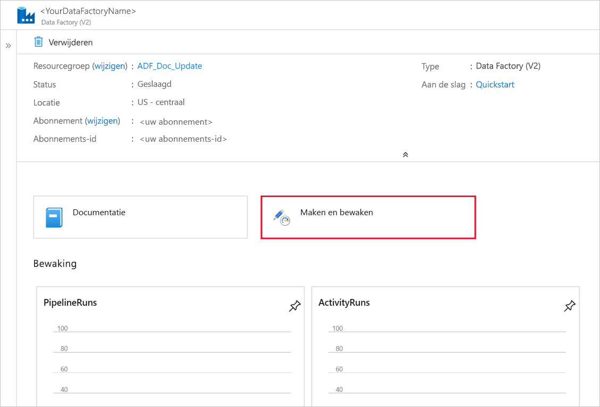
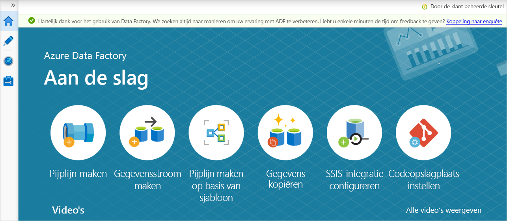

# <a name="copy-data-from-an-on-premises-sql-server-database-to-azure-blob-storage"></a>Gegevens van een on-premises SQL-serverdatabase naar Azure Blob Storage kopiëren
In deze zelfstudie gebruikt u de gebruikersinterface (UI) van Azure Data Factory om een pijplijn voor een data factory te maken waarmee gegevens worden gekopieerd van een on-premises SQL Server-database naar Azure Blob-opslag. U gaat een zelf-hostende Integration Runtime maken en gebruiken. Deze verplaatst gegevens van on-premises gegevensarchieven en gegevensarchieven in de cloud en omgekeerd.

> [!NOTE]
> Dit artikel is geen gedetailleerde introductie tot Data Factory. Zie [Inleiding tot Data Factory](introduction.md) voor meer informatie. 

In deze zelfstudie voert u de volgende stappen uit:

> [!div class="checklist"]
> * Maak een gegevensfactory.
> * Een zelf-hostende Integration Runtime maken.
> * Gekoppelde services maken voor SQL Server en Azure Storage. 
> * Gegevenssets maken voor SQL Server en Azure Blob.
> * Een pijplijn maakt met een kopieeractiviteit om de gegevens te verplaatsen.
> * Start een pijplijnuitvoering.
> * Controleer de pijplijnuitvoering.

## <a name="prerequisites"></a>Vereisten
### <a name="azure-subscription"></a>Azure-abonnement
Als u nog geen abonnement op Azure hebt, maak dan een [gratis account](https://azure.microsoft.com/free/) aan voordat u begint.

### <a name="azure-roles"></a>Azure-rollen
Als u data factory-exemplaren wilt maken, moet het gebruikersaccount waarmee u zich bij Azure aanmeldt, toegewezen zijn aan de rollen *Inzender* of *Eigenaar*, of moet dit een *beheerder* van het Azure-abonnement zijn. 

Ga naar Azure Portal als u de machtigingen wilt weergeven die u hebt in het abonnement. Selecteer uw gebruikersnaam in de rechterbovenhoek en selecteer vervolgens **Machtigingen**. Als u toegang tot meerdere abonnementen hebt, moet u het juiste abonnement selecteren. Zie [Toegang beheren met RBAC en de Azure-portal](../role-based-access-control/role-assignments-portal.md) voor voorbeeldinstructies voor het toevoegen van een gebruiker aan een rol.

### <a name="sql-server-2014-2016-and-2017"></a>SQL Server 2014, 2016 en 2017
In deze zelfstudie gebruikt u een on-premises SQL Server-database als een *brongegevensopslag*. De pijplijn in de data factory die u in deze zelfstudie gaat maken, kopieert gegevens van deze on-premises SQL Server-database (bron) naar Blob-opslag (sink). Maak een tabel met de naam **emp** in uw SQL Server-database en voeg een aantal voorbeeldgegevens toe aan de tabel. 

1. Start SQL Server Management Studio. Als dit niet al is geïnstalleerd op uw computer, gaat u naar [SQL Server Management Studio downloaden](https://docs.microsoft.com/sql/ssms/download-sql-server-management-studio-ssms). 

1. Maak verbinding met SQL Server-exemplaar met behulp van uw referenties. 

1. Maak een voorbeelddatabase. Klik in de structuurweergave met de rechtermuisknop op **Databases** en selecteer **Nieuwe database**. 
1. Voer in het venster **Nieuwe database** een naam in voor de database en selecteer **OK**. 

1. Voer het volgende queryscript uit voor de database. Hiermee wordt de **emp**-tabel gemaakt en worden enkele voorbeeldgegevens ingevoegd in deze tabel. In de structuurweergave klikt u met de rechtermuisknop op de database die u hebt gemaakt en selecteert u **Nieuwe query**.

   ```
    CREATE TABLE dbo.emp
    (
        ID int IDENTITY(1,1) NOT NULL,
        FirstName varchar(50),
        LastName varchar(50)
    )
    GO
    
    INSERT INTO emp (FirstName, LastName) VALUES ('John', 'Doe')
    INSERT INTO emp (FirstName, LastName) VALUES ('Jane', 'Doe')
    GO
   ```

### <a name="azure-storage-account"></a>Azure Storage-account
In deze zelfstudie gaat u een algemeen Azure Storage-account (en dan met name Blob Storage) gebruiken als een doel/sink-gegevensopslag. Zie het artikel [Een opslagaccount maken](../storage/common/storage-quickstart-create-account.md) als u geen Azure Storage-account hebt voor algemene doeleinden. De pijplijn in de data factory die u in deze zelfstudie gaat maken, kopieert gegevens van deze on-premises SQL Server-database (bron) naar Blob Storage (sink). 

#### <a name="get-the-storage-account-name-and-account-key"></a>De naam en sleutel van een opslagaccount ophalen
In deze zelfstudie gaat u de naam en sleutel van uw opslagaccount gebruiken. Voer de volgende stappen uit om de naam en sleutel van uw opslagaccount op te halen: 

1. Meld u aan bij [Azure Portal](https://portal.azure.com) met uw Azure-gebruikersnaam en -wachtwoord. 

1. Selecteer **alle services**in het linkerdeel venster. Filter met behulp van het sleutelwoord **Opslag** en selecteer vervolgens **Opslagaccounts**.

    

1. Filter, indien nodig, in de lijst met opslag accounts op uw opslag account. Selecteer vervolgens uw opslagaccount. 

1. Selecteer in het venster **Opslagaccount** de optie **Toegangssleutels**.

1. Kopieer de waarden in de vakken **opslagaccountnaam** en **key1** en plak deze in Kladblok of een andere editor voor later gebruik in de zelfstudie. 

#### <a name="create-the-adftutorial-container"></a>De container adftutorial maken 
In deze sectie maakt u in uw Blob Storage een blobcontainer met de naam **adftutorial**. 

1. Ga in het venster **Opslagaccount** naar **Overzicht** en selecteer vervolgens **Blobs**. 

    

1. Selecteer in het venster **Blob-service** **Container**. 

1. In het venster **Nieuwe container** voert u bij **Naam** **adftutorial** in. Selecteer vervolgens **OK**. 

1. Selecteer **adftutorial** in de lijst met containers.

1. Houd het venster **Container** voor **adftutorial** geopend. U gaat hiermee aan het einde van deze zelfstudie de uitvoer controleren. In Data Factory wordt automatisch in deze container de uitvoermap gemaakt, zodat u er zelf geen hoeft te maken.

## <a name="create-a-data-factory"></a>Een data factory maken
In deze stap maakt u een data factory en start u de Data Factory-gebruikersinterface om een pijplijn te maken in de data factory. 

1. Open de webbrowser **Microsoft Edge** of **Google Chrome**. Op dit moment wordt de Data Factory-gebruikersinterface alleen ondersteund in de webbrowsers Microsoft Edge en Google Chrome.
1. Selecteer in het menu aan de linkerkant **een resource maken** > **Analytics** > **Data Factory**:
   
   

1. Voer op de pagina **Nieuwe data factory** **ADFTutorialDataFactory** in bij **Naam**. 

   De naam van de data factory moet *wereldwijd uniek* zijn. Als het volgende foutbericht wordt weergegeven voor het naamveld, wijzigt u de naam van de data factory (bijvoorbeeld uwnaamADFTutorialDataFactory). Zie [Data Factory naming rules](naming-rules.md) (Naamgevingsregels Data Factory) voor meer informatie over naamgevingsregels voor Data Factory-artefacten.

   

1. Selecteer het Azure-**abonnement** waarin u de data factory wilt maken.
1. Voer een van de volgende stappen uit voor **Resourcegroep**:
   
   - Selecteer **Bestaande gebruiken** en selecteer een bestaande resourcegroep in de vervolgkeuzelijst.

   - Selecteer **Nieuwe maken** en voer de naam van een resourcegroep in.
        
     Zie [Resourcegroepen gebruiken om Azure-resources te beheren](../azure-resource-manager/resource-group-overview.md) voor meer informatie.
1. Selecteer **V2** onder **Versie**.
1. Selecteer bij **Locatie** de locatie voor de data factory. In de vervolgkeuzelijst worden alleen ondersteunde locaties weergegeven. De gegevensarchieven (bijvoorbeeld Storage en SQL Database) en -berekeningen (bijvoorbeeld Azure HDInsight) die door Data Factory worden gebruikt, kunnen zich in andere regio's bevinden.
1. Selecteer **Maken**.

1. Na het aanmaken ziet u de pagina **Data Factory** zoals weergegeven in de afbeelding:
   
    
1. Selecteer de tegel **Maken en controleren** om de Data Factory-UI te openen op een afzonderlijk tabblad. 


## <a name="create-a-pipeline"></a>Een pijplijn maken

1. Selecteer op de pagina **Aan de slag** de optie **Pijplijn maken**. Er wordt automatisch een pijplijn voor u gemaakt. U ziet de pijplijn in de structuurweergave en de bijbehorende editor wordt geopend. 

   

1. Voer op het tabblad **Algemeen** onder in het venster **Eigenschappen** de **naam** **SQLServerToBlobPipeline**in.

   

1. Vouw in het dialoog venster **activiteiten** het onderdeel **& trans formatie verplaatsen**uit. Gebruik slepen en neerzetten om de activiteit **Kopiëren** naar het ontwerpoppervlak van de pijplijn te verplaatsen. Stel de naam van de activiteit in op **CopySqlServerToAzureBlobActivity**.

1. Ga in het venster **Eigenschappen** naar het tabblad **Bron** en selecteer **+ Nieuw**.

1. Zoek in het dialoog venster **nieuwe gegevensset** naar **SQL Server**. Selecteer **SQL Server**en selecteer vervolgens **door gaan**. 

1. Voer in het dialoog venster **Eigenschappen instellen** onder **naam** **SqlServerDataset**in. Onder **gekoppelde service**selecteert u **+ Nieuw**. In deze stap maakt u een verbinding met het brongegevensexemplaar (SQL Server-database). 

1. Voeg in het dialoog venster **nieuwe gekoppelde service** **naam** toe als **SqlServerLinkedService**. Selecteer **+ Nieuw**onder **verbinden via Integration runtime**.  In deze sectie kunt u een zelf-hostende Integration Runtime maken en deze koppelen aan een on-premises computer met de SQL Server-database. De zelf-hostende Integration Runtime is het onderdeel waarmee gegevens worden gekopieerd van SQL Server-database op uw computer naar Blob Storage. 

1. Selecteer in het dialoog venster **Integration runtime instellen** de optie **zelf gehost**en selecteer vervolgens **volgende**. 

1. Voer onder naam **TutorialIntegrationRuntime**in. Selecteer vervolgens **Volgende**.

1. Selecteer bij instellingen **de optie Klik hier om de snelle installatie voor deze computer te starten**. Met deze actie wordt de Integration runtime op uw computer geïnstalleerd en geregistreerd bij Data Factory. U kunt er ook voor kiezen om handmatig te configureren door het installatiebestand te downloaden, uit te voeren, en de sleutel te gebruiken om de integratieruntime te registreren. 

1. Selecteer **Sluiten** in het venster **Snelle installatie van integratieruntime (zelf-hostend)** . 

    

1. Controleer in het dialoog venster **nieuwe gekoppelde service** of **TutorialIntegrationRuntime** is geselecteerd onder **verbinden via Integration runtime**. Voer vervolgens de volgende stappen uit:

    a. Voer **SqlServerLinkedService** in bij **Naam**.

    b. Voer de naam van uw SQL Server-exemplaar in bij **Servernaam**. 

    c. Geef de naam van de database met de **emp**-tabel op bij **Databasenaam**.

    d. Selecteer bij **Verificatietype** het juiste verificatietype in dat in Data Factory moet worden gebruikt om verbinding te maken met uw SQL Server-database.

    e. Bij **Gebruikersnaam** en **Wachtwoord**, typt u de gebruikersnaam en het wachtwoord. Als u een backslash wilt gebruiken (\\) in de naam van uw gebruikersaccount of server, moet u er voor het escapeteken (\\) gebruiken. Gebruik bijvoorbeeld *mydomain\\\\myuser*.

    f. Selecteer **Verbinding testen**. Deze stap is om te bevestigen dat Data Factory verbinding kan maken met uw SQL Server-Data Base met behulp van de zelf-hostende Integration runtime die u hebt gemaakt.

    g. Selecteer **Voltooien** om de gekoppelde service op te slaan.

1. Als het goed is, ziet u nu het venster met de geopende brongegevensset weer. Voer in het tabblad **Verbinding** in het venster **Eigenschappen** de volgende stappen uit: 

    a. Controleer of in **Gekoppelde service** **SqlServerLinkedService** wordt weergegeven.

    b. Selecteer bij **Tabel** **[dbo].[emp]** .

1. Ga naar het tabblad met de **SQLServerToBlobPipeline** of selecteer **SQLServerToBlobPipeline** in de structuurweergave. 

1. Ga naar het tabblad **Sink** onder in het venster **Eigenschappen** en selecteer **+ Nieuw**. 

1. Selecteer in het dialoog venster **nieuwe gegevensset** de optie **Azure Blob Storage**. Selecteer vervolgens **Doorgaan**. 

1. Kies in het dialoog venster **indeling selecteren** het notatie type van uw gegevens. Selecteer vervolgens **Doorgaan**. 

    

1. Voer in het dialoog venster **set** -eigenschappen **AzureBlobDataset** in als naam. Klik naast het tekstvak **Gekoppelde service** op **+Nieuw**.

1. Voer in het dialoog venster **nieuwe gekoppelde service (Azure Blob Storage)** **AzureStorageLinkedService** als naam in, selecteer uw opslag account in de lijst naam van het **opslag account** . Test de verbinding en selecteer vervolgens **volt ooien** om de gekoppelde service te implementeren.
1. Nadat de gekoppelde service is gemaakt, keert u terug naar de pagina **Eigenschappen instellen** . Selecteer **Doorgaan**.

1. Als het goed is, ziet u nu het venster met de geopende sink-gegevensset weer. Voer op het tabblad **Verbinding** de volgende stappen uit: 

    a. Controleer of **AzureStorageLinkedService** is geselecteerd bij **Gekoppelde service**.
  
    b. Voer **in bestandspad** **adftutorial/fromonprem** in voor het onderdeel **container/Directory** . Als de uitvoermap niet bestaat in de container adftutorial, wordt de uitvoermap automatisch gemaakt door Data Factory.
    
    c. Selecteer voor het **Bestands** onderdeel **dynamische inhoud toevoegen**.
    

    d. Voeg `@CONCAT(pipeline().RunId, '.txt')`toe en selecteer vervolgens **volt ooien**. Met deze actie wordt de naam van het bestand gewijzigd in PipelineRunID. txt. 

1. Ga naar het tabblad met de pijplijn geopend of selecteer de pijplijn in de structuurweergave. Controleer of **AzureBlobDataset** is geselecteerd bij **Sink-gegevensset**.

1. Selecteer in de werkbalk de optie **Valideren** om de instellingen voor de pijplijn te valideren. Sluit het **Validatierapport voor de pijplijn** door **Sluiten** te selecteren. 

1. Als u entiteiten die u hebt gemaakt, naar Data Factory wilt publiceren, selecteert u **Alles publiceren**.

1. Wacht tot u de pop-up **Het publiceren is voltooid** ziet. Als u de status van de publicatie wilt controleren, selecteert u de koppeling **meldingen weer geven** boven aan het venster. Selecteer **Sluiten** als u het meldingenvenster wilt sluiten. 


## <a name="trigger-a-pipeline-run"></a>Een pijplijnuitvoering activeren
Selecteer **trigger toevoegen** op de werk balk voor de pijp lijn en selecteer **nu activeren**.

## <a name="monitor-the-pipeline-run"></a>De pijplijnuitvoering controleren.

1. Ga naar het tabblad **monitor** . U ziet de pijp lijn die u hand matig hebt geactiveerd in de vorige stap. 

    
1. Uitvoeringen van activiteiten die aan de pijplijn zijn gekoppeld, kunt u bekijken door de koppeling **Uitvoeringen van activiteiten weergeven** in de kolom **Actions** te selecteren. U ziet alleen uitvoeringen van activiteiten omdat er slechts één activiteit in de pijp lijn is. Selecteer de koppeling **Details** (pictogram van een bril) in de kolom **Acties** om details over de kopieerbewerking te zien. Als u wilt terugkeren naar de weer gave pijplijn uitvoeringen, selecteert u **pijp lijnen** bovenaan.

## <a name="verify-the-output"></a>De uitvoer controleren
De uitvoermap *fromonprem* wordt automatisch door de pijplijn gemaakt in de `adftutorial` blobcontainer. Controleer of u het bestand *[pipeline().RunId].txt* in de uitvoermap ziet. 


## <a name="next-steps"></a>Volgende stappen
Met de pijplijn in dit voorbeeld worden gegevens gekopieerd van de ene locatie naar een andere locatie in Blob Storage. U hebt geleerd hoe u:

> [!div class="checklist"]
> * Maak een gegevensfactory.
> * Een zelf-hostende Integration Runtime maken.
> * Gekoppelde services maakt voor SQL Server en Storage. 
> * Gegevenssets maakt voor SQL Server en Blob Storage.
> * Een pijplijn maakt met een kopieeractiviteit om de gegevens te verplaatsen.
> * Start een pijplijnuitvoering.
> * Controleer de pijplijnuitvoering.

Zie [Ondersteunde gegevensopslagexemplaren](copy-activity-overview.md#supported-data-stores-and-formats) voor een lijst met gegevensopslagexemplaren die worden ondersteund door Data Factory.

Ga door naar de volgende zelfstudie voor informatie over het bulksgewijs kopiëren van gegevens uit een bron naar een bestemming:

> [!div class="nextstepaction"]
>[Gegevens bulksgewijs kopiëren](tutorial-bulk-copy-portal.md)