# <a name="data-management-gateway"></a>Gegevensbeheergateway
> [!NOTE]
> Dit artikel is van toepassing op versie 1 van Data Factory. Als u de huidige versie van de Data Factory-service gebruikt, raadpleegt u [zelf-hostende Integration runtime in](../create-self-hosted-integration-runtime.md).

> [!NOTE]
> Data Management Gateway is nu opnieuw aangemerkt als zelf-hosted Integration Runtime.

De Data Management Gateway is een client agent die u in uw on-premises omgeving moet installeren om gegevens te kopiëren tussen de Cloud en on-premises gegevens opslag. De on-premises gegevens archieven die door Data Factory worden ondersteund, worden weer gegeven in de sectie [ondersteunde gegevens bronnen](data-factory-data-movement-activities.md#supported-data-stores-and-formats) .

Dit artikel vormt een aanvulling op de stapsgewijze instructies in het artikel [gegevens verplaatsen tussen on-premises en Cloud gegevens opslag](data-factory-move-data-between-onprem-and-cloud.md) . In de walkthrough maakt u een pijp lijn die gebruikmaakt van de gateway om gegevens te verplaatsen van een on-premises SQL Server Data Base naar een Azure-Blob. In dit artikel vindt u gedetailleerde informatie over de Data Management Gateway.

U kunt een Data Management Gateway uitschalen door meerdere on-premises machines aan de gateway te koppelen. U kunt omhoog schalen door het aantal gegevens verplaatsings taken te verhogen dat gelijktijdig kan worden uitgevoerd op een knoop punt. Deze functie is ook beschikbaar voor een logische gateway met één knoop punt. Zie [gegevens beheer gateway schalen in azure Data Factory](data-factory-data-management-gateway-high-availability-scalability.md) artikel voor meer informatie.

> [!NOTE]
> Op dit moment ondersteunt de gateway alleen de activiteit Kopieer activiteit en opgeslagen procedure in Data Factory. Het is niet mogelijk om de gateway van een aangepaste activiteit te gebruiken voor toegang tot on-premises gegevens bronnen.

[!INCLUDE [updated-for-az](../../../includes/updated-for-az.md)]

## <a name="overview"></a>Overzicht
### <a name="capabilities-of-data-management-gateway"></a>Mogelijkheden van Data Management Gateway
Data Management Gateway biedt de volgende mogelijkheden:

* On-premises gegevens bronnen en gegevens bronnen in de Cloud op dezelfde data factory model leren en gegevens verplaatsen.
* U hebt een enkel glas venster voor bewaking en beheer met zicht baarheid van de gateway status op de pagina Data Factory.
* Beheer de toegang tot on-premises gegevens bronnen veilig.
  * Er zijn geen wijzigingen vereist voor de bedrijfs firewall. Gateway maakt alleen uitgaande HTTP-verbindingen voor het openen van Internet.
  * Versleutel de referenties voor uw on-premises gegevens archieven met uw certificaat.
* Gegevens efficiënt verplaatsen: gegevens worden parallel overgebracht naar onregelmatige netwerk problemen met een automatische nieuwe logica.

### <a name="command-flow-and-data-flow"></a>Opdracht stroom en gegevens stroom
Wanneer u een Kopieer activiteit gebruikt voor het kopiëren van gegevens tussen on-premises en de Cloud, gebruikt de activiteit een gateway voor het overdragen van gegevens van de on-premises gegevens bron naar de Cloud en vice versa.

Dit is de gegevens stroom op hoog niveau voor en een samen vatting van de stappen voor kopiëren met data gateway: 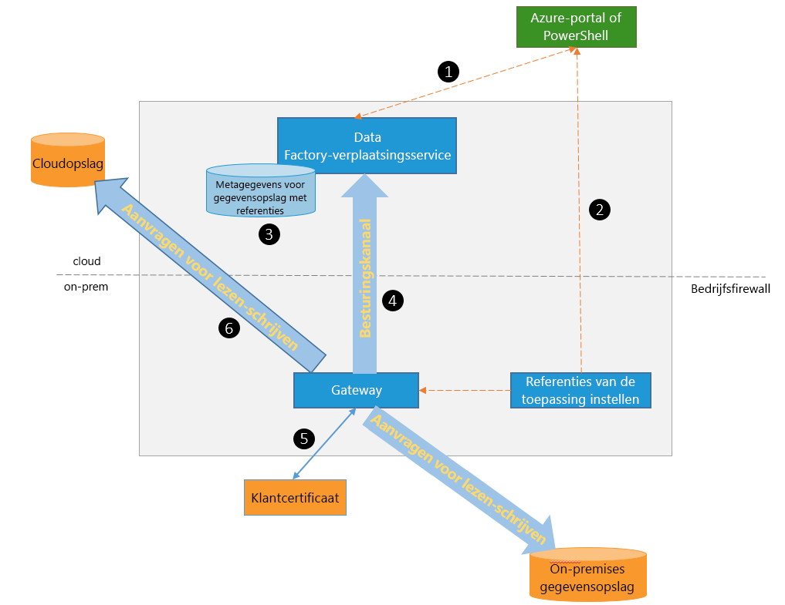

1. Data Developer maakt een gateway voor een Azure Data Factory met behulp van de [Azure Portal](https://portal.azure.com) -of [Power shell-cmdlet](https://docs.microsoft.com/powershell/module/az.datafactory/).
2. Data Developer maakt een gekoppelde service voor een on-premises gegevens opslag door de gateway op te geven. Als onderdeel van het instellen van de gekoppelde service gebruikt data Developer de toepassing voor het instellen van referenties om verificatie typen en referenties op te geven. Het dialoog venster referenties voor instelling instellen communiceert met het gegevens archief om de verbinding en de gateway te testen om referenties op te slaan.
3. De gateway versleutelt de referenties met het certificaat dat is gekoppeld aan de gateway (geleverd door de gegevens ontwikkelaar) voordat de referenties in de cloud worden opgeslagen.
4. Data Factory service communiceert met de gateway voor het plannen van & beheer van taken via een besturings kanaal dat gebruikmaakt van een gedeelde Azure service bus-wachtrij. Wanneer de taak voor het kopiëren van een Kopieer activiteit moet worden uitgeschakeld, wordt de aanvraag samen met de referentie gegevens Data Factory in de wachtrij geplaatst. De gateway start de taak na het navragen van de wachtrij.
5. De gateway ontsleutelt de referenties met hetzelfde certificaat en maakt vervolgens verbinding met het on-premises gegevens archief met het juiste verificatie type en referenties.
6. De gateway kopieert gegevens van een on-premises opslag naar een Cloud opslag, of andersom, afhankelijk van de manier waarop de Kopieer activiteit is geconfigureerd in de gegevens pijplijn. Voor deze stap communiceert de gateway rechtstreeks met opslag Services op basis van de Cloud, zoals Azure Blob Storage via een beveiligd kanaal (HTTPS).

### <a name="considerations-for-using-gateway"></a>Overwegingen voor het gebruik van Gateway
* Eén exemplaar van Data Management Gateway kan worden gebruikt voor meerdere on-premises gegevens bronnen. **Eén gateway-exemplaar is echter slechts aan één Azure Data Factory gebonden** en kan niet worden gedeeld met een andere Data Factory.
* U kunt **slechts één exemplaar van Data Management Gateway** op één computer installeren. Stel dat u twee gegevens fabrieken hebt die toegang nodig hebben tot on-premises gegevens bronnen. u moet gateways op twee on-premises computers installeren. Met andere woorden, een gateway is gekoppeld aan een specifieke data factory
* De **gateway hoeft zich niet op dezelfde computer als de gegevens bron te**bevindt. Als de gateway dichter bij de gegevens bron ligt, verkort de gateway echter om verbinding te maken met de gegevens bron. U wordt aangeraden de gateway te installeren op een computer die verschilt van de-host die wordt gehost op een on-premises gegevens bron. Wanneer de gateway en gegevens bron zich op verschillende computers bevinden, maakt de gateway geen concurrentie voor resources met een gegevens bron.
* U kunt **meerdere gateways op verschillende computers hebben die verbinding maken met dezelfde on-premises gegevens bron**. U kunt bijvoorbeeld twee gateways hebben die twee gegevens fabrieken bieden, maar dezelfde on-premises gegevens bron wordt geregistreerd met de gegevens fabrieken.
* Als u al een gateway op uw computer hebt geïnstalleerd voor een **Power bi** scenario, installeert u een **afzonderlijke gateway voor Azure Data Factory** op een andere computer.
* De gateway moet worden gebruikt, zelfs wanneer u **ExpressRoute**gebruikt.
* Behandel uw gegevens bron als een on-premises gegevens bron (die zich achter een firewall bevindt), zelfs wanneer u **ExpressRoute**gebruikt. Gebruik de gateway om connectiviteit tussen de service en de gegevens bron tot stand te brengen.
* U moet **de gateway ook gebruiken** als het gegevens archief zich in de Cloud op een **Azure IaaS VM**bevindt.

## <a name="installation"></a>Installeren
### <a name="prerequisites"></a>Vereisten
* De ondersteunde **besturingssysteem** versies zijn Windows 7, Windows 8/8.1, Windows 10, windows server 2008 R2, windows server 2012, windows server 2012 R2. De installatie van de Data Management Gateway op een domein controller wordt momenteel niet ondersteund.
* .NET Framework 4.5.1 of hoger is vereist. Als u de gateway installeert op een Windows 7-computer, installeert u .NET Framework 4,5 of hoger. Zie [.NET Framework systeem vereisten](https://msdn.microsoft.com/library/8z6watww.aspx) voor meer informatie.
* De aanbevolen **configuratie** voor de gateway computer is ten minste 2 GHz, 4 kernen, 8 GB RAM-geheugen en een schijf van 80 GB.
* Als de hostmachine in de slaap stand wordt gezet, reageert de gateway niet op gegevens aanvragen. Configureer daarom een passend **Energiebeheer schema** op de computer voordat u de gateway installeert. Als de computer is geconfigureerd voor de slaap stand, wordt een bericht door de gateway-installatie gevraagd.
* U moet een beheerder op de computer zijn om de Data Management Gateway te kunnen installeren en configureren. U kunt extra gebruikers toevoegen aan de lokale Windows-groep **Data Management Gateway-gebruikers** . De leden van deze groep kunnen het **Data Management Gateway Configuration Manager** -hulp programma gebruiken om de gateway te configureren.

Als de uitvoering van de Kopieer activiteit plaatsvindt volgens een specifieke frequentie, volgt het resource gebruik (CPU, geheugen) op de machine ook hetzelfde patroon met piek-en inactieve tijden. Het resource gebruik is ook afhankelijk van de hoeveelheid gegevens die wordt verplaatst. Wanneer er meerdere Kopieer taken worden uitgevoerd, ziet u het resource gebruik tijdens piek tijden.

### <a name="installation-options"></a>Installatie opties
Data Management Gateway kan op de volgende manieren worden geïnstalleerd:

* Door een MSI-installatie pakket te downloaden van het [micro soft Download centrum](https://www.microsoft.com/download/details.aspx?id=39717). Het MSI-bestand kan ook worden gebruikt voor het bijwerken van bestaande Data Management gateway naar de nieuwste versie, waarbij alle instellingen behouden blijven.
* Door te klikken op de koppeling **gegevens gateway downloaden en installeren** onder hand matige installatie of **rechtstreeks op deze computer installeren** onder snelle installatie. Zie [gegevens verplaatsen tussen on-premises en Cloud](data-factory-move-data-between-onprem-and-cloud.md) artikel voor stapsgewijze instructies voor het gebruik van snelle installatie. Met de stap hand matig gaat u naar het Download centrum. De instructies voor het downloaden en installeren van de gateway vanuit het Download centrum bevinden zich in de volgende sectie.

### <a name="installation-best-practices"></a>Aanbevolen procedures voor installatie:
1. Configureer het energiebeheer schema op de hostcomputer voor de gateway, zodat de computer niet in de sluimer stand wordt gezet. Als de hostmachine in de slaap stand wordt gezet, reageert de gateway niet op gegevens aanvragen.
2. Maak een back-up van het certificaat dat is gekoppeld aan de gateway.

### <a name="install-the-gateway-from-download-center"></a>De gateway installeren vanuit het Download centrum
1. Ga naar de [Download pagina van micro soft data management gateway](https://www.microsoft.com/download/details.aspx?id=39717).
2. Klik op **downloaden**, selecteer de **64-bits** versie (32-bits wordt niet meer ondersteund) en klik op **volgende**.
3. Voer het **MSI** -bestand rechtstreeks uit of sla het op de vaste schijf op en voer uit.
4. Selecteer op de pagina **Welkom** een **taal** en klik op **volgende**.
5. **Accepteer** de gebruiksrecht overeenkomst en klik op **volgende**.
6. Selecteer **map** om de gateway te installeren en klik op **volgende**.
7. Klik op de pagina **gereed voor installatie** op **installeren**.
8. Klik op **volt ooien** om de installatie te volt ooien.
9. Haal de sleutel op uit het Azure Portal. Zie de volgende sectie voor stapsgewijze instructies.
10. Voer de volgende stappen uit op de pagina de **Gateway registreren** van **Data Management Gateway Configuration Manager** op uw computer wordt uitgevoerd:
    1. Plak de sleutel in de tekst.
    2. Klik desgewenst op **Gateway sleutel weer geven** om de sleutel tekst te bekijken.
    3. Klik op **registreren**.

### <a name="register-gateway-using-key"></a>Gateway registreren met sleutel
#### <a name="if-you-havent-already-created-a-logical-gateway-in-the-portal"></a>Als u nog geen logische gateway hebt gemaakt in de portal
Als u een gateway wilt maken in de portal en de sleutel wilt ophalen op de pagina **configureren** , volgt u de stappen in het artikel [gegevens verplaatsen tussen on-premises en de Cloud](data-factory-move-data-between-onprem-and-cloud.md) .

#### <a name="if-you-have-already-created-the-logical-gateway-in-the-portal"></a>Als u de logische gateway al hebt gemaakt in de portal
1. Ga in Azure Portal naar de pagina **Data Factory** en klik op de tegel **gekoppelde services** .

    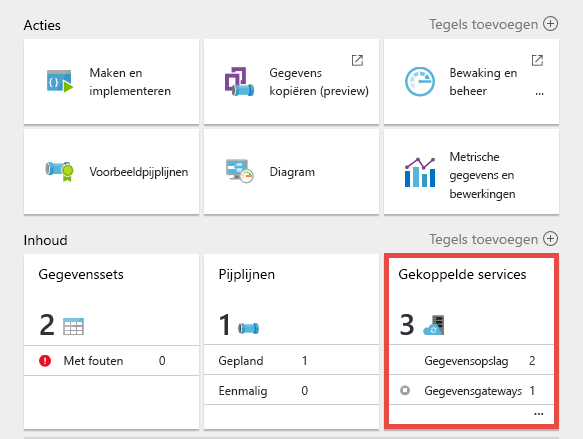
2. Selecteer op de pagina **gekoppelde services** de logische **Gateway** die u in de portal hebt gemaakt.

    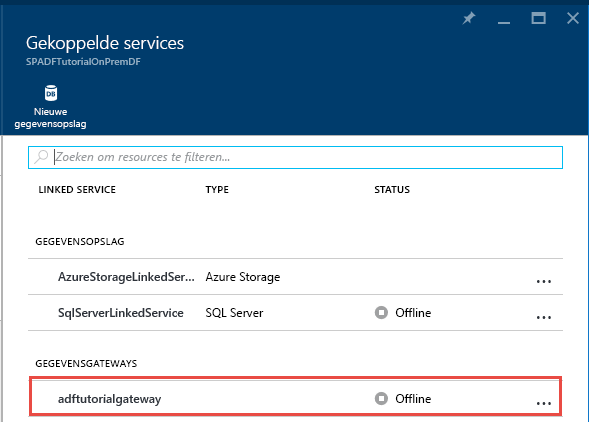
3. Klik op de pagina **gegevens gateway** op **gegevens gateway downloaden en installeren**.

    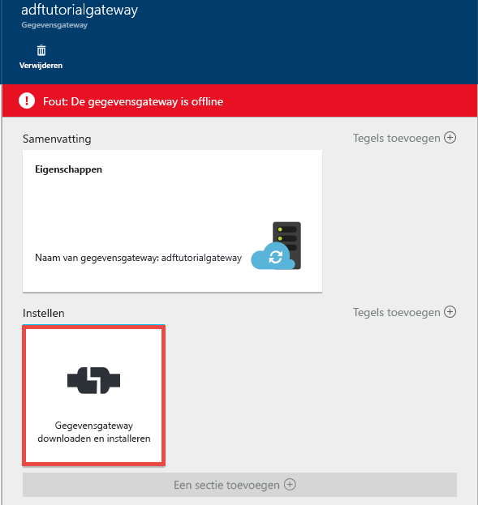
4. Klik op de pagina **configureren** op **sleutel opnieuw maken**. Klik op Ja in het waarschuwings bericht nadat u het zorgvuldig hebt gelezen.

    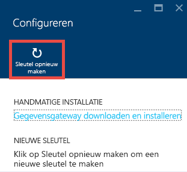
5. Klik op de knop kopiëren naast de sleutel. De sleutel wordt gekopieerd naar het klem bord.

    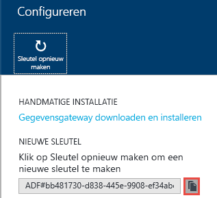

### <a name="system-tray-icons-notifications"></a>Pictogrammen van systeemvak/meldingen
In de volgende afbeelding ziet u enkele van de tray-pictogrammen die u ziet.

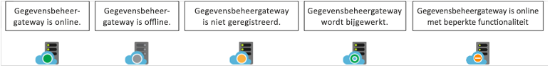

Als u de cursor over het pictogram van de systeemvak/het meldings bericht beweegt, ziet u details over de status van de gateway/update-bewerking in een pop-upvenster.

### <a name="ports-and-firewall"></a>Poorten en firewall
Er zijn twee firewalls die u moet overwegen: **bedrijfs firewall** die wordt uitgevoerd op de centrale router van de organisatie en **Windows Firewall** geconfigureerd als een daemon op de lokale computer waarop de gateway is geïnstalleerd.

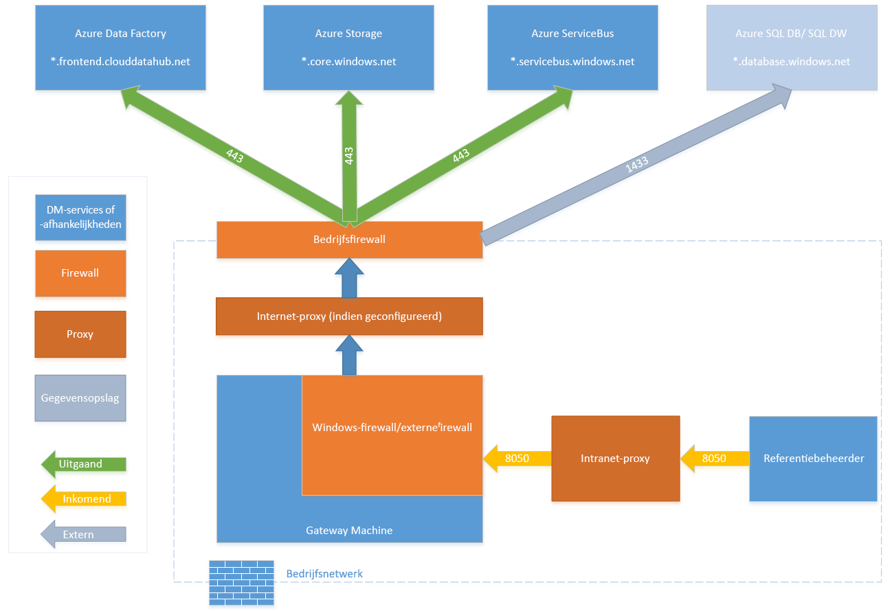

Op het niveau van de bedrijfs firewall moet u de volgende domeinen en uitgaande poorten configureren:

| Domein namen | Poorten | Beschrijving |
| --- | --- | --- |
| *.servicebus.windows.net |443 |Wordt gebruikt voor communicatie met de back-end van de service voor gegevens verplaatsing |
| *. core.windows.net |443 |Gebruikt voor gefaseerde kopie met behulp van Azure-Blob (indien geconfigureerd)|
| *. frontend.clouddatahub.net |443 |Wordt gebruikt voor communicatie met de back-end van de service voor gegevens verplaatsing |
| *.servicebus.windows.net |9350-9354, 5671 |Optionele service bus relay via TCP die wordt gebruikt door de wizard kopiëren |

Op het niveau van Windows Firewall worden deze uitgaande poorten normaal gesp roken ingeschakeld. Als dat niet het geval is, kunt u de domeinen en poorten dienovereenkomstig configureren op de gateway computer.

> [!NOTE]
> 1. Op basis van uw bron/sinks moet u mogelijk extra domeinen en uitgaande poorten in uw bedrijfs-white list of Windows Firewall.
> 2. Voor sommige Cloud databases (bijvoorbeeld [Azure SQL database](https://docs.microsoft.com/azure/sql-database/sql-database-configure-firewall-settings), [Azure data Lake](https://docs.microsoft.com/azure/data-lake-store/data-lake-store-secure-data#set-ip-address-range-for-data-access)enzovoort), moet u het IP-adres van de gateway computer mogelijk white list in de firewall configuratie.
>
>

#### <a name="copy-data-from-a-source-data-store-to-a-sink-data-store"></a>Gegevens uit een brongegevens archief naar een Sink-gegevens archief kopiëren
Zorg ervoor dat de firewall regels correct zijn ingeschakeld op de firewall van het bedrijf, Windows Firewall op de gateway computer en het gegevens archief zelf. Als u deze regels inschakelt, kan de gateway verbinding maken met zowel de bron-als de sink. Schakel regels in voor elk gegevens archief dat is betrokken bij de Kopieer bewerking.

Als u bijvoorbeeld wilt kopiëren van **een on-premises gegevens archief naar een Azure SQL database sink of een Azure SQL Data Warehouse Sink**, voert u de volgende stappen uit:

* Uitgaande **TCP** -communicatie toestaan op poort **1433** voor zowel Windows Firewall als bedrijfs firewall.
* Configureer de firewall instellingen van Azure SQL Server om het IP-adres van de gateway computer toe te voegen aan de lijst met toegestane IP-adressen.

> [!NOTE]
> Als uw firewall geen uitgaande poort 1433 toestaat, kan de gateway niet rechtstreeks toegang krijgen tot Azure SQL. In dit geval kunt u een [gefaseerde kopie](https://docs.microsoft.com/azure/data-factory/data-factory-copy-activity-performance#staged-copy) gebruiken om SQL Azure data base/SQL Azure DW. In dit scenario zou u alleen HTTPS (poort 443) nodig hebben voor de verplaatsing van gegevens.
>
>

### <a name="proxy-server-considerations"></a>Overwegingen voor de proxy server
Als uw bedrijfs netwerk omgeving gebruikmaakt van een proxy server voor toegang tot internet, moet u Data Management gateway configureren voor het gebruik van de juiste proxy-instellingen. U kunt de proxy instellen tijdens de eerste registratie fase.

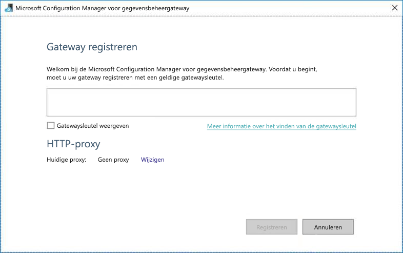

De gateway maakt gebruik van de proxy server om verbinding te maken met de Cloud service. Klik op de koppeling **wijzigen** tijdens de eerste installatie. U ziet het dialoog venster **proxy-instelling** .

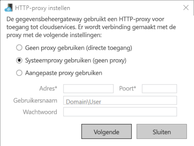

Er zijn drie configuratie opties:

* **Proxy niet gebruiken**: gateway maakt geen expliciet gebruik van een proxy om verbinding te maken met Cloud Services.
* **Systeem proxy gebruiken**: gateway maakt gebruik van de proxy-instelling die is geconfigureerd in diahost. exe. config en diawp. exe. config. Als er geen proxy is geconfigureerd in diahost. exe. config en diawp. exe. config, maakt gateway rechtstreeks verbinding met de Cloud service zonder dat de proxy wordt door lopen.
* **Aangepaste proxy gebruiken**: Configureer de http-proxy-instelling voor gebruik voor gateway in plaats van configuraties te gebruiken in diahost. exe. config en diawp. exe. config. Adres en poort zijn vereist. Gebruikers naam en wacht woord zijn optioneel, afhankelijk van de verificatie-instelling van uw proxy. Alle instellingen worden versleuteld met het referentie certificaat van de gateway en lokaal opgeslagen op de hostserver van de gateway.

De Data Management Gateway-hostservice wordt automatisch opnieuw opgestart nadat u de bijgewerkte proxy-instellingen hebt opgeslagen.

Nadat de registratie van de gateway is voltooid, gebruikt u Data Management Gateway Configuration Manager om de proxy-instellingen weer te geven of bij te werken.

1. Start **Data Management Gateway Configuration Manager**.
2. Schakel over naar het tabblad **Instellingen**.
3. Klik op koppeling **wijzigen** in de sectie **http-proxy** om het dialoog venster **http-proxy instellen** te openen.
4. Nadat u op de knop **volgende** hebt geklikt, wordt er een waarschuwings venster weer gegeven waarin u wordt gevraagd om de proxy instelling op te slaan en de gateway-hostservice opnieuw op te starten.

U kunt de HTTP-proxy bekijken en bijwerken met behulp van Configuration Manager-hulp programma.

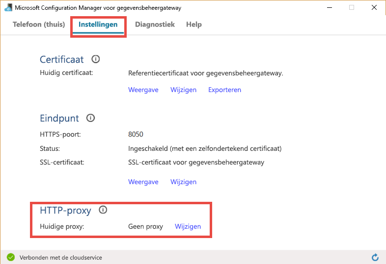

> [!NOTE]
> Als u een proxy server met NTLM-verificatie instelt, wordt de host-service van de gateway uitgevoerd onder het domein account. Als u het wacht woord voor het domein account later wijzigt, vergeet dan niet om de configuratie-instellingen voor de service bij te werken en deze vervolgens dienovereenkomstig opnieuw op te starten. Vanwege deze vereiste raden we u aan een speciaal domein account te gebruiken voor toegang tot de proxy server waarvoor u het wacht woord regel matig niet hoeft bij te werken.
>
>

### <a name="configure-proxy-server-settings"></a>Proxyserver instellingen configureren
Als u de instelling **systeem proxy gebruiken** voor de http-proxy selecteert, gebruikt gateway de proxy-instelling in diahost. exe. config en diawp. exe. config. Als er geen proxy is opgegeven in diahost. exe. config en diawp. exe. config, maakt gateway rechtstreeks verbinding met de Cloud service zonder dat de proxy wordt door gegeven. De volgende procedure bevat instructies voor het bijwerken van het bestand diahost. exe. config.

1. Maak in Verkenner een veilige kopie van *C:\\\\programma bestanden\\micro soft Data Management Gateway\\2,0\\gedeelde\\diahost. exe. config* om een back-up van het oorspronkelijke bestand te maken.
2. Start Notepad. exe, dat wordt uitgevoerd als beheerder en open tekst bestand *C:\\\\programma bestanden\\micro soft Data Management Gateway\\2,0\\\\diahost. exe. config*. U vindt de standaard code voor system.net, zoals wordt weer gegeven in de volgende code:

    ```
    <system.net>
        <defaultProxy useDefaultCredentials="true" />
    </system.net>
    ```

    U kunt vervolgens Details van de proxy server toevoegen, zoals wordt weer gegeven in het volgende voor beeld:

    ```
    <system.net>
        <defaultProxy enabled="true">
            <proxy bypassonlocal="true" proxyaddress="http://proxy.domain.org:8888/" />
        </defaultProxy>
    </system.net>
    ```

    Er zijn aanvullende eigenschappen toegestaan binnen het proxy-label om de vereiste instellingen op te geven, zoals scriptLocation. Raadpleeg het [proxy-element (netwerk instellingen)](https://msdn.microsoft.com/library/sa91de1e.aspx) op de syntaxis.

    ```
    <proxy autoDetect="true|false|unspecified" bypassonlocal="true|false|unspecified" proxyaddress="uriString" scriptLocation="uriString" usesystemdefault="true|false|unspecified "/>
    ```
3. Sla het configuratie bestand op de oorspronkelijke locatie op en start de Data Management Gateway host-service opnieuw op om de wijzigingen op te halen. Als u de service opnieuw wilt starten, gebruikt u het onderdeel Services van het configuratie scherm of klikt u in het **Data Management Gateway Configuration Manager** > op de knop **service stoppen** en klikt u vervolgens op service **starten**. Als de service niet wordt gestart, is er waarschijnlijk een onjuiste syntaxis voor de XML-code toegevoegd aan het configuratie bestand van de toepassing dat is bewerkt.

> [!IMPORTANT]
> Vergeet niet om **zowel** diahost. exe. config als diawp. exe. config bij te werken.

Naast deze punten moet u er ook voor zorgen dat Microsoft Azure zich in de white list van uw bedrijf bevindt. U kunt de lijst met geldige IP-adressen van Microsoft Azure downloaden van het [micro soft Download centrum](https://www.microsoft.com/download/details.aspx?id=41653).

#### <a name="possible-symptoms-for-firewall-and-proxy-server-related-issues"></a>Mogelijke symptomen voor problemen met de firewall en de proxy server
Als er fouten optreden die vergelijkbaar zijn met de volgende, wordt waarschijnlijk een onjuiste configuratie van de firewall of proxy server gegeven, waardoor de gateway geen verbinding kan maken met Data Factory om zichzelf te verifiëren. Raadpleeg de vorige sectie om te controleren of uw firewall en proxy server correct zijn geconfigureerd.

1. Wanneer u de gateway probeert te registreren, wordt het volgende fout bericht weer gegeven: "kan de gateway sleutel niet registreren. Voordat u probeert de gateway sleutel opnieuw te registreren, controleert u of de Data Management Gateway is verbonden en of de Data Management Gateway host-service is gestart.
2. Wanneer u Configuration Manager opent, ziet u de status ' losgekoppelded ' of ' verbinding maken '. Bij het weer geven van Windows-gebeurtenis logboeken, onder Logboeken >-logboeken van toepassingen en Services > Data Management Gateway, worden fout berichten weer gegeven, zoals de volgende fout: `Unable to connect to the remote server`
   `A component of Data Management Gateway has become unresponsive and restarts automatically. Component name: Gateway.`

### <a name="open-port-8050-for-credential-encryption"></a>Open poort 8050 voor referentie versleuteling
De toepassing voor het **instellen van referenties** gebruikt de binnenkomende poort **8050** om referenties om te leiden naar de gateway bij het instellen van een on-premises gekoppelde service in de Azure Portal. Tijdens de installatie van de gateway wordt de gateway installatie standaard geopend op de gateway computer.

Als u een firewall van derden gebruikt, kunt u de poort 8050 hand matig openen. Als u tijdens de installatie van de gateway een firewall probleem ondervindt, kunt u proberen de volgende opdracht te gebruiken om de gateway te installeren zonder de firewall te configureren.

    msiexec /q /i DataManagementGateway.msi NOFIREWALL=1

Als u ervoor kiest om poort 8050 op de gateway computer niet te openen, gebruikt u andere mechanismen dan het gebruik van de **instelling Referenties instellen** om referenties voor het gegevens archief te configureren. U kunt bijvoorbeeld de Power shell [-cmdlet New-AzDataFactoryEncryptValue](https://docs.microsoft.com/powershell/module/az.datafactory/new-azdatafactoryencryptvalue) gebruiken. Zie de sectie referenties en beveiliging instellen voor informatie over hoe gegevens archiefbestanden kunnen worden ingesteld.

## <a name="update"></a>Update
Data Management Gateway wordt standaard automatisch bijgewerkt wanneer er een nieuwere versie van de gateway beschikbaar is. De gateway wordt pas bijgewerkt als alle geplande taken zijn uitgevoerd. Er worden geen verdere taken verwerkt door de gateway totdat de update bewerking is voltooid. Als de update mislukt, wordt de gateway teruggezet naar de oude versie.

U ziet de geplande update tijd op de volgende locaties:

* De pagina eigenschappen van gateway in de Azure Portal.
* Start pagina van de Data Management Gateway Configuration Manager
* Meldings bericht van systeemvak.

Op het tabblad Start van de Data Management Gateway Configuration Manager de update planning en de laatste keer dat de gateway is geïnstalleerd of bijgewerkt.

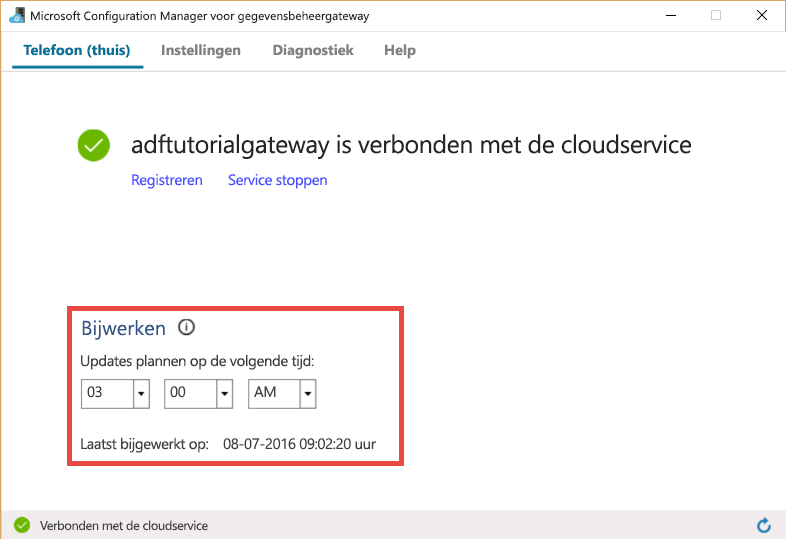

U kunt de update meteen installeren of wachten tot de gateway automatisch wordt bijgewerkt op het geplande tijdstip. In de volgende afbeelding ziet u bijvoorbeeld het meldings bericht dat in de gateway Configuration Manager wordt weer gegeven, samen met de knop bijwerken waarop u kunt klikken om deze direct te installeren.

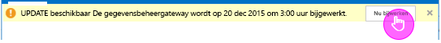

Het meldings bericht in het systeemvak ziet er ongeveer uit zoals in de volgende afbeelding:

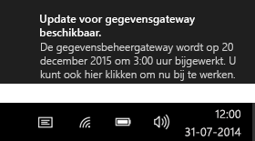

U ziet de status van de update bewerking (hand matig of automatisch) in het systeemvak. Wanneer u de gateway Configuration Manager volgende keer start, wordt er een bericht weer gegeven op de meldings balk dat de gateway is bijgewerkt, samen met een koppeling naar [het nieuwe onderwerp](data-factory-gateway-release-notes.md).

### <a name="to-disableenable-auto-update-feature"></a>De functie voor automatisch bijwerken uitschakelen/inschakelen
U kunt de functie voor automatisch bijwerken uitschakelen of inschakelen door de volgende stappen uit te voeren:

[Voor gateway met één knoop punt]
1. Start Windows Power shell op de gateway computer.
2. Ga naar de map *C:\\\\programma bestanden\\Microsoft Integration Runtime\\3,0\\PowerShellScript\\* .
3. Voer de volgende opdracht uit om de functie voor automatisch bijwerken uit te scha kelen (uitschakelen).

    ```powershell
    .\IntegrationRuntimeAutoUpdateToggle.ps1 -off
    ```
4. Om het weer in te scha kelen:

    ```powershell
    .\IntegrationRuntimeAutoUpdateToggle.ps1 -on
    ```
   [Voor Maxi maal beschik bare en schaal bare gateway met meerdere knoop punten](data-factory-data-management-gateway-high-availability-scalability.md)
1. Start Windows Power shell op de gateway computer.
2. Ga naar de map *C:\\\\programma bestanden\\Microsoft Integration Runtime\\3,0\\PowerShellScript\\* .
3. Voer de volgende opdracht uit om de functie voor automatisch bijwerken uit te scha kelen (uitschakelen).

    Voor de gateway met de functie voor hoge Beschik baarheid is een extra para meter AuthKey vereist.
    ```powershell
    .\IntegrationRuntimeAutoUpdateToggle.ps1 -off -AuthKey <your auth key>
    ```
4. Om het weer in te scha kelen:

    ```powershell
    .\IntegrationRuntimeAutoUpdateToggle.ps1 -on -AuthKey <your auth key>
    ```

## <a name="configuration-manager"></a>Configuratiebeheer
Nadat u de gateway hebt geïnstalleerd, kunt u Data Management Gateway Configuration Manager op een van de volgende manieren starten:

1. Typ in het venster **zoeken** **Data Management Gateway** voor toegang tot dit hulp programma.
2. Voer het uitvoer bare bestand *ConfigManager. exe* uit in de map: *C:\\\\programma bestanden\\micro soft Data Management Gateway\\2,0\\gedeeld*.

### <a name="home-page"></a>Startpagina
Op de start pagina kunt u de volgende acties uitvoeren:

* Bekijk de status van de gateway (verbonden met de Cloud service, enzovoort).
* **Meld** u aan met een sleutel vanuit de portal.
* **Stop** en start de **Data Management gateway host-service** op de gateway computer.
* **Updates plannen** op een specifiek tijdstip van de dagen.
* De datum weer geven waarop de gateway voor het **laatst is bijgewerkt**.

### <a name="settings-page"></a>De pagina Instellingen
Op de pagina instellingen kunt u de volgende acties uitvoeren:

* Het **certificaat** dat door de gateway wordt gebruikt, weer geven, wijzigen en exporteren. Dit certificaat wordt gebruikt om referenties voor de gegevens bron te versleutelen.
* Wijzig de **HTTPS-poort** voor het eind punt. De gateway opent een poort voor het instellen van de referenties van de gegevens bron.
* **Status** van het eind punt
* Het **SSL-certificaat** weer geven wordt gebruikt voor SSL-communicatie tussen de portal en de gateway om referenties voor gegevens bronnen in te stellen.

### <a name="remote-access-from-intranet"></a>Externe toegang vanaf intranet
Deze functionaliteit wordt in de toekomst ingeschakeld. In de komende updates (v 3.4 of hoger) kunt u externe connectiviteit die vandaag wordt uitgevoerd, in-of uitschakelen met behulp van poort 8050 (Zie de sectie hierboven) terwijl u de Power shell-of Credential Manager-toepassing gebruikt voor het versleutelen van referenties.

### <a name="diagnostics-page"></a>Pagina met diagnostische gegevens
Op de pagina Diagnostische gegevens kunt u de volgende acties uitvoeren:

* Uitgebreide **logboek registratie**inschakelen, Logboeken in logboeken weer geven en logboeken naar micro soft verzenden als er een fout is opgetreden.
* **Test de verbinding** met een gegevens bron.

### <a name="help-page"></a>Help-pagina
Op de Help-pagina wordt de volgende informatie weer gegeven:

* Korte beschrijving van de gateway
* Versie nummer
* Koppelingen naar online-Help, privacyverklaring en licentie overeenkomst.

## <a name="monitor-gateway-in-the-portal"></a>De gateway in de portal controleren
In de Azure Portal kunt u de bijna realtime moment opname van het resource gebruik (CPU, geheugen, netwerk (in/uit), enzovoort) weer geven op een gateway computer.

1. In Azure Portal gaat u naar de start pagina voor uw data factory en klikt u op de tegel **gekoppelde services** .

    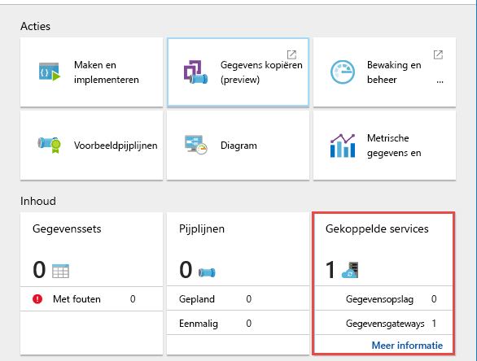
2. Selecteer de **Gateway** op de pagina **gekoppelde services** .

    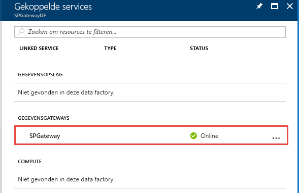
3. Op de pagina **Gateway** kunt u het geheugen en het CPU-gebruik van de gateway bekijken.

    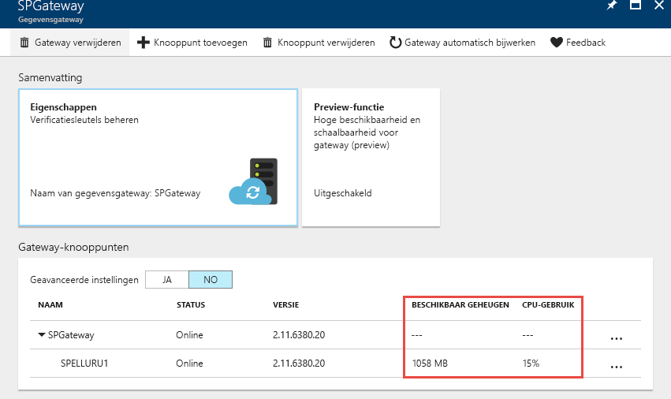
4. Schakel **Geavanceerde instellingen** in om meer details weer te geven, zoals netwerk gebruik.
    
    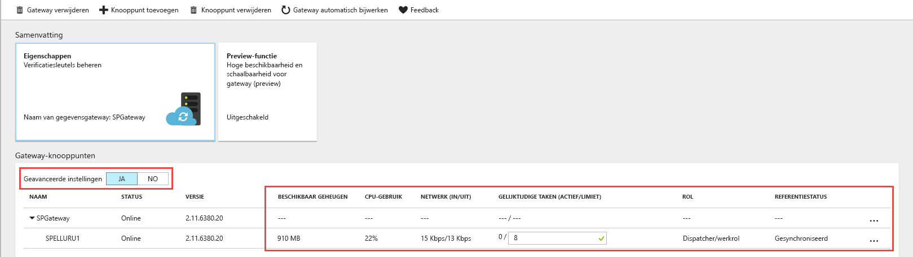

De volgende tabel bevat beschrijvingen van de kolommen in de lijst met **Gateway knooppunten** :

Bewakings eigenschap | Beschrijving
:------------------ | :----------
Naam | De naam van de logische gateway en knoop punten die zijn gekoppeld aan de gateway. Knoop punt is een on-premises Windows-computer waarop de gateway is geïnstalleerd. Zie [Data Management Gateway-hoge Beschik baarheid en schaal baarheid](data-factory-data-management-gateway-high-availability-scalability.md)voor meer informatie over het gebruik van meer dan één knoop punt (Maxi maal vier knoop punten) in één logische gateway.
Status | Status van de logische gateway en de gateway knooppunten. Voor beeld: online/offline/beperkt/etc. Zie de sectie [Gateway status](#gateway-status) voor meer informatie over deze statussen.
Versie | Hier wordt de versie van de logische gateway en elk gateway knooppunt weer gegeven. De versie van de logische gateway wordt bepaald op basis van de versie van de knoop punten in de groep. Als er knoop punten met verschillende versies in de installatie van de logische gateway zijn, hebben alleen de knoop punten met hetzelfde versie nummer als de logische gateway goed functioneren. Andere bevinden zich in de beperkte modus en moeten hand matig worden bijgewerkt (alleen als de automatische update mislukt).
Beschikbaar geheugen | Beschikbaar geheugen op een gateway-knoop punt. Deze waarde is een bijna realtime moment opname.
CPU-gebruik | CPU-gebruik van een gateway knooppunt. Deze waarde is een bijna realtime moment opname.
Netwerken (in/uit) | Netwerk gebruik van een gateway-knoop punt. Deze waarde is een bijna realtime moment opname.
Gelijktijdige taken (uitvoeren/beperken) | Aantal taken of taken dat op elk knoop punt wordt uitgevoerd. Deze waarde is een bijna realtime moment opname. De limiet is het maximale aantal gelijktijdige taken voor elk knoop punt. Deze waarde wordt gedefinieerd op basis van de grootte van de machine. U kunt de limiet verhogen voor het opschalen van gelijktijdige taak uitvoering in geavanceerde scenario's, waarbij CPU/geheugen/netwerk wordt gebruikt, maar activiteiten een time-out hebben. Deze mogelijkheid is ook beschikbaar met een gateway met één knoop punt (zelfs wanneer de functie voor schaal baarheid en beschik baarheid niet is ingeschakeld).
Rol | Er zijn twee soorten rollen in een gateway voor meerdere knoop punten en voor het verzenden van werk nemers. Alle knoop punten zijn werk nemers, wat betekent dat ze allemaal kunnen worden gebruikt om taken uit te voeren. Er is slechts één dispatcher-knoop punt, dat wordt gebruikt om taken/taken uit te geven vanuit Cloud Services en deze te verzenden naar verschillende werk knooppunten (waaronder zichzelf).

Op deze pagina ziet u enkele instellingen die meer inzicht geven wanneer er twee of meer knoop punten zijn (scale-out scenario) in de gateway. Zie [Data Management Gateway-hoge Beschik baarheid en schaal baarheid](data-factory-data-management-gateway-high-availability-scalability.md) voor meer informatie over het instellen van een gateway met meerdere knoop punten.

### <a name="gateway-status"></a>Gateway status
De volgende tabel bevat mogelijke statussen van een **Gateway knooppunt**:

Status  | Opmerkingen/Scenario's
:------- | :------------------
Online | Het knoop punt dat is verbonden met Data Factory service.
Breken | Het knoop punt is offline.
Abonnement | Het knoop punt wordt automatisch bijgewerkt.
Beperkt | Vanwege een connectiviteits probleem. Wordt mogelijk veroorzaakt door een probleem met de HTTP-poort 8050, het connectiviteits probleem van de service bus of het probleem met de synchronisatie van referenties.
Inactieve | Het knoop punt bevindt zich in een configuratie die verschilt van de configuratie van andere hoofd knooppunten.<br/><br/> Een knoop punt kan inactief zijn wanneer er geen verbinding kan worden gemaakt met andere knoop punten.

De volgende tabel bevat mogelijke statussen van een **logische gateway**. De status van de gateway is afhankelijk van de status van de gateway-knoop punten.

Status | Opmerkingen
:----- | :-------
Registratie vereist | Er is nog geen knoop punt geregistreerd voor deze logische gateway
Online | Gateway knooppunten zijn online
Breken | Geen knoop punt in online status.
Beperkt | Niet alle knoop punten in deze gateway hebben de status in orde. Deze status is een waarschuwing dat een deel van het knoop punt mogelijk niet beschikbaar is. <br/><br/>Kan worden veroorzaakt door een probleem met de referenties voor de verzender/het worker-knoop punt.

## <a name="scale-up-gateway"></a>Gateway omhoog schalen
U kunt het aantal **gelijktijdige taken voor gegevens verplaatsing** configureren dat kan worden uitgevoerd op een knoop punt om de mogelijkheid van het verplaatsen van gegevens tussen on-premises en gegevens archieven in de cloud te verg Roten.

Wanneer het beschik bare geheugen en de CPU niet goed worden gebruikt, maar de niet-actieve capaciteit 0 is, moet u omhoog schalen door het aantal gelijktijdige taken dat op een knoop punt kan worden uitgevoerd, te verhogen. Het kan ook zijn dat u wilt opschalen wanneer activiteiten uitvallen omdat de gateway overbelast is. In de geavanceerde instellingen van een gateway-knoop punt kunt u de maximale capaciteit voor een knoop punt verhogen.

## <a name="troubleshooting-gateway-issues"></a>Problemen met Gateway oplossen
Raadpleeg het artikel problemen met [gateway problemen oplossen](data-factory-troubleshoot-gateway-issues.md) voor informatie/tips voor het oplossen van problemen met het gebruik van de Data Management Gateway.

## <a name="move-gateway-from-one-machine-to-another"></a>Gateway verplaatsen van de ene machine naar een andere
In deze sectie worden de stappen beschreven voor het verplaatsen van de Gateway-client van de ene machine naar een andere computer.

1. Ga in de portal naar de **Start pagina van Data Factory**en klik op de tegel **gekoppelde services** .

    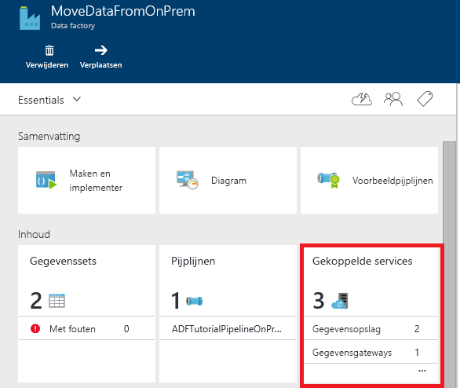
2. Selecteer uw gateway in het gedeelte **gegevens gateways** van de pagina **gekoppelde services** .

    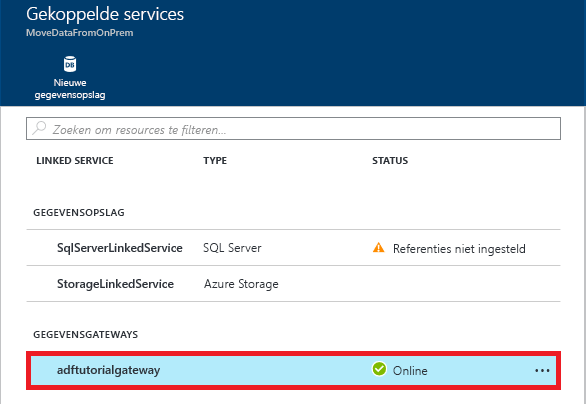
3. Klik op de pagina **gegevens gateway** op **gegevens gateway downloaden en installeren**.

    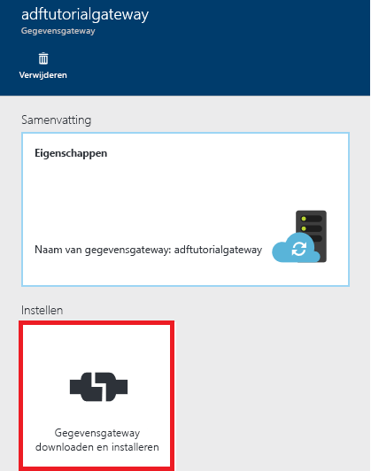
4. Klik op de pagina **configureren** op **gegevens gateway downloaden en installeren**en volg de instructies voor het installeren van de gegevens gateway op de computer.

    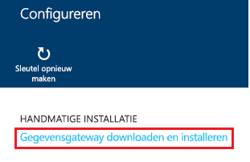
5. Zorg dat de **micro soft-Data Management Gateway Configuration Manager** geopend.

    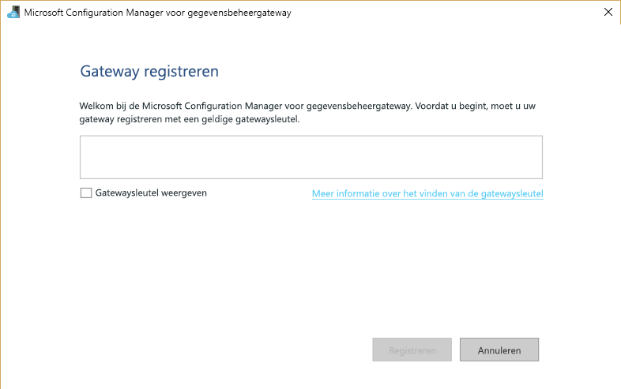
6. Klik op de pagina **configureren** in de portal op **sleutel opnieuw maken** op de opdracht balk en klik op **Ja** voor het waarschuwings bericht. Klik op de **knop kopiëren** naast de sleutel tekst die de sleutel naar het klem bord kopieert. De gateway op de oude computer werkt niet meer nadat u de sleutel opnieuw hebt gemaakt.

    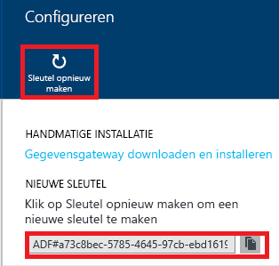
7. Plak de **sleutel** in het tekstvak op de pagina **REGI Steren** van de **Data Management Gateway Configuration Manager** op uw computer. Beschrijving Klik op **Gateway sleutel weer geven** selectie vakje om de sleutel tekst weer te geven.

    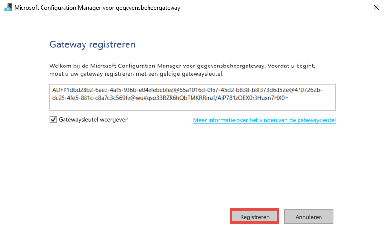
8. Klik op **registreren** om de gateway bij de Cloud service te registreren.
9. Klik op het tabblad **instellingen** op **wijzigen** om hetzelfde certificaat te selecteren dat is gebruikt met de oude gateway, voer het **wacht woord**in en klik op **volt ooien**.

   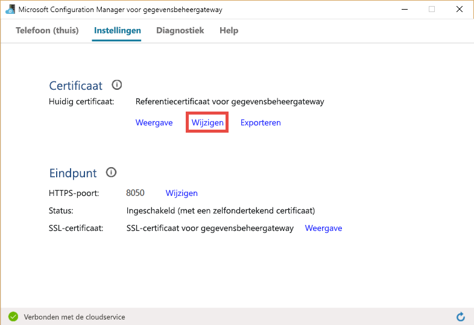

   U kunt een certificaat van de oude gateway exporteren door de volgende stappen uit te voeren: start Data Management Gateway Configuration Manager op de oude computer, schakel over naar het tabblad **certificaat** , klik op de knop **exporteren** en volg de instructies.
10. Nadat de registratie van de gateway is geslaagd, ziet u dat de **registratie** is ingesteld op **geregistreerd** en de **status** is ingesteld op **gestart** op de start pagina van de gateway Configuration Manager.

## <a name="encrypting-credentials"></a>Referenties versleutelen
Voer de volgende stappen uit om referenties in de Data Factory editor te versleutelen:

1. Start de webbrowser op de **Gateway computer**, navigeer naar [Azure Portal](https://portal.azure.com). Zoek uw data factory indien nodig, open data factory op de pagina **Data Factory** en klik vervolgens op **Auteur & implementeren** om Data Factory editor te starten.
2. Klik op een bestaande **gekoppelde service** in de structuur weergave om de JSON-definitie te bekijken of een gekoppelde service te maken waarvoor een Data Management Gateway is vereist (bijvoorbeeld: SQL Server of Oracle).
3. Voer in de JSON-editor voor de eigenschap PropertyName de naam van **de gateway in** .
4. Voer de server naam in voor de **gegevens bron** eigenschap in de **Connections Tring**.
5. Voer de database naam in voor de **eerste catalogus** eigenschap in de **Connections Tring**.
6. Klik op de knop **versleutelen** op de opdracht balk waarmee de toepassing voor het **beheer van referenties** voor klikken wordt gestart. U ziet het dialoog venster **Referenties instellen** .

    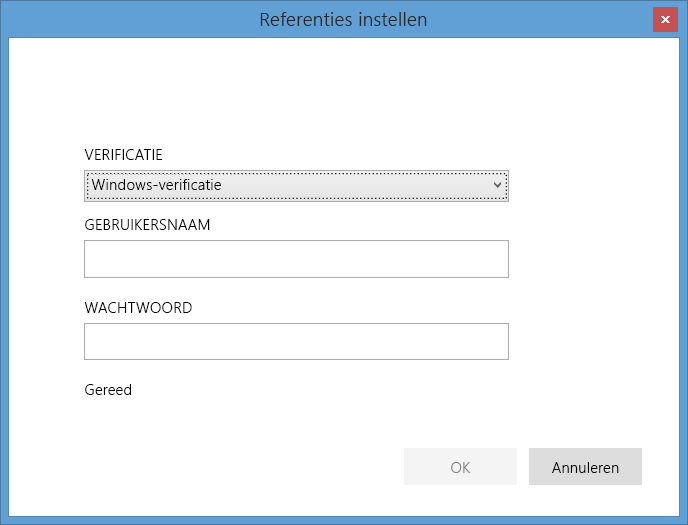
7. Voer in het dialoog venster **Referenties instellen** de volgende stappen uit:
   1. Selecteer de **verificatie** die door de Data Factory-service moet worden gebruikt om verbinding te maken met de data base.
   2. Voer de naam in van de gebruiker die toegang heeft tot de Data Base voor de instelling **gebruikers naam** .
   3. Voer het wacht woord in voor de gebruiker voor de **wachtwoord** instelling.
   4. Klik op **OK** om referenties te versleutelen en het dialoog venster te sluiten.
8. De eigenschap **encryptedCredential** wordt nu weer geven in de **Connections Tring** .

    ```JSON
    {
        "name": "SqlServerLinkedService",
        "properties": {
            "type": "OnPremisesSqlServer",
            "description": "",
            "typeProperties": {
                "connectionString": "data source=myserver;initial catalog=mydatabase;Integrated Security=False;EncryptedCredential=eyJDb25uZWN0aW9uU3R",
                "gatewayName": "adftutorialgateway"
            }
        }
    }
    ```
   Als u de portal opent vanaf een machine die verschilt van de gateway computer, moet u ervoor zorgen dat de toepassing voor het controleren van referenties verbinding kan maken met de gateway computer. Als de toepassing de gateway computer niet kan bereiken, is het niet toegestaan om referenties in te stellen voor de gegevens bron en om de verbinding met de gegevens bron te testen.

Wanneer u de toepassing **Referenties instellen** gebruikt, versleutelt de Portal de referenties met het certificaat dat is opgegeven op het tabblad **certificaat** van de **Gateway Configuration Manager** op de gateway computer.

Als u op zoek bent naar een op API gebaseerde aanpak voor het versleutelen van de referenties, kunt u de Power shell-cmdlet [New-AzDataFactoryEncryptValue](https://docs.microsoft.com/powershell/module/az.datafactory/new-azdatafactoryencryptvalue) gebruiken om referenties te versleutelen. De cmdlet maakt gebruik van het certificaat dat door de gateway is geconfigureerd voor het versleutelen van de referenties. U kunt versleutelde referenties toevoegen aan het **EncryptedCredential** -element van de **Connections Tring** in de JSON. U gebruikt de JSON met de cmdlet [New-AzDataFactoryLinkedService](https://docs.microsoft.com/powershell/module/az.datafactory/new-azdatafactorylinkedservice) of in de Editor van Data Factory.

```JSON
"connectionString": "Data Source=<servername>;Initial Catalog=<databasename>;Integrated Security=True;EncryptedCredential=<encrypted credential>",
```

Er is nog één manier om referenties in te stellen met behulp van Data Factory editor. Als u een SQL Server gekoppelde service maakt met behulp van de editor en u referenties in tekst zonder opmaak opgeeft, worden de referenties versleuteld met een certificaat waarvan de Data Factory-service eigenaar is. Het certificaat dat voor de gateway is geconfigureerd, wordt niet gebruikt. Hoewel deze benadering in sommige gevallen iets sneller kan zijn, is dit minder veilig. Daarom raden wij u aan deze aanpak alleen te volgen voor ontwikkelings-en test doeleinden.

## <a name="powershell-cmdlets"></a>PowerShell-cmdlets
In deze sectie wordt beschreven hoe u een gateway maakt en registreert met behulp van Azure PowerShell-cmdlets.

1. Start **Azure PowerShell** in de beheerders modus.
2. Meld u aan bij uw Azure-account door de volgende opdracht uit te voeren en uw Azure-referenties in te voeren.

    ```powershell
    Connect-AzAccount
    ```
3. Gebruik de cmdlet **New-AzDataFactoryGateway** voor het maken van een logische gateway als volgt:

    ```powershell
    $MyDMG = New-AzDataFactoryGateway -Name <gatewayName> -DataFactoryName <dataFactoryName> -ResourceGroupName ADF –Description <desc>
    ```
    **Voor beeld van opdracht en uitvoer**:

    ```
    PS C:\> $MyDMG = New-AzDataFactoryGateway -Name MyGateway -DataFactoryName $df -ResourceGroupName ADF –Description "gateway for walkthrough"

    Name              : MyGateway
    Description       : gateway for walkthrough
    Version           :
    Status            : NeedRegistration
    VersionStatus     : None
    CreateTime        : 9/28/2014 10:58:22
    RegisterTime      :
    LastConnectTime   :
    ExpiryTime        :
    ProvisioningState : Succeeded
    Key               : ADF#00000000-0000-4fb8-a867-947877aef6cb@fda06d87-f446-43b1-9485-78af26b8bab0@4707262b-dc25-4fe5-881c-c8a7c3c569fe@wu#nfU4aBlq/heRyYFZ2Xt/CD+7i73PEO521Sj2AFOCmiI
    ```

1. Ga in Azure PowerShell naar de map: *C:\\\\programma bestanden\\Microsoft Integration Runtime\\3,0\\PowerShellScript\\* . Voer *RegisterGateway. ps1* uit die is gekoppeld aan de lokale variabele **$Key** , zoals wordt weer gegeven in de volgende opdracht. Met dit script wordt de client agent die op uw computer is geïnstalleerd, geregistreerd met de logische gateway die u eerder hebt gemaakt.

    ```powershell
    PS C:\> .\RegisterGateway.ps1 $MyDMG.Key
    ```
    ```
    Agent registration is successful!
    ```
    U kunt de gateway registreren op een externe computer met behulp van de para meter IsRegisterOnRemoteMachine. Voorbeeld:

    ```powershell
    .\RegisterGateway.ps1 $MyDMG.Key -IsRegisterOnRemoteMachine true
    ```
2. U kunt de cmdlet **Get-AzDataFactoryGateway** gebruiken om de lijst met gateways in uw Data Factory op te halen. Wanneer de **status** **online**wordt weer gegeven, betekent dit dat uw gateway klaar is voor gebruik.

    ```powershell        
    Get-AzDataFactoryGateway -DataFactoryName <dataFactoryName> -ResourceGroupName ADF
    ```
   U kunt een gateway verwijderen met de cmdlet **Remove-AzDataFactoryGateway** en de beschrijving voor een gateway bijwerken met behulp van de **set-AzDataFactoryGateway-** cmdlets. Zie Data Factory-cmdlet-verwijzing voor de syntaxis en andere informatie over deze cmdlets.  

### <a name="list-gateways-using-powershell"></a>Gateways weer geven met behulp van Power shell

```powershell
Get-AzDataFactoryGateway -DataFactoryName jasoncopyusingstoredprocedure -ResourceGroupName ADF_ResourceGroup
```

### <a name="remove-gateway-using-powershell"></a>Gateway verwijderen met Power shell

```powershell
Remove-AzDataFactoryGateway -Name JasonHDMG_byPSRemote -ResourceGroupName ADF_ResourceGroup -DataFactoryName jasoncopyusingstoredprocedure -Force
```

## <a name="next-steps"></a>Volgende stappen
* Zie [gegevens verplaatsen tussen on-premises en gegevens opslag in de Cloud](data-factory-move-data-between-onprem-and-cloud.md) . In de walkthrough maakt u een pijp lijn die gebruikmaakt van de gateway om gegevens te verplaatsen van een on-premises SQL Server Data Base naar een Azure-Blob.
