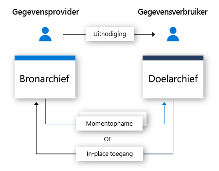

# Wat is Azure Data Share?

Vandaag de dag worden gegevens beschouwd als een belangrijke strategische asset die veel organisaties eenvoudig en veilig moeten kunnen delen met hun klanten en partners. Er zijn veel manieren waarop klanten dit doen, zoals FTP, e-mail, API's enzovoort. Organisaties verliezen gemakkelijk uit het oog met wie ze gegevens delen. Gegevens delen via FTP of een eigen API-infrastructuur is vaak duur om in te richten en te beheren. Deze methodes om op grote schaal te delen brengen beheerskosten met zich mee. 

Veel organisaties moeten aansprakelijk zijn voor de gegevens die ze hebben gedeeld. Naast aansprakelijkheid willen veel organisaties het delen van hun gegevens op een eenvoudige manier kunnen controleren, beheren en bewaken. Omdat er vandaag verwacht wordt dat gegevens exponentieel zullen blijven groeien hebben organisaties een eenvoudige manier nodig om big data te delen. Klanten eisen de meest recente gegevens om tijdig inzichten af te leiden.

Azure Data Share stelt organisaties in staat om eenvoudig en veilig gegevens te delen met meerdere klanten en partners. In enkele klikken kunt u een nieuw Data Share-account inrichten, gegevenssets toevoegen en uw klanten en partners uitnodigen. Gegevensproviders behouden altijd controle over de gegevens die ze hebben gedeeld. Azure Data Share maakt het gemakkelijk om te beheren en bewaken welke gegevens wanneer en door wie worden gedeeld. 

Een gegevensprovider bepaalt hoe de gegevens worden verwerkt door de gebruiksvoorwaarden voor de gegevensshare op te geven. De gegevensgebruiker moet deze voorwaarden accepteren voordat deze de gegevens kan ontvangen. Gegevensproviders kunnen de frequentie opgeven waarmee hun gegevensgebruikers updates ontvangen. De toegang tot nieuwe updates kan op elk moment door de gegevensprovider worden ingetrokken. 

Azure Data Share zorgt voor betere inzichten door het gemakkelijk te maken om gegevens van derden te combineren om analyses en AI-scenario's te verrijken. Gebruik probleemloos de kracht van analytische hulpprogramma's van Azure voor het voorbereiden, verwerken en analyseren van gegevens die worden gedeeld met Azure Data Share. 

Zowel de gegevensprovider als de gegevensgebruiker moeten een Azure-abonnement hebben om gegevens te kunnen delen en ontvangen. Als u nog geen abonnement op Azure hebt, maakt u een [gratis account](https://azure.microsoft.com/free/) aan.

## Scenario's voor Azure Data Share

Azure Data Share kan gebruikt worden in verschillende sectoren. Een retailer wilt bijvoorbeeld recente gegevens over verkooppunten delen met zijn leveranciers. Met Azure Data Share kan een retailer een gegevensshare inrichten met gegevens over verkooppunten voor alle leveranciers, en verkoopcijfers delen op uur- of dagbasis. 

Azure Data Share kan ook gebruikt worden om een gegevensmarktplaats op te zetten voor een specifieke sector. Bijvoorbeeld een overheid of onderzoeksinstelling die regelmatig geanonimiseerde gegevens over bevolkingsgroei deelt met derden. 

Een andere toepassing voor Azure Data Share is het opzetten van een gegevensconsortium. Een aantal verschillende onderzoekinstellingen kunnen bijvoorbeeld gegevens delen met één vertrouwde organisatie. Gegevens worden geanalyseerd, geaggregeerd of verwerkt met behulp van Azure Analytics-hulpprogramma's en vervolgens gedeeld met de betrokken partijen. 

## Hoe werkt het?

Azure Data Share biedt momenteel delen van momentopname en lokaal delen aan. 

Bij delen van een momentopname gaan gegevens van het Azure-abonnement van de gegevensprovider naar het Azure-abonnement van de gegevensgebruiker. Als gegevensprovider kunt u een gegevensshare inrichten en daarvoor ontvangers uitnodigen. Gegevensgebruikers ontvangen een uitnodiging voor uw gegevensshare via e-mail. Zodra een gegevensgebruiker de uitnodigt accepteert kunnen ze een volledige momentopname van de met hen gedeelde gegevens opvragen. Deze gegevens komen terecht in het opslagaccount van de gegevensgebruikers. Gegevensgebruikers kunnen regelmatige, incrementele update ontvangen voor de met hen gedeelde gegevens zodat ze altijd de meest recente versie van de gegevens hebben. 

Gegevensproviders kunnen hun gegevensgebruiker incrementele updates voor de met hen gedeelde gegevens bieden via een schema voor momentopnamen. Schema's voor momentopnamen bestaan op uur- of dagbasis. Wanneer een gegevensgebruiker een gegevensshare accepteert en configureert, kan hij zich abonneren op een schema voor momentopnamen. Dit is handig in scenario's waarbij de gedeelde gegevens regelmatig worden bijgewerkt en de gegevensgebruiker de meest actuele gegevens nodig heeft. 

Wanneer een gegevensgebruiker een gegevensshare accepteert, dan kan hij de gegevens ontvangen in een gegevensarchief naar keuze. Als de gegevensprovider bijvoorbeeld gegevens deelt met Azure Blob Storage, kan de gegevensgebruiker deze gegevens in Azure Data Lake Store ontvangen. En als de gegevensprovider gegevens deelt vanuit een Azure SQL Data Warehouse, dan kan de gegevensgebruiker kiezen of hij de gegevens wilt ontvangen in een Azure Data Lake Store, een Azure SQL Database of een Azure SQL Data Warehouse. Wanneer er gedeeld wordt vanuit SQL-gebaseerde bronnen, dan kan de gegevensgebruiker ook kiezen of hij gegevens ontvangt in parquet of csv. 

Met delen op locatie kunnen gegevensproviders gegevens delen waar deze zich bevinden zonder de gegevens te kopiëren. Nadat de machtiging voor delen is verleend via de uitnodigingsstroom, wordt een symbolische link gemaakt tussen de brongegevensopslag van de gegevensprovider en de doelgegevensopslag van de gegevensgebruiker. De gegevensgebruiker kan de gegevens in real time lezen en doorzoeken met behulp van zijn eigen gegevensopslag. Wijzigingen in de brongegevensopslag worden onmiddellijk beschikbaar voor de gegevensgebruiker. Delen op locatie is momenteel in preview voor Azure Data Explorer.

## Belangrijkste mogelijkheden

Azure Data Share stelt gegevensproviders in staat om:

* Gegevens delen uit de lijst met [ondersteunde gegevensopslagen](supported-data-stores.md) met klanten en partners buiten uw organisatie

* Bijhouden met wie u gegevens deelt

* Kiezen tussen momentopname of delen op locatie

* Hoe vaak uw gegevensgebruikers updates ontvangen voor uw gegevens

* Stel uw klanten in staat om de meest recente versie van uw gegevens op te halen wanneer ze die nodig hebben, of sta toe dat ze automatisch incrementele wijzigingen voor uw gegevens ontvangen met een interval dat u bepaalt

Azure Data Share stelt gegevensgebruikers in staat om: 

* Een beschrijving van het type gegevens dat wordt gedeeld te bekijken

* Gebruiksvoorwaarden voor de gegevens te bekijken

* Een Azure Data Share-uitnodiging te accepteren of af te wijzen

* Gegevens die met u zijn gedeeld te accepteren in een [ondersteunde gegevensopslag](supported-data-stores.md).

* Een volledige of incrementele momentopname opvragen van een gegevensshare die een organisatie met u heeft gedeeld

* Abonneren op een gegevensshare om de meest recente kopie van de gegevens te ontvangen via incrementele momentopnames

Alle belangrijke mogelijkheden die hierboven worden vermeld, worden ondersteund via het Azure-portal of REST API's. Raadpleeg onze referentiedocumentatie voor meer informatie over het gebruik van Azure Data Share via REST API's. 

## Ondersteunde regio’s

Voor een lijst met Azure-regio's waar Azure Data Share beschikbaar is, raadpleegt u de pagina [beschikbare producten per regio](https://azure.microsoft.com/global-infrastructure/services/?products=data-share) en zoekt u naar Azure Data Share. 

Azure Data Share slaat geen kopie op van de gegevens zelf. De gegevens worden opgeslagen in de onderliggende gegevensopslag die gedeeld wordt. Als een gegevensproducten bijvoorbeeld gegevens opslaat in een Azure Data Lake Storage-account in het westen van de VS, dan zijn de gegevens daar opgeslagen. Als ze via een momentopname gegevens delen met een Azure Storage-account in West-Europa, dan worden de gegevens meestal rechtstreeks overgedragen naar het Azure Storage-account in West-Europa.

De Azure Data Share-service hoeft niet beschikbaar te zijn in uw regio om gebruik te kunnen maken van de service. Als u bijvoorbeeld gegevens heeft opgeslagen in een Azure Storage-account dat zich bevindt in een regio waar Azure Data Share nog niet beschikbaar is, kunt u de service gebruiken om uw gegevens te delen. 

## Volgende stappen

Voor meer informatie over hoe u gegevens kunt beginnen delen, gaat u verder naar de zelfstudie [uw gegevens delen](share-your-data.md).
