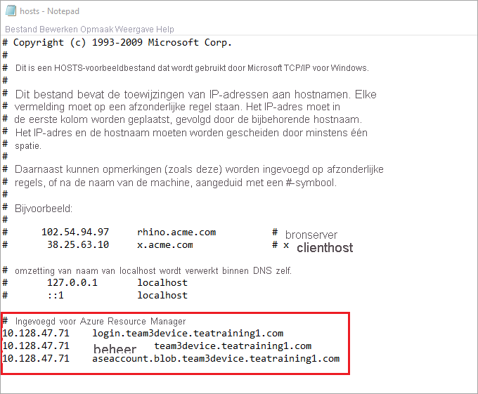

# <a name="deploy-vms-on-your-azure-stack-edge-device-via-azure-powershell-script"></a>Vm's op uw Azure Stack edge-apparaat implementeren via Azure PowerShell script

<!--[!INCLUDE [applies-to-skus](../../includes/azure-stack-edge-applies-to-all-sku.md)]-->

In deze zelf studie wordt beschreven hoe u een virtuele machine op uw Azure Stack edge-apparaat maakt en beheert met behulp van een Azure PowerShell script.

## <a name="prerequisites"></a>Vereisten

Voordat u met dit script begint met het maken en beheren van een virtuele machine op uw Azure Stack edge-apparaat, moet u ervoor zorgen dat u de vereiste onderdelen hebt voltooid die in de volgende stappen worden vermeld:

### <a name="for-azure-stack-edge-device-via-the-local-web-ui"></a>Voor Azure Stack edge-apparaat via de lokale web-UI

1. U hebt de netwerk instellingen op uw Azure Stack edge-apparaat voltooid, zoals beschreven in [stap 1: Azure stack edge-apparaat configureren](azure-stack-edge-j-series-connect-resource-manager.md#step-1-configure-azure-stack-edge-device).

2. Er is een netwerk interface ingeschakeld voor compute. Dit IP-adres van de netwerk interface wordt gebruikt voor het maken van een virtuele switch voor de VM-implementatie. De volgende stappen helpen u bij het proces:

    1. Ga naar de **instellingen**voor de berekening. Selecteer de netwerk interface die u gaat gebruiken om een virtuele switch te maken.

        > [!IMPORTANT] 
        > U kunt slechts één poort configureren voor compute.

    2. Schakel Compute in op de netwerk interface. Azure Stack Edge maakt en beheert een virtuele switch die overeenkomt met die netwerk interface.

3. U hebt alle certificaten gemaakt en geïnstalleerd op uw Azure Stack edge-apparaat en in het vertrouwde basis archief van uw client. Volg de procedure die wordt beschreven in [stap 2: certificaten maken en installeren](azure-stack-edge-j-series-connect-resource-manager.md#step-2-create-and-install-certificates).

### <a name="for-your-windows-client"></a>Voor uw Windows-client

1. U hebt de Azure consistente Services virtueel Internet Protocol (VIP) gedefinieerd op de pagina **netwerk** in de lokale web-UI van het apparaat. U moet deze VIP toevoegen aan:

    - Het hostbestand op de client of,
    - De configuratie van de DNS-server
    
    > [!IMPORTANT]
    > U wordt aangeraden de configuratie van de DNS-server voor de naam omzetting van het eind punt te wijzigen.

    1. Start **Klad blok** als beheerder (er zijn beheerders bevoegdheden vereist om het bestand op te slaan) en open vervolgens het **hosts** -bestand dat zich bevindt in `C:\Windows\System32\Drivers\etc` .
    
        
    
    2. Voeg de volgende vermeldingen toe aan het **hosts** -bestand dat wordt vervangen door de juiste waarden voor uw apparaat:
    
        ```
        <Azure consistent services VIP> login.<appliance name>.<DNS domain>
        <Azure consistent services VIP> management.<appliance name>.<DNS domain>
        <Azure consistent services VIP> <storage name>.blob.<appliance name>.<DNS domain>
        ```
        Voor het opslag account kunt u een naam opgeven die u door het script wilt laten gebruiken om een nieuw opslag account te maken. Het script controleert niet of het opslag account al bestaat.

    3. Gebruik de volgende afbeelding ter referentie. Sla het bestand met **hosts** op.

        

2. [Down load het Power shell-script](https://aka.ms/ase-vm-powershell) dat in deze procedure wordt gebruikt.

3. Zorg ervoor dat Power shell 5,0 of hoger wordt uitgevoerd op de Windows-client.

4. Zorg ervoor dat de `Azure.Storage Module version 4.5.0` is geïnstalleerd op uw systeem. U kunt deze module ophalen van de [PowerShell Gallery](https://www.powershellgallery.com/packages/Azure.Storage/4.5.0). Als u deze module wilt installeren, typt u:

    `Install-Module -Name Azure.Storage -RequiredVersion 4.5.0`

    Als u de versie van de geïnstalleerde module wilt controleren, typt u:

    `Get-InstalledModule -name Azure.Storage`

    Als u andere versie modules wilt verwijderen, typt u:

    `Uninstall-Module -Name Azure.Storage`

5. [Down load AzCopy 10](https://docs.microsoft.com/azure/storage/common/storage-use-azcopy-v10#download-azcopy) naar uw Windows-client. Noteer deze locatie als u deze als een para meter wilt door geven tijdens het uitvoeren van het script.

6. Zorg ervoor dat op uw Windows-client TLS 1,2 of hoger wordt uitgevoerd.


## <a name="create-a-vm"></a>Een virtuele machine maken

1. Voer PowerShell uit als beheerder.
2. Ga naar de map waarin u het script op uw client hebt gedownload.  
3. Gebruik de volgende opdracht om het script uit te voeren:
 
    `.\ArmPowershellClient.ps1 -VNetAddressSpace <AddressSpace> -NicPrivateIp <Private IP> -VHDPath <Path> -VHDFile <VHD File, with extension> -StorageAccountName <Name> -OS <Windows/Linux> -VMSize <Supported VM Size> -VMUserName <UserName to be used to login into VM> -VMPassword <Password for the VM login> --AzCopy10Path <Absolute Path>`

    Hier volgen de voor beelden wanneer het script wordt uitgevoerd om een virtuele Windows-machine en een virtuele Linux-machine te maken.

    **Voor een Windows-VM:**

    `.\ArmPowershellClient.ps1 -VNetAddressSpace 5.5.0.0/16 -NicPrivateIp 5.5.168.73 -VHDPath \\intel01\d$\vm_vhds\AzureWindowsVMmode -VHDFile WindowsServer2016Datacenter.vhd -StorageAccountName teaaccount1 -OS Windows -VMSize Standard_D1_v2 -VMUserName Administrator -VMPassword Password1 -AzCopy10Path C:\azcopy10\azcopy.exe`

    **Voor een virtuele Linux-machine:**

    `.\ArmPowershellClient.ps1 -VNetAddressSpace 5.5.0.0/16 -NicPrivateIp 5.5.168.83 -VHDPath \\intel01\d$\vm_vhds\AzurestackLinux -VHDFile ubuntu13.vhd -StorageAccountName sa2 -OS Linux -VMSize Standard_D1_v2 -VMUserName Administrator -VMPassword Password1 -AzCopy10Path C:\azcopy10\azcopy.exe`
    
4. Gebruik de volgende opdrachten om de resources op te schonen die het script heeft gemaakt:
    
    ```powershell
    Get-AzureRmVM | Remove-AzureRmVM -Force
    Get-AzureRmNetworkInterface | Remove-AzureRmNetworkInterface -Force
    Get-AzureRmResource | Remove-AzureRmResource -f
    Get-AzureRmResourceGroup | Remove-AzureRmResourceGroup -f
    ```


## <a name="next-steps"></a>Volgende stappen

[Vm's implementeren met Azure PowerShell-cmdlets](azure-stack-edge-j-series-deploy-virtual-machine-powershell.md)
