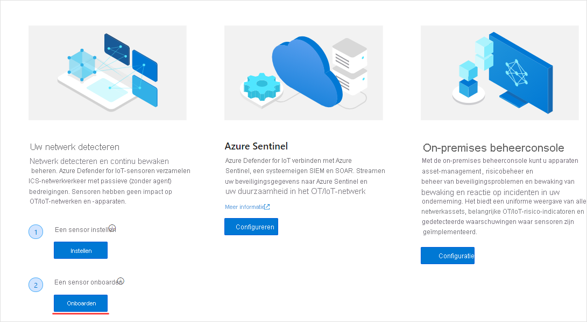
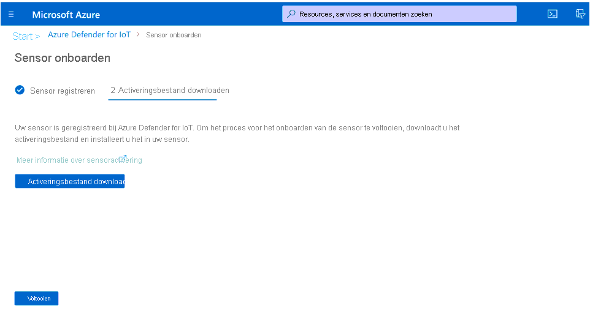
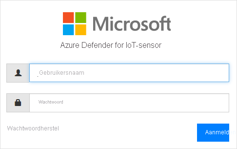
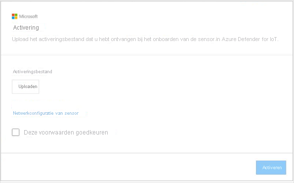

# Quickstart: Een sensor implementeren en onboarden

Dit artikel biedt een overzicht van het sensorimplementatieproces. Onboarden van sensors moet worden uitgevoerd op het Azure Defender for IoT-portal.

Voor dit proces moet u een vooraf geconfigureerde sensor of een gecertificeerd sensorapparaat aanschaffen en zelf de sensorsoftware installeren.

Als u werkt met een gecertificeerd sensorapparaat, wordt u aangeraden de [Handleiding met hardwarespecificaties voor Azure Defender for IoT](https://aka.ms/AzureDefenderforIoTBareMetalAppliance) te bekijken voordat u begint.

> [!NOTE]
> Voor de on-premises beheerconsole van Azure Defender for IoT hoeft geen onboarden te worden uitgevoerd.

Bij het onboarden van sensors kunt u:

|||
|------ | ----------- |
| **Een sensornaam definiëren** | Geef de sensor die u wilt onboarden een naam en koppel deze aan een IoT Hub of een abonnement.  Raadpleeg **Sensors onboarden** voor meer informatie.|
|**Kies een abonnement en het aantal doorgevoerde apparaten**|Selecteer een abonnement en het aantal apparaten waarop het abonnement betrekking heeft. Voer het aantal in stappen van 1000 in.|
| **Een sensorbeheermodus definiëren** | Definieer waar asset, waarschuwingen en andere informatie die door de sensor wordt gedetecteerd, wordt weergegeven. Dit wordt bepaald op basis van de **Sensorbeheermodus** die u definieert.  **Lokaal beheerde modus** : Gegevens die door de sensor zijn gedetecteerd, worden weergegeven in de sensorconsole. Detectiegegevens worden ook gedeeld met de on-premises beheerconsole als de sensor hieraan is gekoppeld.  **In de cloud beheerde modus** : Gegevens die door de sensor zijn gedetecteerd, worden weergegeven in de sensorconsole. Daarnaast worden waarschuwingsgegevens geleverd via een IoT Hub en deze kunnen worden gedeeld met andere Azure-Services, bijvoorbeeld Azure Sentinel. Raadpleeg **Sensor onboarden** voor meer informatie. |
| **Een sensoractiveringsbestand ophalen** | Voor **Lokaal beheerde** sensoren wordt een activeringsbestand gebruikt voor het beheren van de geautoriseerde sensoractiveringsperioden.  Voor **In de cloud beheerde** sensors wordt een activeringsbestand gebruikt als een verbinding tussen de sensor en een IoT Hub. Raadpleeg voor meer informatie **Sensors onboarden** . |
| **Een activeringsbestand uploaden naar uw sensor** | Activeringsbestanden moeten worden geüpload naar uw bedrijfssensors. Netwerkbewaking en toegang tot de functies van de sensorconsole zijn pas beschikbaar als het activeringsbestand is geüpload. Zie **Sensoractiveringsbestanden uploaden** voor meer informatie. |
| **Sensornetwerkparameters bijwerken vóór activering** | Parameters bijwerken die zijn gedefinieerd tijdens de installatie van de sensor. Zie **Fout voor meer informatie! Verwijzingsbron niet gevonden** .|

**Een sensor implementeren:**

1. Ga vanuit de Azure Portal naar Azure Defender for IoT.

2. Selecteer **Aan de slag.**

3. Selecteer in de sectie **Uw netwerk detecteren**  **Instellen** .

   

4. Selecteer een optie voor het verkrijgen van een sensor.

   

  - **Een vooraf geconfigureerde sensor kopen** : Microsoft en Arrow zijn partners geworden om vooraf geconfigureerde sensors te bieden. Als u een vooraf geconfigureerde sensor wilt kopen, moet u contact opnemen met Arrow op: <hardware.sales@arrow.com>. De sensor wordt geleverd bij uw faciliteit. De meest recente versie is geïnstalleerd.

  - **Uw eigen apparaat (ISO-installatie) meenemen** : De oplossing wordt uitgevoerd op gecertificeerde apparaten. Gebruik de [Handleiding met hardwarespecificaties voor Azure Defender for IoT](https://aka.ms/AzureDefenderforIoTBareMetalAppliance) als referentie bij het aanschaffen van uw gecertificeerde apparaat.

    - Selecteer een versie in het menu **Versie selecteren** .

    - Selecteer **Downloaden** en sla het bestand op. Raadpleeg de **Installatiehandleiding van Azure Defender for IoT** voor meer informatie over het downloaden van de ISO-installatiekopie en het installeren van de sensorsoftware.

5. Nadat de software is geïnstalleerd op uw sensor of als u een vooraf geconfigureerde sensor hebt ontvangen, voert u netwerkinstallatietaken uit. Raadpleeg de [Handleiding voor netwerkinstallatie](https://aka.ms/AzureDefenderForIoTNetworkSetup) voor meer informatie.

## Een sensor onboarden

Het onboarden van sensors moet worden uitgevoerd op het Azure Defender for IoT-portal. Het onboarden wordt uitgevoerd in twee fasen:

1. Registreer de sensor met de Azure Defender for IoT-portal.

2. Download een activeringsbestand voor de sensor. Het bestand wordt later geüpload naar uw sensor.

**Om toegang te krijgen tot de pagina voor onboarden:**

1. Ga naar de pagina **Aan de slag** van Microsoft Azure Defender for IoT.

2. Selecteer **2) Onboarden** vanuit Azure Defender for IoT.

   

3. De pagina **Sensor onboarden** wordt geopend. Deze bevat opties voor het registreren van de sensor en het downloaden van het activeringsbestand.

   

**De sensor registreren:**

1. Een sensornaam kiezen. Voor In de cloud beheerde sensors wordt de naam die hier is gedefinieerd, toegepast op de naam die wordt weergegeven in de sensorconsole: deze naam kan niet worden gewijzigd vanuit de console. Voor Lokaal beheerde sensors wordt de naam die hier wordt toegepast, opgeslagen in Azure, maar deze kan worden bijgewerkt in de sensorconsole. Het is aan te raden om het IP-adres te vermelden van de sensor die u hebt geïnstalleerd als onderdeel van de naam of een eenvoudig herkenbare naam te gebruiken. Dit zorgt ervoor dat de registratienaam in de Azure Defender for IoT-portal eenvoudiger kan worden bijgehouden en consistent is met het IP-adres van de geïmplementeerde sensor die wordt weergegeven in de sensorconsole.

2. Selecteer een abonnement in de vervolgkeuzelijst voor abonnementen.
3. Voer in het veld **Doorgevoerde apparaten** het aantal apparaten in waarop het abonnement betrekking heeft. U moet dit nummer opnieuw invoeren voor elke sensor waarvoor u onboarden uitvoert die aan hetzelfde abonnement is gekoppeld.  Als abonnement ‘A’ bijvoorbeeld is gekoppeld aan 6000 apparaten, voert u 6000 in voor elke sensor die is gekoppeld aan abonnement ‘A’.   
4. Kies een sensorbeheermodus met behulp van de wisselknop **Cloud verbinden** . Als de wisselknop is ingeschakeld, wordt de sensor **In de cloud beheerd** . Als de wisselknop is uitgeschakeld, wordt de sensor **Lokaal beheerd** .

| Sensorbeheermodus | Beschrijving                                                |
| ---------------------- | ---------------------------------------------------------  |
| **In de cloud beheerd**          | Gegevens die door de sensor zijn gedetecteerd, worden weergegeven in de sensorconsole. Daarnaast worden waarschuwingsgegevens geleverd via een IoT Hub en deze kunnen worden gedeeld met andere Azure-Services, bijvoorbeeld Azure Sentinel.  Kies een IoT Hub om aan deze sensor te koppelen.  U moet een In de cloud beheerd activeringsbestand uploaden naar In de cloud beheerde sensors.  Zie **Sensoractiveringsbestanden** voor meer informatie. |
| **Lokaal beheerd**        | Gegevens die worden gedetecteerd door sensors die lokaal worden beheerd, worden weergegeven in de sensorconsole. Als u werkt met een air-gapped-netwerk en u een uniforme weergave wilt van alle informatie die wordt gedetecteerd door meerdere Lokaal beheerde sensors, dan werkt u met de on-premises beheerconsole.  Sensors die *Lokaal beheerd* worden zijn gekoppeld aan een Azure-abonnement en bevatten instructies over de vervaltermijn van de activering van de sensor.  Kies een abonnement dat u wilt koppelen aan deze sensor.  U moet een Lokaal beheerd activeringsbestand uploaden naar elke sensor. Zie **Sensoractiveringsbestanden uploaden** voor meer informatie. |

5. Selecteer **Registreren** .

6. Selecteer op de pagina Activeringsbestand downloaden het bestand **Activering downloaden** .

   

7. Sla het bestand op. De bestandsnaam heeft de volgende indeling: `<hub_name>_<sensor_name>`. De sensornaam verwijst naar de naam die u hierboven hebt gedefinieerd.

8. Selecteer **Finish** .

9. Als u het onboardingsproces van de sensor wilt voltooien, uploadt u het bestand naar uw sensor vanuit de Azure Defender for IoT-console.
 
## Een sensoractiveringsbestand uploaden

In dit artikel wordt beschreven hoe u een activeringsbestand naar de sensor kunt uploaden. U heeft dit ontvangen bij het onboarden van de sensor.

**Lokaal beheerde activeringsbestanden**

Lokaal beheerde sensors zijn gekoppeld aan een Azure-abonnement.  Het activeringsbestand voor uw lokaal beheerde sensors bevat een vervaldatum. Eén maand vóór deze datum wordt een waarschuwing weergegeven bovenaan de sensorconsole. De waarschuwing blijft staan totdat u het activeringsbestand hebt bijgewerkt.

U kunt met Azure Defender for IoT-functies blijven werken nadat het activeringsbestand is verlopen.

**In de cloud beheerde activeringsbestanden**

Sensors die in de cloud worden beheerd, zijn gekoppeld aan een Azure-IoT Hub. Deze sensors worden niet beperkt door de tijdsperiodes van het activeringsbestand. Het activeringsbestand voor in de cloud beheerde sensors wordt gebruikt om ervoor te zorgen dat er verbinding is met de IoT Hub.

Zie [Over IoT Hub](../iot-hub/about-iot-hub.md) voor meer informatie over IoT Hubs.

**Het activeringsbestand uploaden:**

1. Controleer of u over het volgende beschikt:

   - IP-adres voor de sensor - gedefinieerd tijdens de installatie

   - Aanmeldingsgegevens va de gebruiker vereist voor de sensor

2. Open de Azure Defender for IoT-console vanuit uw browser met behulp van het IP-adres voor deze sensor.

3. Meld u aan bij de Azure Defender for IoT-sensorconsole.

   

4. Na een geslaagde aanmelding wordt het Activeringsscherm geopend. Selecteer Uploaden en kies het activeringsbestand dat u hebt opgeslagen.

   

5. De voorwaarden goedkeuren.

6. Selecteer **Activate** . De parameters voor de netwerkconfiguratie van de sensor zijn gedefinieerd tijdens de installatie van de software of als een vooraf geconfigureerde sensor is aangeschaft. De volgende parameters zijn gedefinieerd:
   - Het IP-adres
   - DNS  
   - Standaardgateway
   - Subnetmasker
   - Hostnaam
 
   U wilt deze gegevens mogelijk bijwerken voordat u de sensor activeert, omdat:
   - U moet de gedefinieerde, vooraf geconfigureerde parameters wijzigen  
   - U wilt de netwerkparameters na de installatie opnieuw configureren Ook kunt u proxy-instellingen definiëren voordat u uw sensor activeert.

7. Selecteer de link voor **Sensornetwerkconfiguratie** in het dialoogvenster Activering.  

   

8. De parameters die tijdens de installatie zijn gedefinieerd, worden weergegeven. Er is ook een optie beschikbaar voor het definiëren van een proxy. Werk indien nodig bij en selecteer **Opslaan** .
 
 
## Volgende stappen

In dit artikel hebt u geleerd hoe u sensors kunt implementeren en onboarden. Zie het volgende artikel voor meer informatie over het aan de slag gaan:

- [Aan de slag](getting-started.md)