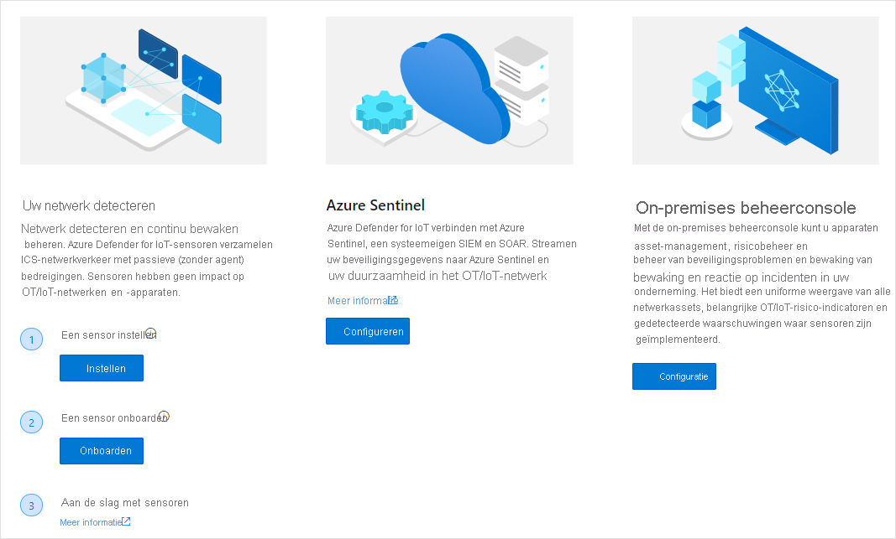

# Quickstart: Voorbereiden van uw netwerk voor de implementatie van Azure Defender for IoT

## Uw hardware kiezen
Azure Defender for IoT ondersteunt diverse gecertificeerde apparaten, waaronder:
- Gecertificeerde vooraf geconfigureerde apparaten, waarop software al is geïnstalleerd
- Niet-geconfigureerde gecertificeerde apparaten waarop u sensorsoftware kunt downloaden en installeren
- Apparaatspecificaties van de on-premises beheerconsole. De on-premises beheerconsole is niet beschikbaar als een vooraf geconfigureerd apparaat. 

Zie de [Handleiding voor hardwarespecificaties ](https://aka.ms/AzureDefenderforIoTBareMetalAppliance) voor meer informatie

## Onderdelen installeren
Nadat u uw hardware-onderdelen hebt verkregen en uw softwarepakket hebt gedownload van de Azure Defender for IoT-portal, kunt u onderdeelsoftware installeren. Zie de [Installatiehandleiding](https://aka.ms/AzureDefenderforIoTInstallSensorISO)voor meer informatie.

## Sensors onboarden op de Azure Defender for IoT-portal 
 Dit artikel bevat een overzicht van implementatie-, onboarding- en updateprocessen voor Azure Defender for IoT-sensors en de on-premises beheerconsole. Dit proces wordt uitgevoerd door de instructies op de pagina Welkom bij Azure Defender for IoT en de volgende pagina's te volgen.

De welkomstpagina openen:

1. Meld u aan bij uw Azure-account en zoek naar Azure Defender for IoT.

1. Voor **Sensorimplementatie** moet u het volgende doen: Vooraf geconfigureerde hardware van Arrow aanschaffen of uw eigen apparaat aanschaffen en er sensorsoftware op installeren.
1. **Voor de implementatie van een on-premises beheerconsole** moet u uw eigen apparaat aanschaffen en de on-premises beheerconsole-software erop installeren. Voor meer informatie.

## Netwerk instellen
Nadat u uw Defender for IoT-systeemonderdelen hebt geïnstalleerd, kunt u uw netwerkapparatuur configureren voor optimale netwerkbewaking. Zie de [Handleiding voor netwerkinstallatie](https://aka.ms/AzureDefenderForIoTNetworkSetup)voor meer informatie.   

## Volgende stappen

In dit artikel hebt u geleerd hoe u kunt voorbereiden op het gebruik van Defender for IoT. Zie het volgende artikel voor meer informatie over het aan de slag gaan:

- [Aan de slag](getting-started.md)