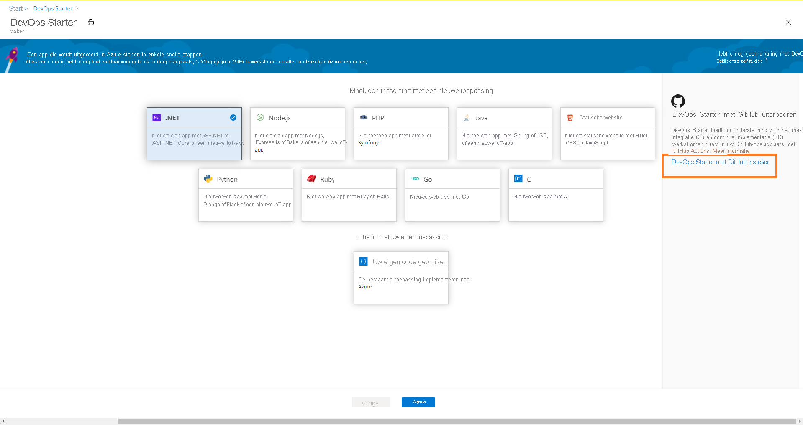
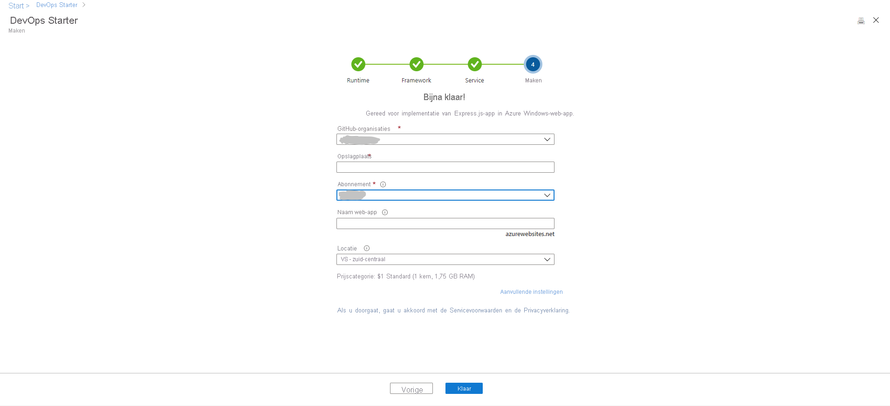
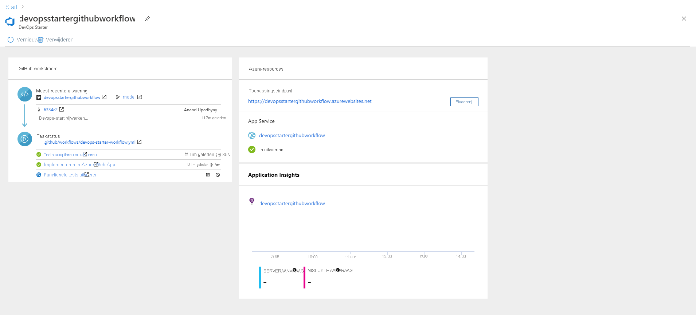

# CI/CD instellen voor een Node.js-app met DevOps Starter met GitHub Actions

In deze quickstart gebruikt u de vereenvoudigde DevOps Starter-ervaring om een werkstroom voor continue integratie (CI) en continue levering (CD) voor uw Node.js-app in te stellen met behulp van GitHub Actions. Gebruik DevOps Starter om alles in te stellen wat u nodig hebt voor de ontwikkeling, implementatie en bewaking van uw app. 

## Vereisten

- Een Azure-account met een actief abonnement. [Gratis een account maken](https://azure.microsoft.com/free/?ref=microsoft.com&utm_source=microsoft.com&utm_medium=docs&utm_campaign=visualstudio) 
- Een [GitHub](https://github.com/)-account.

## Aanmelden bij Azure Portal

DevOps Starter maakt een CI/CD-werkstroom met behulp van GitHub-acties. Met DevOps Starter worden ook Azure-resources gemaakt in het Azure-abonnement van uw keuze.

1. Meld u aan bij de [Azure-portal](https://portal.azure.com).

1. Typ **DevOps Starter** in het zoekvak en selecteer dit vervolgens. Klik op **Toevoegen** om een nieuw exemplaar te maken.

    

## Een voorbeeldtoepassing en Azure-service selecteren

1. Klik op **DevOps starter instellen met GitHub** in de banner aan de rechterkant.

    

1. Zorg ervoor dat de CI/CD-provider is geselecteerd als **GitHub Actions** .

    

1. Selecteer de **Node.js** -voorbeeldtoepassing. De Node.js-voorbeelden omvatten een keuze uit verschillende toepassingsframeworks.

1. Het standaardvoorbeeldframework is **Express.js** . Laat de standaardinstelling ongewijzigd en selecteer **Volgende** .   

2. Windows-web-app is het standaardimplementatiedoel. Het toepassingsframework, dat u eerder hebt gekozen, bepaalt welk type implementatiedoel hier beschikbaar is voor de Azure-service. Laat de standaardservice ongewijzigd en selecteer **Volgende** .
 
## Configureer een GitHub-account en een Azure-abonnement 

1. Verifieer met GitHub.

   1. Klik op de knop **Autoriseren** . 
   
   1. Meld u aan bij GitHub. Als u geen GitHub-account hebt, kunt u hier ook registreren.

2. Kies een bestaande **GitHub-organisatie** . 
   
   1. Kies een naam voor uw GitHub-opslagplaats. 
   
   1. Selecteer uw Azure-abonnement en locatie, kies een naam voor de toepassing en selecteer vervolgens **Gereed** .
    
       

    Na enkele minuten wordt het DevOps Starter-dashboard weergegeven in Azure Portal. Er wordt een voorbeeldtoepassing ingesteld in een opslagplaats in uw Azure DevOps-organisatie, er wordt een GitHub-werkstroom geactiveerd en de toepassing wordt geïmplementeerd in Azure. Dit dashboard biedt meer inzicht in uw codeopslagplaats, GitHub-werkstroom en toepassing in Azure.
   
3. Selecteer **Bladeren** om de actieve toepassing weer te geven.
    
    Het dashboard bevat details over de GitHub-werkstroom en Azure-resources. Als u de details van de GitHub-werkstroom wilt bekijken zoals de meest recente uitvoering, doorvoeringen en taakstatus, moet u **Autoriseren op GitHub** .
   
   

DevOps Starter heeft automatisch een GitHub-werkstroom geconfigureerd met behulp van GitHub-acties voor het maken en implementeren van taken. U bent nu klaar om met een team samen te werken aan uw Node.js-app met een CI/CD-proces dat automatisch uw meest recente werk aan uw website implementeert.

   

## Codewijzigingen doorvoeren en CI/CD uitvoeren

Met DevOps Starter wordt een opslagplaats gemaakt in GitHub. Ga als volgt te werk om de opslagplaats weer te geven en codewijzigingen aan de brengen in de toepassing:

1. Selecteer aan de linkerkant van het DevOps Starter-dashboard de koppeling voor uw master branch. Met deze koppeling opent u een weergave met de zojuist gemaakte GitHub-opslagplaats.

1. Als u de kloon-URL van de opslagplaats wilt weergeven, selecteert u **Klonen** in de rechterbovenhoek van de browser. U kunt uw Git-opslagplaats klonen in uw favoriete IDE. In de volgende stappen kunt u de webbrowser gebruiken om codewijzigingen rechtstreeks aan te brengen en door te voeren in de master branch.

1. Ga aan de linkerkant van de browser naar het bestand **/Application/views/index.pug** .

1. Selecteer **Bewerken** en breng een wijziging aan in de tekst.
    Wijzig bijvoorbeeld een stuk tekst voor een van de tags.

1. Selecteer **Doorvoeren** en sla de wijzigingen op.

1. Ga in de browser naar het DevOps Starter-dashboard.   
U moet nu een taak in uitvoering zien voor het bouwen van een GitHub-werkstroom. De aangebrachte wijzigingen worden automatisch gebouwd en geïmplementeerd via een GitHub-werkstroom.

## De GitHub-werkstroom weergeven

In de vorige stap werd in DevOps Starter automatisch een volledige GitHub-werkstroom geconfigureerd. Verken de werkstroom en pas deze zo nodig aan. Voer de volgende stappen uit om vertrouwd te raken met de werkstroom.

1. Selecteer aan de linkerkant van het DevOps Starter-dashboard **GitHub-werkstroom** . Met deze link worden een browsertabblad en de GitHub-werkstroom voor het nieuwe project geopend.
    > [!NOTE]
    > Wijzig de naam van het werkstroombestand niet. De naam van het werkstroombestand moet **devops-starter-workflow.yml** zijn, zodat het dashboard de wijzigingen kan weergeven

1. Het yaml-bestand van de werkstroom bevat alle GitHub Actions die nodig zijn om de toepassing te bouwen en implementeren. Klik op de optie **Bestand bewerken** om het werkstroombestand aan te passen.

1. Klik op het tabblad **Code** van de opslagplaats op **doorvoeringen** . In deze weergave worden de codedoorvoeringen weergegeven die zijn gekoppeld aan deze implementatie.

1. Op het tabblad **Acties** van de opslagplaats kunt u de geschiedenis bekijken van alle uitvoeringen van de werkstroom van uw opslagplaats.

1. Selecteer de **meest recente uitvoering** om alle taken weer te geven die in de werkstroom zijn uitgevoerd.

1. Klik op de weergave **Taken** om de gedetailleerde logboeken van de uitvoering van de werkstroom te bekijken. De logboeken bevatten nuttige informatie over het implementatieproces. Ze kunnen worden weergegeven tijdens en na de implementaties.

1. Klik op het tabblad **Pull-aanvraag** om alle pull-aanvragen in uw opslagplaats weer te geven

## Resources opschonen

U kunt Azure App Service en andere gerelateerde resources verwijderen wanneer u ze niet meer nodig hebt. Gebruik hiervoor de functionaliteit **Verwijderen** op het DevOps Starter-dashboard.

## Volgende stappen

Terwijl u uw CI/CD-proces configureerde, is de GitHub-werkstroom automatisch gemaakt. U kunt deze werkstroom wijzigen zodat deze voldoet aan de behoeften van uw team. Zie voor meer informatie over de GitHub Actions en werkstroom:

> [!div class="nextstepaction"]
> [De GitHub-werkstroom aanpassen](https://docs.github.com/actions/configuring-and-managing-workflows/configuring-and-managing-workflow-files-and-runs)
