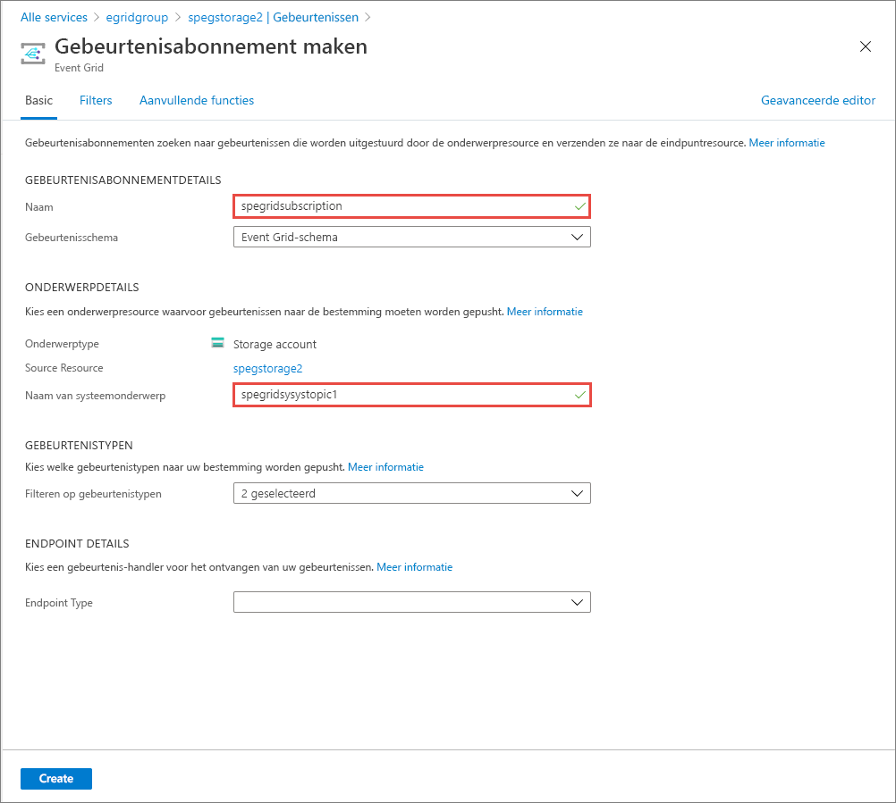
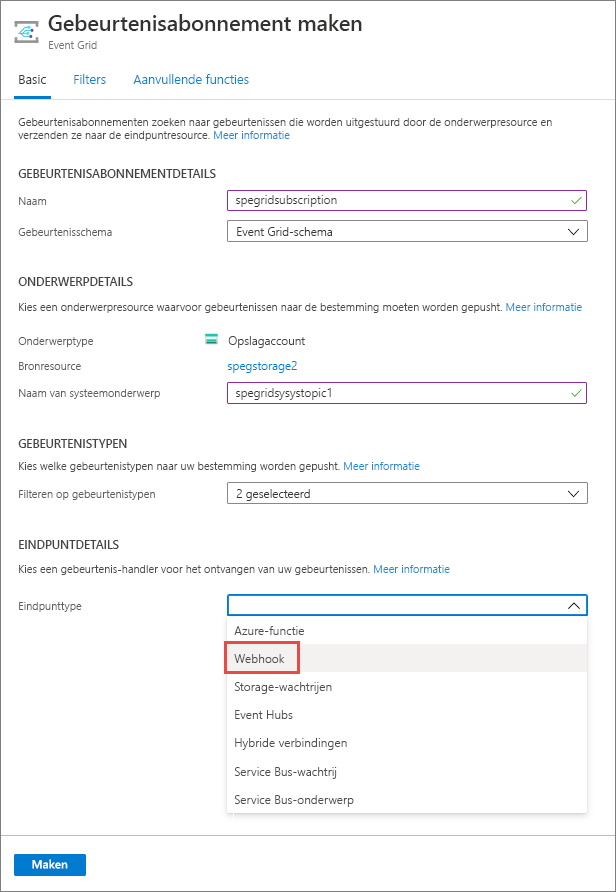
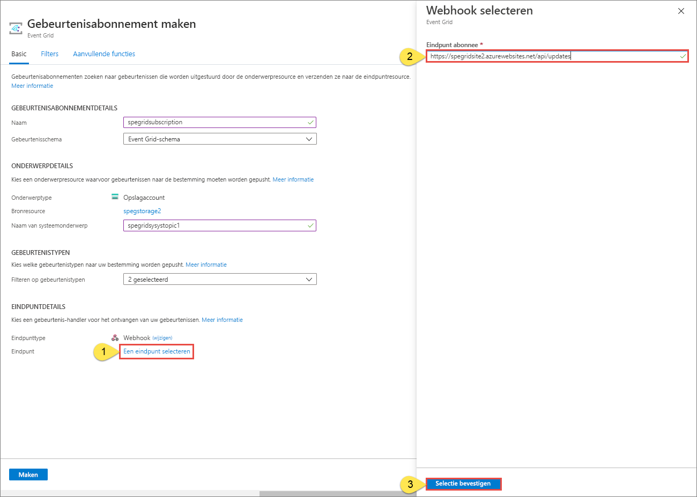

# Quickstart: Blob Storage-gebeurtenissen routeren naar een webeindpunt met Azure Portal

Azure Event Grid is een gebeurtenisservice voor de cloud. In dit artikel gebruikt u Azure Portal om een Blob-opslagaccount te maken, u aan te melden bij gebeurtenissen voor die blob-opslag en een gebeurtenis te activeren om het resultaat weer te geven. Normaal gesproken verzendt u gebeurtenissen naar een eindpunt dat de gebeurtenisgegevens verwerkt en vervolgens in actie komt. Ter vereenvoudiging van dit artikel stuurt u hier de gebeurtenissen echter naar een web-app die de berichten verzamelt en weergeeft.

[!INCLUDE [quickstarts-free-trial-note.md](../../includes/quickstarts-free-trial-note.md)]

Wanneer u klaar bent, ziet u dat de gebeurtenisgegevens naar de web-app zijn verzonden.

## Create a storage account

1. Meld u aan bij de [Azure-portal](https://portal.azure.com/).

1. Selecteer **Een resource maken** als u een Blob-opslag wilt maken. 

1. Selecteer **Opslag** als u de beschikbare opties wilt filteren en selecteer **Storage-account - blob, file, table, queue**.

   

   Voor het abonneren op gebeurtenissen moet u een algemeen v2-opslagaccount of een Blob-opslagaccount maken.
   
1. Voer op de pagina **Opslagaccount maken** de volgende stappen uit:
    1. Selecteer uw Azure-abonnement. 
    2. Geef voor **Resourcegroep** een nieuwe resourcegroep op of selecteer een bestaande. 
    3. Voer de naam in van uw opslagaccount. 
    4. Selecteer **Controleren + maken**. 

           
    5. Controleer de instellingen op de pagina **Controleren en maken** en selecteer **Maken**. 

        >[!NOTE]
        > Alleen opslagaccounts van het type **StorageV2 (algemeen gebruik v2)** en integratie van **BlobStorage-** ondersteuningsgebeurtenissen. **Storage (algemeen gebruik v1)** biedt *geen* ondersteuning voor integratie met Event Grid.

## Het eindpunt van een bericht maken

Voordat u zich kunt abonneren op gebeurtenissen voor de Blob-opslag, moet u het eindpunt voor het gebeurtenisbericht maken. Het eindpunt onderneemt normaal gesproken actie op basis van de gebeurtenisgegevens. Ter vereenvoudiging van deze snelstart gaat u een [vooraf gebouwde web-app](https://github.com/Azure-Samples/azure-event-grid-viewer) implementeren waarmee de gebeurtenisberichten worden weergegeven. De geïmplementeerde oplossing omvat een App Service-plan, een App Service-web-app en broncode van GitHub.

1. Selecteer **Implementeren in Azure** om de oplossing voor uw abonnement te implementeren. 

   
2. Voer op de pagina **Aangepaste implementatie** de volgende stappen uit: 
    1. Selecteer voor **Resourcegroep** de resourcegroep die u hebt gemaakt toen u het opslagaccount maakte. Het is voor u eenvoudiger om op te schonen door de resourcegroep te verwijderen wanneer u klaar bent met de zelfstudie.  
    2. Voer in het vak **Sitenaam** een naam in voor de web-app.
    3. Voer voor **Naam van hostingplan** een naam in voor het App Service-plan dat u wilt gebruiken voor het hosten van de web-app.
    4. Schakel het selectievakje in voor **Ik ga akkoord met de bovenstaande voorwaarden**. 
    5. Selecteer **Aankoop**. 

       
1. De implementatie kan enkele minuten duren. Selecteer Waarschuwingen (belpictogram) in de portal en selecteer vervolgens **Naar de resourcegroep gaan**. 

    
4. Selecteer in de lijst met resources op de pagina **Resourcegroep** de web-app die u hebt gemaakt. U ziet ook het App Service-plan en het opslagaccount in deze lijst. 

    
5. Selecteer op de pagina **App Service** voor uw web-app de URL om naar de website te gaan. De URL moet de volgende indeling hebben: `https://<your-site-name>.azurewebsites.net`.
    
    

6. Controleer of de site wordt weergegeven en dat er zijn nog geen gebeurtenissen naar zijn gepost.

   

[!INCLUDE [event-grid-register-provider-portal.md](../../includes/event-grid-register-provider-portal.md)]

## Abonneren op de Blob-opslag

U abonneert u op een onderwerp om Event Grid te laten weten welke gebeurtenissen u wilt traceren en waar de gebeurtenissen naartoe moeten worden gestuurd.

1. Navigeer in de portal naar uw Azure Storage-account dat u eerder hebt gemaakt. Selecteer in het menu aan de linkerkant **Alle resources** en selecteer uw opslagaccount. 
2. Selecteer op de pagina **Opslagaccount** de optie **Gebeurtenissen** in het linkermenu. 
1. Selecteer **Meer opties** en **Webhook**. U verzendt gebeurtenissen naar uw viewer-app met behulp van een webhook voor het eindpunt. 

   
3. Voer op de pagina **Gebeurtenisabonnement maken** de volgende stappen uit: 
    1. Voer een **naam** in voor het gebeurtenisabonnement.
    2. Voer een **naam** in voor het **systeemonderwerp**. Zie [Overzicht van systeemonderwerpen](system-topics.md) voor meer informatie over systeemonderwerpen.

       
    2. Selecteer **Webhook** voor het **Eindpunttype**. 

       
4. Klik bij **Eindpunt** op **Een eindpunt selecteren** en voer de URL van uw web-app in. Voeg `api/updates` toe aan de URL van de startpagina (bijvoorbeeld `https://spegridsite.azurewebsites.net/api/updates`) en selecteer **Selectie bevestigen**.

   
5. Selecteer nu op de pagina **Gebeurtenisabonnement maken** de optie **Maken** om het gebeurtenisabonnement te maken. 

   

1. Bekijk opnieuw uw web-app en u zult zien dat er een validatiegebeurtenis voor een abonnement naartoe is verzonden. Selecteer het oogpictogram om de gebeurtenisgegevens uit te breiden. Via Event Grid wordt de validatiegebeurtenis verzonden zodat het eindpunt kan controleren of de gebeurtenisgegevens in aanmerking komen om ontvangen te worden. De web-app bevat code waarmee het abonnement kan worden gevalideerd.

   

Nu gaan we een gebeurtenis activeren om te zien hoe het bericht via Event Grid naar het eindpunt wordt gedistribueerd.

## Een gebeurtenis verzenden naar het eindpunt

U activeert een gebeurtenis voor de Blob-opslag door een bestand te uploaden. Het bestand heeft geen specifieke inhoud nodig. In de artikelen wordt ervan uitgegaan dat u een bestand met de naam testfile.txt hebt, maar het bestand kan elke willekeurige naam hebben.

1. Ga in de Azure Portal naar uw Blob Storage-account en selecteer **Containers** op de pagina **Overzicht**.

   

1. Selecteer **+ Container**. Geef de container een naam en gebruik een willekeurig toegangsniveau. Selecteer **Maken**. 

   

1. Selecteer de nieuwe container.

   

1. Als u een bestand wilt uploaden, selecteert u **Uploaden**. Blader op de pagina **Blob uploaden** naar het bestand dat u wilt uploaden om te testen en selecteer **Uploaden**. 

   

1. Blader naar het testbestand en upload het.

1. U hebt de gebeurtenis geactiveerd en Event Grid heeft het bericht verzonden naar het eindpunt dat u hebt geconfigureerd toen u zich abonneerde. Het bericht heeft de JSON-indeling en bevat een matrix met een of meer gebeurtenissen. In het volgende voorbeeld bevat het JSON-bericht een matrix met één gebeurtenis. Wanneer u uw web-app bekijkt, ziet u dat er een **blob**-gebeurtenis is ontvangen. 

   

## Resources opschonen

Als u verder wilt werken met deze gebeurtenis, schoon dan de resources die u in dit artikel hebt gemaakt, niet op. Verwijder anders de resources die u in dit artikel hebt gemaakt.

Selecteer de resourcegroep en klik op **Resourcegroep verwijderen**.

## Volgende stappen

U weet nu hoe u aangepaste onderwerpen maakt en hoe u zich abonneert op een gebeurtenis. Kijk waar Event Grid u nog meer bij kan helpen:

- [Over Event Grid](overview.md)
- [Blob Storage-gebeurtenissen naar een aangepast eindpunt op het web routeren](../storage/blobs/storage-blob-event-quickstart.md?toc=%2fazure%2fevent-grid%2ftoc.json)
- [Monitor virtual machine changes with Azure Event Grid and Logic Apps](monitor-virtual-machine-changes-event-grid-logic-app.md) (Wijzigingen in virtuele machines bewaken met Azure Event Grid en Logic Apps)
- [Big data streamen naar een datawarehouse](event-grid-event-hubs-integration.md)
