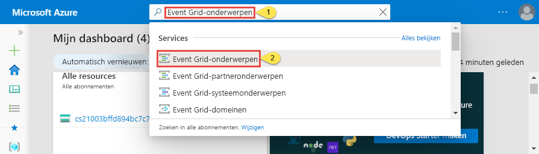
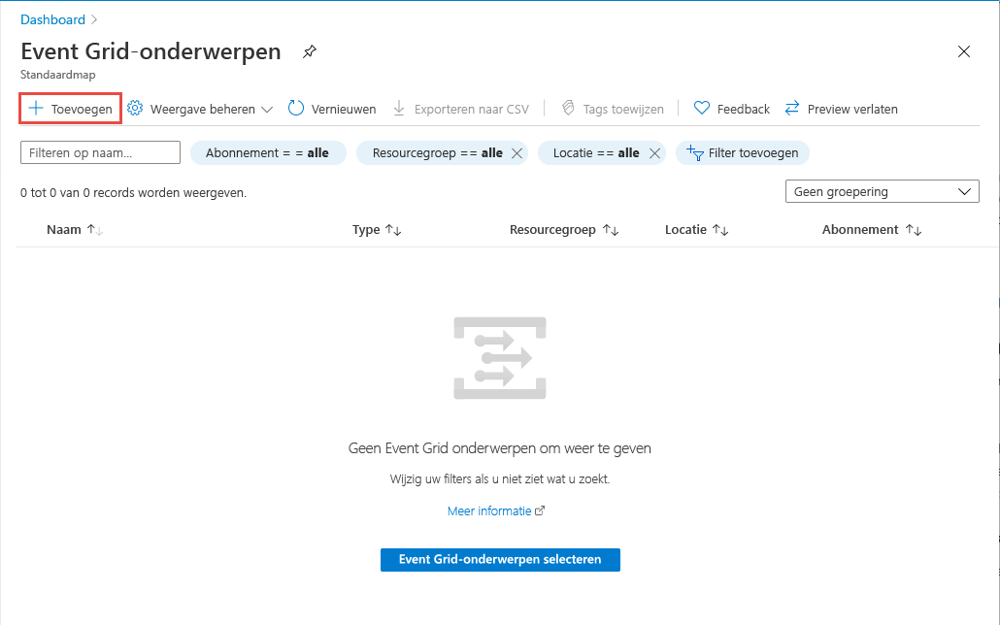
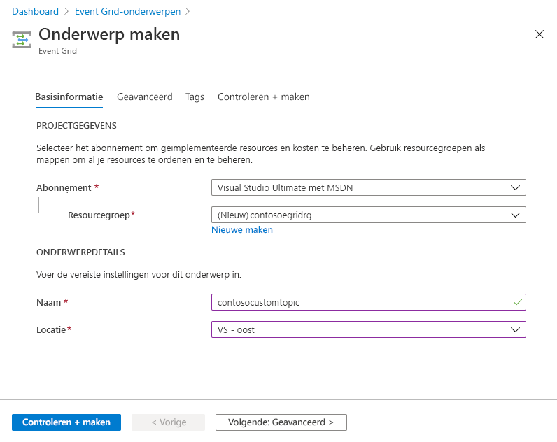
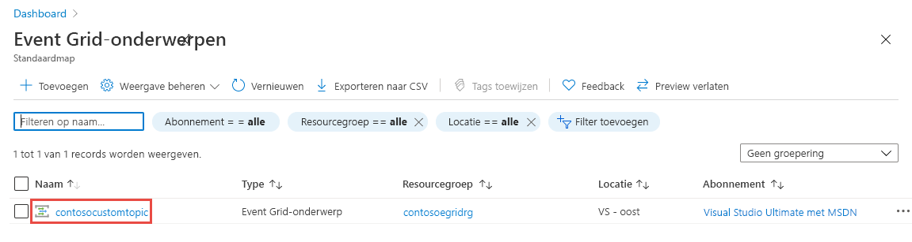
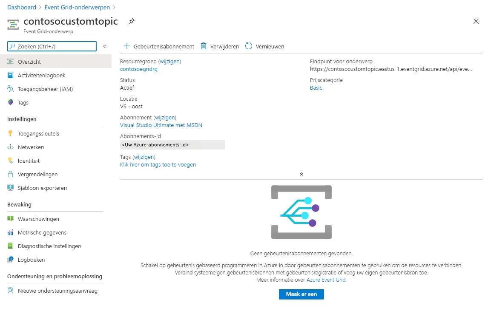
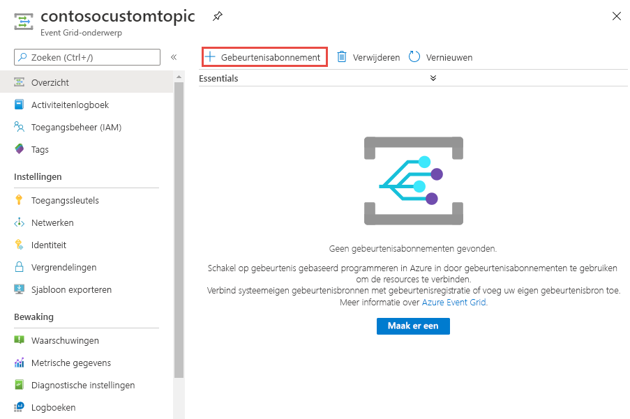
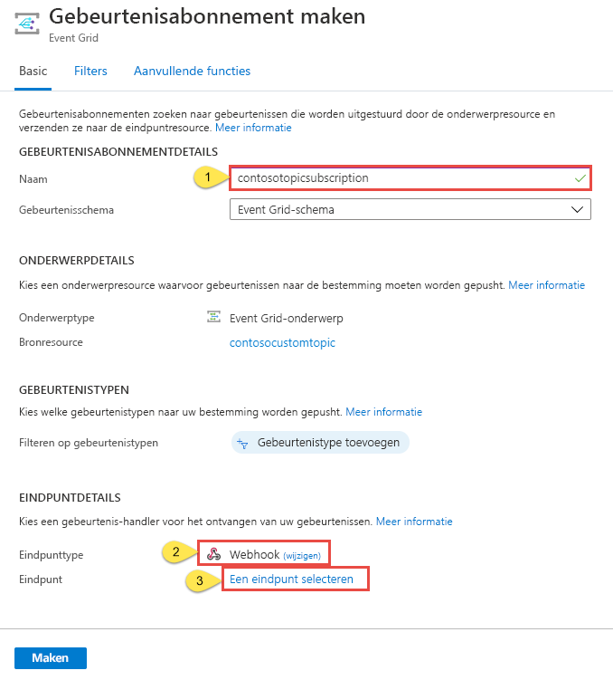
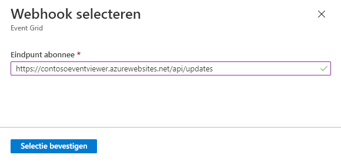
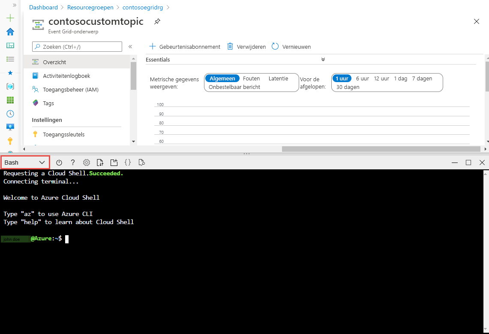

# <a name="quickstart-route-custom-events-to-web-endpoint-with-the-azure-portal-and-event-grid"></a>Snelstartgids: aangepaste gebeurtenissen naar een webeindpunt door sturen met de Azure Portal en Event Grid

Azure Event Grid is een gebeurtenisservice voor de cloud. In dit artikel gebruikt u Azure Portal om een aangepast onderwerp te maken, u op het aangepaste onderwerp te abonneren, en de gebeurtenis te activeren om het resultaat weer te geven. Normaal gesproken verzendt u gebeurtenissen naar een eindpunt dat de gebeurtenisgegevens verwerkt en vervolgens in actie komt. Ter vereenvoudiging van dit artikel stuurt u hier de gebeurtenissen echter naar een web-app die de berichten verzamelt en weergeeft.

Wanneer u klaar bent, ziet u dat de gebeurtenisgegevens naar de web-app zijn verzonden.


[!INCLUDE [updated-for-az](../../includes/updated-for-az.md)]

[!INCLUDE [quickstarts-free-trial-note.md](../../includes/quickstarts-free-trial-note.md)]

[!INCLUDE [event-grid-register-provider-portal.md](../../includes/event-grid-register-provider-portal.md)]

## <a name="create-a-custom-topic"></a>Een aangepast onderwerp maken

Een Event Grid-onderwerp biedt een door de gebruiker gedefinieerd eindpunt waarop u de gebeurtenissen kunt posten. 

1. Meld u aan bij de [Azure-portal](https://portal.azure.com/).
2. Selecteer **alle services** in het navigatie menu links, zoek naar **Event Grid**en selecteer **Event grid onderwerpen**. 

    
3. Selecteer op de pagina **Event grid onderwerpen** **+ toevoegen** op de werk balk. 

    
4. Voer op de pagina **onderwerp maken** de volgende stappen uit:
    1. Geef een unieke **naam** op voor het aangepaste onderwerp. De onderwerpnaam moet uniek zijn omdat deze wordt vertegenwoordigd door een DNS-vermelding. Gebruik niet de naam die in de afbeelding wordt weergegeven. Maak in plaats daarvan uw eigen naam - deze moet tussen 3 en 50 tekens lang zijn en mag alleen de waarden a-z, A-Z, 0-9 en '-' bevatten.
    2. Selecteer uw Azure-**abonnement**.
    3. Selecteer een bestaande resource groep of selecteer **nieuwe maken**en voer een **naam** in voor de **resource groep**.
    4. Selecteer een **locatie** voor het onderwerp Event grid.
    5. Behoud de standaard waarde **Event grid schema** voor het veld **gebeurtenis schema** . 

       
    6. Selecteer **Maken**. 
5. Nadat het aangepaste onderwerp is gemaakt, ziet u een melding dat de implementatie gelukt is. Selecteer **Ga naar resource groep**. 

   
6. Selecteer op de pagina **resource groep** het onderwerp Event grid. 

   
7. U ziet de pagina **Event grid onderwerp** voor uw event grid. Laat deze pagina geopend. U kunt deze later in de Quick Start gebruiken. 

    

## <a name="create-a-message-endpoint"></a>Het eindpunt van een bericht maken
Voordat u een abonnement voor het aangepaste onderwerp maakt, maakt u een eind punt voor het gebeurtenis bericht. Het eindpunt onderneemt normaal gesproken actie op basis van de gebeurtenisgegevens. Ter vereenvoudiging van deze snelstart gaat u een [vooraf gebouwde web-app](https://github.com/Azure-Samples/azure-event-grid-viewer) implementeren waarmee de gebeurtenisberichten worden weergegeven. De geïmplementeerde oplossing omvat een App Service-plan, een App Service-web-app en broncode van GitHub.

1. Selecteer op de pagina artikel de optie **implementeren naar Azure** om de oplossing te implementeren voor uw abonnement. Geef in Azure Portal waarden op voor de parameters.

   <a href="https://portal.azure.com/#create/Microsoft.Template/uri/https%3A%2F%2Fraw.githubusercontent.com%2FAzure-Samples%2Fazure-event-grid-viewer%2Fmaster%2Fazuredeploy.json" target="_blank"></a>
1. De implementatie kan enkele minuten duren. Controleer of uw web-app wordt uitgevoerd nadat de implementatie is voltooid. Navigeer in een webbrowser naar: `https://<your-site-name>.azurewebsites.net`
1. De site wordt weergegeven, maar er zijn nog geen gebeurtenissen op gepubliceerd.

   

## <a name="subscribe-to-custom-topic"></a>Abonneren op aangepast onderwerp

U abonneert u op een Event Grid-onderwerp om Event Grid te laten weten welke gebeurtenissen u wilt traceren en waar de gebeurtenissen naartoe moeten worden gestuurd.

1. Selecteer nu op de pagina **onderwerp Event grid** voor uw aangepaste onderwerp **+ gebeurtenis abonnement** op de werk balk.

   
2. Voer op de pagina **gebeurtenis abonnement maken** de volgende stappen uit:
    1. Voer een **naam** in voor het gebeurtenis abonnement.
    3. Selecteer een **webhook** voor het **type eind punt**. 
    4. Kies **een eind punt selecteren**. 

       
    5. Voor het webhookeindpunt geeft u de URL van uw web-app op en voegt u `api/updates` toe aan de URL van de startpagina. Selecteer **Confirm Selection** (Selectie bevestigen).

       
    6. Selecteer op de pagina **gebeurtenis abonnement maken** de optie **maken**.

3. Bekijk opnieuw uw web-app en u zult zien dat er een validatiegebeurtenis voor een abonnement naartoe is verzonden. Selecteer het oogpictogram om de gebeurtenisgegevens uit te breiden. Via Event Grid wordt de validatiegebeurtenis verzonden zodat het eindpunt kan controleren of de gebeurtenisgegevens in aanmerking komen om ontvangen te worden. De web-app bevat code waarmee het abonnement kan worden gevalideerd.

    

## <a name="send-an-event-to-your-topic"></a>Een gebeurtenis verzenden naar het onderwerp

Nu gaan we een gebeurtenis activeren om te zien hoe het bericht via Event Grid naar het eindpunt wordt gedistribueerd. Gebruik Azure CLI of PowerShell om een testgebeurtenis te verzenden naar uw aangepaste onderwerp. Meestal worden de gebeurtenisgegevens verzonden via een toepassing of Azure-service.

Het eerste voorbeeld maakt gebruik van Azure CLI. In dit voorbeeld worden de URL en de sleutel voor het aangepaste onderwerp, plus de voorbeeldgegevens van de gebeurtenis opgehaald. Gebruik de naam van het aangepaste onderwerp voor `<topic name>`. Hiermee worden voorbeeldgebeurtenisgegevens gemaakt. Het element `data` van de JSON is de nettolading van de gebeurtenis. Elke juist opgemaakte JSON kan in dit veld worden ingevoerd. U kunt het onderwerpveld ook gebruiken voor geavanceerd routeren en filteren. CURL is een hulpprogramma waarmee HTTP-aanvragen worden verzonden.


### <a name="azure-cli"></a>Azure CLI
1. Selecteer **Cloud shell**In het Azure Portal. Selecteer **bash** in de linkerbovenhoek van het Cloud shell-venster. 

    
1. Voer de volgende opdracht uit om het **eind punt** voor het onderwerp op te halen: nadat u de opdracht hebt gekopieerd en geplakt, werkt u de **onderwerpnaam** en de naam van de **resource groep** bij voordat u de opdracht uitvoert. 

    ```azurecli
    endpoint=$(az eventgrid topic show --name <topic name> -g <resource group name> --query "endpoint" --output tsv)
    ```
2. Voer de volgende opdracht uit om de **sleutel** op te halen voor het aangepaste onderwerp: nadat u de opdracht hebt gekopieerd en geplakt, werkt u de **onderwerpnaam** en de naam van de **resource groep** bij voordat u de opdracht uitvoert. 

    ```azurecli
    key=$(az eventgrid topic key list --name <topic name> -g <resource group name> --query "key1" --output tsv)
    ```
3. Kopieer de volgende instructie met de gebeurtenis definitie en druk op **Enter**. 

    ```json
    event='[ {"id": "'"$RANDOM"'", "eventType": "recordInserted", "subject": "myapp/vehicles/motorcycles", "eventTime": "'`date +%Y-%m-%dT%H:%M:%S%z`'", "data":{ "make": "Ducati", "model": "Monster"},"dataVersion": "1.0"} ]'
    ```
4. Voer de volgende **krul** opdracht uit om de gebeurtenis te plaatsen:

    ```
    curl -X POST -H "aeg-sas-key: $key" -d "$event" $endpoint
    ```

### <a name="azure-powershell"></a>Azure PowerShell
In het tweede voorbeeld wordt PowerShell gebruikt om gelijksoortige stappen uit te voeren.

1. Selecteer in de Azure Portal **Cloud shell** (Ga ook naar https://shell.azure.com/). Selecteer **Power shell** in de linkerbovenhoek van het venster Cloud shell. Zie de **Cloud shell** venster afbeelding voor beeld in de sectie Azure cli.
2. Stel de volgende variabelen in. Nadat u elke opdracht hebt gekopieerd en geplakt, werkt u de **onderwerpnaam** en de naam van de **resource groep** bij voordat u de opdracht uitvoert:

    ```powershell
    $resourceGroupName = <resource group name>
    $topicName = <topic name>
    ```
3. Voer de volgende opdrachten uit om het **eind punt** en de **sleutels** voor het onderwerp op te halen:

    ```powershell
    $endpoint = (Get-AzEventGridTopic -ResourceGroupName $resourceGroupName -Name $topicName).Endpoint
    $keys = Get-AzEventGridTopicKey -ResourceGroupName $resourceGroupName -Name $topicName
    ```
4. De gebeurtenis voor te bereiden. Kopieer de instructies en voer deze uit in het venster Cloud Shell. 

    ```powershell
    $eventID = Get-Random 99999

    #Date format should be SortableDateTimePattern (ISO 8601)
    $eventDate = Get-Date -Format s

    #Construct body using Hashtable
    $htbody = @{
        id= $eventID
        eventType="recordInserted"
        subject="myapp/vehicles/motorcycles"
        eventTime= $eventDate   
        data= @{
            make="Ducati"
            model="Monster"
        }
        dataVersion="1.0"
    }
    
    #Use ConvertTo-Json to convert event body from Hashtable to JSON Object
    #Append square brackets to the converted JSON payload since they are expected in the event's JSON payload syntax
    $body = "["+(ConvertTo-Json $htbody)+"]"
    ```
5. Gebruik de cmdlet **invoke-WebRequest** om de gebeurtenis te verzenden. 

    ```powershell
    Invoke-WebRequest -Uri $endpoint -Method POST -Body $body -Headers @{"aeg-sas-key" = $keys.Key1}
    ```

### <a name="verify-in-the-event-grid-viewer"></a>Controleren in de Event Grid viewer
U hebt de gebeurtenis geactiveerd en Event Grid heeft het bericht verzonden naar het eindpunt dat u hebt geconfigureerd toen u zich abonneerde. Bekijk uw web-app om de gebeurtenis te zien die u zojuist hebt verzonden.

```json
{
  "id": "974",
  "eventType": "recordInserted",
  "subject": "myapp/vehicles/motorcycles",
  "eventTime": "2019-03-28T01:11:59+00:00",
  "data": {
    "make": "Ducati",
    "model": "Monster"
  },
  "dataVersion": "1.0",
  "metadataVersion": "1",
  "topic": "/subscriptions/11111111-1111-1111-1111-111111111111/resourceGroups/myegridrg/providers/Microsoft.EventGrid/topics/myegridtopic"
}
```

## <a name="clean-up-resources"></a>Resources opschonen
Als u verder wilt werken met deze gebeurtenis, schoon dan de resources die u in dit artikel hebt gemaakt, niet op. Verwijder anders de resources die u in dit artikel hebt gemaakt.

1. Selecteer **resource groepen** in het menu links. Als u deze niet ziet, selecteert u in het menu links **alle services** en selecteert u **resource groepen**. 
2. Selecteer de resource groep om de pagina **resource groep** te starten. 
3. Selecteer **resource groep verwijderen** op de werk balk. 
4. Bevestig de verwijdering door de naam van de resource groep in te voeren en **verwijderen**te selecteren. 

    

    De andere resource groep die u in de installatie kopie ziet, is gemaakt en gebruikt door het Cloud Shell venster. Als u het venster Cloud Shell later niet wilt gebruiken, moet u het verwijderen. 

## <a name="next-steps"></a>Volgende stappen

U weet nu hoe u aangepaste onderwerpen maakt en hoe u zich abonneert op een gebeurtenis. Kijk waar Event Grid u nog meer bij kan helpen:

- [Over Event Grid](overview.md)
- [Blob Storage-gebeurtenissen naar een aangepast eindpunt op het web routeren](../storage/blobs/storage-blob-event-quickstart.md?toc=%2fazure%2fevent-grid%2ftoc.json)
- [Monitor virtual machine changes with Azure Event Grid and Logic Apps](monitor-virtual-machine-changes-event-grid-logic-app.md) (Wijzigingen in virtuele machines bewaken met Azure Event Grid en Logic Apps)
- [Big data streamen naar een datawarehouse](event-grid-event-hubs-integration.md)
