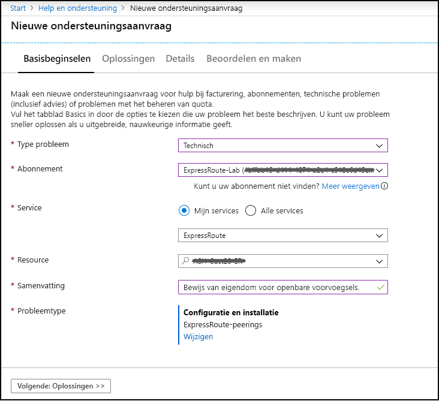
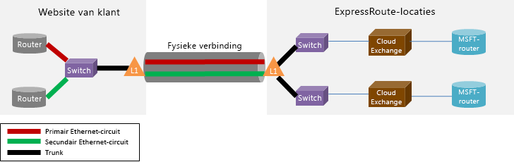

# Veelgestelde vragen ExpressRoute

## Wat is ExpressRoute?

ExpressRoute is een Azure-service waarmee u particuliere verbindingen kunt maken tussen micro soft-data centers en infra structuur op uw locatie of in een functie voor samen locatie. ExpressRoute-verbindingen gaan niet via het open bare Internet en bieden betere beveiliging, betrouw baarheid en snelheden met lagere latenties dan typische verbindingen via internet.

### Wat zijn de voor delen van het gebruik van ExpressRoute-en particuliere netwerk verbindingen?

ExpressRoute-verbindingen gaan niet via het openbare internet. Ze bieden betere beveiliging, betrouw baarheid en snelheden, met lagere en consistente latenties dan typische verbindingen via internet. In sommige gevallen kan het gebruik van ExpressRoute-verbindingen voor het overdragen van gegevens tussen on-premises apparaten en Azure aanzienlijke kosten voordelen opleveren.

### Waar is de service beschikbaar?

Zie deze pagina voor service locatie en beschik baarheid: [ExpressRoute partners en locaties](expressroute-locations.md).

### Hoe kan ik ExpressRoute gebruiken om verbinding te maken met micro soft als ik geen partnerschappen met een van de ExpressRoute-vervoerders partners heb?

U kunt een regionale transporteur en land-Ethernet-verbindingen selecteren op een van de ondersteunde Exchange-provider locaties. Vervolgens kunt u met micro soft een peer op de locatie van de provider. Raadpleeg de laatste sectie van [ExpressRoute-partners en-locaties](expressroute-locations.md) om te zien of uw service provider aanwezig is op een van de Exchange-locaties. Vervolgens kunt u een ExpressRoute-circuit best Ellen via de service provider om verbinding te maken met Azure.

### Wat kost ExpressRoute?

Bekijk de [prijs](https://azure.microsoft.com/pricing/details/expressroute/) informatie voor prijs gegevens.

### Als ik betaal voor een ExpressRoute-circuit van een bepaalde band breedte, moet de VPN-verbinding die ik aanschaf van mijn netwerk serviceprovider dezelfde snelheid hebben?

Nee. U kunt een VPN-verbinding kopen van elke snelheid van uw service provider. Uw verbinding met Azure is echter beperkt tot de band breedte van het ExpressRoute-circuit dat u aanschaft.

### Als ik voor een ExpressRoute-circuit van een bepaalde band breedte betaal, heb ik dan de mogelijkheid om zo nodig een hogere snelheid te bieden?

Ja. ExpressRoute-circuits worden zo geconfigureerd dat u Maxi maal twee keer de benodigde bandbreedte limiet kunt gebruiken voor extra kosten. Neem contact op met uw service provider om na te gaan of deze mogelijkheid wordt ondersteund. Dit is niet gedurende een langere periode en is niet gegarandeerd.  Als verkeer via een ExpressRoute-gateway loopt, is de band breedte voor de SKU vast en niet bursteel.

### Kan ik dezelfde particuliere netwerk verbinding gebruiken met het virtuele netwerk en andere Azure-Services tegelijk?

Ja. Wanneer u een ExpressRoute-circuit hebt ingesteld, kunt u toegang krijgen tot services binnen een virtueel netwerk en andere Azure-Services tegelijk. U maakt verbinding met virtuele netwerken via het pad van de persoonlijke peer en naar andere services via het micro soft-peering-pad.

### Hoe worden VNets geadverteerd op ExpressRoute-privé-peering?

De ExpressRoute-gateway adverteert de *adres ruimte (n)* van het Azure VNet, dat u niet kunt opnemen/uitsluiten op het niveau van het subnet. Het is altijd de VNet-adres ruimte die wordt geadverteerd. Als VNet-peering wordt gebruikt en de peered VNet is ingeschakeld, wordt ook de adres ruimte van het gekoppelde VNet geadverteerd.

### Hoeveel voor voegsels kunnen worden geadverteerd van een VNet naar on-premises op ExpressRoute privé-peering?

Er zijn Maxi maal 200 voor voegsels die worden geadverteerd op één ExpressRoute-verbinding of via VNet-peering met behulp van gateway-door voer. Als u bijvoorbeeld 199 adres ruimten hebt op één VNet dat is verbonden met een ExpressRoute-circuit, worden alle 199 van die voor voegsels op locatie geadverteerd. Als u een VNet hebt ingeschakeld om Gateway-overdracht toe te staan met 1 adres ruimte en 150 spaken VNets ingeschakeld met de optie externe gateway toestaan, adverteert het VNet dat is geïmplementeerd met de gateway 151 voor voegsels aan on-premises.

### Wat gebeurt er als ik de limiet voor het voor voegsel voor een ExpressRoute-verbinding overschrijd?

De verbinding tussen het ExpressRoute-circuit en de gateway (en de peered VNets met behulp van gateway-door Voer, indien van toepassing) gaat verder. Er wordt opnieuw ingesteld wanneer de limiet voor het voor voegsel niet langer wordt overschreden.  

### Kan ik routes filteren die afkomstig zijn van mijn on-premises netwerk?

De enige manier voor het filteren/insluiten van routes bevindt zich op de on-premises edge-router. Door de gebruiker gedefinieerde routes kunnen in het VNet worden toegevoegd om de specifieke route ring te beïnvloeden, maar dit is statisch en maakt geen deel uit van de BGP-advertisement.

### Biedt ExpressRoute een Service Level Agreement (SLA)?

Zie de pagina [EXPRESSROUTE Sla](https://azure.microsoft.com/support/legal/sla/) voor meer informatie.

## Ondersteunde services

ExpressRoute ondersteunt [drie routerings domeinen](expressroute-circuit-peerings.md) voor diverse typen services: persoonlijke peering, micro soft-peering en open bare peering (afgeschaft).

### Persoonlijke peering

**Geboden**

* Virtuele netwerken, inclusief alle virtuele machines en Cloud Services

### Microsoft-peering

Als uw ExpressRoute-circuit is ingeschakeld voor Azure micro soft-peering, kunt u toegang krijgen tot de [open bare IP-](../virtual-network/virtual-network-ip-addresses-overview-arm.md#public-ip-addresses) adresbereiken die worden gebruikt in azure via het circuit. Azure micro soft-peering biedt toegang tot services die momenteel worden gehost op Azure (met geografische beperkingen, afhankelijk van de SKU van uw circuit). Als u de beschik baarheid voor een specifieke service wilt valideren, kunt u de documentatie voor die service controleren om te zien of er een gereserveerd bereik voor die service is gepubliceerd. Zoek vervolgens de IP-bereiken van de doel service op en vergelijk met de bereiken die worden vermeld in het [Azure IP-bereik en de service Tags – open bare Cloud XML-bestand](https://www.microsoft.com/download/details.aspx?id=56519). U kunt ook een ondersteunings ticket voor de betreffende service openen ter verduidelijking.

**Geboden**

* [Office 365](https://aka.ms/ExpressRouteOffice365)
* Power BI-beschikbaar via een regionale community van Azure, Zie [hier](https://docs.microsoft.com/power-bi/service-admin-where-is-my-tenant-located) voor meer informatie over de regio van uw Power bi Tenant.
* Azure Active Directory
* [Azure-DevOps](https://blogs.msdn.microsoft.com/devops/2018/10/23/expressroute-for-azure-devops/) (Azure Global Services Community)
* Open bare IP-adressen van Azure voor IaaS (Virtual Machines, Virtual Network gateways, load balancers, enz.)  
* De meeste andere Azure-Services worden ook ondersteund. Neem rechtstreeks contact op met de service die u wilt gebruiken om de ondersteuning te controleren.

**Niet ondersteund:**

* CDN
* Azure Front Door
* [Windows Virtual Desktop](https://azure.microsoft.com/services/virtual-desktop/)
* Multi-factor Authentication-Server (verouderd)
* Traffic Manager

### Openbare peering

Open bare peering is uitgeschakeld op nieuwe ExpressRoute-circuits. Azure-Services zijn nu beschikbaar op micro soft-peering. Als u een circuit hebt gemaakt dat vóór open bare peering werd afgeschaft, kunt u kiezen voor het gebruik van micro soft-peering of open bare peering, afhankelijk van de gewenste services.

Zie [ExpressRoute Public peering](about-public-peering.md)(Engelstalig) voor meer informatie over en configuratie stappen voor open bare peering.

### Waarom zie ' geadverteerde open bare voor voegsels ' als ' validatie vereist ' tijdens het configureren van micro soft-peering?

Micro soft controleert of de opgegeven ' aangekondigde open bare voor voegsels ' en ' peer-ASN ' (of ' klant-ASN ') aan u zijn toegewezen in het Internet Routing REGI ster. Als u de open bare voor voegsels van een andere entiteit krijgt en de toewijzing niet is vastgelegd met het routerings register, wordt de automatische validatie niet voltooid en moet hand matig worden gevalideerd. Als de automatische validatie mislukt, wordt het bericht validatie vereist weer gegeven.

Als u het bericht validatie vereist ziet, verzamelt u de documenten die de open bare voor voegsels bevatten, worden toegewezen aan uw organisatie door de entiteit die wordt vermeld als de eigenaar van de voor voegsels in het routerings register en verzendt deze documenten voor hand matige validatie door een ondersteunings ticket te openen, zoals hieronder wordt weer gegeven.

### Wordt Dynamics 365 ondersteund op ExpressRoute?

De omgevingen Dynamics 365 en Common Data Service (CDS) worden gehost op Azure en daarom kunnen klanten profiteren van de onderliggende ExpressRoute-ondersteuning voor Azure-resources. U kunt verbinding maken met de service-eind punten als uw router filter de Azure-regio's bevat waarin uw Dynamics 365/CDS-omgevingen worden gehost.

> [!NOTE]
> [ExpressRoute Premium](https://docs.microsoft.com/azure/expressroute/expressroute-faqs#expressroute-premium) is **niet** vereist voor Dynamics 365-connectiviteit via Azure ExpressRoute als het ExpressRoute-circuit in dezelfde [geopolitieke regio](https://docs.microsoft.com/azure/expressroute/expressroute-locations-providers#expressroute-locations)wordt geïmplementeerd.

## Gegevens en verbindingen

### Gelden er limieten voor de hoeveelheid gegevens die ik kan overdragen met behulp van ExpressRoute?

Er is geen limiet ingesteld voor de hoeveelheid gegevens overdracht. Raadpleeg de [prijs informatie](https://azure.microsoft.com/pricing/details/expressroute/) voor informatie over de bandbreedte tarieven.

### Welke verbindings snelheden worden ondersteund door ExpressRoute?

Ondersteunde aanbiedingen voor band breedte:

50 Mbps, 100 Mbps, 200 Mbps, 500 Mbps, 1 Gbps, 2 Gbps, 5 Gbps, 10 Gbps

### Welke service providers zijn er beschikbaar?

Zie [ExpressRoute-partners en-locaties](expressroute-locations.md) voor de lijst met service providers en locaties.

## Technische details

### Wat zijn de technische vereisten voor het verbinden van mijn on-premises locatie met Azure?

Zie de [pagina met ExpressRoute-vereisten](expressroute-prerequisites.md) voor vereisten.

### Zijn er verbindingen met ExpressRoute redundant?

Ja. Elk ExpressRoute-circuit heeft een redundant paar Kruis verbindingen geconfigureerd om hoge Beschik baarheid te bieden.

### Gaat de verbinding verloren als een van mijn ExpressRoute-koppelingen mislukt?

Als een van de cross Connections mislukt, wordt de verbinding niet verbroken. Er is een redundante verbinding beschikbaar ter ondersteuning van de belasting van uw netwerk en biedt een hoge Beschik baarheid van uw ExpressRoute-circuit. U kunt ook een circuit maken op een andere locatie voor peering om tolerantie op circuit niveau te krijgen.

### Hoe kan ik de redundantie voor privé-peering implementeren?

Meerdere ExpressRoute-circuits van verschillende peering locaties of Maxi maal vier verbindingen vanaf dezelfde peering-locatie kunnen worden aangesloten op hetzelfde virtuele netwerk om hoge Beschik baarheid te bieden in het geval dat één circuit niet beschikbaar is. U kunt vervolgens [hogere gewichten toewijzen](https://docs.microsoft.com/azure/expressroute/expressroute-optimize-routing#solution-assign-a-high-weight-to-local-connection) aan een van de lokale verbindingen om de voor keur aan een specifiek circuit te geven. Het wordt ten zeerste aanbevolen om ten minste twee ExpressRoute-circuits in te stellen om afzonderlijke storings punten te voor komen. 

Bekijk [hier](https://docs.microsoft.com/azure/expressroute/designing-for-high-availability-with-expressroute) wat u kunt ontwerpen voor hoge Beschik baarheid en dat u [hier](https://docs.microsoft.com/azure/expressroute/designing-for-disaster-recovery-with-expressroute-privatepeering) kunt ontwerpen voor herstel na nood gevallen.  

### Hoe kan ik redundantie implementeren op micro soft-peering?

Het wordt ten zeerste aanbevolen wanneer klanten micro soft-peering gebruiken om toegang te krijgen tot open bare Azure-Services, zoals Azure Storage of Azure SQL, en klanten die gebruikmaken van micro soft-peering voor Office 365 dat ze meerdere circuits op verschillende peering-locaties implementeren om afzonderlijke storings punten te voor komen. Klanten kunnen hetzelfde voor voegsel op beide circuits adverteren en in [afwachting](https://docs.microsoft.com/azure/expressroute/expressroute-optimize-routing#solution-use-as-path-prepending) van het pad gebruiken, of verschillende voor voegsels adverteren om het pad van on-premises te bepalen.

Bekijk [hier](https://docs.microsoft.com/azure/expressroute/designing-for-high-availability-with-expressroute) wat u kunt ontwerpen voor hoge Beschik baarheid.

### Hoe kan ik zorgen voor hoge Beschik baarheid in een virtueel netwerk dat is verbonden met ExpressRoute?

U kunt hoge Beschik baarheid bezorgen door Maxi maal vier ExpressRoute-circuits op dezelfde peering-locatie aan uw virtuele netwerk te koppelen, of door ExpressRoute-circuits op verschillende peering locaties (bijvoorbeeld Singapore, Singapore2) te verbinden met uw virtuele netwerk. Als een ExpressRoute-circuit wordt uitgeschakeld, wordt er een failover voor de connectiviteit uitgevoerd naar een ander ExpressRoute-circuit. Standaard wordt het verkeer dat uw virtuele netwerk verlaat, doorgestuurd op basis van een gelijke prijs routering met meerdere paden (ECMP). U kunt het verbindings gewicht gebruiken om de voor keur aan een circuit te geven. Zie optimalisatie van ExpressRoute- [route ring](expressroute-optimize-routing.md)voor meer informatie.

### Hoe kan ik ervoor te zorgen dat mijn verkeer dat is bestemd voor open bare Azure-Services, zoals Azure Storage en Azure SQL op micro soft-peering of open bare peering, de voor keur heeft op het ExpressRoute-pad?

U moet het *lokale voorkeurs* kenmerk op uw router (s) implementeren om ervoor te zorgen dat het pad van on-premises naar Azure altijd de voor keur heeft voor uw ExpressRoute-circuit (s).

Zie [hier](https://docs.microsoft.com/azure/expressroute/expressroute-optimize-routing#path-selection-on-microsoft-and-public-peerings) voor meer informatie over het selecteren van BGP-paden en algemene router configuraties. 

### Als ik niet op de kant ben van een Cloud uitwisseling en mijn service provider een Point-to-point-verbinding biedt, moet ik dan twee fysieke verbindingen tussen mijn on-premises netwerk en micro soft best Ellen?

Als uw service provider twee virtuele Ethernet-circuits kan maken via de fysieke verbinding, hebt u slechts één fysieke verbinding nodig. De fysieke verbinding (bijvoorbeeld een optisch glas) wordt beëindigd op een apparaat met laag 1 (L1) (Zie de afbeelding). De twee virtuele Ethernet-circuits zijn gelabeld met verschillende VLAN-Id's, een voor het primaire circuit en een voor de secundaire. Deze VLAN-Id's bevinden zich in de buitenste 802.1 Q Ethernet-header. De interne 802.1 Q-Ethernet-header (niet weer gegeven) wordt toegewezen aan een specifiek [ExpressRoute-routerings domein](expressroute-circuit-peerings.md).

### Kan ik een van mijn VLAN'S uitbreiden naar Azure met behulp van ExpressRoute?

Nee. Laag 2-connectiviteits extensies worden niet ondersteund in Azure.

### Kan ik meer dan één ExpressRoute-circuit in mijn abonnement hebben?

Ja. U kunt meer dan één ExpressRoute-circuit in uw abonnement hebben. De standaard limiet is ingesteld op 10. Als dat nodig is, kunt u contact opnemen met Microsoft Ondersteuning om de limiet te verhogen.

### Kan ik ExpressRoute-circuits van verschillende service providers hebben?

Ja. U kunt ExpressRoute-circuits met veel service providers hebben. Elk ExpressRoute-circuit is alleen gekoppeld aan een service provider. 

### Ik zie twee ExpressRoute-peering locaties in dezelfde metro, bijvoorbeeld Singapore en Singapore2. Welke peering-locatie moet ik kiezen om mijn ExpressRoute-circuit te maken?
Als uw service provider ExpressRoute op beide sites biedt, kunt u samen werken met uw provider en een van beide locaties kiezen om ExpressRoute in te stellen. 

### Kan ik meerdere ExpressRoute-circuits hebben in dezelfde metro lijn? Kan ik deze koppelen aan hetzelfde virtuele netwerk?

Ja. U kunt meerdere ExpressRoute-circuits met dezelfde of verschillende service providers hebben. Als de metro meerdere ExpressRoute-peering locaties heeft en de circuits op verschillende peering-locaties worden gemaakt, kunt u deze koppelen aan hetzelfde virtuele netwerk. Als de circuits op dezelfde peering-locatie worden gemaakt, kunt u Maxi maal vier circuits koppelen aan hetzelfde virtuele netwerk.

### Hoe kan ik mijn virtuele netwerken met een ExpressRoute-circuit verbinden

De basis stappen zijn:

* Stel een ExpressRoute-circuit in en zorg ervoor dat de service provider deze functie inschakelt.
* U, of de provider, moet de BGP-peering (s) configureren.
* Koppel het virtuele netwerk aan het ExpressRoute-circuit.

Zie [ExpressRoute-werk stromen voor circuit inrichting en circuit statussen](expressroute-workflows.md)voor meer informatie.

### Zijn er connectiviteits grenzen voor mijn ExpressRoute-circuit?

Ja. Het artikel [ExpressRoute partners en locaties](expressroute-locations.md) bevat een overzicht van de connectiviteits grenzen voor een ExpressRoute-circuit. Connectiviteit voor een ExpressRoute-circuit is beperkt tot één geopolitieke regio. Connectiviteit kan worden uitgebreid naar geopolitieke regio's door de functie ExpressRoute Premium in te scha kelen.

### Kan ik aan meer dan één virtueel netwerk koppelen aan een ExpressRoute-circuit?

Ja. U kunt Maxi maal 10 virtuele netwerken verbindingen hebben met een standaard ExpressRoute-circuit en Maxi maal 100 op een [Premium ExpressRoute-circuit](#expressroute-premium). 

### Ik heb meerdere Azure-abonnementen die virtuele netwerken bevatten. Kan ik virtuele netwerken die zich in afzonderlijke abonnementen bevinden, verbinden met een enkel ExpressRoute-circuit?

Ja. U kunt Maxi maal 10 virtuele netwerken in hetzelfde abonnement als het circuit of andere abonnementen koppelen met een enkel ExpressRoute-circuit. Deze limiet kan worden verhoogd door de functie ExpressRoute Premium in te scha kelen.

Zie [een ExpressRoute-circuit delen over meerdere abonnementen](expressroute-howto-linkvnet-arm.md)voor meer informatie.

### Ik heb meerdere Azure-abonnementen gekoppeld aan verschillende Azure Active Directory tenants of Enterprise Agreement inschrijvingen. Kan ik virtuele netwerken die zich in afzonderlijke tenants en registraties bevinden, verbinden met een enkel ExpressRoute-circuit dat zich niet in dezelfde Tenant of inschrijving bevindt?

Ja. ExpressRoute-autorisaties kunnen abonnementen, tenants en inschrijvings grenzen hebben, zonder dat hiervoor aanvullende configuratie is vereist. 

Zie [een ExpressRoute-circuit delen over meerdere abonnementen](expressroute-howto-linkvnet-arm.md)voor meer informatie.

### Zijn er virtuele netwerken die zijn verbonden met hetzelfde circuit geïsoleerd van elkaar?

Nee. Vanuit een bewerkings perspectief worden alle virtuele netwerken die zijn gekoppeld aan hetzelfde ExpressRoute-circuit deel uitmaken van hetzelfde routerings domein en zijn ze niet van elkaar geïsoleerd. Als u isolatie van de route nodig hebt, moet u een apart ExpressRoute-circuit maken.

### Kan ik een virtueel netwerk hebben verbonden met meer dan één ExpressRoute-circuit?

Ja. U kunt één virtueel netwerk met Maxi maal vier ExpressRoute-circuits koppelen aan dezelfde of een andere peering-locatie. 

### Kan ik toegang krijgen tot internet vanuit mijn virtuele netwerken die zijn verbonden met ExpressRoute-circuits?

Ja. Als u geen standaard routes (0.0.0.0/0) of Internet route voorvoegsels via de BGP-sessie hebt geadverteerd, kunt u verbinding maken met Internet vanuit een virtueel netwerk dat is gekoppeld aan een ExpressRoute-circuit.

### Kan ik Internet verbinding blok keren met virtuele netwerken die zijn verbonden met ExpressRoute-circuits?

Ja. U kunt standaard routes (0.0.0.0/0) adverteren om alle Internet connectiviteit met virtuele machines die binnen een virtueel netwerk zijn geïmplementeerd, te blok keren en alle verkeer via het ExpressRoute-circuit te routeren.

Als u standaard routes adverteert, forceren we het verkeer naar services die worden aangeboden via micro soft-peering (zoals Azure Storage en SQL data base) terug naar uw eigen locatie. U moet uw routers configureren om verkeer naar Azure te retour neren via het pad naar micro soft-peering of via internet. Als u een service-eind punt voor de service hebt ingeschakeld, wordt het verkeer naar de service niet naar uw locatie afgedwongen. Het verkeer blijft binnen het Azure-backbone-netwerk. Zie [service-eind punten voor virtueel netwerk](../virtual-network/virtual-network-service-endpoints-overview.md?toc=%2fazure%2fexpressroute%2ftoc.json) voor meer informatie over service-eind punten

### Kunnen virtuele netwerken die zijn gekoppeld aan hetzelfde ExpressRoute-circuit met elkaar communiceren?

Ja. Virtuele machines die zijn geïmplementeerd in virtuele netwerken die zijn verbonden met hetzelfde ExpressRoute-circuit kunnen met elkaar communiceren.

### Kan ik site-naar-site-connectiviteit voor virtuele netwerken gebruiken in combi natie met ExpressRoute?

Ja. ExpressRoute kan naast site-naar-site-Vpn's bestaan. Zie [ExpressRoute-en site-to-site-verbindingen configureren](expressroute-howto-coexist-resource-manager.md).

### Waarom is er een openbaar IP-adres gekoppeld aan de ExpressRoute-gateway in een virtueel netwerk?

Het open bare IP-adres wordt alleen gebruikt voor intern beheer en vormt geen beveiligings risico op uw virtuele netwerk.

### Gelden er limieten voor het aantal routes dat ik kan adverteren?

Ja. We accepteren Maxi maal 4000 route voorvoegsels voor privé-peering en 200 voor micro soft-peering. U kunt dit verhogen tot 10.000-routes voor privé-peering als u de ExpressRoute Premium-functie inschakelt.

### Zijn er beperkingen op IP-adresbereiken die ik via de BGP-sessie kan adverteren?

We accepteren geen persoonlijke voor voegsels (RFC1918) voor de micro soft-peering BGP-sessie. We accepteren elke voorvoegsel grootte (Maxi maal/32) op zowel micro soft als de persoonlijke peering.

### Wat gebeurt er als de BGP-limieten worden overschreden?

BGP-sessies worden verwijderd. Deze worden opnieuw ingesteld zodra het aantal voor voegsels onder de limiet komt.

### Wat is de ExpressRoute BGP Hold-tijd? Kan deze worden aangepast?

De wacht tijd is 180. De keep-alive-berichten worden elke 60 seconden verzonden. Dit zijn de vaste instellingen van de micro soft-kant die niet kunnen worden gewijzigd. Het is mogelijk om verschillende timers te configureren en de BGP-sessie parameters worden dienovereenkomstig onderhandeld.

### Kan ik de band breedte van een ExpressRoute-circuit wijzigen?

Ja, u kunt proberen de band breedte van uw ExpressRoute-circuit te verg Roten in de Azure Portal of door Power shell te gebruiken. Als er capaciteit beschikbaar is op de fysieke poort waarop het circuit is gemaakt, is uw wijziging geslaagd. 

Als uw wijziging mislukt, betekent dit dat er onvoldoende capaciteit is op de huidige poort en dat u een nieuw ExpressRoute-circuit met de hogere band breedte moet maken, of dat er geen extra capaciteit is op die locatie. in dat geval kunt u de band breedte niet verhogen. 

U moet ook uw connectiviteits provider opvolgen om ervoor te zorgen dat ze de versnellingen in hun netwerken bijwerken om de bandbreedte verhoging te ondersteunen. U kunt de band breedte van uw ExpressRoute-circuit echter niet verlagen. U moet een nieuw ExpressRoute-circuit met lagere band breedte maken en het oude circuit verwijderen.

### Hoe kan ik de band breedte van een ExpressRoute-circuit wijzigen?

U kunt de band breedte van het ExpressRoute-circuit bijwerken met behulp van de REST API-of Power shell-cmdlet.

## ExpressRoute Premium

### Wat is ExpressRoute Premium?

ExpressRoute Premium is een verzameling van de volgende functies:

* Verhoogde routerings tabel limiet van 4000 routes naar 10.000 routes voor persoonlijke peering.
* Het aantal VNets-en ExpressRoute-Global Reach verbindingen dat op een ExpressRoute-circuit kan worden ingeschakeld (de standaard waarde is 10). Zie de tabel met ExpressRoute- [limieten](#limits) voor meer informatie.
* Connectiviteit met Office 365
* Wereld wijde connectiviteit via het micro soft-basis netwerk. U kunt nu een VNet in een geopolitieke regio koppelen met een ExpressRoute-circuit in een andere regio. 
    **Voorbeelden:**

    *  U kunt een VNet dat is gemaakt in Europa West koppelen aan een ExpressRoute-circuit dat is gemaakt in silicone dal. 
    *  Op de micro soft-peering worden voor voegsels van andere geopolitieke regio's geadverteerd, zodat u verbinding kunt maken met bijvoorbeeld SQL Azure in Europa West vanuit een circuit in silicone dal.

### Hoeveel VNets-en ExpressRoute-Global Reach verbindingen kan ik inschakelen op een ExpressRoute-circuit als ik ExpressRoute Premium inschakel?

In de volgende tabellen worden de limieten voor ExpressRoute en het aantal VNets-en Global Reach ExpressRoute-verbindingen per ExpressRoute-circuit weer gegeven:

[!INCLUDE [ExpressRoute limits](../../includes/expressroute-limits.md)]

### Hoe kan ik ExpressRoute Premium inschakelen?

De Premium-functies van ExpressRoute kunnen worden ingeschakeld wanneer de functie is ingeschakeld en kan worden afgesloten door de status van het circuit bij te werken. U kunt ExpressRoute Premium inschakelen tijdens het maken van een circuit, of u kunt de REST API/Power shell-cmdlet aanroepen.

### Hoe kan ik ExpressRoute Premium uitschakelen?

U kunt ExpressRoute Premium uitschakelen door de REST API-of Power shell-cmdlet aan te roepen. U moet ervoor zorgen dat uw connectiviteit moet worden geschaald om te voldoen aan de standaard limieten voordat u ExpressRoute Premium uitschakelt. Als uw gebruik groter wordt dan de standaard limieten, mislukt de aanvraag om ExpressRoute Premium uit te scha kelen.

### Kan ik kiezen welke functies Ik wil gebruiken in de functie set Premium?

Nee. U kunt de functies niet selecteren. We scha kelen alle functies in wanneer u ExpressRoute Premium inschakelt.

### Wat heeft ExpressRoute Premium kosten?

Raadpleeg de [prijs informatie](https://azure.microsoft.com/pricing/details/expressroute/) voor de kosten.

### Betaal ik voor ExpressRoute Premium naast de standaard kosten voor ExpressRoute?

Ja. ExpressRoute Premium-kosten zijn van toepassing op ExpressRoute-circuit kosten en kosten die zijn vereist voor de connectiviteits provider.

## Lokale ExpressRoute
### Wat is ExpressRoute lokaal?
ExpressRoute local is een SKU van ExpressRoute-circuit, naast de standaard-SKU en de Premium-SKU. Een belang rijke functie van Local is dat een lokaal circuit op een ExpressRoute-peering-locatie u alleen toegang biedt tot een of twee Azure-regio's in of in de buurt van dezelfde metro. Met een standaard circuit hebt u daarentegen toegang tot alle Azure-regio's in een geopolitieke regio en een Premium-circuit naar alle Azure-regio's. 

### Wat zijn de voor delen van ExpressRoute lokale?
Wanneer u een uitgangs gegevens overdracht moet betalen voor uw Standard-of Premium ExpressRoute-circuit, betaalt u geen uitgaande gegevens overdracht afzonderlijk voor uw lokale circuit van ExpressRoute. Met andere woorden, de prijs van de lokale ExpressRoute omvat ook kosten voor gegevens overdracht. ExpressRoute local is een rendabelere oplossing als u grote hoeveel heden gegevens wilt overdragen en u uw gegevens via een particuliere verbinding met een ExpressRoute-peering-locatie in de buurt van uw gewenste Azure-regio's kunt brengen. 

### Welke functies zijn er beschikbaar en wat bevinden zich niet op ExpressRoute lokale locatie?
Vergeleken met een standaard ExpressRoute-circuit heeft een lokaal circuit dezelfde set functies, behalve:
* Bereik van toegang tot Azure-regio's zoals hierboven wordt beschreven
* ExpressRoute Global Reach is niet beschikbaar op de lokale locatie

ExpressRoute Local heeft ook dezelfde limieten voor bronnen (bijvoorbeeld het aantal VNets per circuit) als standaard. 

### Waar is ExpressRoute lokaal beschikbaar en welke Azure-regio's wordt elke peering-locatie toegewezen aan?
ExpressRoute local is beschikbaar op de peering locaties waar een of twee Azure-regio's sluitend zijn. Het is niet beschikbaar op een peering-locatie waar zich geen Azure-regio bevindt in die staat of provincie of land/regio. Zie de exacte toewijzingen op [de pagina locaties](expressroute-locations-providers.md).  

## ExpressRoute voor Office 365

[!INCLUDE [expressroute-office365-include](../../includes/expressroute-office365-include.md)]

### Hoe kan ik maakt u een ExpressRoute-circuit om verbinding te maken met Office 365-Services?

1. Bekijk de [pagina met ExpressRoute-vereisten](expressroute-prerequisites.md) om te controleren of u aan de vereisten voldoet.
2. Om ervoor te zorgen dat aan de connectiviteits vereisten wordt voldaan, bekijkt u de lijst met service providers en locaties in het artikel [ExpressRoute partners en locaties](expressroute-locations.md) .
3. Plan uw capaciteits vereisten door [netwerk planning en prestaties afstemmen voor Office 365](https://aka.ms/tune/)te controleren.
4. Volg de stappen in de werk stromen voor het instellen van connectiviteit [ExpressRoute werk stromen voor circuit inrichting en circuit statussen](expressroute-workflows.md).

> [!IMPORTANT]
> Zorg ervoor dat u de ExpressRoute Premium-invoeg toepassing hebt ingeschakeld bij het configureren van connectiviteit met Office 365-Services.
> 
> 

### Kunnen mijn huidige ExpressRoute-circuits connectiviteit ondersteunen met Office 365-Services?

Ja. Uw bestaande ExpressRoute-circuit kan worden geconfigureerd voor de ondersteuning van connectiviteit met Office 365-Services. Zorg ervoor dat u voldoende capaciteit hebt om verbinding te maken met Office 365-Services en dat u Premium-invoeg toepassing hebt ingeschakeld. [Netwerk planning en prestaties afstemmen voor Office 365](https://aka.ms/tune/) helpt u bij het plannen van de connectiviteits behoeften. Zie ook [een ExpressRoute-circuit maken en wijzigen](expressroute-howto-circuit-classic.md).

### Welke Office 365-Services kunnen worden gebruikt via een ExpressRoute-verbinding?

Raadpleeg de pagina met [Office 365-url's en IP-](https://aka.ms/o365endpoints) adresbereiken voor een bijgewerkte lijst met services die via ExpressRoute worden ondersteund.

### Wat kost ExpressRoute voor Office 365-Services?

Office 365-services vereisen dat Premium-invoeg toepassing is ingeschakeld. Zie de [pagina prijs informatie](https://azure.microsoft.com/pricing/details/expressroute/) voor de kosten.

### In welke regio's wordt ExpressRoute voor Office 365 ondersteund?

Zie [ExpressRoute-partners en-locaties](expressroute-locations.md) voor informatie.

### Kan ik via internet toegang krijgen tot Office 365, zelfs als ExpressRoute is geconfigureerd voor mijn organisatie?

Ja. Office 365-service-eind punten zijn bereikbaar via internet, zelfs als ExpressRoute is geconfigureerd voor uw netwerk. Neem contact op met het netwerk team van uw organisatie als het netwerk op uw locatie is geconfigureerd om verbinding te maken met Office 365-Services via ExpressRoute.

### Hoe kan ik een hoge Beschik baarheid plannen voor Office 365-netwerk verkeer in azure ExpressRoute?
Raadpleeg de aanbeveling voor [hoge Beschik baarheid en failover met Azure ExpressRoute](https://aka.ms/erhighavailability)

### Heb ik toegang tot Office 365-Services voor de Amerikaanse overheid (GCC) via een Azure Amerikaanse overheid ExpressRoute-circuit?

Ja. Office 365 GCC service-eind punten zijn bereikbaar via de Azure-ExpressRoute voor de Amerikaanse overheid. U moet echter eerst een ondersteunings ticket openen op de Azure Portal om de voor voegsels te bieden die u aan micro soft wilt adverteren. Uw verbinding met Office 365 GCC Services wordt tot stand gebracht nadat het ondersteunings ticket is opgelost. 

## Route filters voor micro soft-peering

### Ik schakel micro soft-peering voor de eerste keer in, welke routes worden weer geven?

Er worden geen routes weer geven. U moet een route filter aan uw circuit koppelen om voorvoegsel advertenties te starten. Zie [route filters configureren voor micro soft-peering](how-to-routefilter-powershell.md)voor instructies.

### Ik heb micro soft-peering ingeschakeld en nu probeer ik Exchange Online te selecteren, maar er wordt een fout melding weer geven dat ik niet heeft gemachtigd.

Wanneer u route filters gebruikt, kan elke klant micro soft-peering inschakelen. Voor het gebruik van Office 365-Services moet u echter nog steeds toestemming geven voor Office 365.

### Ik heb micro soft-peering ingeschakeld vóór 1 augustus 2017, hoe kan ik profiteren van route filters?

Uw bestaande circuit gaat verder met het adverteren van de voor voegsels voor Office 365. Als u advertenties voor open bare Azure-voor voegsels wilt toevoegen aan dezelfde micro soft-peering, kunt u een route filter maken, de services selecteren die u nodig hebt (met inbegrip van de Office 365-service (s) die u nodig hebt) en het filter koppelen aan uw micro soft-peering. Zie [route filters configureren voor micro soft-peering](how-to-routefilter-powershell.md)voor instructies.

### Ik heb micro soft-peering op één locatie, nu probeer ik op een andere locatie in te scha kelen en ik zie geen voor voegsels.

* Micro soft-peering van ExpressRoute-circuits die zijn geconfigureerd vóór 1 augustus 2017, heeft alle service voorvoegsels die worden geadverteerd via micro soft-peering, zelfs als er geen route filters zijn gedefinieerd.

* Micro soft-peering van ExpressRoute-circuits die zijn geconfigureerd op of na 1 augustus 2017, heeft geen voor voegsels die worden geadverteerd totdat een route filter aan het circuit is gekoppeld. Er worden standaard geen voor voegsels weer geven.

## ExpressRoute Direct

[!INCLUDE [ExpressRoute Direct](../../includes/expressroute-direct-faq-include.md)]

## Global Reach

[!INCLUDE [Global Reach](../../includes/expressroute-global-reach-faq-include.md)]
