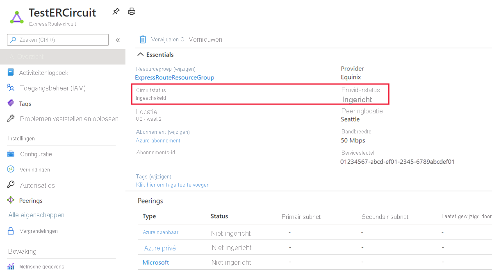

# Zelf studie: een ExpressRoute-circuit maken en wijzigen

> [!div class="op_single_selector"]
> * [Azure Portal](expressroute-howto-circuit-portal-resource-manager.md)
> * [PowerShell](expressroute-howto-circuit-arm.md)
> * [Azure-CLI](howto-circuit-cli.md)
> * [Azure Resource Manager sjabloon](expressroute-howto-circuit-resource-manager-template.md)
> * [Video-Azure Portal](https://azure.microsoft.com/documentation/videos/azure-expressroute-how-to-create-an-expressroute-circuit)
> * [Power shell (klassiek)](expressroute-howto-circuit-classic.md)
>

Dit artikel helpt u bij het maken van een ExpressRoute-circuit met behulp van de Azure Portal en het Azure Resource Manager-implementatie model. U kunt ook de status controleren, bijwerken, verwijderen of de inrichting van een circuit ongedaan maken.

## Voordat u begint

* Controleer de [vereisten](expressroute-prerequisites.md) en [werk stromen](expressroute-workflows.md) voordat u begint met de configuratie.
* Zorg ervoor dat u toegang hebt tot de [Azure Portal](https://portal.azure.com).
* Zorg ervoor dat u gemachtigd bent om nieuwe netwerk bronnen te maken. Neem contact op met uw account beheerder als u niet over de juiste machtigingen beschikt.
* U kunt [een video bekijken](https://azure.microsoft.com/documentation/videos/azure-expressroute-how-to-create-an-expressroute-circuit) voordat u begint om de stappen beter te begrijpen.

## Een ExpressRoute-circuit maken en inrichten

### 1. Meld u aan bij de Azure Portal

Open een browser, ga naar [Azure Portal](https://portal.azure.com) en meld u aan met uw Azure-account.

### 2. een nieuw ExpressRoute-circuit maken

> [!IMPORTANT]
> Uw ExpressRoute-circuit wordt gefactureerd vanaf het moment dat een service sleutel wordt uitgegeven. Zorg ervoor dat u deze bewerking uitvoert wanneer de connectiviteits provider gereed is om het circuit in te richten.

U kunt een ExpressRoute-circuit maken door de optie voor het maken van een nieuwe resource te selecteren. 

1. Selecteer in het menu van Azure Portal of op de **Startpagina** de optie **Een resource maken**. Selecteer **netwerk** > -**ExpressRoute**, zoals wordt weer gegeven in de volgende afbeelding:

   

2. Nadat u op **ExpressRoute**hebt geklikt, wordt de pagina **ExpressRoute-circuit maken** weer geven. Wanneer u de waarden op deze pagina invult, moet u ervoor zorgen dat u de juiste SKU-laag (Standard of Premium) en het facturerings model voor de gegevens meting (onbeperkt of gemeten) opgeeft.

   

   * De **laag** bepaalt of een ExpressRoute-standaard of een ExpressRoute Premium-invoeg toepassing is ingeschakeld. U kunt **Standard** opgeven om de standaard SKU of **Premium** voor de Premium-invoeg toepassing op te halen.
   * De **gegevens meting** bepaalt het facturerings type. U **kunt voor een** onbeperkt data-abonnement een **gemeten** data-abonnement opgeven. Houd er rekening mee dat u het facturerings type kunt wijzigen van **gemeten** naar **onbeperkt**.

     > [!IMPORTANT]
     > U kunt het type niet wijzigen van **Unlimited** in **Data limiet**.

   * De **locatie van peering** is de fysieke locatie waar u met micro soft bent gepeerd.

     > [!IMPORTANT]
     > De locatie van de peering geeft de [fysieke locatie](expressroute-locations.md) aan waar u met micro soft bent gepeerd. Deze is **niet** gekoppeld aan de eigenschap Location, die verwijst naar de geografische locatie waar de Azure-netwerk resource provider zich bevindt. Hoewel ze niet gerelateerd zijn, is het een goed idee om een netwerk resource provider geografisch dicht bij de locatie van het circuit te kiezen.

### 3. de circuits en eigenschappen weer geven

**Alle circuits weer geven**

U kunt alle gemaakte circuits weer geven door **alle resources** in het menu aan de linkerkant te selecteren.

**De eigenschappen weer geven**

U kunt de eigenschappen van het circuit weer geven door het te selecteren. Op de **overzichts** pagina voor uw circuit wordt de service sleutel weer gegeven in het veld Service sleutel. U moet de service sleutel voor uw circuit kopiëren en deze door geven aan de service provider om het inrichtings proces te volt ooien. De circuit service sleutel is specifiek voor uw circuit.

### 4. Stuur de service sleutel naar uw connectiviteits provider voor het inrichten

Op deze pagina biedt de **provider status** informatie over de huidige status van de inrichting van de service provider. **Status van circuit** geeft de status aan de kant van micro soft. Zie het artikel [workflows](expressroute-workflows.md#expressroute-circuit-provisioning-states) voor meer informatie over de inrichtings status van circuits.

Wanneer u een nieuw ExpressRoute-circuit maakt, heeft het circuit de volgende status:

Provider status: niet ingericht 
Circuit status: ingeschakeld

Het circuit verandert in de volgende status wanneer de connectiviteits provider het proces voor u inschakelt:

Provider status: inrichten 
Circuit status: ingeschakeld

Als u een ExpressRoute-circuit wilt gebruiken, moet dit een van de volgende statussen hebben:

Provider status: ingericht 
Circuit status: ingeschakeld

### 5. Controleer de status en de status van de circuit sleutel regel matig

U kunt de eigenschappen van het circuit dat u wilt weer geven door deze te selecteren. Controleer de **provider status** en zorg ervoor dat deze is verplaatst naar **ingericht** voordat u doorgaat.

### 6. uw routerings configuratie maken

Raadpleeg het artikel [ExpressRoute circuit routerings configuratie](expressroute-howto-routing-portal-resource-manager.md) voor het maken en wijzigen van circuit peerings voor stapsgewijze instructies.

> [!IMPORTANT]
> Deze instructies zijn alleen van toepassing op circuits die zijn gemaakt met service providers die Layer 2-connectiviteits services aanbieden. Als u een service provider gebruikt die Managed Layer 3-services biedt (meestal een IP VPN, zoals MPLS), wordt door uw connectiviteits provider route ring voor u geconfigureerd en beheerd.

### 7. een virtueel netwerk koppelen aan een ExpressRoute-circuit

Vervolgens koppelt u een virtueel netwerk aan uw ExpressRoute-circuit. Gebruik het artikel [koppel virtuele netwerken aan ExpressRoute-circuits](expressroute-howto-linkvnet-arm.md) wanneer u werkt met het Resource Manager-implementatie model.

## De status van een ExpressRoute-circuit ophalen

U kunt de status van een circuit weer geven door deze te selecteren en de pagina overzicht weer te geven.

## Een ExpressRoute-circuit wijzigen

U kunt bepaalde eigenschappen van een ExpressRoute-circuit wijzigen zonder dat dit van invloed is op de verbinding. U kunt de band breedte, het SKU-, facturerings model wijzigen en klassieke bewerkingen op de **configuratie** pagina toestaan. Zie de [Veelgestelde vragen over ExpressRoute](expressroute-faqs.md)voor meer informatie over limieten en beperkingen.

U kunt de volgende taken zonder uitval tijd uitvoeren:

* Een ExpressRoute Premium-invoeg toepassing voor uw ExpressRoute-circuit in-of uitschakelen.
* Verg root de band breedte van uw ExpressRoute-circuit, op voor waarde dat er capaciteit beschikbaar is op de poort.

  > [!IMPORTANT]
  > Het downgradeen van de band breedte van een circuit wordt niet ondersteund.

* Wijzig het licentie controle plan van *gegevens* met data limiet naar *onbeperkte gegevens*.

  > [!IMPORTANT]
  > Het is niet mogelijk om het meet plan van onbeperkte gegevens te wijzigen in gegevens met data limiet.

* U kunt *klassieke bewerkingen toestaan*in-en uitschakelen.
  > [!IMPORTANT]
  > Mogelijk moet u het ExpressRoute-circuit opnieuw maken als er onvoldoende capaciteit is op de bestaande poort. U kunt het circuit niet upgraden als er geen extra capaciteit beschikbaar is op die locatie.
  >
  > Hoewel u de band breedte naadloos kunt upgraden, is het niet mogelijk om de band breedte van een ExpressRoute-circuit zonder onderbreking te verminderen. Voor downgrade-band breedte moet u de inrichting van het ExpressRoute-circuit ongedaan maken en vervolgens een nieuw ExpressRoute-circuit opnieuw inrichten.
  >
  > Het uitschakelen van de bewerking Premium-invoeg toepassing kan mislukken als u resources gebruikt die groter zijn dan is toegestaan voor het standaard circuit.

Als u een ExpressRoute-circuit wilt wijzigen, klikt u op **configuratie**.

## Deprovisioning and deleting an ExpressRoute circuit (Inrichting van een ExpressRoute-circuit ongedaan maken en het circuit verwijderen)

U kunt het ExpressRoute-circuit verwijderen door het pictogram **verwijderen** te selecteren. Let op de volgende informatie:

* U moet alle virtuele netwerken loskoppelen van het ExpressRoute-circuit. Als deze bewerking mislukt, controleert u of er virtuele netwerken zijn gekoppeld aan het circuit.
* Als de inrichtings status van de ExpressRoute-circuit service provider is **ingericht** of **ingericht** , moet u samen met uw service provider de inrichting van het circuit aan hun zijde opheffen. We blijven resources reserveren en u factureren totdat de service provider de inrichting van het circuit ongedaan heeft gemaakt en ons op de hoogte stelt.
* Als de service provider het circuit heeft ontsteld (de inrichtings status van de service provider is ingesteld op **niet ingericht**), kunt u het circuit verwijderen. Hiermee wordt ook de facturering voor het circuit gestopt.

## Volgende stappen

Nadat u het circuit hebt gemaakt, gaat u door met de volgende stappen:

* [Route ring voor uw ExpressRoute-circuit maken en wijzigen](expressroute-howto-routing-portal-resource-manager.md)
* [Uw virtuele netwerk koppelen aan uw ExpressRoute-circuit](expressroute-howto-linkvnet-arm.md)
