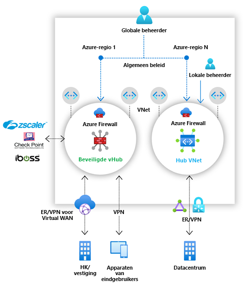

# Wat is Azure Firewall-beheer (preview)?

[!INCLUDE [Preview](../../includes/firewall-manager-preview-notice.md)]

Azure Firewall Manager Preview is een service voor beveiligingsbeheer die het centrale beveiligingsbeleid en routebeheer biedt voor op cloud gebaseerde beveiligingsperimeters. 

Firewall Manager biedt beveiligingsbeheer voor twee soorten netwerkarchitectuur:

- **Beveiligde virtuele hub**

   Een [Azure Virtual WAN-hub](../virtual-wan/virtual-wan-about.md#resources) is een door Microsoft beheerde resource waarmee u eenvoudig sterarchitecturen kunt maken. Wanneer aan zo'n hub beveiligings- en routeringsbeleid is gekoppeld, wordt dit een *[beveiligde virtuele hub](secured-virtual-hub.md)* genoemd. 
- **Virtueel hubnetwerk**

   Dit is een standaard virtueel Azure-netwerk dat u zelf maakt en beheert. Wanneer beveiligingsbeleidsregels met een dergelijke hub worden gekoppeld, wordt dit een *virtueel hubnetwerk* genoemd. Op dit ogenblik wordt alleen Azure Firewall-beleid ondersteund. U kunt virtuele spaaknetwerken met uw workloadservers en services via peering verbinden. U kunt ook firewalls beheren in zelfstandige virtuele netwerken die niet aan een spaak zijn gekoppeld.

Zie [Wat zijn de opties voor de Azure Firewall Manager-architectuur?](vhubs-and-vnets.md) voor een gedetailleerde vergelijking van architecturen voor *beveiligde virtuele hubs* en *virtuele hubnetwerken*.

## Functies van Azure Firewall-beheer (preview)

De preview van Azure Firewall Manager biedt de volgende functies:

### Centrale implementatie en configuratie van Azure Firewall

U kunt meerdere Azure Firewall-instanties die over verschillende Azure-regio's en abonnementen zijn verspreid, centraal implementeren en configureren. 

### Hiërarchische beleidsregels (globaal en lokaal)

U kunt Azure Firewall Manager (preview) gebruiken om Azure Firewall-beleidsregels centraal te beheren via meerdere beveiligde virtuele hubs. Uw centrale IT-teams kunnen globale firewallbeleidsregels opstellen om organisatiebreed firewallbeleid af te dwingen voor alle teams. Met lokaal opgestelde firewallbeleidsregels kan een DevOps-selfservicemodel worden gebruikt voor betere flexibiliteit.

### Geïntegreerd met externe Security as a Service voor geavanceerde beveiliging

Naast Azure Firewall kunt u externe SECaaS-providers (Security as a Service) integreren voor aanvullende netwerkbeveiliging voor uw VNet en vertakte internetverbindingen.

Deze functie is alleen beschikbaar voor implementaties van beveiligde virtuele hubs.

- Verkeer van VNet naar internet (V2I) filteren

   - Filter uitgaand verkeer vanaf het virtuele netwerk met uw favoriete externe beveiligingsprovider.
   - Maak gebruik van geavanceerde op de gebruiker gerichte internetbeveiliging voor uw cloudworkloads die in Azure worden uitgevoerd.

- Verkeer van een vertakking naar internet (B2I) filteren

   Maak gebruik van uw Azure-connectiviteit en globale distributie om eenvoudig externe filters toe te voegen voor scenario's met verkeer van aftakkingen naar internet.

Zie [Wat zijn vertrouwde Azure Firewall Manager-beveiligingspartners (preview)?](trusted-security-partners.md) voor meer informatie over vertrouwde beveiligingsproviders.

### Gecentraliseerd routebeheer

Stuur verkeer eenvoudig door naar uw beveiligde hub om te worden gefilterd en in een logboek te worden vastgelegd zonder handmatig UDR's (door de gebruiker gedefinieerde routes) te hoeven instellen in virtuele spaaknetwerken. 

Deze functie is alleen beschikbaar voor implementaties van beveiligde virtuele hubs.

U kunt externe providers gebruiken voor het filteren van het verkeer van vertakkingen naar internet (B2I), tegelijk met Azure Firewall voor verkeer van aftakkingen naar VNet (B2V), verkeer van VNet naar VNet (V2V) en verkeer van VNet naar internet (V2I). U kunt ook externe providers voor het filteren van V2I-verkeer gebruiken, zolang Azure Firewall maar niet is vereist voor B2V of V2V. 

## Beschikbaarheid in regio’s

Azure Firewall-beleidsregels kunnen voor meerdere regio's worden gebruikt. U kunt bijvoorbeeld een beleid maken in US - west en dit vervolgens gebruiken in US - oost. 

## Bekende problemen

De preview van Azure Firewall Manager heeft de volgende bekende problemen:

|Probleem  |Beschrijving  |Oplossing  |
|---------|---------|---------|
|Beperkingen voor filteren met externe providers.|V2I-verkeer filteren met externe providers wordt niet ondersteund voor Azure Firewall B2V en V2V.|Wordt onderzocht|
|Het opsplitsen van verkeer wordt momenteel niet ondersteund.|Het opsplitsen van verkeer met Office 365 en Azure Public PaaS wordt momenteel niet ondersteund. Als u een externe provider voor V2I of B2I selecteert, wordt daardoor ook al het Azure Public PaaS- en Office 365-verkeer via de partnerservice verzonden.|Het opsplitsen van verkeer bij de hub wordt momenteel onderzocht.
|Eén beveiligde virtuele hub per regio.|U mag niet meer dan één beveiligde virtuele hub per regio hebben.|Maak meerdere virtuele WAN's in een regio.|
|Basisbeleidsregels moeten zich in dezelfde regio als het lokale beleid bevinden.|Maak al uw lokale beleidsregels in dezelfde regio als het basisbeleid. U kunt nog steeds een beleid toepassen dat in een regio is gemaakt op een beveiligde hub vanuit een andere regio.|Wordt onderzocht|
|Onderlinge communicatie tussen hubs werkt niet met beveiligde virtuele hub|Communicatie tussen een beveiligde virtuele hub en een andere beveiligde virtuele hub wordt nog niet ondersteund.|Wordt onderzocht|
|Alle beveiligde virtuele hubs die dezelfde virtuele WAN delen, moeten zich in dezelfde resourcegroep bevinden.|Dit gedrag wordt vandaag afgestemd met andere virtuele WAN-hubs.|Maak meerdere virtuele WAN's om ervoor te zorgen dat beveiligde virtuele hubs kunnen worden gemaakt in andere resourcegroepen.|
|IP-groepen worden niet ondersteund in het firewallbeleid.|IP-groepen zijn beschikbaar als openbare preview en worden momenteel alleen ondersteund met traditionele firewallregels.|Er wordt gewerkt aan een oplossing.
|CSP-abonnementen (Cloud Solution Provider) worden niet ondersteund.|Momenteel worden [CSP-abonnementen](https://azure.microsoft.com/offers/ms-azr-0145p/) niet ondersteund.|Wordt onderzocht

## Volgende stappen

- Raadpleeg [het overzicht voor de implementatie van Azure Firewall Manager (preview)](deployment-overview.md)
- Meer informatie over [beveiligde virtuele hubs](secured-virtual-hub.md).