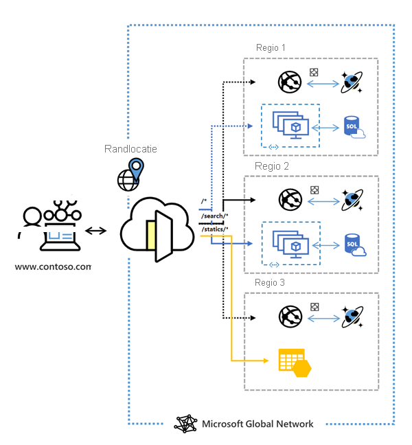

# Wat is Azure Front Door?

Azure Front Door is een wereldwijd, schaalbaar ingangspunt dat gebruikmaakt van het global edge-netwerk van Microsoft om snelle, beveiligde en wijd schaalbare webtoepassingen te maken. Met Front Door kunt u uw internationale klant- en bedrijfstoepassingen transformeren in robuuste, hoogwaardige, gepersonaliseerde moderne toepassingen met inhoud die een wereldwijd bereik hebben via Azure.

  

Front Door werkt in Laag 7 (HTTP/HTTPS-laag) met anycast-protocol met split-TCP en Microsofts wereldwijde netwerk ter verbetering van internationale connectiviteit. Op basis van uw routeringsmethode kunt u ervoor zorgen dat Front Door uw klantaanvragen routeert naar het snelste en meest beschikbare toepassingsback-end. Een toepassingsback-end is een internetgerichte service die binnen of buiten Azure wordt gehost. Front Door biedt een scala aan [routeringsmethoden voor verkeer](front-door-routing-methods.md) en [opties voor back-endstatuscontrole](front-door-health-probes.md) om verschillende toepassingsbehoeften en scenario's voor automatische failover mogelijk te kunnen maken. Front Door is vergelijkbaar met [Traffic Manager](../traffic-manager/traffic-manager-overview.md) en bestand tegen storingen, waaronder het uitvallen van een hele Azure-regio.

>[!NOTE]
> Azure biedt een pakket volledig beheerde oplossingen voor taakverdeling voor uw scenario's. 
> * Als u op zoek bent naar een internationale routering op basis van DNS en u voldoet **niet** aan de vereisten voor beëindiging van het TLS-protocol (Transport Layer Security), ('SSL-offload') of aanvragen per HTTP/HTTPS-aanvraag, verwerking via de toepassingslaag, raadpleegt u [Traffic Manager](../traffic-manager/traffic-manager-overview.md). 
> * Als u de taken wilt verdelen tussen uw servers in een regio op de toepassingslaag, raadpleegt u [Application Gateway](../application-gateway/application-gateway-introduction.md)
> * Raadpleeg [Load Balancer](../load-balancer/load-balancer-overview.md) voor taakverdeling in de netwerklaag. 
> 
> Uw end-to-end scenario 's kunnen eventueel profiteren van een combinatie van deze oplossingen.
> Zie [Opties voor taakverdeling in Azure](https://docs.microsoft.com/azure/architecture/guide/technology-choices/load-balancing-overview) voor een vergelijking van de opties voor taakverdeling van Azure.

## Waarom zou ik Azure Front Door gebruiken?

Met Front Door kunt u uw dynamische webtoepassing en statische inhoud bouwen, uitvoeren en uitschalen. .Met Front Door kunt u de internationale routering van uw webverkeer definiëren, beheren en bewaken door te optimaliseren voor de beste prestaties en betrouwbaarheid voor eindgebruikers via een snelle globale failover.

Belangrijkste van Front Door:

* Versnelde toepassingsprestaties met het gebruik van **[gesplitste TCP](front-door-routing-architecture.md#splittcp)** -gebaseerd **[anycast-protocol](front-door-routing-architecture.md#anycast)** .

* Intelligente bewaking van **[Statustest](front-door-health-probes.md)** voor back-endservers.

*  **[Op URL gabseerde](front-door-route-matching.md)** routering voor aanvragen.

* Hiermee host u meerdere websites voor efficiënte toepassingsinfrastructuur. 

* **[Sessieaffiniteit](front-door-routing-methods.md#affinity)** op basis van cookies.

* **[SSL-offloading](front-door-custom-domain-https.md)** en certificaatbeheer.

* Uw eigen **[aangepast domein](front-door-custom-domain.md)** definiëren. 

* Toepassingsbeveiliging met geïntegreerde **[Web Application Firewall (WAF)](../web-application-firewall/overview.md)** .

* HTTP-verkeer omleiden naar HTTPS met **[URL-omleiding](front-door-url-redirect.md)** .

* Aangepast doorstuurpad met **[URL herschrijven](front-door-url-rewrite.md)** .

* Systeemeigen ondersteuning van end-to-end IPv6-connectiviteit en **[HTTP/2-protocol](front-door-http2.md)** .

## Prijzen

Zie [Prijzen van Front Door](https://azure.microsoft.com/pricing/details/frontdoor/) voor informatie over de prijzen. Raadpleeg [SLA voor Azure Front Door](https://azure.microsoft.com/en-us/support/legal/sla/frontdoor/v1_0/).

## Wat is nieuw?

Abonneer u op de RSS-feed en bekijk de nieuwste updates voor Azure Front Door-onderdelen op de pagina [Azure-updates](https://azure.microsoft.com/updates/?category=networking&query=Azure%20Front%20Door).

## Volgende stappen

- Lees hoe u [een Front Door maakt](quickstart-create-front-door.md).
- Lees [hoe Front Door werkt](front-door-routing-architecture.md).
