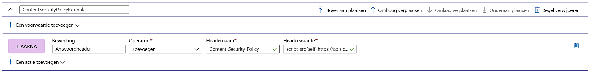

# Beveiligingsheaders toevoegen met de engine voor regels

Implementeer beveiligingskopteksten om beveiligingsproblemen in browsers te voorkomen, bijvoorbeeld HTTP Strict-Transport-Security (HSTS), X-XSS-Protection, Content-Security-Policy of X-Frame-Options. Kenmerken op basis van beveiliging kunnen ook worden gedefinieerd met cookies.

In het volgende voorbeeld ziet u hoe u een Content-Security-Policy-koptekst kunt toevoegen aan alle inkomende aanvragen die overeenkomen met het pad dat is opgegeven in de route waaraan de configuratie van uw regelengine is gekoppeld. Hier worden alleen scripts van onze vertrouwde site, **https://apiphany.portal.azure-api.net** , toegestaan om op onze toepassing te worden uitgevoerd.

## Een Content-Security-Policy-koptekst toevoegen in de Azure-portal

1. Voordat u deze specifieke regel maakt, leert u hoe u [een front door maakt](quickstart-create-front-door.md) of hoe u [een regelengine maakt](front-door-tutorial-rules-engine.md) als dit de eerste keer is dat u AFD of de regelenginefunctie gebruikt.

2. Klik op **Toevoegen** als u een nieuwe regel wilt toevoegen. Geef een naam op voor de regel en klik op **Een actie toevoegen** > **Antwoordheader**.

3. Stel de operator in op **Toevoegen** om deze header toe te voegen als antwoord op alle inkomende aanvragen voor deze route.

4. Voeg de naam van de header toe: **Content-Security-Policy** en definieer de waarden die deze header moet accepteren. In dit scenario kiezen we *"script-src 'self' https://apiphany.portal.azure-api.net."*

5. Wanneer u alle regels hebt toegevoegd die u voor uw configuratie wilt gebruiken, gaat u naar uw route van voorkeur en koppelt u de configuratie van uw regelengine aan uw routeregel. Deze stap is vereist om de regel te laten werken. 

> [!NOTE]
> In dit scenario hebben we geen [voorwaarden voor overeenkomst](front-door-rules-engine-match-conditions.md) aan de regel toegevoegd. Deze regel wordt toegepast op alle inkomende aanvragen die overeenkomen met het pad dat in de routeregel is gedefinieerd. Als deze alleen wilt toepassen op een subset van die aanvragen, moet u uw specifieke voorwaarden voor overeenkomst aan deze regel toevoegen.

## Volgende stappen

- Meer informatie over [AFD-regelengine](front-door-rules-engine.md). 
- Lees hoe u [een Front Door maakt](quickstart-create-front-door.md).
- Lees [hoe Front Door werkt](front-door-routing-architecture.md).
- Meer informatie over [voorwaarden voor overeenkomst](front-door-rules-engine-match-conditions.md) van de regelengine
- Meer informatie vindt u in de [CLI-referentie](https://docs.microsoft.com/cli/azure/ext/front-door/network/front-door/rules-engine?view=azure-cli-latest) van de AFD-regelengine. 
- Meer informatie vindt u in de [PowerShell-referentie](https://docs.microsoft.com/powershell/module/az.frontdoor/?view=azps-3.8.0) van de AFD-regelengine. 
