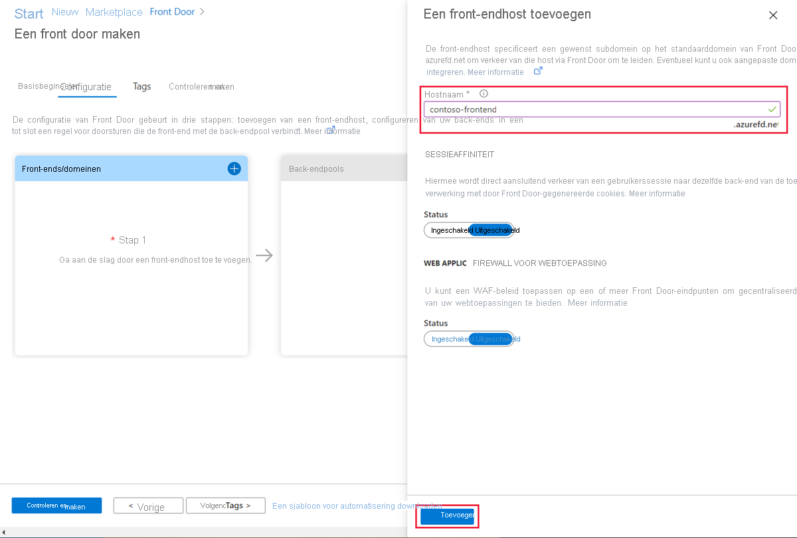

# Snelstart: een Front Door maken voor een webtoepassing met hoge beschikbaarheid

Ga met Azure Front Door aan de slag door via Azure Portal hoge beschikbaarheid voor een webtoepassing in te stellen.

In deze quickstart worden met Azure Front Door twee instanties van een webtoepassing die in verschillende Azure-regio's worden uitgevoerd, in een pool geplaatst. U maakt een Front Door-configuratie op basis van back-ends met gelijk gewicht en dezelfde prioriteit. Met deze configuratie wordt verkeer doorgestuurd naar de dichtstbijzijnde site waarop de toepassing wordt uitgevoerd. Azure Front Door bewaakt de webtoepassing continu. De service biedt automatische failover naar de volgende beschikbare site wanneer de dichtstbijzijnde site niet beschikbaar is.

## Vereisten

- Een Azure-account met een actief abonnement. [Gratis een account maken](https://azure.microsoft.com/free/?WT.mc_id=A261C142F)

## Twee instanties van een web-app maken

Voor deze quickstart hebt u twee instanties nodig van een webtoepassing die in verschillende Azure-regio's worden uitgevoerd. Beide webtoepassingsinstanties worden in de modus *Actief/actief* uitgevoerd, dus verkeer kan ook eender welke instantie worden uitgevoerd. Deze configuratie is anders dan de configuratie *Actief/stand-by*, waarbij één van de instanties als failover fungeert.

Als u nog geen web-app hebt, voert u de volgende stappen uit om voorbeelden van web-apps in te stellen.

1. Meld u aan bij Azure Portal op https://portal.azure.com.

1. Selecteer vanuit de startpagina of het menu van Azure de optie **Een resource maken**.

1. Selecteer **Web** > **Web-app**.

   

1. Selecteer in **Web-app** het **abonnement** dat u wilt gebruiken.

1. Selecteer voor **Resourcegroep** de optie **Nieuwe maken**. Voer *FrontDoorQS_rg1* in als de **Naam** en selecteer **OK**.

1. Voer onder **Instantiedetails** een unieke **Naam** in voor uw web-app. In dit voorbeeld wordt *WebAppContoso-1* gebruikt.

1. Selecteer een **Runtimestack**. In dit voorbeeld is dit *.NET Core 2.1 (LTS)* .

1. Selecteer een regio, zoals *VS - centraal*.

1. Selecteer voor **Windows-plan** de optie **Nieuwe maken**. Voer *myAppServicePlanCentralUS* in als de **Naam** en selecteer **OK**.

1. Onthoud dat de **SKU en grootte** **standaard S1 100 totaal ACU, 1,75 GB geheugen** is.

1. Selecteer **Controleren en maken**, controleer **Samenvatting** en selecteer vervolgens **Maken**. Het kan enkele minuten duren voordat de implementatie is voltooid.

   

Nadat uw implementatie is voltooid, maakt u een tweede web-app. Gebruik dezelfde procedure met dezelfde waarden, met uitzondering van de volgende waarden:

| Instelling          | Waarde     |
| ---              | ---  |
| **Resourcegroep**   | Selecteer **Nieuw** en voer *FrontDoorQS_rg2* in |
| **Naam**             | Voer een unieke name voor uw web-app in. In dit voorbeeld is dit *WebAppContoso-2*  |
| **Regio**           | Een andere regio. In dit voorbeeld is dit *VS - zuid-centraal* |
| **App Service-plan** > **Windows-plan**         | Selecteer **Nieuw**, voer *myAppServicePlanSouthCentralUS* in en selecteer vervolgens **OK** |

## Een Front Door maken voor uw toepassing

Configureer Azure Front Door zodat gebruikersverkeer wordt doorgestuurd op basis van de laagste latentie tussen de twee web-appservers. Voeg eerst een front-endhost voor Azure Front Door toe.

1. Selecteer vanuit de startpagina of het menu van Azure de optie **Een resource maken**. Selecteer **Netwerken** > **Front Door**.

1. Selecteer bij **Een Front Door maken**een **Abonnement**.

1. Selecteer voor **Resourcegroep** de optie **Nieuw**, voer vervolgens *FrontDoorQS_rg0* in en selecteer **OK**.  U kunt in plaats daarvan een bestaande resourcegroep gebruiken.

1. Als u een resourcegroep hebt gemaakt, selecteert u een **Resourcegroeplocatie** en selecteert u vervolgens **Volgende: Configuratie**.

1. Selecteer bij **Front-ends/domeinen** de optie **+** om **Een front-endhost toevoegen** te openen.

1. Voer als **Hostnaam** een wereldwijd unieke hostnaam in. In dit voorbeeld wordt *contoso-front-end* gebruikt. Selecteer **Toevoegen**.

   

Maak hierna een back-endpool met daarin uw twee web-apps.

1. Blijf bij **Een Front Door maken** en selecteer bij **Back-endpools** de optie **+** om **Een back-endpool toevoegen** te openen.

1. Voer bij **Naam** *myBackEndPool* in.

1. Selecteer **Een back-end toevoegen**. Selecteer voor **Back-endhosttype** de optie *App Service*.

1. Selecteer uw abonnement en kies vervolgens de eerste web-app die u hebt gemaakt bij **Naam van back-endhost**. In dit voorbeeld werd de web-app *WebAppContoso-1* gebruikt. Selecteer **Toevoegen**.

1. Selecteer opnieuw **Een back-end toevoegen**. Selecteer voor **Back-endhosttype** de optie *App Service*.

1. Selecteer nogmaals uw abonnement en kies de tweede web-app die u hebt gemaakt bij **Naam van back-endhost**. Selecteer **Toevoegen**.

   

Voeg als laatste een regel voor doorsturen toe. Met een regel voor doorsturen wordt uw front-endhost toegewezen aan de back-endpool. De regel stuurt een aanvraag voor `contoso-frontend.azurefd.net` door naar **myBackendPool**.

1. Blijf bij **Een Front Door maken** en selecteer bij **Regels voor doorsturen** de optie **+** om een regel voor doorsturen te configureren.

1. Voer bij **Een regel toevoegen** als **Naam** *LocationRule* in. Accepteer alle standaardwaarden en selecteer vervolgens **Toevoegen** om de regel voor doorsturen toe te voegen.

   >[!WARNING]
   > U **moet** ervoor zorgen dat elk van de front-endhosts in de Front Door is geconfigureerd met een regel voor doorsturen waaraan een standaardpad (`\*`) is gekoppeld. Er moet dus in al uw regels voor doorsturen minimaal een routeringsregel voor al uw front-endhosts op het standaardpad (`\*`) zijn gedefinieerd. Als dit niet het geval is, kan dit tot gevolg hebben dat het verkeer van uw eindgebruikers niet goed wordt gerouteerd.

1. Selecteer **Controleren en maken** en vervolgens **Maken**.

   

## Azure Front Door in actie zien

Als u een Front Door hebt gemaakt, duurt het een paar minuten voordat de configuratie wereldwijd is geïmplementeerd. Zodra de Front Door is voltooid, opent u de front-endhost die u hebt gemaakt. Ga in een browser naar `contoso-frontend.azurefd.net`. Uw aanvraag wordt automatisch gerouteerd naar de server uit de opgegeven servers in de back-endpool die zich het dichtst bij u in de buurt bevindt.

Als u deze apps in deze quickstart hebt gemaakt, ziet u een informatiepagina.

Voer de volgende stappen uit om de directe wereldwijde failover in actie te testen:

1. Open een browser (zoals hierboven beschreven) en ga naar het adres van de front-end: `contoso-frontend.azurefd.net`.

1. Zoek en selecteer *App Services* in Azure Portal. Blader omlaag om een van uw web-apps, **WebAppContoso-1** te zoeken in dit voorbeeld.

1. Selecteer uw web-app en selecteer vervolgens **Stoppen** en **Ja** om het te controleren.

1. Vernieuw de browser. Als het goed is, ziet u dezelfde informatiepagina.

   >[!TIP]
   >Deze acties worden met enige vertraging uitgevoerd. Mogelijk moet u de pagina vernieuwen.

1. Zoek de andere web-app en stop ook deze app.

1. Vernieuw de browser. Als het goed is, ziet u nu een foutbericht.

   

## Resources opschonen

Als u klaar bent, kunt u alle items die u hebt gemaakt, verwijderen. Als u een resourcegroep verwijdert, wordt ook de inhoud in die resourcegroep verwijderd. Als u niet van plan bent om deze Front Door te gebruiken, moet u resources verwijderen om onnodige kosten te voorkomen.

1. Zoek en selecteer in Azure Portal de optie **Resourcegroepen** of selecteer **Resourcegroepen** vanuit het menu in Azure Portal.

1. Filter of blader omlaag om een resourcegroep te zoeken, zoals **FrontDoorQS_rg0**.

1. Selecteer de resourcegroep en selecteer **Resourcegroep verwijderen**.

   >[!WARNING]
   >Deze actie kan niet ongedaan worden gemaakt.

1. Typ de naam van de resourcegroep die u wilt controleren en selecteer vervolgens **Verwijderen**.

Herhaal de procedure voor de andere twee groepen.

## Volgende stappen

Ga verder naar het volgende artikel voor instructies voor het toevoegen van een aangepast domein aan uw Front Door.
> [!div class="nextstepaction"]
> [Een aangepast domein toevoegen](front-door-custom-domain.md)
