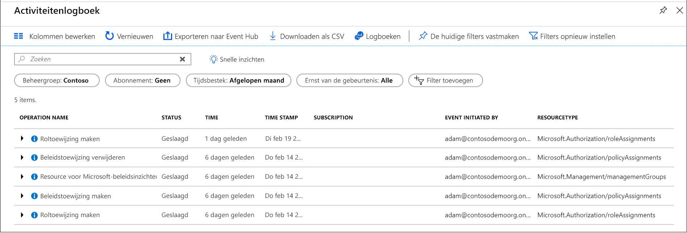

# <a name="organize-your-resources-with-azure-management-groups"></a>Uw resources organiseren met Azure-beheergroepen

Als uw organisatie veel abonnementen heeft, moet u de toegang, beleidsregels en naleving voor deze abonnementen op een efficiënte manier kunnen beheren. Azure-beheergroepen bieden een scopeniveau boven abonnementen. U ordent abonnementen in containers, zogenaamde 'beheergroepen', en past uw governancevoorwaarden hierop toe. Alle abonnementen in een beheergroep nemen automatisch de voorwaarden over die op de beheergroep zijn toegepast. Beheergroepen bieden u beheer van bedrijfskwaliteit op grote schaal, ongeacht de typen abonnementen die u hebt. Alle abonnementen binnen een beheergroep moeten afhankelijk zijn van dezelfde Azure Active Directory-tenant.

U kunt bijvoorbeeld beleid toepassen op een beheergroep, dat het aantal regio's beperkt dat beschikbaar is voor het maken van virtuele machines (VM’s). Dit beleid wordt dan toegepast op alle beheergroepen, abonnementen en resources onder die beheergroep, doordat het ervoor zorgt dat er alleen VM’s kunnen worden gemaakt in die regio.

## <a name="hierarchy-of-management-groups-and-subscriptions"></a>Hiërarchie van managementgroepen en abonnementen

U kunt een flexibele structuur van managementgroepen en abonnementen bouwen om uw resources in een hiërarchie te ordenen voor uniform beleid en toegangsbeheer. Het volgende diagram laat een voorbeeld zien van hoe een hiërarchie voor governance kan worden gemaakt met behulp van beheergroepen.


U kunt een hiërarchie maken waarmee een beleid wordt toegepast, bijvoorbeeld om VM-locaties tot de regio US - west te beperken in de groep 'Productie'. Dit beleid is van toepassing op alle EA-abonnementen die afstammelingen zijn van die beheer groep en worden toegepast op alle Vm's onder die abonnementen. Dit beveiligingsbeleid kan niet worden gewijzigd door de eigenaar van de resource of het abonnement, wat zorgt voor betere governance.

Een ander scenario waarbij u beheergroepen kunt gebruiken, is om gebruikers toegang te geven tot meerdere abonnementen. Als u meerdere abonnementen naar de desbetreffende beheergroep verplaatst, kunt u in de beheergroep één toewijzing voor [op rollen gebaseerd toegangsbeheer](../../role-based-access-control/overview.md) (RBAC) maken, die de toegang doorgeeft aan alle abonnementen.
Eén toewijzing in de beheergroep kan gebruikers toegang geven tot alles wat ze nodig hebben. Er hoeven dan geen scripts te worden geschreven voor RBAC-toewijzingen in meerdere abonnementen.

### <a name="important-facts-about-management-groups"></a>Belangrijke feiten over beheergroepen

- In één map kunnen 10.000 beheergroepen worden ondersteund.
- Een beheergroepstructuur ondersteunt tot wel zes niveaus.
  - Deze limiet is exclusief het hoofdniveau of het abonnementsniveau.
- Een beheergroep of abonnement biedt ondersteuning voor slechts één bovenliggend item.
- Elke beheergroep kan een groot aantal onderliggende items hebben.
- Alle abonnementen en beheergroepen bevinden zich in één hiërarchie in elke map. Zie [Belangrijke feiten over de hoofdbeheergroep](#important-facts-about-the-root-management-group).

## <a name="root-management-group-for-each-directory"></a>Hoofdbeheergroep voor elke map

Elke map krijgt één beheergroep op het hoogste niveau, de 'hoofdbeheergroep'.
Deze hoofdbeheergroep is zo in de hiërarchie ingebouwd dat alle beheergroepen en abonnementen hierin zijn opgevouwen. Met deze hoofdbeheergroep kunt u algemene beleidsregels en RBAC-toewijzingen op directoryniveau toepassen. De globale beheerder van Azure AD moet eerst de rol Beheerder gebruikerstoegang van deze hoofdgroep [aan zichzelf toewijzen](../../role-based-access-control/elevate-access-global-admin.md). Nadat hij dit heeft gedaan, kan de beheerder een RBAC-rol toewijzen aan andere directory-gebruikers of -groepen om de hiërarchie te beheren. Als beheerder kunt u uw eigen account toewijzen als eigenaar van de hoofdbeheergroep.

### <a name="important-facts-about-the-root-management-group"></a>Belangrijke feiten over de hoofdbeheergroep

- Standaard is de weergavenaam van de hoofdbeheergroep **Tenanthoofdgroep**. De id is de Azure Active Directory-id.
- Als u de weergavenaam wilt wijzigen, moet uw account de rol Eigenaar of Inzender in de hoofdbeheergroep hebben toegewezen gekregen. Zie [de naam van een beheer groep wijzigen](manage.md#change-the-name-of-a-management-group) om de naam van een beheer groep bij te werken.
- In tegenstelling tot andere beheergroepen kan de hoofdbeheergroep niet worden verplaatst of verwijderd.  
- Alle abonnementen en beheergroepen kunnen worden samengevouwen in deze ene hoofdbeheergroep binnen de map.
  - Alle resources in de map kunnen worden samengevouwen in de hoofdbeheergroep voor algemeen beheer.
  - Wanneer er een nieuw abonnement wordt gemaakt, wordt dit standaard automatisch in de hoofdbeheergroep geplaatst.
- Alle Azure-klanten kunnen de hoofdbeheergroep zien, maar niet alle klanten hebben de mogelijkheid om die hoofdbeheergroep te beheren.
  - Iedereen die toegang heeft tot een abonnement, kan de context zien van waar dat abonnement zich in de hiërarchie bevindt.  
  - Niemand krijgt standaard toegang tot de hoofdbeheergroep. Globale beheerders van Azure AD zijn de enige gebruikers die zichzelf toegang kunnen verschaffen.  Wanneer ze toegang hebben tot de hoofdbeheergroep, kunnen de globale beheerders elke RBAC-rol toewijzen aan andere gebruikers, zodat deze het beheer daarover hebben.  

> [!IMPORTANT]
> Toewijzingen voor gebruikerstoegang of beleidstoewijzingen in de hoofdbeheergroep **zijn van toepassing op alle resources in de map**.
> Daarom moeten alle klanten goed nadenken over de noodzaak om items op dit niveau toe te wijzen.
> Op dit niveau mogen alleen toewijzingen voor gebruikerstoegang of beleid de aanduiding ‘Must have’ (Strikt noodzakelijk) hebben.  

## <a name="initial-setup-of-management-groups"></a>Eerste installatie van beheergroepen

Wanneer een gebruiker start met het gebruik van beheergroepen, vindt er een proces plaats voor de eerste installatie. Eerst wordt er een hoofdbeheergroep gemaakt in de map. Zodra deze groep klaar is, worden alle bestaande abonnementen die in de map zijn opgenomen gemaakt tot onderliggende items van de hoofdbeheergroep. De reden dat dit proces zo werkt, is om er zeker van te zijn dat er binnen een map slechts één beheergroephiërarchie is. Die ene hiërarchie in de map zorgt ervoor dat klanten met een beheerdersrol globale toegang en beleidsregels kunnen toepassen waar andere klanten in de map niet omheen kunnen. Alle zaken die in de hoofdmap zijn toegewezen, zijn van toepassing op de hele hiërarchie, en dus op alle beheergroepen, abonnementen, resourcegroepen en resources binnen die Azure AD-tenant.

## <a name="trouble-seeing-all-subscriptions"></a>Problemen met de weergave van alle abonnementen

Bij een aantal mappen die vroeg in de preview (vóór 25 juni 2018) met beheergroepen begonnen te werken, deed zich een probleem voor waarbij niet alle abonnementen zich in de hiërarchie bevonden. Het proces voor het onderbrengen van alle abonnementen in de hiërarchie werden geïmplementeerd nadat er een rol- of beleidstoewijzing was uitgevoerd in de hoofdbeheergroep in de map. 

### <a name="how-to-resolve-the-issue"></a>Het probleem oplossen

U kunt dit probleem op twee manieren verhelpen.

1. Alle rol- en beleidstoewijzingen uit de hoofdbeheergroep verwijderen
   1. Door alle beleids- en roltoewijzingen van de hoofdbeheergroep te verwijderen, zal de service alle abonnementen in de hiërarchie aanvullen tijdens de volgende nachtelijke cyclus.  Dankzij dit proces wordt er niet onbedoeld toegang verleend of beleid toegewezen aan alle abonnementen van de tenant.
   1. De beste manier om dit proces uit te voeren zonder uw services te beïnvloeden, is de rol- of beleidstoewijzingen één niveau onder de hoofdbeheergroep toe te passen. Vervolgens kunt u alle toewijzingen van het hoofdbereik verwijderen.
1. De API rechtstreeks aanroepen om het backfill-proces te starten
   1. Elke klant in de map kan de API's *TenantBackfillStatusRequest* en *StartTenantBackfillRequest* aanroepen. Wanneer de API StartTenantBackfillRequest wordt aangeroepen, wordt hiermee het initiële instellingsproces gestart voor het verplaatsen van alle abonnementen naar de hiërarchie. Met dit proces wordt ook afgedwongen dat alle nieuwe abonnementen een onderliggend element van de hoofdbeheergroep worden gemaakt. Dit proces kan worden uitgevoerd zonder de toewijzingen op het hoofdniveau te wijzigen. Door de API aan te roepen, geeft u aan dat een beleids- of toegangstoewijzing in de hoofdmap mag worden toegepast op alle abonnementen.

Als u vragen hebt over dit backfill-proces, neemt u contact op met: managementgroups@microsoft.com  
  
## <a name="management-group-access"></a>Toegang tot beheergroepen

Azure-beheergroepen ondersteunen [op rollen gebaseerd toegangsbeheer (RBAC) van Azure](../../role-based-access-control/overview.md) voor alle soorten toegang tot resources en roldefinities.
Deze machtigingen worden overgenomen door onderliggende resources die in de hiërarchie zijn opgenomen. Een RBAC-rol kan worden toegewezen aan een beheer groep die de hiërarchie naar de resources overneemt.
Zo kan de RBAC-rol van VM-inzender aan een beheergroep worden toegewezen. Deze rol heeft geen actie in de beheergroep, maar wordt overgenomen door alle VM's in die beheergroep.

In de volgende tabel staat een lijst met rollen en de acties die worden ondersteund in beheergroepen.

| Naam RBAC-rol             | Maken | Naam wijzigen | Verplaatsen** | Verwijderen | Toegang toewijzen | Beleid toewijzen | Lezen  |
|:-------------------------- |:------:|:------:|:------:|:------:|:-------------:| :------------:|:-----:|
|Eigenaar                       | X      | X      | X      | X      | X             | X             | X     |
|Inzender                 | X      | X      | X      | X      |               |               | X     |
|Beheergroep-inzender*             | X      | X      | X      | X      |               |               | X     |
|Lezer                      |        |        |        |        |               |               | X     |
|Beheergroep-lezer*                  |        |        |        |        |               |               | X     |
|Inzender voor resourcebeleid |        |        |        |        |               | X             |       |
|Beheerder van gebruikerstoegang   |        |        |        |        | X             | X             |       |

*: Met de rollen Beheergroep-inzender en Beheergroep-lezer kunnen gebruikers deze acties alleen uitvoeren op beheergroepniveau.  
\* *: Roltoewijzingen voor de hoofd beheer groep zijn niet vereist voor het verplaatsen van een abonnement of beheer groep naar en van het item.  Zie [Uw resources beheren met beheergroepen](manage.md) voor meer informatie over het verplaatsen van items binnen de hiërarchie.

## <a name="custom-rbac-role-definition-and-assignment"></a>Aangepaste definitie en toewijzing van de RBAC-rol

Aangepaste RBAC-functie ondersteuning voor beheer groepen is momenteel in Preview met enkele [beperkingen](#limitations).  U kunt het bereik van de beheergroep definiëren in het toewijsbare bereik van de roldefinitie.  Die aangepaste RBAC-rol is dan beschikbaar voor toewijzing in die beheergroep en alle beheergroepen, abonnementen, resourcegroepen en resources daaronder. Deze aangepaste rol neemt machtigingen over in de hiërarchie op dezelfde manier als een ingebouwde rol.    

### <a name="example-definition"></a>Voorbeeld definitie
Het [definiëren en maken van een aangepaste rol](../../role-based-access-control/custom-roles.md) verandert niet met het opnemen van beheer groepen. Gebruik het volledige pad om de **/providers/Microsoft.Management/managementgroups/{groupid}** van de beheer groep te definiëren. 

Gebruik de ID van de beheer groep en niet de weergave naam van de beheer groep. Deze algemene fout treedt op omdat beide aangepaste gedefinieerde velden zijn bij het maken van een beheer groep. 

```json
...
{
  "Name": "MG Test Custom Role",
  "Id": "id", 
  "IsCustom": true,
  "Description": "This role provides members understand custom roles.",
  "Actions": [
    "Microsoft.Management/managementgroups/delete",
    "Microsoft.Management/managementgroups/read",
    "Microsoft.Management/managementgroup/write",
    "Microsoft.Management/managementgroup/subscriptions/delete",
    "Microsoft.Management/managementgroup/subscriptions/write",
    "Microsoft.resources/subscriptions/read",
    "Microsoft.Authorization/policyAssignments/*",
    "Microsoft.Authorization/policyDefinitions/*",
    "Microsoft.Authorization/policySetDefinitions/*",
    "Microsoft.PolicyInsights/*",
    "Microsoft.Authorization/roleAssignments/*",
    "Microsoft.Authorization/roledefinitions/*"
  ],
  "NotActions": [],
  "DataActions": [],
  "NotDataActions": [],
  "AssignableScopes": [
        "/providers/microsoft.management/managementGroups/ContosoCorporate"
  ]
}
...
```

### <a name="issues-with-breaking-the-role-definition-and-assignment-hierarchy-path"></a>Problemen met het verbreken van de roldefinitie en het pad van de toewijzings hiërarchie
Roldefinities kunnen overal binnen de hiërarchie van de beheer groep worden toegewezen. Een roldefinitie kan worden gedefinieerd voor een bovenliggende beheer groep terwijl de daad werkelijke roltoewijzing bestaat op het onderliggende abonnement. Omdat er een relatie tussen de twee items bestaat, wordt er een fout bericht weer gegeven wanneer u probeert de toewijzing te scheiden van de definitie. 

Bijvoorbeeld: we kijken naar een kleine sectie van een hiërarchie voor een visueel element. 


Stel dat er een aangepaste rol is gedefinieerd in de marketing beheer groep. Deze aangepaste rol wordt vervolgens toegewezen aan de twee gratis proef abonnementen.  

Als we een van deze abonnementen proberen te verplaatsen naar een onderliggend niveau van de productie beheer groep, verbreekt deze verplaatsing het pad van de toewijzing van de abonnements functie naar de functie definitie van de marketing beheer groep. In dit scenario wordt een fout bericht weer gegeven waarin wordt aangegeven dat de verplaatsing niet is toegestaan omdat deze relatie wordt verbroken.  

Er zijn verschillende opties om dit scenario op te lossen:
- Verwijder de roltoewijzing uit het abonnement voordat u het abonnement verplaatst naar een nieuwe bovenliggende MG.
- Voeg het abonnement toe aan het toewijs bare bereik van de functie definitie.
- Wijzig het toewijs bare bereik in de roldefinitie. In het bovenstaande voor beeld kunt u de toewijs bare bereiken bijwerken vanuit marketing naar de hoofd beheer groep, zodat de definitie kan worden bereikt door beide vertakkingen van de hiërarchie.   
- Maak een extra aangepaste rol die wordt gedefinieerd in de andere vertakking.  Deze nieuwe rol vereist ook dat de roltoewijzing voor het abonnement wordt gewijzigd.  

### <a name="limitations"></a>Beperkingen  
Er zijn beperkingen die bestaan wanneer u aangepaste rollen gebruikt voor beheer groepen. 

 - U kunt slechts één beheer groep definiëren in het toewijs bare bereik van een nieuwe rol.  Deze beperking is van kracht om het aantal situaties te verminderen waarin functie definities en roltoewijzingen worden losgekoppeld.  Dit gebeurt wanneer een abonnement of beheer groep met een roltoewijzing wordt verplaatst naar een andere bovenliggende site die niet over de roldefinitie beschikt.   
 - RBAC-gegevens vlak acties mogen niet worden gedefinieerd in aangepaste rollen van de beheer groep.  Deze beperking is van kracht omdat er een latentie probleem is met RBAC-acties bij het bijwerken van de gegevens vlak resource providers. Er wordt met dit latentie probleem gewerkt en deze acties worden uitgeschakeld uit de roldefinitie om Risico's te verminderen.
 - De Azure Resource Manager valideert niet het bestaan van de beheer groep in het toewijs bare bereik van de roldefinitie.  Als er een type-of onjuiste beheer groep-ID wordt weer gegeven, wordt de roldefinitie nog steeds gemaakt.   

## <a name="moving-management-groups-and-subscriptions"></a>Beheer groepen en abonnementen verplaatsen 

Als een beheer groep of een abonnement een onderliggend item van een andere beheer groep is, moeten drie regels worden geëvalueerd als waar.

Als u de verplaatsings actie uitvoert, hebt u het volgende nodig: 

-  Schrijf machtigingen voor schrijven en rollen toewijzen aan de beheer groep voor het onderliggende abonnement of de beheer groep.
   - Voor beeld **eigenaar** van ingebouwde rol
- Schrijf toegang van de beheer groep op de bovenliggende doel beheer groep.
   - Voor beeld van ingebouwde rol: **eigenaar**, **Inzender**, **Inzender voor beheer groepen**
- Schrijf toegang van de beheer groep voor de bestaande bovenliggende beheer groep.
   - Voor beeld van ingebouwde rol: **eigenaar**, **Inzender**, **Inzender voor beheer groepen**

**Uitzonde ring**: als het doel of de bestaande bovenliggende beheer groep de hoofd beheer groep is, zijn de machtigingen vereisten niet van toepassing. Omdat de hoofd beheer groep de standaard overgangs plaats voor alle nieuwe beheer groepen en abonnementen is, hebt u geen machtigingen nodig om een item te verplaatsen.

Als de rol van eigenaar van het abonnement wordt overgenomen van de huidige beheer groep, zijn de verplaatsings doelen beperkt. U kunt het abonnement alleen verplaatsen naar een andere beheer groep waar u de rol eigenaar hebt. U kunt het niet verplaatsen naar een beheer groep waar u mede werker bent, omdat u de eigenaar van het abonnement kwijtraakt. Als u direct wordt toegewezen aan de rol van eigenaar van het abonnement (niet overgenomen van de beheer groep), kunt u deze verplaatsen naar een beheer groep waar u een bijdrager bent. 

## <a name="audit-management-groups-using-activity-logs"></a>Beheergroepen controleren met behulp van activiteitenlogboeken

Beheergroepen worden ondersteund door het [Azure-activiteitenlogboek](../../azure-monitor/platform/platform-logs-overview.md). U kunt op dezelfde centrale locatie als andere Azure-resources zoeken naar alle gebeurtenissen die in een beheergroep plaatsvinden.  Zo kunt u alle gewijzigde rol- of beleidstoewijzingen binnen een bepaalde beheergroep bekijken.



Bij het uitvoeren van query's op beheergroepen buiten de Azure-portal, ziet het doelbereik voor beheergroepen er als volgt uit: **/ providers/Microsoft.Management/managementGroups/{yourMgID}** .

## <a name="next-steps"></a>Volgende stappen

Voor meer informatie over beheergroepen gaat u naar:

- [Beheergroepen maken om Azure-resources te ordenen](create.md)
- [Uw beheergroepen wijzigen, verwijderen of beheren](manage.md)
- [Beheergroepen bekijken via de module voor Azure PowerShell-resources](/powershell/module/az.resources#resources)
- [Beheergroepen bekijken via de REST-API](/rest/api/resources/managementgroups)
- [Beheergroepen bekijken via de Azure-CLI](/cli/azure/account/management-group)
