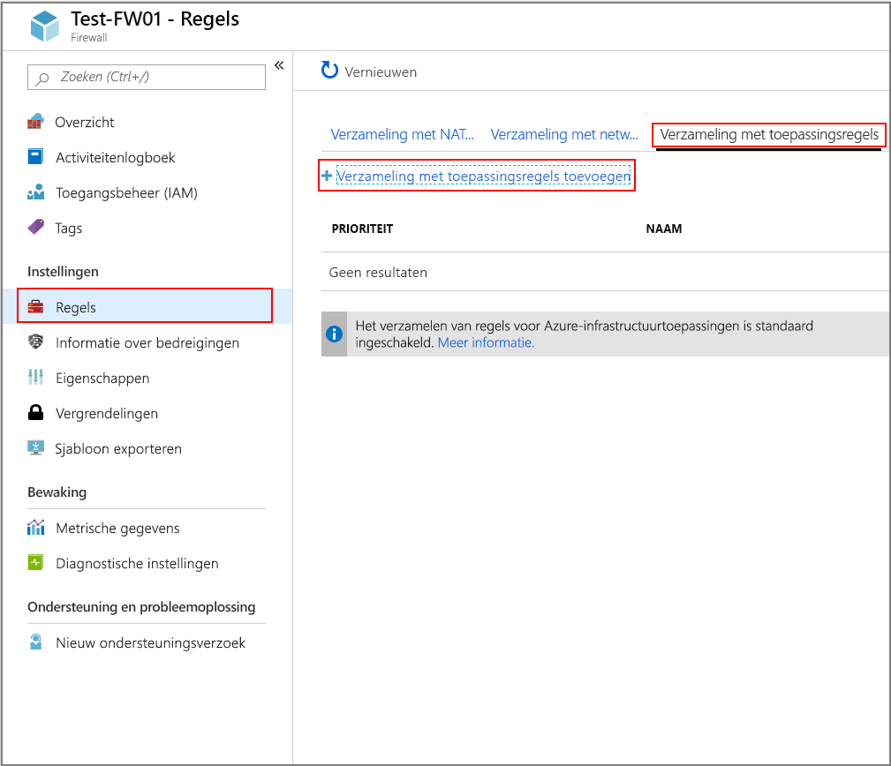
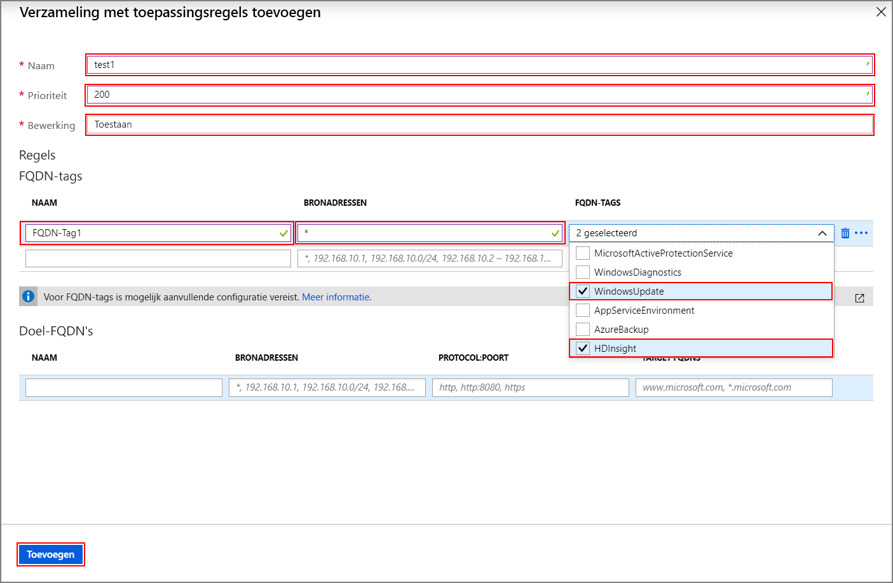
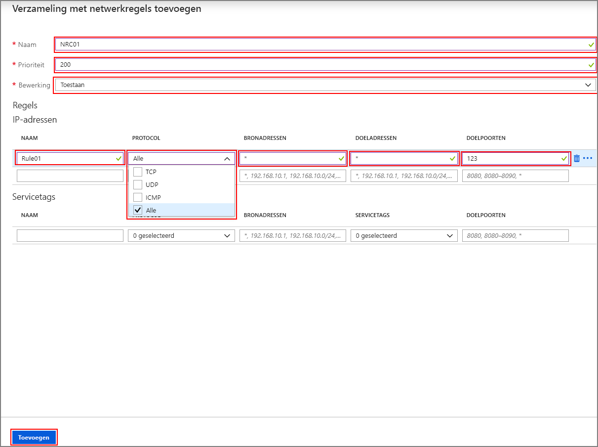

# <a name="configure-outbound-network-traffic-for-azure-hdinsight-clusters-using-firewall"></a>Uitgaand netwerkverkeer configureren voor Azure HDInsight-clusters met Firewall

In dit artikel vindt u de stappen om uitgaand verkeer uit uw HDInsight-cluster te beveiligen met Azure Firewall. In de onderstaande stappen wordt ervan uitgegaan dat u een Azure Firewall voor een bestaand cluster configureert. Als u een nieuw cluster en achter een firewall implementeert, maakt u eerst uw HDInsight-cluster en subnet en volgt u de stappen in deze handleiding.

## <a name="background"></a>Achtergrond

Azure HDInsight-clusters worden normaal gesproken geïmplementeerd in uw eigen virtuele netwerk. Het cluster heeft afhankelijkheden van services buiten dat virtuele netwerk waarvoor netwerktoegang nodig is om goed te functioneren.

Er zijn verschillende afhankelijkheden waarvoor binnenkomend verkeer nodig is. Het binnenkomende beheerverkeer kan niet via een firewall-apparaat worden verzonden. De bronadressen voor dit verkeer zijn bekend en worden [hier](hdinsight-management-ip-addresses.md)gepubliceerd. U ook NSG-regels (Network Security Group) maken met deze informatie om binnenkomend verkeer naar de clusters te beveiligen.

De HDInsight-afhankelijke verkeersafhankelijkheden zijn bijna volledig gedefinieerd met FQDN's, die geen statische IP-adressen achter zich hebben. Het ontbreken van statische adressen betekent dat Network Security Groups (NSG's) niet kunnen worden gebruikt om het uitgaande verkeer van een cluster af te sluiten. De adressen veranderen vaak genoeg dat men geen regels kan instellen op basis van de huidige naamresolutie en deze gebruiken om NSG-regels in te stellen.

De oplossing voor het beveiligen van uitgaande adressen is het gebruik van een firewall-apparaat dat uitgaand verkeer op basis van domeinnamen kan beheren. Azure Firewall kan uitgaand HTTP- en HTTPS-verkeer beperken op basis van de FQDN van de doel- of [FQDN-tags.](../firewall/fqdn-tags.md)

## <a name="configuring-azure-firewall-with-hdinsight"></a>Azure Firewall configureren met HDInsight

Een overzicht van de stappen om uitgangen van uw bestaande HDInsight met Azure Firewall te vergrendelen zijn:

1. Maak een subnet.
1. Maak een firewall.
1. Toepassingsregels toevoegen aan de firewall
1. Voeg netwerkregels toe aan de firewall.
1. Maak een routeringstabel.

### <a name="create-new-subnet"></a>Nieuw subnet maken

Maak een subnet met de naam **AzureFirewallSubnet** in het virtuele netwerk waar uw cluster bestaat.

### <a name="create-a-new-firewall-for-your-cluster"></a>Een nieuwe firewall voor uw cluster maken

Maak een firewall met de naam **Test-FW01** met behulp van de stappen in **De firewall implementeren** vanuit [Zelfstudie: Azure Firewall implementeren en configureren met behulp van de Azure-portal.](../firewall/tutorial-firewall-deploy-portal.md#deploy-the-firewall)

### <a name="configure-the-firewall-with-application-rules"></a>De firewall configureren met toepassingsregels

Maak een verzameling van toepassingsregels waarmee het cluster belangrijke communicatie kan verzenden en ontvangen.

1. Selecteer de nieuwe firewall **Test-FW01** in de Azure-portal.

1. Navigeer naar **regels** > **regels** > **toepassingsregelverzameling** > **+ Verzameling van toepassingsregels toevoegen**.

    

1. Geef in het scherm **Regels voor toepassingregels** toevoegen de volgende gegevens op:

    **Bovenste sectie**

    | Eigenschap|  Waarde|
    |---|---|
    |Naam| FwAppRule|
    |Prioriteit|200|
    |Actie|Toestaan|

    **Sectie FQDN-tags**

    | Naam | Bronadres | FQDN-tag | Opmerkingen |
    | --- | --- | --- | --- |
    | Rule_1 | * | WindowsUpdate en HDInsight | Vereist voor HDI-services |

    **FQDN's target**

    | Naam | Bronadressen | Protocol:Poort | Doel FQDNS | Opmerkingen |
    | --- | --- | --- | --- | --- |
    | Rule_2 | * | https:443 | login.windows.net | Hiermee u Windows-aanmeldingsactiviteit |
    | Rule_3 | * | https:443 | login.microsoftonline.com | Hiermee u Windows-aanmeldingsactiviteit |
    | Rule_4 | * | https:443,http:80 | storage_account_name.blob.core.windows.net | Vervang `storage_account_name` door de naam van uw werkelijke opslagaccount. Als uw cluster wordt ondersteund door WASB, voegt u een regel toe voor WASB. Als u ALLEEN https-verbindingen wilt gebruiken, moet u ervoor zorgen dat ['beveiligde overdracht vereist'](../storage/common/storage-require-secure-transfer.md) is ingeschakeld op het opslagaccount. |

   

1. Selecteer **Toevoegen**.

### <a name="configure-the-firewall-with-network-rules"></a>De firewall configureren met netwerkregels

Maak de netwerkregels om uw HDInsight-cluster correct te configureren.

1. Ga verder vanaf de vorige stap naar **Netwerkregelverzameling** > **+ Netwerkregelverzameling toevoegen**.

1. Geef in het scherm **Netwerkregelverzameling toevoegen** de volgende gegevens op:

    **Bovenste sectie**

    | Eigenschap|  Waarde|
    |---|---|
    |Naam| FwnetRule|
    |Prioriteit|200|
    |Actie|Toestaan|

    **Sectie IP-adressen**

    | Naam | Protocol | Bronadressen | Bestemmingsadressen | Doelpoorten | Opmerkingen |
    | --- | --- | --- | --- | --- | --- |
    | Rule_1 | UDP | * | * | 123 | Tijdservice |
    | Rule_2 | Alle | * | DC_IP_Address_1, DC_IP_Address_2 | * | Als u het Enterprise Security Package (ESP) gebruikt, voegt u een netwerkregel toe in de sectie IP-adressen waarmee u met AAD-DS voor ESP-clusters communiceren. U vindt de IP-adressen van de domeincontrollers op de AAD-DS sectie in de portal |
    | Rule_3 | TCP | * | IP-adres van uw Data Lake Storage-account | * | Als u Azure Data Lake Storage gebruikt, u een netwerkregel toevoegen in de sectie IP-adressen om een SNI-probleem met ADLS Gen1 en Gen2 op te lossen. Deze optie leidt het verkeer naar firewall, wat kan leiden tot hogere kosten voor grote gegevensladingen, maar het verkeer wordt geregistreerd en controleerbaar in firewalllogboeken. Bepaal het IP-adres voor uw Data Lake Storage-account. U een powershell-opdracht gebruiken `[System.Net.DNS]::GetHostAddresses("STORAGEACCOUNTNAME.blob.core.windows.net")` om de FQDN op te lossen naar een IP-adres.|
    | Rule_4 | TCP | * | * | 12000 | (Optioneel) Als u Log Analytics gebruikt, maakt u een netwerkregel in de sectie IP-adressen om de communicatie met uw Log Analytics-werkruimte mogelijk te maken. |

    **Sectie Servicetags**

    | Naam | Protocol | Bronadressen | Servicetags | Bestemmingspoorten | Opmerkingen |
    | --- | --- | --- | --- | --- | --- |
    | Rule_7 | TCP | * | SQL | 1433 | Configureer een netwerkregel in de sectie Servicetags voor SQL waarmee u SQL-verkeer registreren en controleren, tenzij u Service-eindpunten voor SQL Server hebt geconfigureerd op het HDInsight-subnet, waardoor de firewall wordt omzeild. |

   

1. Selecteer **Toevoegen**.

### <a name="create-and-configure-a-route-table"></a>Een routetabel maken en configureren

Maak een routetabel met de volgende vermeldingen:

* Alle IP-adressen van [gezondheids- en beheerservices: alle regio's](../hdinsight/hdinsight-management-ip-addresses.md#health-and-management-services-all-regions) met een volgende hoptype **internet.**

* Twee IP-adressen voor de regio waar het cluster is gemaakt vanuit [gezondheids- en beheerservices: specifieke regio's](../hdinsight/hdinsight-management-ip-addresses.md#health-and-management-services-specific-regions) met een volgend hoptype **internet**.

* Eén route voor virtueel toestel voor IP-adres 0.0.0.0/0 met de volgende hop als uw privé-IP-adres van Azure Firewall.

Als u bijvoorbeeld de routetabel wilt configureren voor een cluster dat is gemaakt in de VS-regio 'Oost-VS', gebruikt u de volgende stappen:

1. Selecteer uw Azure firewall **Test-FW01**. Kopieer het **privé-IP-adres** op de pagina **Overzicht.** In dit voorbeeld gebruiken we een **voorbeeldadres van 10.0.2.4**.

1. Navigeer vervolgens naar **de** > tabellen**Netwerkroute** > **voor** alle services en **routetabel maken**.

1. Navigeer vanaf uw nieuwe route naar > **Instellingenroutes** > **+ Toevoegen**. **Settings** Voeg de volgende routes toe:

| Routenaam | Adresvoorvoegsel | Volgend hoptype | Adres van de volgende hop |
|---|---|---|---|
| 168.61.49.99 | 168.61.49.99/32 | Internet | N.v.t. |
| 23.99.5.239 | 23.99.5.239/32 | Internet | N.v.t. |
| 168.61.48.131 | 168.61.48.131/32 | Internet | N.v.t. |
| 138.91.141.162 | 138.91.141.162/32 | Internet | N.v.t. |
| 13.82.225.233 | 13.82.225.233/32 | Internet | N.v.t. |
| 40.71.175.99 | 40.71.175.99/32 | Internet | N.v.t. |
| 0.0.0.0 | 0.0.0.0/0 | Virtueel apparaat | 10.0.2.4 |

De configuratie van de routetabel voltooien:

1. Wijs de routetabel die u hebt gemaakt toe aan uw HDInsight-subnet door **Subnetten** te selecteren onder **Instellingen**.

1. Selecteer **+ Associate**.

1. Selecteer op het **subnetscherm Associate** het virtuele netwerk waaruw cluster in is gemaakt en het **subnet dat** u voor uw HDInsight-cluster hebt gebruikt.

1. Selecteer **OK**.

## <a name="edge-node-or-custom-application-traffic"></a>Randknooppunt of aangepast toepassingsverkeer

Met de bovenstaande stappen kan het cluster zonder problemen werken. U moet nog steeds afhankelijkheden configureren voor uw aangepaste toepassingen die worden uitgevoerd op de randknooppunten, indien van toepassing.

Toepassingsafhankelijkheden moeten worden geïdentificeerd en toegevoegd aan de Azure Firewall of de routetabel.

Er moeten routes worden gemaakt voor het toepassingsverkeer om asymmetrische routeproblemen te voorkomen.

Als uw toepassingen andere afhankelijkheden hebben, moeten ze worden toegevoegd aan uw Azure Firewall. Maak toepassingsregels om HTTP/HTTPS-verkeer en netwerkregels voor al het andere toe te staan.

## <a name="logging-and-scale"></a>Logboekregistratie en schaal

Azure Firewall kan logboeken naar een aantal verschillende opslagsystemen verzenden. Volg de stappen in [Zelfstudie: Azure Firewall-logboeken en metrische gegevens controleren](../firewall/tutorial-diagnostics.md)voor instructies voor het configureren van logboekregistratie voor uw firewall.

Zodra u de logboekinstelling hebt voltooid, u, als u gegevens registreert bij Logboekanalyse, geblokkeerd verkeer weergeven met een query zoals:

```Kusto
AzureDiagnostics | where msg_s contains "Deny" | where TimeGenerated >= ago(1h)
```

Het integreren van uw Azure Firewall met Azure Monitor-logboeken is handig wanneer u voor het eerst een toepassing laat werken wanneer u niet op de hoogte bent van alle toepassingsafhankelijkheden. Meer informatie over Azure Monitor-logboeken vindt u in Azure Monitor analyseren van [logboekgegevens](../azure-monitor/log-query/log-query-overview.md)

Zie [dit](../azure-resource-manager/management/azure-subscription-service-limits.md#azure-firewall-limits) document of raadpleeg de [veelgestelde vragen](../firewall/firewall-faq.md)voor meer informatie over de schaallimieten van Azure Firewall en aanvraagverhogingen.

## <a name="access-to-the-cluster"></a>Toegang tot het cluster

Nadat de firewall is ingesteld, u het`https://CLUSTERNAME-int.azurehdinsight.net`interne eindpunt () gebruiken om toegang te krijgen tot de Ambari vanuit het virtuele netwerk.

Als u het openbare`https://CLUSTERNAME.azurehdinsight.net`eindpunt ( )`CLUSTERNAME-ssh.azurehdinsight.net`of ssh eindpunt ( ) wilt gebruiken, moet u ervoor zorgen dat u de juiste routes in de routetabel en NSG-regels hebt om het asymmetrische routeprobleem te voorkomen dat [hier](../firewall/integrate-lb.md)wordt uitgelegd. Specifiek in dit geval moet u het IP-adres van de client toestaan in de inkomende NSG-regels `internet`en het ook toevoegen aan de door de gebruiker gedefinieerde routetabel met de volgende hopset als . Als dit niet correct is ingesteld, ziet u een time-outfout.

## <a name="configure-another-network-virtual-appliance"></a>Een ander netwerkvirtueel toestel configureren

> [!Important]
> De volgende informatie is **alleen** vereist als u een ander netwerkvirtueel toestel (NVA dan Azure Firewall) wilt configureren.

Met de vorige instructies u Azure Firewall configureren voor het beperken van uitgaand verkeer van uw HDInsight-cluster. Azure Firewall is automatisch geconfigureerd om verkeer toe te staan voor veel van de veelvoorkomende belangrijke scenario's. Als u een ander netwerkvirtueel toestel wilt gebruiken, moet u handmatig een aantal extra functies configureren. Houd rekening met het volgende bij het configureren van uw virtuele netwerktoestel:

* Services-serviceeindpuntservices moeten worden geconfigureerd met serviceeindpunten.
* Afhankelijkheden van IP-adressen zijn voor niet-HTTP/S-verkeer (zowel TCP- als UDP-verkeer).
* FQDN HTTP/HTTPS-eindpunten kunnen in uw NVA-apparaat worden geplaatst.
* JokerHTTP/HTTPS-eindpunten zijn afhankelijkheden die kunnen variëren op basis van een aantal kwalificatietoernooien.
* Wijs de routetabel die u maakt toe aan uw HDInsight-subnet.

### <a name="service-endpoint-capable-dependencies"></a>Afhankelijken van serviceeindpunten

| **Eindpunt** |
|---|
| Azure SQL |
| Azure Storage |
| Azure Active Directory |

#### <a name="ip-address-dependencies"></a>Afhankelijkheden van IP-adres

| **Eindpunt** | **Details** |
|---|---|
| \*:123 | NTP klok te controleren. Verkeer wordt gecontroleerd op meerdere eindpunten op poort 123 |
| Ip's [hier](hdinsight-management-ip-addresses.md) gepubliceerd | Dit zijn HDInsight-service |
| AAD-DS private IP's voor ESP-clusters |
| \*:16800 voor KMS Windows-activering |
| \*12000 voor Log Analytics |

#### <a name="fqdn-httphttps-dependencies"></a>FQDN HTTP/HTTPS-afhankelijkheden

> [!Important]
> De onderstaande lijst geeft slechts een paar van de belangrijkste FQDNs. U extra FQDN's (voornamelijk Azure Storage en Azure Service Bus) krijgen voor het configureren van uw NVA [in dit bestand.](https://github.com/Azure-Samples/hdinsight-fqdn-lists/blob/master/HDInsightFQDNTags.json)

| **Eindpunt**                                                          |
|---|
| azure.archive.ubuntu.com:80                                           |
| security.ubuntu.com:80                                                |
| ocsp.msocsp.com:80                                                    |
| ocsp.digicert.com:80                                                  |
| wawsinfraprodbay063.blob.core.windows.net:443                         |
| registry-1.docker.io:443                                              |
| auth.docker.io:443                                                    |
| production.cloudflare.docker.com:443                                  |
| download.docker.com:443                                               |
| us.archive.ubuntu.com:80                                              |
| download.mono-project.com:80                                          |
| packages.treasuredata.com:80                                          |
| security.ubuntu.com:80                                                |
| azure.archive.ubuntu.com:80                                           |
| ocsp.msocsp.com:80                                                    |
| ocsp.digicert.com:80                                                  |

## <a name="next-steps"></a>Volgende stappen

* [Azure HDInsight virtuele netwerkarchitectuur](hdinsight-virtual-network-architecture.md)
