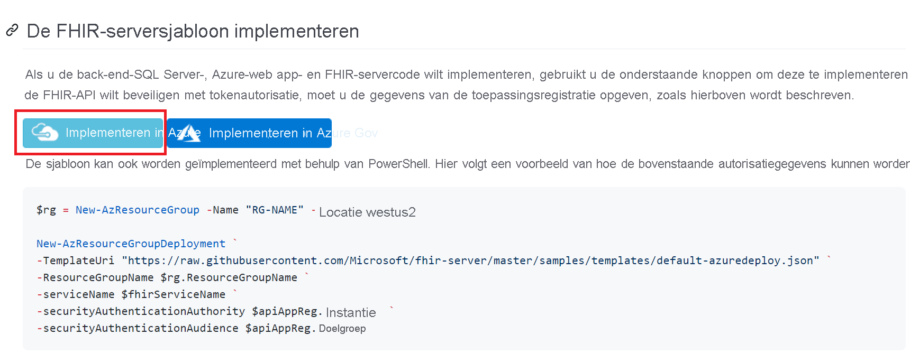
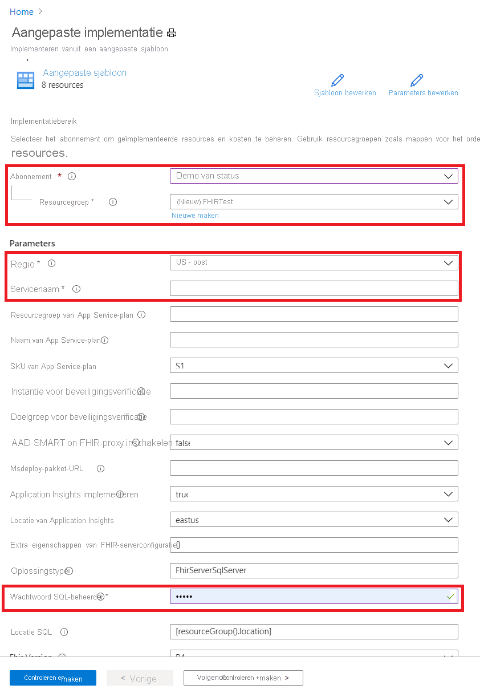

# Quickstart: Een Open Source FHIR-server implementeren met behulp van Azure Portal

In deze quickstart wordt uitgelegd hoe u een Open Source FHIR-server in Azure implementeert met behulp van Azure Portal. We gebruiken de koppelingen voor eenvoudige implementatie in de [opensource-opslagplaats](https://github.com/Microsoft/fhir-server)

Als u nog geen abonnement op Azure hebt, maak dan een [gratis account](https://azure.microsoft.com/free/?WT.mc_id=A261C142F) aan voordat u begint.

## Opensource-GitHub-opslagplaats

Ga naar de pagina [GitHub-implementatie](https://github.com/Microsoft/fhir-server/blob/master/docs/DefaultDeployment.md) en zoek de knoppen Implementeren naar Azure op:

Klik op de knop Implementatie. Azure Portal wordt geopend.

## Implementatieparameters invullen

Kies ervoor om een nieuwe resourcegroep te maken en geef deze een unieke naam. De enige andere vereiste parameter is een naam voor de service.

U ziet dat bij de implementatie de broncode rechtstreeks wordt opgehaald uit de opensource-opslagplaats op GitHub. Als u de opslagplaats hebt gevorkt, kunt u naar uw eigen vork en naar een specifieke vertakking verwijzen.

Nadat u de details hebt ingevuld, kunt u de implementatie starten.

## Controleren of de FHIR-server draait

Zodra de implementatie is voltooid, kunt u uw browser naar `https://SERVICENAME.azurewebsites.net/metadata` laten verwijzen om een mogelijkheidsinstructie te verkrijgen. Het duurt ongeveer een minuut voordat de server de eerste keer reageert.

## Resources opschonen

U kunt de resourcegroep en alle gerelateerde resources verwijderen wanneer u deze niet meer nodig hebt. Hiertoe selecteert u de resourcegroep met de ingerichte resources, selecteert u **Resourcegroep verwijderen** en vervolgens bevestigt u de naam van de resourcegroep die u wilt verwijderen.

## Volgende stappen

In deze zelfstudie hebt u de Microsoft Open Source FHIR-server voor Azure geïmplementeerd in uw abonnement. Als u wilt weten hoe u de FHIR-API kunt openen met behulp van Postman, gaat u verder met de zelfstudie Postman.
 
>[!div class="nextstepaction"]
>[Toegang tot de FHIR-API met Postman](access-fhir-postman-tutorial.md)