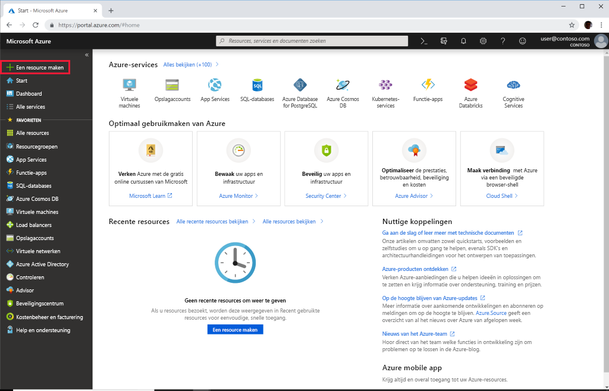

# Quickstart: De Azure-API voor FHIR implementeren met de Azure-portal

In deze quickstart leert u hoe u de Azure-API voor FHIR implementeert met behulp van de Azure-portal.

Als u nog geen abonnement op Azure hebt, maak dan een [gratis account](https://azure.microsoft.com/free/?WT.mc_id=A261C142F) aan voordat u begint.

## Nieuwe resource maken

Open de [Azure-portal](https://portal.azure.com) en klik op **Een resource maken**

## Zoek naar de Azure-API voor FHIR

U kunt de Azure-API voor FHIR vinden door ‘FHIR’ in het zoekvak te typen:

:::image type="content" source="media/quickstart-paas-portal/portal-search-healthcare-apis.png" alt-text="Zoek naar Healthcare API’s":::

## Maak een ‘Azure-API voor FHIR’-account

Selecteer **Maken** om een nieuw ‘Azure-API voor FHIR’-account te maken:

:::image type="content" source="media/quickstart-paas-portal/portal-create-healthcare-apis.png" alt-text="Maak een ‘Azure-API voor FHIR’-account":::

## Voer accountgegevens in

Selecteer een bestaande resourcegroep of maak een nieuwe, kies een naam voor het account en klik tot slot op **Controleren en maken**:

:::image type="content" source="media/quickstart-paas-portal/portal-new-healthcareapi-details.png" alt-text="Nieuwe Healthcare API-gegevens":::

Bevestig de aanmaak en wacht tot de FHIR-API is geïmplementeerd.

## Aanvullende instellingen (optioneel)

U kunt klikken op **Volgende: Aanvullende instellingen** om de verificatie-instellingen weer te geven. De standaardconfiguratie voor de Azure API voor FHIR is om [Azure RBAC te gebruiken voor het toewijzen van gegevensvlakrollen](configure-azure-rbac.md). In deze modus wordt de Autoriteit voor de FHIR-service ingesteld op de Azure Active Directory-tenant van het abonnement:

:::image type="content" source="media/rbac/confirm-azure-rbac-mode-create.png" alt-text="Instellingen Standaardverificatie":::

Het invoerveld voor toegestane object-id's wordt grijs weergegeven, aangezien we in dit geval Azure RBAC gebruiken voor het configureren van roltoewijzingen.

Als u de FHIR-service wilt configureren om een externe of secundaire Azure Active Directory-tenant te gebruiken, kunt u de Autoriteit wijzigen en object-id's invoeren voor gebruikers en groepen die toegang tot de server moeten krijgen. Zie de handleiding voor [lokale RBAC-configuratie](configure-local-rbac.md) voor meer informatie.

## FHIR API-mogelijkheidsinstructie ophalen

Om te valideren dat het nieuwe FHIR API-account is ingericht, haalt u een mogelijkheidsinstructie op door een browser te wijzen naar `https://<ACCOUNT-NAME>.azurehealthcareapis.com/metadata`.

## Resources opschonen

Wanneer u de resourcegroep niet meer nodig hebt, kunt u de resourcegroep, de Azure-API voor FHIR en alle gerelateerde resources verwijderen. Hiertoe selecteert u de resourcegroep met het Azure-API voor FHIR-account, selecteert u **Resourcegroep verwijderen** en bevestigt u vervolgens de naam van de resourcegroep die u wilt verwijderen.

## Volgende stappen

In deze quickstart hebt u de Azure-API voor FHIR geïmplementeerd in uw abonnement. Als u aanvullende instellingen wilt configureren in uw Azure-API voor FHIR, gaat u verder met de instructiegids Aanvullende instellingen.

>[!div class="nextstepaction"]
>[Aanvullende instellingen in de Azure-API voor FHIR](azure-api-for-fhir-additional-settings.md)
