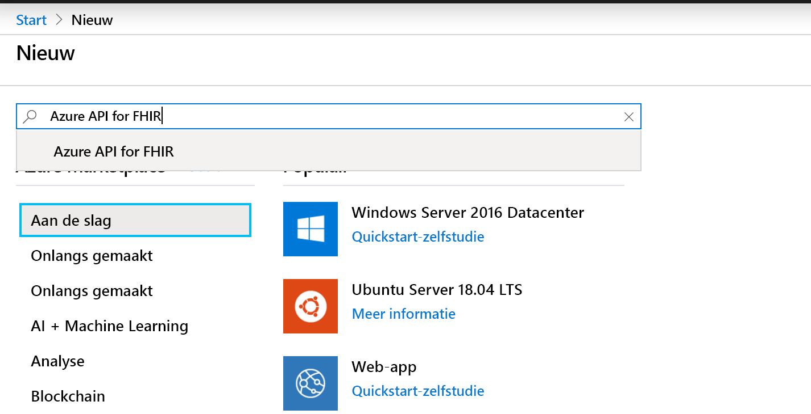
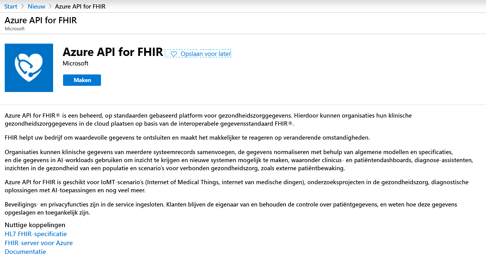
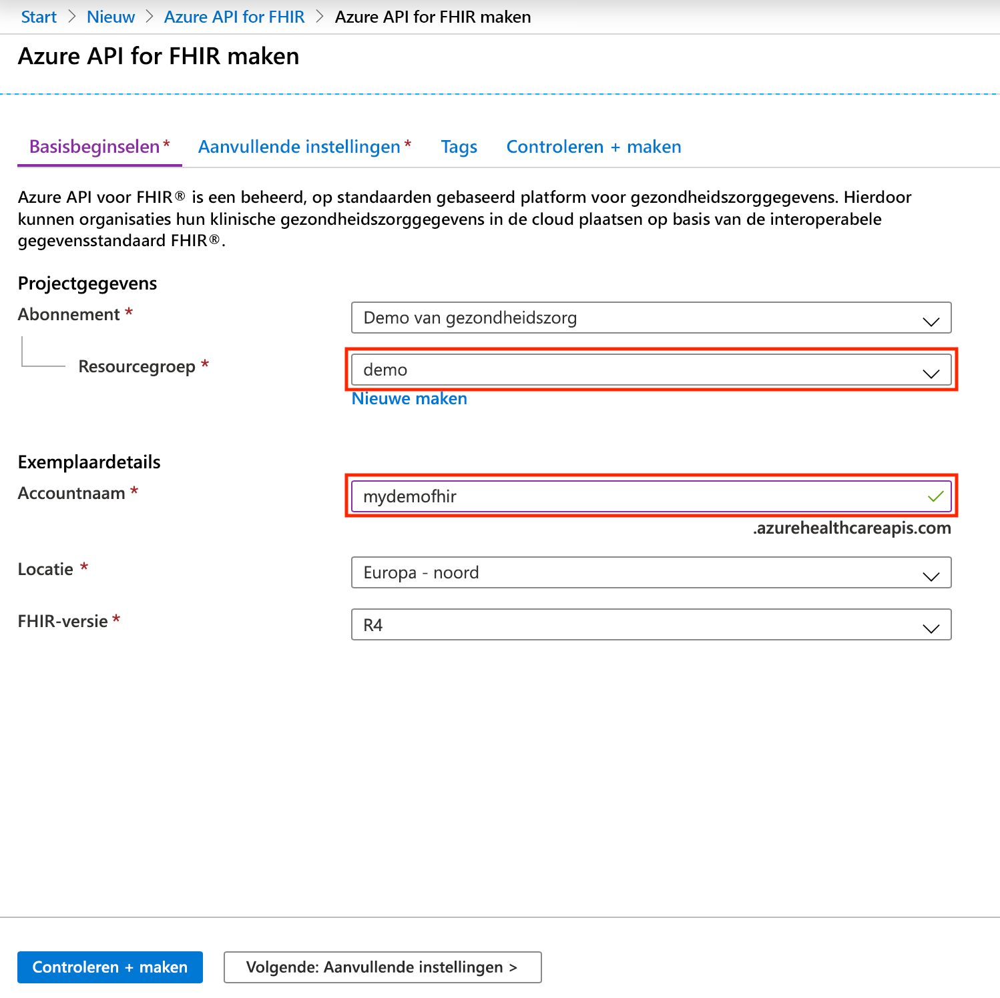

# Quickstart: De Azure-API voor FHIR implementeren met de Azure-portal

In deze quickstart leert u hoe u de Azure-API voor FHIR implementeert met behulp van de Azure-portal.

Als u nog geen abonnement op Azure hebt, maak dan een [gratis account](https://azure.microsoft.com/free/?WT.mc_id=A261C142F) aan voordat u begint.

## Nieuwe resource maken

Open de [Azure-portal](https://portal.azure.com) en klik op **Een resource maken**

## Zoek naar de Azure-API voor FHIR

U kunt de Azure-API voor FHIR vinden door ‘FHIR’ in het zoekvak te typen:

## Maak een ‘Azure-API voor FHIR’-account

Selecteer **Maken** om een nieuw ‘Azure-API voor FHIR’-account te maken:

## Voer accountgegevens in

Selecteer een bestaande resourcegroep of maak een nieuwe, kies een naam voor het account en klik tot slot op **Controleren en maken**:

Bevestig de aanmaak en wacht tot de FHIR-API is geïmplementeerd.

## Aanvullende instellingen

Klik op **Next: Aanvullende instellingen** om de ID’s van instanties, doelgroepen en identiteitsobjecten te configureren die toegang moeten kunnen krijgen tot deze Azure-API voor FHIR, schakel indien nodig ‘SMART on FHIR’ in en configureer databasedoorvoer:

- **Instantie:** U kunt een andere Azure AD-tenant dan degene waarbij u bent aangemeld opgeven als verificatie-instantie voor de service.
- **Doelgroep:** De aanbevolen en standaardinstelling is dat de doelgroep is ingesteld op de URL van de FHIR-server. U kunt dat hier wijzigen. De doelgroep identificeert de ontvanger waar het token voor is bedoeld. In deze context moet deze worden ingesteld op iets dat de FHIR-API zelf vertegenwoordigt.
- **Toegestane object-ID’s:** U kunt ID’s van identiteitsobjecten opgeven die toegang moeten kunnen krijgen tot deze Azure-API voor FHIR. Meer informatie over het vinden van de object-ID voor gebruikers en service-principals vindt u in de instructiegids [ID's van identiteitsobjecten vinden](find-identity-object-ids.md).  
- **SMART on FHIR-proxy:** U kunt de SMART on FHIR-proxy inschakelen. Zie de zelfstudie [De SMART on FHIR-proxy van de Azure-API voor FHIR](https://docs.microsoft.com/azure/healthcare-apis/use-smart-on-fhir-proxy) voor meer informatie over hoe u de SMART on FHIR-proxy configureert.  
- **Ingerichte doorvoer (RU/s):** Hier kunt u doorvoerinstellingen opgeven voor de onderliggende database van uw Azure-API voor FHIR. U kunt deze instelling later wijzigen op de blade Database. Zie de pagina [Database-instellingen configureren](configure-database.md) voor meer informatie.

## FHIR API-mogelijkheidsinstructie ophalen

Om te valideren dat het nieuwe FHIR API-account is ingericht, haalt u een mogelijkheidsinstructie op door een browser te wijzen naar `https://<ACCOUNT-NAME>.azurehealthcareapis.com/metadata`.

## Resources opschonen

Wanneer u de resourcegroep niet meer nodig hebt, kunt u de resourcegroep, de Azure-API voor FHIR en alle gerelateerde resources verwijderen. Hiertoe selecteert u de resourcegroep met het Azure-API voor FHIR-account, selecteert u **Resourcegroep verwijderen** en bevestigt u vervolgens de naam van de resourcegroep die u wilt verwijderen.

## Volgende stappen

In deze quickstart hebt u de Azure-API voor FHIR geïmplementeerd in uw abonnement. Als u aanvullende instellingen wilt configureren in uw Azure-API voor FHIR, gaat u verder met de instructiegids Aanvullende instellingen.

>[!div class="nextstepaction"]
>[Aanvullende instellingen in de Azure-API voor FHIR](azure-api-for-fhir-additional-settings.md)
