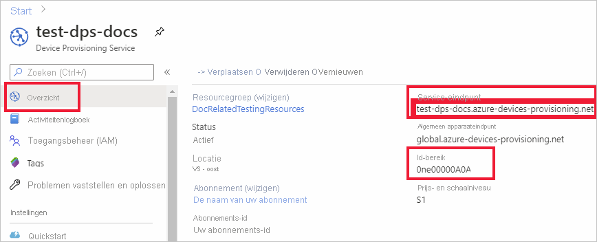
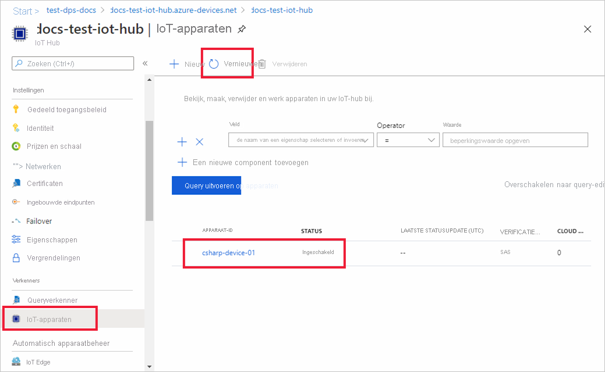

# <a name="quickstart-provision-a-symmetric-key-device-using-c"></a>Quickstart: Een apparaat met een symmetrische sleutel inrichten met behulp van C#

In deze quickstart leert u hoe u een Windows-ontwikkelcomputer kunt inrichten als een apparaat op een IoT-hub met C#. Dit apparaat maakt gebruik van een symmetrische sleutel en een afzonderlijke inschrijving voor verificatie met een Device Provisioning Service-exemplaar om te kunnen worden toegewezen aan een IoT-hub. Voorbeeldcode van de [Azure IoT Python-voorbeelden voor C#](https://github.com/Azure-Samples/azure-iot-samples-csharp) wordt gebruikt om het apparaat in te richten. 

Hoewel dit artikel laat zien hoe u een inrichting maakt met een afzonderlijke inschrijving, kunt u dezelfde procedures ook gebruiken voor inschrijvingsgroepen. Er zijn enkele verschillen bij het gebruik van inschrijvingsgroepen. U moet bijvoorbeeld een afgeleide apparaatsleutel gebruiken met een unieke registratie-ID voor het apparaat. [Apparaten inrichten met symmetrische sleutels](how-to-legacy-device-symm-key.md) biedt een voorbeeld van een inschrijvingsgroep. Zie [Groepsinschrijvingen voor attestation met behulp van een symmetrische sleutel](concepts-symmetric-key-attestation.md#group-enrollments) voor meer informatie over inschrijvingsgroepen.

Raadpleeg het overzicht [Inrichten](about-iot-dps.md#provisioning-process) als u niet bekend bent met het proces van automatisch inrichten. 

Controleer ook of u de stappen in [IoT Hub Device Provisioning Service instellen met Azure Portal](./quick-setup-auto-provision.md) hebt voltooid voordat u verdergaat met deze snelstart. Voor deze snelstartgids wordt aangenomen dat u al een Device Provisioning Service-exemplaar hebt gemaakt.

Dit artikel is gericht op een Windows-gebaseerd werkstation. U kunt de procedures echter ook uitvoeren op Linux. Zie [Inrichten voor multitenancy](how-to-provision-multitenant.md) voor een Linux-voorbeeld.


[!INCLUDE [quickstarts-free-trial-note](../../includes/quickstarts-free-trial-note.md)]


## <a name="prerequisites"></a>Vereisten

* Zorg ervoor dat u [.NET Core 2.1 SDK](https://www.microsoft.com/net/download/windows) of hoger hebt geïnstalleerd op uw Windows-computer.

* Meest recente versie van [Git](https://git-scm.com/download/) geïnstalleerd.

<a id="setupdevbox"></a>


## <a name="create-a-device-enrollment"></a>Een apparaatinschrijving maken

1. Meld u aan bij de [Azure-portal](https://portal.azure.com), selecteer in het linkermenu de knop **Alle resources** en open uw exemplaar van Device Provisioning Service.

2. Selecteer het tabblad **Inschrijvingen beheren** en klik vervolgens op de knop **Afzonderlijke inschrijvingen toevoegen** bovenaan. 

3. Voer in het deelvenster **Inschrijving toevoegen** de volgende informatie in en druk op de knop **Opslaan**.

   - **Mechanisme:** selecteer **Symmetrische sleutel** als *mechanisme* voor identiteitscontrole.

   - **Automatisch sleutels genereren** : schakel dit selectievakje in.

   - **Registratie-ID** : voer een registratie-ID voor het identificeren van de inschrijving. Gebruik alleen kleine alfanumerieke tekens en streepjes ('-'). Bijvoorbeeld **symm-key-csharp-device-01**.

   - **IoT Hub apparaat-ID:** voer een apparaat-ID in. Bijvoorbeeld **csharp-device-01**.

     

4. Zodra u uw inschrijving heeft opgeslagen, worden de **primaire sleutel** en **secundaire sleutel** gegenereerd en aan de inschrijvingsvermelding toegevoegd. De inschrijving met symmetrische sleutel van uw apparaat wordt weergegeven als **symm-key-csharp-device-01** in de kolom *Registratie-id* op het tabblad *Individuele inschrijvingen*. 

5. Open de inschrijving en kopieer de waarde van uw gegenereerde **primaire sleutel** en **secundaire sleutel**. U gebruikt deze sleutelwaarde en de **registratie-ID** later wanneer u omgevingsvariabelen toevoegt voor gebruik met de voorbeeldcode voor het inrichten van apparaten.


## <a name="prepare-the-c-environment"></a>De C#-omgeving voorbereiden 

1. Open een Git CMD- of Git Bash-opdrachtregelomgeving. Kloon de GitHub-opslagplaats [Azure IoT-voorbeelden voor C#](https://github.com/Azure-Samples/azure-iot-samples-csharp) met behulp van de volgende opdracht:

    ```cmd
    git clone https://github.com/Azure-Samples/azure-iot-samples-csharp.git
    ```


<a id="firstbootsequence"></a>

## <a name="prepare-the-device-provisioning-code"></a>De apparaatinrichtingscode voorbereiden

In deze sectie voegt u de volgende vier omgevingsvariabelen toe die worden gebruikt als parameters voor de voorbeeldcode voor het inrichten van apparaten om uw symmetrische-sleutelapparaat in te richten. 

* `DPS_IDSCOPE`
* `PROVISIONING_REGISTRATION_ID`
* `PRIMARY_SYMMETRIC_KEY`
* `SECONDARY_SYMMETRIC_KEY`

De inrichtingscode neemt op basis van deze variabelen contact op met het DPS-exemplaar om uw apparaat te verifiëren. Het apparaat wordt vervolgens toegewezen aan een IoT-hub die al is gekoppeld aan het DPS-exemplaar op basis van de afzonderlijke inschrijvingsconfiguratie. Zodra de voorbeeldcode is ingericht, worden er testtelemetriegegevens naar de IoT-hub verzonden.

1. Selecteer in de [Azure-portal](https://portal.azure.com), in het menu Device Provisioning Service, **Overzicht** en kopieer uw _Service-eindpunt_ en _ID-bereik_. U gebruikt deze waarden voor de omgevingsvariabelen `PROVISIONING_HOST` en `DPS_IDSCOPE`.

    

2. Open een opdrachtprompt en ga naar de *SymmetricKeySample* in de opslagplaats met gekloonde voorbeelden:

    ```cmd
    cd provisioning\Samples\device\SymmetricKeySample
    ```

3. Open in de map *SymmetricKeySample* *Program.cs* in een teksteditor en zoek de coderegels die de `individualEnrollmentPrimaryKey`- en `individualEnrollmentSecondaryKey`-tekenreeksen instellen. Werk deze coderegels als volgt bij, zodat de omgevingsvariabelen worden gebruikt in plaats van dat de sleutels in code worden vastgelegd.
 
    ```csharp
        //These are the two keys that belong to your individual enrollment. 
        // Leave them blank if you want to try this sample for an individual enrollment instead
        //private const string individualEnrollmentPrimaryKey = "";
        //private const string individualEnrollmentSecondaryKey = "";

        private static string individualEnrollmentPrimaryKey = Environment.GetEnvironmentVariable("PRIMARY_SYMMETRIC_KEY");;
        private static string individualEnrollmentSecondaryKey = Environment.GetEnvironmentVariable("SECONDARY_SYMMETRIC_KEY");;
    ```

    Zoek ook de coderegel waarmee de tekenreeks `registrationId` wordt ingesteld en werk deze als volgt bij om ook een omgevingsvariabele te gebruiken:

    ```csharp
        //This field is mandatory to provide for this sample
        //private static string registrationId = "";

        private static string registrationId = Environment.GetEnvironmentVariable("PROVISIONING_REGISTRATION_ID");;
    ```

    Sla de wijzigingen op in *Program.cs*.

3. Voeg in uw opdrachtprompt de omgevingsvariabelen toe voor het id-bereik, de registratie-id en de primaire en secundaire symmetrische sleutel die u hebt gekopieerd uit de afzonderlijke inschrijving in de vorige sectie.  

    De volgende opdrachten zijn voorbeelden van het weergeven van de opdrachtsyntaxis. Zorg ervoor dat u de juiste waarden gebruikt.

    ```console
    set DPS_IDSCOPE=0ne00000A0A
    ```

    ```console
    set PROVISIONING_REGISTRATION_ID=symm-key-csharp-device-01
    ```

    ```console
    set PRIMARY_SYMMETRIC_KEY=sbDDeEzRuEuGKag+kQKV+T1QGakRtHpsERLP0yPjwR93TrpEgEh/Y07CXstfha6dhIPWvdD1nRxK5T0KGKA+nQ==
    ```

    ```console
    set SECONDARY_SYMMETRIC_KEY=Zx8/eE7PUBmnouB1qlNQxI7fcQ2HbJX+y96F1uCVQvDj88jFL+q6L9YWLLi4jqTmkRPOulHlSbSv2uFgj4vKtw==
    ```


4. Bouw de voorbeeldcode en voer deze uit met de volgende opdracht.

    ```console
    dotnet run
    ```

5. De verwachte uitvoer moet er ongeveer als volgt uitzien, dat de gekoppelde IoT-hub weergeeft waaraan het apparaat is toegewezen op basis van de afzonderlijke inschrijvingsinstellingen. Een voorbeeld van een 'TestMessage'-tekenreeks wordt als test naar de hub verzonden:

    ```output
    D:\azure-iot-samples-csharp\provisioning\Samples\device\SymmetricKeySample>dotnet run
    RegistrationID = symm-key-csharp-device-01
    ProvisioningClient RegisterAsync . . . Assigned
    ProvisioningClient AssignedHub: docs-test-iot-hub.azure-devices.net; DeviceID: csharp-device-01
    Creating Symmetric Key DeviceClient authentication
    DeviceClient OpenAsync.
    DeviceClient SendEventAsync.
    DeviceClient CloseAsync.
    Enter any key to exit
    ```
    
6. Navigeer in de Azure-portal naar de IoT-hub die is gekoppeld aan uw inrichtingsservice en open de blade **IoT-apparaten**. Nadat het symmetrische sleutelapparaat is ingericht op de hub, wordt de apparaat-ID weergegeven met *STATUS* als **ingeschakeld**. U moet mogelijk op de knop **Vernieuwen** bovenaan drukken als u de blade vóór het uitvoeren van de voorbeeldapparaatcode al hebt geopend. 

     

> [!NOTE]
> Als u de standaardwaarde van de *initiële status van de apparaatdubbel* hebt gewijzigd in de inschrijvingsvermelding voor uw apparaat, kan de gewenste status van de dubbel uit de hub worden gehaald en er dienovereenkomstig naar worden gehandeld. Zie [Apparaatdubbels begrijpen en gebruiken in IoT Hub](../iot-hub/iot-hub-devguide-device-twins.md) voor meer informatie.
>


## <a name="clean-up-resources"></a>Resources opschonen

Als u wilt blijven doorwerken met het voorbeeld van de apparaatclient en deze beter wilt leren kennen, wis de resources die in deze quickstart zijn gemaakt dan niet. Als u niet wilt doorgaan, gebruikt u de volgende stappen om alle resources te verwijderen die via deze quickstart zijn gemaakt.

1. Selecteer in het linkermenu in Azure Portal **Alle resources** en selecteer uw Device Provisioning Service. Open het tabblad **Inschrijvingen beheren** voor uw service en klik vervolgens op het tabblad **Afzonderlijke inschrijvingen**. Schakel het selectievakje naast de *Registratie-id* in van het apparaat dat u hebt ingeschreven in deze quickstart. Druk vervolgens op de knop **Verwijderen** bovenaan het deelvenster. 
1. Selecteer in het linkermenu in Azure Portal **Alle resources** en selecteer vervolgens uw IoT-hub. Open **IoT-apparaten** voor uw hub, schakel het selectievakje *DEVICE ID* in van het apparaat dat u hebt geregistreerd in deze quickstart en druk vervolgens bovenaan op de knop **Verwijderen**.

## <a name="next-steps"></a>Volgende stappen

In deze quickstart hebt u een op Windows gebaseerd symmetrisch sleutelapparaat ingericht op uw IoT-hub met behulp van de IoT Hub Device Provisioning Service. Voor meer informatie over het inrichten van X.509-certificaatapparaten met behulp van C# gaat u verder met de onderstaande quickstart voor X.509-apparaten. 

> [!div class="nextstepaction"]
> [Azure quickstart - Inrichting van X.509-apparaten met DPS en C#](quick-create-simulated-device-x509-csharp.md)
