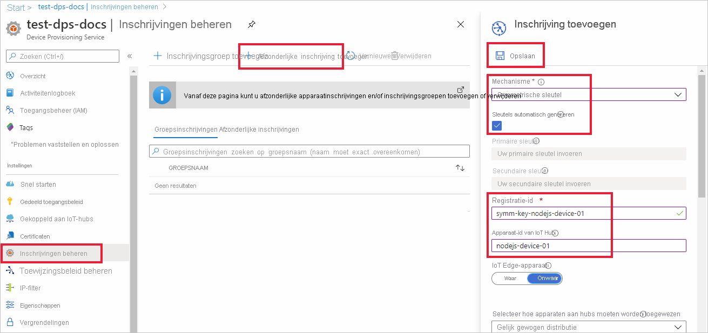

# <a name="quickstart-provision-a-symmetric-key-device-using-nodejs"></a>Quickstart: Een apparaat met een symmetrische sleutel inrichten met behulp van Node.js

In deze quickstart leert u hoe u een Windows-ontwikkelcomputer kunt inrichten als een apparaat op een IoT-hub met Node.js. Dit apparaat gebruikt een symmetrische sleutel en een afzonderlijke inschrijving voor verificatie met een Device Provisioning Service-exemplaar om te kunnen worden toegewezen aan een IoT-hub. Voorbeeldcode van de [SDK voor Node.js](https://github.com/Azure/azure-iot-sdk-node.git) wordt gebruikt om het apparaat in te richten. 

Hoewel dit artikel laat zien hoe u een inrichting maakt met een afzonderlijke inschrijving, kunt u dezelfde procedures ook gebruiken voor inschrijvingsgroepen. Er zijn enkele verschillen bij het gebruik van inschrijvingsgroepen. U moet bijvoorbeeld een afgeleide apparaatsleutel gebruiken met een unieke registratie-ID voor het apparaat. [Apparaten inrichten met symmetrische sleutels](how-to-legacy-device-symm-key.md) biedt een voorbeeld van een inschrijvingsgroep. Zie [Groepsinschrijvingen voor attestation met behulp van een symmetrische sleutel](concepts-symmetric-key-attestation.md#group-enrollments) voor meer informatie over inschrijvingsgroepen.

Raadpleeg het overzicht [Inrichten](about-iot-dps.md#provisioning-process) als u niet bekend bent met het proces van automatisch inrichten. 

Controleer ook of u de stappen in [IoT Hub Device Provisioning Service instellen met Azure Portal](./quick-setup-auto-provision.md) hebt voltooid voordat u verdergaat met deze snelstart. Voor deze snelstartgids wordt aangenomen dat u al een Device Provisioning Service-exemplaar hebt gemaakt.

Dit artikel is gericht op een Windows-gebaseerd werkstation. U kunt de procedures echter ook uitvoeren op Linux. Zie [Inrichten voor multitenancy](how-to-provision-multitenant.md) voor een Linux-voorbeeld.


[!INCLUDE [quickstarts-free-trial-note](../../includes/quickstarts-free-trial-note.md)]


## <a name="prerequisites"></a>Vereisten

- Vertrouwd zijn met de concepten van [inrichten](about-iot-dps.md#provisioning-process).
- U hebt [IoT Hub Device Provisioning Service instellen met Azure Portal](./quick-setup-auto-provision.md) voltooid.
- Een Azure-account met een actief abonnement. [Maak er gratis een](https://azure.microsoft.com/free/?ref=microsoft.com&utm_source=microsoft.com&utm_medium=docs&utm_campaign=visualstudio).
- [Node.js v4.0+](https://nodejs.org).
- [Git](https://git-scm.com/download/).


## <a name="create-a-device-enrollment"></a>Een apparaatinschrijving maken

1. Meld u aan bij de [Azure-portal](https://portal.azure.com), selecteer in het linkermenu de knop **Alle resources** en open uw exemplaar van Device Provisioning Service.

2. Selecteer het tabblad **Inschrijvingen beheren** en klik vervolgens op de knop **Afzonderlijke inschrijvingen toevoegen** bovenaan. 

3. Voer in het deelvenster **Inschrijving toevoegen** de volgende informatie in en druk op de knop **Opslaan**.

   - **Mechanisme:** selecteer **Symmetrische sleutel** als *mechanisme* voor identiteitscontrole.

   - **Automatisch sleutels genereren** : schakel dit selectievakje in.

   - **Registratie-ID** : voer een registratie-ID voor het identificeren van de inschrijving. Gebruik alleen kleine alfanumerieke tekens en streepjes ('-'). Bijvoorbeeld **symm-key-nodejs-device-01**.

   - **IoT Hub apparaat-ID:** voer een apparaat-ID in. Bijvoorbeeld, **nodejs-device-01**.

     

4. Zodra u uw inschrijving heeft opgeslagen, worden de **primaire sleutel** en **secundaire sleutel** gegenereerd en aan de inschrijvingsvermelding toegevoegd. De inschrijving met symmetrische sleutel van uw apparaat wordt weergegeven als **symm-key-nodejs-device-01** in de kolom *Registratie-ID* op het tabblad *Afzonderlijke registraties*. 

5. Open de inschrijving en kopieer de waarde van uw gegenereerde **primaire sleutel**. U gebruikt deze sleutelwaarde en de **registratie-ID** later wanneer u omgevingsvariabelen toevoegt voor gebruik met de voorbeeldcode voor het inrichten van apparaten.


## <a name="prepare-the-nodejs-environment"></a>Het Node.js-omgeving voorbereiden 

1. Open een Git CMD- of Git Bash-opdrachtregelomgeving. Kloon de GitHub-opslagplaats [Azure IoT SDK voor Node.js](https://github.com/Azure/azure-iot-sdk-node.git) met behulp van de volgende opdracht:

    ```cmd
    git clone https://github.com/Azure/azure-iot-sdk-node.git --recursive
    ```


<a id="firstbootsequence"></a>

## <a name="prepare-the-device-provisioning-code"></a>De apparaatinrichtingscode voorbereiden

In deze sectie voegt u de volgende vier omgevingsvariabelen toe die worden gebruikt als parameters voor de voorbeeldcode voor de apparaatinrichting om uw symmetrische-sleutelapparaat in te richten. 

* `PROVISIONING_HOST`
* `PROVISIONING_IDSCOPE`
* `PROVISIONING_REGISTRATION_ID`
* `PROVISIONING_SYMMETRIC_KEY`

De inrichtingscode neemt op basis van deze variabelen contact op met het DPS-exemplaar om uw apparaat te verifiëren. Het apparaat wordt vervolgens toegewezen aan een IoT-hub die al is gekoppeld aan het DPS-exemplaar op basis van de afzonderlijke inschrijvingsconfiguratie. Zodra de voorbeeldcode is ingericht, worden er testtelemetriegegevens naar de IoT-hub verzonden.

1. Selecteer in de [Azure-portal](https://portal.azure.com), in het menu Device Provisioning Service, **Overzicht** en kopieer uw _Service-eindpunt_ en _ID-bereik_. U gebruikt deze waarden voor de omgevingsvariabelen `PROVISIONING_HOST` en `PROVISIONING_IDSCOPE`.

    

2. Open een opdrachtprompt voor het uitvoeren van Node.js-opdrachten en navigeer naar de volgende map *inrichting/apparaat/voorbeelden*.

    ```cmd
    cd azure-iot-sdk-node/provisioning/device/samples
    ```

3. Open in de map *inrichting/apparaat/voorbeelden* *register_symkey. js* en controleer de code. 

    U ziet dat in de voorbeeldcode een aangepaste nettolading is ingesteld...

    ```nodejs
    provisioningClient.setProvisioningPayload({a: 'b'});
    ```

    Deze code is niet nodig bij deze quickstart. Deze code is een voorbeeld van het instellen van een aangepaste nettolading als u een aangepaste toewijzingsfunctie wilt gebruiken om uw apparaat toe te wijzen aan een IoT Hub. Zie [Zelfstudie: Aangepast toewijzingsbeleid gebruiken](tutorial-custom-allocation-policies.md).

    De `provisioningClient.register()`-methode probeert uw apparaat te registreren.

    U hoeft de voorbeeldcode niet te wijzigen om uw apparaat te registreren.

4. Voeg in uw opdrachtprompt de omgevingsvariabelen toe voor de inrichtingshost, het id-bereik, de registratie-id en primaire symmetrische sleutel die u hebt gekopieerd uit de afzonderlijke inschrijving in de vorige sectie.  

    De volgende opdrachten zijn voorbeelden van het weergeven van de opdrachtsyntaxis. Zorg ervoor dat u de juiste waarden gebruikt.

    ```console
    set PROVISIONING_HOST=test-dps-docs.azure-devices-provisioning.net
    ```

    ```console
    set PROVISIONING_IDSCOPE=0ne00000A0A
    ```

    ```console
    set PROVISIONING_REGISTRATION_ID=symm-key-nodejs-device-01
    ```

    ```console
    set PROVISIONING_SYMMETRIC_KEY=sbDDeEzRuEuGKag+kQKV+T1QGakRtHpsERLP0yPjwR93TrpEgEh/Y07CXstfha6dhIPWvdD1nRxK5T0KGKA+nQ==
    ```


4. Bouw de voorbeeldcode en voer deze uit met de volgende opdrachten.

    ```console
    npm install
    ```

    ```console
    node register_symkey.js
    ```

5. De verwachte uitvoer moet er ongeveer als het volgende voorbeeld uitzien, dat de gekoppelde IoT-hub weergeeft waaraan het apparaat is toegewezen op basis van de afzonderlijke inschrijvingsinstellingen. Een 'Hallo wereld'-tekenreeks wordt als testbericht naar de hub verzonden:

    ```output
    D:\Docs\test\azure-iot-sdk-node\provisioning\device\samples>node register_symkey.js
    registration succeeded
    assigned hub=docs-test-iot-hub.azure-devices.net
    deviceId=nodejs-device-01
    payload=undefined
    Client connected
    send status: MessageEnqueued    
    ```
    
6. Navigeer in de Azure-portal naar de IoT-hub die is gekoppeld aan uw inrichtingsservice en open de blade **IoT-apparaten**. Nadat het symmetrische sleutelapparaat is ingericht op de hub, wordt de apparaat-ID weergegeven met *STATUS* als **ingeschakeld**. U moet mogelijk op de knop **Vernieuwen** bovenaan drukken als u de blade vóór het uitvoeren van de voorbeeldapparaatcode al hebt geopend. 

     

> [!NOTE]
> Als u de standaardwaarde van de *initiële status van de apparaatdubbel* hebt gewijzigd in de inschrijvingsvermelding voor uw apparaat, kan de gewenste status van de dubbel uit de hub worden gehaald en er dienovereenkomstig naar worden gehandeld. Zie [Apparaatdubbels begrijpen en gebruiken in IoT Hub](../iot-hub/iot-hub-devguide-device-twins.md) voor meer informatie.
>


## <a name="clean-up-resources"></a>Resources opschonen

Als u wilt blijven doorwerken met het voorbeeld van de apparaatclient en deze beter wilt leren kennen, wis de resources die in deze quickstart zijn gemaakt dan niet. Als u niet wilt doorgaan, gebruikt u de volgende stappen om alle resources te verwijderen die via deze quickstart zijn gemaakt.

1. Selecteer in het linkermenu in Azure Portal **Alle resources** en selecteer uw Device Provisioning Service. Open het tabblad **Inschrijvingen beheren** voor uw service en klik vervolgens op het tabblad **Afzonderlijke inschrijvingen**. Schakel het selectievakje naast de *Registratie-id* in van het apparaat dat u hebt ingeschreven in deze quickstart. Druk vervolgens op de knop **Verwijderen** bovenaan het deelvenster. 
1. Selecteer in het linkermenu in Azure Portal **Alle resources** en selecteer vervolgens uw IoT-hub. Open **IoT-apparaten** voor uw hub, schakel het selectievakje *DEVICE ID* in van het apparaat dat u hebt geregistreerd in deze quickstart en druk vervolgens bovenaan op de knop **Verwijderen**.

## <a name="next-steps"></a>Volgende stappen

In deze quickstart hebt u een op Windows gebaseerd symmetrisch sleutelapparaat ingericht op uw IoT-hub met behulp van de IoT Hub Device Provisioning Service. Voor meer informatie over het inrichten van X.509-certificaatapparaten met behulp van Node.js, gaat u verder met de onderstaande quickstart voor X.509-apparaten. 

> [!div class="nextstepaction"]
> [Azure quickstart - Inrichting van X.509-apparaten met DPS en Node.js](quick-create-simulated-device-x509-node.md)
