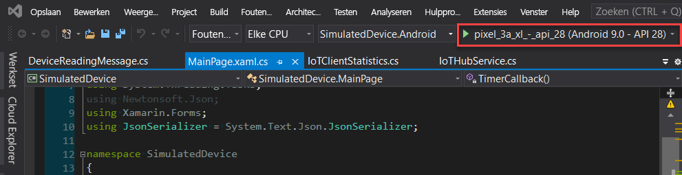
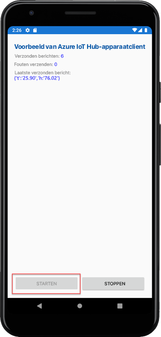

# <a name="quickstart-send-telemetry-from-a-device-to-an-iot-hub-xamarinforms"></a>Quickstart: Telemetrie verzenden van een apparaat naar een IoT-hub (Xamarin.Forms)

[!INCLUDE [iot-hub-quickstarts-1-selector](../../includes/iot-hub-quickstarts-1-selector.md)]

IoT Hub is een Azure-service waarmee grote hoeveelheden telemetrie van uw IoT-apparaten naar de cloud kunt opnemen voor opslag of verwerking. In dit artikel verzendt u telemetrie van een toepassing met een gesimuleerd apparaat naar IoT Hub. Vervolgens kunt u de gegevens bekijken vanuit een back-endtoepassing.

In dit artikel wordt gebruikgemaakt van een vooraf geschreven Xamarin.Forms-toepassing om de telemetrie te verzenden, en van een CLI-hulpprogramma om de telemetrie uit IoT Hub te lezen.

[!INCLUDE [cloud-shell-try-it.md](../../includes/cloud-shell-try-it.md)]

Als u nog geen abonnement op Azure hebt, maak dan een [gratis account](https://azure.microsoft.com/free/?WT.mc_id=A261C142F) aan voordat u begint.


## <a name="prerequisites"></a>Vereisten

- De voorbeeldcode downloaden uit [Azure-voorbeelden](https://github.com/Azure-Samples/azure-iot-samples-xamarin/archive/master.zip)

- De nieuwste versie van [Visual Studio 2019](https://visualstudio.microsoft.com/) of [Visual Studio voor Mac](https://visualstudio.microsoft.com/) met Xamarin.Forms-tooling geïnstalleerd. Deze quickstart is getest met Visual Studio 16.6.0.

- Zorg ervoor dat de poort 8883 is geopend in de firewall. In het apparaatvoorbeeld in deze quickstart wordt het MQTT-protocol gebruikt, dat communiceert via poort 8883. Deze poort is in sommige netwerkomgevingen van bedrijven en onderwijsinstellingen mogelijk geblokkeerd. Zie [Verbinding maken met IoT Hub (MQTT)](iot-hub-mqtt-support.md#connecting-to-iot-hub) voor meer informatie en manieren om dit probleem te omzeilen.

- Voer de volgende opdracht uit om de Microsoft Azure IoT-extensie voor Azure CLI aan uw CLI Shell-instantie toe te voegen. Met de IoT-extensie worden IoT Hub-, IoT Edge- en IoT DPS-specifieke (Device Provisioning Service) opdrachten toegevoegd aan Azure CLI.

   ```azurecli-interactive
   az extension add --name azure-iot
   ```

   [!INCLUDE [iot-hub-cli-version-info](../../includes/iot-hub-cli-version-info.md)]

## <a name="create-an-iot-hub"></a>Een IoT Hub maken

[!INCLUDE [iot-hub-include-create-hub](../../includes/iot-hub-include-create-hub.md)]

## <a name="register-a-device"></a>Een apparaat registreren

Een apparaat moet zijn geregistreerd bij uw IoT-hub voordat het verbinding kan maken. In deze snelstart gebruikt u Azure Cloud Shell om een gesimuleerd apparaat te registreren.

1. Voer de volgende opdrachten uit in Azure Cloud Shell om de apparaat-id te maken.

   **YourIoTHubName**: vervang deze tijdelijke aanduiding door een door u gekozen naam voor de IoT-hub.

   **myXamarinDevice**: dit is de naam van het apparaat dat u gaat registreren. Het is raadzaam om **myXamarinDevice** te gebruiken zoals wordt weergegeven. Als u een andere naam voor het apparaat kiest, moet u deze naam ook in de rest van dit artikel gebruiken, en moet u de apparaatnaam bijwerken in de voorbeeldtoepassingen voordat u deze uitvoert.

   ```azurecli-interactive
   az iot hub device-identity create --hub-name {YourIoTHubName} --device-id myXamarinDevice
   ```

1. Voer de volgende opdracht uit in Azure Cloud Shell om de _apparaatverbindingsreeks_ op te halen voor het apparaat dat u zojuist hebt geregistreerd:

   **YourIoTHubName**: vervang deze tijdelijke aanduiding door een door u gekozen naam voor de IoT-hub.

   ```azurecli-interactive
   az iot hub device-identity show-connection-string --hub-name {YourIoTHubName} --device-id myXamarinDevice --output table
   ```

   Noteer de apparaatverbindingsreeks. Deze ziet er ongeveer als volgt uit:

   `HostName={YourIoTHubName}.azure-devices.net;DeviceId=myXamarinDevice;SharedAccessKey={YourSharedAccessKey}`

    U gebruikt deze waarde verderop in de snelstart.

## <a name="send-simulated-telemetry"></a>Gesimuleerde telemetrie verzenden

De voorbeeldtoepassing wordt uitgevoerd onder Windows (via een UWP-app) een iOS-apparaat of -simulator en op een Android-apparaat of -simulator, dat verbinding maakt met een apparaatspecifiek eindpunt op uw IoT-hub en gesimuleerde temperatuur- en luchtvochtigheidstelemetrie verzendt. 

1. Open de voorbeeldwerkruimte in Visual Studio of Visual Studio voor Mac.
2. Vouw het project **SimulatedDevice** uit.  
3. Open **IoTHubService.cs** voor bewerking in Visual Studio. 
4. Zoek de variabele **_iotHubConnectionString** en werk de waarde bij met de apparaatverbindingsreeks die u eerder hebt genoteerd.
5. Sla uw wijzigingen op. 
6. Voer het project uit in de apparaatemulator of op een echt apparaat met de knop **Bouwen en uitvoeren** of de sneltoets **F5** onder Windows of **command+r** op een Mac. 

   

7. Wanneer de emulator wordt geopend, selecteert u **Start** in de voorbeeld-app.

In de volgende schermafbeelding ziet u voorbeelduitvoer van de gesimuleerde telemetrie die de toepassing naar uw IoT-hub verzendt: 

## <a name="read-the-telemetry-from-your-hub"></a>De telemetrie van uw hub lezen

De voorbeeld-app die u hebt uitgevoerd op de XCode-emulator toont gegevens over van het apparaat verzonden berichten. U kunt de gegevens ook via uw IoT-hub bekijken terwijl ze worden ontvangen. De IoT Hub CLI-extensie kan verbinding maken met het **Gebeurtenissen**-eindpunt aan de servicezijde van uw IoT Hub. De extensie ontvangt de berichten die van het gesimuleerde apparaat naar de cloud worden verzonden. Een back-endtoepassing van IoT Hub wordt meestal uitgevoerd in de cloud om berichten van apparaat naar cloud te ontvangen en verwerken.

Voer de volgende opdrachten uit in Azure Cloud Shell. Vervang daarbij `YourIoTHubName` door de naam van uw IoT-hub:

```azurecli-interactive
az iot hub monitor-events --device-id myXamarinDevice --hub-name {YourIoTHubName}
```

In de volgende schermafbeelding ziet u de uitvoer op het moment dat de extensie telemetriegegevens ontvangt die door het gesimuleerde apparaat naar de hub zijn verzonden:

De volgende schermafbeelding geeft het soort telemetrie weer dat u in uw lokale terminalvenster ziet: 

## <a name="clean-up-resources"></a>Resources opschonen

[!INCLUDE [iot-hub-quickstarts-clean-up-resources](../../includes/iot-hub-quickstarts-clean-up-resources.md)]

## <a name="next-steps"></a>Volgende stappen

In deze snelstart hebt u een IoT-hub ingesteld, een apparaat geregistreerd, gesimuleerde telemetrie verzonden naar de hub vanuit een Xamarin.Forms-toepassing en de telemetrie van de hub gelezen. 

Ga verder met de volgende snelstartgids als u wilt weten hoe u een gesimuleerd apparaat beheert vanuit een back-endtoepassing.

> [!div class="nextstepaction"]
> [Snelstart: Een apparaat beheren dat is verbonden met een IoT-hub](quickstart-control-device-node.md)
