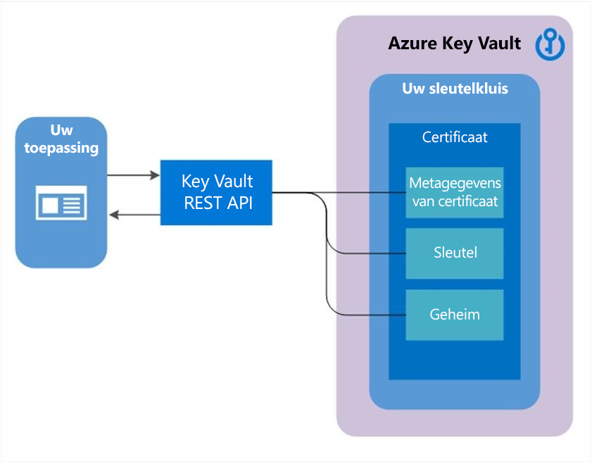

# Over sleutels, geheimen en certificaten

Met Azure Key Vault kunnen Microsoft Azure toepassingen en gebruikers verschillende soorten geheime/sleutel gegevens opslaan en gebruiken:

- Cryptografische sleutels: ondersteunt meerdere sleutel typen en-algoritmen, en maakt het gebruik van HSM (Hardware Security modules) mogelijk voor sleutels met een hoge waarde. 
- Geheimen: biedt beveiligde opslag van geheimen, zoals wacht woorden en database verbindings reeksen.
- Certificaten: ondersteunt certificaten, die zijn gebaseerd op sleutels en geheimen, en een functie voor automatische verlenging toevoegen.
- Azure Storage: kan sleutels van een Azure Storage account voor u beheren. Intern kunnen Key Vault met een Azure Storage-account (Sync) sleutels weer geven en de sleutels periodiek opnieuw genereren (draaien). 

Zie [Wat is Azure Key Vault?](/azure/key-vault/key-vault-overview) voor meer algemene informatie over Key Vault.

## Azure Key Vault

De volgende secties bevatten algemene informatie die van toepassing is op de implementatie van de Key Vault service.

### Ondersteunende standaarden

De specificaties van de JavaScript Object Notation (JSON) en het Java Script-object Sign en Encryption (JOSE) zijn belang rijke achtergrond informatie.  

-   [JSON-websleutel (JWK)](https://tools.ietf.org/html/draft-ietf-jose-json-web-key-41)  
-   [JSON-webencryptie (JWE)](https://tools.ietf.org/html/draft-ietf-jose-json-web-encryption-40)  
-   [JSON-webalgoritmen (JWA)](https://tools.ietf.org/html/draft-ietf-jose-json-web-algorithms-40)  
-   [JSON Web Signature (JWS)](https://tools.ietf.org/html/draft-ietf-jose-json-web-signature-41)  

### Gegevenstypen

Raadpleeg de JOSE-specificaties voor relevante gegevens typen voor sleutels, versleuteling en ondertekening.  

-   **algoritme** : een ondersteund algoritme voor een sleutel bewerking, bijvoorbeeld RSA1_5  
-   **gecodeerde** tekst-gecodeerde octetten, gecodeerd met Base64URL  
-   **Digest-value** : de uitvoer van een hash-algoritme, gecodeerd met Base64URL  
-   **sleutel-type** : een van de ondersteunde sleutel typen, bijvoorbeeld RSA (Rivest-Shamir-Adleman).  
-   **tekst zonder opmaak** : octetten met lees bare tekst, gecodeerd met Base64URL  
-   **hand tekening-waarde** -uitvoer van een handtekening algoritme, gecodeerd met Base64URL  
-   **base64URL** : een BASE64URL [RFC4648] gecodeerde binaire waarde  
-   **Booleaans** : waar of onwaar  
-   **Identiteit** : een identiteit van Azure Active Directory (Aad).  
-   **IntDate** : een JSON-decimale waarde waarmee het aantal seconden van 1970-01-01T0:0: 0Z UTC wordt weer gegeven tot de opgegeven UTC-datum/-tijd. Zie RFC3339 voor meer informatie over datum/tijd, in het algemeen en UTC in het bijzonder.  

### Objecten, id's en versie beheer

Objecten die zijn opgeslagen in Key Vault, worden geversiond wanneer er een nieuw exemplaar van een object wordt gemaakt. Aan elke versie wordt een unieke id en URL toegewezen. Wanneer een object voor het eerst wordt gemaakt, wordt er een unieke versie-id gegeven en als de huidige versie van het object gemarkeerd. Het maken van een nieuw exemplaar met dezelfde object naam geeft het nieuwe object een unieke versie-id, waardoor het de huidige versie wordt.  

Objecten in Key Vault kunnen worden geadresseerd met de huidige ID of een versie-specifieke id. Als er bijvoorbeeld een sleutel met de naam `MasterKey`is en het uitvoeren van bewerkingen met de huidige id ervoor zorgt dat het systeem de meest recente beschik bare versie gebruikt. Door bewerkingen uit te voeren met de versie-specifieke id wordt het systeem gebruikt die specifieke versie van het object.  

Objecten worden uniek geïdentificeerd binnen Key Vault met behulp van een URL. Er zijn geen twee objecten in het systeem die dezelfde URL hebben, ongeacht de geografische locatie. De volledige URL naar een object wordt de object-id genoemd. De URL bestaat uit een voor voegsel waarmee de Key Vault, het object type, de door de gebruiker ingevoerde object naam en een object versie worden geïdentificeerd. De object naam is hoofdletter gevoelig en onveranderbaar. Id's die de object versie niet bevatten, worden aangeduid als basis-Id's.  

Zie [verificatie, aanvragen en antwoorden](authentication-requests-and-responses.md) voor meer informatie.

Een object-id heeft de volgende algemene notatie:  

`https://{keyvault-name}.vault.azure.net/{object-type}/{object-name}/{object-version}`  

Waar:  

|||  
|-|-|  
|`keyvault-name`|De naam voor een sleutel kluis in de Microsoft Azure Key Vault-service.   Key Vault namen worden geselecteerd door de gebruiker en zijn wereld wijd uniek.   Key Vault naam moet een teken reeks van 3-24 zijn die alleen 0-9, a-z, A-Z en-bevat.|  
|`object-type`|Het type van het object, hetzij "sleutels" of "geheimen".|  
|`object-name`|Een `object-name` is een door de gebruiker ingevoerde naam voor en moet uniek zijn binnen een Key Vault. De naam moet een teken reeks van 1-127 zijn die alleen 0-9, a-z, A-Z en-bevat.|  
|`object-version`|Een `object-version` is een door het systeem gegenereerde 32 teken reeks-id die optioneel kan worden gebruikt * o-adres een unieke versie van een object.|  

## Key Vault sleutels

### Sleutels en sleutel typen

Cryptografische sleutels in Key Vault worden weer gegeven als JSON Web Key [JWK]-objecten. De basis-JWK/JWA-specificaties worden ook uitgebreid om sleutel typen die uniek zijn voor de Key Vault-implementatie in te scha kelen. Voor beelden van het importeren van sleutels met een HSM die specifiek is voor een leverancier, maakt het beveiligen van sleutels mogelijk die alleen kunnen worden gebruikt in Key Vault Hsm's.  

- **"Zachte" sleutels**: een sleutel die in software wordt verwerkt door Key Vault, maar is versleuteld met een systeem sleutel die zich in een HSM bevindt. Clients kunnen een bestaande RSA-of EC-sleutel (elliptische curve) importeren of een aanvraag indienen om er een te Key Vault genereren.
- **"Hard" sleutels**: een sleutel die is verwerkt in een HSM (Hardware Security module). Deze sleutels zijn beveiligd in een van de Key Vault HSM-beveiligings werelden (er is één beveiligings wereld per Geografie om isolatie te behouden). Clients kunnen een RSA-of EC-sleutel importeren in een zacht formulier of door vanaf een compatibel HSM-apparaat te exporteren. Clients kunnen ook Key Vault aanvragen om een sleutel te genereren. Met dit sleutel type voegt u het kenmerk key_hsm toe aan de JWK om het HSM-sleutel materiaal te kunnen dragen.

     Zie het [vertrouwens centrum van Microsoft Azure](https://azure.microsoft.com/support/trust-center/privacy/) voor meer informatie over geografische grenzen  

Key Vault ondersteunt alleen de sleutels RSA en elliptische curve. 

-   **EC**: "zacht" elliptische curve sleutel.
-   **EC-HSM**: "hard" elliptische curve sleutel.
-   **RSA**: ' soft ' RSA-sleutel.
-   **RSA-HSM**: "hard" RSA-sleutel.

Key Vault ondersteunt RSA-sleutels met een grootte van 2048, 3072 en 4096. Key Vault ondersteunt de sleutel typen elliptische curve P-256, P-384, P-521 en P-256 kB (SECP256K1).

### Cryptografische beveiliging

De cryptografische modules die Key Vault gebruikt, of HSM of software, FIPS (Federal Information Processing Standards) zijn gevalideerd. U hoeft niets te doen om uit te voeren in de FIPS-modus. Sleutels **die zijn gemaakt** of **GEÏMPORTEERD** als met HSM beveiligd, worden verwerkt in een HSM, gevalideerd op FIPS 140-2 level 2. Sleutels **die zijn gemaakt** of **geïmporteerd** als software-beveiligd, worden verwerkt in cryptografische modules die zijn gevalideerd voor FIPS 140-2 level 1. Zie [sleutels en sleutel typen](#keys-and-key-types)voor meer informatie.

###  EC-algoritmen
 De volgende algoritme-id's worden ondersteund met EC-en EC-HSM-sleutels in Key Vault. 

#### Curve typen

-   **P-256** -de NIST-curve p-256, gedefinieerd op [DSS FIPS pub 186-4](https://nvlpubs.nist.gov/nistpubs/FIPS/NIST.FIPS.186-4.pdf).
-   **P-256 KB** : de seconde curve SECP256K1, gedefinieerd op [SEC 2: aanbevolen elliptische domein parameters](https://www.secg.org/sec2-v2.pdf).
-   **P-384** -de NIST-curve p-384, gedefinieerd op [DSS FIPS pub 186-4](https://nvlpubs.nist.gov/nistpubs/FIPS/NIST.FIPS.186-4.pdf).
-   **P-521** -de NIST-curve p-521, gedefinieerd op [DSS FIPS pub 186-4](https://nvlpubs.nist.gov/nistpubs/FIPS/NIST.FIPS.186-4.pdf).

#### ONDERTEKENEN/CONTROLEREN

-   **ES256** -ECDSA voor SHA-256-samen vattingen en sleutels die zijn gemaakt met curve P-256. Dit algoritme wordt beschreven op [RFC7518](https://tools.ietf.org/html/rfc7518).
-   **ES256K** -ECDSA voor SHA-256-samen vattingen en sleutels gemaakt met bocht P-256 KB. Dit algoritme is in afwachting van de standaardisatie.
-   **ES384** -ECDSA voor SHA-384-samen vattingen en sleutels die zijn gemaakt met curve P-384. Dit algoritme wordt beschreven op [RFC7518](https://tools.ietf.org/html/rfc7518).
-   **ES512** -ECDSA voor SHA-512-samen vattingen en sleutels die zijn gemaakt met curve P-521. Dit algoritme wordt beschreven op [RFC7518](https://tools.ietf.org/html/rfc7518).

###  RSA-algoritmen  
 De volgende algoritme-id's worden ondersteund met RSA-en RSA-HSM-sleutels in Key Vault.  

#### WRAPKEY/SLEUTEL UITPAKKEN, VERSLEUTELEN/ONTSLEUTELEN

-   **RSA1_5** -RSAES-PKCS1-V1_5 [RFC3447] sleutel versleuteling  
-   **RSA-OAEP** -RSAES met behulp van optimale geocoderings opvulling (OAEP) [RFC3447], waarbij de standaard parameters worden opgegeven door RFC 3447 in sectie A. 2.1. Deze standaard parameters maken gebruik van een hash-functie van SHA-1 en een masker functie voor het genereren van MGF1 met SHA-1.  

#### ONDERTEKENEN/CONTROLEREN

-   **RS256** -ONDERTEKENINGSMETHODE RSASSA-PKCS-V1_5 met SHA-256. De waarde van de door de toepassing geleverde Digest moet worden berekend met SHA-256 en moet 32 bytes lang zijn.  
-   **RS384** -ONDERTEKENINGSMETHODE RSASSA-PKCS-V1_5 met SHA-384. De waarde van de door de toepassing geleverde Digest moet worden berekend met SHA-384 en moet 48 bytes lang zijn.  
-   **RS512** -ONDERTEKENINGSMETHODE RSASSA-PKCS-V1_5 met SHA-512. De waarde van de door de toepassing geleverde Digest moet worden berekend met SHA-512 en moet 64 bytes lang zijn.  
-   **RSNULL** -Zie [RFC2437], een gespecialiseerde use-case voor het inschakelen van bepaalde TLS-scenario's.  

###  Belang rijke bewerkingen

Key Vault ondersteunt de volgende bewerkingen op belang rijke objecten:  

-   **Maken**: Hiermee kan een client een sleutel maken in Key Vault. De waarde van de sleutel wordt gegenereerd door Key Vault en opgeslagen en wordt niet vrijgegeven aan de client. Er kunnen asymmetrische sleutels worden gemaakt in Key Vault.  
-   **Importeren**: een client kan een bestaande sleutel importeren in Key Vault. Asymmetrische sleutels kunnen worden geïmporteerd in Key Vault met behulp van een aantal verschillende pakket methoden in een JWK-constructie. 
-   **Update**: Hiermee staat u een client met voldoende machtigingen toe om de meta gegevens (sleutel kenmerken) te wijzigen die zijn gekoppeld aan een sleutel die eerder is opgeslagen in Key Vault.  
-   **Verwijderen**: Hiermee staat u een client met voldoende machtigingen toe om een sleutel uit Key Vault te verwijderen.  
-   **Lijst**: een client kan alle sleutels in een bepaalde Key Vault weer geven.  
-   **Lijst versies**: een client kan alle versies van een bepaalde sleutel in een bepaalde Key Vault weer geven.  
-   **Get**: Hiermee kan een client de open bare delen van een bepaalde sleutel in een Key Vault ophalen.  
-   **Backup**: exporteert een sleutel in een beveiligd formulier.  
-   **Herstellen**: Hiermee wordt een eerder gemaakte back-upsleutel geïmporteerd.  

Zie voor meer informatie [belang rijke bewerkingen in de referentie Key Vault rest API](/rest/api/keyvault).  

Zodra een sleutel is gemaakt in Key Vault, kunnen de volgende cryptografische bewerkingen worden uitgevoerd met behulp van de sleutel:  

-   **Ondertekenen en controleren**: alleen deze bewerking is ' Sign hash ' of ' verify hash ' omdat Key Vault geen ondersteuning biedt voor hashing van inhoud als onderdeel van het maken van een hand tekening. Toepassingen moeten de gegevens die lokaal worden ondertekend hashen en vervolgens aanvragen dat Key Vault de hash ondertekenen. Verificatie van ondertekende hashes wordt ondersteund als een gebruiks vriendelijke bewerking voor toepassingen die mogelijk geen toegang hebben tot het sleutel materiaal van [Public]. Controleer voor de beste toepassings prestaties of de bewerkingen lokaal worden uitgevoerd.  
-   **Sleutel versleuteling/-terugloop**: een sleutel die is opgeslagen in Key Vault kan worden gebruikt voor het beveiligen van een andere sleutel, meestal een symmetrische coderings sleutel voor inhoud (CEK). Wanneer de sleutel in Key Vault asymmetrisch is, wordt sleutel versleuteling gebruikt. RSA-OAEP en de WRAPKEY/sleutel uitpakken-bewerkingen zijn bijvoorbeeld gelijk aan versleutelen/ontsleutelen. Wanneer de sleutel in Key Vault symmetrisch is, wordt sleutel terugloop gebruikt. Bijvoorbeeld: AES-KW. De WRAPKEY-bewerking wordt ondersteund als gemak voor toepassingen die mogelijk geen toegang hebben tot het sleutel materiaal van [Public]. Voor de beste prestaties van toepassingen moeten WRAPKEY-bewerkingen lokaal worden uitgevoerd.  
-   **Versleutelen en ontsleutelen**: een sleutel die is opgeslagen in Key Vault kan worden gebruikt voor het versleutelen of ontsleutelen van één gegevens blok. De grootte van het blok wordt bepaald door het sleutel type en het geselecteerde versleutelings algoritme. De versleutelings bewerking is beschikbaar voor het gemak, voor toepassingen die mogelijk geen toegang tot het sleutel materiaal van [Public] hebben. Voor de beste prestaties van toepassingen moeten versleutelings bewerkingen lokaal worden uitgevoerd.  

Hoewel WRAPKEY/sleutel uitpakken met behulp van asymmetrische sleutels wellicht overbodig lijkt (omdat de bewerking gelijk is aan versleutelen/ontsleutelen), is het gebruik van afzonderlijke bewerkingen belang rijk. Het onderscheid biedt semantische en autorisatie schei ding van deze bewerkingen en consistentie wanneer andere sleutel typen door de service worden ondersteund.  

Key Vault biedt geen ondersteuning voor EXPORT bewerkingen. Zodra een sleutel is ingericht in het systeem, kan deze niet worden geëxtraheerd of het sleutel materiaal is gewijzigd. Gebruikers van Key Vault kunnen echter hun sleutel voor andere gebruiks voorbeelden vereisen, bijvoorbeeld nadat deze is verwijderd. In dit geval kunnen ze gebruikmaken van de back-up-en herstel bewerkingen voor het exporteren/importeren van de sleutel in een beveiligd formulier. Sleutels die zijn gemaakt met de back-upbewerking, kunnen niet buiten Key Vault worden gebruikt. De IMPORT bewerking kan ook worden gebruikt voor meerdere Key Vault exemplaren.  

Gebruikers kunnen de cryptografische bewerkingen die Key Vault ondersteunt per sleutel beperken met behulp van de eigenschap key_ops van het JWK-object.  

Zie [JSON Web Key (JWK) (Engelstalig)](https://tools.ietf.org/html/draft-ietf-jose-json-web-key-41)voor meer informatie over JWK-objecten.  

###  Sleutel kenmerken

Naast het sleutel materiaal kunnen de volgende kenmerken worden opgegeven. In een JSON-aanvraag zijn de kenmerken tref woord en accolades, {}} vereist, zelfs als er geen kenmerken zijn opgegeven.  

- *ingeschakeld*: Boole, optioneel, standaard waarde is **True**. Hiermee geeft u op of de sleutel is ingeschakeld en bruikbaar is voor cryptografische bewerkingen. Het kenmerk *enabled* wordt gebruikt in combi natie met *NBF* en *exp*. Wanneer een bewerking plaatsvindt tussen *NBF* en *exp*, wordt deze alleen toegestaan als *ingeschakeld* is ingesteld op **waar**. Bewerkingen buiten het venster *nbf* / *exp* worden automatisch niet toegestaan, met uitzonde ring van bepaalde bewerkings typen onder [bepaalde voor waarden](#date-time-controlled-operations).
- *NBF*: IntDate, optioneel, standaard is nu. Het kenmerk *NBF* (niet voor) geeft aan hoe lang de sleutel niet moet worden gebruikt voor cryptografische bewerkingen, met uitzonde ring van bepaalde typen bewerkingen onder [bepaalde voor waarden](#date-time-controlled-operations). Voor de verwerking van het *NBF* -kenmerk moet de huidige datum/tijd na of gelijk zijn aan de niet-voor-datum/-tijd die wordt vermeld in het *NBF* -kenmerk. Key Vault kan worden geboden voor sommige kleine Leeway, normaal gesp roken niet meer dan een paar minuten, om rekening te trekken met Clock scheefheid. De waarde moet een getal zijn dat een IntDate-waarde bevat.  
- *exp*: IntDate, optioneel, standaard is "permanent". Met het kenmerk *exp* (verval tijd) wordt de verval tijd van of waarna de sleutel mag niet worden gebruikt voor een cryptografische bewerking, behalve voor bepaalde typen bewerkingen onder [bepaalde voor waarden](#date-time-controlled-operations). Voor de verwerking van het kenmerk *exp* moet de huidige datum/tijd vóór de verval datum/-tijd van het kenmerk *exp* zijn. Key Vault kan worden geboden voor sommige kleine Leeway, meestal niet meer dan een paar minuten, om rekening te trekken met Clock scheefheid. De waarde moet een getal zijn dat een IntDate-waarde bevat.  

Er zijn aanvullende alleen-lezen kenmerken die zijn opgenomen in een antwoord dat sleutel kenmerken bevat:  

- *gemaakt*: IntDate, optioneel. Het kenmerk *gemaakt* geeft aan wanneer deze versie van de sleutel is gemaakt. De waarde is null voor sleutels die zijn gemaakt vóór het toevoegen van dit kenmerk. De waarde moet een getal zijn dat een IntDate-waarde bevat.  
- *bijgewerkt*: IntDate, optioneel. Het kenmerk *bijgewerkt* geeft aan wanneer deze versie van de sleutel is bijgewerkt. De waarde is null voor de sleutels die voor het laatst zijn bijgewerkt vóór het toevoegen van dit kenmerk. De waarde moet een getal zijn dat een IntDate-waarde bevat.  

Zie [gegevens typen](#data-types) voor meer informatie over IntDate en andere gegevens typen  

#### Datum-en tijd beheer bewerkingen

Nog geen geldige en verlopen sleutels, buiten het venster *nbf* / *exp* , werken voor **ontsleutelen**, **uitpakken**en **controleren** (niet 403, verboden). De reden voor het gebruik van de niet-geldige status is het toestaan dat een sleutel wordt getest voordat het productie gebruik wordt uitgevoerd. De motivering voor het gebruik van de verlopen status is het toestaan van herstel bewerkingen voor gegevens die zijn gemaakt toen de sleutel geldig was. U kunt ook de toegang tot een sleutel met behulp van Key Vault-beleid uitschakelen of door het *ingeschakelde* sleutel kenmerk op **Onwaar**bij te werken.

Zie [gegevens typen](#data-types)voor meer informatie over gegevens typen.

Zie de [JSON Web Key (JWK)](https://tools.ietf.org/html/draft-ietf-jose-json-web-key-41)voor meer informatie over andere mogelijke kenmerken.

### Sleutel Tags

U kunt aanvullende toepassingsspecifieke meta gegevens opgeven in de vorm van tags. Key Vault ondersteunt Maxi maal 15 Tags, die elk een 256-teken naam en een 256-teken waarde kunnen bevatten.  

>[!Note]
>Labels kunnen worden gelezen door een beller als ze de *lijst* of *machtiging* voor dat object type (sleutels, geheimen of certificaten) hebben.

###  Toegangsbeheer voor sleutels

Toegangs beheer voor sleutels die door Key Vault worden beheerd, wordt op het niveau van een Key Vault aangegeven dat fungeert als container met sleutels. Het toegangscontrole beleid voor sleutels verschilt van het toegangs beheer beleid voor geheimen in hetzelfde Key Vault. Gebruikers kunnen een of meer kluizen maken voor het bewaren van sleutels en zijn vereist voor het bijhouden van de juiste segmentatie en het beheer van sleutels. Toegangs beheer voor sleutels is onafhankelijk van toegangs beheer voor geheimen.  

De volgende machtigingen kunnen worden toegekend, op basis van gebruikers-en service-principals, in de toegangscontrole vermelding voor sleutels op een kluis. Deze machtigingen spie gelen de bewerkingen die zijn toegestaan voor een sleutel object.  Het verlenen van toegang aan een Service-Principal in de sleutel kluis is een eenmalige-bewerking. deze blijft hetzelfde voor alle Azure-abonnementen. U kunt deze gebruiken om zoveel certificaten te implementeren als u wilt. 

- Machtigingen voor sleutel beheer bewerkingen
  - *ophalen*: het open bare gedeelte van een sleutel en de bijbehorende kenmerken lezen
  - *lijst*: een lijst met de sleutels of versies van een sleutel die is opgeslagen in een sleutel kluis
  - *Update*: de kenmerken voor een sleutel bijwerken
  - *maken*: nieuwe sleutels maken
  - *importeren*: een sleutel importeren in een sleutel kluis
  - *verwijderen*: het sleutel object verwijderen
  - *herstellen*: een verwijderde sleutel herstellen
  - *back-up*: back-up maken van een sleutel in een sleutel kluis
  - *herstellen*: een back-up van een sleutel herstellen naar een sleutel kluis

- Machtigingen voor cryptografische bewerkingen
  - *ontsleutelen*: de sleutel voor het opheffen van de beveiliging van een reeks bytes gebruiken
  - *versleutelen*: de sleutel gebruiken voor het beveiligen van een wille keurige reeks bytes
  - *sleutel uitpakken*: gebruik de-sleutel voor het opheffen van de beveiliging van verpakte symmetrische sleutels
  - *wrapKey*: de sleutel gebruiken voor het beveiligen van een symmetrische sleutel
  - *controleren*: de sleutel gebruiken om samen vattingen te controleren  
  - *ondertekenen*: de sleutel gebruiken om samen vattingen te ondertekenen
    
- Machtigingen voor bevoegde bewerkingen
  - *leegmaken*: een verwijderde sleutel leegmaken (permanent verwijderen)

Voor meer informatie over het werken met sleutels raadpleegt u [belang rijke bewerkingen in de naslag informatie over Key Vault rest API](/rest/api/keyvault). Zie voor meer informatie over het instellen van machtigingen [-kluizen-maken of bijwerken](/rest/api/keyvault/vaults/createorupdate) en [kluizen-toegangs beleid bijwerken](/rest/api/keyvault/vaults/updateaccesspolicy). 

## Key Vault geheimen 

### Werken met geheimen

Vanuit het oogpunt van een ontwikkelaar Key Vault Api's accepteren en geheime waarden retour neren als teken reeksen. Intern worden geheimen door Key Vault opgeslagen en beheerd als reeksen van octetten (8-bits bytes), met een maximale grootte van 25k bytes. De Key Vault-service biedt geen semantiek voor geheimen. Alleen de gegevens worden geaccepteerd, versleuteld, opgeslagen en een geheime id (' id ') wordt geretourneerd. De id kan worden gebruikt om het geheim op een later tijdstip op te halen.  

Voor zeer gevoelige gegevens moeten clients extra beveiligings lagen voor gegevens overwegen. Het versleutelen van gegevens met behulp van een afzonderlijke beveiligings sleutel vóór opslag in Key Vault is een voor beeld.  

Key Vault biedt ook ondersteuning voor een veld Content type voor geheimen. Clients kunnen het inhouds type van een geheim opgeven om te helpen bij het interpreteren van de geheime gegevens wanneer deze worden opgehaald. De maximale lengte van dit veld is 255 tekens. Er zijn geen vooraf gedefinieerde waarden. Het voorgestelde gebruik is als hint voor het interpreteren van de geheime gegevens. Een implementatie kan bijvoorbeeld beide wacht woorden en certificaten opslaan als geheimen en vervolgens dit veld gebruiken om onderscheid te maken. Er zijn geen vooraf gedefinieerde waarden.  

### Geheime kenmerken

Naast de geheime gegevens kunnen de volgende kenmerken worden opgegeven:  

- *exp*: IntDate, optioneel, standaard waarde is **permanent**. Met het kenmerk *exp* (verval tijd) geeft u de verval tijd op of waarna de geheime gegevens niet moeten worden opgehaald, behalve in [bepaalde situaties](#date-time-controlled-operations). Dit veld is alleen ter **informatie** bedoeld omdat gebruikers van de sleutel kluis service informeert dat een bepaald geheim niet mag worden gebruikt. De waarde moet een getal zijn dat een IntDate-waarde bevat.   
- *NBF*: IntDate, optioneel, standaard is **nu**. Het kenmerk *NBF* (niet voor voor) geeft aan hoe lang de geheime gegevens niet moeten worden opgehaald, behalve in het [geval van bepaalde situaties](#date-time-controlled-operations). Dit veld is alleen ter **informatie** bedoeld. De waarde moet een getal zijn dat een IntDate-waarde bevat. 
- *ingeschakeld*: Boole, optioneel, standaard waarde is **True**. Dit kenmerk geeft aan of de geheime gegevens kunnen worden opgehaald. Het kenmerk enabled wordt gebruikt in combi natie met *NBF* en *exp* wanneer een bewerking plaatsvindt tussen *NBF* en *exp*, maar is alleen toegestaan als ingeschakeld is ingesteld op **waar**. Bewerkingen buiten het venster *NBF* en *exp* worden automatisch niet toegestaan, behalve in [bepaalde situaties](#date-time-controlled-operations).  

Er zijn aanvullende alleen-lezen kenmerken die zijn opgenomen in een antwoord dat geheime kenmerken bevat:  

- *gemaakt*: IntDate, optioneel. Het kenmerk gemaakt geeft aan wanneer deze versie van het geheim is gemaakt. Deze waarde is null voor geheimen die zijn gemaakt vóór het toevoegen van dit kenmerk. De waarde moet een getal zijn dat een IntDate-waarde bevat.  
- *bijgewerkt*: IntDate, optioneel. Het kenmerk bijgewerkt geeft aan wanneer deze versie van het geheim is bijgewerkt. Deze waarde is null voor geheimen die voor het laatst zijn bijgewerkt vóór het toevoegen van dit kenmerk. De waarde moet een getal zijn dat een IntDate-waarde bevat.

#### Datum-en tijd beheer bewerkingen

De **Get** -bewerking van een geheim werkt voor niet-geldige en verlopen geheimen, buiten het venster *NBF* / *exp* . Het aanroepen van de **Get** -bewerking van een geheim voor een niet-geldig geheim, kan worden gebruikt voor test doeleinden. Het**ophalen (** afmaken) van een verlopen geheim dat kan worden gebruikt voor herstel bewerkingen.

Zie [gegevens typen](#data-types)voor meer informatie over gegevens typen.  

### Toegangsbeheer voor geheimen

Access Control voor geheimen die worden beheerd in Key Vault, wordt op het niveau van de Key Vault die deze geheimen bevat, vermeld. Het toegangs beheer beleid voor geheimen verschilt van het toegangs beheer beleid voor sleutels in dezelfde Key Vault. Gebruikers kunnen een of meer kluizen maken om geheimen te bewaren en zijn vereist voor het bijhouden van de juiste segmentatie en het beheer van geheimen.   

De volgende machtigingen kunnen per principal worden gebruikt, in de toegangscontrole vermelding geheimen in een kluis en de bewerkingen die zijn toegestaan voor een geheim object, nauw keurig spie gelen:  

- Machtigingen voor geheime beheer bewerkingen
  - *ophalen*: een geheim lezen  
  - *lijst*: vermeld de geheimen of versies van een geheim dat is opgeslagen in een Key Vault  
  - *instellen*: een geheim maken  
  - *verwijderen*: een geheim verwijderen  
  - *herstellen*: een verwijderd geheim herstellen
  - *Backup*: een back-up maken van een geheim in een sleutel kluis
  - *herstellen*: een back-up van een geheim naar een sleutel kluis herstellen

- Machtigingen voor bevoegde bewerkingen
  - *opschonen*: leegmaken (permanent verwijderen) een verwijderd geheim

Zie voor meer informatie over het werken met geheimen [geheime bewerkingen in de naslag informatie over Key Vault rest API](/rest/api/keyvault). Zie voor meer informatie over het instellen van machtigingen [-kluizen-maken of bijwerken](/rest/api/keyvault/vaults/createorupdate) en [kluizen-toegangs beleid bijwerken](/rest/api/keyvault/vaults/updateaccesspolicy). 

### Geheime Tags  
U kunt aanvullende toepassingsspecifieke meta gegevens opgeven in de vorm van tags. Key Vault ondersteunt Maxi maal 15 Tags, die elk een 256-teken naam en een 256-teken waarde kunnen bevatten.  

>[!Note]
>Labels kunnen worden gelezen door een beller als ze de *lijst* of *machtiging* voor dat object type (sleutels, geheimen of certificaten) hebben.

## Key Vault certificaten

Key Vault ondersteuning voor certificaten voorziet in het beheer van uw x509-certificaten en het volgende gedrag:  

-   Hiermee kan een certificaat eigenaar een certificaat maken met behulp van een Key Vault aanmaak proces of door middel van het importeren van een bestaand certificaat. Bevat zowel zelf-ondertekende als door de certificerings instantie gegenereerde certificaten.
-   Hiermee kan een Key Vault eigenaar van het certificaat beveiligde opslag en beheer van x509-certificaten implementeren zonder interactie met persoonlijke-sleutel materiaal.  
-   Hiermee kan een certificaat eigenaar een beleid maken dat Key Vault doorstuurt om de levens cyclus van een certificaat te beheren.  
-   Staat eigen aren van certificaten toe om contact gegevens op te geven voor meldingen over levenscyclus gebeurtenissen van de verval datum en verlenging van het certificaat.  
-   Ondersteunt automatische verlenging met geselecteerde verleners-Key Vault partner x509-certificaat providers/certificerings instanties.

>[!Note]
>Providers/instanties zonder partner zijn ook toegestaan, maar bieden geen ondersteuning voor de functie voor automatisch verlengen.

### Samen stelling van een certificaat

Wanneer er een Key Vault certificaat wordt gemaakt, worden er ook een adresseer bare sleutel en een geheim gemaakt met dezelfde naam. Met de Key Vault sleutel kunnen sleutel bewerkingen en het Key Vault geheim ophalen van de certificaat waarde als geheim toestaan. Een Key Vault certificaat bevat ook open bare meta gegevens voor x509-certificaten.  

De id en de versie van certificaten zijn vergelijkbaar met die van sleutels en geheimen. Een specifieke versie van een adresseer bare sleutel en geheim dat is gemaakt met de Key Vault certificaat versie is beschikbaar in het Key Vault certificaat antwoord.
 

### Exporteer bare of niet-Exporteer bare sleutel

Wanneer een Key Vault certificaat wordt gemaakt, kan het worden opgehaald uit het adresseer bare geheim met de persoonlijke sleutel in de PFX-of PEM-indeling. Het beleid dat wordt gebruikt voor het maken van het certificaat moet aangeven dat de sleutel exporteerbaar is. Als het beleid aangeeft dat het niet kan worden geëxporteerd, is de persoonlijke sleutel geen onderdeel van de waarde wanneer deze wordt opgehaald als geheim.  

De adresseer bare sleutel wordt relevanter voor niet-Exporteer bare KV-certificaten. De adresseer bare KV-sleutel bewerkingen zijn toegewezen in het veld sleutel *gebruik* van het KV-certificaat beleid dat wordt gebruikt om het KV-certificaat te maken.  

Er worden twee typen sleutels ondersteund: *RSA* of *RSA HSM* met certificaten. Exporteerbaar is alleen toegestaan met RSA, niet ondersteund door RSA HSM.  

### Certificaat kenmerken en-Tags

Naast de meta gegevens van het certificaat, een adresseer bare sleutel en een adresseerbaar geheim, een Key Vault-certificaat bevat ook kenmerken en tags.  

#### Kenmerken

De certificaat kenmerken worden gespiegeld met kenmerken van de adresseer bare sleutel en het geheim dat is gemaakt wanneer het KV-certificaat wordt gemaakt.  

Een Key Vault certificaat heeft de volgende kenmerken:  

-   *ingeschakeld*: Boole, optioneel, standaard waarde is **True**. Kan worden opgegeven om aan te geven of de certificaat gegevens kunnen worden opgehaald als geheim of bruikbaar als sleutel. Wordt ook gebruikt in combi natie met *NBF* en *exp* wanneer er een bewerking plaatsvindt tussen *NBF* en *exp*, en zal alleen worden toegestaan als ingeschakeld is ingesteld op waar. Bewerkingen buiten het venster *NBF* en *exp* worden automatisch niet toegestaan.  

Er zijn aanvullende alleen-lezen kenmerken die zijn opgenomen in het antwoord:

-   *gemaakt*: IntDate: geeft aan wanneer deze versie van het certificaat is gemaakt.  
-   *bijgewerkt*: IntDate: geeft aan wanneer deze versie van het certificaat is bijgewerkt.  
-   *exp*: IntDate: bevat de waarde van de verval datum van het x509-certificaat.  
-   *NBF*: IntDate: bevat de waarde van de datum van het x509-certificaat.  

> [!Note] 
> Als een Key Vault certificaat verloopt, is de adresseer bare sleutel en het geheim niet meer bruikbaar.  

#### Tags

 Opgegeven Dictionary van sleutel waarde-paren van client, vergelijkbaar met tags in sleutels en geheimen.  

 > [!Note]
> Labels kunnen worden gelezen door een beller als ze de *lijst* of *machtiging* voor dat object type (sleutels, geheimen of certificaten) hebben.

### Certificaat beleid

Een certificaat beleid bevat informatie over het maken en beheren van de levens cyclus van een Key Vault certificaat. Wanneer een certificaat met een persoonlijke sleutel wordt geïmporteerd in de sleutel kluis, wordt een standaard beleid gemaakt door het x509-certificaat te lezen.  

Wanneer een volledig Key Vault certificaat wordt gemaakt, moet er een beleid worden opgegeven. Het beleid bepaalt hoe u deze Key Vault certificaat versie maakt, of de volgende Key Vault certificaat versie. Als er een beleid is ingesteld, is het niet vereist voor opeenvolgende nieuwe bewerkingen voor toekomstige versies. Er is slechts één exemplaar van een beleid voor alle versies van een Key Vault certificaat.  

Op hoog niveau bevat een certificaat beleid de volgende informatie:  

-   X509-certificaat eigenschappen: bevat onderwerpnaam, alternatieve naam voor onderwerp en andere eigenschappen die worden gebruikt voor het maken van een x509-certificaat aanvraag.  
-   Sleutel eigenschappen: bevat sleutel type, sleutel lengte, exporteerbaar en het opnieuw gebruiken van sleutel velden. Met deze velden wordt de sleutel kluis geïnstrueerd om een sleutel te genereren.  
-   Geheime eigenschappen: bevat geheime eigenschappen, zoals het inhouds type van adresseer bare geheim om de geheime waarde te genereren, voor het ophalen van een certificaat als geheim.  
-   Levensduur acties: bevat levensduur acties voor het KV-certificaat. Elke levensduur actie bevat:  

     - Trigger: opgegeven via dagen vóór het verloop of het percentage van de levens duur  

     - Actie: type actie opgeven – *emailContacts* of *autorenew*  

-   Verlener: para meters over de certificaat verlener die moet worden gebruikt om x509-certificaten uit te geven.  
-   Beleids kenmerken: bevat kenmerken die zijn gekoppeld aan het beleid  

#### X509-toewijzing van Key Vault gebruik

De volgende tabel geeft de toewijzing van het beleid voor x509-sleutel gebruik aan voor efficiënte sleutel bewerkingen van een sleutel die is gemaakt als onderdeel van het maken van een Key Vault certificaat.

|**Gebruiks vlaggen voor x509-sleutel**|**Key Vault Key OPS**|**Standaard gedrag**|
|----------|--------|--------|
|DataEncipherment|versleutelen, ontsleutelen| N/A |
|DecipherOnly|crypto| N/A  |
|DigitalSignature|ondertekenen, controleren| Key Vault standaard zonder een gebruiks specificatie op het moment van aanmaken van het certificaat | 
|EncipherOnly|encrypt| N/A |
|KeyCertSign|ondertekenen, controleren|N/A|
|KeyEncipherment|wrapKey, sleutel uitpakken| Key Vault standaard zonder een gebruiks specificatie op het moment van aanmaken van het certificaat | 
|Authentic|ondertekenen, controleren| N/A |
|crlsign|ondertekenen, controleren| N/A |

### Certificaat verlener

Een Key Vault certificaat object bevat een configuratie die wordt gebruikt om te communiceren met een geselecteerde certificaat verlener-provider om x509-certificaten te best Ellen.  

-   Key Vault partners met de volgende certificaat verleners voor SSL-certificaten

|**Provider naam**|**Locaties**|
|----------|--------|
|DigiCert|Ondersteund in alle sleutel kluis service locaties in de open bare Cloud en Azure Government|
|GlobalSign|Ondersteund in alle sleutel kluis service locaties in de open bare Cloud en Azure Government|

Voordat een certificaat uitgever kan worden gemaakt in een Key Vault, moeten de volgende stappen 1 en 2 worden uitgevoerd.  

1. Onboarding voor certificerings instanties (CA)  

    -   Een beheerder van de organisatie moet het bedrijf (bijvoorbeeld Contoso) met ten minste één CA-provider.  

2. Beheerder maakt referenties voor de aanvrager van Key Vault om SSL-certificaten in te schrijven (en te vernieuwen)  

    -   Biedt de configuratie die moet worden gebruikt voor het maken van een uitgevers object van de provider in de sleutel kluis  

Zie de [blog Key Vault certificaten](https://aka.ms/kvcertsblog) voor meer informatie over het maken van uitgevers objecten van de portal certificaten.  

Key Vault maakt het mogelijk meerdere uitgevers objecten te maken met een andere provider configuratie voor de verlener. Zodra een object van de verlener is gemaakt, kan de naam ervan in een of meer certificaat beleidsregels worden verwezen. Als u verwijst naar het Issuer-object, wordt Key Vault het gebruik van configuratie zoals opgegeven in het Issuer-object te gebruiken bij het aanvragen van het x509-certificaat van de CA-provider tijdens het maken en vernieuwen van het certificaat.  

Uitgevers objecten worden in de kluis gemaakt en kunnen alleen worden gebruikt met KV-certificaten in dezelfde kluis.  

### Certificaat contactpersonen

Certificaat contactpersonen bevatten contact gegevens om meldingen te verzenden die worden geactiveerd door de levens duur van het certificaat. De gegevens van de contact persoon worden gedeeld door alle certificaten in de sleutel kluis. Er wordt een melding verzonden naar alle opgegeven contact personen voor een gebeurtenis voor een certificaat in de sleutel kluis.  

Als het beleid van een certificaat is ingesteld op automatisch verlengen, wordt er een melding verzonden naar de volgende gebeurtenissen.  

- Vóór het vernieuwen van het certificaat
- Na het vernieuwen van het certificaat, met de mede deling dat het certificaat is vernieuwd of dat er een fout is opgetreden, moet het certificaat hand matig worden vernieuwd.  

  Wanneer een certificaat beleid dat is ingesteld op hand matig wordt vernieuwd (alleen e-mail), wordt er een melding verzonden wanneer het certificaat wordt vernieuwd.  

### Certificaat Access Control

 Toegangs beheer voor certificaten wordt beheerd door Key Vault en wordt gegeven door de Key Vault die de certificaten bevat. Het toegangscontrole beleid voor certificaten verschilt van het toegangs beheer beleid voor sleutels en geheimen in hetzelfde Key Vault. Gebruikers kunnen een of meer kluizen maken voor het bewaren van certificaten, voor het bijhouden van de juiste segmentatie en het beheer van certificaten.  

 De volgende machtigingen kunnen per principal worden gebruikt, in de toegangscontrole vermelding geheimen in een sleutel kluis en komt overeen met de bewerkingen die zijn toegestaan voor een geheim object:  

- Machtigingen voor certificaat beheer bewerkingen
  - *ophalen*: de huidige certificaat versie of een versie van een certificaat ophalen 
  - *lijst*: de huidige certificaten of versies van een certificaat weer geven  
  - *bijwerken*: een certificaat bijwerken
  - *maken*: een Key Vault-certificaat maken
  - *importeren*: certificaat materiaal importeren in een Key Vault certificaat
  - *verwijderen*: een certificaat, het bijbehorende beleid en alle versies ervan verwijderen  
  - *herstellen*: een verwijderd certificaat herstellen
  - *back-up*: een back-up maken van een certificaat in een sleutel kluis
  - *herstellen*: een back-up van een certificaat herstellen naar een sleutel kluis
  - *managecontacts*: Key Vault certificaat contactpersonen beheren  
  - *manageissuers*: Key Vault certificerings instanties/verleners beheren
  - *getissuers*: de autoriteiten/verleners van een certificaat ophalen
  - *listissuers*: de autoriteiten/verleners van een certificaat weer geven  
  - *setissuers*: de autoriteiten/verleners van een Key Vault certificaat maken of bijwerken  
  - *deleteissuers*: de instanties/verleners van een Key Vault certificaat verwijderen  
 
- Machtigingen voor bevoegde bewerkingen
  - *opschonen*: een verwijderd certificaat leegmaken (permanent verwijderen)

Zie voor meer informatie de [certificaat bewerkingen in de naslag informatie over Key Vault rest API](/rest/api/keyvault). Zie voor meer informatie over het instellen van machtigingen [-kluizen-maken of bijwerken](/rest/api/keyvault/vaults/createorupdate) en [kluizen-toegangs beleid bijwerken](/rest/api/keyvault/vaults/updateaccesspolicy).

## Sleutel beheer van Azure Storage account

Key Vault kunt sleutels van Azure Storage-account beheren:

- Intern kunnen Key Vault een lijst met sleutels (Sync) met een Azure-opslag account. 
- Key Vault de sleutels regel matig opnieuw genereren (roteert).
- Sleutel waarden worden nooit geretourneerd als antwoord op de aanroeper.
- Key Vault beheert sleutels van zowel opslag accounts als klassieke opslag accounts.

Zie [Azure Key Vault-opslag account sleutels](key-vault-ovw-storage-keys.md) voor meer informatie.

### Toegangs beheer voor opslag accounts

De volgende machtigingen kunnen worden gebruikt voor het autoriseren van een gebruiker of toepassings-principal voor het uitvoeren van bewerkingen op een beheerd opslag account:  

- Machtigingen voor beheerde opslag accounts en SaS-definitie bewerkingen
  - *ophalen*: Hiermee wordt informatie over een opslag account opgehaald 
  - *lijst*: opslag accounts weer geven die worden beheerd door een Key Vault
  - *bijwerken*: een opslag account bijwerken
  - *verwijderen*: een opslag account verwijderen  
  - *herstellen*: een verwijderd opslag account herstellen
  - *back-up*: back-up maken van een opslag account
  - *herstellen*: een back-up van een opslag account terugzetten naar een Key Vault
  - *instellen*: een opslag account maken of bijwerken
  - *regeneratekey*: een opgegeven sleutel waarde voor een opslag account opnieuw genereren
  - *getsas*: informatie over een SAS-definitie voor een opslag account ophalen
  - *listsas*: SAS-definities voor opslag accounts weer geven
  - *deletesas*: een SAS-definitie uit een opslag account verwijderen
  - *setsas*: een nieuwe SAS-definitie/kenmerken voor een opslag account maken of bijwerken

- Machtigingen voor bevoegde bewerkingen
  - *opschonen*: een beheerd opslag Account leegmaken (definitief verwijderen)

Zie voor meer informatie de [bewerkingen voor opslag accounts in de naslag informatie over Key Vault rest API](/rest/api/keyvault). Zie voor meer informatie over het instellen van machtigingen [-kluizen-maken of bijwerken](/rest/api/keyvault/vaults/createorupdate) en [kluizen-toegangs beleid bijwerken](/rest/api/keyvault/vaults/updateaccesspolicy).

## Zie ook

- [Verificatie, aanvragen en antwoorden](authentication-requests-and-responses.md)
- [Gids voor Key Vault-ontwikkelaars](/azure/key-vault/key-vault-developers-guide)
