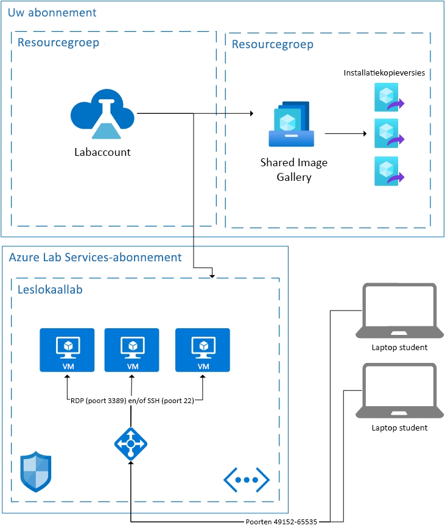

# Basisprincipes van architectuur in Azure Lab Services

Azure Lab Services is een SaaS-oplossing (Software as a Service), wat betekent dat de resources die nodig zijn voor Lab Services voor u worden afgehandeld. Dit artikel gaat over de fundamentele resources die worden gebruikt door Lab Services en over de basisarchitectuur van een lab.  

Azure Lab Services biedt een aantal gebieden waarmee u uw eigen resources in combinatie met Lab Services kunt gebruiken.  Zie [How to peer a Virtual Network](how-to-connect-peer-virtual-network.md) (Een virtueel netwerk koppelen) voor meer informatie over het gebruik van VM's op uw eigen netwerk.  Zie [How to attach a Shared Image Gallery](how-to-attach-detach-shared-image-gallery.md) (Een Shared Image Gallery toevoegen) als u installatiekopieën uit een Shared Image Gallery wilt hergebruiken.

Hieronder vindt u de basisarchitectuur van een leslokaallab.  Het labaccount wordt in uw abonnement gehost. De VM's van studenten worden samen met de resources die nodig zijn om de VM's te ondersteunen, in een abonnement van Lab Services gehost. Laten we eens wat dieper ingaan op de inhoud van Lab Services-abonnementen.

## Gehoste resources

De resources die nodig zijn voor het uitvoeren van een leslokaallab worden gehost in een van de door Microsoft beheerde Azure-abonnementen.  Resources omvatten een sjabloon-VM voor de docent, een VM voor elke student en netwerkitems, zoals een load balancer, een virtueel netwerk en een netwerkbeveiligingsgroep.  Deze abonnementen worden op verdachte activiteiten gecontroleerd.  Het is belangrijk om te weten dat deze bewaking extern op de virtuele machines wordt uitgevoerd via VM-extensie of netwerkpatroonbewaking.  Als [afsluiten wanneer de verbinding is verbroken](how-to-enable-shutdown-disconnect.md) is ingeschakeld, wordt een diagnostische uitbreiding op de virtuele machine ingeschakeld. Middels deze uitbreiding wordt Lab Services geïnformeerd dat de RDP-sessie (remote desktop protocol) is verbroken.

## Virtual Network

Elk lab wordt geïsoleerd door zijn eigen virtuele netwerk.  Als het lab een [gekoppeld virtueel netwerk](how-to-connect-peer-virtual-network.md) heeft, dan wordt elk lab door zijn eigen subnet geïsoleerd.  Studenten maken via een load balancer verbinding met hun virtuele machine.  Virtuele machines van studenten hebben geen openbaar IP-adres, ze hebben alleen een privé IP-adres.  De verbindingsreeks voor de student is het openbare IP-adres van de load balancer en een willekeurige poort tussen 49152 en 65535.  Afhankelijk van het besturingssysteem schakelen binnenkomende regels op de load balancer de verbinding naar poort 22 (SSH) of poort 3389 (RDP) van de juiste virtuele machine door. Een netwerkbeveiligingsgroep voorkomt buitenverkeer op andere poorten.

## Toegangsbeheer voor de virtuele machines

Met Lab Services kunnen studenten acties zoals starten en stoppen op hun virtuele machine uitvoeren.  Lab Services beheert ook de toegang tot de gegevens van hun VM-verbinding.

Lab Services regelt daarnaast de registratie van studenten bij de service. Er zijn momenteel twee verschillende toegangsinstellingen: beperkt en niet-beperkt. Zie voor meer informatie het artikel [manage lab users](how-to-configure-student-usage.md#send-invitations-to-users) (labgebruikers beheren). Beperkte toegang houdt in dat Lab Services verifieert of de studenten als gebruiker worden toegevoegd voordat ze toegang krijgen. Onbeperkt betekent dat elke gebruiker zich kan registreren zolang hij de registratiekoppeling heeft en er capaciteit is in het lab. Onbeperkt kan handig zijn voor hackathons.

Studenten-VM's die in het leslokaallab worden gehost, hebben een gebruikersnaam en wachtwoord die zijn ingesteld door de maker van het lab.  De maker van het lab kan de geregistreerde studenten ook toestaan hun eigen wachtwoord te kiezen bij de eerste aanmelding.  

## Volgende stappen

Zie [Azure Lab Services concepts](classroom-labs-concepts.md) (Azure Lab Services-concepten) en [Azure Lab Services overview](classroom-labs-overview.md) (Overzicht van Azure Lab Services) voor meer informatie over de functies van Lab Services.
