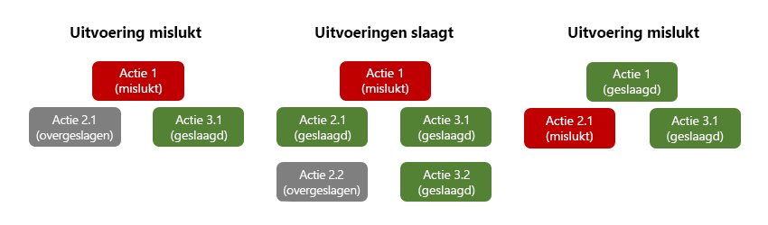
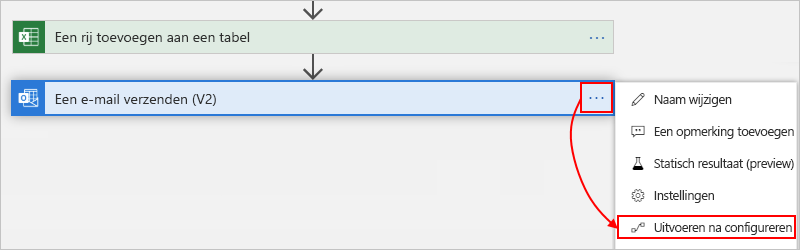
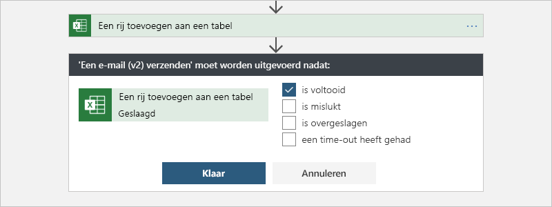
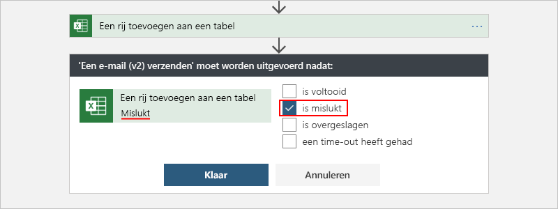
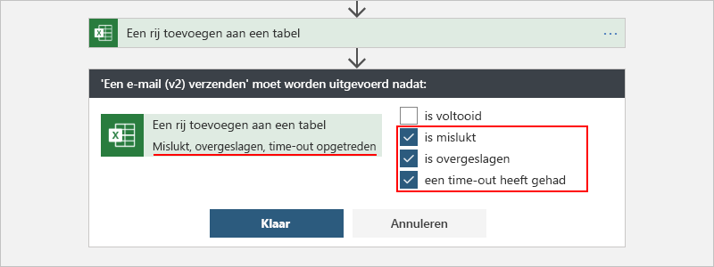

# <a name="handle-errors-and-exceptions-in-azure-logic-apps"></a>Fouten en uitzonde ringen in Azure Logic Apps afhandelen

De manier waarop elke integratie architectuur op de juiste wijze downtime of problemen verwerkt die door afhankelijke systemen worden veroorzaakt, kan een uitdaging vormen. Logic Apps biedt een topervaring voor het afhandelen van fouten en uitzonde ringen, om u te helpen bij het maken van robuuste en robuuste integraties die problemen en storingen op de juiste manier afhandelen.

<a name="retry-policies"></a>

## <a name="retry-policies"></a>Beleid voor opnieuw proberen

Voor de meest eenvoudige uitzonde ring en fout afhandeling kunt u een *beleid voor opnieuw proberen* gebruiken in elke actie of trigger waarbij wordt ondersteund, bijvoorbeeld [http-actie](../logic-apps/logic-apps-workflow-actions-triggers.md#http-trigger). Met een beleid voor opnieuw proberen wordt aangegeven of en hoe de actie of de trigger een aanvraag opnieuw probeert wanneer de oorspronkelijke aanvraag een time-out heeft of mislukt. Dit is een aanvraag die resulteert in een 408-, 429-of 5xx-antwoord. Als er geen ander beleid voor opnieuw proberen wordt gebruikt, wordt het standaard beleid gebruikt.

Dit zijn de beleids typen voor opnieuw proberen:

| Type | Beschrijving |
|------|-------------|
| **Standaard** | Met dit beleid worden Maxi maal vier nieuwe pogingen verzonden met *exponentieel toenemende* intervallen. deze worden geschaald op 7,5 seconden, maar worden tussen 5 en 45 seconden gelimiteerd. |
| **Exponentieel interval**  | Dit beleid wacht een wille keurig interval dat is geselecteerd uit een exponentieel groeiend bereik voordat de volgende aanvraag wordt verzonden. |
| **Vast interval**  | Met dit beleid wordt het opgegeven interval gewacht voordat de volgende aanvraag wordt verzonden. |
| **Geen**  | De aanvraag niet opnieuw verzenden. |
|||

Zie [Logic apps limieten en configuratie](../logic-apps/logic-apps-limits-and-config.md#request-limits)voor meer informatie over limieten voor het beleid voor opnieuw proberen.

### <a name="change-retry-policy"></a>Beleid voor opnieuw proberen wijzigen

Voer de volgende stappen uit om een ander beleid voor opnieuw proberen te selecteren:

1. Open uw logische app in de ontwerp functie voor logische apps.

1. Open de **instellingen** voor een actie of trigger.

1. Als de actie of trigger het beleid voor nieuwe pogingen ondersteunt, selecteert u het gewenste type onder **beleid voor opnieuw proberen**.

Of u kunt het beleid voor opnieuw proberen hand matig opgeven in het gedeelte `inputs` voor een actie of trigger die beleids regels voor opnieuw proberen ondersteunt. Als u geen beleid voor opnieuw proberen opgeeft, gebruikt de actie het standaard beleid.

```json
"<action-name>": {
   "type": "<action-type>",
   "inputs": {
      "<action-specific-inputs>",
      "retryPolicy": {
         "type": "<retry-policy-type>",
         "interval": "<retry-interval>",
         "count": <retry-attempts>,
         "minimumInterval": "<minimum-interval>",
         "maximumInterval": "<maximum-interval>"
      },
      "<other-action-specific-inputs>"
   },
   "runAfter": {}
}
```

*Vereist*

| Waarde | Type | Beschrijving |
|-------|------|-------------|
| <*opnieuw proberen-beleid type*> | Tekenreeks | Het type beleid voor opnieuw proberen dat u wilt gebruiken: `default`, `none`, `fixed`of `exponential` |
| <*interval voor opnieuw proberen*> | Tekenreeks | Het interval voor nieuwe pogingen waarbij de waarde de [ISO 8601-notatie](https://en.wikipedia.org/wiki/ISO_8601#Combined_date_and_time_representations)moet gebruiken. Het minimale standaard interval is `PT5S` en het maximum interval wordt `PT1D`. Wanneer u het beleid voor exponentiële intervallen gebruikt, kunt u verschillende minimum-en maximum waarden opgeven. |
| <*nieuwe pogingen:* > | Geheel getal | Het aantal nieuwe pogingen, dat tussen 1 en 90 ligt |
||||

*Beschrijving*

| Waarde | Type | Beschrijving |
|-------|------|-------------|
| <*Mini maal interval*> | Tekenreeks | Voor het beleid voor exponentiële intervallen wordt het kleinste interval voor het wille keurig geselecteerde interval in [ISO 8601-indeling](https://en.wikipedia.org/wiki/ISO_8601#Combined_date_and_time_representations) |
| <*maximum interval*> | Tekenreeks | Voor het beleid voor exponentiële intervallen is het grootste interval voor het wille keurig geselecteerde interval in [ISO 8601-indeling](https://en.wikipedia.org/wiki/ISO_8601#Combined_date_and_time_representations) |
||||

Hier vindt u meer informatie over de verschillende beleids typen.

<a name="default-retry"></a>

### <a name="default"></a>Standaard

Als u geen beleid voor opnieuw proberen opgeeft, gebruikt de actie het standaard beleid, dat eigenlijk een [exponentieel interval beleid](#exponential-interval) is dat Maxi maal vier nieuwe pogingen verzendt met exponentieel toenemende intervallen die met 7,5 seconden worden geschaald. Het interval wordt tussen 5 en 45 seconden gelimiteerd.

Hoewel niet expliciet is gedefinieerd in uw actie of trigger, is dit het standaard beleid gedraagt in een voor beeld van een HTTP-actie:

```json
"HTTP": {
   "type": "Http",
   "inputs": {
      "method": "GET",
      "uri": "http://myAPIendpoint/api/action",
      "retryPolicy" : {
         "type": "exponential",
         "interval": "PT7S",
         "count": 4,
         "minimumInterval": "PT5S",
         "maximumInterval": "PT1H"
      }
   },
   "runAfter": {}
}
```

### <a name="none"></a>None

Als u wilt opgeven dat bij de actie of trigger geen mislukte aanvragen worden uitgevoerd, stelt u het > <*opnieuw proberen*in op `none`.

### <a name="fixed-interval"></a>Vast interval

Als u wilt opgeven dat de actie of trigger het opgegeven interval moet wachten voordat de volgende aanvraag wordt verzonden, stelt u de <*opnieuw proberen beleid type*> in `fixed`.

*Voorbeeld*

Dit beleid voor opnieuw proberen probeert het laatste nieuws twee keer na de eerste mislukte aanvraag met een vertraging van 30 seconden tussen elke poging te verkrijgen:

```json
"Get_latest_news": {
   "type": "Http",
   "inputs": {
      "method": "GET",
      "uri": "https://mynews.example.com/latest",
      "retryPolicy": {
         "type": "fixed",
         "interval": "PT30S",
         "count": 2
      }
   }
}
```

<a name="exponential-interval"></a>

### <a name="exponential-interval"></a>Exponentieel interval

Als u wilt opgeven dat bij de actie of trigger een wille keurig interval moet worden gewacht voordat de volgende aanvraag wordt verzonden, stelt u het > <*opnieuw proberen*in op `exponential`. Het wille keurig interval wordt geselecteerd uit een exponentieel groeiend bereik. U kunt eventueel ook de standaard minimum-en maximum intervallen onderdrukken door uw eigen minimum-en maximum intervallen op te geven.

**Bereiken voor wille keurige variabele**

In deze tabel ziet u hoe Logic Apps een uniforme wille keurige variabele in het opgegeven bereik genereert voor elke nieuwe poging tot en met het aantal nieuwe pogingen:

| Aantal nieuwe pogingen | Minimum interval | Maximum interval |
|--------------|------------------|------------------|
| 1 | Max (0, <*Mini maal interval*>) | min (interval, <*maximum-interval*>) |
| 2 | Max (interval, <*Mini maal interval*>) | min (2 * interval, <*maximum-interval*>) |
| 3 | Max (2 * interval, <*Mini maal interval*>) | min (4 * interval, <*maximum-interval*>) |
| 4 | Max (4 * interval, <*Mini maal interval*>) | min (8 * interval, <*maximum-interval*>) |
| .... | .... | .... |
||||

<a name="control-run-after-behavior"></a>

## <a name="catch-and-handle-failures-by-changing-run-after-behavior"></a>Ondervangen en afhandelen van fouten door het gedrag ' uitvoeren na ' te wijzigen

Wanneer u acties toevoegt in de ontwerp functie voor logische apps, declareert u impliciet de volg orde die moet worden gebruikt voor het uitvoeren van deze acties. Nadat een actie is uitgevoerd, wordt die actie gemarkeerd met een status als `Succeeded`, `Failed`, `Skipped`of `TimedOut`. In elke actie definitie specificeert de eigenschap `runAfter` de voorafgaande actie die eerst moet worden voltooid en de statussen die zijn toegestaan voor die voorafgaande actie voordat de opvolgende handeling kan worden uitgevoerd. Een actie die u in de ontwerp functie toevoegt, wordt standaard pas uitgevoerd nadat de voorafgaande taak is voltooid met `Succeeded` status.

Wanneer een actie een niet-verwerkte fout of uitzonde ring genereert, wordt de actie gemarkeerd `Failed`en worden eventuele opvolgende acties gemarkeerd `Skipped`. Als dit gedrag optreedt voor een actie die parallelle vertakkingen heeft, volgt de Logic Apps-Engine de andere vertakkingen om de voltooiings status te bepalen. Als een vertakking bijvoorbeeld eindigt met een `Skipped` actie, wordt de voltooiings status van die vertakking gebaseerd op de voorafgaande status van de overgeslagen actie. Nadat de uitvoering van de logische app is voltooid, bepaalt de engine de volledige status van de uitvoering door alle vertakkings statussen te evalueren. Als een vertakking stopt met de fout, wordt de volledige uitvoering van de logische app gemarkeerd `Failed`.



Om ervoor te zorgen dat een actie nog steeds kan worden uitgevoerd ondanks de status van de voorafgaande taak, past u het [gedrag ' uitvoeren na '](#customize-run-after) aan om de statussen van de voorafgaande actie te verwerken.

<a name="customize-run-after"></a>

### <a name="customize-run-after-behavior"></a>Gedrag van ' uitvoeren na ' aanpassen

U kunt het gedrag ' uitvoeren na ' aanpassen zodat de actie wordt uitgevoerd wanneer de status van de voorafgaande taak een `Succeeded`, `Failed`, `Skipped`, `TimedOut`of een van deze statussen is. Als u bijvoorbeeld een e-mail bericht wilt verzenden nadat de voorafgaande actie van Excel online `Add_a_row_into_a_table` is gemarkeerd `Failed`in plaats van `Succeeded`, wijzigt u het gedrag ' uitvoeren na ' door een van de volgende stappen uit te voeren:

* Selecteer in de ontwerp weergave de knop met weglatings tekens ( **...** ) en selecteer vervolgens **uitvoeren na**.

  

  De shape actie toont de standaard status die is vereist voor de voorafgaande actie, wat **een rij aan een tabel** in dit voor beeld bevat:

  

  Wijzig het gedrag ' uitvoeren na ' in de status die u wilt, in dit voor beeld is **mislukt** :

  

  Als u wilt opgeven dat de actie wordt uitgevoerd of de voorafgaande actie wordt gemarkeerd als `Failed`, `Skipped` of `TimedOut`, selecteert u de andere statussen:

  

* Bewerk in de code weergave in de JSON-definitie van de actie de eigenschap `runAfter`, met de volgende syntaxis:

  ```json
  "<action-name>": {
     "inputs": {
        "<action-specific-inputs>"
     },
     "runAfter": {
        "<preceding-action>": [
           "Succeeded"
        ]
     },
     "type": "<action-type>"
  }
  ```

  Voor dit voor beeld wijzigt u de eigenschap `runAfter` van `Succeeded` in `Failed`:

  ```json
  "Send_an_email_(V2)": {
     "inputs": {
        "body": {
           "Body": "<p>Failed to&nbsp;add row to &nbsp;@{body('Add_a_row_into_a_table')?['Terms']}</p>",,
           "Subject": "Add row to table failed: @{body('Add_a_row_into_a_table')?['Terms']}",
           "To": "Sophia.Owen@fabrikam.com"
        },
        "host": {
           "connection": {
              "name": "@parameters('$connections')['office365']['connectionId']"
           }
        },
        "method": "post",
        "path": "/v2/Mail"
     },
     "runAfter": {
        "Add_a_row_into_a_table": [
           "Failed"
        ]
     },
     "type": "ApiConnection"
  }
  ```

  Als u wilt opgeven dat de actie wordt uitgevoerd of de voorafgaande actie wordt gemarkeerd als `Failed`, `Skipped` of `TimedOut`, voegt u de volgende statussen toe:

  ```json
  "runAfter": {
     "Add_a_row_into_a_table": [
        "Failed", "Skipped", "TimedOut"
     ]
  },
  ```

<a name="scopes"></a>

## <a name="evaluate-actions-with-scopes-and-their-results"></a>Acties met bereiken en hun resultaten evalueren

Net als bij het uitvoeren van stappen na afzonderlijke acties met de eigenschap `runAfter`, kunt u acties groeperen binnen een [bereik](../logic-apps/logic-apps-control-flow-run-steps-group-scopes.md). U kunt bereiken gebruiken als u acties logisch wilt groeperen, de aggregatie status van het bereik wilt beoordelen en acties wilt uitvoeren op basis van deze status. Nadat alle acties in een bereik zijn uitgevoerd, krijgt de scope zelf een eigen status.

Als u de status van een bereik wilt controleren, kunt u dezelfde criteria gebruiken die u gebruikt om de uitvoerings status van een logische app te controleren, zoals `Succeeded`, `Failed`, enzovoort.

Wanneer alle acties van het bereik slagen, is de status van het bereik standaard gemarkeerd `Succeeded`. Als de laatste actie in een bereik resulteert in `Failed` of `Aborted`, wordt de status van het bereik gemarkeerd `Failed`.

Als u uitzonde ringen in een `Failed` bereik wilt ondervangen en acties wilt uitvoeren die deze fouten verwerken, kunt u de eigenschap `runAfter` gebruiken voor dat `Failed` bereik. Op die manier, als *er* acties in de scope mislukken en u de eigenschap `runAfter` voor dat bereik gebruikt, kunt u één actie maken om fouten te ondervangen.

Zie [limieten en configuratie](../logic-apps/logic-apps-limits-and-config.md)voor limieten voor scopes.

<a name="get-results-from-failures"></a>

### <a name="get-context-and-results-for-failures"></a>Context en resultaten ophalen voor fouten

Hoewel het niet nuttig is om een bereik te bereiken, is het mogelijk dat u ook wilt weten welke acties zijn mislukt plus eventuele fouten of status codes die zijn geretourneerd.

De functie [`result()`](../logic-apps/workflow-definition-language-functions-reference.md#result) biedt context over de resultaten van alle acties in een bereik. De functie `result()` accepteert één para meter, de naam van het bereik, en retourneert een matrix die alle actie resultaten van binnen dat bereik bevat. Deze actie objecten bevatten dezelfde kenmerken als het `actions()`-object, zoals de begin tijd, eind tijd, status, invoer, correlatie-Id's en uitvoer van de actie. Als u context wilt verzenden voor acties die zijn mislukt binnen een bereik, kunt u eenvoudig een `@result()` expressie koppelen aan de eigenschap `runAfter`.

Als u een actie wilt uitvoeren voor elke actie in een bereik met een `Failed` resultaat en als u de matrix met resultaten wilt filteren op de mislukte acties, kunt u een `@result()`-expressie koppelen aan een [**filter matrix**](logic-apps-perform-data-operations.md#filter-array-action) actie en een [**voor elke**](../logic-apps/logic-apps-control-flow-loops.md) lus. U kunt de gefilterde resultaat matrix nemen en een actie uitvoeren voor elke fout met behulp van de `For_each`-lus.

Hier volgt een voor beeld, gevolgd door een gedetailleerde uitleg, waarmee een HTTP POST-aanvraag wordt verzonden met de antwoord tekst voor acties die zijn mislukt binnen de scope ' My_Scope ':

```json
"Filter_array": {
   "type": "Query",
   "inputs": {
      "from": "@result('My_Scope')",
      "where": "@equals(item()['status'], 'Failed')"
   },
   "runAfter": {
      "My_Scope": [
         "Failed"
      ]
    }
},
"For_each": {
   "type": "foreach",
   "actions": {
      "Log_exception": {
         "type": "Http",
         "inputs": {
            "method": "POST",
            "body": "@item()['outputs']['body']",
            "headers": {
               "x-failed-action-name": "@item()['name']",
               "x-failed-tracking-id": "@item()['clientTrackingId']"
            },
            "uri": "http://requestb.in/"
         },
         "runAfter": {}
      }
   },
   "foreach": "@body('Filter_array')",
   "runAfter": {
      "Filter_array": [
         "Succeeded"
      ]
   }
}
```

Hier volgt een gedetailleerde beschrijving van wat er in dit voor beeld gebeurt:

1. Als u het resultaat wilt ophalen uit alle acties in ' My_Scope ', gebruikt de actie **filter matrix** deze filter expressie: `@result('My_Scope')`

1. De voor waarde voor de **filter matrix** is een `@result()` item waarvan de status gelijk is aan `Failed`. Met deze voor waarde wordt de matrix met alle actie resultaten van ' My_Scope ' naar een matrix met alleen de mislukte actie resultaten gefilterd.

1. Een herhalings actie van `For_each` uitvoeren op de *gefilterde matrix* uitvoer. Met deze stap voert u een actie uit voor elk mislukt actie resultaat dat eerder is gefilterd.

   Als één actie in het bereik mislukt, worden de acties in de `For_each` loop één keer uitgevoerd. Meerdere mislukte acties veroorzaken één actie per fout.

1. Verzend een HTTP POST op de antwoord tekst van het `For_each` item. Dit is de `@item()['outputs']['body']`-expressie.

   De shape `@result()` item is hetzelfde als de `@actions()` vorm en kan op dezelfde manier worden geparseerd.

1. Voeg twee aangepaste headers toe met de mislukte actie naam (`@item()['name']`) en de mislukte tracking-ID van de client (`@item()['clientTrackingId']`).

Ter referentie: Hier volgt een voor beeld van een enkel `@result()` item met daarin de eigenschappen `name`, `body`en `clientTrackingId` die in het vorige voor beeld worden geparseerd. Buiten een `For_each` actie retourneert `@result()` een matrix van deze objecten.

```json
{
   "name": "Example_Action_That_Failed",
   "inputs": {
      "uri": "https://myfailedaction.azurewebsites.net",
      "method": "POST"
   },
   "outputs": {
      "statusCode": 404,
      "headers": {
         "Date": "Thu, 11 Aug 2016 03:18:18 GMT",
         "Server": "Microsoft-IIS/8.0",
         "X-Powered-By": "ASP.NET",
         "Content-Length": "68",
         "Content-Type": "application/json"
      },
      "body": {
         "code": "ResourceNotFound",
         "message": "/docs/folder-name/resource-name does not exist"
      }
   },
   "startTime": "2016-08-11T03:18:19.7755341Z",
   "endTime": "2016-08-11T03:18:20.2598835Z",
   "trackingId": "bdd82e28-ba2c-4160-a700-e3a8f1a38e22",
   "clientTrackingId": "08587307213861835591296330354",
   "code": "NotFound",
   "status": "Failed"
}
```

Als u andere patronen voor uitzonde ringen wilt verwerken, kunt u de eerder beschreven expressies in dit artikel gebruiken. U kunt ervoor kiezen om één actie voor het afhandelen van uitzonde ringen uit te voeren buiten het bereik dat de volledige gefilterde matrix van fouten accepteert en de `For_each` actie verwijderen. U kunt ook andere nuttige eigenschappen van de `\@result()` reactie toevoegen zoals eerder is beschreven.

## <a name="set-up-azure-monitor-logs"></a>Azure Monitor-logboeken instellen

De vorige patronen zijn een uitstekende manier om fouten en uitzonde ringen binnen een uitvoering af te handelen, maar u kunt ook fouten onafhankelijk van de uitvoering identificeren en erop reageren. [Azure monitor](../azure-monitor/overview.md) biedt een eenvoudige manier om alle werk stroom gebeurtenissen te verzenden, inclusief alle uitvoerings-en actie statussen, naar een [log Analytics-werk ruimte](../azure-monitor/platform/data-platform-logs.md), een [Azure-opslag account](../storage/blobs/storage-blobs-overview.md)of [Azure Event hubs](../event-hubs/event-hubs-about.md).

Als u de uitvoerings status wilt evalueren, kunt u de logboeken en metrische gegevens controleren of ze publiceren in elk bewakings programma dat u wilt gebruiken. Een mogelijke mogelijkheid is om alle gebeurtenissen via Event Hubs naar [Azure stream Analytics](https://azure.microsoft.com/services/stream-analytics/)te streamen. In Stream Analytics kunt u live-query's schrijven op basis van eventuele afwijkingen, gemiddelden of fouten uit de diagnostische Logboeken. U kunt Stream Analytics gebruiken om gegevens te verzenden naar andere gegevens bronnen, zoals wacht rijen, onderwerpen, SQL, Azure Cosmos DB of Power BI.

## <a name="next-steps"></a>Volgende stappen

* [Bekijk hoe een klant fout afhandeling bouwt met Azure Logic Apps](../logic-apps/logic-apps-scenario-error-and-exception-handling.md)
* [Meer Logic Apps-voor beelden en-scenario's zoeken](../logic-apps/logic-apps-examples-and-scenarios.md)
