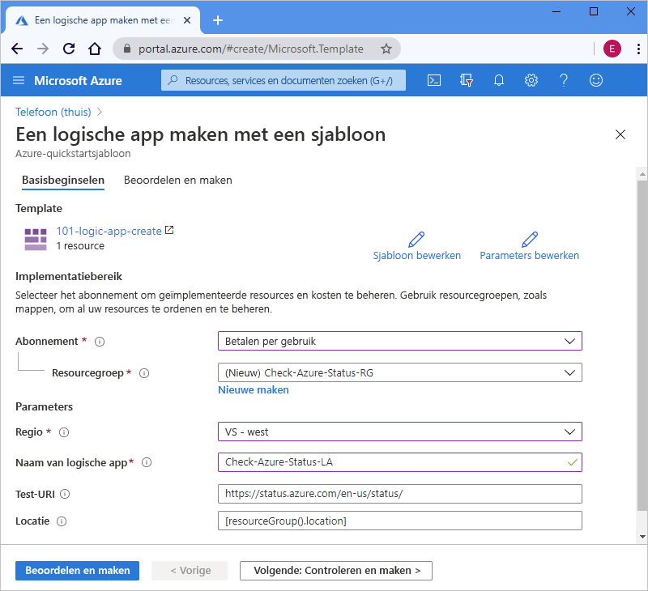

# <a name="quickstart-create-and-deploy-a-logic-app-workflow-by-using-an-arm-template"></a>Quickstart: Een werkstroom voor een logische app maken en implementeren met behulp van een ARM-sjabloon

[Azure Logic Apps](../logic-apps/logic-apps-overview.md) is een cloudservice waarmee u geautomatiseerde werkstromen kunt maken en uitvoeren die gegevens, apps, cloudservices en on-premises systemen integreren door een selectie te maken uit [honderden connectoren](/connectors/connector-reference/connector-reference-logicapps-connectors). In deze snelstart wordt gekeken naar het implementatieproces van een Azure Resource Manager-sjabloon (ARM-sjabloon) voor het maken van een eenvoudige logische app die elk uur de status voor Azure controleert. 

[!INCLUDE [About Azure Resource Manager](../../includes/resource-manager-quickstart-introduction.md)]

Als uw omgeving voldoet aan de vereisten en u benkend bent met het gebruik van ARM-sjablonen, selecteert u de knop **Implementeren naar Azure**. De sjabloon wordt in Azure Portal geopend.

[](https://portal.azure.com/#create/Microsoft.Template/uri/https%3a%2f%2fraw.githubusercontent.com%2fAzure%2fazure-quickstart-templates%2fmaster%2f101-logic-app-create%2fazuredeploy.json)

## <a name="prerequisites"></a>Vereisten

Als u nog geen abonnement op Azure hebt, maakt u een [gratis Azure-account](https://azure.microsoft.com/free/?WT.mc_id=A261C142F) voordat u begint.

## <a name="review-the-template"></a>De sjabloon controleren

In deze snelstart wordt gebruikgemaakt van de sjabloon [**Een logische app maken**](https://azure.microsoft.com/resources/templates/101-logic-app-create/). U kunt deze vinden in de [galerie Azure-snelstartsjablonen](https://azure.microsoft.com/resources/templates), maar deze is te lang om hier weer te geven. In plaats daarvan kunt u het [azuredeploy.json-bestand](https://github.com/Azure/azure-quickstart-templates/blob/master/101-logic-app-create/azuredeploy.json) van de quickstart-sjabloon bekijken in de sjablonengalerie.

De quickstart-sjabloon maakt een werkstroom voor de logische app die gebruikmaakt van de terugkeerpatroontrigger, die elk uur wordt uitgevoerd, en een [*ingebouwde* HTTP-actie](../connectors/apis-list.md#connector-types), waarmee een URL wordt aangeroepen die de status voor Azure retourneert. Een ingebouwde actie is systeemeigen voor het Azure Logic Apps-platform.

Met deze sjabloon maakt u de volgende Azure-resource:

* [**Microsoft.Logic/workflows**](/azure/templates/microsoft.logic/workflows), waarmee de werkstroom voor een logische app wordt gemaakt.

Bekijk de [Microsoft.Logic](https://azure.microsoft.com/resources/templates/?resourceType=Microsoft.Logic)-sjablonen in de galerie als u op zoek bent naar meer quickstart-sjablonen voor Azure Logic Apps wilt.

<a name="deploy-template"></a>

## <a name="deploy-the-template"></a>De sjabloon implementeren

Volg de optie die u wilt gebruiken voor het implementeren van de quickstart-sjabloon:

| Optie | Beschrijving |
|--------|-------------|
| [Azure-portal](../logic-apps/quickstart-create-deploy-azure-resource-manager-template.md?tabs=azure-portal#deploy-template) | Als uw Azure-omgeving voldoet aan de vereisten en u vertrouwd bent met het gebruik van ARM-sjablonen, kunt u zich met deze stappen rechtstreeks aanmelden bij Azure en de quickstart-sjabloon openen in de Azure-portal. Zie [Resources implementeren met ARM-sjablonen en de Azure-portal](../azure-resource-manager/templates/deploy-portal.md) voor meer informatie. |
| [Azure-CLI](../logic-apps/quickstart-create-deploy-azure-resource-manager-template.md?tabs=azure-cli#deploy-template) | De Azure-opdrachtregelinterface (Azure CLI) bestaat uit een reeks opdrachten voor het maken en beheren van Azure-resources. U hebt Azure CLI versie 2.6 of hoger nodig als u deze opdrachten wilt uitvoeren. Typ `az --version` om uw CLI-versie te controleren. Raadpleeg de volgende onderwerpen voor meer informatie: <p><p>- [Wat is Azure CLI?](/cli/azure/what-is-azure-cli?view=azure-cli-latest) <br>- [Aan de slag met Azure CLI](/cli/azure/get-started-with-azure-cli?view=azure-cli-latest) |
| [Azure PowerShell](../logic-apps/quickstart-create-deploy-azure-resource-manager-template.md?tabs=azure-powershell#deploy-template) | Azure PowerShell voorziet in een set van cmdlets die gebruikmaken van het Azure Resource Manager-model om uw Azure-resources te beheren. Raadpleeg de volgende onderwerpen voor meer informatie: <p><p>- [Overzicht van Azure PowerShell](/powershell/azure/azurerm/overview) <br>- [De nieuwe Az-module van Azure PowerShell](/powershell/azure/new-azureps-module-az) <br>- [Aan de slag met Azure PowerShell](/powershell/azure/get-started-azureps) |
| [REST API voor Azure Resource Management](../logic-apps/quickstart-create-deploy-azure-resource-manager-template.md?tabs=rest-api#deploy-template) | Azure biedt zogenaamde Representational State Transfer (REST) API's. Dit zijn service-eindpunten die ondersteuning bieden voor HTTP-bewerkingen (methoden) waarmee u toegang tot serviceresources kunt maken, ophalen, bijwerken of verwijderen. Zie [Aan de slag met Azure REST API](/rest/api/azure/) voor meer informatie. |
|||

<a name="deploy-azure-portal"></a>

#### <a name="portal"></a>[Portal](#tab/azure-portal)

1. Selecteer de volgende afbeelding om u aan te melden met uw Azure-account en open de quickstart-sjabloon in de Azure-portal:

   [](https://portal.azure.com/#create/Microsoft.Template/uri/https%3a%2f%2fraw.githubusercontent.com%2fAzure%2fazure-quickstart-templates%2fmaster%2f101-logic-app-create%2fazuredeploy.json)

1. Voer in de portal, op de pagina **Een logische app maken met behulp van een sjabloon**, de volgende waarden in of selecteer deze waarden:

   | Eigenschap | Waarde | Beschrijving |
   |----------|-------|-------------|
   | **Abonnement** | <*Azure-subscription-name*> | De naam voor het te gebruiken Azure-abonnement |
   | **Resourcegroep** | <*Naam-van-Azure-resourcegroep*> | De naam voor een nieuwe of bestaande Azure-resourcegroep. In dit voorbeeld wordt `Check-Azure-Status-RG` gebruikt. |
   | **Regio** | <*Azure-regio*> | De regio van het Azure-datacentrum voor het gebruik van uw logische app. In dit voorbeeld wordt `West US` gebruikt. |
   | **Naam van logische app** | <*naam-van-logische-app*> | De te gebruiken naam voor uw logische app. In dit voorbeeld wordt `Check-Azure-Status-LA` gebruikt. |
   | **Test-URI** | <*test-URI*> | De URI voor de service die moet worden aangeroepen op basis van een specifiek schema. In dit voorbeeld wordt `https://status.azure.com/en-us/status/` gebruikt. Dit is de Azure-statuspagina. |
   | **Locatie** |  <*Azure-region-for-all-resources*> | De Azure-regio die voor alle resources moet worden gebruikt, indien deze afwijkt van de standaardwaarde. In dit voorbeeld wordt de standaardwaarde, `[resourceGroup().location]`, gebruikt, de locatie van de resourcegroep. |
   ||||

   Hier ziet u hoe de pagina eruitziet met de waarden die in dit voorbeeld worden gebruikt:

   

1. Selecteer als u klaar bent de optie **Beoordelen en maken**.

1. Ga door met de stappen in [Geïmplementeerde resources beoordelen](#review-deployed-resources).

#### <a name="cli"></a>[CLI](#tab/azure-cli)

```azurecli-interactive
read -p "Enter a project name name to use for generating resource names:" projectName &&
read -p "Enter the location, such as 'westus':" location &&
templateUri="https://raw.githubusercontent.com/Azure/azure-quickstart-templates/master/101-logic-app-create/azuredeploy.json" &&
resourceGroupName="${projectName}rg" &&
az group create --name $resourceGroupName --location "$location" &&
az deployment group create --resource-group $resourceGroupName --template-uri  $templateUri &&
echo "Press [ENTER] to continue ..." &&
read
```

Raadpleeg de volgende onderwerpen voor meer informatie:

* [Azure CLI: az deployment group](/cli/azure/deployment/group)
* [Resources implementeren met ARM-sjablonen en Azure CLI](../azure-resource-manager/templates/deploy-cli.md)

#### <a name="powershell"></a>[PowerShell](#tab/azure-powershell)

```azurepowershell-interactive
$projectName = Read-Host -Prompt "Enter a project name to use for generating resource names"
$location = Read-Host -Prompt "Enter the location, such as 'westus'"
$templateUri = "https://raw.githubusercontent.com/Azure/azure-quickstart-templates/master/101-logic-app-create/azuredeploy.json"

$resourceGroupName = "${projectName}rg"

New-AzResourceGroup -Name $resourceGroupName -Location "$location"
New-AzResourceGroupDeployment -ResourceGroupName $resourceGroupName -TemplateUri $templateUri

Read-Host -Prompt "Press [ENTER] to continue ..."
```

Raadpleeg de volgende onderwerpen voor meer informatie:

* [Azure PowerShell: New-AzResourceGroup](/powershell/module/az.resources/new-azresourcegroup)
* [Azure PowerShell: New-AzResourceGroupDeployment](/powershell/module/az.resources/new-azresourcegroupdeployment)
* [Resources implementeren met ARM-sjablonen en Azure PowerShell](../azure-resource-manager/templates/deploy-powershell.md)

#### <a name="rest-api"></a>[REST API](#tab/rest-api)

1. Als u geen bestaande Azure-resourcegroep wilt gebruiken, maakt u een nieuwe resourcegroep met behulp van de volgende syntaxis voor de aanvraag die u naar de REST API voor Resource Management stuurt:

   ```http
   PUT https://management.azure.com/subscriptions/{subscriptionId}/resourcegroups/{resourceGroupName}?api-version=2019-10-01
   ```

   | Waarde | Beschrijving |
   |-------|-------------|
   | `subscriptionId`| De GUID voor het Azure-abonnement dat u wilt gebruiken |
   | `resourceGroupName` | De naam van de Azure-resourcegroep die u gaat maken. In dit voorbeeld wordt `Check-Azure-Status-RG` gebruikt. |
   |||

   Bijvoorbeeld:

   ```http
   PUT https://management.azure.com/subscriptions/xxxxXXXXxxxxXXXXX/resourcegroups/Check-Azure-Status-RG?api-version=2019-10-01
   ```

   Raadpleeg de volgende onderwerpen voor meer informatie:

   * [Naslaginformatie voor Azure REST API: Azure REST-API's aanroepen](/rest/api/azure/)
   * [REST API voor Resource Management: Resourcegroepen - Maken of bijwerken](/rest/api/resources/resourcegroups/createorupdate).

1. Als u de quickstart-sjabloon wilt implementeren in uw resourcegroep, volgt u deze syntaxis voor de aanvraag die u naar de REST API voor Resource Management stuurt:

   ```http
   PUT https://management.azure.com/subscriptions/{subscriptionId}/resourcegroups/{resourceGroupName}/providers/Microsoft.Resources/deployments/{deploymentName}?api-version=2019-10-01
   ```

   | Waarde | Beschrijving |
   |-------|-------------|
   | `subscriptionId`| De GUID voor het Azure-abonnement dat u wilt gebruiken |
   | `resourceGroupName` | De naam van de Azure-resourcegroep die u gaat gebruiken. In dit voorbeeld wordt `Check-Azure-Status-RG` gebruikt. |
   | `deploymentName` | De te gebruiken naam voor uw implementatie. In dit voorbeeld wordt `Check-Azure-Status-LA` gebruikt. |
   |||

   Bijvoorbeeld:

   ```http
   PUT https://management.azure.com/subscriptions/xxxxXXXXxxxxXXXXX/resourcegroups/Check-Azure-Status-RG/providers/Microsoft.Resources/deployments/Check-Azure-Status-LA?api-version=2019-10-01
   ```

   Voor meer informatie raadpleegt u [REST API voor Resource Management: Implementaties - Maken of bijwerken](/rest/api/resources/deployments/createorupdate).

1. Als u de waarden wilt opgeven die voor de implementatie moeten worden gebruikt, zoals de Azure-regio en koppelingen naar de quickstart-sjabloon en het [parameterbestand](../azure-resource-manager/templates/template-parameters.md) (dat de waarden bevat voor de quickstart-sjabloon die u tijdens de implementatie gaat gebruiken), volgt u deze syntaxis voor de hoofdtekst van de aanvraag die u naar de REST API voor Resource Management verzendt:

   ```json
   {
      "location": "{Azure-region}",
      "properties": {
         "templateLink": {
            "uri": "{quickstart-template-URL}",
            "contentVersion": "1.0.0.0"
         },
         "parametersLink": {
            "uri": "{quickstart-template-parameter-file-URL}",
            "contentVersion": "1.0.0.0"
         },
         "mode": "Incremental"
      }
   }
   ```

   | Eigenschap | Waarde | Beschrijving |
   |----------|-------|-------------|
   | `location`| <*Azure-regio*> | De Azure-regio die moet worden gebruikt voor de implementatie. In dit voorbeeld wordt `West US` gebruikt. |
   | `templateLink` : `uri` | <*quickstart-template-URL*> | De URL-locatie voor de quickstart-sjabloon die voor de implementatie moet worden gebruikt: <p><p>`https://raw.githubusercontent.com/Azure/azure-quickstart-templates/master/101-logic-app-create/azuredeploy.json`. |
   | `parametersLink` : `uri` | <*quickstart-template-parameter-file-URL*> | De URL-locatie voor het parameterbestand van de quickstart-sjabloon die voor de implementatie moet worden gebruikt: <p><p>`https://raw.githubusercontent.com/Azure/azure-quickstart-templates/master/101-logic-app-create/azuredeploy.parameters.json` <p><p>Zie de volgende onderwerpen voor meer informatie over het Resource Manager-parameterbestand: <p><p>- [Een Resource Manager-parameterbestand maken](../azure-resource-manager/templates/parameter-files.md) <br>- [Zelfstudie: parameterbestanden gebruiken voor het implementeren van uw ARM-sjabloon](../azure-resource-manager/templates/template-tutorial-use-parameter-file.md) |
   | `mode` | <*deployment-mode*> | Voer een incrementele update uit of voltooi de update. In dit voorbeeld wordt `Incremental` gebruikt. Dit is de standaardwaarde. Zie [Implementatiemodi van Azure Resource Manager](../azure-resource-manager/templates/deployment-modes.md) voor meer informatie. |
   |||

   Bijvoorbeeld:

   ```json
   {
      "location": "West US",
      "properties": {
         "templateLink": {
            "uri": "https://raw.githubusercontent.com/Azure/azure-quickstart-templates/master/101-logic-app-create/azuredeploy.json",
            "contentVersion": "1.0.0.0"
         },
         "parametersLink": {
            "uri": "https://raw.githubusercontent.com/Azure/azure-quickstart-templates/master/101-logic-app-create/azuredeploy.parameters.json",
            "contentVersion": "1.0.0.0"
         },
         "mode": "Incremental"
      }
   }
   ```

Raadpleeg de volgende onderwerpen voor meer informatie:

* [REST API voor Resource Management](/rest/api/resources/)
* [Resources implementeren met ARM-sjablonen en REST API voor Resource Manager](../azure-resource-manager/templates/deploy-rest.md)

---

<a name="review-deployed-resources"></a>

## <a name="review-deployed-resources"></a>Geïmplementeerde resources bekijken

Als u de logische app wilt bekijken, kunt u de Azure-portal gebruiken, een script uitvoeren dat u met Azure CLI of Azure PowerShell maakt, of de REST API voor de logische app gebruiken.

### <a name="portal"></a>[Portal](#tab/azure-portal)

1. Voer in het zoekvak van de Azure-portal de naam van uw logische app in, in dit voorbeeld `Check-Azure-Status-LA`. Selecteer uw logische app in de lijst met resultaten.

1. Zoek en selecteer in de Azure-portal uw logische app in, in dit voorbeeld `Check-Azure-Status-RG`.

1. Wanneer de ontwerpfunctie voor logische apps wordt geopend, controleert u de logische app die is gemaakt met behulp van de quickstart-sjabloon.

1. Selecteer **Uitvoeren** op de werkbalk in van de ontwerpfunctie als u de logische app wilt testen.

### <a name="cli"></a>[CLI](#tab/azure-cli)

```azurecli-interactive
echo "Enter your logic app name:" &&
read logicAppName &&
az logic workflow show --name $logicAppName &&
echo "Press [ENTER] to continue ..."
```

Zie [Azure CLI: az logic workflow show](/cli/azure/ext/logic/logic/workflow?view=azure-cli-latest#ext-logic-az-logic-workflow-show) voor meer informatie.

### <a name="powershell"></a>[PowerShell](#tab/azure-powershell)

```azurepowershell-interactive
$logicAppName = Read-Host -Prompt "Enter your logic app name"
Get-AzLogicApp -Name $logicAppName
Write-Host "Press [ENTER] to continue..."
```

Voor meer informatie raadpleegt u [Azure PowerShell: Get-AzLogicApp](/powershell/module/az.logicapp/get-azlogicapp).

### <a name="rest-api"></a>[REST API](#tab/rest-api)

```http
GET https://management.azure.com/subscriptions/{subscriptionId}/resourceGroups/{resourceGroupName}/providers/Microsoft.Logic/workflows/{workflowName}?api-version=2016-06-01
```

| Waarde | Beschrijving |
|-------|-------------|
| `subscriptionId`| De GUID voor het Azure-abonnement waar u de quickstart-sjabloon hebt geïmplementeerd. |
| `resourceGroupName` | De naam voor de Azure-resourcegroep waar u de quickstart-sjabloon hebt geïmplementeerd. In dit voorbeeld wordt `Check-Azure-Status-RG` gebruikt. |
| `workflowName` | De naam voor de logische app die u hebt geïmplementeerd. In dit voorbeeld wordt `Check-Azure-Status-LA` gebruikt. |
|||

Bijvoorbeeld:

```http
GET https://management.azure.com/subscriptions/xxxxXXXXxxxxXXXXX/resourceGroups/Check-Azure-Status-RG/providers/Microsoft.Logic/workflows/Check-Azure-Status-LA?api-version=2016-06-01
```

Voor meer informatie raadpleegt u [REST API voor Logic Apps: Werkstromen - GET](/rest/api/logic/workflows/get).

---

## <a name="clean-up-resources"></a>Resources opschonen

Als u van plan bent om verder te gaan met volgende snelstarts en zelfstudies, kunt u deze resources het beste bewaren. Wanneer u de logische app niet meer nodig hebt, verwijdert u de resourcegroep met behulp van de Azure-portal, Azure CLI, Azure PowerShell of de REST API voor Resource Management.

### <a name="portal"></a>[Portal](#tab/azure-portal)

1. Zoek en selecteer in de Azure-portal de resourcegroep die u wilt verwijderen, in dit voorbeeld `Check-Azure-Status-RG`.

1. Selecteer in het resourcegroepmenu de optie **Overzicht**, indien deze optie nog niet is geselecteerd. Selecteer op de overzichtspagina **Resourcegroep verwijderen**.

1. Voer ter bevestiging de naam van de resourcegroep in.

Zie [Resourcegroep verwijderen](../azure-resource-manager/management/delete-resource-group.md?tabs=azure-portal#delete-resource-group) voor meer informatie.

### <a name="cli"></a>[CLI](#tab/azure-cli)

```azurecli-interactive
echo "Enter your resource group name:" &&
read resourceGroupName &&
az group delete --name $resourceGroupName &&
echo "Press [ENTER] to continue ..."
```

Zie [Azure CLI: az group delete](/cli/azure/group?view=azure-cli-latest#az-group-delete) voor meer informatie.

### <a name="powershell"></a>[PowerShell](#tab/azure-powershell)

```azurepowershell-interactive
$resourceGroupName = Read-Host -Prompt "Enter the resource group name"
Remove-AzResourceGroup -Name $resourceGroupName
Write-Host "Press [ENTER] to continue..."
```

Voor meer informatie raadpleegt u [Azure PowerShell: Remove-AzResourceGroup](/powershell/module/azurerm.resources/remove-azurermresourcegroup).

### <a name="rest-api"></a>[REST API](#tab/rest-api)

```http
DELETE https://management.azure.com/subscriptions/{subscriptionId}/resourcegroups/{resourceGroupName}?api-version=2019-10-01
```

| Waarde | Beschrijving |
|-------|-------------|
| `subscriptionId`| De GUID voor het Azure-abonnement waar u de quickstart-sjabloon hebt geïmplementeerd. |
| `resourceGroupName` | De naam voor de Azure-resourcegroep waar u de quickstart-sjabloon hebt geïmplementeerd. In dit voorbeeld wordt `Check-Azure-Status-RG` gebruikt. |
|||

Bijvoorbeeld:

```http
GET https://management.azure.com/subscriptions/xxxxXXXXxxxxXXXXX/resourceGroups/Check-Azure-Status-RG?api-version=2019-10-01
```

Voor meer informatie raadpleegt u [REST API voor Resource Management: Resourcegroepen - Verwijderen](/rest/api/resources/resourcegroups/delete).

---

## <a name="next-steps"></a>Volgende stappen

> [!div class="nextstepaction"]
> [Zelfstudie: uw eerste ARM-sjabloon maken en implementeren](../azure-resource-manager/templates/template-tutorial-create-first-template.md)
