# <a name="quickstart-create-and-manage-logic-app-workflow-definitions-by-using-visual-studio-code"></a>Snelstartgids: werk stroom definities voor logische apps maken en beheren met Visual Studio code

Met [Azure Logic apps](../logic-apps/logic-apps-overview.md) en Visual Studio code kunt u logische apps maken en beheren die u helpen bij het automatiseren van taken, werk stromen en processen voor het integreren van apps, gegevens, systemen en services in organisaties en ondernemingen. In deze Quick start ziet u hoe u de onderliggende werk stroom definities kunt maken en bewerken, die gebruikmaken van JavaScript Object Notation (JSON), voor logische apps via een op code gebaseerde ervaring. U kunt ook werken met bestaande Logic apps die al zijn geïmplementeerd in Azure.

Hoewel u deze taken kunt uitvoeren in de [Azure Portal](https://portal.azure.com) en in Visual Studio, kunt u sneller aan de slag met Visual Studio code wanneer u al bekend bent met definities van logische apps en rechtstreeks in code wilt werken. U kunt bijvoorbeeld al gemaakte Logic apps uitschakelen, inschakelen, verwijderen en vernieuwen. Daarnaast kunt u werken met Logic apps en integratie accounts vanuit elk ontwikkel platform waarop Visual Studio code wordt uitgevoerd, zoals Linux, Windows en Mac.

Voor dit artikel kunt u in deze [Quick](../logic-apps/quickstart-create-first-logic-app-workflow.md)start dezelfde logische app maken, die gericht is op de basis concepten. In Visual Studio code ziet de logische app eruit als in dit voor beeld:

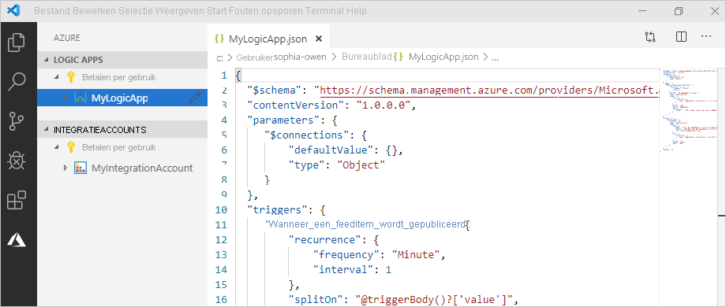

Zorg ervoor dat u deze items hebt voordat u begint:

* Als u geen Azure-account en-abonnement hebt, kunt u [zich aanmelden voor een gratis Azure-account](https://azure.microsoft.com/free/).

* Basis kennis over [werk stroom definities voor logische apps](../logic-apps/logic-apps-workflow-definition-language.md) en hun structuur, zoals beschreven met JSON

  Als u nog geen ervaring hebt met Logic Apps, kunt u deze [Snelstartgids](../logic-apps/quickstart-create-first-logic-app-workflow.md)uitproberen, waarmee u uw eerste Logic apps in de Azure Portal maakt en meer richt op de basis concepten.

* Toegang tot internet om u aan te melden bij Azure en uw Azure-abonnement

* Download en installeer deze hulpprogramma's als u ze nog niet hebt:

  * [Visual Studio code versie 1.25.1 of hoger](https://code.visualstudio.com/), wat gratis is

  * Visual Studio code Extension voor Azure Logic Apps

    U kunt deze uitbrei ding downloaden en installeren vanuit Visual [Studio Marketplace](https://marketplace.visualstudio.com/items?itemName=ms-azuretools.vscode-logicapps) of rechtstreeks vanuit Visual Studio code. Zorg ervoor dat u Visual Studio code opnieuw laadt na de installatie.

    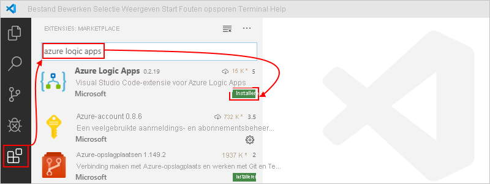

    Als u wilt controleren of de uitbrei ding correct is geïnstalleerd, selecteert u het pictogram van Azure dat wordt weer gegeven op de werk balk van Visual Studio code.

    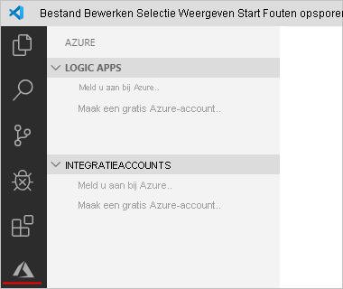

    Zie [uitbreidings Marketplace](https://code.visualstudio.com/docs/editor/extension-gallery)voor meer informatie. Als u een bijdrage wilt leveren aan de open-source versie van deze extensie, gaat u naar de [Azure Logic apps-extensie voor Visual Studio code op github](https://github.com/Microsoft/vscode-azurelogicapps).

<a name="sign-in-azure"></a>

## <a name="sign-in-to-azure"></a>Aanmelden bij Azure

1. Open Visual Studio Code. Selecteer op de werk balk van Visual Studio code het pictogram van Azure.

   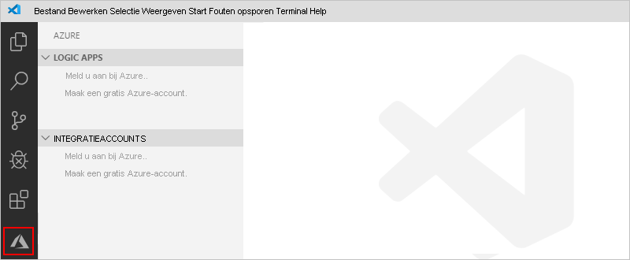

1. Selecteer in het venster Azure onder **Logic apps**de optie **Aanmelden bij Azure**. Meld u aan met uw Azure-account wanneer u op de micro soft-aanmeldings pagina wordt gevraagd om u aan te melden.

   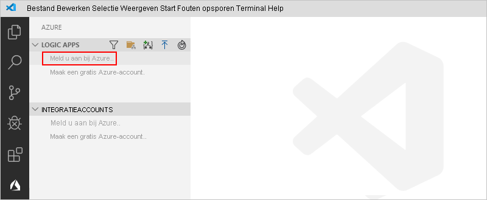

   1. Als het aanmelden langer duurt dan gebruikelijk, wordt u door Visual Studio code gevraagd u aan te melden via een micro soft-verificatie website door een apparaatcode op te geven. Als u zich wilt aanmelden met de code, selecteert u **apparaatcode gebruiken**.

      

   1. Selecteer **kopiëren & openen**om de code te kopiëren.

      

   1. Als u een nieuw browser venster wilt openen en wilt door gaan naar de verificatie website, selecteert u **koppeling openen**.

      

   1. Voer uw verificatie code in op de pagina **Aanmelden bij uw account** en selecteer **volgende**.

      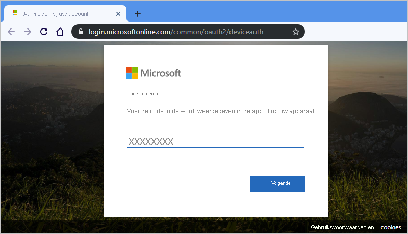

1. Selecteer uw Azure-account. Nadat u zich hebt aangemeld, kunt u uw browser sluiten en terugkeren naar Visual Studio code.

   In het deel venster Azure worden nu **Logic apps** de Azure-abonnementen weer gegeven die aan uw account zijn gekoppeld. Als u de abonnementen die u verwacht echter niet ziet of als in de secties te veel abonnementen worden weer gegeven, voert u de volgende stappen uit:

   1. Beweeg de aanwijzer over het **Logic apps** label. Wanneer de werk balk wordt weer gegeven, selecteert u **abonnementen selecteren** (filter pictogram).

      

   1. Selecteer de abonnementen die u wilt weer geven in de lijst die wordt weer gegeven.

1. Selecteer onder **Logic apps**het gewenste abonnement. Het abonnements knooppunt wordt uitgebreid en toont alle Logic apps die in dat abonnement aanwezig zijn.

   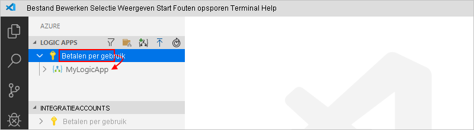

   > [!TIP]
   > Onder **integratie accounts**ziet u uw abonnement, alle integratie accounts die in dat abonnement aanwezig zijn.

<a name="create-logic-app"></a>

## <a name="create-new-logic-app"></a>Een nieuwe logische app maken

1. Als u zich nog niet hebt aangemeld bij uw Azure-account en-abonnement vanuit Visual Studio code, volgt u de [vorige stappen om u aan te melden](#sign-in-azure).

1. Open in Visual Studio code, onder **Logic apps**, het snelmenu van uw abonnement en selecteer **logische app maken**.

   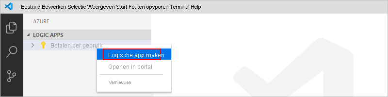

   Er wordt een lijst weer gegeven met alle Azure-resource groepen in uw abonnement.

1. Selecteer **een nieuwe resource groep maken** of een bestaande resource groep in de lijst resource groep. Voor dit voor beeld maakt u een nieuwe resource groep.

   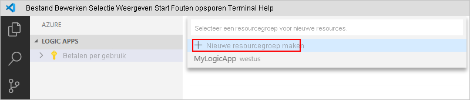

1. Geef een naam op voor de Azure-resource groep en druk op ENTER.

   

1. Selecteer de Azure-regio waar u de meta gegevens van uw logische app wilt opslaan.

   

1. Geef een naam op voor uw logische app en druk op ENTER.

   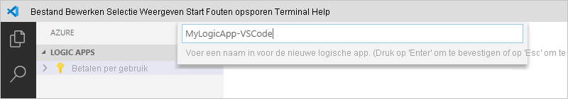

   In het Azure-venster, onder uw Azure-abonnement, wordt uw nieuwe en lege logische app weer gegeven. Visual Studio code opent ook een JSON-bestand (. logicapp. json), dat een werk stroom definitie van een skelet bevat voor uw logische app. Nu kunt u de werk stroom definitie van uw logische app hand matig in dit JSON-bestand ontwerpen. Zie voor technische Naslag informatie over de structuur en syntaxis voor een werk stroom definitie het [schema voor de werk stroom definitie taal voor Azure Logic apps](../logic-apps/logic-apps-workflow-definition-language.md).

   

   Hier volgt een voor beeld van een werk stroom definitie van een logische app, die begint met een RSS-trigger en een Office 365 Outlook-actie. Normaal gesp roken worden JSON-elementen alfabetisch weer gegeven in elke sectie. In dit voor beeld worden deze elementen echter ruwweg weer gegeven in de volg orde waarin de stappen van de logische app in de ontwerp functie worden weer gegeven.

   > [!IMPORTANT]
   > Als u deze voor beeld-definitie van de logische app opnieuw wilt gebruiken, hebt u een Office 365-organisatie account nodig, bijvoorbeeld @fabrikam.com. Zorg ervoor dat u het fictieve e-mail adres vervangt door uw eigen e-mail adres. Als u een andere e-mail Connector, zoals Outlook.com of Gmail, wilt gebruiken, vervangt u de `Send_an_email_action` actie door een vergelijk bare actie die beschikbaar is via een [e-mail connector die wordt ondersteund door Azure Logic apps](../connectors/apis-list.md).

   ```json
   {
      "$schema": "https://schema.management.azure.com/providers/Microsoft.Logic/schemas/2016-06-01/workflowdefinition.json#",
      "contentVersion": "1.0.0.0",
      "parameters": {
         "$connections": {
            "defaultValue": {},
            "type": "Object"
         }
      },
      "triggers": {
         "When_a_feed_item_is_published": {
            "recurrence": {
               "frequency": "Minute",
               "interval": 1
            },
            "splitOn": "@triggerBody()?['value']",
            "type": "ApiConnection",
            "inputs": {
               "host": {
                  "connection": {
                     "name": "@parameters('$connections')['rss']['connectionId']"
                  }
               },
               "method": "get",
               "path": "/OnNewFeed",
               "queries": {
                  "feedUrl": "http://feeds.reuters.com/reuters/topNews"
               }
            }
         }
      },
      "actions": {
         "Send_an_email_(V2)": {
            "runAfter": {},
            "type": "ApiConnection",
            "inputs": {
               "body": {
                  "Body": "<p>Title: @{triggerBody()?['title']}<br>\n<br>\nDate published: @{triggerBody()?['updatedOn']}<br>\n<br>\nLink: @{triggerBody()?['primaryLink']}</p>",
                  "Subject": "RSS item: @{triggerBody()?['title']}",
                  "To": "sophia-owen@fabrikam.com"
               },
               "host": {
                  "connection": {
                     "name": "@parameters('$connections')['office365']['connectionId']"
                  }
               },
               "method": "post",
               "path": "/v2/Mail"
            }
         }
      },
      "outputs": {}
   }
   ```

1. Wanneer u klaar bent, slaat u de werk stroom definitie van de logische app op. (Menu Bestand > opslaan of druk op CTRL + S)

1. Selecteer **uploaden**wanneer u wordt gevraagd uw logische app te uploaden naar uw Azure-abonnement.

   Met deze stap publiceert u uw logische app naar de [Azure Portal](https://portal.azure.com), die uw logica Live maakt en uitvoert in Azure.

   

## <a name="view-logic-app-in-designer"></a>Logische app weer geven in Designer

In Visual Studio code kunt u uw logische app openen in de ontwerp weergave alleen-lezen. Hoewel u uw logische app niet kunt bewerken in de ontwerp functie, kunt u de werk stroom van uw logische app visueel controleren met behulp van de ontwerp weergave.

Open in het Azure-venster, onder **Logic apps**, het snelmenu van de logische app en selecteer **openen in Designer**.

De alleen-lezen Designer wordt geopend in een afzonderlijk venster en toont de werk stroom van uw logische app, bijvoorbeeld:

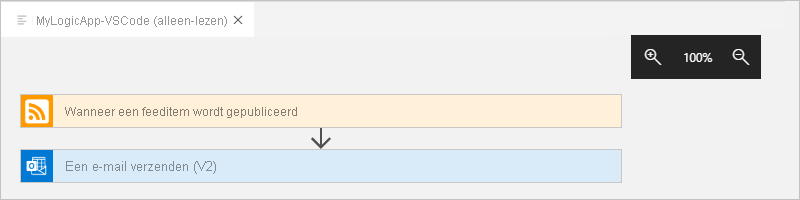

## <a name="view-in-azure-portal"></a>Weer geven in Azure Portal

Voer de volgende stappen uit om uw logische app in Azure Portal te controleren:

1. Meld u aan bij de [Azure Portal](https://portal.azure.com) met behulp van hetzelfde Azure-account en-abonnement dat is gekoppeld aan uw logische app.

1. Voer in het zoekvak van de Azure Portal de naam van uw Logic apps in. Selecteer uw logische app in de lijst met resultaten.

   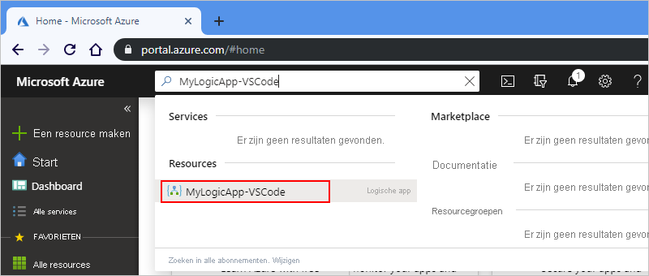

<a name="disable-enable-logic-app"></a>

## <a name="disable-or-enable-logic-app"></a>Logische app in-of uitschakelen

Als u in Visual Studio code een gepubliceerde logische app bewerkt en uw wijzigingen opslaat, *overschrijft* u de al geïmplementeerde app. U kunt de logische app het eerst deactiveren om te voor komen dat uw logische app in productie wordt genomen en de onderbreking te minimaliseren. U kunt de logische app vervolgens opnieuw activeren nadat u hebt bevestigd dat uw logische app nog werkt.

1. Als u zich nog niet hebt aangemeld bij uw Azure-account en-abonnement vanuit Visual Studio code, volgt u de [vorige stappen om u aan te melden](#sign-in-azure).

1. Vouw in het venster van Azure onder **Logic apps**uw Azure-abonnement uit zodat u alle logische apps in dat abonnement kunt bekijken.

   1. Als u de gewenste logische app wilt uitschakelen, opent u het menu van de logische app en selecteert u **uitschakelen**.

      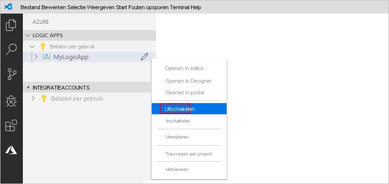

   1. Wanneer u klaar bent om uw logische app opnieuw te activeren, opent u het menu van de logische app en selecteert u **inschakelen**.

      

<a name="edit-logic-app"></a>

## <a name="edit-deployed-logic-app"></a>Geïmplementeerde logische app bewerken

In Visual Studio code kunt u de werk stroom definitie openen en bewerken voor een al geïmplementeerde logische app in Azure.

> [!IMPORTANT] 
> Voordat u een actief actieve logische app in productie bewerkt, vermijdt u het risico dat de logische app wordt onderbroken en wordt de onderbreking beperkt door [eerst uw logische app uit te scha kelen](#disable-enable-logic-app).

1. Als u zich nog niet hebt aangemeld bij uw Azure-account en-abonnement vanuit Visual Studio code, volgt u de [vorige stappen om u aan te melden](#sign-in-azure).

1. In het venster Azure, onder **Logic apps**, vouwt u uw Azure-abonnement uit en selecteert u de logische app die u wilt.

1. Open het menu van de logische app en selecteer **openen in editor**. Of selecteer het bewerkings pictogram naast de naam van de logische app.

   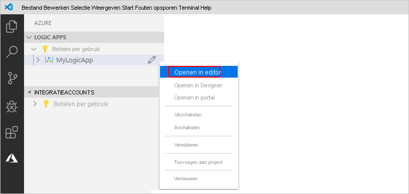

   Met Visual Studio code wordt het bestand. logicapp. json in de lokale tijdelijke map geopend, zodat u de werk stroom definitie van de logische app kunt weer geven.

   

1. Breng uw wijzigingen aan in de werk stroom definitie van de logische app.

1. Sla de wijzigingen op als u klaar bent. (Menu Bestand > opslaan of druk op CTRL + S)

1. Selecteer **uploaden**wanneer u wordt gevraagd uw wijzigingen te uploaden en uw bestaande logische app te *overschrijven* in de Azure Portal.

   Met deze stap publiceert u uw updates naar uw logische app in de [Azure Portal](https://portal.azure.com).

   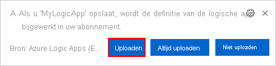

## <a name="view-or-promote-other-versions"></a>Andere versies weer geven of promoten

In Visual Studio code kunt u de eerdere versies voor uw logische app openen en bekijken. U kunt ook een eerdere versie promo veren naar de huidige versie.

> [!IMPORTANT] 
> Voordat u een actief actieve logische app in productie wijzigt, vermijdt u het risico dat de logische app wordt verbroken en wordt de onderbreking beperkt door [eerst uw logische app uit te scha kelen](#disable-enable-logic-app).

1. Vouw in het venster van Azure onder **Logic apps**uw Azure-abonnement uit zodat u alle logische apps in dat abonnement kunt bekijken.

1. Vouw uw logische app onder uw abonnement uit en vouw vervolgens **versies**uit.

   In de lijst met **versies** worden de eerdere versies van uw logische app weer gegeven, indien aanwezig.

   

1. Selecteer een van de volgende stappen om een eerdere versie weer te geven:

   * Als u de JSON-definitie wilt weer geven, selecteert u onder **versies**het versie nummer voor die definitie. U kunt ook het snelmenu van de betreffende versie openen en **in editor openen**selecteren.

     Er wordt een nieuw bestand geopend op de lokale computer en de JSON-definitie van die versie wordt weer gegeven.

   * Als u de versie in de ontwerp weergave alleen-lezen wilt weer geven, opent u het snelmenu van de betreffende versie en selecteert u **openen in Designer**.

1. Voer de volgende stappen uit om een eerdere versie te promo veren naar de huidige versie:

   1. Open het snelmenu van de eerdere versie onder **versies**en selecteer **niveau verhogen**.

      

   1. Als u wilt door gaan nadat Visual Studio code u om bevestiging vraagt, selecteert u **Ja**.

      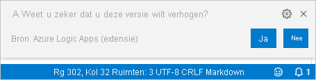

      Met Visual Studio code wordt de geselecteerde versie gepromoot naar de huidige versie en wordt een nieuw nummer toegewezen aan de gepromoveerde versie. De vorige huidige versie wordt nu weer gegeven onder de gepromoveerde versie.

## <a name="next-steps"></a>Volgende stappen

> [!div class="nextstepaction"]
> [Logische apps maken met Visual Studio](../logic-apps/quickstart-create-logic-apps-with-visual-studio.md)