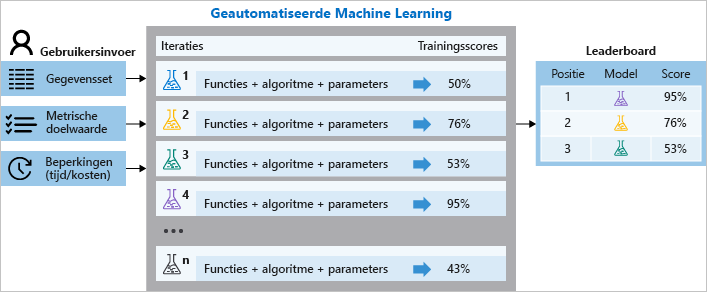

# Wat is geautomatiseerde machine learning?

Automatische machine learning, ook wel automatische ML genoemd, is het proces van het automatiseren van de tijdrovende, terugkerende taken van het ontwikkelen van machine learning modellen. Zo kunnen gegevens wetenschappers, analisten en ontwikkel aars ML-modellen bouwen met een hoge schaal, efficiëntie en productiviteit, terwijl de kwaliteit van het model goed wordt. Automatische ML is gebaseerd op een door braak van onze [micro soft research-afdeling](https://arxiv.org/abs/1705.05355).

De traditionele ontwikkeling van machine learning modellen is het bronnen-intensief, waardoor de kennis en tijd van het domein belang rijk zijn voor het produceren en vergelijken van tien tallen modellen. Pas automatische ML toe als u wilt dat Azure Machine Learning een model traint en afstemt met behulp van de doel metriek die u opgeeft. De service herhaalt vervolgens een combi natie van ML-algoritmen die zijn gekoppeld aan functie selecties, waarbij elke herhaling een model met een trainings Score produceert. Hoe hoger de score, hoe beter het model wordt beschouwd als uw gegevens.

Met automatische machine learning versnelt u de tijd die nodig is om productie-Ready ML-modellen te verkrijgen met een geweldig gemak en efficiëntie.

## Wanneer gebruikt u automatische ML?

Automatische ML democratiseert, doordat het ontwikkel proces van het machine learning model en biedt gebruikers de mogelijkheid om een end-to-end machine learning-pijp lijn te identificeren voor een probleem.

Gegevens wetenschappers, analisten en ontwikkel aars in verschillende branches kunnen gebruikmaken van automatische MILLILITERs:

+ machine learning oplossingen implementeren zonder uitgebreide programmeer kennis
+ Bespaar tijd en resources
+ Best practices voor data wetenschappen gebruiken
+ Flexibel probleem oplossing bieden-oplossen

In de volgende tabel vindt u een lijst met veelvoorkomende toepassingen voor automatische MILLILITERs. 

Classificatie| Tijd reeks prognose | Regressie
---|---|---
[Fraude detectie](https://github.com/Azure/MachineLearningNotebooks/blob/master/how-to-use-azureml/automated-machine-learning/classification-credit-card-fraud/auto-ml-classification-credit-card-fraud.ipynb)|[Verkoop prognose](https://github.com/Azure/MachineLearningNotebooks/blob/master/how-to-use-azureml/automated-machine-learning/forecasting-orange-juice-sales/auto-ml-forecasting-orange-juice-sales.ipynb)|[Voor spelling van CPU-prestaties](https://github.com/Azure/MachineLearningNotebooks/blob/master/how-to-use-azureml/automated-machine-learning/regression-hardware-performance-explanation-and-featurization/auto-ml-regression-hardware-performance-explanation-and-featurization.ipynb)
|[Marketing voorspelling](https://github.com/Azure/MachineLearningNotebooks/blob/master/how-to-use-azureml/automated-machine-learning/classification-bank-marketing-all-features/auto-ml-classification-bank-marketing-all-features.ipynb)|[Vraag prognose](https://github.com/Azure/MachineLearningNotebooks/blob/master/how-to-use-azureml/automated-machine-learning/forecasting-energy-demand/auto-ml-forecasting-energy-demand.ipynb)|
|[Classificatie van nieuws groep-gegevens](https://github.com/Azure/MachineLearningNotebooks/blob/master/how-to-use-azureml/automated-machine-learning/classification-text-dnn/auto-ml-classification-text-dnn.ipynb)|[Drank productie prognose](https://github.com/Azure/MachineLearningNotebooks/blob/master/how-to-use-azureml/automated-machine-learning/forecasting-beer-remote/auto-ml-forecasting-beer-remote.ipynb)|

## Hoe geautomatiseerd ML werkt

Met **Azure machine learning**kunt u uw automatische ml-experimenten ontwerpen en uitvoeren met de volgende stappen:

1. **Bepaal welk ml-probleem** moet worden opgelost: classificatie, prognose of regressie

1. **Geef de bron en de indeling van de gelabelde trainings gegevens op**: numpy-matrices of Panda-data frame

1. **Configureer het reken doel voor model training**, zoals uw [lokale computer, Azure machine learning reken processen, externe vm's of Azure Databricks](how-to-set-up-training-targets.md).  Meer informatie over geautomatiseerde training [op een externe bron](how-to-auto-train-remote.md).

1. **Configureer de para meters voor automatische machine learning** die bepalen hoeveel iteraties boven verschillende modellen, afstemming-instellingen, geavanceerde preverwerking/parametrisatie en welke metrische gegevens er moeten worden weer gegeven bij het bepalen van het beste model.  U kunt de instellingen voor automatische studie experiment configureren in [Azure machine learning Studio](https://ml.azure.com)of [met de SDK](how-to-configure-auto-train.md). 

    [!INCLUDE [aml-applies-to-enterprise-sku](../../includes/aml-applies-to-enterprise-sku-inline.md)]

1. **Verzend de trainings uitvoering.**

  

Tijdens de training maakt Azure Machine Learning een aantal parallelle pijp lijnen die verschillende algoritmen en para meters proberen. Het wordt gestopt zodra de afsluit criteria die in het experiment zijn gedefinieerd, zijn gevonden.

U kunt ook de informatie over geregistreerde uitvoeringen controleren, die de [metrische gegevens bevat](how-to-understand-automated-ml.md) die tijdens de uitvoering zijn verzameld. De trainings uitvoering produceert een met python geserialiseerd object (`.pkl`-bestand) dat het model en de voor verwerking van gegevens bevat.

Hoewel het bouwen van modellen geautomatiseerd is, kunt u ook [zien hoe belang rijke of relevante functies](how-to-configure-auto-train.md#explain) voor de gegenereerde modellen zijn.

> [!VIDEO https://www.microsoft.com/videoplayer/embed/RE2Xc9t]

## Verwerking

In elk automatisch machine learning experiment worden uw gegevens voorverwerkt met behulp van de standaard methoden en optioneel via geavanceerde voor verwerking.

> [!NOTE]
> Automatische machine learning vooraf verwerkte stappen (functie normalisatie, het verwerken van ontbrekende gegevens, het converteren van tekst naar numerieke waarde, enzovoort) worden onderdeel van het onderliggende model. Wanneer u het model gebruikt voor voor spellingen, worden dezelfde vooraf verwerkings stappen die tijdens de training worden toegepast, automatisch toegepast op uw invoer gegevens.

### Automatische voor verwerking (standaard)

In elk automatisch machine learning experiment worden uw gegevens automatisch geschaald of genormaliseerd om de Help-algoritmen goed uit te voeren.  Tijdens de model training wordt een van de volgende schalen of normalisatie technieken toegepast op elk model.

|&nbsp;&&nbsp;normalisatie aanpassen| Beschrijving |
| ------------- | ------------- |
| [StandardScaleWrapper](https://scikit-learn.org/stable/modules/generated/sklearn.preprocessing.StandardScaler.html)  | Functies standaardiseren door het gemiddelde en de schaal aanpassing te verwijderen voor eenheids variantie  |
| [MinMaxScalar](https://scikit-learn.org/stable/modules/generated/sklearn.preprocessing.MinMaxScaler.html)  | Transformeert functies door elke functie te schalen op basis van het minimum en maximum van die kolom  |
| [MaxAbsScaler](https://scikit-learn.org/stable/modules/generated/sklearn.preprocessing.MaxAbsScaler.html#sklearn.preprocessing.MaxAbsScaler) |Elke functie schalen met de Maxi maal absolute waarde |
| [RobustScalar](https://scikit-learn.org/stable/modules/generated/sklearn.preprocessing.RobustScaler.html) |Deze schaal functies op basis van hun quantile bereik |
| [ASSISTENT](https://scikit-learn.org/stable/modules/generated/sklearn.decomposition.PCA.html) |Lineaire dimensionaliteit door de gegevens uit de enkelvoudige waarde te desamen stellen om deze te projecteren in een gereduceerde ruimte |
| [TruncatedSVDWrapper](https://scikit-learn.org/stable/modules/generated/sklearn.decomposition.TruncatedSVD.html) |Deze transformator voert lineaire dimensionaliteit uit met behulp van een afgekapte enkelvouds waarde (SVD). In tegens telling tot PCA worden met deze Estimator de gegevens niet gecentreerd voordat de enkelvoudige waarde wordt uitgevouwen. Dit betekent dat deze kan werken met scipy. sparse-matrices |
| [SparseNormalizer](https://scikit-learn.org/stable/modules/generated/sklearn.preprocessing.Normalizer.html) | Elk voor beeld (dat wil zeggen, elke rij van de gegevens matrix) met ten minste één niet-nul onderdeel, wordt afzonderlijk van andere steek proeven opnieuw geschaald, zodat de norm (L1 of L2) gelijk is aan 1 |

### Geavanceerde voor verwerking: optionele parametrisatie

Er zijn ook aanvullende geavanceerde preverwerkings-en parametrisatie beschikbaar, zoals gegevens Guardrails, code ring en trans formaties. Meer [informatie over wat parametrisatie is inbegrepen](how-to-create-portal-experiments.md#featurization). Schakel deze instelling in met:

+ Azure Machine Learning studio: **automatische parametrisatie** inschakelen in de sectie **aanvullende configuratie weer geven** [met de volgende stappen](how-to-create-portal-experiments.md#create-and-run-experiment).

+ Python-SDK: Geef `"feauturization": 'auto' / 'off' / 'FeaturizationConfig'` op voor de [`AutoMLConfig` klasse](/python/api/azureml-train-automl-client/azureml.train.automl.automlconfig.automlconfig). 

## Voor komen dat de installatie meer wordt uitgevoerd

Over het machine learning vindt plaats wanneer een model te groot is voor de opleidings gegevens en daardoor niet nauw keurig kan worden voor speld op onduidelijke test gegevens. Met andere woorden, het model heeft simpelweg specifieke patronen en ruis in de trainings gegevens, maar is niet flexibel genoeg om voor spellingen te doen op echte gegevens. In de meeste gevallen van egregious wordt ervan uitgegaan dat de combi Naties van functie waarden die tijdens de training worden weer gegeven, altijd resulteren in exact dezelfde uitvoer voor het doel. 

De beste manier om te voor komen dat u aan de slag gaat, is het volgen van de best practices van ML, waaronder:

* Meer trainings gegevens gebruiken en statistische afwijking elimineren
* Doel lekkage voor komen
* Minder functies gebruiken
* **Regularisatie en afstemming optimaliseren**
* **Complexiteits beperkingen voor modellen**
* **Kruis validatie**

In de context van automatische ML zijn de eerste drie bovenstaande items de **Best practices die u implementeert**. De laatste drie vetgedrukte items zijn de **Best practices waarmee automatische milliliters worden geïmplementeerd** . In andere instellingen dan automatische MILLILITERs zijn alle zes aanbevolen procedures te volgen om te voor komen dat modellen worden overbelast.

### Aanbevolen procedures voor het implementeren van

Het gebruik van **meer gegevens** is de eenvoudigste en best mogelijke manier om te voor komen dat u aan de slag gaat, en naarmate een extra bonus doorgaans nauw keuriger wordt. Wanneer u meer gegevens gebruikt, is het moeilijker voor het model om exacte patronen te onthouden. het is ook mogelijk om oplossingen te bereiken die flexibeler zijn om meer voor waarden te bieden. Het is ook belang rijk om **statistische afwijking**te herkennen, om ervoor te zorgen dat uw trainings gegevens geen geïsoleerde patronen bevatten die niet voor komen in Live-Voorspellings gegevens. Dit scenario kan moeilijk worden opgelost, omdat er mogelijk geen verdere aanpassing is tussen uw Train-en test sets, maar er mogelijk sprake is van een overmatige installatie van gegevens in vergelijking met live test.

Het doel lekkage is een soortgelijk probleem, waar u mogelijk geen overmatige installatie van de sets voor Train/Test ziet, maar deze wordt weer gegeven bij voor spellingen. Lekkage van het doel treedt op wanneer uw model ' vals speelt ' tijdens de training wordt uitgevoerd door toegang te hebben tot gegevens die niet normaal gesp roken bij voor spelling moeten zijn. Als het probleem zich bijvoorbeeld voordoet om op maandag te voors pellen wat een basisproduct prijs op vrijdag is, maar een van uw functies per ongeluk opgenomen gegevens uit donderdag, worden de gegevens in het model niet in de toekomst weer gegeven. Lekkage van het doel is een eenvoudige fout om te missen, maar wordt vaak gekenmerkt door een abnormaal hoge nauw keurigheid van uw probleem. Als u probeert aandelen koers te voors pellen en een model met een nauw keurigheid van 95% hebt getraind, is er waarschijnlijk ergens in uw functies lekkage opgetreden.

Het verwijderen van functies kan ook helpen om te voor komen dat het model te veel velden bevat om specifieke patronen te onthouden, waardoor het flexibeler is. Het kan lastig zijn om kwantitatief te meten, maar als u functies kunt verwijderen en dezelfde nauw keurigheid wilt behouden, hebt u waarschijnlijk het model flexibeler en hebt u het risico van meerwaarde verbeterd.

### Aanbevolen procedures voor de implementatie van automatische MILLILITERs

Regularisatie is het proces van het minimaliseren van een kosten functie voor het bestraffen van complexe en meer bewaarde modellen. Er zijn verschillende soorten regularisatie-functies, maar in het algemeen zijn ze allemaal in het gepaste formaat, variantie en complexiteit van het model. Automatische MILLILITERs maakt gebruik van L1 (lasso), L2 (tanden) en ElasticNet (L1 en L2) in verschillende combi Naties met verschillende model afstemming-instellingen die de voor-en hand leiding regelen. In eenvoudige termen variëren automatische MILLILITERs hoeveel een model wordt gereguleerd en wordt het beste resultaat gekozen.

Automatische ML implementeert ook de complexiteits beperkingen van expliciete modellen om te voor komen dat ze niet meer worden toegepast. In de meeste gevallen is deze implementatie specifiek voor beslissings structuur of forest-algoritmen, waarbij de maximale diepte van afzonderlijke structuren beperkt is en het totale aantal gebruikte bomen in forest-of ensemble-technieken beperkt is.

Kruis validatie (AVK) is het proces van het nemen van veel subsets van uw volledige trainings gegevens en het trainen van een model op elke subset. Het is een goed idee dat een model ' blij ' kan krijgen en een uitstekende nauw keurigheid heeft met één subset, maar door veel subsets te gebruiken, wordt deze hoge nauw keurigheid niet elke keer door het model gerealiseerd. Bij het uitvoeren van AVK geeft u een evaluatie-gegevensset voor validatie op, geeft u uw CV-vouwen (aantal subsets) op en geautomatiseerd ML traint uw model en verlaagt u Hyper parameters om de fout in uw valideringsset te minimaliseren. Een CV-vouw is mogelijk te groot, maar door veel ervan te gebruiken, wordt de kans kleiner dat uw uiteindelijke model over de juiste plaats komt. De balans is dat de AVK een langere opleidings tijd en dus meer kosten in beslag neemt, omdat u deze voor elke *n* -CV-subsets eenmaal hoeft te trainen.

> [!NOTE]
> Kruis validatie is standaard niet ingeschakeld. Deze moet worden geconfigureerd in de instellingen voor automatische ML. Wanneer AVK echter is geconfigureerd en er een validatie gegevensset is opgegeven, wordt het proces automatisch voor u geautomatiseerd.

### Identificerende over-montage

Bekijk de volgende getrainde modellen en de bijbehorende trein-en test keurigheden.

| Model | Nauw keurigheid trainen | Nauw keurigheid testen |
|-------|----------------|---------------|
| A | 99,9% | 95% |
| B | 87% | 87% |
| C | 99,9% | 45% |

Als model **a**wordt overwogen, is er sprake van een veelvoorkomende, niet-gemeen schappelijke gegevens. De nauw keurigheid van de test moet echter altijd kleiner zijn dan de nauw keurigheid van de training, en het onderscheid voor meer informatie over de juiste aanpassing is afhankelijk van *wat* nauw keuriger is. 

Bij het vergelijken van modellen **a** en **B**is model **a** een beter model omdat het een hogere nauw keurigheid voor de test heeft en hoewel de nauw keurigheid van de test op 95% iets lager is. U hebt model **B** niet gewoon gekozen, omdat de keurigheden van de trein en test dichter bij elkaar komen.

Model **C** staat voor een duidelijk beeld van over-montage; de nauw keurigheid van de training is zeer hoog, maar de nauw keurigheid van de test is nergens bijna zo hoog. Dit onderscheid is subjectief, maar komt van kennis van uw probleem en gegevens, en van de omvang van de fout zijn acceptabel. 

## Prognose van Time-Series

Het maken van prognoses is een integraal onderdeel van een bedrijf, of het nu gaat om inkomsten, inventaris, verkoop of klant vraag. U kunt automatische ML gebruiken om technieken en benaderingen te combi neren en een aanbevolen prognose voor de time-series van hoge kwaliteit te krijgen.

Een geautomatiseerd experiment in de tijd reeks wordt behandeld als een multidimensionale regressie probleem. De waarden voor de laatste tijd reeksen zijn ' gedraaid ' om aanvullende dimensies te krijgen voor de regressor hierop samen met andere voor spellingen. Deze methode, in tegens telling tot de methoden van de klassieke tijd reeks, heeft een voor deel van het gebruik van natuurlijk meerdere contextuele variabelen en hun relatie met elkaar tijdens de training. Automatische ML leert een enkelvoudig, maar vaak intern vertakkings model voor alle items in de gegevensset en de voor spellingen Horizons. Er zijn meer gegevens beschikbaar voor het schatten van model parameters en generalisatie naar onzichtbaar serie.

Meer informatie en een voor beeld bekijken van [automatische machine learning voor tijdreeks prognoses](how-to-auto-train-forecast.md). U kunt ook de [Energy demand notebook](https://github.com/Azure/MachineLearningNotebooks/blob/master/how-to-use-azureml/automated-machine-learning/forecasting-energy-demand/auto-ml-forecasting-energy-demand.ipynb) raadplegen voor gedetailleerde code voorbeelden van de geavanceerde prognose configuratie, waaronder:

* Kerst detectie en parametrisatie
* time-series-en DNN-leerers (automatisch ARIMA, Prophet, ForecastTCN)
* veel modellen bieden ondersteuning via groepering
* Cross-Origin-Kruis validatie
* Configureer bare lags
* statistische functies van het Rolling venster

## Ensemble-modellen

Automatische machine learning ondersteunt ensemble-modellen die standaard zijn ingeschakeld. Ensemble Learning verbetert de machine learning resultaten en voorspellende prestaties door het combi neren van meerdere modellen, in tegens telling tot het gebruik van één model. De ensembles herhalingen worden weer gegeven als de laatste herhalingen van de uitvoering. Automatische machine learning maakt gebruik van zowel stem-als gestapelde ensemble-methoden voor het combi neren van modellen:

* **Stem**: voor speld op basis van het gewogen gemiddelde van voorspelde klasse-kansen (voor classificatie taken) of voorspelde regressie doelen (voor regressie taken).
* **Stapelen**: stacking combineert heterogene-modellen en treinen een meta model op basis van de uitvoer van de afzonderlijke modellen. De huidige standaard-META modellen zijn LogisticRegression voor classificatie taken en ElasticNet voor regressie-en prognose taken.

Het [selectie algoritme van Caruana ensemble](http://www.niculescu-mizil.org/papers/shotgun.icml04.revised.rev2.pdf) met gesorteerde ensemble-initialisatie wordt gebruikt om te bepalen welke modellen er moeten worden gebruikt in de ensemble. Op hoog niveau initialiseert dit algoritme de ensemble met Maxi maal vijf modellen met de beste afzonderlijke scores en verifieert dat deze modellen binnen 5% drempelwaarde van de beste score zijn om een slechte initiële ensemble te voor komen. Vervolgens wordt voor elke ensemble-iteratie een nieuw model toegevoegd aan de bestaande ensemble en wordt de resulterende score berekend. Als een nieuw model de bestaande ensemble-score heeft verbeterd, wordt de ensemble bijgewerkt met het nieuwe model.

Zie de [procedure](how-to-configure-auto-train.md#ensemble) voor het wijzigen van standaard-ensemble-instellingen in automatische machine learning.

## Gegevens in het gebalanceerd

Gegevens die in het algemeen worden gebalanceerd, worden doorgaans gevonden in gegevens voor machine learning classificatie scenario's en verwijzen naar gegevens die een onevenredige verhouding van waarnemingen in elke klasse bevatten. Dit onevenwichtige kan leiden tot een onverantwoord waargenomen positief effect van de nauw keurigheid van een model, omdat de invoer gegevens van invloed zijn op één klasse, wat resulteert in het getrainde model om die afwijking te simuleren. 

Als onderdeel van het vereenvoudigen van de machine learning-werk stroom, heeft geautomatiseerd ML ingebouwde mogelijkheden voor het oplossen van niet-sluitende gegevens zoals, 

- Een **kolom**met het gewicht: automatische milliliters biedt ondersteuning voor een gewogen kolom als invoer, waardoor rijen in de gegevens naar boven of beneden worden gewogen, waardoor een klasse meer of minder ' belang rijk ' kan maken.

- De algoritmen die door automatische ML worden gebruikt, kunnen de onevenwichtigheid van Maxi maal 20:1 afhandelen, wat betekent dat de meest voorkomende klasse 20 keer meer rijen in de gegevens kan hebben dan de kleinste gemeen schappelijke klasse.

### Modellen met niet-sluitende gegevens identificeren

Aangezien classificatie algoritmen doorgaans worden geëvalueerd door nauw keurigheid, is het controleren van de nauw keurigheid van een model een goede manier om te bepalen of dit van invloed is op gegevens die niet in balans zijn. Had het een zeer hoge nauw keurigheid of een zeer lage nauw keurigheid voor bepaalde klassen?

Daarnaast worden automatisch de volgende grafieken gegenereerd, die u kunnen helpen inzicht te krijgen in de juistheid van de classificaties van uw model en modellen te identificeren die mogelijk van invloed zijn op gegevens die niet in evenwicht zijn.

Grafiek| Beschrijving
---|---
[Verwar ring matrix](how-to-understand-automated-ml.md#confusion-matrix)| Hiermee worden de juist geclassificeerde labels geëvalueerd op basis van de daad werkelijke labels van de gegevens. 
[Precisie-intrekken](how-to-understand-automated-ml.md#precision-recall-chart)| Evalueert de verhouding van de juiste labels op basis van de verhouding van gevonden label exemplaren van de gegevens 
[ROC curven](how-to-understand-automated-ml.md#roc)| Evalueert de verhouding van de juiste labels op basis van de verhouding van ONWAAR-positieve labels.

### Niet-sluitende gegevens verwerken 

De volgende technieken zijn aanvullende opties voor het afhandelen van niet-sluitende gegevens buiten de automatische MILLILITERs. 

- Hersampling naar zelfs het onevenwicht van de klasse, hetzij door de kleinere klassen te bemonsteren of de grotere klassen te verlagen. Deze methoden vereisen expertise om te verwerken en te analyseren.

- Gebruik prestatie metrieken die beter werken met gegevens die niet in balans zijn. De F1-Score is bijvoorbeeld een gewogen gemiddelde van de precisie en intrekken. Precisie meet de nauw keurigheid van een classificatie--lage precisie geeft aan dat er een groot aantal fout-positieven is--, terwijl intrekken meet waarden voor de volledigheid van een classificatie, een hoog aantal onwaare negatieven aangeeft. 

## Gebruiken met ONNX in C# apps

Met Azure Machine Learning kunt u automatische ML gebruiken om een python-model samen te stellen en dit te converteren naar de ONNX-indeling. De ONNX-runtime C#ondersteunt, zodat u het model dat automatisch in uw C# apps is gebouwd, kunt gebruiken zonder dat u hoeft te coderen of een van de netwerk latenties die rest-eind punten introduceren. Probeer een voor beeld van deze stroom [in dit Jupyter-notebook](https://github.com/Azure/MachineLearningNotebooks/blob/master/how-to-use-azureml/automated-machine-learning/classification-bank-marketing-all-features/auto-ml-classification-bank-marketing-all-features.ipynb).

## Automatische ML in Azure Machine Learning

Azure Machine Learning biedt twee ervaring voor het werken met automatische ML

* Voor code ervaring klanten [Azure machine learning PYTHON SDK](https://docs.microsoft.com/python/api/overview/azure/ml/intro?view=azure-ml-py) 

* Voor klanten met een beperkte of geen code ervaring Azure Machine Learning Studio op [https://ml.azure.com](https://ml.azure.com/)  

Hieronder vindt u een overzicht van de mogelijkheden voor automatische ML op hoog niveau die in elke ervaring worden ondersteund.

### Instellingen voor experimenteren 

Met de volgende instellingen kunt u uw geautomatiseerde ML experiment configureren. 

| | Python-SDK| Studio.net
----|:----:|:----:
Gegevens in Train/validatie sets splitsen| ✓|✓
Ondersteunt ML-taken: classificatie, regressie en prognose| ✓| ✓
Optimaliseert op basis van primaire metriek| ✓| ✓
Ondersteunt AML Compute als Compute-doel | ✓|✓
Prognose horizon, target lags & Rolling venster configureren|✓|✓
Afsluit criteria instellen |✓|✓ 
Gelijktijdige herhalingen instellen| ✓|✓
Kolommen neerzetten| ✓|✓
Blok algoritmen|✓|✓
Kruisvalidatie |✓|✓
Ondersteunt training op Azure Databricks clusters| ✓|
Functie namen van ontworpen weer geven|✓|
Parametrisatie-samen vatting| ✓|
Feest dagen parametrisatie|✓|
Uitgebreidheids niveau voor logboek bestanden| ✓|

### Model instellingen

Deze instellingen kunnen worden toegepast op het beste model als resultaat van uw geautomatiseerde ML-experiment.

||Python-SDK|Studio.net
----|:----:|:----:
Beste model registratie| ✓|✓
Beste model implementatie| ✓| ✓
Beste uitleg bij het model| ✓|✓
Stem ensemble inschakelen & stack-ensembles modellen| ✓|✓
Beste model weer geven op basis van niet-primaire metriek|✓|Compatibiliteit met ONNX-modellen in-of uitschakelen|✓|
Het model testen | ✓| |

### Instellingen voor beheer uitvoeren

Met deze instellingen kunt u de uitvoeringen van uw experiment en de onderliggende uitvoeringen controleren en beheren. 

||Python-SDK| Studio.net
----|:----:|:----:
Samenvattings tabel uitvoeren| ✓|✓
Uitvoering annuleren| ✓|✓
Onderliggende uitvoering annuleren| ✓| ✓
Guardrails ophalen| ✓|✓
Uitvoering onderbreken| ✓| 
Uitvoering hervatten| ✓| 

## Volgende stappen

Bekijk voor beelden en leer hoe u modellen bouwt met geautomatiseerde machine learning:

+ Volg de [zelf studie: automatisch een regressie model trainen met Azure machine learning](tutorial-auto-train-models.md)

+ De instellingen voor automatische training-experiment configureren:
  + In Azure Machine Learning Studio [gaat u](how-to-create-portal-experiments.md)als volgt te werk.
  + Gebruik de python-SDK om de [volgende stappen uit te voeren](how-to-configure-auto-train.md).

+ Meer informatie over het automatisch trainen van Time Series-gegevens met behulp van [deze stappen](how-to-auto-train-forecast.md).

+ [Jupyter notebook voor beelden uitproberen voor automatische machine learning](https://github.com/Azure/MachineLearningNotebooks/blob/master/how-to-use-azureml/automated-machine-learning/)

* Automatische ML is ook beschikbaar in andere micro soft-oplossingen, zoals [ml.net](https://docs.microsoft.com/dotnet/machine-learning/automl-overview), [HDInsight](../hdinsight/spark/apache-spark-run-machine-learning-automl.md), [Power bi](https://docs.microsoft.com/power-bi/service-machine-learning-automated) en [SQL Server](https://cloudblogs.microsoft.com/sqlserver/2019/01/09/how-to-automate-machine-learning-on-sql-server-2019-big-data-clusters/)
