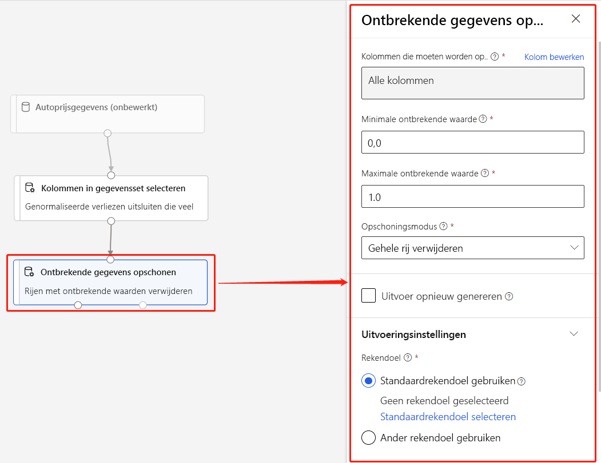

# Wat is een Azure Machine Learning-ontwerpfunctie (preview)? 
[!INCLUDE [applies-to-skus](../../includes/aml-applies-to-enterprise-sku.md)]

Met Azure Machine Learning designer u [gegevenssets](#datasets) en [modules](#module) visueel verbinden op een interactief canvas om machine learning-modellen te maken. Zie [Zelfstudie: Autoprijs voorspellen met de ontwerper](tutorial-designer-automobile-price-train-score.md) voor meer informatie over hoe u aan de slag gaan met de ontwerper

De ontwerper gebruikt uw Azure Machine [Learning-werkruimte](concept-workspace.md) om gedeelde bronnen te ordenen, zoals:

+ [Pijplijnen](#pipeline)
+ [Gegevenssets](#datasets)
+ [Rekenresources](#compute)
+ [Geregistreerde modellen](concept-azure-machine-learning-architecture.md#models)
+ [Gepubliceerde pijplijnen](#publish)
+ [Real-time eindpunten](#deploy)

## Modeltraining en -implementatie

De ontwerper geeft je een visueel canvas voor het bouwen, testen en implementeren van machine learning-modellen. Met de ontwerper u:

+ Gegevenssets en [datasets](#datasets) [modules](#module) slepen en neerzetten op het canvas.
+ Sluit de modules aan elkaar om een [pijplijnontwerp](#pipeline-draft)te maken.
+ Verzend een [pijplijnuitvoering](#pipeline-run) met behulp van de rekenbronnen in uw Azure Machine Learning-werkruimte.
+ Converteer uw **trainingspijplijnen** **naar inferencepipelines.**
+ [Publiceer](#publish) uw pijplijnen naar een eindpunt van de **REST-pijplijn** om nieuwe pijplijnuitvoeringen met verschillende parameters en gegevenssets in te dienen.
    + Publiceer een **trainingspijplijn** om één pijplijn opnieuw te gebruiken om meerdere modellen te trainen terwijl parameters en gegevenssets worden gewijzigd.
    + Publiceer een **batch-inference pipeline** om voorspellingen te doen over nieuwe gegevens met behulp van een eerder getraind model.
+ [Implementeer](#deploy) een **real-time inference pipeline** naar een real-time eindpunt om voorspellingen te doen over nieuwe gegevens in realtime.

## Pijplijn

Een [pijplijn](concept-azure-machine-learning-architecture.md#ml-pipelines) bestaat uit datasets en analytische modules, die je met elkaar verbindt. Pijpleidingen hebben vele toepassingen: u een pijpleiding maken die een enkel model traint, of een die meerdere modellen traint. U een pijplijn maken die voorspellingen in realtime of in batch maakt, of een pijplijn maken die alleen gegevens opschonen. Met pijplijnen u uw werk hergebruiken en uw projecten organiseren.

### Pijplijnontwerp

Terwijl u een pijplijn in de ontwerper bewerkt, wordt uw voortgang opgeslagen als een **pijplijnontwerp.** U op elk gewenst moment een pijplijnconcept bewerken door modules toe te voegen of te verwijderen, rekendoelen te configureren, parameters te maken, enzovoort.

Een geldige pijplijn heeft de volgende kenmerken:

* Gegevenssets kunnen alleen verbinding maken met modules.
* Modules kunnen alleen verbinding maken met gegevenssets of andere modules.
* Alle invoerpoorten voor modules moeten een verbinding hebben met de gegevensstroom.
* Alle vereiste parameters voor elke module moeten worden ingesteld.

Wanneer u klaar bent om uw pijplijnconcept uit te voeren, dient u een pijplijnrun in.

### Pijplijnrun

Telkens wanneer u een pijplijn uitvoert, worden de configuratie van de pijplijn en de resultaten ervan als **pijplijn uitgevoerd**in uw werkruimte opgeslagen. U teruggaan naar elke pijplijn die wordt uitgevoerd om deze te inspecteren op probleemoplossing of controledoeleinden. **Kloon** een pijplijnrun om een nieuw pijplijnconcept te maken dat u bewerken.

Pijplijnuitvoeringen zijn gegroepeerd in [experimenten](concept-azure-machine-learning-architecture.md#experiments) om rungeschiedenis te organiseren. U het experiment instellen voor elke pijplijnuitvoering. 

## Gegevenssets

Een machine learning-gegevensset maakt het eenvoudig om toegang te krijgen tot en met uw gegevens te werken. Een aantal voorbeeldgegevenssets zijn opgenomen in de ontwerper waarmee u experimenteren. U meer gegevenssets [registreren](how-to-create-register-datasets.md) als u ze nodig hebt.

## Module

Een module is een algoritme dat u met uw gegevens kunt uitvoeren. De ontwerper heeft een aantal modules, variërend van gegevens binnendringen functies tot training, scoren, en validatie processen.

Een module kan een reeks parameters hebben waarmee u de interne algoritmen van de module kunt configureren. Wanneer u een module op het canvas selecteert, worden de parameters van de module weergegeven in het deelvenster Properties, rechts van het canvas. U kunt de parameters in dit deelvenster wijzigen om het model af te stemmen. U de rekenresources voor afzonderlijke modules in de ontwerper instellen. 

Zie Overzicht van het [referentieoverzicht van & module](algorithm-module-reference/module-reference.md)

## Rekenresources

Gebruik rekenresources uit uw werkruimte om uw pijplijn uit te voeren en uw geïmplementeerde modellen te hosten als realtime eindpunten of pijplijneindpunten (voor batch-gevolgtrekking). De ondersteunde compute targets zijn:

| Rekendoel | Training | Implementatie |
| ---- |:----:|:----:|
| Azure Machine Learning compute | ✓ | |
| Azure Kubernetes Service | | ✓ |

Rekendoelen zijn gekoppeld aan uw [Azure Machine Learning-werkruimte.](concept-workspace.md) U beheert uw rekendoelen in uw werkruimte in [Azure Machine Learning Studio (klassiek).](https://ml.azure.com)

## Implementeren

Als u realtime inferencing wilt uitvoeren, moet u een pijplijn implementeren als een **realtime eindpunt.** Het realtime eindpunt creëert een interface tussen een externe toepassing en uw scoremodel. Een oproep naar een real-time eindpunt retourneert voorspellingsresultaten in realtime naar de toepassing. Als u een aanroep wilt voeren naar een realtime eindpunt, passeert u de API-sleutel die is gemaakt toen u het eindpunt hebt geïmplementeerd. Het eindpunt is gebaseerd op REST, een populaire architectuurkeuze voor webprogrammeringsprojecten.

Realtime eindpunten moeten worden geïmplementeerd in een Azure Kubernetes Service-cluster.

Zie [Zelfstudie: Een machine learning-model implementeren met de ontwerper](tutorial-designer-automobile-price-deploy.md)voor meer informatie over het implementeren van uw model.

## Publiceren

U ook een pijplijn naar een **pijplijneindpunt**publiceren. Net als bij een realtime eindpunt u met een eindpunt voor pijplijnnieuwe pijplijnuitvoeringen van externe toepassingen indienen met REST-aanroepen. U echter geen gegevens in realtime verzenden of ontvangen met behulp van een eindpunt van de pijplijn.

Gepubliceerde pijplijnen zijn flexibel, ze kunnen worden gebruikt om modellen te trainen of om te [scholen, batch-inferencing uit te voeren,](how-to-run-batch-predictions-designer.md)nieuwe gegevens te verwerken en nog veel meer. U meerdere pijplijnen publiceren naar één pijplijneindpunt en opgeven welke pijplijnversie moet worden uitgevoerd.

Een gepubliceerde pijplijn wordt uitgevoerd op de rekenbronnen die u definieert in het pijplijnconcept voor elke module.

De ontwerper maakt hetzelfde [Object PublishedPipeline](https://docs.microsoft.com/python/api/azureml-pipeline-core/azureml.pipeline.core.graph.publishedpipeline?view=azure-ml-py) als de SDK.

## Overstappen van de visuele interface naar de ontwerper

De visuele interface (preview) is bijgewerkt en is nu Azure Machine Learning designer (preview). De ontwerper is opnieuw ontworpen om een backend op basis van pijplijnen te gebruiken die volledig integreert met de andere functies van Azure Machine Learning. 

Als gevolg van deze updates zijn sommige concepten en termen voor de visuele interface gewijzigd of hernoemd. Zie de onderstaande tabel voor de belangrijkste conceptuele wijzigingen. 

| Concept in de ontwerper | Voorheen in de visuele interface |
| ---- |:----:|
| Pijplijnontwerp | Experiment |
| Real-time eindpunt | Webservice |

### Migreren naar de ontwerper

U bestaande visuele interface-experimenten en webservices converteren naar pijplijnen en realtime eindpunten in de ontwerper. Gebruik de volgende stappen om uw visuele interface-elementen te migreren:

[!INCLUDE [migrate from the visual interface](../../includes/aml-vi-designer-migration.md)]

## Volgende stappen

* Leer de basisprincipes van predictive analytics en machine learning met [Tutorial: Predict auto prijs with the designer](tutorial-designer-automobile-price-train-score.md)
* Meer informatie over het aanpassen van bestaande [designervoorbeelden](samples-designer.md) om ze aan te passen aan uw behoeften.

