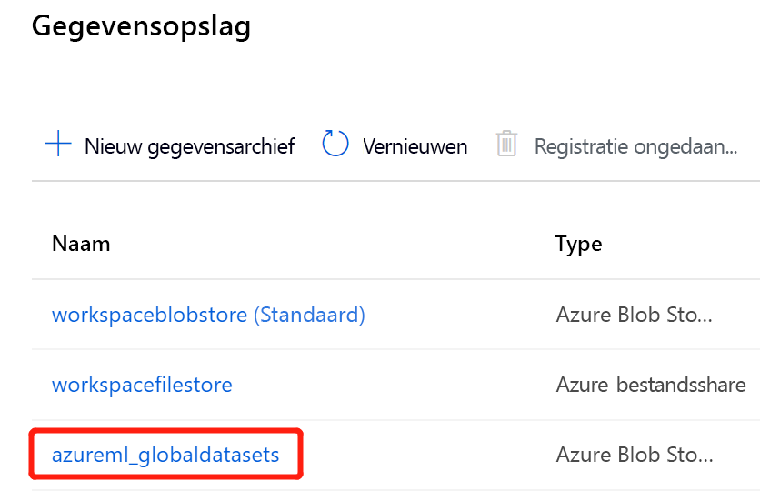

# <a name="connect-to-azure-storage-services"></a>Verbinding maken met Azure Storage-services
[!INCLUDE [aml-applies-to-basic-enterprise-sku](../../includes/aml-applies-to-basic-enterprise-sku.md)]

In dit artikel leert u hoe u verbinding kunt maken met Azure Storage-services via Azure Machine Learning gegevens opslag. Data stores Store-verbindings gegevens, zoals uw abonnements-ID en Token autorisatie in uw [Key Vault](https://azure.microsoft.com/services/key-vault/) die aan de werk ruimte zijn gekoppeld, zodat u veilig toegang kunt krijgen tot uw opslag zonder dat u deze hoeft te coderen in uw scripts. Zie het artikel over [beveiligde toegang](concept-data.md#data-workflow) als u wilt weten waar gegevens opslag in de werk stroom van Azure machine learning van de gehele Data Access passen.

U kunt gegevens opslag maken op basis van [deze Azure Storage-oplossingen](#matrix). Voor niet-ondersteunde opslag oplossingen en voor het opslaan van de kosten voor de uitvoer van gegevens tijdens machine learning experimenten, raden we u aan [uw gegevens](#move) naar ondersteunde Azure Storage-oplossingen te verplaatsen. 

## <a name="prerequisites"></a>Vereisten

U hebt het volgende nodig:
- Een Azure-abonnement. Als u geen Azure-abonnement hebt, maakt u een gratis account voordat u begint. Probeer de [gratis of betaalde versie van Azure machine learning](https://aka.ms/AMLFree).

- Een Azure-opslag account met een [Azure Blob-container](https://docs.microsoft.com/azure/storage/blobs/storage-blobs-overview) of een [Azure-bestands share](https://docs.microsoft.com/azure/storage/files/storage-files-introduction).

- De [Azure machine learning SDK voor python](https://docs.microsoft.com/python/api/overview/azure/ml/intro?view=azure-ml-py)of toegang tot [Azure machine learning Studio](https://ml.azure.com/).

- Een Azure Machine Learning-werkruimte.
  
  [Maak een Azure machine learning-werk ruimte](how-to-manage-workspace.md) of gebruik een bestaand item via de PYTHON-SDK. Importeer de `Workspace` `Datastore` -en-klasse en laad uw abonnements gegevens uit het bestand `config.json` met behulp van de functie `from_config()` . Hiermee zoekt u standaard naar het JSON-bestand in de huidige map, maar u kunt ook een para meter Path opgeven om naar het bestand te verwijzen met `from_config(path="your/file/path")` .

   ```Python
   import azureml.core
   from azureml.core import Workspace, Datastore
        
   ws = Workspace.from_config()
   ```
<a name="matrix"></a>

## <a name="supported-data-storage-service-types"></a>Ondersteunde service typen voor gegevens opslag

Data stores ondersteunen momenteel het opslaan van verbindings gegevens naar de opslag services die in de volgende matrix worden weer gegeven.

| Opslag &nbsp; type | Verificatie &nbsp; type | [Azure &nbsp; machine &nbsp; Learning Studio](https://ml.azure.com/) | [Azure &nbsp; machine &nbsp; Learning &nbsp; python SDK](https://docs.microsoft.com/python/api/overview/azure/ml/intro?view=azure-ml-py) |  [Azure &nbsp; machine &nbsp; Learning cli](reference-azure-machine-learning-cli.md) | [&nbsp;Rest API voor Azure machine &nbsp; Learning &nbsp;](https://docs.microsoft.com/rest/api/azureml/)
---|---|---|---|---|---
[Azure &nbsp; BLOB- &nbsp; opslag](https://docs.microsoft.com/azure/storage/blobs/storage-blobs-overview)| Accountsleutel <br> SAS-token | ✓ | ✓ | ✓ |✓
[Azure- &nbsp; bestands &nbsp; share](https://docs.microsoft.com/azure/storage/files/storage-files-introduction)| Accountsleutel <br> SAS-token | ✓ | ✓ | ✓ |✓
[Azure &nbsp; Data Lake &nbsp; Storage gen &nbsp; 1](https://docs.microsoft.com/azure/data-lake-store/)| Service-principal| ✓ | ✓ | ✓ |✓
[Azure &nbsp; Data Lake &nbsp; Storage gen &nbsp; 2](https://docs.microsoft.com/azure/storage/blobs/data-lake-storage-introduction)| Service-principal| ✓ | ✓ | ✓ |✓
[Azure &nbsp; SQL &nbsp; Data Base](https://docs.microsoft.com/azure/sql-database/sql-database-technical-overview)| SQL-verificatie <br>Service-principal| ✓ | ✓ | ✓ |✓
[Azure- &nbsp; postgresql](https://docs.microsoft.com/azure/postgresql/overview) | SQL-verificatie| ✓ | ✓ | ✓ |✓
[Azure &nbsp; Data Base &nbsp; for &nbsp; mysql](https://docs.microsoft.com/azure/mysql/overview) | SQL-verificatie|  | ✓* | ✓* |✓*
[Databricks- &nbsp; bestands &nbsp; systeem](https://docs.microsoft.com/azure/databricks/data/databricks-file-system)| Geen verificatie | | ✓** | ✓ ** |✓** 

* MySQL wordt alleen ondersteund voor pijplijn [DataTransferStep](https://docs.microsoft.com/python/api/azureml-pipeline-steps/azureml.pipeline.steps.datatransferstep?view=azure-ml-py). <br>
* * Databricks wordt alleen ondersteund voor pijplijn [DatabricksStep](https://docs.microsoft.com/python/api/azureml-pipeline-steps/azureml.pipeline.steps.databricks_step.databricksstep?view=azure-ml-py)

### <a name="storage-guidance"></a>Richtlijnen voor Azure Storage

We raden u aan een gegevens opslag voor een [Azure Blob-container](https://docs.microsoft.com/azure/storage/blobs/storage-blobs-introduction)te maken. Zowel Standard-als Premium-opslag zijn beschikbaar voor blobs. Hoewel Premium-opslag duurder is, kunnen de snellere doorvoer snelheden de snelheid van uw trainings uitvoeringen verbeteren, met name als u traint voor een grote gegevensset. Voor informatie over de kosten van opslag accounts raadpleegt u de [Azure-prijs calculator](https://azure.microsoft.com/pricing/calculator/?service=machine-learning-service).

[Azure data Lake Storage Gen2](https://docs.microsoft.com/azure/storage/blobs/data-lake-storage-introduction?toc=/azure/storage/blobs/toc.json) is gebaseerd op Azure Blob-opslag en ontworpen voor enter prise Big data-analyses. Een fundamenteel onderdeel van Data Lake Storage Gen2 is het toevoegen van een [hiërarchische naam ruimte](https://docs.microsoft.com/azure/storage/blobs/data-lake-storage-namespace) aan Blob Storage. De hiërarchische naam ruimte organiseert objecten/bestanden in een hiërarchie van mappen voor efficiënte gegevens toegang.

Wanneer u een werk ruimte maakt, worden er automatisch een Azure Blob-container en een Azure-bestands share geregistreerd in de werk ruimte. Ze hebben respectievelijk de naam `workspaceblobstore` en `workspacefilestore` . `workspaceblobstore`wordt gebruikt voor het opslaan van werk ruimte-artefacten en uw machine learning-experiment-Logboeken. `workspacefilestore`wordt gebruikt voor het opslaan van notitie blokken en R-scripts die zijn geautoriseerd via [Compute-instantie](https://docs.microsoft.com/azure/machine-learning/concept-compute-instance#accessing-files). De `workspaceblobstore` container wordt ingesteld als de standaard gegevens opslag.

> [!IMPORTANT]
> Met Azure Machine Learning Designer (preview) wordt automatisch een gegevens archief met de naam **azureml_globaldatasets** gemaakt wanneer u een voor beeld opent in de start pagina van de ontwerp functie. Dit gegevens archief bevat alleen voorbeeld gegevens sets. Gebruik deze gegevens opslag **niet** voor vertrouwelijke gegevens toegang.
> 

<a name="access"></a>

## <a name="create-and-register-datastores"></a>Gegevens opslag maken en registreren

Wanneer u een Azure Storage-oplossing registreert als een gegevens opslag, maakt en registreert u die gegevens opslag automatisch aan een specifieke werk ruimte. U kunt gegevens opslag voor een werk ruimte maken en registreren met behulp van de [python-SDK](#python-sdk) of [Azure machine learning Studio](#azure-machine-learning-studio).

>[!IMPORTANT]
> Als onderdeel van het proces voor het maken en registreren van de eerste gegevens opslag, Azure Machine Learning valideert of de onderliggende opslag service bestaat en of de door de gebruiker aangelegde principal (gebruikers naam, Service-Principal of SAS-token) toegang heeft tot die opslag. Voor Azure Data Lake Storage data stores van 1 en 2 wordt deze validatie echter later uitgevoerd, wanneer methoden voor gegevens toegang, zoals [`from_files()`](https://docs.microsoft.com/python/api/azureml-core/azureml.data.dataset_factory.filedatasetfactory?view=azure-ml-py) of [`from_delimited_files()`](https://docs.microsoft.com/python/api/azureml-core/azureml.data.dataset_factory.tabulardatasetfactory?view=azure-ml-py#from-parquet-files-path--validate-true--include-path-false--set-column-types-none--partition-format-none-) worden genoemd. 
<br><br>
Nadat Data Store is gemaakt, wordt deze validatie alleen uitgevoerd voor methoden waarvoor toegang tot de onderliggende opslag container is vereist. **niet** elke keer dat de objecten gegevens opslag worden opgehaald. Validatie vindt bijvoorbeeld plaats als u bestanden wilt downloaden uit uw gegevens archief. maar als u de standaard gegevens opslag gewoon wilt wijzigen, vindt validatie niet plaats.

### <a name="python-sdk"></a>Python-SDK

Alle registratie methoden bevinden zich op de [`Datastore`](https://docs.microsoft.com/python/api/azureml-core/azureml.core.datastore(class)?view=azure-ml-py) klasse en hebben het formulier `register_azure_*` .
> [!IMPORTANT]
> Als uw opslag account zich in een virtueel netwerk bevindt, wordt alleen het maken van gegevens opslag **via de SDK** ondersteund.

U vindt de informatie die u nodig hebt om de `register_azure_*()` methode op de [Azure Portal](https://portal.azure.com)in te vullen.

* Als u van plan bent om een account sleutel of SAS-token voor verificatie te gebruiken, selecteert u **opslag accounts** in het linkerdeel venster en kiest u het opslag account dat u wilt registreren. 
  * De **overzichts** pagina bevat informatie zoals de account naam, container en naam van de bestands share. 
      1. Ga voor account sleutels naar **toegangs sleutels** in het deel venster **instellingen** . 
      1. Voor SAS-tokens gaat u naar de **hand tekeningen voor gedeelde toegang** in het deel venster **instellingen** .

* Als u van plan bent om een service principe voor verificatie te gebruiken, gaat u naar uw **app-registraties** en selecteert u welke app u wilt gebruiken. 
    * De bijbehorende **overzichts** pagina bevat de vereiste informatie, zoals Tenant-id en client-id.

> [!IMPORTANT]
> Uit veiligheids overwegingen moet u mogelijk uw toegangs sleutels wijzigen voor een Azure Storage account (account sleutel of SAS-token). Wanneer u dit doet, moet u de nieuwe referenties synchroniseren met uw werk ruimte en de gegevens opslag die ermee zijn verbonden. Meer informatie over hoe u uw bijgewerkte referenties synchroniseert met [deze stappen](how-to-change-storage-access-key.md). 

In de volgende voor beelden ziet u hoe u een Azure Blob-container, een Azure-bestands share en Azure Data Lake Storage generatie 2 kunt registreren als gegevens opslag. De para meters die in deze voor beelden worden opgegeven, zijn de **vereiste para meters** voor het maken en registreren van een gegevens opslag. 

Raadpleeg de [referentie documentatie voor de toepasselijke `register_azure_*` methoden](https://docs.microsoft.com/python/api/azureml-core/azureml.core.datastore.datastore?view=azure-ml-py#methods)om gegevens opslag te maken voor de andere Storage-services en de optionele para meters voor deze methoden te bekijken.

#### <a name="blob-container"></a>Blobcontainer

Als u een Azure Blob-container wilt registreren als gegevens opslag, gebruikt u [`register_azure_blob-container()`](https://docs.microsoft.com/python/api/azureml-core/azureml.core.datastore(class)?view=azure-ml-py#register-azure-blob-container-workspace--datastore-name--container-name--account-name--sas-token-none--account-key-none--protocol-none--endpoint-none--overwrite-false--create-if-not-exists-false--skip-validation-false--blob-cache-timeout-none--grant-workspace-access-false--subscription-id-none--resource-group-none-) .

Met de volgende code wordt het gegevens archief gemaakt en geregistreerd `blob_datastore_name` in de `ws` werk ruimte. Deze Data Store heeft toegang tot de `my-container-name` BLOB-container op het `my-account-name` opslag account met behulp van de gegeven toegangs sleutel voor het account.

```Python
blob_datastore_name='azblobsdk' # Name of the datastore to workspace
container_name=os.getenv("BLOB_CONTAINER", "<my-container-name>") # Name of Azure blob container
account_name=os.getenv("BLOB_ACCOUNTNAME", "<my-account-name>") # Storage account name
account_key=os.getenv("BLOB_ACCOUNT_KEY", "<my-account-key>") # Storage account access key

blob_datastore = Datastore.register_azure_blob_container(workspace=ws, 
                                                         datastore_name=blob_datastore_name, 
                                                         container_name=container_name, 
                                                         account_name=account_name,
                                                         account_key=account_key)
```
Als uw BLOB-container zich in een virtueel netwerk bevindt, neemt u de para meter `skip_validation=True` op in uw [`register_azure_blob-container()`](https://docs.microsoft.com/python/api/azureml-core/azureml.core.datastore(class)?view=azure-ml-py#register-azure-blob-container-workspace--datastore-name--container-name--account-name--sas-token-none--account-key-none--protocol-none--endpoint-none--overwrite-false--create-if-not-exists-false--skip-validation-false--blob-cache-timeout-none--grant-workspace-access-false--subscription-id-none--resource-group-none-) methode. 

#### <a name="file-share"></a>Bestandsshare

Als u een Azure-bestands share wilt registreren als gegevens opslag, gebruikt u [`register_azure_file_share()`](https://docs.microsoft.com/python/api/azureml-core/azureml.core.datastore(class)?view=azure-ml-py#register-azure-file-share-workspace--datastore-name--file-share-name--account-name--sas-token-none--account-key-none--protocol-none--endpoint-none--overwrite-false--create-if-not-exists-false--skip-validation-false-) . 

Met de volgende code wordt het gegevens archief gemaakt en geregistreerd `file_datastore_name` in de `ws` werk ruimte. Deze Data Store heeft toegang tot de `my-fileshare-name` Bestands share op het `my-account-name` opslag account met behulp van de gegeven toegangs sleutel voor het account.

```Python
file_datastore_name='azfilesharesdk' # Name of the datastore to workspace
file_share_name=os.getenv("FILE_SHARE_CONTAINER", "<my-fileshare-name>") # Name of Azure file share container
account_name=os.getenv("FILE_SHARE_ACCOUNTNAME", "<my-account-name>") # Storage account name
account_key=os.getenv("FILE_SHARE_ACCOUNT_KEY", "<my-account-key>") # Storage account access key

file_datastore = Datastore.register_azure_file_share(workspace=ws,
                                                     datastore_name=file_datastore_name, 
                                                     file_share_name=file_share_name, 
                                                     account_name=account_name,
                                                     account_key=account_key)
```
Als uw bestands share zich in een virtueel netwerk bevindt, neemt u de para meter `skip_validation=True` op in uw [`register_azure_file_share()`](https://docs.microsoft.com/python/api/azureml-core/azureml.core.datastore(class)?view=azure-ml-py#register-azure-file-share-workspace--datastore-name--file-share-name--account-name--sas-token-none--account-key-none--protocol-none--endpoint-none--overwrite-false--create-if-not-exists-false--skip-validation-false-) methode. 

#### <a name="azure-data-lake-storage-generation-2"></a>Azure Data Lake Storage generatie 2

Gebruik [register_azure_data_lake_gen2 ()](https://docs.microsoft.com/python/api/azureml-core/azureml.core.datastore.datastore?view=azure-ml-py#register-azure-data-lake-gen2-workspace--datastore-name--filesystem--account-name--tenant-id--client-id--client-secret--resource-url-none--authority-url-none--protocol-none--endpoint-none--overwrite-false-) voor het registreren van een Azure data Lake Storage Generation 2 (ADLS gen 2) om het opslaan van referenties die zijn verbonden met een Azure DataLake gen 2-opslag met [Service-Principal-machtigingen](https://docs.microsoft.com/azure/active-directory/develop/howto-create-service-principal-portal). Als u de Service-Principal wilt gebruiken, moet u [uw toepassing registreren](https://docs.microsoft.com/azure/active-directory/develop/app-objects-and-service-principals) en de service-principal met toegang tot *BLOB-gegevens lezer* verlenen. Meer informatie over [toegangs beheer dat is ingesteld voor ADLS gen 2](https://docs.microsoft.com/azure/storage/blobs/data-lake-storage-access-control). 

Als u de Service-Principal wilt gebruiken, moet u [uw toepassing registreren](https://docs.microsoft.com/azure/active-directory/develop/app-objects-and-service-principals) en de service-principal met de juiste gegevens toegang verlenen. Meer informatie over [toegangs beheer dat is ingesteld voor ADLS gen 2](https://docs.microsoft.com/azure/storage/blobs/data-lake-storage-access-control). 

Met de volgende code wordt het gegevens archief gemaakt en geregistreerd `adlsgen2_datastore_name` in de `ws` werk ruimte. Deze Data Store heeft toegang tot het bestands systeem `test` in het `account_name` opslag account met behulp van de gegeven referenties voor de Service-Principal.

```python 
adlsgen2_datastore_name = 'adlsgen2datastore'

subscription_id=os.getenv("ADL_SUBSCRIPTION", "<my_subscription_id>") # subscription id of ADLS account
resource_group=os.getenv("ADL_RESOURCE_GROUP", "<my_resource_group>") # resource group of ADLS account

account_name=os.getenv("ADLSGEN2_ACCOUNTNAME", "<my_account_name>") # ADLS Gen2 account name
tenant_id=os.getenv("ADLSGEN2_TENANT", "<my_tenant_id>") # tenant id of service principal
client_id=os.getenv("ADLSGEN2_CLIENTID", "<my_client_id>") # client id of service principal
client_secret=os.getenv("ADLSGEN2_CLIENT_SECRET", "<my_client_secret>") # the secret of service principal

adlsgen2_datastore = Datastore.register_azure_data_lake_gen2(workspace=ws,
                                                             datastore_name=adlsgen2_datastore_name,
                                                             account_name=account_name, # ADLS Gen2 account name
                                                             filesystem='test', # ADLS Gen2 filesystem
                                                             tenant_id=tenant_id, # tenant id of service principal
                                                             client_id=client_id, # client id of service principal
                                                             client_secret=client_secret) # the secret of service principal
```

### <a name="azure-machine-learning-studio"></a>Azure Machine Learning Studio 

Maak een nieuwe gegevens opslag in een paar stappen in Azure Machine Learning studio:

> [!IMPORTANT]
> Als uw opslag account zich in een virtueel netwerk bevindt, wordt alleen het maken van gegevens opslag [via de SDK](#python-sdk) ondersteund. 

1. Meld u aan bij [Azure Machine Learning Studio](https://ml.azure.com/).
1. Selecteer **gegevens opslag** in het linkerdeel venster onder **beheren**.
1. Selecteer **+ Nieuw gegevensarchief**.
1. Vul het formulier in voor een nieuwe gegevens opslag. Het formulier wordt intelligent bijgewerkt op basis van uw selecties voor het Azure-opslag type en verificatie type.
  
U kunt de informatie vinden die u nodig hebt om het formulier op de [Azure Portal](https://portal.azure.com)in te vullen. Selecteer **opslag accounts** in het linkerdeel venster en kies het opslag account dat u wilt registreren. De **overzichts** pagina bevat informatie zoals de account naam, container en naam van de bestands share. 

* Ga voor verificatie-items, zoals account sleutel of SAS-token, naar **toegangs sleutels** in het deel venster **instellingen** . 

* Voor Service-Principal-items, zoals Tenant-ID en client-ID, gaat u naar uw **app-registraties** en selecteert u welke app u wilt gebruiken. De bijbehorende **overzichts** pagina bevat deze items. 

> [!IMPORTANT]
> Uit veiligheids overwegingen moet u mogelijk uw toegangs sleutels wijzigen voor een Azure Storage account (account sleutel of SAS-token). Wanneer u dit doet, moet u de nieuwe referenties synchroniseren met uw werk ruimte en de gegevens opslag die ermee zijn verbonden. Meer informatie over hoe u uw bijgewerkte referenties synchroniseert met [deze stappen](how-to-change-storage-access-key.md). 

In het volgende voor beeld ziet u hoe het formulier eruitziet wanneer u een Azure Blob-gegevens opslag maakt: 
    


<a name="get"></a>

## <a name="get-datastores-from-your-workspace"></a>Gegevens opslag ophalen uit uw werk ruimte

Als u een specifieke gegevens opslag die in de huidige werk ruimte is geregistreerd wilt ophalen, gebruikt u de [`get()`](https://docs.microsoft.com/python/api/azureml-core/azureml.core.datastore(class)?view=azure-ml-py#get-workspace--datastore-name-) statische methode voor de `Datastore` klasse:

```Python
# Get a named datastore from the current workspace
datastore = Datastore.get(ws, datastore_name='your datastore name')
```
Als u de lijst met gegevens opslag die is geregistreerd met een bepaalde werk ruimte wilt ophalen, kunt u de [`datastores`](https://docs.microsoft.com/python/api/azureml-core/azureml.core.workspace%28class%29?view=azure-ml-py#datastores) eigenschap gebruiken voor een werkruimte object:

```Python
# List all datastores registered in the current workspace
datastores = ws.datastores
for name, datastore in datastores.items():
    print(name, datastore.datastore_type)
```

Als u de standaard gegevens opslag van de werk ruimte wilt ophalen, gebruikt u deze regel:

```Python
datastore = ws.get_default_datastore()
```
U kunt ook de standaard gegevens opslag wijzigen met de volgende code. Deze mogelijkheid wordt alleen ondersteund via de SDK. 

```Python
 ws.set_default_datastore(new_default_datastore)
```
<a name="up-and-down"></a>
## <a name="upload-and-download-data"></a>Gegevens uploaden en downloaden

De [`upload()`](https://docs.microsoft.com/python/api/azureml-core/azureml.data.azure_storage_datastore.azureblobdatastore?view=azure-ml-py#upload-src-dir--target-path-none--overwrite-false--show-progress-true-) methoden en die [`download()`](https://docs.microsoft.com/python/api/azureml-core/azureml.data.azure_storage_datastore.azureblobdatastore?view=azure-ml-py#download-target-path--prefix-none--overwrite-false--show-progress-true-) in de volgende voor beelden worden beschreven, zijn specifiek voor de klassen [AzureBlobDatastore](https://docs.microsoft.com/python/api/azureml-core/azureml.data.azure_storage_datastore.azureblobdatastore?view=azure-ml-py) en [AzureFileDatastore](https://docs.microsoft.com/python/api/azureml-core/azureml.data.azure_storage_datastore.azurefiledatastore?view=azure-ml-py) .

> [!NOTE]
> Het uploaden naar AzureDataLakeGen2-gegevens opslag wordt op dit moment niet ondersteund.

### <a name="upload"></a>Uploaden

Een map of afzonderlijke bestanden naar het gegevens archief uploaden met behulp van de python-SDK:

```Python
datastore.upload(src_dir='your source directory',
                 target_path='your target path',
                 overwrite=True,
                 show_progress=True)
```

De `target_path` para meter geeft de locatie in de bestands share (of BLOB-container) op die moet worden geüpload. De standaard instelling `None` is dat de gegevens naar de hoofdmap worden geüpload. Als `overwrite=True` alle bestaande gegevens op `target_path` worden overschreven.

U kunt ook een lijst met afzonderlijke bestanden uploaden naar het gegevens archief via de- `upload_files()` methode.

### <a name="download"></a>Downloaden

Gegevens uit een gegevens opslag naar uw lokale bestands systeem downloaden:

```Python
datastore.download(target_path='your target path',
                   prefix='your prefix',
                   show_progress=True)
```

De `target_path` para meter is de locatie van de lokale map waarnaar de gegevens moeten worden gedownload. Geef het pad op naar de map in de bestands share (of BLOB-container) om te downloaden `prefix` . Als `prefix` dat zo is `None` , wordt alle inhoud van de bestands share (of BLOB-container) gedownload.

<a name="train"></a>

## <a name="access-your-data-during-training"></a>Toegang tot uw gegevens tijdens de training

Als u wilt werken met gegevens in uw gegevens opslag of als u uw gegevens wilt inpakken in een verbruikt object voor machine learning taken, zoals training, [maakt u een Azure machine learning-gegevensset](how-to-create-register-datasets.md). Gegevens sets bieden functies die tabellaire gegevens laden in een Panda of Spark-data frame. Gegevens sets bieden ook de mogelijkheid om bestanden te downloaden of te koppelen van een wille keurige indeling vanuit Azure Blob-opslag, Azure Files, Azure Data Lake Storage Gen1, Azure Data Lake Storage Gen2, Azure SQL Database en Azure Database for PostgreSQL. Meer [informatie over het trainen van gegevens sets](how-to-train-with-datasets.md).

### <a name="accessing-source-code-during-training"></a>Toegang tot de bron code tijdens de training

Azure Blob-opslag heeft hogere doorvoer snelheden dan een Azure-bestands share en schaalt naar een groot aantal taken die parallel worden gestart. Daarom is het raadzaam om uw uitvoeringen te configureren voor het gebruik van Blob-opslag voor het overdragen van broncode bestanden.

In het volgende code voorbeeld wordt de uitvoerings configuratie opgegeven die BLOB-gegevens opslag moet gebruiken voor bron code overdrachten.

```python 
# workspaceblobstore is the default blob storage
run_config.source_directory_data_store = "workspaceblobstore" 
```

## <a name="access-data-during-scoring"></a>Toegang tot gegevens tijdens de Score

Azure Machine Learning biedt verschillende manieren om uw modellen te gebruiken voor het scoren van punten. Sommige van deze methoden bieden geen toegang tot gegevens opslag. Gebruik de volgende tabel om inzicht te krijgen in de methoden waarmee u toegang hebt tot gegevens opslag in de Score:

| Methode | Toegang tot Data Store | Beschrijving |
| ----- | :-----: | ----- |
| [Batchvoorspelling](how-to-use-parallel-run-step.md) | ✔ | Doe asynchroon voorspellingen op grote hoeveelheden gegevens. |
| [-Webservice](how-to-deploy-and-where.md) | &nbsp; | Implementeer modellen als een webservice. |
| [Module Azure IoT Edge](how-to-deploy-and-where.md) | &nbsp; | Implementeer modellen om apparaten te IoT Edge. |

In situaties waarin de SDK geen toegang biedt tot gegevens opslag, kunt u mogelijk aangepaste code maken met behulp van de relevante Azure SDK om toegang te krijgen tot de data. De [Azure Storage SDK voor python](https://github.com/Azure/azure-storage-python) is bijvoorbeeld een client bibliotheek die u kunt gebruiken om toegang te krijgen tot gegevens die zijn opgeslagen in blobs of bestanden.

<a name="move"></a>

## <a name="move-data-to-supported-azure-storage-solutions"></a>Gegevens verplaatsen naar ondersteunde Azure Storage-oplossingen

Azure Machine Learning ondersteunt het openen van gegevens vanuit Azure Blob Storage, Azure Files, Azure Data Lake Storage Gen1, Azure Data Lake Storage Gen2, Azure SQL Database en Azure Database for PostgreSQL. Als u niet-ondersteunde opslag gebruikt, raden we u aan om uw gegevens te verplaatsen naar ondersteunde Azure-opslag oplossingen door gebruik te maken van [Azure Data Factory en deze stappen uit te voeren](https://docs.microsoft.com/azure/data-factory/quickstart-create-data-factory-copy-data-tool). Het verplaatsen van gegevens naar ondersteunde opslag kan u helpen bij het opslaan van de kosten voor de uitvoer van gegevens tijdens machine learning experimenten. 

Azure Data Factory biedt een efficiënte en robuuste gegevens overdracht met meer dan 80 vooraf ontwikkelde connectors zonder extra kosten. Deze connectors zijn onder andere Azure Data Services, on-premises gegevens bronnen, Amazon S3 en Redshift en Google BigQuery.

## <a name="next-steps"></a>Volgende stappen

* [Een Azure machine learning-gegevensset maken](how-to-create-register-datasets.md)
* [Een model trainen](how-to-train-ml-models.md)
* [Een model implementeren](how-to-deploy-and-where.md)
