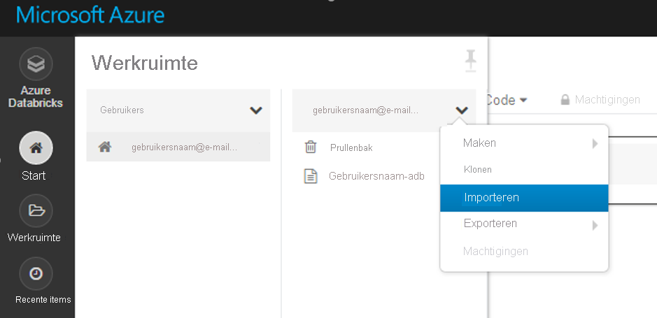
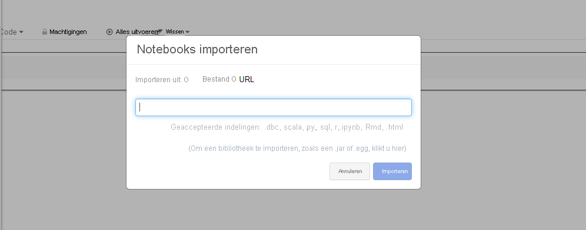

# <a name="configure-a-development-environment-for-azure-machine-learning"></a>Een ontwikkel omgeving configureren voor Azure Machine Learning
[!INCLUDE [applies-to-skus](../../includes/aml-applies-to-basic-enterprise-sku.md)]

In dit artikel leert u hoe u een ontwikkel omgeving kunt configureren om met Azure Machine Learning te werken. Azure Machine Learning is platform neutraal. De enige harde vereiste voor uw ontwikkel omgeving is python 3. Een geïsoleerde omgeving zoals Anaconda of virtualenv wordt ook aanbevolen.

In de volgende tabel ziet u elke ontwikkel omgeving die in dit artikel wordt behandeld, samen met de voor-en nadelen.

| Omgeving | Voordelen | Nadelen |
| --- | --- | --- |
| [Azure Machine Learning Compute-instantie in de Cloud (preview-versie)](#compute-instance) | Eenvoudigste manier om aan de slag te gaan. De volledige SDK is al geïnstalleerd in uw werk ruimte-VM en de notitieblok zelfstudies zijn vooraf gekloond en klaar om te worden uitgevoerd. | Geen controle over uw ontwikkel omgeving en afhankelijkheden. Er zijn extra kosten verbonden aan de virtuele Linux-machine (VM kan worden gestopt wanneer deze niet wordt gebruikt om kosten te voor komen). Zie de [prijs informatie](https://azure.microsoft.com/pricing/details/virtual-machines/linux/). |
| [Lokale omgeving](#local) | Volledig beheer van uw ontwikkel omgeving en afhankelijkheden. Voer uit met een hulp programma, omgeving of IDE van uw keuze. | Duurt langer om aan de slag te gaan. De benodigde SDK-pakketten moeten worden geïnstalleerd en er moet ook een omgeving worden geïnstalleerd als u er nog geen hebt. |
| [Azure Databricks](#aml-databricks) | Ideaal voor het uitvoeren van grootschalige intensieve machine learning werk stromen op het schaal bare Apache Spark platform. | Overbodig voor experimentele machine learning, of kleinschalige experimenten en werk stromen. Er zijn extra kosten gemaakt voor Azure Databricks. Zie de [prijs informatie](https://azure.microsoft.com/pricing/details/databricks/). |
| [De Data Science Virtual Machine (DSVM)](#dsvm) | Vergelijkbaar met het Cloud Compute-exemplaar (python en de SDK zijn vooraf geïnstalleerd), maar met extra populaire gegevens wetenschap en machine learning-hulpprogram ma's vooraf geïnstalleerd. Eenvoudig te schalen en combi neren met andere aangepaste hulp middelen en werk stromen. | Een langzamere aan de slag-ervaring in vergelijking met het Cloud Compute-exemplaar. |

Dit artikel bevat ook extra tips voor het gebruik van de volgende hulpprogram ma's:

* [Jupyter-notebooks](#jupyter): als u al gebruikmaakt van de Jupyter notebook, heeft de SDK enkele extra's die u moet installeren.

* [Visual Studio code](#vscode): als u Visual Studio code gebruikt, bevat de [uitbrei ding](https://marketplace.visualstudio.com/items?itemName=ms-toolsai.vscode-ai) van de Azure machine learning uitgebreide taal ondersteuning voor python, evenals functies om met de Azure machine learning veel handiger en productief te werken.

## <a name="prerequisites"></a>Vereisten

Een Azure Machine Learning-werkruimte. Zie [een Azure machine learning-werk ruimte maken](how-to-manage-workspace.md)voor het maken van de werk ruimte. Een werk ruimte is alles wat u nodig hebt om aan de slag te gaan met uw eigen [cloud-gebaseerde Notebook server](#compute-instance), een [DSVM](#dsvm)of [Azure Databricks](#aml-databricks).

Als u de SDK-omgeving voor uw [lokale computer](#local)wilt installeren, [Jupyter notebook server](#jupyter) of [Visual Studio code](#vscode) die u ook nodig hebt:

- Het [Anaconda](https://www.anaconda.com/download/) -of [Miniconda](https://conda.io/miniconda.html) -pakket beheer.

- Op Linux of macOS hebt u de bash-shell nodig.

    > [!TIP]
    > Als u gebruikmaakt van Linux of macOS en een andere shell dan bash gebruikt (bijvoorbeeld zsh), kunnen er fouten optreden wanneer u sommige opdrachten uitvoert. U kunt dit probleem omzeilen door de `bash` opdracht te gebruiken om een nieuwe bash-shell te starten en de opdrachten daar uit te voeren.

- In Windows hebt u de opdracht prompt of Anaconda prompt (geïnstalleerd door Anaconda en Miniconda).

## <a name="your-own-cloud-based-compute-instance"></a><a id="compute-instance"></a>Uw eigen Cloud computer exemplaar

Het Azure Machine Learning [Compute-exemplaar (preview)](concept-compute-instance.md) is een veilig Azure-werk station in de cloud dat gegevens wetenschappers levert met een Jupyter notebook-server, jjupyterlab en een volledig bereide ml-omgeving.

Er is niets om te installeren of te configureren voor een reken instantie.  Maak een wille keurig moment in uw Azure Machine Learning-werk ruimte. Geef een naam op en geef een Azure VM-type op. Probeer het nu met deze [zelf studie: omgeving en werk ruimte voor installatie](tutorial-1st-experiment-sdk-setup.md).

Meer informatie over [Compute-exemplaren](concept-compute-instance.md).

Als u de reken kosten wilt stoppen, [stopt u het reken exemplaar](tutorial-1st-experiment-sdk-train.md#clean-up-resources).

## <a name="data-science-virtual-machine"></a><a id="dsvm"></a>Data Science Virtual Machine

De DSVM is een aangepaste installatie kopie van een virtuele machine (VM). Het is ontworpen voor data wetenschappen werk dat vooraf is geconfigureerd met:

  - Pakketten zoals tensor flow, PyTorch, Scikit-learn, XGBoost en de Azure Machine Learning SDK
  - Populaire hulp middelen voor gegevens wetenschap, zoals zelfstandig en analyse van Spark
  - Azure-hulpprogram ma's zoals Azure CLI, AzCopy en Storage Explorer
  - Integrated Development Environments (Ide's) zoals Visual Studio code en PyCharm
  - Jupyter Notebook server

De Azure Machine Learning SDK werkt op de Ubuntu-of Windows-versie van de DSVM. Maar als u van plan bent om de DSVM te gebruiken als een reken doel, wordt alleen Ubuntu ondersteund.

De DSVM als een ontwikkel omgeving gebruiken:

1. Maak een DSVM in een van de volgende omgevingen:

    * De Azure Portal:

        * [Een Ubuntu Data Science Virtual Machine maken](https://docs.microsoft.com/azure/machine-learning/data-science-virtual-machine/dsvm-ubuntu-intro)

        * [Een Windows Data Science Virtual Machine maken](https://docs.microsoft.com/azure/machine-learning/data-science-virtual-machine/provision-vm)

    * De Azure CLI:

        > [!IMPORTANT]
        > * Wanneer u de Azure CLI gebruikt, moet u zich eerst aanmelden bij uw Azure-abonnement met behulp van de `az login` opdracht.
        >
        > * Wanneer u de opdrachten in deze stap gebruikt, moet u een naam opgeven voor de resource groep, een naam voor de virtuele machine, een gebruikers naam en een wacht woord.

        * Als u een Ubuntu-Data Science Virtual Machine wilt maken, gebruikt u de volgende opdracht:

            ```azurecli-interactive
            # create a Ubuntu DSVM in your resource group
            # note you need to be at least a contributor to the resource group in order to execute this command successfully
            # If you need to create a new resource group use: "az group create --name YOUR-RESOURCE-GROUP-NAME --location YOUR-REGION (For example: westus2)"
            az vm create --resource-group YOUR-RESOURCE-GROUP-NAME --name YOUR-VM-NAME --image microsoft-dsvm:linux-data-science-vm-ubuntu:linuxdsvmubuntu:latest --admin-username YOUR-USERNAME --admin-password YOUR-PASSWORD --generate-ssh-keys --authentication-type password
            ```

        * Als u een Windows-Data Science Virtual Machine wilt maken, gebruikt u de volgende opdracht:

            ```azurecli-interactive
            # create a Windows Server 2016 DSVM in your resource group
            # note you need to be at least a contributor to the resource group in order to execute this command successfully
            az vm create --resource-group YOUR-RESOURCE-GROUP-NAME --name YOUR-VM-NAME --image microsoft-dsvm:dsvm-windows:server-2016:latest --admin-username YOUR-USERNAME --admin-password YOUR-PASSWORD --authentication-type password
            ```

2. De Azure Machine Learning SDK is al geïnstalleerd op de DSVM. Als u de Conda-omgeving met de SDK wilt gebruiken, gebruikt u een van de volgende opdrachten:

    * Voor Ubuntu DSVM:

        ```bash
        conda activate py36
        ```

    * Voor Windows DSVM:

        ```bash
        conda activate AzureML
        ```

1. Gebruik de volgende python-code om te controleren of u toegang hebt tot de SDK en de versie kunt controleren:

    ```python
    import azureml.core
    print(azureml.core.VERSION)
    ```

1. Zie de sectie [een configuratie bestand voor een werk ruimte maken](#workspace) om de DSVM te configureren voor het gebruik van uw Azure machine learning-werk ruimte.

Zie [Data Science virtual machines](https://azure.microsoft.com/services/virtual-machines/data-science-virtual-machines/)voor meer informatie.

## <a name="local-computer"></a><a id="local"></a>Lokale computer

Wanneer u een lokale computer gebruikt (dit kan ook een externe virtuele machine zijn), maakt u een Anaconda-omgeving en installeert u de SDK. Hier volgt een voorbeeld:

1. Down load en Installeer [Anaconda](https://www.anaconda.com/distribution/#download-section) (python 3,7-versie) als u dit nog niet hebt gedaan.

1. Open een Anaconda-prompt en maak een omgeving met de volgende opdrachten:

    Voer de volgende opdracht uit om de omgeving te maken.

    ```bash
    conda create -n myenv python=3.7.7
    ```

    Activeer vervolgens de omgeving.

    ```bash
    conda activate myenv
    ```

    In dit voor beeld wordt een omgeving gemaakt met behulp van python 3.7.7, maar alle specifieke subversies kunnen worden gekozen. SDK-compatibiliteit is mogelijk niet gegarandeerd met bepaalde primaire versies (3.5 + wordt aanbevolen) en het wordt aanbevolen een andere versie/Subversion te gebruiken in uw Anaconda-omgeving als u fouten ondervindt. Het duurt enkele minuten om de omgeving te maken terwijl onderdelen en pakketten worden gedownload.

1. Voer de volgende opdrachten uit in uw nieuwe omgeving om specifieke IPython-kernels in te scha kelen. Dit zorgt voor een verwachte kernel-en pakket import gedrag bij het werken met Jupyter-notebooks in Anaconda-omgevingen:

    ```bash
    conda install notebook ipykernel
    ```

    Voer vervolgens de volgende opdracht uit om de kernel te maken:

    ```bash
    ipython kernel install --user --name myenv --display-name "Python (myenv)"
    ```

1. Gebruik de volgende opdrachten om pakketten te installeren:

    Met deze opdracht wordt de basis-Azure Machine Learning SDK met notebook en `automl` extra's geïnstalleerd. De `automl` extra is een grote installatie. u kunt de vier Kante haken verwijderen als u niet van plan bent om automatische machine learning experimenten uit te voeren. De `automl` Extra bevat ook de Azure machine learning data prep SDK standaard als een afhankelijkheid.

    ```bash
    pip install azureml-sdk[notebooks,automl]
    ```

   > [!NOTE]
   > * Als u een bericht krijgt dat PyYAML niet kan worden verwijderd, gebruikt u in plaats daarvan de volgende opdracht:
   >
   >   `pip install --upgrade azureml-sdk[notebooks,automl] --ignore-installed PyYAML`
   >
   > * Vanaf macOS Catalina is zsh (Z Shell) de standaard aanmeldings shell en de interactieve shell. Gebruik in zsh de volgende opdracht waarmee haakjes worden voorafgegaan door " \\ " (back slash):
   >
   >   `pip install --upgrade azureml-sdk\[notebooks,automl\]`

   Het duurt enkele minuten voordat de SDK is geïnstalleerd. Zie de [installatie handleiding](https://docs.microsoft.com/python/api/overview/azure/ml/install?view=azure-ml-py)voor meer informatie over installatie opties.

1. Installeer andere pakketten voor uw machine learning experimenten.

    Gebruik een van de volgende opdrachten en vervang door *\<new package>* het pakket dat u wilt installeren. `conda install`Voor het installeren van pakketten via moet het pakket deel uitmaken van de huidige kanalen (nieuwe kanalen kunnen worden toegevoegd in de Anaconda-Cloud).

    ```bash
    conda install <new package>
    ```

    U kunt ook pakketten installeren via `pip` .

    ```bash
    pip install <new package>
    ```

### <a name="jupyter-notebooks"></a><a id="jupyter"></a>Jupyter Notebooks

Jupyter-notebooks maken deel uit van het [Jupyter-project](https://jupyter.org/). Ze bieden een interactieve coderings ervaring waarbij u documenten maakt waarmee live code wordt gecombineerd met tekst en afbeeldingen. Jupyter-notebooks zijn ook een fantastische manier om uw resultaten te delen met anderen, omdat u de uitvoer van uw code secties in het document kunt opslaan. U kunt Jupyter-notebooks installeren op verschillende platforms.

De procedure in de sectie [lokale computer](#local) installeert de vereiste onderdelen voor het uitvoeren van Jupyter-notebooks in een Anaconda-omgeving.

Deze onderdelen in uw Jupyter Notebook omgeving inschakelen:

1. Open een Anaconda-prompt en activeer uw omgeving.

    ```bash
    conda activate myenv
    ```

1. Kloon [de GitHub-opslag plaats](https://aka.ms/aml-notebooks) voor een aantal voorbeeld notitieblokken.

    ```bash
    git clone https://github.com/Azure/MachineLearningNotebooks.git
    ```

1. Start de Jupyter Notebook-server met de volgende opdracht:

    ```bash
    jupyter notebook
    ```

1. Als u wilt controleren of Jupyter Notebook de SDK kunt gebruiken, maakt u een **nieuwe** notebook, selecteert u **python 3** als uw kernel en voert u de volgende opdracht uit in een notebook-cel:

    ```python
    import azureml.core
    azureml.core.VERSION
    ```

1. Als u problemen ondervindt bij het importeren van modules en een ontvangt, moet u `ModuleNotFoundError` ervoor zorgen dat uw Jupyter-kernel is verbonden met het juiste pad voor uw omgeving door de volgende code in een notebook-cel uit te voeren.

    ```python
    import sys
    sys.path
    ```

1. Als u de Jupyter Notebook wilt configureren voor het gebruik van uw Azure Machine Learning-werk ruimte, gaat u naar de sectie [een werkruimte configuratie bestand maken](#workspace) .

### <a name="visual-studio-code"></a><a id="vscode"></a>Visual Studio Code

Visual Studio code is een zeer populaire code-editor voor meerdere platforms die een uitgebreide set programmeer talen en hulpprogram ma's ondersteunt door middel van uitbrei dingen die beschikbaar zijn in de [Visual Studio Marketplace](https://marketplace.visualstudio.com/vscode). De [uitbrei ding Azure machine learning](https://marketplace.visualstudio.com/items?itemName=ms-toolsai.vscode-ai) installeert de [python-extensie](https://marketplace.visualstudio.com/items?itemName=ms-python.python) voor het coderen van alle typen python-omgevingen (virtueel, Anaconda, enzovoort). Daarnaast bevat het hulp programma functies voor het werken met Azure Machine Learning-resources en het uitvoeren van Azure Machine Learning experimenten, zonder dat u Visual Studio code hoeft te verlaten.

Visual Studio code gebruiken voor ontwikkeling:

1. Installeer de Azure Machine Learning-extensie voor Visual Studio code, Zie [Azure machine learning](https://marketplace.visualstudio.com/items?itemName=ms-toolsai.vscode-ai).

    Zie [Azure machine learning voor Visual Studio code gebruiken](tutorial-setup-vscode-extension.md)voor meer informatie.

1. Meer informatie over het gebruik van Visual Studio code voor elk type python-ontwikkeling, Zie [aan de slag met python in VSCode](https://code.visualstudio.com/docs/python/python-tutorial).

    - Als u de SDK python-omgeving met de SDK wilt selecteren, opent u VS code en selecteert u vervolgens CTRL + SHIFT + P (Linux en Windows) of Command + Shift + P (Mac).
        - Het __opdracht palet__ wordt geopend.

    - __Python invoeren: Selecteer interpreter__en selecteer vervolgens de juiste omgeving

1. Als u wilt valideren dat u de SDK kunt gebruiken, maakt u een nieuw python-bestand (. py) dat de volgende code bevat:

    ```python
    #%%
    import azureml.core
    azureml.core.VERSION
    ```
    Voer deze code uit door te klikken op de "cel uitvoeren" code lens of eenvoudigweg op SHIFT + ENTER te drukken.
<a name="aml-databricks"></a>

## <a name="azure-databricks"></a>Azure Databricks
Azure Databricks is een op Apache Spark gebaseerde omgeving in de Azure-Cloud. Het biedt een samen werkende notebook omgeving met een CPU of een reken cluster op basis van GPU.

Hoe Azure Databricks met Azure Machine Learning werkt:
+ U kunt een model trainen met Spark MLlib en het model implementeren naar ACI/AKS in Azure Databricks.
+ U kunt ook gebruikmaken van [geautomatiseerde machine learning](concept-automated-ml.md) mogelijkheden in een speciale Azure ml SDK met Azure Databricks.
+ U kunt Azure Databricks als een reken doel van een [Azure machine learning pijp lijn](concept-ml-pipelines.md)gebruiken.

### <a name="set-up-your-databricks-cluster"></a>Uw Databricks-cluster instellen

Maak een [Databricks-cluster](https://docs.microsoft.com/azure/azure-databricks/quickstart-create-databricks-workspace-portal). Sommige instellingen zijn alleen van toepassing als u de SDK installeert voor automatische machine learning op Databricks.
**Het duurt enkele minuten om het cluster te maken.**

Gebruik deze instellingen:

| Instelling |Van toepassing op| Waarde |
|----|---|---|
| Clusternaam |altijd| yourclustername |
| Databricks Runtime |altijd|Niet-ML runtime 6,5 (scala 2,11, Spark 2.4.3) |
| Python-versie |altijd| 3 |
| IT |altijd| 2 of hoger |
| VM-typen worker-knoop punt <br>(bepaalt het maximum aantal gelijktijdige iteraties) |Geautomatiseerde machine learning<br>alleen| Voorkeurs-VM geoptimaliseerd voor geheugen |
| Automatisch schalen inschakelen |Geautomatiseerde machine learning<br>alleen| Uitschakelen |

Wacht totdat het cluster wordt uitgevoerd voordat u doorgaat.

### <a name="install-the-correct-sdk-into-a-databricks-library"></a>De juiste SDK installeren in een Databricks-bibliotheek
Zodra het cluster wordt uitgevoerd, [maakt u een bibliotheek](https://docs.databricks.com/user-guide/libraries.html#create-a-library) om het juiste Azure machine learning SDK-pakket aan uw cluster toe te voegen.

1. Klik met de rechter muisknop op de huidige werkruimte map waar u de bibliotheek wilt opslaan. Selecteer **Create**  >  **bibliotheek**maken.

1. Kies **slechts één** optie (er worden geen andere SDK-installaties ondersteund)

   |SDK- &nbsp; pakket &nbsp; extra's|Bron|PyPi- &nbsp; naam&nbsp;&nbsp;&nbsp;&nbsp;&nbsp;&nbsp;|
   |----|---|---|
   |Voor Databricks| Python-ei of PyPI uploaden | azureml-SDK [databricks]|
   |Voor Databricks-with-<br> automatische ML-mogelijkheden| Python-ei of PyPI uploaden | azureml-SDK [automl]|

   > [!Warning]
   > Er kunnen geen andere SDK-extra's worden geïnstalleerd. Kies slechts een van de voor gaande opties [databricks] of [automl].

   * Selecteer niet **automatisch koppelen aan alle clusters**.
   * Selecteer **koppelen** naast de naam van uw cluster.

1. Controleer op fouten totdat de status is gewijzigd in **bijgevoegd**. Dit kan enkele minuten duren.  Als deze stap mislukt:

   Probeer het cluster opnieuw te starten door:
   1. Selecteer **clusters**in het linkerdeel venster.
   1. Selecteer de naam van uw cluster in de tabel.
   1. Selecteer **opnieuw opstarten**op het tabblad **tape wisselaars** .

   Houd ook rekening met het volgende:
   + Bij het gebruik van Azure Databricks de volgende para meters toevoegen in AutoML config:
       1. ```max_concurrent_iterations```is gebaseerd op het aantal worker-knoop punten in uw cluster.
        2. ```spark_context=sc```is gebaseerd op de standaard Spark-context.
   + Als u een oude SDK-versie hebt, kunt u deze opheffen door de geïnstalleerde bibliotheken van het cluster te verwijderen en naar de Prullenbak te gaan. Installeer de nieuwe SDK-versie en start het cluster opnieuw op. Als er een probleem is nadat de computer opnieuw is opgestart, ontkoppelt u het cluster en koppelt u het opnieuw.

Als de installatie is voltooid, moet de geïmporteerde bibliotheek er ongeveer als volgt uitzien:

SDK voor Databricks **_zonder_** geautomatiseerde machine learning 

SDK voor Databricks **met** geautomatiseerde machine learning 

### <a name="start-exploring"></a>Begin met verkennen

Uitproberen:
+ Er zijn veel voorbeeld notitieblokken beschikbaar, **maar alleen [deze voorbeeld notitieblokken](https://github.com/Azure/MachineLearningNotebooks/blob/master/how-to-use-azureml/azure-databricks) werken met Azure Databricks.**

+ Importeer deze voor beelden rechtstreeks vanuit uw werk ruimte. Zie hieronder: 
 

+ Meer informatie over het [maken van een pijp lijn met Databricks als de trainings Compute](how-to-create-your-first-pipeline.md).

## <a name="create-a-workspace-configuration-file"></a><a id="workspace"></a>Een configuratie bestand voor een werk ruimte maken

Het configuratie bestand van de werk ruimte is een JSON-bestand dat de SDK vertelt hoe er met uw Azure Machine Learning-werk ruimte moet worden gecommuniceerd. Het bestand heeft de naam *config. json*en heeft de volgende indeling:

```json
{
    "subscription_id": "<subscription-id>",
    "resource_group": "<resource-group>",
    "workspace_name": "<workspace-name>"
}
```

Dit JSON-bestand moet zich in de mapstructuur bevinden die uw python-scripts of Jupyter-notebooks bevat. Deze kan zich in dezelfde map bevindt, in een submap met de naam *. azureml*of in een bovenliggende map.

Gebruik om dit bestand uit uw code te gebruiken `ws=Workspace.from_config()` . Met deze code worden de gegevens uit het bestand geladen en wordt verbinding gemaakt met uw werk ruimte.

U kunt het configuratie bestand op drie manieren maken:

* **Gebruik [ws. write_config](https://docs.microsoft.com/python/api/overview/azure/ml/intro?view=azure-ml-py)**: om een bestand *config. json* te schrijven. Het bestand bevat de configuratie gegevens voor uw werk ruimte. U kunt het *bestand config. json* downloaden of kopiëren naar andere ontwikkel omgevingen.

* **Down load het bestand**: In de [Azure Portal](https://ms.portal.azure.com)selecteert u **config. json downloaden** in het gedeelte **overzicht** van uw werk ruimte.

     

* **Het bestand programmatisch maken**: in het volgende code fragment maakt u verbinding met een werk ruimte door de abonnements-id, resource groep en werkruimte naam op te geven. Vervolgens wordt de werkruimte configuratie opgeslagen in het bestand:

    ```python
    from azureml.core import Workspace

    subscription_id = '<subscription-id>'
    resource_group  = '<resource-group>'
    workspace_name  = '<workspace-name>'

    try:
        ws = Workspace(subscription_id = subscription_id, resource_group = resource_group, workspace_name = workspace_name)
        ws.write_config()
        print('Library configuration succeeded')
    except:
        print('Workspace not found')
    ```

    Met deze code wordt het configuratie bestand naar het bestand *. azureml/config. json* geschreven.

## <a name="next-steps"></a>Volgende stappen

- [Een model](tutorial-train-models-with-aml.md) op Azure machine learning trainen met de MNIST-gegevensset
- Naslag informatie over de [Azure machine learning SDK voor python](https://docs.microsoft.com/python/api/overview/azure/ml/intro?view=azure-ml-py) weer geven
