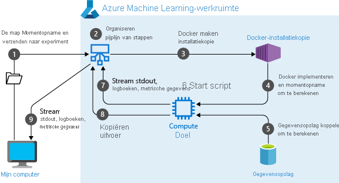
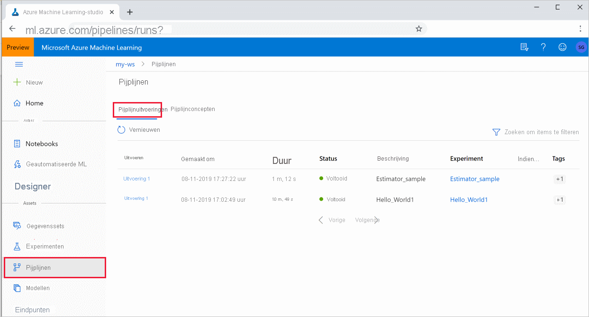

# <a name="create-and-run-machine-learning-pipelines-with-azure-machine-learning-sdk"></a>machine learning-pijp lijnen maken en uitvoeren met Azure Machine Learning SDK

[!INCLUDE [applies-to-skus](../../includes/aml-applies-to-basic-enterprise-sku.md)]

In dit artikel leert u hoe u een [machine learning pijp lijn](concept-ml-pipelines.md) kunt maken en uitvoeren met behulp van de [Azure machine learning SDK](https://docs.microsoft.com/python/api/overview/azure/ml/intro?view=azure-ml-py&preserve-view=true). Gebruik **ml-pijp lijnen** om een werk stroom te maken die verschillende stadia van de ml combineert. Publiceer vervolgens die pijp lijn voor later gebruik of delen met anderen. Houd ML-pijp lijnen bij om te zien hoe uw model in de praktijk wordt uitgevoerd en om gegevens drift te detecteren. ML-pijp lijnen zijn ideaal voor batch Score scenario's, met behulp van verschillende reken processen, het opnieuw gebruiken van stappen in plaats van deze opnieuw uit te voeren, evenals het delen van werk stromen met anderen.

Hoewel u een ander type pijp lijn kunt gebruiken, een [Azure-pijp lijn](https://docs.microsoft.com/azure/devops/pipelines/targets/azure-machine-learning?context=azure%2Fmachine-learning%2Fservice%2Fcontext%2Fml-context&view=azure-devops&tabs=yaml) voor de CI/cd-automatisering van ml-taken, wordt dat soort pijp lijn niet opgeslagen in uw werk ruimte. [Vergelijk deze verschillende pijp lijnen](concept-ml-pipelines.md#which-azure-pipeline-technology-should-i-use).

De ML pijp lijnen die u maakt, zijn zichtbaar voor de leden van uw Azure Machine Learning- [werk ruimte](how-to-manage-workspace.md). 

ML-pijp lijnen worden uitgevoerd op Compute-doelen (Zie [Wat zijn Compute-doelen in azure machine learning](https://docs.microsoft.com/azure/machine-learning/concept-compute-target)). Pijp lijnen kunnen gegevens van en naar ondersteunde [Azure Storage](https://docs.microsoft.com/azure/storage/) locaties lezen en schrijven.

Als u geen Azure-abonnement hebt, maakt u een gratis account voordat u begint. Probeer de [gratis of betaalde versie van Azure machine learning](https://aka.ms/AMLFree).

## <a name="prerequisites"></a>Vereisten

* Maak een [Azure machine learning-werk ruimte](how-to-manage-workspace.md) om al uw pijplijn resources te bevatten.

* [Configureer uw ontwikkel omgeving](how-to-configure-environment.md) om de Azure machine learning SDK te installeren, of gebruik een [Azure machine learning Compute-exemplaar](concept-compute-instance.md) waarbij de SDK al is geïnstalleerd.

Begin met het koppelen van uw werk ruimte:

```Python
import azureml.core
from azureml.core import Workspace, Datastore

ws = Workspace.from_config()
```

## <a name="set-up-machine-learning-resources"></a>Resources voor machine learning instellen

Maak de resources die vereist zijn voor het uitvoeren van een ML-pijp lijn:

* Stel een gegevens archief in dat wordt gebruikt voor toegang tot de gegevens die nodig zijn in de pijplijn stappen.

* Een `Dataset` object configureren om te verwijzen naar permanente gegevens die zich in bevinden of toegankelijk zijn in, een gegevens opslag. Een `PipelineData` object configureren voor tijdelijke gegevens die tussen de pijplijn stappen worden door gegeven. 

    > [!TIP]
    > Een verbeterde ervaring voor het door geven van tijdelijke gegevens tussen pijplijn stappen is beschikbaar in de open bare preview-klasse  [`OutputFileDatasetConfig`](https://docs.microsoft.com/python/api/azureml-core/azureml.data.outputfiledatasetconfig?view=azure-ml-py&preserve-view=true) .  Deze klasse is een [experimentele](https://docs.microsoft.com/python/api/overview/azure/ml/?view=azure-ml-py#&preserve-view=truestable-vs-experimental) preview-functie en kan op elk gewenst moment worden gewijzigd.

* De [reken doelen](concept-azure-machine-learning-architecture.md#compute-targets) instellen waarop de pijplijn stappen worden uitgevoerd.

### <a name="set-up-a-datastore"></a>Een gegevens opslag instellen

In een Data Store worden de gegevens voor de pijp lijn opgeslagen voor toegang. Elke werk ruimte heeft een standaard gegevens opslag. U kunt aanvullende gegevens opslag registreren. 

Wanneer u uw werk ruimte maakt, worden [Azure files](https://docs.microsoft.com/azure/storage/files/storage-files-introduction) en [Azure Blob-opslag](https://docs.microsoft.com/azure/storage/blobs/storage-blobs-introduction) gekoppeld aan de werk ruimte. Er is een standaard gegevens opslag geregistreerd om verbinding te maken met de Azure Blob-opslag. Zie [bepalen wanneer u Azure files, Azure-blobs of Azure-schijven wilt gebruiken](https://docs.microsoft.com/azure/storage/common/storage-decide-blobs-files-disks)voor meer informatie. 

```python
# Default datastore 
def_data_store = ws.get_default_datastore()

# Get the blob storage associated with the workspace
def_blob_store = Datastore(ws, "workspaceblobstore")

# Get file storage associated with the workspace
def_file_store = Datastore(ws, "workspacefilestore")

```

De stappen gebruiken meestal gegevens en produceren uitvoer gegevens. Een stap kan gegevens zoals een model, een directory met model en afhankelijke bestanden of tijdelijke gegevens maken. Deze gegevens zijn vervolgens later in de pijp lijn beschikbaar voor andere stappen. Zie voor meer informatie over het verbinden van uw pijp lijn met uw gegevens de artikelen [over toegang tot gegevens](how-to-access-data.md) en [het registreren van data sets](how-to-create-register-datasets.md). 

### <a name="configure-data-with-dataset-and-pipelinedata-objects"></a>Gegevens configureren met `Dataset` en `PipelineData` objecten

De voorkeurs manier om gegevens op te geven voor een pijp lijn is een object [DataSet](https://docs.microsoft.com/python/api/azureml-core/azureml.core.dataset.Dataset) . Het `Dataset` object verwijst naar gegevens die in of toegankelijk zijn vanuit een gegevens opslag of op een web-URL. De `Dataset` klasse is abstract, dus u maakt een instantie van ofwel een `FileDataset` (verwijzen naar een of meer bestanden) of een `TabularDataset` die wordt gemaakt door uit een of meer bestanden met gescheiden gegevens kolommen.


U maakt een `Dataset` gebruik van methoden als [from_files](https://docs.microsoft.com/python/api/azureml-core/azureml.data.dataset_factory.filedatasetfactory?view=azure-ml-py#&preserve-view=truefrom-files-path--validate-true-) of [from_delimited_files](https://docs.microsoft.com/python/api/azureml-core/azureml.data.dataset_factory.tabulardatasetfactory?view=azure-ml-py#&preserve-view=truefrom-delimited-files-path--validate-true--include-path-false--infer-column-types-true--set-column-types-none--separator------header-true--partition-format-none--support-multi-line-false-).

```python
from azureml.core import Dataset

my_dataset = Dataset.File.from_files([(def_blob_store, 'train-images/')])
```
Tussenliggende gegevens (of uitvoer van een stap) worden vertegenwoordigd door een [PipelineData](https://docs.microsoft.com/python/api/azureml-pipeline-core/azureml.pipeline.core.pipelinedata?view=azure-ml-py&preserve-view=true) -object. `output_data1` wordt geproduceerd als uitvoer van een stap en wordt gebruikt als invoer van een of meer toekomstige stappen. `PipelineData` introduceert een gegevens afhankelijkheid tussen de stappen en maakt een impliciete uitvoerings volgorde in de pijp lijn. Dit object wordt later gebruikt bij het maken van pijplijn stappen.

```python
from azureml.pipeline.core import PipelineData

output_data1 = PipelineData(
    "output_data1",
    datastore=def_blob_store,
    output_name="output_data1")

```

> [!TIP]
> Het persistent maken van tussenliggende gegevens tussen pijplijn stappen is ook mogelijk met de open bare preview-klasse [`OutputFileDatasetConfig`](https://docs.microsoft.com/python/api/azureml-core/azureml.data.outputfiledatasetconfig?view=azure-ml-py&preserve-view=true) . `OutputFileDatasetConfig`Zie [een pijp lijn met twee stappen maken](https://github.com/Azure/MachineLearningNotebooks/blob/master/how-to-use-azureml/work-with-data/datasets-tutorial/pipeline-with-datasets/pipeline-for-image-classification.ipynb)voor een code voorbeeld met behulp van de-klasse.

## <a name="set-up-a-compute-target"></a>Een reken doel instellen


In Azure Machine Learning verwijst de term __Compute__ (of __Compute target__) naar de computers of clusters die de reken stappen in uw machine learning pijp lijn uitvoeren.   Zie [Compute-doelen voor model training](concept-compute-target.md#train) voor een volledige lijst met Compute-doelen en [Maak reken doelen](how-to-create-attach-compute-sdk.md) voor het maken en koppelen aan uw werk ruimte.   Het proces voor het maken en of koppelen van een reken doel is hetzelfde, of u nu een model traint of een pijplijn stap uitvoert. Nadat u het reken doel hebt gemaakt en gekoppeld, gebruikt u het `ComputeTarget` object in de [pijplijn stap](#steps).

> [!IMPORTANT]
> Het uitvoeren van beheer bewerkingen op Compute-doelen wordt niet ondersteund vanuit externe taken. Omdat machine learning-pijp lijnen worden verzonden als een externe taak, mag u geen beheer bewerkingen gebruiken op reken doelen vanuit de pijp lijn.

### <a name="azure-machine-learning-compute"></a>Azure Machine Learning compute

U kunt een Azure Machine Learning Compute maken om uw stappen uit te voeren. De code voor andere compute-doelen is vergelijkbaar, met iets verschillende para meters, afhankelijk van het type. 

```python
from azureml.core.compute import ComputeTarget, AmlCompute

compute_name = "aml-compute"
vm_size = "STANDARD_NC6"
if compute_name in ws.compute_targets:
    compute_target = ws.compute_targets[compute_name]
    if compute_target and type(compute_target) is AmlCompute:
        print('Found compute target: ' + compute_name)
else:
    print('Creating a new compute target...')
    provisioning_config = AmlCompute.provisioning_configuration(vm_size=vm_size,  # STANDARD_NC6 is GPU-enabled
                                                                min_nodes=0,
                                                                max_nodes=4)
    # create the compute target
    compute_target = ComputeTarget.create(
        ws, compute_name, provisioning_config)

    # Can poll for a minimum number of nodes and for a specific timeout.
    # If no min node count is provided it will use the scale settings for the cluster
    compute_target.wait_for_completion(
        show_output=True, min_node_count=None, timeout_in_minutes=20)

    # For a more detailed view of current cluster status, use the 'status' property
    print(compute_target.status.serialize())
```

## <a name="configure-the-training-runs-environment"></a>De omgeving van de trainings uitvoering configureren

De volgende stap zorgt ervoor dat de uitvoering van de externe training alle afhankelijkheden heeft die nodig zijn voor de trainings stappen. Afhankelijkheden en de runtime context worden ingesteld door een-object te maken en te configureren `RunConfiguration` . 

```python
from azureml.core.runconfig import RunConfiguration
from azureml.core.conda_dependencies import CondaDependencies
from azureml.core import Environment 

aml_run_config = RunConfiguration()
# `compute_target` as defined in "Azure Machine Learning compute" section above
aml_run_config.target = compute_target

USE_CURATED_ENV = True
if USE_CURATED_ENV :
    curated_environment = Environment.get(workspace=ws, name="AzureML-Tutorial")
    aml_run_config.environment = curated_environment
else:
    aml_run_config.environment.python.user_managed_dependencies = False
    
    # Add some packages relied on by data prep step
    aml_run_config.environment.python.conda_dependencies = CondaDependencies.create(
        conda_packages=['pandas','scikit-learn'], 
        pip_packages=['azureml-sdk', 'azureml-dataprep[fuse,pandas]'], 
        pin_sdk_version=False)
```

De bovenstaande code bevat twee opties voor het afhandelen van afhankelijkheden. Zoals weer gegeven, `USE_CURATED_ENV = True` is de configuratie gebaseerd op een gecuratore omgeving. Met de geprebakedeerde omgevingen is de gemeen schappelijke onderlinge Interdependent-tape wisselaars en kunnen ze aanzienlijk sneller online worden gebracht. In de [micro soft-container Registry](https://hub.docker.com/publishers/microsoftowner)hebben geconstrueerde omgevingen vooraf ingebouwde docker-installatie kopieën. Zie [Azure machine learning gecuratorde omgevingen](resource-curated-environments.md)voor meer informatie.

Het pad dat u hebt gemaakt `USE_CURATED_ENV` , `False` wordt weer gegeven met het patroon voor het expliciet instellen van afhankelijkheden. In dat scenario wordt een nieuwe aangepaste docker-installatie kopie gemaakt en geregistreerd in een Azure Container Registry binnen de resource groep (Zie [Inleiding tot privé-docker-container registers in azure](https://docs.microsoft.com/azure/container-registry/container-registry-intro)). Het maken en registreren van deze installatie kopie kan enkele minuten duren.

## <a name="construct-your-pipeline-steps"></a><a id="steps"></a>Uw pijplijn stappen maken

Zodra u de reken resource en omgeving hebt gemaakt, bent u klaar om de stappen van de pijp lijn te definiëren. Er zijn veel ingebouwde stappen beschikbaar via de Azure Machine Learning SDK, zoals u kunt zien in de [referentie documentatie voor het `azureml.pipeline.steps` pakket](https://docs.microsoft.com/python/api/azureml-pipeline-steps/azureml.pipeline.steps?view=azure-ml-py&preserve-view=true). De meest flexibele klasse is [PythonScriptStep](https://docs.microsoft.com/python/api/azureml-pipeline-steps/azureml.pipeline.steps.python_script_step.pythonscriptstep?view=azure-ml-py&preserve-view=true), waarmee een python-script wordt uitgevoerd.

```python
from azureml.pipeline.steps import PythonScriptStep
dataprep_source_dir = "./dataprep_src"
entry_point = "prepare.py"
# `my_dataset` as defined above
ds_input = my_dataset.as_named_input('input1')

# `output_data1`, `compute_target`, `aml_run_config` as defined above
data_prep_step = PythonScriptStep(
    script_name=entry_point,
    source_directory=dataprep_source_dir,
    arguments=["--input", ds_input.as_download(), "--output", output_data1],
    inputs=[ds_input],
    outputs=[output_data1],
    compute_target=compute_target,
    runconfig=aml_run_config,
    allow_reuse=True
)
```

De bovenstaande code toont een typische stap in de pijp lijn. De code voor gegevens voorbereiding bevindt zich in een submap (in dit voor beeld `"prepare.py"` in de map `"./dataprep.src"` ). Als onderdeel van het proces voor het maken van de pijp lijn wordt deze directory ingepakt en geüpload naar de `compute_target` en wordt het script uitgevoerd dat is opgegeven als de waarde voor `script_name` .

De `arguments` `inputs` waarden, en `outputs` opgeven de invoer en uitvoer van de stap. In het bovenstaande voor beeld zijn de basislijn gegevens de `my_dataset` gegevensset. De bijbehorende gegevens worden gedownload naar de compute-resource, aangezien deze door de code wordt opgegeven als `as_download()` . Het script `prepare.py` zorgt voor de gegevens transformatie taken die bij de hand worden betrokken en levert de gegevens naar `output_data1` , van het type `PipelineData` . Zie [gegevens verplaatsen naar en tussen ml-pijplijn stappen (python)](how-to-move-data-in-out-of-pipelines.md)voor meer informatie. 

De stap wordt uitgevoerd op de computer `compute_target` die is gedefinieerd door met behulp van de configuratie `aml_run_config` . 

Hergebruik van vorige resultaten ( `allow_reuse` ) is Key wanneer u pijp lijnen in een samenwerkings omgeving gebruikt, omdat overbodige reacties minder flexibel zijn. Hergebruik is het standaard gedrag wanneer de script_name, invoer en de para meters van een stap hetzelfde blijven. Wanneer hergebruik is toegestaan, worden de resultaten van de vorige uitvoering onmiddellijk naar de volgende stap verzonden. Als `allow_reuse` is ingesteld op `False` , wordt voor deze stap altijd een nieuwe uitvoering gegenereerd tijdens de uitvoering van de pijp lijn.

Het is mogelijk om een pijp lijn met één stap te maken, maar u zult er bijna altijd voor kiezen om uw algehele proces te splitsen in verschillende stappen. U kunt bijvoorbeeld stappen hebben voor de voor bereiding van gegevens, training, model vergelijking en implementatie. Zo kan een voor beeld van een voor Stel `data_prep_step` zijn dat de volgende stap kan worden getraind na de hierboven aangegeven procedure:

```python
train_source_dir = "./train_src"
train_entry_point = "train.py"

training_results = PipelineData(name = "training_results", 
                                datastore=def_blob_store,
                                output_name="training_results")

    
train_step = PythonScriptStep(
    script_name=train_entry_point,
    source_directory=train_source_dir,
    arguments=["--prepped_data", output_data1.as_input(), "--training_results", training_results],
    compute_target=compute_target,
    runconfig=aml_run_config,
    allow_reuse=True
)
```

De bovenstaande code is vergelijkbaar met die voor de stap voor het voorbereiden van gegevens. De code van de training bevindt zich in een andere map dan die van de code voor gegevens voorbereiding. De `PipelineData` uitvoer van de stap voor het voorbereiden van gegevens `output_data1` wordt gebruikt als _invoer_ voor de trainings stap. Er wordt een nieuw `PipelineData` object `training_results` gemaakt om de resultaten voor een volgende vergelijking of implementatie stap te bewaren. 


> [!TIP]
> Voor een verbeterde ervaring en de mogelijkheid om tussenliggende gegevens terug te schrijven naar uw gegevens opslag aan het eind van de pijplijn uitvoering, gebruikt u de open bare preview-klasse [`OutputFileDatasetConfig`](https://docs.microsoft.com/python/api/azureml-core/azureml.data.outputfiledatasetconfig?view=azure-ml-py&preserve-view=true) . Zie voor code voorbeelden [een twee stap ml-pijp lijn maken](https://github.com/Azure/MachineLearningNotebooks/blob/master/how-to-use-azureml/work-with-data/datasets-tutorial/pipeline-with-datasets/pipeline-for-image-classification.ipynb) en [gegevens terugschrijven naar data stores bij het volt ooien van de uitvoering](https://github.com/Azure/MachineLearningNotebooks/blob/master/how-to-use-azureml/work-with-data/datasets-tutorial/scriptrun-with-data-input-output/how-to-use-scriptrun.ipynb).

Nadat u de stappen hebt gedefinieerd, bouwt u de pijp lijn met behulp van enkele of al deze stappen.

> [!NOTE]
> Er worden geen bestanden of gegevens geüpload naar Azure Machine Learning wanneer u de stappen definieert of de pijp lijn bouwt. De bestanden worden geüpload wanneer u [experiment. Submit ()](https://docs.microsoft.com/python/api/azureml-core/azureml.core.experiment.experiment?view=azure-ml-py#&preserve-view=truesubmit-config--tags-none----kwargs-)aanroept.

```python
# list of steps to run (`compare_step` definition not shown)
compare_models = [data_prep_step, train_step, compare_step]

from azureml.pipeline.core import Pipeline

# Build the pipeline
pipeline1 = Pipeline(workspace=ws, steps=[compare_models])
```

### <a name="use-a-dataset"></a>Een gegevensset gebruiken 

Gegevens sets die zijn gemaakt op basis van Azure Blob-opslag, Azure Files, Azure Data Lake Storage Gen1, Azure Data Lake Storage Gen2, Azure SQL Database en Azure Database for PostgreSQL kunnen worden gebruikt als invoer voor elke pijplijn stap. U kunt een uitvoer schrijven naar een [DataTransferStep](https://docs.microsoft.com/python/api/azureml-pipeline-steps/azureml.pipeline.steps.datatransferstep?view=azure-ml-py&preserve-view=true), [DatabricksStep](https://docs.microsoft.com/python/api/azureml-pipeline-steps/azureml.pipeline.steps.databricks_step.databricksstep?view=azure-ml-py&preserve-view=true)of als u gegevens wilt schrijven naar een specifieke Data Store- [PipelineData](https://docs.microsoft.com/python/api/azureml-pipeline-core/azureml.pipeline.core.pipelinedata?view=azure-ml-py&preserve-view=true). 

> [!IMPORTANT]
> Het schrijven van uitvoer gegevens naar een gegevens opslag met behulp van PipelineData wordt alleen ondersteund voor Azure Blob en Azure file share-gegevens opslag. 
>
> Voor het terugschrijven van uitvoer gegevens naar Azure Blob, een Azure-bestands share, ADLS gen 1 en ADLS gen 2-gegevens opslag gebruiken de open bare preview-klasse [`OutputFileDatasetConfig`](https://docs.microsoft.com/python/api/azureml-core/azureml.data.output_dataset_config.outputfiledatasetconfig?view=azure-ml-py&preserve-view=true) .

```python
dataset_consuming_step = PythonScriptStep(
    script_name="iris_train.py",
    inputs=[iris_tabular_dataset.as_named_input("iris_data")],
    compute_target=compute_target,
    source_directory=project_folder
)
```

Vervolgens haalt u de gegevensset op in de pijp lijn met behulp van de Dictionary [Run. input_datasets](https://docs.microsoft.com/python/api/azureml-core/azureml.core.run.run?view=azure-ml-py#&preserve-view=trueinput-datasets) .

```python
# iris_train.py
from azureml.core import Run, Dataset

run_context = Run.get_context()
iris_dataset = run_context.input_datasets['iris_data']
dataframe = iris_dataset.to_pandas_dataframe()
```

De lijn `Run.get_context()` is waard. Deze functie haalt een op `Run` die de huidige experimentele uitvoering vertegenwoordigt. In het bovenstaande voor beeld gebruiken we het om een geregistreerde gegevensset op te halen. Een ander algemeen gebruik van het `Run` object bestaat uit het ophalen van zowel het experiment zelf als de werk ruimte waarin het experiment zich bevindt: 

```python
# Within a PythonScriptStep

ws = Run.get_context().experiment.workspace
```

Zie [gegevens verplaatsen naar en tussen ml-pijplijn stappen (python)](how-to-move-data-in-out-of-pipelines.md)voor meer informatie, inclusief alternatieve manieren om gegevens door te geven en te openen.

## <a name="caching--reuse"></a>Caching & opnieuw gebruiken  

Om het gedrag van uw pijp lijnen te optimaliseren en aan te passen, kunt u enkele dingen doen om in de cache te plaatsen en opnieuw te gebruiken. U kunt bijvoorbeeld het volgende kiezen:
+ **Schakel de standaard instelling voor het opnieuw gebruiken van de uitvoer uitvoering** uit `allow_reuse=False` tijdens [stap definitie](https://docs.microsoft.com/python/api/azureml-pipeline-steps/?view=azure-ml-py&preserve-view=true). Hergebruik is essentieel voor het gebruik van pijp lijnen in een samenwerkings omgeving omdat het elimineren van overbodige uitvoeringen flexibiliteit biedt. U kunt het echter niet opnieuw gebruiken.
+ **Het opnieuw genereren van uitvoer afdwingen voor alle stappen in een run** with `pipeline_run = exp.submit(pipeline, regenerate_outputs=False)`

`allow_reuse`Voor stappen is standaard ingeschakeld en de `source_directory` opgegeven waarde in de stap definitie wordt gehasht. Als het script voor een gegeven stap hetzelfde blijft ( `script_name` , invoer en de para meters) en niets anders in de ` source_directory` is gewijzigd, wordt de uitvoer van een vorige stap opnieuw gebruikt, wordt de taak niet verzonden naar de compute en worden de resultaten van de vorige uitvoering onmiddellijk beschikbaar voor de volgende stap.

```python
step = PythonScriptStep(name="Hello World",
                        script_name="hello_world.py",
                        compute_target=aml_compute,
                        source_directory=source_directory,
                        allow_reuse=False,
                        hash_paths=['hello_world.ipynb'])
```

## <a name="submit-the-pipeline"></a>De pijplijn indienen

Wanneer u de pijp lijn verzendt, controleert Azure Machine Learning de afhankelijkheden voor elke stap en uploadt een moment opname van de bronmap die u hebt opgegeven. Als er geen bronmap is opgegeven, wordt de huidige lokale map geüpload. De moment opname wordt ook opgeslagen als onderdeel van het experiment in uw werk ruimte.

> [!IMPORTANT]
> [!INCLUDE [amlinclude-info](../../includes/machine-learning-amlignore-gitignore.md)]
>
> Zie [moment opnamen](concept-azure-machine-learning-architecture.md#snapshots)voor meer informatie.

```python
from azureml.core import Experiment

# Submit the pipeline to be run
pipeline_run1 = Experiment(ws, 'Compare_Models_Exp').submit(pipeline1)
pipeline_run1.wait_for_completion()
```

Wanneer u een pijp lijn voor het eerst uitvoert, Azure Machine Learning:

* Downloadt de moment opname van het project naar het reken doel van de Blob-opslag die is gekoppeld aan de werk ruimte.
* Bouwt een docker-installatie kopie die overeenkomt met elke stap in de pijp lijn.
* Downloadt de docker-installatie kopie voor elke stap naar het reken doel vanuit het container register.
* Hiermee configureert u de toegang tot `Dataset` en `PipelineData` objecten. Voor als `as_mount()` toegangs modus wordt zeker gebruikt voor het bieden van virtuele toegang. Als koppelen niet wordt ondersteund of als de gebruiker toegang heeft opgegeven als `as_download()` , worden de gegevens in plaats daarvan gekopieerd naar het reken doel.

* Voert de stap uit in het berekenings doel dat is opgegeven in de stap definitie. 
* Maakt artefacten, zoals Logboeken, stdout, stderr, metrische gegevens en uitvoer die zijn opgegeven door de stap. Deze artefacten worden vervolgens geüpload en opgeslagen in de standaard gegevens opslag van de gebruiker.



Zie voor meer informatie de referentie over de experimentele [klasse](https://docs.microsoft.com/python/api/azureml-core/azureml.core.experiment.experiment?view=azure-ml-py&preserve-view=true) .

## <a name="view-results-of-a-pipeline"></a>Resultaten van een pijp lijn weer geven

Bekijk de lijst met al uw pijp lijnen en de details van de uitvoering in Studio:

1. Meld u aan bij [Azure Machine Learning Studio](https://ml.azure.com).

1. [Uw werk ruimte weer geven](how-to-manage-workspace.md#view).

1. Selecteer aan de linkerkant **pijp lijnen** om al uw pijplijn uitvoeringen weer te geven.
 
 
1. Selecteer een specifieke pijp lijn om de resultaten van de uitvoering te bekijken.

### <a name="git-tracking-and-integration"></a>Git-tracking en-integratie

Wanneer u begint met het uitvoeren van een training waarbij de bronmap een lokale Git-opslag plaats is, wordt informatie over de opslag plaats opgeslagen in de uitvoerings geschiedenis. Zie [Git-integratie voor Azure machine learning](concept-train-model-git-integration.md)voor meer informatie.

## <a name="next-steps"></a>Volgende stappen

- Als u uw pijp lijn met collega's of klanten wilt delen, raadpleegt u [machine learning-pijp lijnen publiceren](how-to-deploy-pipelines.md)
- Gebruik [deze Jupyter-notebooks op github](https://aka.ms/aml-pipeline-readme) om machine learning pijp lijnen verder te verkennen
- Raadpleeg de SDK-Naslag informatie voor het pakket met de [kern pijplijn](https://docs.microsoft.com/python/api/azureml-pipeline-core/?view=azure-ml-py&preserve-view=true) en het pakket met [azureml-pijp lijnen-stappen](https://docs.microsoft.com/python/api/azureml-pipeline-steps/?view=azure-ml-py&preserve-view=true)
- Zie de [hand](how-to-debug-pipelines.md) leiding voor tips over het opsporen van fouten en pijp lijnen voor probleem oplossing
- Informatie over het uitvoeren van notebooks vindt u in het artikel [Use Jupyter notebooks to explore this service](samples-notebooks.md) (Jupyter Notebooks gebruiken om deze service te verkennen).
