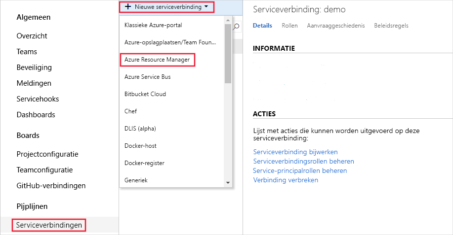
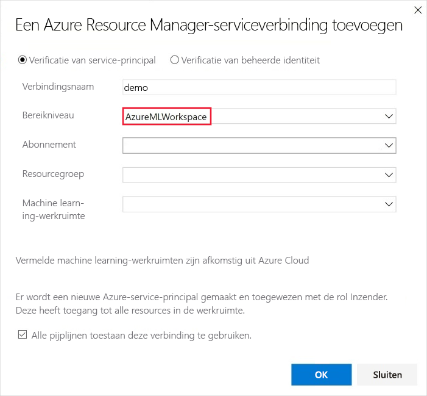
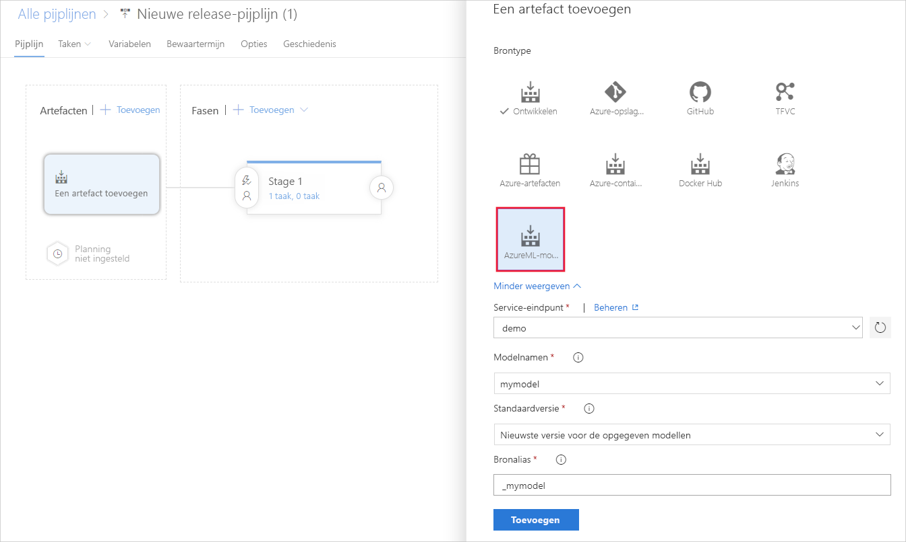
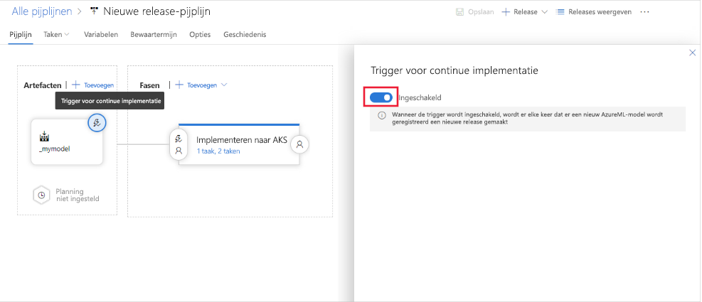

# <a name="deploy-models-with-azure-machine-learning"></a>Modellen implementeren met Azure Machine Learning
[!INCLUDE [applies-to-skus](../../includes/aml-applies-to-basic-enterprise-sku.md)]

Meer informatie over het implementeren van uw machine learning model als een webservice in de Azure-Cloud of het Azure IoT Edge van apparaten.

De werk stroom is vergelijkbaar, [waar u uw model implementeert](#target) :

1. Registreer het model.
1. Bereid de implementatie voor. (Geef de assets, het gebruik en het rekendoel op.)
1. Implementeer het model op het rekendoel.
1. Test het geïmplementeerde model, ook wel webservice genoemd.

Zie [modellen beheren, implementeren en bewaken met Azure machine learning](concept-model-management-and-deployment.md)voor meer informatie over de concepten die zijn betrokken bij de implementatie werk stroom.

## <a name="prerequisites"></a>Vereisten

- Een Azure Machine Learning-werkruimte. Zie [een Azure machine learning-werk ruimte maken](how-to-manage-workspace.md)voor meer informatie.

- Een model. Als u geen getraind model hebt, kunt u het model en de afhankelijkheids bestanden van [deze zelf studie](https://aka.ms/azml-deploy-cloud)gebruiken.

- De [Azure cli-extensie voor de machine learning-service](reference-azure-machine-learning-cli.md), de [Azure machine learning SDK voor Python](https://docs.microsoft.com/python/api/overview/azure/ml/intro?view=azure-ml-py)of de [Azure machine learning Visual Studio code extension](tutorial-setup-vscode-extension.md).

## <a name="connect-to-your-workspace"></a>Verbinding maken met uw werkruimte

De volgende code laat zien hoe u verbinding maakt met een Azure Machine Learning-werk ruimte met behulp van informatie in cache naar de lokale ontwikkel omgeving:

+ **De SDK gebruiken**

   ```python
   from azureml.core import Workspace
   ws = Workspace.from_config(path=".file-path/ws_config.json")
   ```

  Zie de documentatie van [Azure machine learning SDK voor python](https://docs.microsoft.com/python/api/overview/azure/ml/intro?view=azure-ml-py#workspace) voor meer informatie over het gebruik van de SDK om verbinding te maken met een werk ruimte.

+ **De CLI gebruiken**

   Gebruik de `-w` `--workspace-name` para meter of voor het opgeven van de werk ruimte voor de opdracht wanneer u de CLI gebruikt.

+ **Visual Studio Code gebruiken**

   Wanneer u Visual Studio code gebruikt, selecteert u de werk ruimte met behulp van een grafische interface. Zie [modellen implementeren en beheren](how-to-manage-resources-vscode.md#endpoints) in de documentatie van Visual Studio code Extension voor meer informatie.

## <a name="register-your-model"></a><a id="registermodel"></a>Uw model registreren

Een geregistreerd model is een logische container voor een of meer bestanden die het model vormen. Als u bijvoorbeeld een model hebt dat is opgeslagen in meerdere bestanden, kunt u ze registreren als één model in de werk ruimte. Nadat u de bestanden hebt geregistreerd, kunt u het geregistreerde model downloaden of implementeren en alle bestanden ontvangen die u hebt geregistreerd.

> [!TIP]
> Wanneer u een model registreert, geeft u het pad op naar een Cloud locatie (van een trainings uitvoering) of van een lokale map. Dit pad is alleen bedoeld voor het vinden van de bestanden die worden geüpload als onderdeel van het registratie proces. Het hoeft niet overeen te komen met het pad dat wordt gebruikt in het vermeldings script. Zie voor meer informatie [model bestanden zoeken in uw invoer script](#load-model-files-in-your-entry-script).

Machine learning-modellen worden geregistreerd in uw Azure Machine Learning-werk ruimte. Het model kan afkomstig zijn van Azure Machine Learning of van een andere locatie. Bij het registreren van een model kunt u optioneel meta gegevens over het model opgeven. De `tags` en `properties` woorden lijsten die u toepast op een model registratie kunnen vervolgens worden gebruikt voor het filteren van modellen.

De volgende voor beelden laten zien hoe u een model kunt registreren.

### <a name="register-a-model-from-an-experiment-run"></a>Een model registreren vanuit een experiment

De code fragmenten in deze sectie laten zien hoe u een model kunt registreren bij een trainings uitvoering:

> [!IMPORTANT]
> Als u deze fragmenten wilt gebruiken, moet u eerder een trainings programma hebben uitgevoerd en moet u toegang hebben tot het `Run` object (SDK-voor beeld) of de waarde run id (CLI-voor beeld). Zie [Compute-doelen voor model training instellen](how-to-set-up-training-targets.md)voor meer informatie over trainings modellen.

+ **De SDK gebruiken**

  Wanneer u de SDK gebruikt voor het trainen van een model, kunt u een [uitvoerings](https://docs.microsoft.com/python/api/azureml-core/azureml.core.run.run?view=azure-ml-py) object of een [AutoMLRun](/python/api/azureml-train-automl-client/azureml.train.automl.run.automlrun) -object ontvangen, afhankelijk van hoe u het model hebt getraind. Elk object kan worden gebruikt voor het registreren van een model dat is gemaakt door een experiment.

  + Een model van een `azureml.core.Run` object registreren:
 
    ```python
    model = run.register_model(model_name='sklearn_mnist',
                               tags={'area': 'mnist'},
                               model_path='outputs/sklearn_mnist_model.pkl')
    print(model.name, model.id, model.version, sep='\t')
    ```

    De `model_path` para meter verwijst naar de locatie van de cloud van het model. In dit voor beeld wordt het pad van één bestand gebruikt. Als u meerdere bestanden wilt toevoegen aan de model registratie, stelt `model_path` u het pad in naar een map die de bestanden bevat. Zie de documentatie [Run. register_model](https://docs.microsoft.com/python/api/azureml-core/azureml.core.run.run?view=azure-ml-py#register-model-model-name--model-path-none--tags-none--properties-none--model-framework-none--model-framework-version-none--description-none--datasets-none--sample-input-dataset-none--sample-output-dataset-none--resource-configuration-none----kwargs-) voor meer informatie.

  + Een model van een `azureml.train.automl.run.AutoMLRun` object registreren:

    ```python
        description = 'My AutoML Model'
        model = run.register_model(description = description,
                                   tags={'area': 'mnist'})

        print(run.model_id)
    ```

    In dit voor beeld `metric` worden de `iteration` para meters en niet opgegeven, zodat de iteratie met de beste primaire metriek wordt geregistreerd. De `model_id` waarde die wordt geretourneerd door de uitvoering, wordt gebruikt in plaats van een model naam.

    Zie de documentatie van [AutoMLRun. register_model](/python/api/azureml-train-automl-client/azureml.train.automl.run.automlrun#register-model-model-name-none--description-none--tags-none--iteration-none--metric-none-) voor meer informatie.

+ **De CLI gebruiken**

  ```azurecli-interactive
  az ml model register -n sklearn_mnist  --asset-path outputs/sklearn_mnist_model.pkl  --experiment-name myexperiment --run-id myrunid --tag area=mnist
  ```

  [!INCLUDE [install extension](../../includes/machine-learning-service-install-extension.md)]

  De `--asset-path` para meter verwijst naar de locatie van de cloud van het model. In dit voor beeld wordt het pad van één bestand gebruikt. Als u meerdere bestanden wilt toevoegen aan de model registratie, stelt `--asset-path` u het pad in naar een map die de bestanden bevat.

+ **Visual Studio Code gebruiken**

  Registreer modellen met behulp van een of meer model bestanden of mappen met de [Visual Studio code](tutorial-train-deploy-image-classification-model-vscode.md#deploy-the-model) -extensie.

### <a name="register-a-model-from-a-local-file"></a>Een model registreren vanuit een lokaal bestand

U kunt een model registreren door het lokale pad van het model op te geven. U kunt het pad naar een map of één bestand opgeven. U kunt deze methode gebruiken om modellen te registreren die zijn getraind met Azure Machine Learning en vervolgens te downloaden. U kunt deze methode ook gebruiken voor het registreren van modellen die buiten Azure Machine Learning worden getraind.

[!INCLUDE [trusted models](../../includes/machine-learning-service-trusted-model.md)]

+ **De SDK en ONNX gebruiken**

    ```python
    import os
    import urllib.request
    from azureml.core.model import Model
    # Download model
    onnx_model_url = "https://www.cntk.ai/OnnxModels/mnist/opset_7/mnist.tar.gz"
    urllib.request.urlretrieve(onnx_model_url, filename="mnist.tar.gz")
    os.system('tar xvzf mnist.tar.gz')
    # Register model
    model = Model.register(workspace = ws,
                            model_path ="mnist/model.onnx",
                            model_name = "onnx_mnist",
                            tags = {"onnx": "demo"},
                            description = "MNIST image classification CNN from ONNX Model Zoo",)
    ```

  Als u meerdere bestanden wilt toevoegen aan de model registratie, stelt `model_path` u het pad in naar een map die de bestanden bevat.

+ **De CLI gebruiken**

  ```azurecli-interactive
  az ml model register -n onnx_mnist -p mnist/model.onnx
  ```

  Als u meerdere bestanden wilt toevoegen aan de model registratie, stelt `-p` u het pad in naar een map die de bestanden bevat.

**Geschatte tijd**: ongeveer 10 seconden.

Zie de documentatie voor de [model klasse](https://docs.microsoft.com/python/api/azureml-core/azureml.core.model.model?view=azure-ml-py)voor meer informatie.

Zie [een bestaand model implementeren](how-to-deploy-existing-model.md)voor meer informatie over het werken met modellen die buiten Azure machine learning zijn getraind.

<a name="target"></a>

## <a name="single-versus-multi-model-endpoints"></a>Enkelvoudige versus multi-model-eind punten
Azure ML ondersteunt de implementatie van één of meerdere modellen achter een enkel eind punt.

Voor eind punten van meerdere modellen wordt een gedeelde container gebruikt voor het hosten van meerdere modellen. Dit helpt de overhead kosten te verlagen, het gebruik te verbeteren en biedt u de mogelijkheid om modules samen te voegen in ensembles. Modellen die u opgeeft in uw implementatie script, worden gekoppeld en beschikbaar gemaakt op de schijf van de container die wordt geleverd. u kunt ze in het geheugen op aanvraag en Score laden op basis van het specifieke model dat tijdens de beoordelings periode wordt aangevraagd.

Zie [dit voor beeld](https://github.com/Azure/MachineLearningNotebooks/tree/master/how-to-use-azureml/deployment/deploy-multi-model) voor een E2E-voor beeld waarin wordt getoond hoe u meerdere modellen achter één container-eind punt gebruikt.

## <a name="prepare-to-deploy"></a>Implementatie voorbereiden

Als u het model als een service wilt implementeren, hebt u de volgende onderdelen nodig:

* **Omgeving**voor het afwijzen definiëren. Deze omgeving omvat de afhankelijkheden die nodig zijn voor het uitvoeren van uw model.
* **Definieer de Score code**. Met dit script worden aanvragen geaccepteerd, worden de aanvragen met behulp van het model gescoord en worden de resultaten geretourneerd.
* **Configuratie voor het afstellen**van een afleiding definiëren. De configuratie voor het afwijzen van gegevens bepaalt de omgevings configuratie, het invoer script en andere onderdelen die nodig zijn om het model als een service uit te voeren.

Zodra u de benodigde onderdelen hebt, kunt u de service die wordt gemaakt als gevolg van de implementatie van uw model, profileren om inzicht te krijgen in de vereisten voor de CPU en het geheugen.

### <a name="1-define-inference-environment"></a>1. de omgeving voor het afwijzen definiëren

Een configuratie voor het afwijzen van een interferentie beschrijft het instellen van de webservice die uw model bevat. Het wordt later gebruikt wanneer u het model implementeert.

In de configuratie voor demijnen wordt Azure Machine Learning omgevingen gebruikt voor het definiëren van de software afhankelijkheden die nodig zijn voor uw implementatie. Met omgevingen kunt u de software-afhankelijkheden maken, beheren en opnieuw gebruiken die zijn vereist voor training en implementatie. U kunt een omgeving maken op basis van aangepaste afhankelijkheids bestanden of een van de met Azure Machine Learning omgevingen met een van de curator gebruiken. De volgende YAML is een voor beeld van een Conda-afhankelijkheids bestand voor ingrijpen. Houd er rekening mee dat u de standaard waarden van azureml-defaults met versie >= 1.0.45 als een PIP-afhankelijkheid moet aangeven, omdat deze de functionaliteit bevat die nodig is om het model als een webservice te hosten. Als u het automatisch genereren van schema's wilt gebruiken, moet uw invoer script ook de `inference-schema` pakketten importeren.

```YAML
name: project_environment
dependencies:
  - python=3.6.2
  - scikit-learn=0.20.0
  - pip:
      # You must list azureml-defaults as a pip dependency
    - azureml-defaults>=1.0.45
    - inference-schema[numpy-support]
```

> [!IMPORTANT]
> Als uw afhankelijkheid beschikbaar is via zowel Conda als PIP (van PyPi), raadt micro soft u aan om de Conda-versie te gebruiken, aangezien Conda-pakketten doorgaans worden geleverd met vooraf gemaakte binaire bestanden die de installatie betrouwbaarder maken.
>
> Zie [Wat is Conda en PIP](https://www.anaconda.com/understanding-conda-and-pip/)? voor meer informatie.
>
> Als u wilt controleren of uw afhankelijkheid beschikbaar is via Conda, gebruikt u de `conda search <package-name>` opdracht of gebruikt u de pakket indexen op [https://anaconda.org/anaconda/repo](https://anaconda.org/anaconda/repo) en [https://anaconda.org/conda-forge/repo](https://anaconda.org/conda-forge/repo) .

U kunt het afhankelijkheden bestand gebruiken om een omgevings object te maken en dit op te slaan in uw werk ruimte voor toekomstig gebruik:

```python
from azureml.core.environment import Environment
myenv = Environment.from_conda_specification(name = 'myenv',
                                             file_path = 'path-to-conda-specification-file'
myenv.register(workspace=ws)
```

### <a name="2-define-scoring-code"></a><a id="script"></a>2. Definieer Score code

Het invoerscript ontvangt de gegevens die bij een geïmplementeerde webservice zijn ingediend en stuurt ze door naar het model. Vervolgens wordt de reactie die door het model is geretourneerd naar de client geretourneerd. *Het script is specifiek voor uw model*. Het moet inzicht hebben in de gegevens die het model verwacht en retourneert.

Het script bevat twee functies voor het laden en uitvoeren van het model:

* `init()`: Deze functie laadt meestal het model in een globaal object. Deze functie wordt slechts één keer uitgevoerd wanneer de docker-container voor uw webservice wordt gestart.

* `run(input_data)`: Deze functie maakt gebruik van het model voor het voors pellen van een waarde op basis van de invoer gegevens. De in- en uitvoer van de uitvoerbewerking maken doorgaans gebruik van JSON voor serialisatie en deserialisatie. U kunt ook werken met onbewerkte binaire gegevens. U kunt de gegevens transformeren voordat u deze naar het model verzendt of voordat u deze naar de client retourneert.

#### <a name="load-model-files-in-your-entry-script"></a>Model bestanden laden in uw invoer script

Er zijn twee manieren om modellen te vinden in het involgings script:
* `AZUREML_MODEL_DIR`: Een omgevings variabele die het pad naar de model locatie bevat.
* `Model.get_model_path`: Een API die het pad naar het model bestand retourneert met de geregistreerde model naam.

##### <a name="azureml_model_dir"></a>AZUREML_MODEL_DIR

AZUREML_MODEL_DIR is een omgevings variabele die tijdens de implementatie van de service wordt gemaakt. U kunt deze omgevings variabele gebruiken om de locatie van de geïmplementeerde model (en) te vinden.

In de volgende tabel wordt de waarde van AZUREML_MODEL_DIR beschreven, afhankelijk van het aantal geïmplementeerde modellen:

| Implementatie | Waarde van omgevings variabele |
| ----- | ----- |
| Eén model | Het pad naar de map die het model bevat. |
| Meerdere modellen | Het pad naar de map met alle modellen. Modellen bevinden zich op naam en versie in deze map ( `$MODEL_NAME/$VERSION` ) |

Tijdens model registratie en-implementatie worden modellen in het AZUREML_MODEL_DIR pad geplaatst en hun oorspronkelijke bestands namen blijven behouden.

Als u het pad naar een model bestand in het invoer script wilt ophalen, combineert u de omgevings variabele met het pad naar het bestand waarnaar u op zoek bent.

**Voor beeld van één model**
```python
# Example when the model is a file
model_path = os.path.join(os.getenv('AZUREML_MODEL_DIR'), 'sklearn_regression_model.pkl')

# Example when the model is a folder containing a file
file_path = os.path.join(os.getenv('AZUREML_MODEL_DIR'), 'my_model_folder', 'sklearn_regression_model.pkl')
```

**Voor beeld van meerdere modellen**

In dit scenario worden twee modellen geregistreerd bij de werk ruimte:

* `my_first_model`: Bevat één bestand ( `my_first_model.pkl` ) en er is slechts één versie ( `1` ).
* `my_second_model`: Bevat één bestand ( `my_second_model.pkl` ) en er zijn twee versies, `1` en `2` .

Wanneer de service is geïmplementeerd, worden beide modellen in de implementatie bewerking weer gegeven:

```python
first_model = Model(ws, name="my_first_model", version=1)
second_model = Model(ws, name="my_second_model", version=2)
service = Model.deploy(ws, "myservice", [first_model, second_model], inference_config, deployment_config)
```

In de docker-installatie kopie die als host fungeert voor de service, `AZUREML_MODEL_DIR` bevat de omgevings variabele de map waarin de modellen zich bevinden.
In deze map bevindt elk model zich in een mappad van `MODEL_NAME/VERSION` . Waarbij de `MODEL_NAME` naam is van het geregistreerde model en `VERSION` de versie van het model is. De bestanden waaruit het geregistreerde model bestaan, worden opgeslagen in deze mappen.

In dit voor beeld zijn de paden `$AZUREML_MODEL_DIR/my_first_model/1/my_first_model.pkl` en `$AZUREML_MODEL_DIR/my_second_model/2/my_second_model.pkl` .


```python
# Example when the model is a file, and the deployment contains multiple models
first_model_name = 'my_first_model'
first_model_version = '1'
first_model_path = os.path.join(os.getenv('AZUREML_MODEL_DIR'), first_model_name, first_model_version, 'my_first_model.pkl')
second_model_name = 'my_second_model'
second_model_version = '2'
second_model_path = os.path.join(os.getenv('AZUREML_MODEL_DIR'), second_model_name, second_model_version, 'my_second_model.pkl')
```

##### <a name="get_model_path"></a>get_model_path

Wanneer u een model registreert, geeft u een model naam op die wordt gebruikt voor het beheren van het model in het REGI ster. U gebruikt deze naam met de methode [model. get_model_path ()](https://docs.microsoft.com/python/api/azureml-core/azureml.core.model.model?view=azure-ml-py#get-model-path-model-name--version-none---workspace-none-) om het pad van het model bestand of de bestanden op het lokale bestands systeem op te halen. Als u een map of een verzameling bestanden registreert, retourneert deze API het pad van de map die de bestanden bevat.

Wanneer u een model registreert, geeft u het een naam. De naam komt overeen met de locatie waar het model lokaal of tijdens de service-implementatie wordt geplaatst.

#### <a name="optional-define-model-web-service-schema"></a>Beschrijving Schema voor model-webservice definiëren

Als u automatisch een schema voor uw webservice wilt genereren, geeft u een voor beeld van de invoer en/of uitvoer in de constructor voor een van de gedefinieerde type-objecten. Het type en het voor beeld worden gebruikt voor het automatisch maken van het schema. Azure Machine Learning maakt vervolgens tijdens de implementatie een [OpenAPI](https://swagger.io/docs/specification/about/) (Swagger)-specificatie voor de webservice.

Deze typen worden momenteel ondersteund:

* `pandas`
* `numpy`
* `pyspark`
* Standard python-object

Als u schema's wilt genereren, neemt u het open-source `inference-schema` pakket op in het bestand met afhankelijkheden. Zie voor meer informatie over dit pakket [https://github.com/Azure/InferenceSchema](https://github.com/Azure/InferenceSchema) . Definieer de voorbeeld indelingen voor invoer en uitvoer in `input_sample` de `output_sample` variabelen en, die de aanvraag-en antwoord indelingen voor de webservice vertegenwoordigen. Gebruik deze voor beelden in de functie voor invoer en uitvoer op de `run()` functie. Het volgende voor beeld van scikit maakt gebruik van schema generatie.

##### <a name="example-entry-script"></a>Voorbeeld script

In het volgende voor beeld ziet u hoe u JSON-gegevens kunt accepteren en retour neren:

```python
#Example: scikit-learn and Swagger
import json
import numpy as np
import os
from sklearn.externals import joblib
from sklearn.linear_model import Ridge

from inference_schema.schema_decorators import input_schema, output_schema
from inference_schema.parameter_types.numpy_parameter_type import NumpyParameterType


def init():
    global model
    # AZUREML_MODEL_DIR is an environment variable created during deployment. Join this path with the filename of the model file.
    # It holds the path to the directory that contains the deployed model (./azureml-models/$MODEL_NAME/$VERSION).
    # If there are multiple models, this value is the path to the directory containing all deployed models (./azureml-models).
    # Alternatively: model_path = Model.get_model_path('sklearn_mnist')
    model_path = os.path.join(os.getenv('AZUREML_MODEL_DIR'), 'sklearn_mnist_model.pkl')
    # Deserialize the model file back into a sklearn model
    model = joblib.load(model_path)


input_sample = np.array([[10, 9, 8, 7, 6, 5, 4, 3, 2, 1]])
output_sample = np.array([3726.995])


@input_schema('data', NumpyParameterType(input_sample))
@output_schema(NumpyParameterType(output_sample))
def run(data):
    try:
        result = model.predict(data)
        # You can return any data type, as long as it is JSON serializable.
        return result.tolist()
    except Exception as e:
        error = str(e)
        return error
```

##### <a name="power-bi-compatible-endpoint"></a>Power BI compatibel eind punt 

In het volgende voor beeld ziet u hoe u de invoer gegevens definieert als een `<key: value>` woorden lijst met behulp van een data frame. Deze methode wordt ondersteund voor het gebruik van de geïmplementeerde webservice van Power BI. (Meer[informatie over het gebruik van de webservice van Power bi](https://docs.microsoft.com/power-bi/service-machine-learning-integration).)

```python
import json
import pickle
import numpy as np
import pandas as pd
import azureml.train.automl
from sklearn.externals import joblib
from azureml.core.model import Model

from inference_schema.schema_decorators import input_schema, output_schema
from inference_schema.parameter_types.numpy_parameter_type import NumpyParameterType
from inference_schema.parameter_types.pandas_parameter_type import PandasParameterType


def init():
    global model
    # Replace filename if needed.
    model_path = os.path.join(os.getenv('AZUREML_MODEL_DIR'), 'model_file.pkl')
    # Deserialize the model file back into a sklearn model.
    model = joblib.load(model_path)


input_sample = pd.DataFrame(data=[{
    # This is a decimal type sample. Use the data type that reflects this column in your data.
    "input_name_1": 5.1,
    # This is a string type sample. Use the data type that reflects this column in your data.
    "input_name_2": "value2",
    # This is an integer type sample. Use the data type that reflects this column in your data.
    "input_name_3": 3
}])

# This is an integer type sample. Use the data type that reflects the expected result.
output_sample = np.array([0])

# To indicate that we support a variable length of data input,
# set enforce_shape=False
@input_schema('data', PandasParameterType(input_sample, enforce_shape=False))
@output_schema(NumpyParameterType(output_sample))
def run(data):
    try:
        result = model.predict(data)
        # You can return any data type, as long as it is JSON serializable.
        return result.tolist()
    except Exception as e:
        error = str(e)
        return error
```

Zie de volgende scripts voor meer voor beelden:

* [PyTorch](https://github.com/Azure/MachineLearningNotebooks/tree/master/how-to-use-azureml/ml-frameworks/pytorch)
* [TensorFlow](https://github.com/Azure/MachineLearningNotebooks/tree/master/how-to-use-azureml/ml-frameworks/tensorflow)
* [Keras](https://github.com/Azure/MachineLearningNotebooks/tree/master/how-to-use-azureml/training-with-deep-learning/train-hyperparameter-tune-deploy-with-keras)
* [AutoML](https://github.com/Azure/MachineLearningNotebooks/tree/master/how-to-use-azureml/automated-machine-learning/classification-bank-marketing-all-features)
* [ONNX](https://github.com/Azure/MachineLearningNotebooks/blob/master/how-to-use-azureml/deployment/onnx/)
* [Binaire gegevens](#binary)
* [CORS](#cors)

### <a name="3-define-inference-configuration"></a><a id="script"></a>3. configuratie van de in-of afleiding definiëren
    
In het volgende voor beeld ziet u hoe u een omgeving laadt vanuit uw werk ruimte en deze vervolgens gebruikt met de configuratie voor inschakeling:

```python
from azureml.core.environment import Environment
from azureml.core.model import InferenceConfig


myenv = Environment.get(workspace=ws, name='myenv', version='1')
inference_config = InferenceConfig(entry_script='path-to-score.py',
                                   environment=myenv)
```

Zie [omgevingen maken en beheren voor training en implementatie](how-to-use-environments.md)voor meer informatie over omgevingen.

Zie de documentatie van [InferenceConfig](https://docs.microsoft.com/python/api/azureml-core/azureml.core.model.inferenceconfig?view=azure-ml-py) voor meer informatie over de configuratie van de afleiding.

Zie [een model implementeren met behulp van een aangepaste docker-installatie kopie](how-to-deploy-custom-docker-image.md)voor informatie over het gebruik van een aangepaste docker-installatie kopie met een afnemende configuratie.

#### <a name="cli-example-of-inferenceconfig"></a>CLI-voor beeld van InferenceConfig

[!INCLUDE [inference config](../../includes/machine-learning-service-inference-config.md)]

De volgende opdracht laat zien hoe u een model implementeert met behulp van de CLI:

```azurecli-interactive
az ml model deploy -n myservice -m mymodel:1 --ic inferenceconfig.json
```

In dit voor beeld geeft de configuratie de volgende instellingen aan:

* Dat het model python vereist.
* Het [invoer script](#script), dat wordt gebruikt voor het afhandelen van webaanvragen die worden verzonden naar de geïmplementeerde service.
* Het Conda-bestand waarin de Python-pakketten worden beschreven die nodig zijn voor de.

Zie [een model implementeren met behulp van een aangepaste docker-installatie kopie](how-to-deploy-custom-docker-image.md)voor informatie over het gebruik van een aangepaste docker-installatie kopie met een afnemende configuratie.

### <a name="4-optional-profile-your-model-to-determine-resource-utilization"></a><a id="profilemodel"></a>4. (optioneel) profiel uw model om het resource gebruik te bepalen

Zodra u het model hebt geregistreerd en de andere onderdelen hebt voor bereid die nodig zijn voor de implementatie, kunt u de CPU en het geheugen bepalen die de geïmplementeerde service nodig heeft. Profile ring test de service die uw model uitvoert en retourneert informatie zoals het CPU-gebruik, het geheugen gebruik en de reactie latentie. Het bevat ook een aanbeveling voor de CPU en het geheugen op basis van het resource gebruik.

Als u uw model wilt profileren, hebt u het volgende nodig:
* Een geregistreerd model.
* Een Afleidings configuratie op basis van uw instap script en omgevings definitie voor afwijzen.
* Een gegevensset in tabel vorm met één kolom, waarbij elke rij een teken reeks bevat die de voorbeeld aanvraag gegevens vertegenwoordigt.

> [!IMPORTANT]
> Op dit moment bieden we alleen ondersteuning voor het profileren van services die hun aanvraag gegevens naar een teken reeks verwachten, bijvoorbeeld: String serialized JSON, Text, String serialized Image, enzovoort. De inhoud van elke rij van de gegevensset (teken reeks) wordt in de hoofd tekst van de HTTP-aanvraag geplaatst en verzonden naar de service die het model voor het scoren inkapselt.

Hieronder ziet u een voor beeld van hoe u een invoer-gegevensset kunt samen stellen om een service te profileren die de gegevens van de inkomende aanvraag naar geserializde JSON moet bevatten. In dit geval hebben we een gegevensset gemaakt op basis van 100 exemplaren van dezelfde inhoud van de aanvraag gegevens. In Real-World-scenario's wordt u aangeraden dat u grotere gegevens sets met verschillende invoer gebruikt, met name als uw model resource gebruik/-gedrag afhankelijk is van invoer.

```python
import json
from azureml.core import Datastore
from azureml.core.dataset import Dataset
from azureml.data import dataset_type_definitions

input_json = {'data': [[1, 2, 3, 4, 5, 6, 7, 8, 9, 10],
                       [10, 9, 8, 7, 6, 5, 4, 3, 2, 1]]}
# create a string that can be utf-8 encoded and
# put in the body of the request
serialized_input_json = json.dumps(input_json)
dataset_content = []
for i in range(100):
    dataset_content.append(serialized_input_json)
dataset_content = '\n'.join(dataset_content)
file_name = 'sample_request_data.txt'
f = open(file_name, 'w')
f.write(dataset_content)
f.close()

# upload the txt file created above to the Datastore and create a dataset from it
data_store = Datastore.get_default(ws)
data_store.upload_files(['./' + file_name], target_path='sample_request_data')
datastore_path = [(data_store, 'sample_request_data' +'/' + file_name)]
sample_request_data = Dataset.Tabular.from_delimited_files(
    datastore_path, separator='\n',
    infer_column_types=True,
    header=dataset_type_definitions.PromoteHeadersBehavior.NO_HEADERS)
sample_request_data = sample_request_data.register(workspace=ws,
                                                   name='sample_request_data',
                                                   create_new_version=True)
```

Wanneer u de gegevensset hebt die voorbeeld gegevens voor de aanvraag hebt gemaakt, kunt u een Afleidings configuratie maken. De configuratie voor het afwijzen van interferentie is gebaseerd op de score.py en de omgevings definitie. In het volgende voor beeld ziet u hoe u de configuratie voor afwijzen maakt en profile ring uitvoert:

```python
from azureml.core.model import InferenceConfig, Model
from azureml.core.dataset import Dataset


model = Model(ws, id=model_id)
inference_config = InferenceConfig(entry_script='path-to-score.py',
                                   environment=myenv)
input_dataset = Dataset.get_by_name(workspace=ws, name='sample_request_data')
profile = Model.profile(ws,
            'unique_name',
            [model],
            inference_config,
            input_dataset=input_dataset)

profile.wait_for_completion(True)

# see the result
details = profile.get_details()
```

De volgende opdracht laat zien hoe u een model kunt profielen met behulp van de CLI:

```azurecli-interactive
az ml model profile -g <resource-group-name> -w <workspace-name> --inference-config-file <path-to-inf-config.json> -m <model-id> --idi <input-dataset-id> -n <unique-name>
```

> [!TIP]
> Als u de informatie wilt behouden die door profile ring wordt geretourneerd, gebruikt u Tags of eigenschappen voor het model. Als u labels of eigenschappen gebruikt, worden de gegevens opgeslagen met het model in het model register. In de volgende voor beelden ziet u hoe u een nieuwe tag met de- `requestedCpu` en- `requestedMemoryInGb` informatie toevoegt:
>
> ```python
> model.add_tags({'requestedCpu': details['requestedCpu'],
>                 'requestedMemoryInGb': details['requestedMemoryInGb']})
> ```
>
> ```azurecli-interactive
> az ml model profile -g <resource-group-name> -w <workspace-name> --i <model-id> --add-tag requestedCpu=1 --add-tag requestedMemoryInGb=0.5
> ```

## <a name="deploy-to-target"></a>Implementeren naar doel

Implementatie maakt gebruik van de configuratie-implementatie configuratie voor innemen om de modellen te implementeren. Het implementatie proces is vergelijkbaar, ongeacht het berekenings doel. Implementeren naar AKS is iets anders omdat u een verwijzing naar het AKS-cluster moet opgeven.

### <a name="choose-a-compute-target"></a>Een reken doel kiezen

U kunt de volgende Compute-doelen of reken resources gebruiken om de implementatie van de webservice te hosten:

[!INCLUDE [aml-compute-target-deploy](../../includes/aml-compute-target-deploy.md)]

> [!NOTE]
> * ACI is alleen geschikt voor kleine modellen <1 GB groot. 
> * We raden u aan om één knoop punt AKS te gebruiken voor dev-test van grotere modellen.

### <a name="define-your-deployment-configuration"></a>Uw implementatie configuratie definiëren

Voordat u uw model implementeert, moet u de implementatie configuratie definiëren. *De implementatie configuratie is specifiek voor het reken doel dat als host fungeert voor de webservice.* Wanneer u bijvoorbeeld een model lokaal implementeert, moet u de poort opgeven waar de service aanvragen accepteert. De implementatie configuratie maakt geen deel uit van het invoer script. Het wordt gebruikt voor het definiëren van de kenmerken van het Compute-doel die als host dienen voor het model en het script.

Mogelijk moet u ook de reken resource maken, als u bijvoorbeeld nog geen AKS-instantie (Azure Kubernetes service) hebt die aan uw werk ruimte is gekoppeld.

De volgende tabel bevat een voor beeld van het maken van een implementatie configuratie voor elk reken doel:

| Rekendoel | Implementatie configuratie-voor beeld |
| ----- | ----- |
| Lokaal | `deployment_config = LocalWebservice.deploy_configuration(port=8890)` |
| Azure Container Instances | `deployment_config = AciWebservice.deploy_configuration(cpu_cores = 1, memory_gb = 1)` |
| Azure Kubernetes Service | `deployment_config = AksWebservice.deploy_configuration(cpu_cores = 1, memory_gb = 1)` |

De klassen voor lokale, Azure Container Instances-en AKS-webservices kunnen worden geïmporteerd uit `azureml.core.webservice` :

```python
from azureml.core.webservice import AciWebservice, AksWebservice, LocalWebservice
```

### <a name="securing-deployments-with-tls"></a>Implementaties beveiligen met TLS

Zie [Enable TLS and Deploy](how-to-secure-web-service.md#enable)(Engelstalig) voor meer informatie over het beveiligen van een webservice-implementatie.

### <a name="local-deployment"></a><a id="local"></a>Lokale implementatie

Als u een model lokaal wilt implementeren, moet docker op uw lokale computer zijn geïnstalleerd.

#### <a name="using-the-sdk"></a>De SDK gebruiken

```python
from azureml.core.webservice import LocalWebservice, Webservice

deployment_config = LocalWebservice.deploy_configuration(port=8890)
service = Model.deploy(ws, "myservice", [model], inference_config, deployment_config)
service.wait_for_deployment(show_output = True)
print(service.state)
```

Zie de documentatie voor [LocalWebservice](https://docs.microsoft.com/python/api/azureml-core/azureml.core.webservice.local.localwebservice?view=azure-ml-py), [model. Deploy ()](https://docs.microsoft.com/python/api/azureml-core/azureml.core.model.model?view=azure-ml-py#deploy-workspace--name--models--inference-config-none--deployment-config-none--deployment-target-none--overwrite-false-)en [webservice](https://docs.microsoft.com/python/api/azureml-core/azureml.core.webservice.webservice?view=azure-ml-py)voor meer informatie.

#### <a name="using-the-cli"></a>De CLI gebruiken

Als u een model wilt implementeren met behulp van de CLI, gebruikt u de volgende opdracht. Vervang door `mymodel:1` de naam en versie van het geregistreerde model:

```azurecli-interactive
az ml model deploy -m mymodel:1 --ic inferenceconfig.json --dc deploymentconfig.json
```

[!INCLUDE [aml-local-deploy-config](../../includes/machine-learning-service-local-deploy-config.md)]

Zie voor meer informatie de documentatie van [AZ ml model Deploy](https://docs.microsoft.com/cli/azure/ext/azure-cli-ml/ml/model?view=azure-cli-latest#ext-azure-cli-ml-az-ml-model-deploy) .

### <a name="understanding-service-state"></a>Informatie over de service status

Tijdens de implementatie van het model ziet u mogelijk de wijziging van de service status terwijl deze volledig wordt geïmplementeerd.

In de volgende tabel worden de verschillende service statussen beschreven:

| Status van webservice | Beschrijving | Eind status?
| ----- | ----- | ----- |
| Overstappen | De service is in het implementatie proces. | Nee |
| Niet in orde | De service is geïmplementeerd, maar is momenteel niet bereikbaar.  | Nee |
| Unschedulable | De service kan op dit moment niet worden geïmplementeerd vanwege een gebrek aan resources. | Nee |
| Mislukt | De implementatie van de service is mislukt vanwege een fout of een crash. | Ja |
| In orde | De service is in orde en het eind punt is beschikbaar. | Ja |

### <a name="compute-instance-web-service-devtest"></a><a id="notebookvm"></a>Compute instance web service (dev/test)

Zie [een model implementeren voor het Azure machine learning Compute-exemplaar](how-to-deploy-local-container-notebook-vm.md).

### <a name="azure-container-instances-devtest"></a><a id="aci"></a>Azure Container Instances (dev/test)

Zie [implementeren naar Azure container instances](how-to-deploy-azure-container-instance.md).

### <a name="azure-kubernetes-service-devtest-and-production"></a><a id="aks"></a>Azure Kubernetes-service (ontwikkelen/testen en productie)

Zie [implementeren naar Azure Kubernetes service](how-to-deploy-azure-kubernetes-service.md).

### <a name="ab-testing-controlled-rollout"></a>A/B testen (gecontroleerde implementatie)
Zie [bewaakte implementatie van ml modellen](how-to-deploy-azure-kubernetes-service.md#deploy-models-to-aks-using-controlled-rollout-preview) voor meer informatie.

## <a name="consume-web-services"></a>Webservices gebruiken

Elke geïmplementeerde webservice biedt een REST-eind punt, zodat u client toepassingen in elke programmeer taal kunt maken.
Als u verificatie op basis van sleutels voor uw service hebt ingeschakeld, moet u een service sleutel opgeven als een token in de aanvraag header.
Als u verificatie op basis van tokens voor uw service hebt ingeschakeld, moet u een Azure Machine Learning JSON Web Token (JWT) opgeven als Bearer-token in de aanvraag header. 

Het belangrijkste verschil is dat **sleutels statisch zijn en hand matig opnieuw kunnen worden gegenereerd**en **dat tokens na verloop van tijd moeten worden vernieuwd**. Verificatie op basis van sleutels wordt ondersteund voor Azure container instance en Azure Kubernetes Service geïmplementeerde webservices en verificatie op basis van tokens is **alleen** beschikbaar voor Azure Kubernetes-service-implementaties. Zie verificatie [voor meer](how-to-setup-authentication.md#web-service-authentication) informatie en specifieke code voorbeelden.

> [!TIP]
> U kunt het schema-JSON-document ophalen nadat u de service hebt geïmplementeerd. Gebruik de [eigenschap swagger_uri](https://docs.microsoft.com/python/api/azureml-core/azureml.core.webservice.local.localwebservice?view=azure-ml-py#swagger-uri) van de geïmplementeerde webservice (bijvoorbeeld `service.swagger_uri` ) om de URI naar het Swagger-bestand van de lokale webservice op te halen.

### <a name="request-response-consumption"></a>Aanvraag-antwoord verbruik

Hier volgt een voor beeld van het aanroepen van uw service in Python:
```python
import requests
import json

headers = {'Content-Type': 'application/json'}

if service.auth_enabled:
    headers['Authorization'] = 'Bearer '+service.get_keys()[0]
elif service.token_auth_enabled:
    headers['Authorization'] = 'Bearer '+service.get_token()[0]

print(headers)

test_sample = json.dumps({'data': [
    [1, 2, 3, 4, 5, 6, 7, 8, 9, 10],
    [10, 9, 8, 7, 6, 5, 4, 3, 2, 1]
]})

response = requests.post(
    service.scoring_uri, data=test_sample, headers=headers)
print(response.status_code)
print(response.elapsed)
print(response.json())
```

Zie [client toepassingen maken om webservices te gebruiken](how-to-consume-web-service.md)voor meer informatie.

### <a name="web-service-schema-openapi-specification"></a>Web Service-schema (OpenAPI-specificatie)

Als u automatische schema generatie hebt gebruikt met uw implementatie, kunt u het adres van de OpenAPI-specificatie voor de service ophalen met behulp van de [eigenschap swagger_uri](https://docs.microsoft.com/python/api/azureml-core/azureml.core.webservice.local.localwebservice?view=azure-ml-py#swagger-uri). (Bijvoorbeeld `print(service.swagger_uri)` .) Gebruik een GET-aanvraag of open de URI in een browser om de specificatie op te halen.

Het volgende JSON-document is een voor beeld van een schema (OpenAPI-specificatie) dat is gegenereerd voor een implementatie:

```json
{
    "swagger": "2.0",
    "info": {
        "title": "myservice",
        "description": "API specification for Azure Machine Learning myservice",
        "version": "1.0"
    },
    "schemes": [
        "https"
    ],
    "consumes": [
        "application/json"
    ],
    "produces": [
        "application/json"
    ],
    "securityDefinitions": {
        "Bearer": {
            "type": "apiKey",
            "name": "Authorization",
            "in": "header",
            "description": "For example: Bearer abc123"
        }
    },
    "paths": {
        "/": {
            "get": {
                "operationId": "ServiceHealthCheck",
                "description": "Simple health check endpoint to ensure the service is up at any given point.",
                "responses": {
                    "200": {
                        "description": "If service is up and running, this response will be returned with the content 'Healthy'",
                        "schema": {
                            "type": "string"
                        },
                        "examples": {
                            "application/json": "Healthy"
                        }
                    },
                    "default": {
                        "description": "The service failed to execute due to an error.",
                        "schema": {
                            "$ref": "#/definitions/ErrorResponse"
                        }
                    }
                }
            }
        },
        "/score": {
            "post": {
                "operationId": "RunMLService",
                "description": "Run web service's model and get the prediction output",
                "security": [
                    {
                        "Bearer": []
                    }
                ],
                "parameters": [
                    {
                        "name": "serviceInputPayload",
                        "in": "body",
                        "description": "The input payload for executing the real-time machine learning service.",
                        "schema": {
                            "$ref": "#/definitions/ServiceInput"
                        }
                    }
                ],
                "responses": {
                    "200": {
                        "description": "The service processed the input correctly and provided a result prediction, if applicable.",
                        "schema": {
                            "$ref": "#/definitions/ServiceOutput"
                        }
                    },
                    "default": {
                        "description": "The service failed to execute due to an error.",
                        "schema": {
                            "$ref": "#/definitions/ErrorResponse"
                        }
                    }
                }
            }
        }
    },
    "definitions": {
        "ServiceInput": {
            "type": "object",
            "properties": {
                "data": {
                    "type": "array",
                    "items": {
                        "type": "array",
                        "items": {
                            "type": "integer",
                            "format": "int64"
                        }
                    }
                }
            },
            "example": {
                "data": [
                    [ 10, 9, 8, 7, 6, 5, 4, 3, 2, 1 ]
                ]
            }
        },
        "ServiceOutput": {
            "type": "array",
            "items": {
                "type": "number",
                "format": "double"
            },
            "example": [
                3726.995
            ]
        },
        "ErrorResponse": {
            "type": "object",
            "properties": {
                "status_code": {
                    "type": "integer",
                    "format": "int32"
                },
                "message": {
                    "type": "string"
                }
            }
        }
    }
}
```

Zie [OpenAPI Specification](https://swagger.io/specification/)(Engelstalig) voor meer informatie.

Zie [Swagger-CodeGen](https://github.com/swagger-api/swagger-codegen)voor een hulp programma waarmee client bibliotheken kunnen worden gemaakt op basis van de specificatie.

### <a name="batch-inference"></a><a id="azuremlcompute"></a>Batch-deinterferentie
Azure Machine Learning Compute-doelen worden gemaakt en beheerd door Azure Machine Learning. Ze kunnen worden gebruikt voor batch voorspelling van Azure Machine Learning pijp lijnen.

Zie [batch voorspellingen uitvoeren](tutorial-pipeline-batch-scoring-classification.md)voor een overzicht van batch deinterferentie met Azure machine learning compute.

### <a name="iot-edge-inference"></a><a id="iotedge"></a>IoT Edge afleiding
Ondersteuning voor het implementeren naar de rand is in preview. Zie [Deploy Azure machine learning als een IOT Edge-module](https://docs.microsoft.com/azure/iot-edge/tutorial-deploy-machine-learning)voor meer informatie.


## <a name="update-web-services"></a><a id="update"></a>Webservices bijwerken

[!INCLUDE [aml-update-web-service](../../includes/machine-learning-update-web-service.md)]

## <a name="continuously-deploy-models"></a>Continu implementeren van modellen

U kunt modellen voortdurend implementeren met behulp van de Machine Learning-extensie voor [Azure DevOps](https://azure.microsoft.com/services/devops/). U kunt de Machine Learning extensie voor Azure DevOps gebruiken om een implementatie pijplijn te activeren wanneer een nieuw machine learning model wordt geregistreerd in een Azure Machine Learning-werk ruimte.

1. Meld u aan voor [Azure-pijp lijnen](https://docs.microsoft.com/azure/devops/pipelines/get-started/pipelines-sign-up?view=azure-devops), wat een continue integratie en levering van uw toepassing naar elk platform of Cloud mogelijk maakt. (Houd er rekening mee dat Azure-pijp lijnen niet hetzelfde zijn als [machine learning pijp lijnen](concept-ml-pipelines.md#compare).)

1. [Een Azure DevOps-project maken.](https://docs.microsoft.com/azure/devops/organizations/projects/create-project?view=azure-devops)

1. Installeer de [machine learning extensie voor Azure-pijp lijnen](https://marketplace.visualstudio.com/items?itemName=ms-air-aiagility.vss-services-azureml&targetId=6756afbe-7032-4a36-9cb6-2771710cadc2&utm_source=vstsproduct&utm_medium=ExtHubManageList).

1. Gebruik service verbindingen voor het instellen van een Service-Principal-verbinding met uw Azure Machine Learning-werk ruimte, zodat u toegang hebt tot uw artefacten. Ga naar project instellingen, selecteer **service verbindingen**en selecteer vervolgens **Azure Resource Manager**:

    [](media/how-to-deploy-and-where/view-service-connection-expanded.png)

1. Selecteer **AzureMLWorkspace**in de lijst **bereik niveau** en voer de rest van de waarden in:

    

1. Als u uw machine learning model continu wilt implementeren met behulp van Azure-pijp lijnen, selecteert u onder pijp lijnen de optie **release**. Voeg een nieuw artefact toe en selecteer vervolgens het **model** artefact voor AzureML en de service verbinding die u eerder hebt gemaakt. Selecteer het model en de versie om een implementatie te activeren:

    [](media/how-to-deploy-and-where/enable-modeltrigger-artifact-expanded.png)

1. Schakel de model trigger in voor uw model artefact. Wanneer u de trigger inschakelt, wordt elke keer dat de opgegeven versie (dat wil zeggen, de nieuwste versie) van het model geregistreerd in uw werk ruimte, een Azure DevOps release-pijp lijn geactiveerd.

    [](media/how-to-deploy-and-where/set-modeltrigger-expanded.png)

Voor meer voorbeeld projecten en voor beelden raadpleegt u deze voor beeld-opslag plaatsen in GitHub:

* [Micro soft-MLOps](https://github.com/Microsoft/MLOps)
* [Micro soft-MLOpsPython](https://github.com/microsoft/MLOpsPython)

## <a name="download-a-model"></a>Een model downloaden
Als u uw model wilt downloaden om dit in uw eigen uitvoerings omgeving te gebruiken, kunt u dit doen met de volgende SDK/CLI-opdrachten:

SDK
```python
model_path = Model(ws,'mymodel').download()
```

CLI
```azurecli-interactive
az ml model download --model-id mymodel:1 --target-dir model_folder
```

## <a name="preview-no-code-model-deployment"></a>Evaluatie Implementatie van geen code model

Implementatie zonder code model is momenteel als preview-versie beschikbaar en ondersteunt de volgende machine learning frameworks:

### <a name="tensorflow-savedmodel-format"></a>Tensor flow SavedModel-indeling
Tensor flow-modellen moeten worden geregistreerd in **SavedModel-indeling** om te kunnen werken met implementatie zonder code modellen.

Raadpleeg [deze koppeling](https://www.tensorflow.org/guide/saved_model) voor meer informatie over het maken van een SavedModel.

```python
from azureml.core import Model

model = Model.register(workspace=ws,
                       model_name='flowers',                        # Name of the registered model in your workspace.
                       model_path='./flowers_model',                # Local Tensorflow SavedModel folder to upload and register as a model.
                       model_framework=Model.Framework.TENSORFLOW,  # Framework used to create the model.
                       model_framework_version='1.14.0',            # Version of Tensorflow used to create the model.
                       description='Flowers model')

service_name = 'tensorflow-flower-service'
service = Model.deploy(ws, service_name, [model])
```

### <a name="onnx-models"></a>ONNX-modellen

Registratie en implementatie van het ONNX-model worden ondersteund voor elk ONNX-Afleidings diagram. De stappen voor preprocess en postprocess worden momenteel niet ondersteund.

Hier volgt een voor beeld van hoe u een MNIST ONNX-model registreert en implementeert:

```python
from azureml.core import Model

model = Model.register(workspace=ws,
                       model_name='mnist-sample',                  # Name of the registered model in your workspace.
                       model_path='mnist-model.onnx',              # Local ONNX model to upload and register as a model.
                       model_framework=Model.Framework.ONNX ,      # Framework used to create the model.
                       model_framework_version='1.3',              # Version of ONNX used to create the model.
                       description='Onnx MNIST model')

service_name = 'onnx-mnist-service'
service = Model.deploy(ws, service_name, [model])
```

Als u Pytorch gebruikt, bevat het [exporteren van modellen van Pytorch naar ONNX](https://github.com/onnx/tutorials/blob/master/tutorials/PytorchOnnxExport.ipynb) de details over conversie en beperkingen. 

### <a name="scikit-learn-models"></a>Scikit-modellen leren

Er wordt geen code model implementatie ondersteund voor alle ingebouwde scikit-informatie over model typen.

Hier volgt een voor beeld van het registreren en implementeren van een sklearn-model zonder extra code:

```python
from azureml.core import Model
from azureml.core.resource_configuration import ResourceConfiguration

model = Model.register(workspace=ws,
                       model_name='my-sklearn-model',                # Name of the registered model in your workspace.
                       model_path='./sklearn_regression_model.pkl',  # Local file to upload and register as a model.
                       model_framework=Model.Framework.SCIKITLEARN,  # Framework used to create the model.
                       model_framework_version='0.19.1',             # Version of scikit-learn used to create the model.
                       resource_configuration=ResourceConfiguration(cpu=1, memory_in_gb=0.5),
                       description='Ridge regression model to predict diabetes progression.',
                       tags={'area': 'diabetes', 'type': 'regression'})
                       
service_name = 'my-sklearn-service'
service = Model.deploy(ws, service_name, [model])
```

Opmerking: modellen die ondersteuning bieden voor predict_proba, gebruiken standaard deze methode. Als u dit wilt overschrijven om te voors pellen, kunt u de bericht tekst als volgt wijzigen:
```python
import json


input_payload = json.dumps({
    'data': [
        [ 0.03807591,  0.05068012,  0.06169621, 0.02187235, -0.0442235,
         -0.03482076, -0.04340085, -0.00259226, 0.01990842, -0.01764613]
    ],
    'method': 'predict'  # If you have a classification model, the default behavior is to run 'predict_proba'.
})

output = service.run(input_payload)

print(output)
```

Opmerking: deze afhankelijkheden zijn opgenomen in de vooraf gemaakte scikit:

```yaml
    - dill
    - azureml-defaults
    - inference-schema[numpy-support]
    - scikit-learn
    - numpy
    - joblib
    - pandas
    - scipy
    - sklearn_pandas
```

## <a name="package-models"></a>Pakket modellen

In sommige gevallen wilt u mogelijk een docker-installatie kopie maken zonder het model te implementeren (als u bijvoorbeeld van plan bent [om te implementeren naar Azure app service](how-to-deploy-app-service.md)). Of misschien wilt u de installatie kopie downloaden en uitvoeren op een lokale docker-installatie. Mogelijk wilt u de bestanden die worden gebruikt om de installatie kopie te maken, ook downloaden, bekijken, wijzigen en de installatie kopie hand matig bouwen.

Met model pakketten kunt u deze dingen doen. Alle assets die nodig zijn om een model als een webservice te hosten, worden verpakt en u kunt een volledig gebouwde docker-installatie kopie of de bestanden die nodig zijn om er een te maken. Er zijn twee manieren om model pakketten te gebruiken:

**Een verpakt model downloaden:** Down load een docker-installatie kopie die het model en andere bestanden bevat die nodig zijn om deze als webservice te hosten.

**Een Dockerfile genereren:** Down load het Dockerfile, model, het invoer script en andere assets die nodig zijn om een docker-installatie kopie te bouwen. U kunt de bestanden vervolgens controleren of wijzigingen aanbrengen voordat u de installatie kopie lokaal bouwt.

Beide pakketten kunnen worden gebruikt voor het ophalen van een lokale docker-installatie kopie.

> [!TIP]
> Het maken van een pakket is vergelijkbaar met het implementeren van een model. U gebruikt een geregistreerd model en een interferentie configuratie.

> [!IMPORTANT]
> Als u een volledig gemaakte installatie kopie wilt downloaden of een installatie kopie wilt bouwen, moet u [docker](https://www.docker.com) hebben geïnstalleerd in uw ontwikkel omgeving.

### <a name="download-a-packaged-model"></a>Een verpakt model downloaden

In het volgende voor beeld wordt een installatie kopie gebouwd die is geregistreerd in het Azure container Registry voor uw werk ruimte:

```python
package = Model.package(ws, [model], inference_config)
package.wait_for_creation(show_output=True)
```

Nadat u een pakket hebt gemaakt, kunt u gebruiken `package.pull()` om de installatie kopie naar uw lokale docker-omgeving te halen. Met de uitvoer van deze opdracht wordt de naam van de afbeelding weer gegeven. Bijvoorbeeld: 

`Status: Downloaded newer image for myworkspacef78fd10.azurecr.io/package:20190822181338`. 

Nadat u het model hebt gedownload, gebruikt u de `docker images` opdracht om de lokale installatie kopieën weer te geven:

```text
REPOSITORY                               TAG                 IMAGE ID            CREATED             SIZE
myworkspacef78fd10.azurecr.io/package    20190822181338      7ff48015d5bd        4 minutes ago       1.43 GB
```

Als u een lokale container wilt starten op basis van deze installatie kopie, gebruikt u de volgende opdracht om een benoemde container te starten vanuit de shell of de opdracht regel. Vervang de `<imageid>` waarde door de afbeeldings-id die wordt geretourneerd door de `docker images` opdracht.

```bash
docker run -p 6789:5001 --name mycontainer <imageid>
```

Met deze opdracht start u de nieuwste versie van de installatie kopie met de naam `myimage` . De lokale poort 6789 wordt toegewezen aan de poort in de container waarop de webservice luistert (5001). De naam wordt ook toegewezen `mycontainer` aan de container, waardoor de container eenvoudiger kan worden gestopt. Nadat de container is gestart, kunt u aanvragen verzenden naar `http://localhost:6789/score` .

### <a name="generate-a-dockerfile-and-dependencies"></a>Een Dockerfile en afhankelijkheden genereren

In het volgende voor beeld ziet u hoe u het Dockerfile, model en andere assets downloadt die nodig zijn om een installatie kopie lokaal te maken. De `generate_dockerfile=True` para meter geeft aan dat u de bestanden, niet een volledig samengestelde afbeelding, wilt.

```python
package = Model.package(ws, [model], inference_config, generate_dockerfile=True)
package.wait_for_creation(show_output=True)
# Download the package.
package.save("./imagefiles")
# Get the Azure container registry that the model/Dockerfile uses.
acr=package.get_container_registry()
print("Address:", acr.address)
print("Username:", acr.username)
print("Password:", acr.password)
```

Met deze code worden de bestanden gedownload die nodig zijn om de installatie kopie te bouwen in de `imagefiles` Directory. De Dockerfile die in de opgeslagen bestanden zijn opgenomen, verwijst naar een basis installatie kopie die is opgeslagen in een Azure container Registry. Wanneer u de installatie kopie op uw lokale docker-installatie bouwt, moet u het adres, de gebruikers naam en het wacht woord gebruiken om u te verifiëren bij het REGI ster. Gebruik de volgende stappen om de installatie kopie met behulp van een lokale docker-installatie te maken:

1. Gebruik vanuit een shell of opdracht regel sessie de volgende opdracht om docker te verifiëren met het Azure container Registry. Vervang `<address>` , `<username>` , en `<password>` door de waarden die zijn opgehaald `package.get_container_registry()` door.

    ```bash
    docker login <address> -u <username> -p <password>
    ```

2. Gebruik de volgende opdracht om de installatie kopie te maken. Vervang door `<imagefiles>` het pad van de map waarin `package.save()` de bestanden zijn opgeslagen.

    ```bash
    docker build --tag myimage <imagefiles>
    ```

    Met deze opdracht wordt de naam van de installatie kopie ingesteld op `myimage` .

Gebruik de opdracht om te controleren of de installatie kopie is gemaakt `docker images` . U ziet de `myimage` afbeelding in de lijst:

```text
REPOSITORY      TAG                 IMAGE ID            CREATED             SIZE
<none>          <none>              2d5ee0bf3b3b        49 seconds ago      1.43 GB
myimage         latest              739f22498d64        3 minutes ago       1.43 GB
```

Als u een nieuwe container wilt starten op basis van deze installatie kopie, gebruikt u de volgende opdracht:

```bash
docker run -p 6789:5001 --name mycontainer myimage:latest
```

Met deze opdracht start u de nieuwste versie van de installatie kopie met de naam `myimage` . De lokale poort 6789 wordt toegewezen aan de poort in de container waarop de webservice luistert (5001). De naam wordt ook toegewezen `mycontainer` aan de container, waardoor de container eenvoudiger kan worden gestopt. Nadat de container is gestart, kunt u aanvragen verzenden naar `http://localhost:6789/score` .

### <a name="example-client-to-test-the-local-container"></a>Voor beeld-client om de lokale container te testen

De volgende code is een voor beeld van een python-client die met de container kan worden gebruikt:

```python
import requests
import json

# URL for the web service.
scoring_uri = 'http://localhost:6789/score'

# Two sets of data to score, so we get two results back.
data = {"data":
        [
            [ 1,2,3,4,5,6,7,8,9,10 ],
            [ 10,9,8,7,6,5,4,3,2,1 ]
        ]
        }
# Convert to JSON string.
input_data = json.dumps(data)

# Set the content type.
headers = {'Content-Type': 'application/json'}

# Make the request and display the response.
resp = requests.post(scoring_uri, input_data, headers=headers)
print(resp.text)
```

Zie voor beelden van clients in andere programmeer talen [modellen gebruiken die zijn geïmplementeerd als webservices](how-to-consume-web-service.md).

### <a name="stop-the-docker-container"></a>De docker-container stoppen

Als u de container wilt stoppen, gebruikt u de volgende opdracht uit een andere shell of opdracht regel:

```bash
docker kill mycontainer
```

## <a name="clean-up-resources"></a>Resources opschonen

Als u een geïmplementeerde webservice wilt verwijderen, gebruikt u `service.delete()` .
Als u een geregistreerd model wilt verwijderen, gebruikt u `model.delete()` .

Zie de documentatie voor [webservice. Delete ()](https://docs.microsoft.com/python/api/azureml-core/azureml.core.webservice(class)?view=azure-ml-py#delete--) en [model. Delete ()](https://docs.microsoft.com/python/api/azureml-core/azureml.core.model.model?view=azure-ml-py#delete--)voor meer informatie.

<a id="advanced-entry-script"></a>
## <a name="advanced-entry-script-authoring"></a>Geavanceerd invoer script ontwerpen

<a id="binary"></a>

### <a name="binary-data"></a>Binaire gegevens

Als uw model binaire gegevens accepteert, zoals een afbeelding, moet u het bestand wijzigen dat `score.py` wordt gebruikt voor uw implementatie om onbewerkte HTTP-aanvragen te accepteren. Als u onbewerkte gegevens wilt accepteren, gebruikt u de `AMLRequest` klasse in uw invoer script en voegt `@rawhttp` u de decorator toe aan de `run()` functie.

Hier volgt een voor beeld van een `score.py` waarmee binaire gegevens worden geaccepteerd:

```python
from azureml.contrib.services.aml_request import AMLRequest, rawhttp
from azureml.contrib.services.aml_response import AMLResponse


def init():
    print("This is init()")


@rawhttp
def run(request):
    print("This is run()")
    print("Request: [{0}]".format(request))
    if request.method == 'GET':
        # For this example, just return the URL for GETs.
        respBody = str.encode(request.full_path)
        return AMLResponse(respBody, 200)
    elif request.method == 'POST':
        reqBody = request.get_data(False)
        # For a real-world solution, you would load the data from reqBody
        # and send it to the model. Then return the response.

        # For demonstration purposes, this example just returns the posted data as the response.
        return AMLResponse(reqBody, 200)
    else:
        return AMLResponse("bad request", 500)
```

> [!IMPORTANT]
> De `AMLRequest` klasse bevindt zich in de `azureml.contrib` naam ruimte. Entiteiten in deze naam ruimte worden regel matig gewijzigd, terwijl we werken om de service te verbeteren. Alles in deze naam ruimte moet worden beschouwd als een preview-versie die niet volledig wordt ondersteund door micro soft.
>
> Als u dit in uw lokale ontwikkel omgeving moet testen, kunt u de onderdelen installeren met behulp van de volgende opdracht:
>
> ```shell
> pip install azureml-contrib-services
> ```

`AMLRequest`Met de klasse hebt u alleen toegang tot de onbewerkte geposte gegevens in de score.py, maar er is geen onderdeel aan de client zijde. Vanaf een-client post u gegevens als normaal. Met de volgende python-code wordt bijvoorbeeld een afbeeldings bestand gelezen en worden de gegevens Gepost:

```python
import requests
# Load image data
data = open('example.jpg', 'rb').read()
# Post raw data to scoring URI
res = requests.post(url='<scoring-uri>', data=data, headers={'Content-Type': 'application/octet-stream'})
```

<a id="cors"></a>

### <a name="cross-origin-resource-sharing-cors"></a>Cross-Origin-resource delen (CORS)

Cross-Origin-resource delen is een manier om te voor komen dat resources op een webpagina worden aangevraagd vanuit een ander domein. CORS werkt via HTTP-headers die worden verzonden met de aanvraag van de client en worden geretourneerd met de service reactie. Zie [Cross-Origin-resource delen](https://en.wikipedia.org/wiki/Cross-origin_resource_sharing) in Wikipedia voor meer informatie over CORS en geldige headers.

Als u uw model implementatie wilt configureren voor de ondersteuning van CORS, gebruikt u de- `AMLResponse` klasse in uw invoer script. Met deze klasse kunt u de headers op het antwoord object instellen.

In het volgende voor beeld wordt de `Access-Control-Allow-Origin` koptekst ingesteld voor het antwoord van het entry-script:

```python
from azureml.contrib.services.aml_request import AMLRequest, rawhttp
from azureml.contrib.services.aml_response import AMLResponse

def init():
    print("This is init()")

@rawhttp
def run(request):
    print("This is run()")
    print("Request: [{0}]".format(request))
    if request.method == 'GET':
        # For this example, just return the URL for GETs.
        respBody = str.encode(request.full_path)
        return AMLResponse(respBody, 200)
    elif request.method == 'POST':
        reqBody = request.get_data(False)
        # For a real-world solution, you would load the data from reqBody
        # and send it to the model. Then return the response.

        # For demonstration purposes, this example
        # adds a header and returns the request body.
        resp = AMLResponse(reqBody, 200)
        resp.headers['Access-Control-Allow-Origin'] = "http://www.example.com"
        return resp
    else:
        return AMLResponse("bad request", 500)
```

> [!IMPORTANT]
> De `AMLResponse` klasse bevindt zich in de `azureml.contrib` naam ruimte. Entiteiten in deze naam ruimte worden regel matig gewijzigd, terwijl we werken om de service te verbeteren. Alles in deze naam ruimte moet worden beschouwd als een preview-versie die niet volledig wordt ondersteund door micro soft.
>
> Als u dit in uw lokale ontwikkel omgeving moet testen, kunt u de onderdelen installeren met behulp van de volgende opdracht:
>
> ```shell
> pip install azureml-contrib-services
> ```


> [!WARNING]
> Azure Machine Learning worden alleen POST-en GET-aanvragen doorgestuurd naar de containers die de Score service uitvoeren. Dit kan fouten veroorzaken door browsers die gebruikmaken van OPTIONS-aanvragen voor CORS-aanvragen van voor bereidingen.
> 

## <a name="next-steps"></a>Volgende stappen

* [Een model implementeren met behulp van een aangepaste docker-installatie kopie](how-to-deploy-custom-docker-image.md)
* [Problemen met implementatie oplossen](how-to-troubleshoot-deployment.md)
* [TLS gebruiken om een webservice te beveiligen via Azure Machine Learning](how-to-secure-web-service.md)
* [Een Azure Machine Learning model gebruiken dat is geïmplementeerd als een webservice](how-to-consume-web-service.md)
* [Uw Azure Machine Learning modellen bewaken met Application Insights](how-to-enable-app-insights.md)
* [Gegevens verzamelen voor modellen in productie](how-to-enable-data-collection.md)
* [Gebeurtenis waarschuwingen en triggers maken voor model implementaties](how-to-use-event-grid.md)

