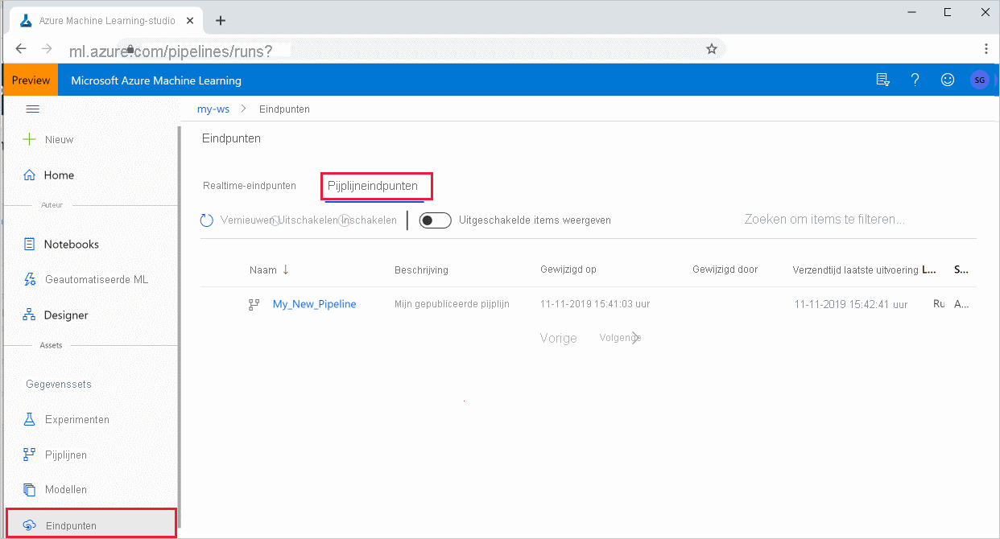

# <a name="publish-and-track-machine-learning-pipelines"></a>machine learning pijp lijnen publiceren en bijhouden


In dit artikel wordt uitgelegd hoe u een machine learning pijp lijn met uw collega's of klanten kunt delen.

Machine learning-pijp lijnen zijn herbruikbare werk stromen voor machine learning taken. Een voor deel van pijp lijnen is meer samen werking. U kunt ook pijp lijnen van de versie, zodat klanten het huidige model kunnen gebruiken terwijl u met een nieuwe versie werkt. 

## <a name="prerequisites"></a>Vereisten

* Een [Azure machine learning-werk ruimte](how-to-manage-workspace.md) maken om al uw pijplijn resources te bevatten

* [Configureer uw ontwikkel omgeving](how-to-configure-environment.md) om de Azure machine learning SDK te installeren, of gebruik een [Azure machine learning reken instantie](concept-compute-instance.md) met de SDK al geïnstalleerd

* Een machine learning pijp lijn maken en uitvoeren, zoals in de volgende [zelf studie: een Azure machine learning pijp lijn bouwen voor batch scores](tutorial-pipeline-batch-scoring-classification.md). Zie voor andere opties [machine learning pijp lijnen maken en uitvoeren met Azure machine learning SDK](how-to-create-your-first-pipeline.md)

## <a name="publish-a-pipeline"></a>Een pijp lijn publiceren

Zodra u een pijp lijn hebt geactiveerd, kunt u een pijp lijn publiceren zodat deze wordt uitgevoerd met verschillende invoer. Voor het REST-eind punt van een al gepubliceerde pijp lijn om para meters te accepteren, moet u uw pijp lijn configureren om objecten te gebruiken `PipelineParameter` voor de argumenten die kunnen variëren.

1. Als u een pijplijn parameter wilt maken, gebruikt u een [PipelineParameter](https://docs.microsoft.com/python/api/azureml-pipeline-core/azureml.pipeline.core.graph.pipelineparameter?view=azure-ml-py&preserve-view=true) -object met een standaard waarde.

   ```python
   from azureml.pipeline.core.graph import PipelineParameter
   
   pipeline_param = PipelineParameter(
     name="pipeline_arg",
     default_value=10)
   ```

2. Voeg als `PipelineParameter` volgt dit object toe als een para meter voor een van de stappen in de pijp lijn:

   ```python
   compareStep = PythonScriptStep(
     script_name="compare.py",
     arguments=["--comp_data1", comp_data1, "--comp_data2", comp_data2, "--output_data", out_data3, "--param1", pipeline_param],
     inputs=[ comp_data1, comp_data2],
     outputs=[out_data3],
     compute_target=compute_target,
     source_directory=project_folder)
   ```

3. Publiceer deze pijp lijn die een para meter accepteert wanneer deze wordt aangeroepen.

   ```python
   published_pipeline1 = pipeline_run1.publish_pipeline(
        name="My_Published_Pipeline",
        description="My Published Pipeline Description",
        version="1.0")
   ```

## <a name="run-a-published-pipeline"></a>Een gepubliceerde pijp lijn uitvoeren

Alle gepubliceerde pijp lijnen hebben een REST-eind punt. Met het eind punt van de pijp lijn kunt u een uitvoering van de pijp lijn activeren vanaf elk extern systeem, inclusief niet-python-clients. Met dit eind punt wordt ' beheerde Herhaal baarheid ' ingeschakeld in batch-scores en retraining-scenario's.

Als u de uitvoering van de voor gaande pijp lijn wilt aanroepen, hebt u een token voor de Azure Active Directory-verificatie header nodig. Het ophalen van een dergelijk token wordt beschreven in de [AzureCliAuthentication-klasse](https://docs.microsoft.com/python/api/azureml-core/azureml.core.authentication.azurecliauthentication?view=azure-ml-py&preserve-view=true) verwijzing en in de [verificatie in azure machine learning](https://aka.ms/pl-restep-auth) notitie blok.

```python
from azureml.pipeline.core import PublishedPipeline
import requests

response = requests.post(published_pipeline1.endpoint,
                         headers=aad_token,
                         json={"ExperimentName": "My_Pipeline",
                               "ParameterAssignments": {"pipeline_arg": 20}})
```

## <a name="create-a-versioned-pipeline-endpoint"></a>Een versie-pipeline-eind punt maken

U kunt een pijplijn eindpunt met meerdere gepubliceerde pijp lijnen achter het eind punt maken. Dit geeft u een vast REST-eind punt wanneer u uw ML-pijp lijnen herhaalt en bijwerkt.

```python
from azureml.pipeline.core import PipelineEndpoint

published_pipeline = PipelineEndpoint.get(workspace=ws, name="My_Published_Pipeline")
pipeline_endpoint = PipelineEndpoint.publish(workspace=ws, name="PipelineEndpointTest",
                                            pipeline=published_pipeline, description="Test description Notebook")
```

## <a name="submit-a-job-to-a-pipeline-endpoint"></a>Een taak naar een pijplijn eindpunt verzenden

U kunt een taak verzenden naar de standaard versie van een pijplijn eindpunt:

```python
pipeline_endpoint_by_name = PipelineEndpoint.get(workspace=ws, name="PipelineEndpointTest")
run_id = pipeline_endpoint_by_name.submit("PipelineEndpointExperiment")
print(run_id)
```

U kunt ook een taak naar een specifieke versie verzenden:

```python
run_id = pipeline_endpoint_by_name.submit("PipelineEndpointExperiment", pipeline_version="0")
print(run_id)
```

Dit kan hetzelfde doen met behulp van de REST API:

```python
rest_endpoint = pipeline_endpoint_by_name.endpoint
response = requests.post(rest_endpoint, 
                         headers=aad_token, 
                         json={"ExperimentName": "PipelineEndpointExperiment",
                               "RunSource": "API",
                               "ParameterAssignments": {"1": "united", "2":"city"}})
```

## <a name="use-published-pipelines-in-the-studio"></a>Gepubliceerde pijp lijnen gebruiken in de Studio

U kunt ook een gepubliceerde pijp lijn uitvoeren vanuit de studio:

1. Meld u aan bij [Azure Machine Learning Studio](https://ml.azure.com).

1. [Uw werk ruimte weer geven](how-to-manage-workspace.md#view).

1. Selecteer aan de linkerkant **eind punten**.

1. Selecteer bovenaan de **pijp lijn-eind punten**.
 

1. Selecteer een specifieke pijp lijn om uit te voeren, te gebruiken of Bekijk de resultaten van de vorige uitvoeringen van het pijplijn eindpunt.

## <a name="disable-a-published-pipeline"></a>Een gepubliceerde pijp lijn uitschakelen

Als u een pijp lijn wilt verbergen in de lijst met gepubliceerde pijp lijnen, schakelt u deze uit in de studio of vanuit de SDK:

```python
# Get the pipeline by using its ID from Azure Machine Learning studio
p = PublishedPipeline.get(ws, id="068f4885-7088-424b-8ce2-eeb9ba5381a6")
p.disable()
```

U kunt deze opnieuw inschakelen met `p.enable()` . Zie referentie [PublishedPipeline](https://docs.microsoft.com/python/api/azureml-pipeline-core/azureml.pipeline.core.publishedpipeline?view=azure-ml-py&preserve-view=true) voor meer informatie.

## <a name="next-steps"></a>Volgende stappen

- Gebruik [deze Jupyter-notebooks op github](https://aka.ms/aml-pipeline-readme) om machine learning pijp lijnen verder te verkennen.
- Zie de SDK-Naslag informatie voor het pakket met het kern pakket voor [azureml-pijp lijnen](https://docs.microsoft.com/python/api/azureml-pipeline-core/?view=azure-ml-py&preserve-view=true) en de stappen voor het [oplossen van azureml-pijp lijnen](https://docs.microsoft.com/python/api/azureml-pipeline-steps/?view=azure-ml-py&preserve-view=true) .
- Raadpleeg de [hand](how-to-debug-pipelines.md) leiding voor tips over het opsporen van fouten en pijp lijnen voor probleem oplossing.
