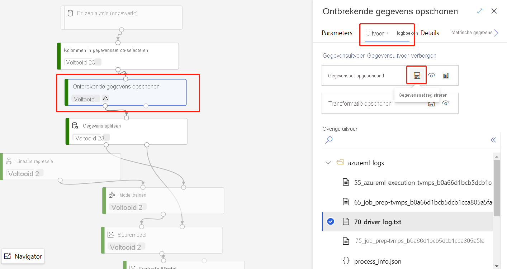
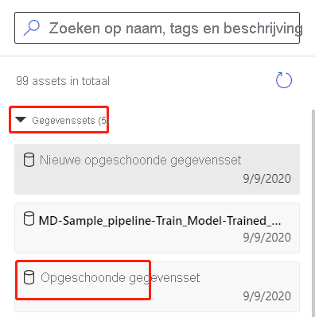

# Uw gegevens importeren in Azure Machine Learning Designer (preview)

In dit artikel leert u hoe u uw eigen gegevens in de ontwerp functie kunt importeren om aangepaste oplossingen te maken. Er zijn twee manieren waarop u gegevens kunt importeren in de ontwerp functie: 

* **Azure machine learning gegevens sets** : [gegevens sets](concept-data.md#datasets) registreren in azure machine learning om geavanceerde functies in te scha kelen die u helpen bij het beheren van uw gegevens.
* **Gegevens module importeren** : gebruik de module [gegevens importeren](algorithm-module-reference/import-data.md) om rechtstreeks toegang te krijgen tot gegevens uit online gegevens bronnen.

## Azure Machine Learning gegevens sets gebruiken

U wordt aangeraden gegevens [sets](concept-data.md#datasets) te gebruiken voor het importeren in de ontwerp functie. Wanneer u een gegevensset registreert, kunt u profiteren van geavanceerde gegevens functies, zoals [versie beheer en bijhouden](how-to-version-track-datasets.md) van [gegevens](how-to-monitor-datasets.md).

### Een gegevensset registreren

U kunt bestaande gegevens sets [programmatisch registreren met de SDK](how-to-create-register-datasets.md#use-the-sdk) of [visueel in azure machine learning Studio](how-to-create-register-datasets.md#use-the-ui).

U kunt de uitvoer voor elke ontwerp module ook registreren als een gegevensset.

1. Selecteer de module die de gegevens levert die u wilt registreren.

1. Selecteer in het deel venster Eigenschappen de optie **uitvoer**  >  **van gegevensset registreren**.

    

### Een gegevensset gebruiken

U kunt de geregistreerde gegevens sets vinden in het palet module, onder **gegevens sets**van  >  **mijn gegevens**sets. Als u een gegevensset wilt gebruiken, sleept u deze naar het pijp lijn-canvas. Verbind vervolgens de uitvoer poort van de gegevensset met andere modules in het palet.

> [!NOTE]
> De ontwerp functie biedt momenteel alleen ondersteuning voor het verwerken van [tabellaire gegevens sets](how-to-create-register-datasets.md#dataset-types). Als u [bestands gegevens sets](how-to-create-register-datasets.md#dataset-types)wilt gebruiken, gebruikt u de Azure machine learning SDK die beschikbaar is voor python en R.

## Gegevens importeren met behulp van de module gegevens importeren

We raden u aan om gegevens sets te gebruiken voor het importeren van informatie, maar u kunt ook de module [gegevens importeren](algorithm-module-reference/import-data.md) gebruiken. De module gegevens importeren slaat de registratie van uw gegevensset in Azure Machine Learning over en importeert gegevens rechtstreeks vanuit een [Data Store](concept-data.md#datastores) -of http-URL.

Zie de [referentie pagina gegevens importeren](algorithm-module-reference/import-data.md)voor gedetailleerde informatie over het gebruik van de module gegevens importeren.

> [!NOTE]
> Als uw gegevensset te veel kolommen bevat, kan de volgende fout optreden: "validatie mislukt vanwege grootte beperking". Als u dit wilt voor komen, [registreert u de gegevensset in de gegevens sets-interface](how-to-create-register-datasets.md#use-the-ui).

## Ondersteunde bronnen

In deze sectie vindt u de gegevens bronnen die worden ondersteund door de ontwerper. Gegevens worden in de ontwerp functie geleverd vanuit een gegevens opslag of een [gegevensset in tabel vorm](how-to-create-register-datasets.md#dataset-types).

### Data Store-bronnen
Zie [toegang tot gegevens in azure Storage-services](how-to-access-data.md#supported-data-storage-service-types)voor een lijst met ondersteunde gegevens opslag bronnen.

### Bron tabel van gegevensset

De ontwerp functie ondersteunt tabellaire gegevens sets die zijn gemaakt op basis van de volgende bronnen:
 * Bestanden met scheidings tekens
 * JSON-bestanden
 * Parquet-bestanden
 * SQL-query's

## Gegevenstypen

De Designer herkent intern de volgende gegevens typen:

* Tekenreeks
* Geheel getal
* Decimal
* Booleaans
* Date

De ontwerp functie maakt gebruik van een intern gegevens type om gegevens tussen modules door te geven. U kunt uw gegevens in de indeling van de gegevens tabel expliciet converteren met behulp van de module [converteren naar dataset](algorithm-module-reference/convert-to-dataset.md) . Alle modules die andere indelingen dan de interne indeling accepteren, worden de gegevens op de achtergrond geconverteerd voordat deze aan de volgende module worden door gegeven.

## Gegevens beperkingen

Modules in de ontwerp functie worden beperkt door de grootte van het berekenings doel. Voor grotere gegevens sets moet u een grotere Azure Machine Learning Reken Resource gebruiken. Zie [Wat zijn Compute-doelen in azure machine learning?](concept-compute-target.md#azure-machine-learning-compute-managed) voor meer informatie over Azure machine learning compute.

## Volgende stappen

Leer de basis beginselen van de ontwerp functie met [de zelf studie: prijs van auto Mobile voor speld met de ontwerp functie](tutorial-designer-automobile-price-train-score.md).
