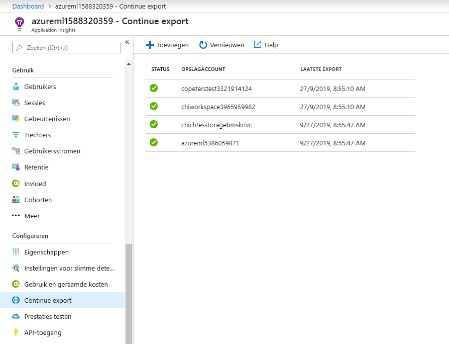

# <a name="monitor-and-collect-data-from-ml-web-service-endpoints"></a>Gegevens van ML-webservice-eind punten bewaken en verzamelen
[!INCLUDE [applies-to-skus](../../includes/aml-applies-to-basic-enterprise-sku.md)]

In dit artikel leert u hoe u gegevens kunt verzamelen van en bewaakt modellen die zijn geïmplementeerd op web service-eind punten in azure Kubernetes service (AKS) of Azure Container Instances (ACI) door Azure-toepassing inzichten in te scha kelen via 
* [Azure Machine Learning python-SDK](#python)
* [Azure machine learning Studio](#studio) ophttps://ml.azure.com

Naast het verzamelen van de uitvoer gegevens en het antwoord van een eind punt kunt u het volgende controleren:

* Aanvraag tarieven, reactie tijden en fout tarieven
* Afhankelijkheids tarieven, reactie tijden en fout percentages
* Uitzonderingen

[Meer informatie over Azure-toepassing Insights](../azure-monitor/app/app-insights-overview.md). 


## <a name="prerequisites"></a>Vereisten

* Als u geen Azure-abonnement hebt, maak dan een gratis account voordat u begint. Probeer vandaag nog de [gratis of betaalde versie van Azure machine learning](https://aka.ms/AMLFree)

* Een Azure Machine Learning-werk ruimte, een lokale map die uw scripts bevat en de Azure Machine Learning SDK voor python is geïnstalleerd. Zie [een ontwikkel omgeving configureren](how-to-configure-environment.md) voor meer informatie over het verkrijgen van deze vereisten.

* Een getraind machine learning model dat moet worden geïmplementeerd in azure Kubernetes service (AKS) of Azure container instance (ACI). Als u er nog geen hebt, raadpleegt u de zelf studie over het [classificatie Model Train image](tutorial-train-models-with-aml.md)

## <a name="web-service-metadata-and-response-data"></a>Meta gegevens en antwoord van de webservice

>[!Important]
> Met Azure-toepassing Insights worden alleen nettoladingen geregistreerd van Maxi maal 64 kB. Als deze limiet is bereikt, worden alleen de meest recente uitvoer van het model vastgelegd. 

De meta gegevens en het antwoord op de service-die overeenkomen met de meta gegevens van de webservice en de voor spellingen van het model, worden vastgelegd in de Azure-toepassing Insights-traceringen onder het bericht `"model_data_collection"` . U kunt Azure-toepassing inzichten rechtstreeks doorzoeken op toegang tot deze gegevens of een [continue export](https://docs.microsoft.com/azure/azure-monitor/app/export-telemetry) naar een opslag account instellen voor een langere retentie of verdere verwerking. Model gegevens kunnen vervolgens worden gebruikt in de Azure Machine Learning voor het instellen van labels, retraining, uitleg, gegevens analyse of ander gebruik. 

<a name="python"></a>

## <a name="use-python-sdk-to-configure"></a>Python-SDK gebruiken om te configureren 

### <a name="update-a-deployed-service"></a>Een geïmplementeerde service bijwerken

1. Identificeer de service in uw werk ruimte. De waarde voor `ws` is de naam van uw werk ruimte

    ```python
    from azureml.core.webservice import Webservice
    aks_service= Webservice(ws, "my-service-name")
    ```
2. Uw service bijwerken en Azure-toepassing Insights inschakelen

    ```python
    aks_service.update(enable_app_insights=True)
    ```

### <a name="log-custom-traces-in-your-service"></a>Aangepaste traceringen vastleggen in uw service

Als u aangepaste traceringen wilt registreren, volgt u het standaard implementatie proces voor AKS of ACI in het document [implementeren en where](how-to-deploy-and-where.md) . Gebruik vervolgens de volgende stappen:

1. Het Score bestand bijwerken door afdruk instructies toe te voegen
    
    ```python
    print ("model initialized" + time.strftime("%H:%M:%S"))
    ```

2. De service configuratie bijwerken
    
    ```python
    config = Webservice.deploy_configuration(enable_app_insights=True)
    ```

3. Bouw een installatie kopie en implementeer deze op [AKS of ACI](how-to-deploy-and-where.md).

### <a name="disable-tracking-in-python"></a>Tracering in python uitschakelen

Als u Azure-toepassing Insights wilt uitschakelen, gebruikt u de volgende code:

```python 
## replace <service_name> with the name of the web service
<service_name>.update(enable_app_insights=False)
```

<a name="studio"></a>

## <a name="use-azure-machine-learning-studio-to-configure"></a>Azure Machine Learning Studio gebruiken om te configureren

U kunt ook Azure-toepassing Insights inschakelen vanuit Azure Machine Learning Studio wanneer u klaar bent om uw model te implementeren met behulp van de volgende stappen.

1. Meld u aan bij uw werk ruimte ophttps://ml.azure.com/
1. Ga naar **modellen** en selecteer welk model u wilt implementeren
1. Selecteer **+ implementeren**
1. Het formulier **model implementeren** invullen
1. Het menu **Geavanceerd** uitvouwen

    
1. Selecteer **Application Insights diagnose en gegevens verzameling inschakelen**

    
## <a name="evaluate-data"></a>Gegevens evalueren
De gegevens van uw service worden opgeslagen in uw Azure-toepassing Insights-account, in dezelfde resource groep als Azure Machine Learning.
Om het weer te geven:

1. Ga in de [Azure Portal](https://ms.portal.azure.com/) naar uw Azure machine learning-werk ruimte en klik op de koppeling Application Insights

    [](././media/how-to-enable-app-insights/AppInsightsLoc.png#lightbox)

1. Selecteer het tabblad **overzicht** om een basis verzameling metrische gegevens voor uw service weer te geven

   [](././media/how-to-enable-app-insights/overview.png#lightbox)

1. Als u de meta gegevens en het antwoord van de webservice-aanvraag wilt bekijken, selecteert u de tabel **aanvragen** in het gedeelte **Logboeken (Analytics)** en selecteert u **uitvoeren** om aanvragen weer te geven.

   [](././media/how-to-enable-app-insights/model-data-trace.png#lightbox)


3. Als u wilt zoeken naar uw aangepaste traceringen, selecteert u **Analytics**
4. Selecteer in de sectie schema **traceringen**. Selecteer vervolgens **uitvoeren** om de query uit te voeren. Gegevens moeten worden weer gegeven in een tabel indeling en moeten worden toegewezen aan uw aangepaste aanroepen in uw score bestand

   [](././media/how-to-enable-app-insights/logs.png#lightbox)

Zie [Wat is Application Insights?](../azure-monitor/app/app-insights-overview.md)voor meer informatie over het gebruik van Azure-toepassing Insights.

## <a name="export-data-for-further-processing-and-longer-retention"></a>Gegevens exporteren voor verdere verwerking en langere retentie

>[!Important]
> Azure-toepassing Insights ondersteunt alleen export naar Blob Storage. Aanvullende limieten van deze export mogelijkheid worden vermeld in [telemetrie exporteren vanuit app Insights](https://docs.microsoft.com/azure/azure-monitor/app/export-telemetry#continuous-export-advanced-storage-configuration).

U kunt met behulp van Azure-toepassing Insights [doorlopend exporteren](https://docs.microsoft.com/azure/azure-monitor/app/export-telemetry) berichten verzenden naar een ondersteund opslag account, waarbij een langere retentie kan worden ingesteld. De `"model_data_collection"` berichten worden opgeslagen in JSON-indeling en kunnen gemakkelijk worden geparseerd om model gegevens op te halen. 

Azure Data Factory, Azure ML-pijp lijnen of andere hulpprogram ma's voor gegevens verwerking kunnen worden gebruikt om de gegevens naar behoefte te transformeren. Wanneer u de gegevens hebt getransformeerd, kunt u deze registreren bij de Azure Machine Learning-werk ruimte als een gegevensset. Zie [gegevens sets maken en registreren](how-to-create-register-datasets.md)voor meer informatie.

   [](././media/how-to-enable-app-insights/continuous-export-setup.png)


## <a name="example-notebook"></a>Voor beeld van notebook

De [Enable-app-Insights-in-production-service. ipynb-](https://github.com/Azure/MachineLearningNotebooks/blob/master/how-to-use-azureml/deployment/enable-app-insights-in-production-service/enable-app-insights-in-production-service.ipynb) notebook demonstreert de concepten in dit artikel. 
 
[!INCLUDE [aml-clone-in-azure-notebook](../../includes/aml-clone-for-examples.md)]

## <a name="next-steps"></a>Volgende stappen

* Zie [een model implementeren in een Azure Kubernetes-service cluster](https://docs.microsoft.com/azure/machine-learning/how-to-deploy-azure-kubernetes-service) of [een model implementeren in azure container instances](https://docs.microsoft.com/azure/machine-learning/how-to-deploy-azure-container-instance) om uw modellen te implementeren voor webservice-eind punten, en Azure-toepassing Insights in te scha kelen voor het gebruik van gegevens verzameling en eindpunt bewaking
* Zie [MLOps: modellen beheren, implementeren en bewaken met Azure machine learning](https://docs.microsoft.com/azure/machine-learning/concept-model-management-and-deployment) voor meer informatie over het benutten van gegevens die zijn verzameld van modellen in productie. Dergelijke gegevens kunnen helpen uw machine learning proces voortdurend te verbeteren
