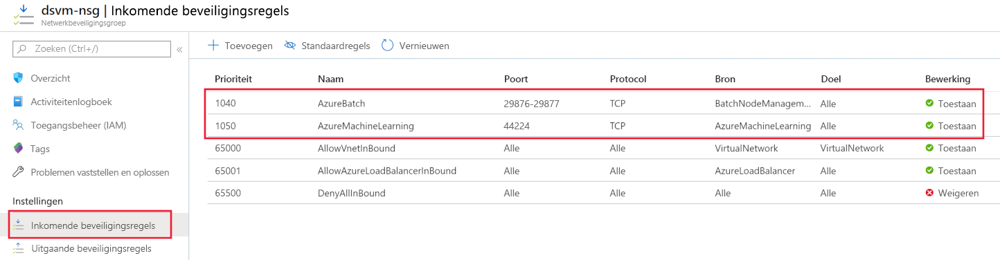

# <a name="secure-azure-ml-experimentation-and-inference-jobs-within-an-azure-virtual-network"></a>Azure ML-experimenten en inference-taken beveiligen binnen een Azure Virtual Network
[!INCLUDE [applies-to-skus](../../includes/aml-applies-to-basic-enterprise-sku.md)]

In dit artikel leert u hoe u experimenten/trainingstaken en inference/scoring-taken in Azure Machine Learning (vnet) beveiligen.

Een **virtueel netwerk** fungeert als een beveiligingsgrens en isoleert uw Azure-bronnen van het openbare internet. U ook lid worden van een virtueel Azure-netwerk met uw on-premises netwerk. Door lid te worden van netwerken, u uw modellen veilig trainen en toegang krijgen tot uw geïmplementeerde modellen voor gevolgtrekking.

Azure Machine Learning is afhankelijk van andere Azure-services voor rekenbronnen. Compute resources, of [compute targets,](concept-compute-target.md)worden gebruikt om modellen te trainen en te implementeren. De doelen kunnen worden gemaakt binnen een virtueel netwerk. U bijvoorbeeld Microsoft Data Science Virtual Machine gebruiken om een model te trainen en het model vervolgens te implementeren in Azure Kubernetes Service (AKS). Zie overzicht van azure [virtual network](https://docs.microsoft.com/azure/virtual-network/virtual-networks-overview)voor meer informatie over virtuele netwerken.

Dit artikel bevat ook gedetailleerde informatie over *geavanceerde beveiligingsinstellingen,* informatie die niet nodig is voor basis- of experimentele use cases. Bepaalde delen van dit artikel bieden configuratie-informatie voor verschillende scenario's. U hoeft de instructies niet in orde of in hun geheel in te vullen.

> [!TIP]
> Tenzij specifiek genoemd, zal het gebruik van resources zoals opslagaccounts of rekendoelen binnen een virtueel netwerk werken met zowel machine learning-pijplijnen als niet-pijplijnwerkstromen zoals scriptuitvoeringen.

> [!WARNING]
> Microsoft biedt geen ondersteuning voor het gebruik van de azure machine learning studio-functies zoals Automated ML, Datasets, Datalabeling, Designer en Notebooks als de onderliggende opslag is ingeschakeld voor virtueel netwerk.

## <a name="prerequisites"></a>Vereisten

+ Een Azure Machine [Learning-werkruimte](how-to-manage-workspace.md).

+ Algemene werkkennis van zowel de [Azure Virtual Network-service](https://docs.microsoft.com/azure/virtual-network/virtual-networks-overview) als [IP-netwerken.](https://docs.microsoft.com/azure/virtual-network/virtual-network-ip-addresses-overview-arm)

+ Een reeds bestaand virtueel netwerk en subnet om te gebruiken met uw compute resources.

## <a name="use-a-storage-account-for-your-workspace"></a>Een opslagaccount gebruiken voor uw werkruimte

> [!WARNING]
> Als u gegevenswetenschappers hebt die de Azure Machine Learning-ontwerper gebruiken, ontvangt deze een foutmelding bij het visualiseren van gegevens van een opslagaccount binnen een virtueel netwerk. De volgende tekst is de fout die ze ontvangen:
>
> __Fout: kan deze gegevensset niet profileren. Dit kan zijn omdat uw gegevens achter een virtueel netwerk zijn opgeslagen of omdat uw gegevens geen profiel ondersteunen.__

Als u een Azure-opslagaccount wilt gebruiken voor de werkruimte in een virtueel netwerk, gebruikt u de volgende stappen:

1. Maak een compute resource (bijvoorbeeld een Machine Learning compute instance of cluster) achter een virtueel netwerk of voeg een compute resource toe aan de werkruimte (bijvoorbeeld een HDInsight-cluster, virtuele machine of Azure Kubernetes Service-cluster). De compute resource kan zijn voor experimenten of modelimplementatie.

   Zie de secties [Gebruik een Machine Learning compute](#amlcompute), Use a virtual machine of [HDInsight-cluster](#vmorhdi)en Gebruik De secties [Kubernetes Service](#aksvnet) gebruiken in dit artikel voor meer informatie.

1. Ga in de Azure-portal naar de opslag die is gekoppeld aan uw werkruimte.

   [](./media/how-to-enable-virtual-network/workspace-storage.png#lightbox)

1. Selecteer op de pagina **Azure Storage** de optie __Firewalls en virtuele netwerken__.

   

1. Ga op de pagina __Firewalls en virtuele netwerken__ de volgende acties uitvoeren:
    - Selecteer __Geselecteerde netwerken__.
    - Selecteer __onder Virtuele netwerken__de bestaande virtuele __netwerkkoppeling toevoegen.__ Met deze actie wordt het virtuele netwerk toegevoegd waar uw gegevens bevindt (zie stap 1).

        > [!IMPORTANT]
        > Het opslagaccount moet zich in hetzelfde virtuele netwerk en subnet bevinden als de rekeninstanties of clusters die worden gebruikt voor training of gevolgtrekking.

    - Schakel het selectievakje __Vertrouwde Microsoft-services toestaan om toegang te krijgen tot dit opslagaccount__ in.

    > [!IMPORTANT]
    > Wanneer u met de Azure Machine Learning SDK werkt, moet uw ontwikkelomgeving verbinding kunnen maken met het Azure Storage-account. Wanneer het opslagaccount zich in een virtueel netwerk bevindt, moet de firewall toegang toestaan vanaf het IP-adres van de ontwikkelomgeving.
    >
    > Als u toegang tot het opslagaccount wilt inschakelen, gaat u naar de __firewalls en virtuele netwerken__ voor het opslagaccount *vanuit een webbrowser op de ontwikkelclient.* Gebruik vervolgens het __selectievakje IP-adres van uw client toevoegen__ om het IP-adres van de client toe te voegen aan het __adresbereik.__ U ook het veld __ADRESBEREIK__ gebruiken om handmatig het IP-adres van de ontwikkelomgeving in te voeren. Zodra het IP-adres voor de client is toegevoegd, heeft het toegang tot het opslagaccount via de SDK.

   [](./media/how-to-enable-virtual-network/storage-firewalls-and-virtual-networks-page.png#lightbox)

> [!IMPORTANT]
> U het _standaardopslagaccount_ voor Azure Machine Learning of _niet-standaardopslagaccounts_ in een virtueel netwerk plaatsen.
>
> Het standaardopslagaccount wordt automatisch ingericht wanneer u een werkruimte maakt.
>
> Voor niet-standaardopslagaccounts `storage_account` kunt u met de parameter in de [ `Workspace.create()` functie](https://docs.microsoft.com/python/api/azureml-core/azureml.core.workspace(class)?view=azure-ml-py#create-name--auth-none--subscription-id-none--resource-group-none--location-none--create-resource-group-true--sku--basic---friendly-name-none--storage-account-none--key-vault-none--app-insights-none--container-registry-none--cmk-keyvault-none--resource-cmk-uri-none--hbi-workspace-false--default-cpu-compute-target-none--default-gpu-compute-target-none--exist-ok-false--show-output-true-) een aangepast opslagaccount opgeven op Azure-bron-id.

## <a name="use-azure-data-lake-storage-gen-2"></a>Azure Data Lake Storage Gen 2 gebruiken

Azure Data Lake Storage Gen 2 is een reeks mogelijkheden voor big data-analyses, gebouwd op Azure Blob-opslag. Het kan worden gebruikt om gegevens op te slaan die worden gebruikt om modellen te trainen met Azure Machine Learning. 

Als u Data Lake Storage Gen 2 wilt gebruiken in het virtuele netwerk van uw Azure Machine Learning-werkruimte, gebruikt u de volgende stappen:

1. Maak een Azure Data Lake Storage gen 2-account. Zie [Een Azure Data Lake Storage Gen2-opslagaccount maken voor](../storage/blobs/data-lake-storage-quickstart-create-account.md)meer informatie .

1. Gebruik de stappen 2-4 in de vorige sectie, [Gebruik een opslagaccount voor uw werkruimte](#use-a-storage-account-for-your-workspace)om het account in het virtuele netwerk te plaatsen.

Wanneer u Azure Machine Learning gebruikt met Data Lake Storage Gen 2 in een virtueel netwerk, gebruikt u de volgende richtlijnen:

* Als u de SDK gebruikt __om een gegevensset te maken__en het systeem waarop de code wordt __uitgevoerd, zich niet in het virtuele netwerk bevindt,__ gebruikt u de `validate=False` parameter. Deze parameter slaat validatie over, die mislukt als het systeem zich niet in hetzelfde virtuele netwerk bevindt als het opslagaccount. Zie de methode [from_files()](https://docs.microsoft.com/python/api/azureml-core/azureml.data.dataset_factory.filedatasetfactory?view=azure-ml-py#from-files-path--validate-true-) voor meer informatie.

* Wanneer u Azure Machine Learning Compute Instance of compute cluster gebruikt om een model te trainen met de gegevensset, moet het zich in hetzelfde virtuele netwerk bevinden als het opslagaccount.

## <a name="use-a-key-vault-instance-with-your-workspace"></a>Een sleutelkluisinstantie gebruiken met uw werkruimte

De sleutelinstantie van de kluis die aan de werkruimte is gekoppeld, wordt door Azure Machine Learning gebruikt om de volgende referenties op te slaan:
* De tekenreeks voor de gekoppelde opslagaccountverbinding
* Wachtwoorden voor Azure Container Repository-exemplaren
* Verbindingstekenreeksen met gegevensopslag

Als u Azure Machine Learning-experimenteermogelijkheden wilt gebruiken met Azure Key Vault achter een virtueel netwerk, gebruikt u de volgende stappen:

1. Ga naar de sleutelkluis die is gekoppeld aan de werkruimte.

   [](./media/how-to-enable-virtual-network/workspace-key-vault.png#lightbox)

1. Selecteer op de pagina **Key Vault** in het linkerdeelvenster __Firewalls en virtuele netwerken.__

   

1. Ga op de pagina __Firewalls en virtuele netwerken__ de volgende acties uitvoeren:
    - Selecteer geselecteerde netwerken __onder Toegang toestaan vanuit__selecteer Geselecteerde __netwerken__.
    - Selecteer __onder Virtuele netwerken__de optie Bestaande virtuele netwerken __toevoegen__ om het virtuele netwerk toe te voegen waar uw experimenten worden berekend.
    - Selecteer __Onder Vertrouwde Microsoft-services toestaan deze firewall te omzeilen,__ de optie __Ja__.

   [](./media/how-to-enable-virtual-network/key-vault-firewalls-and-virtual-networks-page.png#lightbox)

<a id="amlcompute"></a>

## <a name="use-a-machine-learning-compute"></a><a name="compute-instance"></a>Een Machine Learning Compute gebruiken

Als u een computerinstantie of rekencluster van Azure Machine Learning of compute cluster in een virtueel netwerk wilt gebruiken, moet aan de volgende netwerkvereisten worden voldaan:

> [!div class="checklist"]
> * Het virtuele netwerk moet zich in hetzelfde abonnement en dezelfde regio bevinden als de Azure Machine Learning-werkruimte.
> * Het subnet dat is opgegeven voor de rekeninstantie of het cluster moet voldoende niet-toegewezen IP-adressen hebben om het aantal VM's dat is gericht, aan te passen. Als het subnet niet genoeg niet-toegewezen IP-adressen heeft, wordt een compute cluster gedeeltelijk toegewezen.
> * Controleer of uw beveiligingsbeleid of vergrendelingen op het abonnement of de brongroep van het virtuele netwerk de machtigingen voor het beheer van het virtuele netwerk beperken. Als u van plan bent het virtuele netwerk te beveiligen door het verkeer te beperken, laat u sommige poorten open voor de compute-service. Zie de sectie [Vereiste poorten](#mlcports) voor meer informatie.
> * Als u meerdere rekeninstanties of clusters in één virtueel netwerk wilt plaatsen, moet u mogelijk een quotumverhoging aanvragen voor een of meer van uw resources.
> * Als het Azure Storage Account(s) voor de werkruimte ook in een virtueel netwerk is beveiligd, moeten ze zich in hetzelfde virtuele netwerk bevinden als de rekeninstantie of cluster Azure Machine Learning. 

> [!TIP]
> Met de rekeninstantie of het cluster Machine Learning worden automatisch extra netwerkbronnen toegewezen in de brongroep die het virtuele netwerk bevat. Voor elke rekeninstantie of cluster wijst de service de volgende resources toe:
> 
> * Eén netwerkbeveiligingsgroep
> * Eén openbaar IP-adres
> * Eén load balancer
> 
> De beperkingen die voor deze resources gelden, worden bepaald door de [resourcequota](https://docs.microsoft.com/azure/azure-resource-manager/management/azure-subscription-service-limits) van het abonnement.


### <a name="required-ports"></a><a id="mlcports"></a>Vereiste poorten

Machine Learning Compute gebruikt momenteel de Azure Batch-service voor het inrichten van VM's in het opgegeven virtuele netwerk. Het subnet moet binnenkomende communicatie van de Batch-service toestaan. U gebruikt deze communicatie om uitvoeringen te plannen op de Machine Learning Compute-knooppunten en om te communiceren met Azure Storage en andere bronnen. De Batch-service voegt netwerkbeveiligingsgroepen (NSG's) toe op het niveau van netwerkinterfaces (NIC's) die zijn gekoppeld aan VM's. Met deze netwerkbeveiligingsgroepen worden automatisch binnenkomende en uitgaande regels geconfigureerd om het volgende verkeer toe te staan:

- Binnenkomend TCP-verkeer op poorten 29876 en 29877 vanuit een __servicetag__ van __BatchNodeManagement__.

    

- (Optioneel) Binnenkomend TCP-verkeer op poort 22 om toegang op afstand mogelijk te maken. Gebruik deze poort alleen als u verbinding wilt maken met SSH op het openbare IP-adres.

- Uitgaand verkeer op een willekeurige poort naar het virtuele netwerk.

- Uitgaand verkeer op een willekeurige poort naar internet.

- Voor compute instance inbound TCP-verkeer op poort 44224 vanuit een __servicetag__ van __AzureMachineLearning__.

Wees voorzichtig als u binnenkomende of uitgaande regels toevoegt of wijzigt in netwerkbeveiligingsgroepen die door Batch zijn geconfigureerd. Als een NSG de communicatie naar de compute nodes blokkeert, stelt de compute service de status van de compute nodes in op onbruikbaar.

U hoeft geen NSGs op subnetniveau op te geven, omdat de Azure Batch-service zijn eigen NSG's configureert. Als het opgegeven subnet echter gekoppelde NSG's of een firewall heeft, configureert u de binnenkomende en uitgaande beveiligingsregels zoals eerder vermeld.

De NSG-regelconfiguratie in de Azure-portal wordt weergegeven in de volgende afbeeldingen:

[](./media/how-to-enable-virtual-network/amlcompute-virtual-network-inbound.png#lightbox)


### <a name="limit-outbound-connectivity-from-the-virtual-network"></a><a id="limiting-outbound-from-vnet"></a>Uitgaande connectiviteit van het virtuele netwerk beperken

Als u de standaardregels voor uitgaande regels niet wilt gebruiken en u de uitgaande toegang van uw virtuele netwerk wilt beperken, gebruikt u de volgende stappen:

- Ontken uitgaande internetverbinding met behulp van de NSG-regels.

- Beperk uitgaand verkeer voor een __rekeninstantie__ of een __rekencluster__tot de volgende items:
   - Azure Storage, met behulp van __Service Tag__ of __Storage.RegionName__. Waar `{RegionName}` is de naam van een Azure-gebied.
   - Azure Container Registry, met behulp van __Service Tag__ van __AzureContainerRegistry.RegionName__. Waar `{RegionName}` is de naam van een Azure-gebied.
   - Azure Machine Learning, met behulp van __servicetag__ van __AzureMachineLearning__
   - Azure Resource Manager, met behulp van __Service Tag__ van __AzureResourceManager__
   - Azure Active Directory, met behulp van __ServiceTag__ van __AzureActiveDirectory__

De NSG-regelconfiguratie in de Azure-portal wordt weergegeven in de volgende afbeelding:

[](./media/how-to-enable-virtual-network/limited-outbound-nsg-exp.png#lightbox)

> [!NOTE]
> Als u van plan bent standaard Docker-afbeeldingen van Microsoft te gebruiken en gebruikersafhankelijkheden in te schakelen, moet u ook een __servicetag__ van __MicrosoftContainerRegistry.Region_Name__ (bijvoorbeeld MicrosoftContainerRegistry.EastUS) gebruiken.
>
> Deze configuratie is nodig wanneer u code hebt die vergelijkbaar is met de volgende fragmenten als onderdeel van uw trainingsscripts:
>
> __RunConfig training__
> ```python
> # create a new runconfig object
> run_config = RunConfiguration()
> 
> # configure Docker 
> run_config.environment.docker.enabled = True
> # For GPU, use DEFAULT_GPU_IMAGE
> run_config.environment.docker.base_image = DEFAULT_CPU_IMAGE 
> run_config.environment.python.user_managed_dependencies = True
> ```
>
> __Schattertraining__
> ```python
> est = Estimator(source_directory='.',
>                 script_params=script_params,
>                 compute_target='local',
>                 entry_script='dummy_train.py',
>                 user_managed=True)
> run = exp.submit(est)
> ```

### <a name="user-defined-routes-for-forced-tunneling"></a>Door de gebruiker gedefinieerde routes voor gedwongen tunneling

Als u gedwongen tunneling gebruikt met de Machine Learning Compute, voegt u [door de gebruiker gedefinieerde routes (UDR's)](https://docs.microsoft.com/azure/virtual-network/virtual-networks-udr-overview) toe aan het subnet dat de compute resource bevat.

* Stel een UDR in voor elk IP-adres dat wordt gebruikt door de Azure Batch-service in de regio waar uw resources bestaan. Met deze UDR's kan de batchservice communiceren met compute nodes voor taakplanning. Als u een lijst met IP-adressen van de batchservice wilt opmaken, gebruikt u een van de volgende methoden:

    * Download de [AZURE IP Ranges en Service Tags](https://www.microsoft.com/download/details.aspx?id=56519) en zoek in het bestand naar `BatchNodeManagement.<region>`, waar `<region>` is uw Azure-regio.

    * Gebruik de [Azure CLI](https://docs.microsoft.com/cli/azure/install-azure-cli?view=azure-cli-latest) om de informatie te downloaden. In het volgende voorbeeld worden de IP-adresgegevens gedownload en worden de gegevens voor de regio Oost-VS 2 gefilterd:

        ```azurecli-interactive
        az network list-service-tags -l "East US 2" --query "values[?starts_with(id, 'Batch')] | [?properties.region=='eastus2']"
        ```

* Uitgaand verkeer naar Azure Storage mag niet worden geblokkeerd door uw on-premises netwerktoestel. De URL's zijn in `<account>.table.core.windows.net` `<account>.queue.core.windows.net`het `<account>.blob.core.windows.net`bijzonder in de vorm , en .

Wanneer u de UDR's toevoegt, definieert u de route voor elk gerelateerd IP-adresvoorvoegsel van batch en stelt u __Het volgende hoptype__ in op __internet__. In de volgende afbeelding ziet u een voorbeeld van deze UDR in de Azure-portal:


Zie [Een Azure Batch-groep maken in een virtueel netwerk](../batch/batch-virtual-network.md#user-defined-routes-for-forced-tunneling)voor meer informatie.

### <a name="create-a-compute-cluster-in-a-virtual-network"></a>Een compute cluster maken in een virtueel netwerk

Als u een Machine Learning Compute-cluster wilt maken, gebruikt u de volgende stappen:

1. Meld u aan bij [Azure Machine Learning studio](https://ml.azure.com/)en selecteer vervolgens uw abonnement en werkruimte.

1. Selecteer __Berekenen__ aan de linkerkant.

1. Selecteer __Clusters trainen__ in het __+__ midden en selecteer .

1. Vouw in het dialoogvenster __Nieuw trainingscluster__ de sectie __Geavanceerde instellingen__ uit.

1. Als u deze rekenbron wilt configureren om een virtueel netwerk te gebruiken, voert u de volgende acties uit in de sectie __Virtueel netwerk configureren:__

    1. Selecteer in de vervolgkeuzelijst __Resourcegroep__ de brongroep die het virtuele netwerk bevat.
    1. Selecteer in de vervolgkeuzelijst __Virtueel netwerk__ het virtuele netwerk dat het subnet bevat.
    1. Selecteer in de vervolgkeuzelijst __Subnet__ het subnet dat u wilt gebruiken.

   

U ook een Machine Learning Compute-cluster maken met behulp van de Azure Machine Learning SDK. Met de volgende code wordt een `default` nieuw Machine Learning Compute-cluster gemaakt in het subnet van een virtueel netwerk met de naam: `mynetwork`

```python
from azureml.core.compute import ComputeTarget, AmlCompute
from azureml.core.compute_target import ComputeTargetException

# The Azure virtual network name, subnet, and resource group
vnet_name = 'mynetwork'
subnet_name = 'default'
vnet_resourcegroup_name = 'mygroup'

# Choose a name for your CPU cluster
cpu_cluster_name = "cpucluster"

# Verify that cluster does not exist already
try:
    cpu_cluster = ComputeTarget(workspace=ws, name=cpu_cluster_name)
    print("Found existing cpucluster")
except ComputeTargetException:
    print("Creating new cpucluster")

    # Specify the configuration for the new cluster
    compute_config = AmlCompute.provisioning_configuration(vm_size="STANDARD_D2_V2",
                                                           min_nodes=0,
                                                           max_nodes=4,
                                                           vnet_resourcegroup_name=vnet_resourcegroup_name,
                                                           vnet_name=vnet_name,
                                                           subnet_name=subnet_name)

    # Create the cluster with the specified name and configuration
    cpu_cluster = ComputeTarget.create(ws, cpu_cluster_name, compute_config)

    # Wait for the cluster to be completed, show the output log
    cpu_cluster.wait_for_completion(show_output=True)
```

Wanneer het creatieproces is voltooid, traint u uw model met behulp van het cluster in een experiment. Zie [Een rekendoel selecteren en gebruiken voor training voor](how-to-set-up-training-targets.md)meer informatie.

## <a name="use-azure-databricks"></a>Azure Databricks gebruiken

Als u Azure Databricks wilt gebruiken in een virtueel netwerk met uw werkruimte, moet aan de volgende vereisten worden voldaan:

> [!div class="checklist"]
> * Het virtuele netwerk moet zich in hetzelfde abonnement en dezelfde regio bevinden als de Azure Machine Learning-werkruimte.
> * Als het Azure Storage Account(s) voor de werkruimte ook in een virtueel netwerk is beveiligd, moeten ze zich in hetzelfde virtuele netwerk bevinden als het Azure Databricks-cluster.
> * Naast de __databricks-private__ en __databricks-public__ subnetten die door Azure Databricks worden gebruikt, is ook het __standaard__ subnet vereist dat voor het virtuele netwerk is gemaakt.

Zie [Azure Databricks implementeren in uw Azure Virtual Network](https://docs.azuredatabricks.net/administration-guide/cloud-configurations/azure/vnet-inject.html)voor specifieke informatie over het gebruik van Azure Databricks met een virtueel netwerk.

<a id="vmorhdi"></a>

## <a name="use-a-virtual-machine-or-hdinsight-cluster"></a>Een virtuele machine of HDInsight-cluster gebruiken

> [!IMPORTANT]
> Azure Machine Learning ondersteunt alleen virtuele machines waarop Ubuntu wordt uitgevoerd.

Als u een virtuele machine of Azure HDInsight-cluster wilt gebruiken in een virtueel netwerk met uw werkruimte, gebruikt u de volgende stappen:

1. Maak een VM- of HDInsight-cluster met behulp van de Azure-portal of de Azure CLI en plaats het cluster in een virtueel Azure-netwerk. Raadpleeg voor meer informatie de volgende artikelen:
    * [Azure virtuele netwerken voor Linux VM's maken en beheren](https://docs.microsoft.com/azure/virtual-machines/linux/tutorial-virtual-network)

    * [HDInsight uitbreiden met een virtueel Azure-netwerk](https://docs.microsoft.com/azure/hdinsight/hdinsight-extend-hadoop-virtual-network)

1. Als u Azure Machine Learning wilt laten communiceren met de SSH-poort op de VM of het cluster, configureert u een bronvermelding voor de netwerkbeveiligingsgroep. De SSH-poort is meestal poort 22. Ga als volgt te werk om verkeer vanuit deze bron toe te staan:

    * Selecteer __Servicetag__in de vervolgkeuzelijst __Bron__ .

    * Selecteer __AzureMachineLearning__in de vervolgkeuzelijst __Bronservicetag__ .

    * Selecteer in de vervolgkeuzelijst __Bronpoortbereiken__ de optie __*__.

    * Selecteer In de vervolgkeuzelijst __Doel__ de optie __.__

    * Selecteer __22__in de vervolgkeuzelijst __Doelpoortbereiken__ .

    * Selecteer Onder __Protocol__ __Any__.

    * Selecteer __Onder Actie__de optie __Toestaan__.

   

    Houd de standaard uitgaande regels voor de netwerkbeveiligingsgroep. Zie de standaardbeveiligingsregels in [beveiligingsgroepen voor](https://docs.microsoft.com/azure/virtual-network/security-overview#default-security-rules)meer informatie .

    Als u de standaard uitgaande regels niet wilt gebruiken en u de uitgaande toegang van uw virtuele netwerk wilt beperken, raadpleegt u de [uitgaande verbinding beperken vanuit de sectie virtueel netwerk.](#limiting-outbound-from-vnet)

1. Voeg het VM- of HDInsight-cluster toe aan uw Azure Machine Learning-werkruimte. Zie [Rekendoelen instellen voor modeltraining voor](how-to-set-up-training-targets.md)meer informatie .

<a id="aksvnet"></a>

## <a name="use-azure-kubernetes-service-aks"></a>Azure Kubernetes-service (AKS) gebruiken

Als u AKS in een virtueel netwerk aan uw werkruimte wilt toevoegen, gebruikt u de volgende stappen:

> [!IMPORTANT]
> Volg voordat u met de volgende procedure begint de vereisten in de how-to [configureren van geavanceerde netwerken in Azure Kubernetes Service (AKS)](https://docs.microsoft.com/azure/aks/configure-advanced-networking#prerequisites) en plan de IP-adressering voor uw cluster.
>
> De AKS-instantie en het virtuele Azure-netwerk moeten zich in dezelfde regio bevinden. Als u het Azure Storage-account(s) dat door de werkruimte in een virtueel netwerk wordt gebruikt, beveiligt, moeten deze zich in hetzelfde virtuele netwerk bevinden als het AKS-exemplaar.

> [!WARNING]
> Azure Machine Learning biedt geen ondersteuning voor het gebruik van een Azure Kubernetes-service waarmee een privékoppeling is ingeschakeld.

1. Meld u aan bij [Azure Machine Learning studio](https://ml.azure.com/)en selecteer vervolgens uw abonnement en werkruimte.

1. Selecteer __Berekenen__ aan de linkerkant.

1. Selecteer __Inference-clusters__ in het __+__ midden en selecteer .

1. Selecteer __geavanceerd__ onder __Netwerkconfiguratie__in het dialoogvenster __Nieuw inferencecluster__ .

1. Als u deze rekenbron wilt configureren om een virtueel netwerk te gebruiken, voert u de volgende acties uit:

    1. Selecteer in de vervolgkeuzelijst __Resourcegroep__ de brongroep die het virtuele netwerk bevat.
    1. Selecteer in de vervolgkeuzelijst __Virtueel netwerk__ het virtuele netwerk dat het subnet bevat.
    1. Selecteer in de vervolgkeuzelijst __Subnet__ het subnet.
    1. Voer in het vak __Kubernetes Service-adresbereik__ het bereik van de Kubernetes-serviceadres in. Dit adresbereik maakt gebruik van een CIDR-notatie-IP-bereik (Classless Inter-Domain Routing) om de IP-adressen te definiëren die beschikbaar zijn voor het cluster. Het mag niet overlappen met subnet IP-bereiken (bijvoorbeeld 10.0.0.0/16).
    1. Voer in het __IP-adresvak van kubernetes DNS-service__ het IP-adres van de Kubernetes DNS-service in. Dit IP-adres wordt toegewezen aan de Kubernetes DNS-service. Het moet binnen het bereik van de Kubernetes-serviceadres (bijvoorbeeld 10.0.0.10) liggen.
    1. Voer in de __dockerbrugvak__ het dockerbrugadres in. Dit IP-adres is toegewezen aan Docker Bridge. Het mag zich niet in subnet-IP-bereiken bevinden of het bereik van de Kubernetes-serviceadres (bijvoorbeeld 172.17.0.1/16).

   

1. Zorg ervoor dat de NSG-groep die het virtuele netwerk beheert, een binnenkomende beveiligingsregel heeft ingeschakeld voor het scorende eindpunt, zodat deze van buiten het virtuele netwerk kan worden aangeroepen.
   > [!IMPORTANT]
   > Houd de standaard uitgaande regels voor de NSG. Zie de standaardbeveiligingsregels in [beveiligingsgroepen voor](https://docs.microsoft.com/azure/virtual-network/security-overview#default-security-rules)meer informatie .

   [](./media/how-to-enable-virtual-network/aks-vnet-inbound-nsg-scoring.png#lightbox)

U de Azure Machine Learning SDK ook gebruiken om Azure Kubernetes Service toe te voegen in een virtueel netwerk. Als u al een AKS-cluster in een virtueel netwerk hebt, koppelt u het aan de werkruimte zoals beschreven in [Hoe u implementeren op AKS.](how-to-deploy-and-where.md) Met de volgende code wordt een `default` nieuwe AKS-instantie `mynetwork`gemaakt in het subnet van een virtueel netwerk met de naam:

```python
from azureml.core.compute import ComputeTarget, AksCompute

# Create the compute configuration and set virtual network information
config = AksCompute.provisioning_configuration(location="eastus2")
config.vnet_resourcegroup_name = "mygroup"
config.vnet_name = "mynetwork"
config.subnet_name = "default"
config.service_cidr = "10.0.0.0/16"
config.dns_service_ip = "10.0.0.10"
config.docker_bridge_cidr = "172.17.0.1/16"

# Create the compute target
aks_target = ComputeTarget.create(workspace=ws,
                                  name="myaks",
                                  provisioning_configuration=config)
```

Wanneer het creatieproces is voltooid, u gevolgtrekking of modelscore uitvoeren op een AKS-cluster achter een virtueel netwerk. Zie [Implementeren naar AKS voor](how-to-deploy-and-where.md)meer informatie.

### <a name="use-private-ips-with-azure-kubernetes-service"></a>Privé-IP's gebruiken met Azure Kubernetes-service

Standaard wordt een openbaar IP-adres toegewezen aan AKS-implementaties. Wanneer u AKS in een virtueel netwerk gebruikt, u in plaats daarvan een privé-IP-adres gebruiken. Privé-IP-adressen zijn alleen toegankelijk vanuit het virtuele netwerk of aangesloten netwerken.

Een privé-IP-adres wordt ingeschakeld door AKS te configureren om een _interne load balancer_te gebruiken. 

> [!IMPORTANT]
> U geen privé-IP inschakelen bij het maken van het Azure Kubernetes Service-cluster. Het moet zijn ingeschakeld als een update voor een bestaand cluster.

In het volgende codefragment wordt uitgelegd hoe **u een nieuw AKS-cluster maakt**en vervolgens bijwerkt om een privé-IP/interne load balancer te gebruiken:

```python
import azureml.core
from azureml.core.compute.aks import AksUpdateConfiguration
from azureml.core.compute import AksCompute, ComputeTarget

# Verify that cluster does not exist already
try:
    aks_target = AksCompute(workspace=ws, name=aks_cluster_name)
    print("Found existing aks cluster")

except:
    print("Creating new aks cluster")

    # Subnet to use for AKS
    subnet_name = "default"
    # Create AKS configuration
    prov_config = AksCompute.provisioning_configuration(location = "eastus2")
    # Set info for existing virtual network to create the cluster in
    prov_config.vnet_resourcegroup_name = "myvnetresourcegroup"
    prov_config.vnet_name = "myvnetname"
    prov_config.service_cidr = "10.0.0.0/16"
    prov_config.dns_service_ip = "10.0.0.10"
    prov_config.subnet_name = subnet_name
    prov_config.docker_bridge_cidr = "172.17.0.1/16"

    # Create compute target
    aks_target = ComputeTarget.create(workspace = ws, name = "myaks", provisioning_configuration = prov_config)
    # Wait for the operation to complete
    aks_target.wait_for_completion(show_output = True)
    
    # Update AKS configuration to use an internal load balancer
    update_config = AksUpdateConfiguration(None, "InternalLoadBalancer", subnet_name)
    aks_target.update(update_config)
    # Wait for the operation to complete
    aks_target.wait_for_completion(show_output = True)
```

__Azure-CLI__

```azurecli-interactive
az rest --method put --uri https://management.azure.com"/subscriptions/<subscription-id>/resourcegroups/<resource-group>/providers/Microsoft.ContainerService/managedClusters/<aks-resource-id>?api-version=2018-11-19 --body @body.json
```

De inhoud `body.json` van het bestand waarnaar de opdracht verwijst, is vergelijkbaar met het volgende JSON-document:

```json
{ 
    "location": "<region>", 
    "properties": { 
        "resourceId": "/subscriptions/<subscription-id>/resourcegroups/<resource-group>/providers/Microsoft.ContainerService/managedClusters/<aks-resource-id>", 
        "computeType": "AKS", 
        "provisioningState": "Succeeded", 
        "properties": { 
            "loadBalancerType": "InternalLoadBalancer", 
            "agentCount": <agent-count>, 
            "agentVmSize": "vm-size", 
            "clusterFqdn": "<cluster-fqdn>" 
        } 
    } 
} 
```

> [!NOTE]
> Momenteel u de load balancer niet configureren wanneer u een __gekoppelde__ bewerking uitvoert op een bestaand cluster. U moet eerst het cluster koppelen en vervolgens een updatebewerking uitvoeren om de load balancer te wijzigen.

Zie [Interne load balancer gebruiken met Azure Kubernetes Service](/azure/aks/internal-lb)voor meer informatie over het gebruik van de interne load balancer met AKS.

## <a name="use-azure-container-instances-aci"></a>Azure Container Instances (ACI) gebruiken

Azure Container Instances worden dynamisch gemaakt bij het implementeren van een model. Als u Azure Machine Learning wilt inschakelen om ACI binnen het virtuele netwerk te maken, moet u __subnetdelegatie__ inschakelen voor het subnet dat door de implementatie wordt gebruikt.

Als u ACI in een virtueel netwerk wilt gebruiken voor uw werkruimte, gebruikt u de volgende stappen:

1. Als u subnetdelegatie op uw virtuele netwerk wilt inschakelen, gebruikt u de informatie in het artikel [Een subnetdelegatie toevoegen of verwijderen.](../virtual-network/manage-subnet-delegation.md) U delegeren inschakelen bij het maken van een virtueel netwerk of toevoegen aan een bestaand netwerk.

    > [!IMPORTANT]
    > Wanneer u delegatie `Microsoft.ContainerInstance/containerGroups` inschakelt, gebruikt u als __subnet de gemachtigde servicewaarde.__

2. Implementeer het model met [AciWebservice.deploy_configuration()](https://docs.microsoft.com/python/api/azureml-core/azureml.core.webservice.aci.aciwebservice?view=azure-ml-py#deploy-configuration-cpu-cores-none--memory-gb-none--tags-none--properties-none--description-none--location-none--auth-enabled-none--ssl-enabled-none--enable-app-insights-none--ssl-cert-pem-file-none--ssl-key-pem-file-none--ssl-cname-none--dns-name-label-none--primary-key-none--secondary-key-none--collect-model-data-none--cmk-vault-base-url-none--cmk-key-name-none--cmk-key-version-none--vnet-name-none--subnet-name-none-), gebruik de `vnet_name` parameters en `subnet_name` parameters. Stel deze parameters in op de naam en het virtuele netwerk, waar u dedelegatie hebt ingeschakeld.


## <a name="use-azure-firewall"></a>Azure Firewall gebruiken

Wanneer u Azure Firewall gebruikt, moet u een netwerkregel configureren om verkeer van en naar de volgende adressen toe te staan:

- `*.batchai.core.windows.net`
- `ml.azure.com`
- `*.azureml.ms`
- `*.experiments.azureml.net`
- `*.modelmanagement.azureml.net`
- `mlworkspace.azure.ai`
- `*.aether.ms`

Wanneer u de regel __Protocol__ toevoegt, stelt u `*`het protocol in op een protocol en de poorten op .

Zie [Azure Firewall implementeren en configureren](/azure/firewall/tutorial-firewall-deploy-portal#configure-a-network-rule)voor meer informatie over het configureren van een netwerkregel.

## <a name="use-azure-container-registry"></a>Azure Container Registry gebruiken

> [!IMPORTANT]
> Azure Container Registry (ACR) kan in een virtueel netwerk worden geplaatst, maar u moet wel aan de volgende voorwaarden voldoen:
>
> * Uw Azure Machine Learning-werkruimte moet Enterprise-editie zijn. Zie Upgraden naar [Enterprise-editie](how-to-manage-workspace.md#upgrade)voor informatie over upgraden.
> * Uw Azure Container Registry moet Premium-versie zijn. Zie [SKU's wijzigen voor](/azure/container-registry/container-registry-skus#changing-skus)meer informatie over upgraden.
> * Uw Azure Container Registry moet zich in hetzelfde virtuele netwerk en subnet bevinden als de opslagaccount- en rekendoelen die worden gebruikt voor training of gevolgtrekking.
> * Uw Azure Machine Learning-werkruimte moet een [Azure Machine Learning-compute cluster](how-to-set-up-training-targets.md#amlcompute)bevatten.
>
>     Wanneer ACR zich achter een virtueel netwerk bevindt, kan Azure Machine Learning het niet gebruiken om Docker-afbeeldingen rechtstreeks te bouwen. In plaats daarvan wordt het compute cluster gebruikt om de afbeeldingen te bouwen.

1. Als u de naam van het Azure Container Registry voor uw werkruimte wilt vinden, gebruikt u een van de volgende methoden:

    __Azure Portal__

    In het overzichtsgedeelte van uw werkruimte wordt de __registerwaarde__ gekoppeld aan het Azure Container Registry.

    

    __Azure-CLI__

    Als u [de Machine Learning-extensie voor Azure](reference-azure-machine-learning-cli.md) `az ml workspace show` CLI hebt geïnstalleerd, u de opdracht gebruiken om de werkruimtegegevens weer te geven.

    ```azurecli-interactive
    az ml workspace show -w yourworkspacename -g resourcegroupname --query 'containerRegistry'
    ```

    Met deze opdracht wordt `"/subscriptions/{GUID}/resourceGroups/{resourcegroupname}/providers/Microsoft.ContainerRegistry/registries/{ACRname}"`een waarde geretourneerd die vergelijkbaar is met . Het laatste deel van de tekenreeks is de naam van het Azure Container Registry voor de werkruimte.

1. Als u de toegang tot uw virtuele netwerk wilt beperken, gebruikt u de stappen in [Netwerktoegang configureren voor register.](../container-registry/container-registry-vnet.md#configure-network-access-for-registry) Wanneer u het virtuele netwerk toevoegt, selecteert u het virtuele netwerk en subnet voor uw Azure Machine Learning-resources.

1. Gebruik de Azure Machine Learning Python SDK om een compute cluster te configureren om dockerafbeeldingen te maken. In het volgende codefragment wordt uitgelegd hoe u dit doen:

    ```python
    from azureml.core import Workspace
    # Load workspace from an existing config file
    ws = Workspace.from_config()
    # Update the workspace to use an existing compute cluster
    ws.update(image_build_compute = 'mycomputecluster')
    ```

    > [!IMPORTANT]
    > Uw opslagaccount, compute cluster en Azure Container Registry moeten allemaal in hetzelfde subnet van het virtuele netwerk staan.
    
    Zie de methodeverwijzing [update().](https://docs.microsoft.com/python/api/azureml-core/azureml.core.workspace.workspace?view=azure-ml-py#update-friendly-name-none--description-none--tags-none--image-build-compute-none--enable-data-actions-none-)

1. Als u Private Link gebruikt voor uw Azure Machine Learning-werkruimte en het Azure Container Registry voor uw werkruimte in een virtueel netwerk plaatst, moet u ook de volgende sjabloon Azure Resource Manager toepassen. Met deze sjabloon kan uw werkruimte communiceren met ACR via de Private Link.

    ```json
    {
    "$schema": "https://schema.management.azure.com/schemas/2015-01-01/deploymentTemplate.json#",
    "contentVersion": "1.0.0.0",
    "parameters": {
        "keyVaultArmId": {
        "type": "string"
        },
        "workspaceName": {
        "type": "string"
        },
        "containerRegistryArmId": {
        "type": "string"
        },
        "applicationInsightsArmId": {
        "type": "string"
        },
        "storageAccountArmId": {
        "type": "string"
        },
        "location": {
        "type": "string"
        }
    },
    "resources": [
        {
        "type": "Microsoft.MachineLearningServices/workspaces",
        "apiVersion": "2019-11-01",
        "name": "[parameters('workspaceName')]",
        "location": "[parameters('location')]",
        "identity": {
            "type": "SystemAssigned"
        },
        "sku": {
            "tier": "enterprise",
            "name": "enterprise"
        },
        "properties": {
            "sharedPrivateLinkResources":
    [{"Name":"Acr","Properties":{"PrivateLinkResourceId":"[concat(parameters('containerRegistryArmId'), '/privateLinkResources/registry')]","GroupId":"registry","RequestMessage":"Approve","Status":"Pending"}}],
            "keyVault": "[parameters('keyVaultArmId')]",
            "containerRegistry": "[parameters('containerRegistryArmId')]",
            "applicationInsights": "[parameters('applicationInsightsArmId')]",
            "storageAccount": "[parameters('storageAccountArmId')]"
        }
        }
    ]
    }
    ```

## <a name="next-steps"></a>Volgende stappen

* [Een trainingsomgeving instellen](how-to-set-up-training-targets.md)
* [Waar modellen te implementeren](how-to-deploy-and-where.md)
* [TLS gebruiken om een webservice te beveiligen via Azure Machine Learning](how-to-secure-web-service.md)
