# <a name="network-isolation-during-training--inference-with-private-virtual-networks"></a>Netwerk isolatie tijdens de training & afleiding met persoonlijke virtuele netwerken
[!INCLUDE [applies-to-skus](../../includes/aml-applies-to-basic-enterprise-sku.md)]

In dit artikel leert u hoe u uw machine learning levenscyclus kunt beveiligen door Azure Machine Learning training te isoleren en taken in een Azure-Virtual Network (vnet) af te leiden. Azure Machine Learning is afhankelijk van andere Azure-Services voor reken resources, ook wel [Compute-doelen](concept-compute-target.md)genoemd, om modellen te trainen en te implementeren. De doelen kunnen worden gemaakt in een virtueel netwerk. U kunt bijvoorbeeld Azure Machine Learning Compute gebruiken om een model te trainen en het model vervolgens implementeren in azure Kubernetes service (AKS). 

Een __virtueel netwerk__ fungeert als beveiligings grens en isoleert uw Azure-resources van het open bare Internet. U kunt ook een virtueel Azure-netwerk toevoegen aan uw on-premises netwerk. Door netwerken aan te koppelen, kunt u uw modellen veilig trainen en toegang verkrijgen tot uw geïmplementeerde modellen.

## <a name="prerequisites"></a>Vereisten

+ Een Azure Machine Learning- [werk ruimte](how-to-manage-workspace.md).

+ Algemene werk ervaring van zowel de [Azure Virtual Network-Service](https://docs.microsoft.com/azure/virtual-network/virtual-networks-overview) als [IP-netwerken](https://docs.microsoft.com/azure/virtual-network/virtual-network-ip-addresses-overview-arm).

+ Een bestaand virtueel netwerk en subnet voor gebruik met uw reken resources.

## <a name="private-endpoints"></a>Privé-eindpunten

U kunt ook [persoonlijke Azure-koppelingen inschakelen](how-to-configure-private-link.md) om verbinding te maken met uw werk ruimte met behulp van een persoonlijk eind punt. Het persoonlijke eind punt is een reeks privé-IP-adressen in uw virtuele netwerk. [Meer informatie over het instellen van dit persoonlijke eind punt.](how-to-configure-private-link.md)


> [!TIP]
> U kunt een virtueel netwerk en een persoonlijke koppeling samen combi neren om de communicatie tussen uw werk ruimte en andere Azure-resources te beveiligen. Voor sommige combi Naties is echter een Enter prise Edition-werk ruimte vereist. Gebruik de volgende tabel om te begrijpen welke scenario's Enter prise Edition vereist:
>
> | Scenario | Enterprise</br>editie | Basic</br>editie |
> | ----- |:-----:|:-----:| 
> | Geen virtueel netwerk of privé-koppeling | ✔ | ✔ |
> | Werk ruimte zonder persoonlijke koppeling. Andere resources (met uitzonde ring van Azure Container Registry) in een virtueel netwerk | ✔ | ✔ |
> | Werk ruimte zonder persoonlijke koppeling. Andere resources met persoonlijke koppeling | ✔ | |
> | Werk ruimte met een persoonlijke koppeling. Andere resources (met uitzonde ring van Azure Container Registry) in een virtueel netwerk | ✔ | ✔ |
> | Werk ruimte en alle andere resources met een persoonlijke koppeling | ✔ | |
> | Werk ruimte met een persoonlijke koppeling. Andere resources zonder persoonlijke koppeling of virtueel netwerk | ✔ | ✔ |
> | Azure Container Registry in een virtueel netwerk | ✔ | |
> | Door de klant beheerde sleutels voor de werk ruimte | ✔ | |
> 

> [!WARNING]
> 
> De preview-versie van Azure Machine Learning Compute-exemplaren wordt niet ondersteund in een werk ruimte waar een persoonlijke koppeling is ingeschakeld.
>
> Azure Machine Learning biedt geen ondersteuning voor het gebruik van een Azure Kubernetes-service waarvoor een persoonlijke koppeling is ingeschakeld. In plaats daarvan kunt u de Azure Kubernetes-service in een virtueel netwerk gebruiken. Zie voor meer informatie [beveiligd Azure ml-experimenten en de functies voor invallen binnen een Azure-Virtual Network](how-to-enable-virtual-network.md).


<a id="amlcompute"></a>

## <a name="machine-learning-studio"></a>Machine Learning Studio

Als uw gegevens worden opgeslagen in een virtueel netwerk, moet u een [beheerde identiteit](../active-directory/managed-identities-azure-resources/overview.md) voor een werk ruimte gebruiken om de toegang tot uw gegevens te verlenen aan de Studio.

Als u geen toegang tot Studio krijgt, ontvangt u deze fout `Error: Unable to profile this dataset. This might be because your data is stored behind a virtual network or your data does not support profile.` en schakelt u de volgende bewerkingen uit:

* Bekijk de gegevens in de Studio.
* Gegevens visualiseren in de ontwerp functie.
* Een AutoML-experiment verzenden.
* Een label project starten.

De Studio ondersteunt het lezen van gegevens uit de volgende gegevensopslag typen in een virtueel netwerk:

* Azure Blob
* Azure Data Lake Storage Gen1
* Azure Data Lake Storage Gen2
* Azure SQL Database

### <a name="add-resources-to-the-virtual-network"></a>Resources toevoegen aan het virtuele netwerk 

Voeg uw werk ruimte en opslag account toe aan hetzelfde virtuele netwerk, zodat ze toegang hebben tot elkaar.

1. Als u uw werk ruimte wilt verbinden met het virtuele netwerk, schakelt u de [persoonlijke Azure-koppeling](how-to-configure-private-link.md)in.

1. Als u uw opslag account wilt verbinden met het virtuele netwerk, [configureert u de firewalls en de instellingen voor virtuele netwerken](#use-a-storage-account-for-your-workspace).

### <a name="configure-a-datastore-to-use-managed-identity"></a>Een gegevens opslag configureren voor het gebruik van beheerde identiteit

Nadat u uw werk ruimte-en opslag service account aan het virtuele netwerk hebt toegevoegd, moet u data stores configureren voor het gebruik van beheerde identiteit voor toegang tot uw gegevens. Met deze stappen wordt de beheerde identiteit van de werk ruimte als __lezer__ aan de opslag service toegevoegd met behulp van het Azure resource-based Access Control (RBAC). Met __Reader__ toegang kan de werk ruimte Firewall instellingen ophalen en ervoor zorgen dat gegevens het virtuele netwerk niet verlaten.

1. Selecteer __gegevens opslag__in de Studio.

1. Selecteer __+ Nieuw gegevens archief__als u een nieuwe gegevens opslag wilt maken. Als u een bestaand item wilt bijwerken, selecteert u het gegevens archief en selecteert u __referenties bijwerken__.

1. Selecteer in de instellingen voor gegevens archief de optie __Ja__ __Als u wilt dat Azure machine learning-service toegang heeft tot de opslag met behulp van door werk ruimte beheerde identiteit__.

> [!NOTE]
> Het kan tot tien minuten duren voordat deze wijzigingen van kracht worden.

### <a name="azure-blob-storage-blob-data-reader"></a>BLOB-gegevens lezer voor Azure Blob Storage

Voor __Azure Blob Storage__wordt de beheerde identiteit van de werk ruimte toegevoegd als een [BLOB-gegevens lezer](../role-based-access-control/built-in-roles.md#storage-blob-data-reader) , zodat deze gegevens uit de Blob-opslag kan lezen.


### <a name="azure-data-lake-storage-gen2-access-control"></a>Toegangs beheer Azure Data Lake Storage Gen2

U kunt zowel RBAC-als POSIX-toegangscontrole lijsten (Acl's) gebruiken om de toegang tot gegevens binnen een virtueel netwerk te beheren.

Als u RBAC wilt gebruiken, voegt u de beheerde identiteit van de werk ruimte toe aan de rol [BLOB data Reader](../role-based-access-control/built-in-roles.md#storage-blob-data-reader) . Zie [Op rollen gebaseerd toegangsbeheer](../storage/blobs/data-lake-storage-access-control.md#role-based-access-control) voor meer informatie.

Als u Acl's wilt gebruiken, kunt u toegang krijgen tot de beheerde identiteit van de werk ruimte, net als bij andere beveiligings principes. Zie [toegangs beheer lijsten voor bestanden en mappen](../storage/blobs/data-lake-storage-access-control.md#access-control-lists-on-files-and-directories)voor meer informatie.


### <a name="azure-data-lake-storage-gen1-access-control"></a>Toegangs beheer Azure Data Lake Storage Gen1

Azure Data Lake Storage Gen1 ondersteunt alleen Access Control Lists in POSIX-stijl. U kunt de werk ruimte Managed Identity Access to resources net als andere beveiligings principes toewijzen. Zie [toegangs beheer in azure data Lake Storage gen1](../data-lake-store/data-lake-store-access-control.md)voor meer informatie.


### <a name="azure-sql-database-contained-user"></a>Azure SQL Database opgenomen gebruiker

Als u toegang wilt krijgen tot gegevens die zijn opgeslagen in een Azure SQL Database met behulp van beheerde identiteit, moet u een SQL-Inge sloten gebruiker maken die is gekoppeld aan de beheerde identiteit. Zie voor meer informatie over het maken van een gebruiker van een externe provider [opgenomen gebruikers maken die zijn toegewezen aan Azure AD-identiteiten](../azure-sql/database/authentication-aad-configure.md#create-contained-users-mapped-to-azure-ad-identities).

Nadat u een SQL-Inge sloten gebruiker hebt gemaakt, moet u er machtigingen voor verlenen met behulp van de [opdracht T-SQL toewijzen](https://docs.microsoft.com/sql/t-sql/statements/grant-object-permissions-transact-sql).

### <a name="connect-to-the-studio"></a>Verbinding maken met de Studio

Als u de Studio opent vanuit een resource binnen een virtueel netwerk (bijvoorbeeld een reken instantie of virtuele machine), moet u uitgaand verkeer van het virtuele netwerk naar de Studio toestaan. 

Als u bijvoorbeeld netwerk beveiligings groepen (NSG) gebruikt om uitgaand verkeer te beperken, voegt __u een regel__ toe aan een servicetag bestemming __AzureFrontDoor.__ front-end.

## <a name="use-a-storage-account-for-your-workspace"></a>Een opslag account voor uw werk ruimte gebruiken

> [!IMPORTANT]
> U kunt het _standaard opslag account_ voor Azure machine learning of _niet-standaard opslag accounts_ in een virtueel netwerk plaatsen.
>
> Het standaard opslag account wordt automatisch ingericht wanneer u een werk ruimte maakt.
>
> Voor niet-standaard opslag accounts `storage_account` kunt u met de para meter in de [ `Workspace.create()` functie](https://docs.microsoft.com/python/api/azureml-core/azureml.core.workspace(class)?view=azure-ml-py#create-name--auth-none--subscription-id-none--resource-group-none--location-none--create-resource-group-true--sku--basic---friendly-name-none--storage-account-none--key-vault-none--app-insights-none--container-registry-none--cmk-keyvault-none--resource-cmk-uri-none--hbi-workspace-false--default-cpu-compute-target-none--default-gpu-compute-target-none--exist-ok-false--show-output-true-) een aangepast opslag account opgeven op basis van de Azure-resource-id.

Als u een Azure Storage-service wilt gebruiken voor de werk ruimte in een virtueel netwerk, gebruikt u de volgende stappen:

1. Maak een reken resource (bijvoorbeeld een Machine Learning Reken instantie of cluster) achter een virtueel netwerk of koppel een reken resource aan de werk ruimte (bijvoorbeeld een HDInsight-cluster, een virtuele machine of een Azure Kubernetes service-cluster). De reken resource kan zijn voor experimenten of model implementaties.

   Zie de sectie [een machine learning Compute gebruiken](#amlcompute), [een virtuele machine of een HDInsight-cluster](#vmorhdi)gebruiken en [Azure Kubernetes-service](#aksvnet) in dit artikel voor meer informatie.

1. Ga in het Azure Portal naar de opslag service die u wilt gebruiken in uw werk ruimte.

   [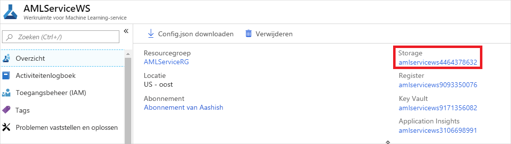](./media/how-to-enable-virtual-network/workspace-storage.png#lightbox)

1. Selecteer op de pagina Storage-Service account de optie __firewalls en virtuele netwerken__.

   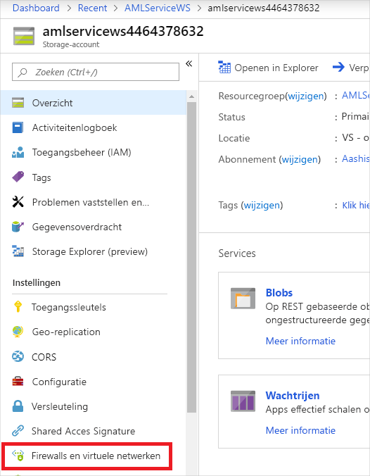

1. Voer op de pagina __firewalls en virtuele netwerken__ de volgende acties uit:
    - Selecteer __Geselecteerde netwerken__.
    - Selecteer onder __virtuele netwerken__de koppeling __bestaande virtuele netwerk toevoegen__ . Met deze actie wordt het virtuele netwerk waar uw Compute zich bevindt, toegevoegd (zie stap 1).

        > [!IMPORTANT]
        > Het opslag account moet zich in hetzelfde virtuele netwerk en subnet bevinden als de reken instanties of clusters die worden gebruikt voor de training of de interferentie.

    - Schakel het selectie vakje __vertrouwde micro soft-Services toegang geven tot dit opslag account__ in.

    > [!IMPORTANT]
    > Wanneer u werkt met de Azure Machine Learning SDK, moet uw ontwikkel omgeving verbinding kunnen maken met het Azure Storage-account. Wanneer het opslag account zich in een virtueel netwerk bevindt, moet de firewall toegang toestaan vanuit het IP-adres van de ontwikkel omgeving.
    >
    > Als u toegang tot het opslag account wilt inschakelen, gaat u naar de __firewalls en virtuele netwerken__ voor het opslag account *vanuit een webbrowser op de ontwikkelings-client*. Gebruik vervolgens het selectie vakje __uw client-IP-adres toevoegen__ om het IP-adres van de client toe te voegen aan het __adres bereik__. U kunt ook het veld __adres bereik__ gebruiken om hand matig het IP-adres van de ontwikkel omgeving in te voeren. Zodra het IP-adres voor de client is toegevoegd, heeft het toegang tot het opslag account met de SDK.

   [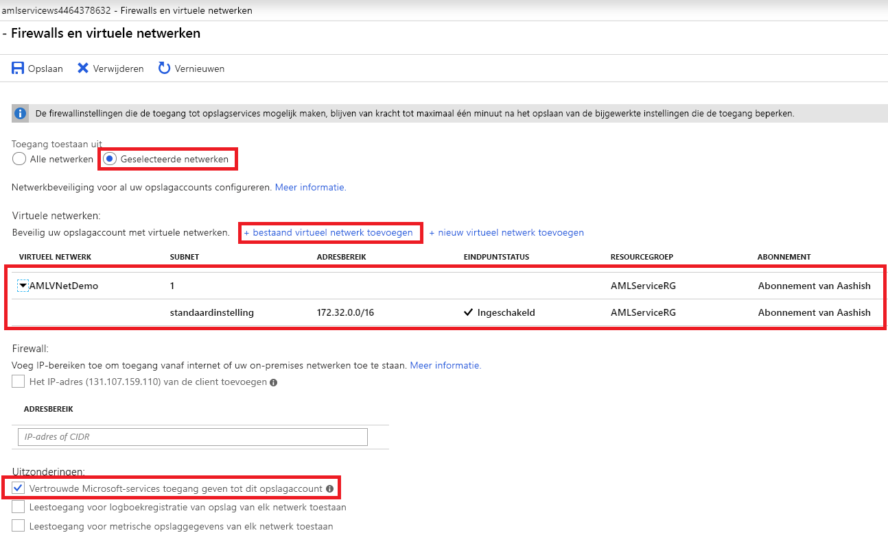](./media/how-to-enable-virtual-network/storage-firewalls-and-virtual-networks-page.png#lightbox)

## <a name="use-datastores-and-datasets"></a>Data stores en gegevens sets gebruiken

In deze sectie wordt het gebruik van gegevens opslag en gegevensset voor de SDK-ervaring besproken. Zie de sectie [machine learning Studio](#machine-learning-studio)voor meer informatie over de Studio-ervaring.

Azure Machine Learning voert standaard gegevens over geldigheid en referenties controles uit wanneer u gegevens probeert te openen met behulp van de SDK. Als uw gegevens zich achter een virtueel netwerk bevindt, heeft Azure Machine Learning geen toegang tot de gegevens en mislukt de controles. Om dit te voor komen, moet u data stores en gegevens sets maken die validatie overs Laan.

### <a name="use-a-datastore"></a>Een gegevens opslag gebruiken

 Azure Data Lake Store gen1 en Azure Data Lake Store Gen2 de validatie standaard overs Laan, dus er is geen verdere actie nodig. Voor de volgende services kunt u echter soort gelijke syntaxis gebruiken om de validatie van gegevens opslag over te slaan:

- Azure Blob Storage
- Azure-bestands share
- PostgreSQL
- Azure SQL Database

Met het volgende code voorbeeld maakt u een nieuwe Azure Blob-gegevens opslag en-sets `skip_validation=True` .

```python
blob_datastore = Datastore.register_azure_blob_container(workspace=ws,  

                                                         datastore_name=blob_datastore_name,  

                                                         container_name=container_name,  

                                                         account_name=account_name, 

                                                         account_key=account_key, 

                                                         skip_validation=True ) // Set skip_validation to true
```

### <a name="use-a-dataset"></a>Een gegevensset gebruiken

De syntaxis voor het overs laan van de validatie van de gegevensset is vergelijkbaar met de volgende typen gegevens sets:
- Bestand met scheidings tekens
- JSON 
- Parquet
- SQL
- Bestand

Met de volgende code wordt een nieuwe JSON-gegevensset en-sets gemaakt `validate=False` .

```python
json_ds = Dataset.Tabular.from_json_lines_files(path=datastore_paths, 

validate=False) 

```


## <a name="compute-clusters--instances"></a><a name="compute-instance"></a>& exemplaren van compute-clusters 

Als u een [beheerd Azure machine learning __Compute-doel__ ](concept-compute-target.md#azure-machine-learning-compute-managed) of een [Azure machine learning COMPUTE- __exemplaar__ ](concept-compute-instance.md) in een virtueel netwerk wilt gebruiken, moet aan de volgende netwerk vereisten worden voldaan:

> [!div class="checklist"]
> * Het virtuele netwerk moet zich in hetzelfde abonnement en dezelfde regio bevinden als de Azure Machine Learning-werk ruimte.
> * Het subnet dat is opgegeven voor het reken proces of het cluster moet voldoende niet-toegewezen IP-adressen hebben om het aantal Vm's te kunnen ondersteunen. Als het subnet onvoldoende niet-toegewezen IP-adressen heeft, wordt een reken cluster gedeeltelijk toegewezen.
> * Controleer of het beveiligings beleid of de vergren delingen in het abonnement of de resource groep van het virtuele netwerk beperkt zijn tot de machtigingen voor het beheren van het virtuele netwerk. Als u het virtuele netwerk wilt beveiligen door verkeer te beperken, moet u sommige poorten voor de compute-service geopend laten. Zie de sectie [vereiste poorten](#mlcports) voor meer informatie.
> * Als u meerdere reken instanties of clusters in één virtueel netwerk wilt plaatsen, moet u mogelijk een quotum verhoging aanvragen voor een of meer van uw resources.
> * Als de Azure Storage account (s) voor de werk ruimte ook worden beveiligd in een virtueel netwerk, moeten ze zich in hetzelfde virtuele netwerk bevinden als de Azure Machine Learning Reken instantie of het cluster. 
> * Zorg ervoor dat de communicatie tussen websockets niet is uitgeschakeld voor de Jupyter-functionaliteit van reken instanties.

> [!TIP]
> Het Machine Learning Reken exemplaar of cluster wijst automatisch extra netwerk bronnen toe __aan de resource groep die het virtuele netwerk bevat__. Voor elk reken exemplaar of cluster wijst de service de volgende bronnen toe:
> 
> * Eén netwerk beveiligings groep
> * Eén openbaar IP-adres
> * Een load balancer
> 
> In het geval van clusters worden deze bronnen verwijderd (en opnieuw gemaakt) elke keer dat het cluster wordt geschaald naar 0 knoop punten, maar voor een instantie waarvan de bronnen worden vastgehouden, is het exemplaar volledig verwijderd (stoppen wordt niet verwijderd uit de resources). 
> De beperkingen die voor deze resources gelden, worden bepaald door de [resourcequota](https://docs.microsoft.com/azure/azure-resource-manager/management/azure-subscription-service-limits) van het abonnement.


### <a name="required-ports"></a><a id="mlcports"></a>Vereiste poorten

Als u van plan bent het virtuele netwerk te beveiligen door het netwerk verkeer naar/van het open bare Internet te beperken, moet u binnenkomende communicaties van de Azure Batch-service toestaan.

De batch-service voegt netwerk beveiligings groepen (Nsg's) toe op het niveau van netwerk interfaces (Nic's) die zijn gekoppeld aan Vm's. Met deze netwerkbeveiligingsgroepen worden automatisch binnenkomende en uitgaande regels geconfigureerd om het volgende verkeer toe te staan:

- Binnenkomend TCP-verkeer op de poorten 29876 en 29877 van een __service label__ van __BatchNodeManagement__.

    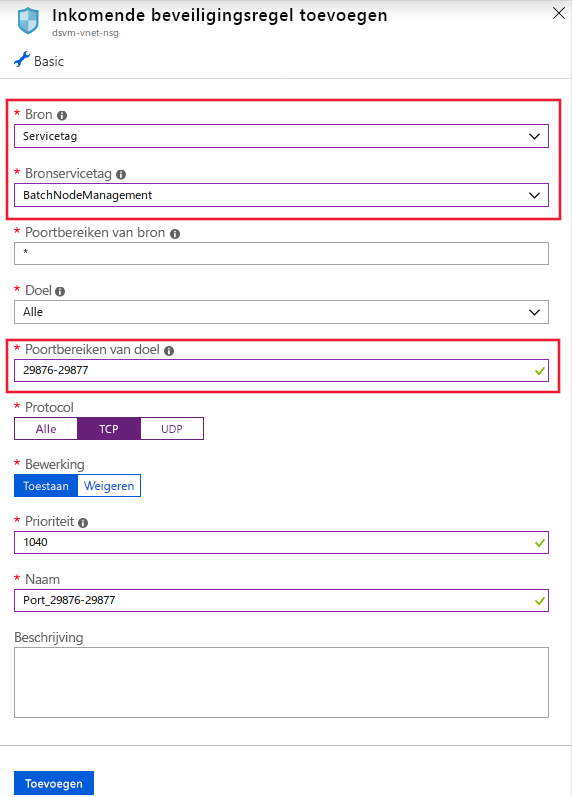

- Beschrijving Binnenkomend TCP-verkeer op poort 22 om externe toegang toe te staan. Gebruik deze poort alleen als u verbinding wilt maken met behulp van SSH op het open bare IP-adres.

- Uitgaand verkeer op een willekeurige poort naar het virtuele netwerk.

- Uitgaand verkeer op een willekeurige poort naar internet.

- Voor het binnenkomende TCP-verkeer van reken instanties op poort 44224 van een __service-tag__ van __AzureMachineLearning__.

> [!IMPORTANT]
> Wees voorzichtig als u binnenkomende of uitgaande regels toevoegt of wijzigt in netwerkbeveiligingsgroepen die door Batch zijn geconfigureerd. Als een NSG communicatie met de reken knooppunten blokkeert, stelt de compute-service de status van de reken knooppunten in op onbruikbaar.
>
> U hoeft Nsg's niet op subnetniveau op te geven omdat de Azure Batch-service zijn eigen Nsg's configureert. Als er echter een Nsg's of een firewall is gekoppeld aan het subnet met de Azure Machine Learning compute, moet u ook het verkeer toestaan dat hierboven wordt vermeld.

De NSG-regel configuratie in de Azure Portal wordt weer gegeven in de volgende installatie kopieën:

:::image type="content" source="./media/how-to-enable-virtual-network/amlcompute-virtual-network-inbound.png" alt-text="De inkomende NSG-regels voor Machine Learning Compute" border="true":::


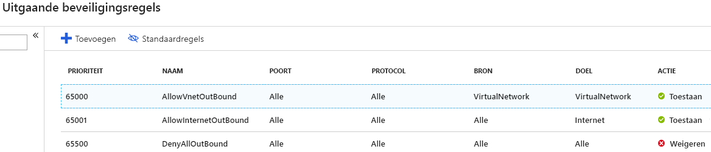

### <a name="limit-outbound-connectivity-from-the-virtual-network"></a><a id="limiting-outbound-from-vnet"></a>Uitgaande connectiviteit vanuit het virtuele netwerk beperken

Als u de standaard regels voor uitgaande verbindingen niet wilt gebruiken en u de uitgaande toegang van uw virtuele netwerk wilt beperken, gebruikt u de volgende stappen:

- Uitgaande Internet verbinding weigeren met behulp van de NSG-regels.

- Beperk het uitgaande verkeer voor een __reken instantie__ of een __berekenings cluster__tot de volgende items:
   - Azure Storage, door gebruik te maken van de __service tag__ __Storage. regionaam__. Waar `{RegionName}` de naam is van een Azure-regio.
   - Azure Container Registry, met behulp van de __service-tag__ __AzureContainerRegistry. regionaam__. Waar `{RegionName}` de naam is van een Azure-regio.
   - Azure Machine Learning, met behulp van het __service label__ __AzureMachineLearning__
   - Azure Resource Manager, met behulp van het __service label__ __AzureResourceManager__
   - Azure Active Directory, met behulp van het __service label__ __AzureActiveDirectory__

De NSG-regel configuratie in de Azure Portal wordt weer gegeven in de volgende afbeelding:

[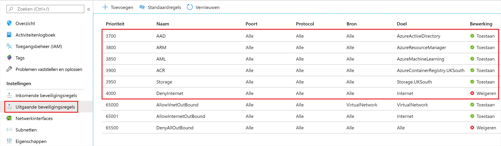](./media/how-to-enable-virtual-network/limited-outbound-nsg-exp.png#lightbox)

> [!NOTE]
> Als u van plan bent om standaard-docker-installatie kopieën te gebruiken die door micro soft worden meegeleverd en door de gebruiker beheerde afhankelijkheden in te scha kelen, moet u ook de volgende __service Tags__gebruiken:
>
> * __MicrosoftContainerRegistry__
> * __AzureFrontDoor.FirstParty__
>
> Deze configuratie is vereist wanneer u code die vergelijkbaar is met de volgende fragmentten als onderdeel van uw trainings scripts:
>
> __RunConfig-training__
> ```python
> # create a new runconfig object
> run_config = RunConfiguration()
> 
> # configure Docker 
> run_config.environment.docker.enabled = True
> # For GPU, use DEFAULT_GPU_IMAGE
> run_config.environment.docker.base_image = DEFAULT_CPU_IMAGE 
> run_config.environment.python.user_managed_dependencies = True
> ```
>
> __Estimator-training__
> ```python
> est = Estimator(source_directory='.',
>                 script_params=script_params,
>                 compute_target='local',
>                 entry_script='dummy_train.py',
>                 user_managed=True)
> run = exp.submit(est)
> ```

### <a name="user-defined-routes-for-forced-tunneling"></a>Door de gebruiker gedefinieerde routes voor geforceerde tunneling

Als u gebruik wilt maken van geforceerde tunneling met de Machine Learning Compute, voegt u door de [gebruiker gedefinieerde routes (udr's)](https://docs.microsoft.com/azure/virtual-network/virtual-networks-udr-overview) toe aan het subnet dat de reken resource bevat.

* Stel een UDR in voor elk IP-adres dat wordt gebruikt door de Azure Batch-service in de regio waar uw resources bestaan. Deze Udr's inschakelen de batch-service om te communiceren met reken knooppunten voor het plannen van taken. Voeg ook het IP-adres voor de Azure Machine Learning-service toe waarin de resources bestaan, omdat dit vereist is voor toegang tot reken instanties. Gebruik een van de volgende methoden om een lijst met IP-adressen van de batch-service en Azure Machine Learning-service te verkrijgen:

    * Down load de [Azure IP-bereiken en-service Tags](https://www.microsoft.com/download/details.aspx?id=56519) en zoek het bestand voor `BatchNodeManagement.<region>` en `AzureMachineLearning.<region>` , waar `<region>` is uw Azure-regio.

    * Gebruik de [Azure cli](https://docs.microsoft.com/cli/azure/install-azure-cli?view=azure-cli-latest) om de informatie te downloaden. In het volgende voor beeld worden de IP-adres gegevens gedownload en worden de gegevens voor de regio VS Oost 2 gefilterd:

        ```azurecli-interactive
        az network list-service-tags -l "East US 2" --query "values[?starts_with(id, 'Batch')] | [?properties.region=='eastus2']"
        az network list-service-tags -l "East US 2" --query "values[?starts_with(id, 'AzureMachineLearning')] | [?properties.region=='eastus2']"
        ```

* Uitgaand verkeer naar Azure Storage mag niet worden geblokkeerd door uw on-premises netwerk apparaat. In het bijzonder zijn de Url's in het formulier `<account>.table.core.windows.net` , `<account>.queue.core.windows.net` en `<account>.blob.core.windows.net` .

Wanneer u de Udr's toevoegt, definieert u de route voor elk gerelateerde IP-adres voorvoegsel voor batch en stelt u het __type volgende hop__ in op __Internet__. In de volgende afbeelding ziet u een voor beeld van deze UDR in de Azure Portal:

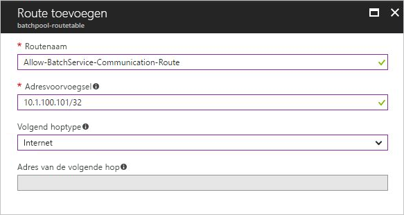

Zie [een Azure batch groep maken in een virtueel netwerk](../batch/batch-virtual-network.md#user-defined-routes-for-forced-tunneling)voor meer informatie.

### <a name="create-a-compute-cluster-in-a-virtual-network"></a>Een berekenings cluster maken in een virtueel netwerk

Als u een Machine Learning Compute cluster wilt maken, gebruikt u de volgende stappen:

1. Meld u aan bij [Azure machine learning Studio](https://ml.azure.com/)en selecteer vervolgens uw abonnement en werk ruimte.

1. Selecteer __Compute__ aan de linkerkant.

1. Selecteer __trainings clusters__ in het midden en selecteer deze __+__ .

1. Vouw in het dialoog venster __nieuw trainings cluster__ het gedeelte __Geavanceerde instellingen__ uit.

1. Als u deze reken resource wilt configureren voor het gebruik van een virtueel netwerk, voert u de volgende acties uit in de sectie __virtueel netwerk configureren__ :

    1. Selecteer de resource groep met het virtuele netwerk in de vervolg keuzelijst __resource groep__ .
    1. Selecteer in de vervolg keuzelijst __virtueel netwerk__ het virtuele netwerk dat het subnet bevat.
    1. Selecteer in de vervolg keuzelijst __subnet__ het subnet dat u wilt gebruiken.

   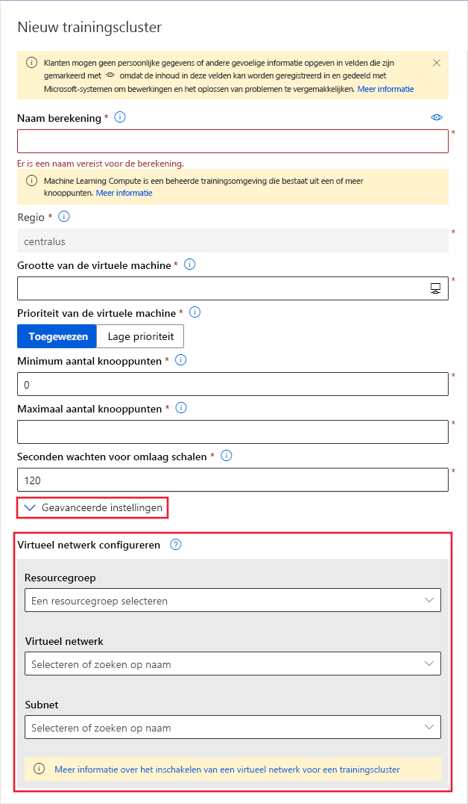

U kunt ook een Machine Learning Compute cluster maken met behulp van de Azure Machine Learning SDK. Met de volgende code wordt een nieuw Machine Learning Compute Cluster gemaakt in het `default` subnet van een virtueel netwerk met de naam `mynetwork` :

```python
from azureml.core.compute import ComputeTarget, AmlCompute
from azureml.core.compute_target import ComputeTargetException

# The Azure virtual network name, subnet, and resource group
vnet_name = 'mynetwork'
subnet_name = 'default'
vnet_resourcegroup_name = 'mygroup'

# Choose a name for your CPU cluster
cpu_cluster_name = "cpucluster"

# Verify that cluster does not exist already
try:
    cpu_cluster = ComputeTarget(workspace=ws, name=cpu_cluster_name)
    print("Found existing cpucluster")
except ComputeTargetException:
    print("Creating new cpucluster")

    # Specify the configuration for the new cluster
    compute_config = AmlCompute.provisioning_configuration(vm_size="STANDARD_D2_V2",
                                                           min_nodes=0,
                                                           max_nodes=4,
                                                           vnet_resourcegroup_name=vnet_resourcegroup_name,
                                                           vnet_name=vnet_name,
                                                           subnet_name=subnet_name)

    # Create the cluster with the specified name and configuration
    cpu_cluster = ComputeTarget.create(ws, cpu_cluster_name, compute_config)

    # Wait for the cluster to be completed, show the output log
    cpu_cluster.wait_for_completion(show_output=True)
```

Wanneer het maken van het proces is voltooid, traint u uw model met behulp van het cluster in een experiment. Zie voor meer informatie [een berekenings doel selecteren en gebruiken voor training](how-to-set-up-training-targets.md).

### <a name="access-data-in-a-compute-instance-notebook"></a>Toegang tot gegevens in een notebook van reken instanties

Als u notitie blokken op een Azure Compute-instantie gebruikt, moet u ervoor zorgen dat uw notitie blok wordt uitgevoerd op een reken resource achter hetzelfde virtuele netwerk en subnet als uw gegevens. 

U moet uw reken instantie configureren zodat deze zich in hetzelfde virtuele netwerk bevindt tijdens het maken van **Geavanceerde instellingen**  >  **virtuele netwerken configureren**. U kunt een bestaand reken exemplaar niet toevoegen aan een virtueel netwerk.

<a id="aksvnet"></a>

## <a name="azure-kubernetes-service"></a>Azure Kubernetes Service

Gebruik de volgende stappen om de Azure Kubernetes-service (AKS) in een virtueel netwerk aan uw werk ruimte toe te voegen:

> [!IMPORTANT]
> Voordat u aan de volgende procedure begint, volgt u de vereisten in het onderdeel [geavanceerde netwerken configureren in azure Kubernetes service (AKS)](https://docs.microsoft.com/azure/aks/configure-azure-cni#prerequisites) hoe de IP-adres sering voor uw cluster kan worden gepland.
>
> Het AKS-exemplaar en het virtuele Azure-netwerk moeten zich in dezelfde regio bevinden. Als u de Azure Storage account (s) die door de werk ruimte in een virtueel netwerk worden gebruikt, beveiligt, moeten ze zich in hetzelfde virtuele netwerk bevinden als het AKS-exemplaar.

> [!WARNING]
> Azure Machine Learning biedt geen ondersteuning voor het gebruik van een Azure Kubernetes-service waarvoor een persoonlijke koppeling is ingeschakeld.

1. Meld u aan bij [Azure machine learning Studio](https://ml.azure.com/)en selecteer vervolgens uw abonnement en werk ruimte.

1. Selecteer __Compute__ aan de linkerkant.

1. Selecteer Afleidings __clusters__ in het midden en selecteer vervolgens __+__ .

1. Selecteer __Geavanceerd__ onder __netwerk configuratie__in het dialoog venster __Nieuw cluster__ voor uitgevallen.

1. Voer de volgende acties uit om deze Compute-resource te configureren voor het gebruik van een virtueel netwerk:

    1. Selecteer de resource groep met het virtuele netwerk in de vervolg keuzelijst __resource groep__ .
    1. Selecteer in de vervolg keuzelijst __virtueel netwerk__ het virtuele netwerk dat het subnet bevat.
    1. Selecteer in de vervolg keuzelijst __subnet__ het subnet.
    1. Voer in het vak __Kubernetes service adres bereik__ het adres bereik van de Kubernetes-service in. Dit adres bereik maakt gebruik van een CIDR-notatie (Classless Inter-Domain Routing) IP-bereik voor het definiëren van de IP-adressen die beschikbaar zijn voor het cluster. Het mag niet overlappen met subnet IP-bereiken (bijvoorbeeld 10.0.0.0/16).
    1. Voer in het vak __IP-adres van KUBERNETES DNS__ -service het IP-adres van de Kubernetes DNS-service in. Dit IP-adres wordt toegewezen aan de DNS-service Kubernetes. Deze moet zich in het adres bereik van de Kubernetes-service bevallen (bijvoorbeeld 10.0.0.10).
    1. Voer in het vak __docker Bridge-adres__ het adres van de docker-brug in. Dit IP-adres wordt toegewezen aan docker-brug. De waarde mag zich niet in een IP-bereik van het subnet of in het Kubernetes (bijvoorbeeld 172.17.0.1/16) bevinden.

   

1. Zorg ervoor dat de NSG-groep die het virtuele netwerk beheert, een binnenkomende beveiligings regel voor het Score-eind punt heeft ingeschakeld, zodat deze kan worden aangeroepen buiten het virtuele netwerk.
   > [!IMPORTANT]
   > Behoud de standaard regels voor uitgaande verbindingen voor de NSG. Zie de standaard beveiligings regels in [beveiligings groepen](https://docs.microsoft.com/azure/virtual-network/security-overview#default-security-rules)voor meer informatie.

   [](./media/how-to-enable-virtual-network/aks-vnet-inbound-nsg-scoring.png#lightbox)

U kunt ook de Azure Machine Learning SDK gebruiken om de Azure Kubernetes-service toe te voegen aan een virtueel netwerk. Als u al een AKS-cluster in een virtueel netwerk hebt, koppelt u dit aan de werk ruimte, zoals wordt beschreven in [Deploying to aks](how-to-deploy-and-where.md). Met de volgende code wordt een nieuw AKS-exemplaar gemaakt in het `default` subnet van een virtueel netwerk met de naam `mynetwork` :

```python
from azureml.core.compute import ComputeTarget, AksCompute

# Create the compute configuration and set virtual network information
config = AksCompute.provisioning_configuration(location="eastus2")
config.vnet_resourcegroup_name = "mygroup"
config.vnet_name = "mynetwork"
config.subnet_name = "default"
config.service_cidr = "10.0.0.0/16"
config.dns_service_ip = "10.0.0.10"
config.docker_bridge_cidr = "172.17.0.1/16"

# Create the compute target
aks_target = ComputeTarget.create(workspace=ws,
                                  name="myaks",
                                  provisioning_configuration=config)
```

Wanneer het maken van het proces is voltooid, kunt u het decoderen of model leren uitvoeren op een AKS-cluster achter een virtueel netwerk. Zie [implementeren op AKS](how-to-deploy-and-where.md)voor meer informatie.

### <a name="use-private-ips-with-azure-kubernetes-service"></a>Privé IPs gebruiken met de Azure Kubernetes-service

Standaard wordt een openbaar IP-adres toegewezen aan AKS-implementaties. Wanneer u AKS in een virtueel netwerk gebruikt, kunt u in plaats daarvan een privé-IP-adres gebruiken. Privé-IP-adressen zijn alleen toegankelijk vanuit het virtuele netwerk of de gekoppelde netwerken.

Een privé-IP-adres wordt ingeschakeld door AKS te configureren voor gebruik van een _interne Load Balancer_. 

> [!IMPORTANT]
> U kunt geen persoonlijk IP-adres inschakelen bij het maken van het Azure Kubernetes-service cluster. Het moet worden ingeschakeld als een update van een bestaand cluster.

Het volgende code fragment laat zien hoe u __een nieuw AKS-cluster maakt__en het vervolgens bijwerkt voor gebruik van een privé-IP/interne Load Balancer:

```python
import azureml.core
from azureml.core.compute.aks import AksUpdateConfiguration
from azureml.core.compute import AksCompute, ComputeTarget

# Verify that cluster does not exist already
try:
    aks_target = AksCompute(workspace=ws, name=aks_cluster_name)
    print("Found existing aks cluster")

except:
    print("Creating new aks cluster")

    # Subnet to use for AKS
    subnet_name = "default"
    # Create AKS configuration
    prov_config = AksCompute.provisioning_configuration(location = "eastus2")
    # Set info for existing virtual network to create the cluster in
    prov_config.vnet_resourcegroup_name = "myvnetresourcegroup"
    prov_config.vnet_name = "myvnetname"
    prov_config.service_cidr = "10.0.0.0/16"
    prov_config.dns_service_ip = "10.0.0.10"
    prov_config.subnet_name = subnet_name
    prov_config.docker_bridge_cidr = "172.17.0.1/16"

    # Create compute target
    aks_target = ComputeTarget.create(workspace = ws, name = "myaks", provisioning_configuration = prov_config)
    # Wait for the operation to complete
    aks_target.wait_for_completion(show_output = True)
    
    # Update AKS configuration to use an internal load balancer
    update_config = AksUpdateConfiguration(None, "InternalLoadBalancer", subnet_name)
    aks_target.update(update_config)
    # Wait for the operation to complete
    aks_target.wait_for_completion(show_output = True)
```

__Azure-CLI__

```azurecli-interactive
az rest --method put --uri https://management.azure.com/subscriptions/<subscription-id>/resourceGroups/<resource-group>/providers/Microsoft.MachineLearningServices/workspaces/<workspace>/computes/<compute>?api-version=2018-11-19 --body @body.json
```

De inhoud van het `body.json` bestand waarnaar wordt verwezen door de opdracht, is vergelijkbaar met het volgende JSON-document:

```json
{ 
    "location": "<region>", 
    "properties": { 
        "resourceId": "/subscriptions/<subscription-id>/resourcegroups/<resource-group>/providers/Microsoft.ContainerService/managedClusters/<aks-resource-name>", 
        "computeType": "AKS", 
        "provisioningState": "Succeeded", 
        "properties": { 
            "loadBalancerType": "InternalLoadBalancer", 
            "agentCount": <agent-count>, 
            "agentVmSize": "vm-size", 
            "clusterFqdn": "<cluster-fqdn>" 
        } 
    } 
} 
```

Wanneer u __een bestaand cluster koppelt__ aan uw werk ruimte, moet u wachten totdat de bewerking koppelen is geconfigureerd om de Load Balancer te configureren.

Zie [een bestaand AKS-cluster koppelen](how-to-deploy-azure-kubernetes-service.md#attach-an-existing-aks-cluster)voor meer informatie over het koppelen van een cluster.

Nadat u het bestaande cluster hebt gekoppeld, kunt u het cluster bijwerken voor het gebruik van een privé-IP.

```python
import azureml.core
from azureml.core.compute.aks import AksUpdateConfiguration
from azureml.core.compute import AksCompute

# ws = workspace object. Creation not shown in this snippet
aks_target = AksCompute(ws,"myaks")

# Change to the name of the subnet that contains AKS
subnet_name = "default"
# Update AKS configuration to use an internal load balancer
update_config = AksUpdateConfiguration(None, "InternalLoadBalancer", subnet_name)
aks_target.update(update_config)
# Wait for the operation to complete
aks_target.wait_for_completion(show_output = True)
```

__Rol netwerk bijdrager__

> [!IMPORTANT]
> Als u een AKS-cluster maakt of koppelt met een virtueel netwerk dat u eerder hebt gemaakt, moet u de Service-Principal (SP) of de beheerde identiteit voor uw AKS-cluster de rol _netwerk bijdrage_ verlenen aan de resource groep met het virtuele netwerk. U moet dit doen voordat u probeert de interne load balancer te wijzigen in privé-IP.
>
> Gebruik de volgende stappen om de identiteit als netwerkinzender toe te voegen:

1. Gebruik de volgende Azure CLI-opdrachten om de service-principal of de beheerde identiteits-ID voor AKS te vinden. Vervang door `<aks-cluster-name>` de naam van het cluster. Vervang door `<resource-group-name>` de naam van de resource groep die _het AKS-cluster bevat_:

    ```azurecli-interactive
    az aks show -n <aks-cluster-name> --resource-group <resource-group-name> --query servicePrincipalProfile.clientId
    ``` 

    Als met deze opdracht een waarde wordt geretourneerd van `msi` , gebruikt u de volgende opdracht om de principal-id voor de beheerde identiteit te identificeren:

    ```azurecli-interactive
    az aks show -n <aks-cluster-name> --resource-group <resource-group-name> --query identity.principalId
    ```

1. Gebruik de volgende opdracht om de ID te vinden van de resource groep die het virtuele netwerk bevat. Vervang door `<resource-group-name>` de naam van de resource groep die _het virtuele netwerk bevat_:

    ```azurecli-interactive
    az group show -n <resource-group-name> --query id
    ```

1. Gebruik de volgende opdracht om de service-principal of beheerde identiteit als Inzender voor het netwerk toe te voegen. Vervang door `<SP-or-managed-identity>` de id die wordt geretourneerd voor de service-principal of beheerde identiteit. Vervang door `<resource-group-id>` de id die wordt geretourneerd voor de resource groep die het virtuele netwerk bevat:

    ```azurecli-interactive
    az role assignment create --assignee <SP-or-managed-identity> --role 'Network Contributor' --scope <resource-group-id>
    ```
Zie voor meer informatie over het gebruik van de interne load balancer met AKS [interne Load Balancer gebruiken met de Azure Kubernetes-service](/azure/aks/internal-lb).

## <a name="use-azure-container-instances-aci"></a>Azure Container Instances (ACI) gebruiken

Azure Container Instances worden dynamisch gemaakt bij het implementeren van een model. Als u wilt dat Azure Machine Learning ACI in het virtuele netwerk maakt, moet u __subnet delegering__ inschakelen voor het subnet dat wordt gebruikt door de implementatie.

> [!WARNING]
> Als Azure Container Instances in een virtueel netwerk wordt gebruikt, moet het virtuele netwerk zich in dezelfde resource groep bevinden als uw Azure Machine Learning-werk ruimte.
>
> Wanneer u Azure Container Instances in het virtuele netwerk gebruikt, kan de Azure Container Registry (ACR) voor uw werk ruimte zich ook niet in het virtuele netwerk bevinden.

Als u ACI wilt gebruiken in een virtueel netwerk naar uw werk ruimte, gebruikt u de volgende stappen:

1. Als u subnet delegering wilt inschakelen voor het virtuele netwerk, gebruikt u de informatie in het artikel [een subnet delegering toevoegen of verwijderen](../virtual-network/manage-subnet-delegation.md) . U kunt delegeren inschakelen bij het maken van een virtueel netwerk of het toevoegen aan een bestaand netwerk.

    > [!IMPORTANT]
    > Wanneer delegering wordt ingeschakeld, gebruikt u `Microsoft.ContainerInstance/containerGroups` als het __subnet aan service waarde delegeren__ .

2. Implementeer het model met behulp van [AciWebservice. deploy_configuration ()](https://docs.microsoft.com/python/api/azureml-core/azureml.core.webservice.aci.aciwebservice?view=azure-ml-py#deploy-configuration-cpu-cores-none--memory-gb-none--tags-none--properties-none--description-none--location-none--auth-enabled-none--ssl-enabled-none--enable-app-insights-none--ssl-cert-pem-file-none--ssl-key-pem-file-none--ssl-cname-none--dns-name-label-none--primary-key-none--secondary-key-none--collect-model-data-none--cmk-vault-base-url-none--cmk-key-name-none--cmk-key-version-none--vnet-name-none--subnet-name-none-), gebruik de `vnet_name` `subnet_name` para meters en. Stel deze para meters in op de naam van het virtuele netwerk en het subnet waar u delegering hebt ingeschakeld.

## <a name="azure-firewall"></a>Azure Firewall

Zie [Azure machine learning-werk ruimte gebruiken achter Azure firewall](how-to-access-azureml-behind-firewall.md)voor meer informatie over het gebruik van Azure Machine Learning met Azure firewall.

## <a name="azure-container-registry"></a>Azure Container Registry

> [!IMPORTANT]
> Azure Container Registry (ACR) kan in een virtueel netwerk worden geplaatst, maar u moet aan de volgende vereisten voldoen:
>
> * Uw Azure Machine Learning-werk ruimte moet Enter prise Edition zijn. Zie voor meer informatie over het uitvoeren van een [upgrade naar Enter prise Edition](how-to-manage-workspace.md#upgrade).
> * Uw Azure Container Registry moet Premium-versie zijn. Zie [wijzigen van sku's](/azure/container-registry/container-registry-skus#changing-skus)voor meer informatie over het uitvoeren van upgrades.
> * Uw Azure Container Registry moeten zich in hetzelfde virtuele netwerk en subnet bevinden als het opslag account en reken doelen die worden gebruikt voor training of deinterferentie.
> * Uw Azure Machine Learning-werk ruimte moet een [Azure machine learning Compute-Cluster](how-to-set-up-training-targets.md#amlcompute)bevatten.
>
>     Wanneer ACR zich achter een virtueel netwerk bevindt, kan Azure Machine Learning het niet gebruiken om docker-installatie kopieën rechtstreeks te bouwen. In plaats daarvan wordt het berekenings cluster gebruikt voor het bouwen van de installatie kopieën.

1. Gebruik een van de volgende methoden om de naam van de Azure Container Registry voor uw werk ruimte te vinden:

    __Azure-portal__

    Vanuit het gedeelte Overzicht van uw werk ruimte koppelt de __register__ waarde aan de Azure container Registry.

    :::image type="content" source="./media/how-to-enable-virtual-network/azure-machine-learning-container-registry.png" alt-text="Azure Container Registry voor de werk ruimte" border="true":::

    __Azure-CLI__

    Als u [de machine learning extensie voor Azure cli hebt geïnstalleerd](reference-azure-machine-learning-cli.md), kunt u de `az ml workspace show` opdracht gebruiken om de werkruimte gegevens weer te geven.

    ```azurecli-interactive
    az ml workspace show -w yourworkspacename -g resourcegroupname --query 'containerRegistry'
    ```

    Met deze opdracht wordt een waarde geretourneerd die vergelijkbaar is met `"/subscriptions/{GUID}/resourceGroups/{resourcegroupname}/providers/Microsoft.ContainerRegistry/registries/{ACRname}"` . Het laatste deel van de teken reeks is de naam van de Azure Container Registry voor de werk ruimte.

1. Als u de toegang tot het virtuele netwerk wilt beperken, gebruikt u de stappen in [netwerk toegang voor REGI ster configureren](../container-registry/container-registry-vnet.md#configure-network-access-for-registry). Wanneer u het virtuele netwerk toevoegt, selecteert u het virtuele netwerk en subnet voor uw Azure Machine Learning-resources.

1. Gebruik de Azure Machine Learning python-SDK om een berekenings cluster te configureren voor het bouwen van docker-installatie kopieën. In het volgende code fragment ziet u hoe u dit doet:

    ```python
    from azureml.core import Workspace
    # Load workspace from an existing config file
    ws = Workspace.from_config()
    # Update the workspace to use an existing compute cluster
    ws.update(image_build_compute = 'mycomputecluster')
    ```

    > [!IMPORTANT]
    > Uw opslag account, reken cluster en Azure Container Registry moeten zich allemaal in hetzelfde subnet van het virtuele netwerk bevinden.
    
    Zie voor meer informatie de verwijzing naar methode [Update ()](https://docs.microsoft.com/python/api/azureml-core/azureml.core.workspace.workspace?view=azure-ml-py#update-friendly-name-none--description-none--tags-none--image-build-compute-none--enable-data-actions-none-) .

1. U moet de volgende Azure Resource Manager sjabloon Toep assen. Met deze sjabloon kan uw werk ruimte communiceren met ACR.

    ```json
    {
    "$schema": "https://schema.management.azure.com/schemas/2015-01-01/deploymentTemplate.json#",
    "contentVersion": "1.0.0.0",
    "parameters": {
        "keyVaultArmId": {
        "type": "string"
        },
        "workspaceName": {
        "type": "string"
        },
        "containerRegistryArmId": {
        "type": "string"
        },
        "applicationInsightsArmId": {
        "type": "string"
        },
        "storageAccountArmId": {
        "type": "string"
        },
        "location": {
        "type": "string"
        }
    },
    "resources": [
        {
        "type": "Microsoft.MachineLearningServices/workspaces",
        "apiVersion": "2019-11-01",
        "name": "[parameters('workspaceName')]",
        "location": "[parameters('location')]",
        "identity": {
            "type": "SystemAssigned"
        },
        "sku": {
            "tier": "enterprise",
            "name": "enterprise"
        },
        "properties": {
            "sharedPrivateLinkResources":
    [{"Name":"Acr","Properties":{"PrivateLinkResourceId":"[concat(parameters('containerRegistryArmId'), '/privateLinkResources/registry')]","GroupId":"registry","RequestMessage":"Approve","Status":"Pending"}}],
            "keyVault": "[parameters('keyVaultArmId')]",
            "containerRegistry": "[parameters('containerRegistryArmId')]",
            "applicationInsights": "[parameters('applicationInsightsArmId')]",
            "storageAccount": "[parameters('storageAccountArmId')]"
        }
        }
    ]
    }
    ```

## <a name="key-vault-instance"></a>Sleutel kluis-exemplaar 

Het sleutel kluis-exemplaar dat is gekoppeld aan de werk ruimte wordt gebruikt door Azure Machine Learning om de volgende referenties op te slaan:
* Het gekoppelde opslag account connection string
* Wacht woorden voor Azure container repository-instanties
* Verbindings reeksen naar gegevens archieven

Als u Azure Machine Learning experimenten wilt gebruiken met Azure Key Vault achter een virtueel netwerk, gebruikt u de volgende stappen:

1. Ga naar de sleutel kluis die is gekoppeld aan de werk ruimte.

   [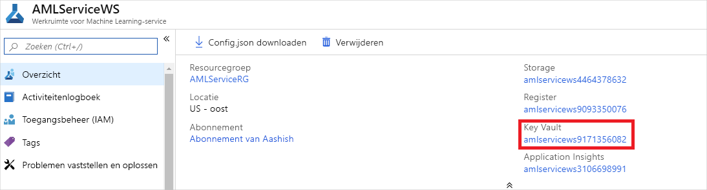](./media/how-to-enable-virtual-network/workspace-key-vault.png#lightbox)

1. Selecteer op de pagina __Key Vault__ in het linkerdeel venster __firewalls en virtuele netwerken__.

   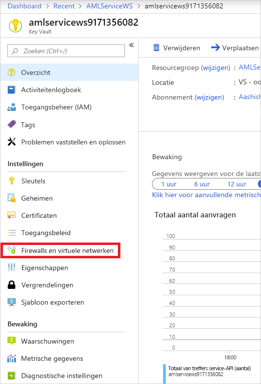

1. Voer op de pagina __firewalls en virtuele netwerken__ de volgende acties uit:
    - Selecteer __Geselecteerde netwerken__ onder __Toegang toestaan uit__.
    - Selecteer onder __virtuele netwerken__ __bestaande virtuele netwerken toevoegen__ om het virtuele netwerk toe te voegen waarin uw experimenten worden berekend.
    - Onder __vertrouwde micro soft-Services toestaan deze firewall te omzeilen__, selecteert u __Ja__.

   [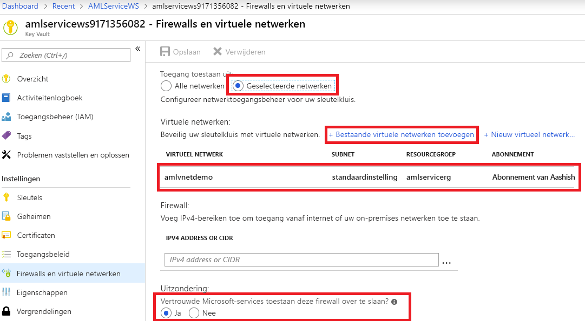](./media/how-to-enable-virtual-network/key-vault-firewalls-and-virtual-networks-page.png#lightbox)


## <a name="azure-databricks"></a>Azure Databricks

Als u Azure Databricks wilt gebruiken in een virtueel netwerk met uw werk ruimte, moet aan de volgende vereisten worden voldaan:

> [!div class="checklist"]
> * Het virtuele netwerk moet zich in hetzelfde abonnement en dezelfde regio bevinden als de Azure Machine Learning-werk ruimte.
> * Als de Azure Storage account (s) voor de werk ruimte ook worden beveiligd in een virtueel netwerk, moeten ze zich in hetzelfde virtuele netwerk bevinden als het Azure Databricks-cluster.
> * Naast de __databricks-particuliere__ en __databricks-open bare__ subnetten die worden gebruikt door Azure Databricks, is ook het __standaard__ subnet dat voor het virtuele netwerk is gemaakt, vereist.

Zie [deploying Azure Databricks in uw Azure Virtual Network](https://docs.azuredatabricks.net/administration-guide/cloud-configurations/azure/vnet-inject.html)voor specifieke informatie over het gebruik van Azure Databricks met een virtueel netwerk.

<a id="vmorhdi"></a>

## <a name="virtual-machine-or-hdinsight-cluster"></a>Virtuele machine of HDInsight-cluster

> [!IMPORTANT]
> Azure Machine Learning ondersteunt alleen virtuele machines waarop Ubuntu wordt uitgevoerd.

Als u een virtuele machine of een Azure HDInsight-cluster in een virtueel netwerk met uw werk ruimte wilt gebruiken, gebruikt u de volgende stappen:

1. Maak een virtuele machine of een HDInsight-cluster met behulp van de Azure Portal of de Azure CLI en plaats het cluster in een virtueel Azure-netwerk. Raadpleeg voor meer informatie de volgende artikelen:
    * [Virtuele Azure-netwerken voor Linux-Vm's maken en beheren](https://docs.microsoft.com/azure/virtual-machines/linux/tutorial-virtual-network)

    * [HDInsight uitbreiden met behulp van een virtueel Azure-netwerk](https://docs.microsoft.com/azure/hdinsight/hdinsight-extend-hadoop-virtual-network)

1. Als u Azure Machine Learning wilt toestaan te communiceren met de SSH-poort op de virtuele machine of het cluster, configureert u een bron vermelding voor de netwerk beveiligings groep. De SSH-poort is doorgaans poort 22. Voer de volgende acties uit om verkeer van deze bron toe te staan:

    * Selecteer in de vervolg keuzelijst __bron__ de optie __service label__.

    * Selecteer __AzureMachineLearning__in de vervolg keuzelijst __bron service label__ .

    * Selecteer in de vervolg keuzelijst __bron poort bereik__ __*__ .

    * Selecteer in de vervolg keuzelijst __bestemming__ __een__.

    * Selecteer __22__in de vervolg keuzelijst __doel poort bereik__ .

    * Onder __protocol__selecteert u __een__.

    * Selecteer onder __actie__ __toestaan__.

   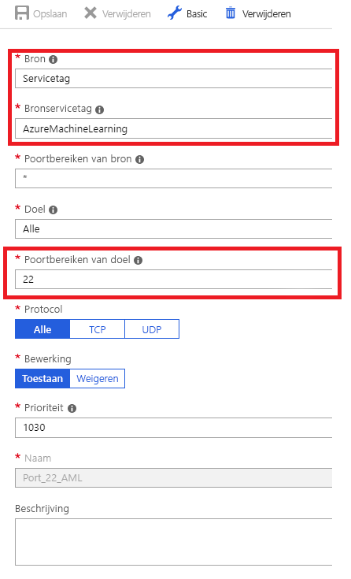

    Behoud de standaard regels voor uitgaande verbindingen voor de netwerk beveiligings groep. Zie de standaard beveiligings regels in [beveiligings groepen](https://docs.microsoft.com/azure/virtual-network/security-overview#default-security-rules)voor meer informatie.

    Als u de standaard regels voor uitgaand verkeer niet wilt gebruiken en u de uitgaande toegang van uw virtuele netwerk wilt beperken, raadpleegt u de sectie [uitgaande verbindingen beperken via het virtuele netwerk](#limiting-outbound-from-vnet) .

1. Koppel de virtuele machine of het HDInsight-cluster aan uw Azure Machine Learning-werk ruimte. Zie [Compute-doelen voor model training instellen](how-to-set-up-training-targets.md)voor meer informatie.


## <a name="next-steps"></a>Volgende stappen

* [Een trainingsomgeving instellen](how-to-set-up-training-targets.md)
* [Privé-eind punten instellen](how-to-configure-private-link.md)
* [Waar modellen te implementeren](how-to-deploy-and-where.md)
* [TLS gebruiken om een webservice te beveiligen via Azure Machine Learning](how-to-secure-web-service.md)