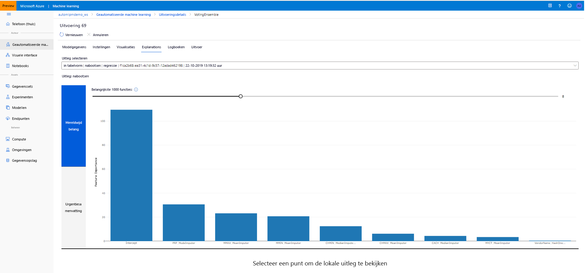

# <a name="model-interpretability-in-automated-machine-learning"></a>Model interpreteert in geautomatiseerde machine learning

[!INCLUDE [applies-to-skus](../../includes/aml-applies-to-basic-enterprise-sku.md)]

In dit artikel vindt u informatie over het inschakelen van de functies voor het vertolken van automatische machine learning (ML) in Azure Machine Learning. Met geautomatiseerde ML kunt u zowel het belang van onbewerkte als voor de functie van het onderdeel begrijpen. Als u de functie voor het interpreteren van modellen wilt gebruiken, stelt u `model_explainability=True` in het `AutoMLConfig`-object in.  

In dit artikel leert u het volgende:

- Voer interpretiteit uit tijdens de training voor het beste model of een model.
- Visualisaties inschakelen zodat u patronen in gegevens en uitleg kunt zien.
- Implementeer de interpretiteit tijdens de deinterferentie of het scoren.

## <a name="prerequisites"></a>Vereisten

- Functies voor interpretaties. Voer `pip install azureml-interpret azureml-contrib-interpret` uit om de benodigde pakketten op te halen.
- Kennis van het bouwen van geautomatiseerde ML experimenten. Voor meer informatie over het gebruik van de Azure Machine Learning SDK, voltooit u de [zelf studie voor het regressie model](tutorial-auto-train-models.md) of raadpleegt u How to [Configure Automated ml experimenten](how-to-configure-auto-train.md).

## <a name="interpretability-during-training-for-the-best-model"></a>Interpretiteit tijdens de training voor het beste model

Haal de uitleg op uit het `best_run`, dat uitleg bevat over de functies van ontworpen en onbewerkte functies.

### <a name="download-engineered-feature-importance-from-artifact-store"></a>Belang rijk onderdeel van de artefact opslag downloaden

U kunt `ExplanationClient` gebruiken om de toelichtingen van de functie te downloaden uit het artefact archief van de `best_run`. Als u de uitleg wilt weten voor de `raw=True`onbewerkte functies, stelt u deze in.

```python
from azureml.contrib.interpret.explanation.explanation_client import ExplanationClient

client = ExplanationClient.from_run(best_run)
engineered_explanations = client.download_model_explanation(raw=False)
print(engineered_explanations.get_feature_importance_dict())
```

## <a name="interpretability-during-training-for-any-model"></a>Interpretiteit tijdens de training voor elk model 

Wanneer u de beschrijving van het model berekent en ze visualiseren, bent u niet beperkt tot een bestaande beschrijving van een model voor een geautomatiseerd ML-model. U kunt ook een uitleg voor uw model met verschillende test gegevens krijgen. De stappen in deze sectie laten zien hoe u het belang en de onbewerkte functie van het onderdeel kunt berekenen en visualiseren op basis van uw test gegevens.

### <a name="retrieve-any-other-automl-model-from-training"></a>Alle andere AutoML-modellen uit de training ophalen

```python
automl_run, fitted_model = local_run.get_output(metric='r2_score')
```

### <a name="set-up-the-model-explanations"></a>De beschrijving van het model instellen

Gebruik `automl_setup_model_explanations` om de uitleg van de functie en onbewerkte functies te verkrijgen. Het `fitted_model` kan de volgende items genereren:

- Aanbevolen gegevens uit getrainde of test voorbeelden
- Lijst met functies en onbewerkte functie namen
- Zoekbaar klassen in de kolom gelabeld in classificatie scenario's

De `automl_explainer_setup_obj` bevat alle structuren uit de bovenstaande lijst.

```python
from azureml.train.automl.automl_explain_utilities import AutoMLExplainerSetupClass, automl_setup_model_explanations

automl_explainer_setup_obj = automl_setup_model_explanations(fitted_model, X=X_train, 
                                                             X_test=X_test, y=y_train, 
                                                             task='classification')
```

### <a name="initialize-the-mimic-explainer-for-feature-importance"></a>De belichtings uitleg voor de functie prioriteit initialiseren

Als u een uitleg voor AutoML-modellen wilt genereren, gebruikt u de klasse `MimicWrapper`. U kunt de MimicWrapper initialiseren met de volgende para meters:

- Het object van de uitleger installatie
- Uw werk ruimte
- Een LightGBM-model dat fungeert als een vervanging van het model `fitted_model` Automated ML

De MimicWrapper neemt ook het `automl_run`-object op waar de onbewerkte en geengineerde verklaringen worden geüpload.

```python
from azureml.interpret.mimic.models.lightgbm_model import LGBMExplainableModel
from azureml.interpret.mimic_wrapper import MimicWrapper

explainer = MimicWrapper(ws, automl_explainer_setup_obj.automl_estimator, LGBMExplainableModel, 
                         init_dataset=automl_explainer_setup_obj.X_transform, run=automl_run,
                         features=automl_explainer_setup_obj.engineered_feature_names, 
                         feature_maps=[automl_explainer_setup_obj.feature_map],
                         classes=automl_explainer_setup_obj.classes)
```

### <a name="use-mimicexplainer-for-computing-and-visualizing-engineered-feature-importance"></a>MimicExplainer gebruiken voor het berekenen en visualiseren van de belang rijke functie

U kunt de `explain()`-methode aanroepen in MimicWrapper met de getransformeerde test voorbeelden om het belang van de functie voor de gegenereerde functies te verkrijgen. U kunt `ExplanationDashboard` ook gebruiken om de visualisatie van het dash board weer te geven van de belang rijke waarden van de functie van de gegenereerde functies van ontwikkeld door featurizers ML.

```python
from azureml.contrib.interpret.visualize import ExplanationDashboard
engineered_explanations = explainer.explain(['local', 'global'],              
                                            eval_dataset=automl_explainer_setup_obj.X_test_transform)

print(engineered_explanations.get_feature_importance_dict())
ExplanationDashboard(engineered_explanations, automl_explainer_setup_obj.automl_estimator, automl_explainer_setup_obj.X_test_transform)
```

### <a name="use-mimic-explainer-for-computing-and-visualizing-raw-feature-importance"></a>Geïmiteerde uitleg gebruiken voor het berekenen en visualiseren van de urgentie van RAW-onderdelen

U kunt de `explain()` methode opnieuw aanroepen in MimicWrapper met de getransformeerde test voorbeelden en instellen `get_raw=True` om het belang van de functie voor de onbewerkte functies te verkrijgen. U kunt `ExplanationDashboard` ook gebruiken om de dashboard visualisatie van de belang rijke waarden van de functie van de onbewerkte functies weer te geven.

```python
from azureml.contrib.interpret.visualize import ExplanationDashboard

raw_explanations = explainer.explain(['local', 'global'], get_raw=True, 
                                     raw_feature_names=automl_explainer_setup_obj.raw_feature_names,
                                     eval_dataset=automl_explainer_setup_obj.X_test_transform)

print(raw_explanations.get_feature_importance_dict())
ExplanationDashboard(raw_explanations, automl_explainer_setup_obj.automl_pipeline, automl_explainer_setup_obj.X_test_raw)
```

### <a name="interpretability-during-inference"></a>Interpretiteit tijdens deinterferentie

In deze sectie leert u hoe u een geautomatiseerd ML-model kunt operationeel maken met de uitleger die is gebruikt voor het berekenen van de uitleg in de vorige sectie.

### <a name="register-the-model-and-the-scoring-explainer"></a>Het model en de uitleg over scores registreren

Gebruik de `TreeScoringExplainer` om de Score-uitleger te maken waarmee de belang rijke waarden van de onbewerkte en gewerkte functie bij een afnemende tijd worden berekend. U initialiseert de beoordelings verklaring met de `feature_map` die eerder is berekend. De Score uitleger gebruikt de `feature_map` om het belang van de onbewerkte functie te retour neren.

Sla de uitleg van de scoreer op en registreer het model en de Score uitleger met de Modelbeheer-service. Voer de volgende code:

```python
from azureml.interpret.scoring.scoring_explainer import TreeScoringExplainer, save

# Initialize the ScoringExplainer
scoring_explainer = TreeScoringExplainer(explainer.explainer, feature_maps=[automl_explainer_setup_obj.feature_map])

# Pickle scoring explainer locally
save(scoring_explainer, exist_ok=True)

# Register trained automl model present in the 'outputs' folder in the artifacts
original_model = automl_run.register_model(model_name='automl_model', 
                                           model_path='outputs/model.pkl')

# Register scoring explainer
automl_run.upload_file('scoring_explainer.pkl', 'scoring_explainer.pkl')
scoring_explainer_model = automl_run.register_model(model_name='scoring_explainer', model_path='scoring_explainer.pkl')
```

### <a name="create-the-conda-dependencies-for-setting-up-the-service"></a>De Conda-afhankelijkheden voor het instellen van de service maken

Maak vervolgens de benodigde omgevings afhankelijkheden in de container voor het geïmplementeerde model. De waarden voor azureml-defaults en Version > = 1.0.45 moeten worden vermeld als een PIP-afhankelijkheid, omdat deze de functionaliteit bevat die nodig is om het model als een webservice te hosten.

```python
from azureml.core.conda_dependencies import CondaDependencies

azureml_pip_packages = [
    'azureml-interpret', 'azureml-train-automl', 'azureml-defaults'
]

myenv = CondaDependencies.create(conda_packages=['scikit-learn', 'pandas', 'numpy', 'py-xgboost<=0.80'],
                                 pip_packages=azureml_pip_packages,
                                 pin_sdk_version=True)

with open("myenv.yml","w") as f:
    f.write(myenv.serialize_to_string())

with open("myenv.yml","r") as f:
    print(f.read())

```

### <a name="deploy-the-service"></a>Implementeer de service

Implementeer de service met het Conda-bestand en het Score bestand uit de vorige stappen.

```python
from azureml.core.webservice import Webservice
from azureml.core.webservice import AciWebservice
from azureml.core.model import Model, InferenceConfig
from azureml.core.environment import Environment

aciconfig = AciWebservice.deploy_configuration(cpu_cores=1,
                                               memory_gb=1,
                                               tags={"data": "Bank Marketing",  
                                                     "method" : "local_explanation"},
                                               description='Get local explanations for Bank marketing test data')
myenv = Environment.from_conda_specification(name="myenv", file_path="myenv.yml")
inference_config = InferenceConfig(entry_script="score_local_explain.py", environment=myenv)

# Use configs and models generated above
service = Model.deploy(ws,
                       'model-scoring',
                       [scoring_explainer_model, original_model],
                       inference_config,
                       aciconfig)
service.wait_for_deployment(show_output=True)
```

### <a name="inference-with-test-data"></a>Afleiding met test gegevens

Detrain met een aantal test gegevens om de voorspelde waarde van het model geautomatiseerd ML te bekijken. Bekijk de belang rijke functie voor de voorspelde waarde en het belang van de onbewerkte functie voor de voorspelde waarde.

```python
if service.state == 'Healthy':
    # Serialize the first row of the test data into json
    X_test_json = X_test[:1].to_json(orient='records')
    print(X_test_json)
    # Call the service to get the predictions and the engineered and raw explanations
    output = service.run(X_test_json)
    # Print the predicted value
    print(output['predictions'])
    # Print the engineered feature importances for the predicted value
    print(output['engineered_local_importance_values'])
    # Print the raw feature importances for the predicted value
    print(output['raw_local_importance_values'])
```

### <a name="visualize-to-discover-patterns-in-data-and-explanations-at-training-time"></a>Visualiseer om patronen in gegevens en uitleg te ontdekken tijdens de trainings tijd

U kunt het grafiek onderdeel urgentie in uw werk ruimte in [Azure machine learning Studio](https://ml.azure.com)visualiseren. Nadat de automatische uitvoering van de ML is voltooid, selecteert u **model details weer geven** om een specifieke uitvoering weer te geven. Selecteer het tabblad **uitleg** om het visualisatie dashboard te bekijken.

[Architectuur van Machine Learning interpretatie ](./media/how-to-machine-learning-interpretability-automl/automl-explainability.png#lightbox)

## <a name="next-steps"></a>Volgende stappen

Zie voor meer informatie over het inschakelen van model uitleg en het belang rijkheid van de functie in de onderdelen van de Azure Machine Learning SDK, met uitzonde ring van automatische machine learning, het [concept artikel over de manier waarop u kunt interpreteren](how-to-machine-learning-interpretability.md).
