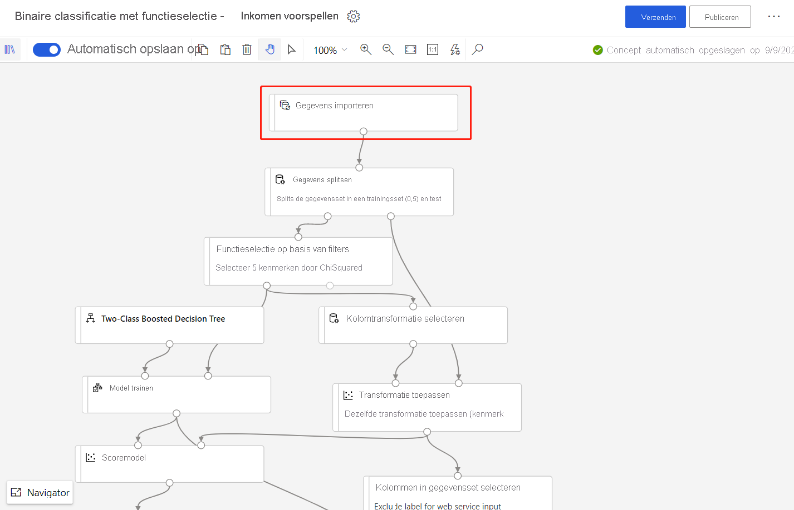
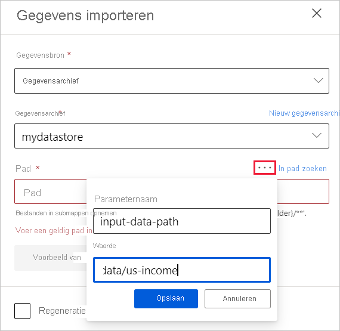
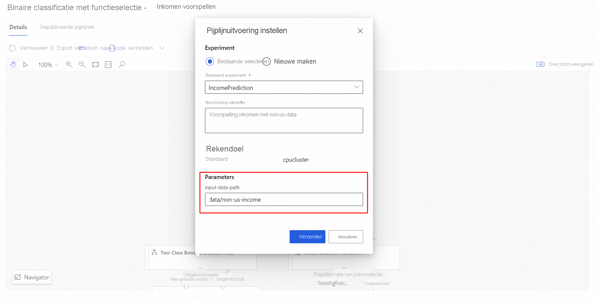

# Modellen opnieuw trainen met Azure Machine Learning Designer (preview)
[!INCLUDE [applies-to-skus](../../includes/aml-applies-to-enterprise-sku.md)]

In dit artikel leert u hoe u Azure Machine Learning Designer kunt gebruiken om een machine learning model opnieuw te trainen. Meer informatie over het gebruik van gepubliceerde pijp lijnen voor het automatiseren van machine learning werk stromen voor retraining.

In dit artikel leert u het volgende:

> [!div class="checklist"]
> * Train een machine learning model.
> * Een pijplijn parameter maken.
> * Publiceer uw trainings pijplijn.
> * Train uw model opnieuw.

## Vereisten

* Een Azure-abonnement. Als u nog geen abonnement op Azure hebt, maakt u een [gratis account](https://aka.ms/AMLFree) aan.
* Een Azure Machine Learning-werk ruimte met de Enter prise-SKU.

In dit artikel wordt ervan uitgegaan dat u basis kennis hebt van het bouwen van pijp lijnen in de ontwerp functie. Voltooi de [zelf studie](tutorial-designer-automobile-price-train-score.md)voor een begeleide Inleiding tot de ontwerp functie. 

### Voorbeeld pijplijn

De pijp lijn die in dit artikel wordt gebruikt, is een gewijzigde versie van de die is gevonden in voor [Beeld 3: inkomen voor spelling](how-to-designer-sample-classification-predict-income.md). De module [gegevens importeren](algorithm-module-reference/import-data.md) wordt gebruikt in plaats van de voor beeld-gegevensset om te laten zien hoe u een model kunt trainen met behulp van uw eigen gegevens.

## Een machine learning model trainen

Voor het opnieuw trainen van een model hebt u een eerste model nodig. In deze sectie leert u hoe u een model traint en het opgeslagen model opent met behulp van de ontwerp functie.

1. Selecteer de module **gegevens importeren** .
1. Geef een gegevens bron op in het deel venster Eigenschappen.

   

   In dit voor beeld worden de gegevens opgeslagen in een [Azure](how-to-access-data.md)-gegevens opslag. Als u nog geen gegevens opslag hebt, kunt u er nu een maken door **nieuwe gegevens opslag**te selecteren.

1. Geef het pad op naar uw gegevens. U kunt ook **Blader traject** selecteren om naar uw gegevens opslag te bladeren. 
1. Selecteer **uitvoeren** boven aan het canvas.
    
   > [!NOTE]
   > Als u al een standaard Compute hebt ingesteld voor deze pijp lijn concept, wordt de pijp lijn automatisch uitgevoerd. Anders kunt u de prompts in het deel venster instellingen volgen om er nu een in te stellen.

### Uw getrainde model zoeken

De ontwerp functie slaat alle pijplijn uitvoer, inclusief getrainde modellen, op in het standaard opslag account. U kunt het getrainde model ook rechtstreeks openen in de ontwerp functie:

1. Wacht totdat de pijp lijn is uitgevoerd.
1. Selecteer de module **Train model** .
1. Selecteer in het deel venster instellingen de optie **uitvoer en logboeken**.
1. Selecteer het pictogram **uitvoer weer geven** en volg de instructies in het pop-upvenster om het getrainde model te vinden.

## Een pijplijn parameter maken

Voeg pijplijn parameters toe om variabelen dynamisch in runtime in te stellen. Voor deze pijp lijn voegt u een para meter voor het pad van de trainings gegevens toe, zodat u uw model op een nieuwe gegevensset kunt trainen.

1. Selecteer de module **gegevens importeren** .
1. Selecteer in het deel venster instellingen de weglatings tekens boven het veld **pad** .
1. Selecteer **toevoegen aan pijplijn parameter**.
1. Geef een parameter naam en een standaard waarde op.

   > [!NOTE]
   > U kunt de pijplijn parameters inspecteren en bewerken door het tandwiel pictogram **instellingen** naast de titel van uw pijp lijn concept te selecteren. 

## Een trainings pijplijn publiceren

Wanneer u een pijp lijn publiceert, wordt een pijplijn eindpunt gemaakt. Met pijplijn eindpunten kunt u uw pijp lijnen hergebruiken en beheren voor Herhaal baarheid en automatisering. In dit voor beeld hebt u uw pijp lijn zo ingesteld dat deze opnieuw kan worden getraind.

1. Selecteer boven het Designing-canvas **publiceren** .
1. Selecteer of maak een pijplijn eindpunt.

   > [!NOTE]
   > U kunt meerdere pijp lijnen publiceren naar een enkel eind punt. Elke pijp lijn in het eind punt krijgt een versie nummer, dat u kunt opgeven wanneer u het eind punt van de pijp lijn aanroept.

1. Selecteer **Publiceren**.

## Uw model opnieuw trainen

Nu u een gepubliceerde trainings pijplijn hebt, kunt u deze gebruiken om uw model te trainen door nieuwe gegevens te gebruiken. U kunt uitvoeringen vanuit een pijplijn eindpunt verzenden vanuit het Azure Portal of ze via een programma verzenden.

### Uitvoeringen verzenden met behulp van de ontwerp functie

Voer de volgende stappen uit om een eind punt voor de pijp lijn te verzenden vanuit de ontwerp functie:

1. Ga naar de pagina met **eind punten** .
1. Selecteer het tabblad **pijplijn eindpunten** .
1. Selecteer het eind punt van de pijp lijn.
1. Selecteer het tabblad **gepubliceerde pijp lijnen** .
1. Selecteer de pijp lijn die u wilt uitvoeren.
1. Selecteer **Indienen**.
1. In het dialoog venster Setup kunt u een nieuwe waarde opgeven voor de waarde voor het pad naar de invoer gegevens. Deze waarde verwijst naar de nieuwe gegevensset.

### Uitvoeringen verzenden met behulp van code

U kunt het REST-eind punt van een gepubliceerde pijp lijn vinden in het deel venster Overzicht. Als u het eind punt aanroept, kunt u de gepubliceerde pijp lijn opnieuw trainen.

Als u een REST-aanroep wilt uitvoeren, hebt u een OAuth 2,0 Bearer-type verificatie-header nodig. Zie voor meer informatie over het instellen van verificatie voor uw werk ruimte en het maken van een geparametriseerde REST-aanroep een [Azure machine learning pijp lijn bouwen voor batch scores](tutorial-pipeline-batch-scoring-classification.md#publish-and-run-from-a-rest-endpoint).

## Volgende stappen

Volg de [zelf studie over ontwerpen](tutorial-designer-automobile-price-train-score.md) om een regressie model te trainen en te implementeren.
