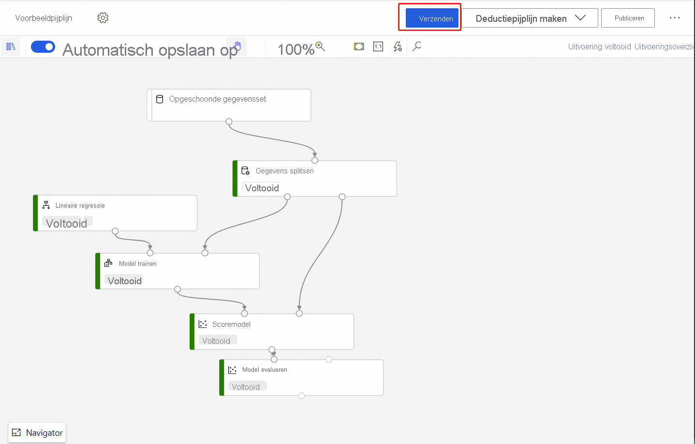
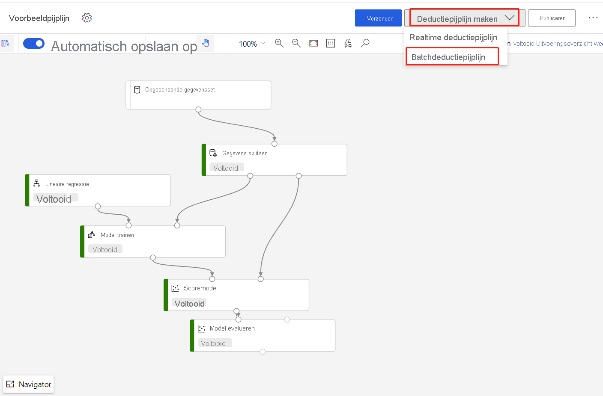
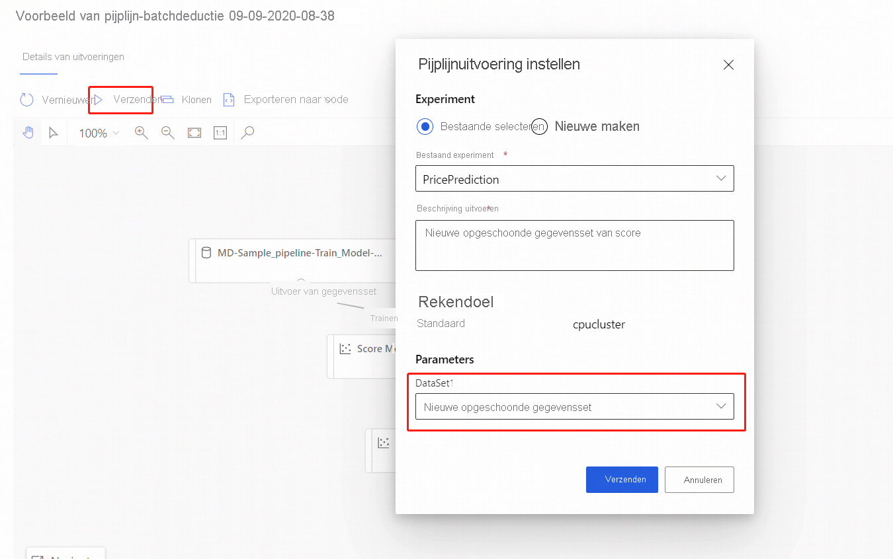

# Batchvoorspellingen uitvoeren met de Azure Machine Learning-ontwerpfunctie (preview)
[!INCLUDE [applies-to-skus](../../includes/aml-applies-to-enterprise-sku.md)]

In dit artikel leert u hoe u de Designer kunt gebruiken om een batch Voorspellings pijplijn te maken. Met batch-voor spelling kunt u op aanvraag van grote gegevens sets continu naar een webservice werken die kan worden geactiveerd vanuit elke HTTP-bibliotheek.

In deze procedure leert u de volgende taken uit te voeren:

> [!div class="checklist"]
> * Een pijp lijn voor een batch-interferentie maken en publiceren
> * Een pijplijn eindpunt gebruiken
> * Eindpunt versies beheren

Zie voor meer informatie over het instellen van batch Score Services met behulp van de SDK de bijbehorende [How-to](how-to-run-batch-predictions.md).

## Vereisten

In deze procedure wordt ervan uitgegaan dat u al een trainings pijplijn hebt. Voor een begeleide Inleiding tot de ontwerp functie, voltooit u [deel één van de zelf studie](tutorial-designer-automobile-price-train-score.md). 

## Een pijp lijn voor een batch-deinterferentie maken

Uw trainings pijplijn moet ten minste één keer worden uitgevoerd om een inleidende pijp lijn te kunnen maken.

1. Ga naar het tabblad **ontwerpen** in uw werk ruimte.

1. Selecteer de trainings pijplijn die het model traint dat u wilt gebruiken om voor spellingen te maken.

1. **Verzend** de pijp lijn.

    

Nu de training-pijp lijn is uitgevoerd, kunt u een batch-uitstel pijp lijn maken.

1. Selecteer bij **verzenden**de optie nieuwe vervolg keuzelijst voor het maken van een **Inleiding**.

1. Selecteer de **pijp lijn voor batch-deinterferentie**.

    
    
Het resultaat is een standaard pijp lijn voor batch-deinterferentie. 

### Een pijplijn parameter toevoegen

Als u voor spellingen wilt maken voor nieuwe gegevens, kunt u een andere gegevensset hand matig verbinden in deze ontwerp weergave van een pijp lijn of een para meter voor uw gegevensset maken. Met para meters kunt u het gedrag van het proces voor batch deprocessen tijdens runtime wijzigen.

In deze sectie maakt u een gegevensset-para meter om een andere gegevensset op te geven voor het maken van voor spellingen.

1. Selecteer de module gegevensset.

1. Er wordt een deel venster aan de rechter kant van het canvas weer gegeven. Selecteer aan de onderkant van het deel venster de **para meter instellen als pijplijn**.
   
    Voer een naam in voor de para meter of accepteer de standaard waarde.

## Uw batch-verwerkings pijplijn publiceren

U bent nu klaar om de pijp lijn voor het afnemen van de interferentie te implementeren. Hiermee wordt de pijp lijn geïmplementeerd en beschikbaar gemaakt zodat anderen deze kunnen gebruiken.

1. Selecteer de knop **Publiceren**.

1. Vouw in het dialoog venster dat wordt weer gegeven de vervolg keuzelijst voor **PipelineEndpoint**uit en selecteer **nieuwe PipelineEndpoint**.

1. Geef een naam en een optionele beschrijving voor het eind punt op.

    Aan de onderkant van het dialoog venster ziet u de para meter die u hebt geconfigureerd met een standaard waarde van de gegevensset-ID die tijdens de training wordt gebruikt.

1. Selecteer **Publiceren**.

## Een eind punt gebruiken

Nu hebt u een gepubliceerde pijp lijn met een gegevensset-para meter. De pijp lijn gebruikt het getrainde model dat in de trainings pijplijn is gemaakt om de gegevensset die u opgeeft als para meter te scoren.

### Een pijplijn uitvoering verzenden 

In deze sectie gaat u een hand matige pijplijn uitvoering instellen en de pijplijn parameter wijzigen om nieuwe gegevens te scoren. 

1. Nadat de implementatie is voltooid, gaat u naar de sectie **endpoints** .

1. Selecteer **pijplijn eindpunten**.

1. Selecteer de naam van het eind punt dat u hebt gemaakt.

1. Selecteer **gepubliceerde pijp lijnen**.

    In dit scherm ziet u alle gepubliceerde pijp lijnen die zijn gepubliceerd onder dit eind punt.

1. Selecteer de pijp lijn die u hebt gepubliceerd.

    Op de pagina Details van pijp lijn ziet u een gedetailleerde uitvoerings geschiedenis en connection string informatie voor de pijp lijn. 
    
1. Selecteer **verzenden** om een hand matige uitvoering van de pijp lijn te maken.

    
    
1. Wijzig de para meter om een andere gegevensset te gebruiken.
    
1. Selecteer **verzenden** om de pijp lijn uit te voeren.

### Het REST-eind punt gebruiken

Meer informatie over het gebruik van pijplijn eindpunten en gepubliceerde pijp lijn vindt u in de sectie met **eind punten** .

U kunt het REST-eind punt van een pijplijn eindpunt vinden in het deel venster Overzicht uitvoeren. Door het eind punt aan te roepen, verbruikt u de standaard gepubliceerde pijp lijn.

U kunt ook een gepubliceerde pijp lijn gebruiken op de pagina **gepubliceerde pijp lijnen** . Selecteer een gepubliceerde pijp lijn en zoek het REST-eind punt. 

Als u een REST-aanroep wilt uitvoeren, hebt u een OAuth 2,0 Bearer-type verificatie-header nodig. Raadpleeg de volgende [sectie zelf studie](tutorial-pipeline-batch-scoring-classification.md#publish-and-run-from-a-rest-endpoint) voor meer informatie over het instellen van verificatie voor uw werk ruimte en het maken van een para meter rest-aanroep.

## Versie-eind punten

De Designer wijst een versie toe aan elke volgende pijp lijn die u naar een eind punt publiceert. U kunt de pijplijn versie opgeven die u wilt uitvoeren als een para meter in uw REST-aanroep. Als u geen versie nummer opgeeft, maakt de ontwerp functie gebruik van de standaard pijplijn.

Wanneer u een pijp lijn publiceert, kunt u ervoor kiezen om deze te maken als de nieuwe standaard pijplijn voor dat eind punt.

U kunt ook een nieuwe standaard pijplijn instellen op het tabblad **gepubliceerde pijp lijnen** van het eind punt.

## Volgende stappen

Volg de [zelf studie](tutorial-designer-automobile-price-train-score.md) over ontwerpen om een regressie model te trainen en te implementeren.
''