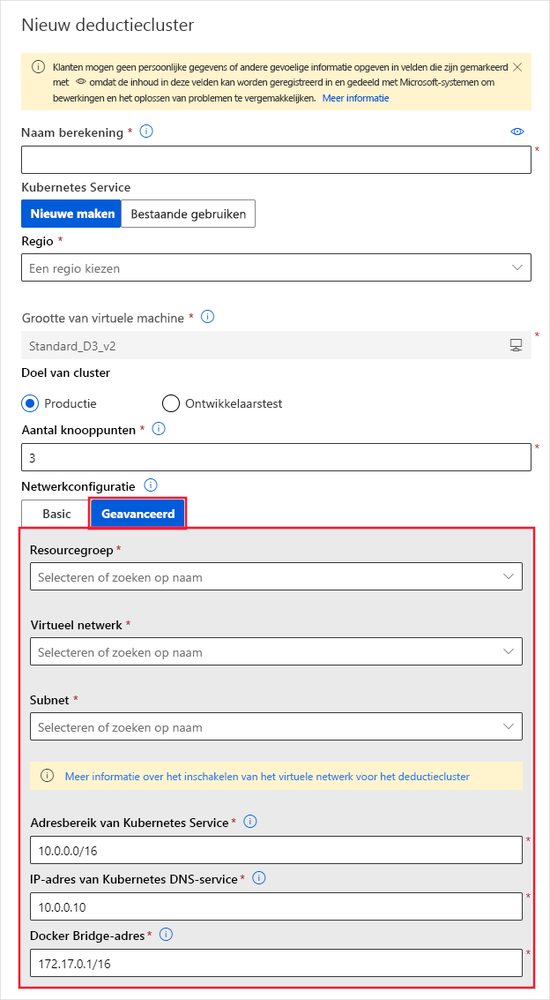
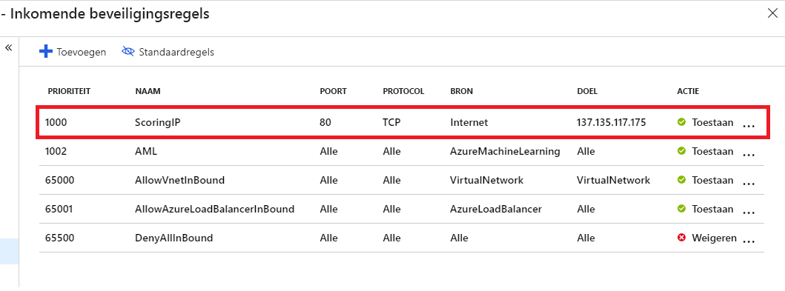

# <a name="secure-an-azure-machine-learning-inferencing-environment-with-virtual-networks"></a>Een Azure Machine Learning omgeving voor het afwijzen van interferentie beveiligen met virtuele netwerken

In dit artikel leert u hoe u in Azure Machine Learning kunt beveiligen met behulp van een virtueel netwerk.

Dit artikel is deel vier van een serie van vijf delen die u begeleidt bij het beveiligen van een Azure Machine Learning werk stroom. We raden u ten zeerste aan om in [deel één het overzicht van VNet](how-to-network-security-overview.md) te lezen om eerst inzicht te krijgen in de algehele architectuur. 

Zie de andere artikelen in deze serie:

[1. VNet-overzicht](how-to-network-security-overview.md)  >  [Beveilig de werk ruimte](how-to-secure-workspace-vnet.md)  >  [3. De trainings omgeving](how-to-secure-training-vnet.md)  >  **4 beveiligen. Beveilig de vergoedings omgeving**  >  [5. De functionaliteit van Studio inschakelen](how-to-enable-studio-virtual-network.md)

In dit artikel leert u hoe u de volgende bronnen voor het afwijzen van een virtueel netwerk kunt beveiligen:
> [!div class="checklist"]
> - Standaard cluster voor Azure Kubernetes service (AKS)
> - Persoonlijk AKS-cluster
> - Azure Container Instances (ACI)


## <a name="prerequisites"></a>Vereisten

+ Lees het artikel [overzicht van netwerk beveiliging](how-to-network-security-overview.md) voor inzicht in algemene scenario's voor virtuele netwerken en de algehele architectuur van virtuele netwerken.

+ Een bestaand virtueel netwerk en subnet voor gebruik met uw reken resources.

+ Als u resources wilt implementeren in een virtueel netwerk of subnet, moet uw gebruikers account over machtigingen beschikken voor de volgende acties in op rollen gebaseerde toegangs beheer (RBAC) van Azure:

    - ' Micro soft. Network/virtualNetworks/lid/Action ' op de virtuele netwerk resource.
    - ' Micro soft. Network/virtualNetworks/subnet/lid/Action ' op de bron van het subnet.

    Zie voor meer informatie over RBAC met netwerken de [ingebouwde rollen voor netwerken](/azure/role-based-access-control/built-in-roles#networking)

<a id="aksvnet"></a>

## <a name="azure-kubernetes-service"></a>Azure Kubernetes Service

Als u een AKS-cluster in een virtueel netwerk wilt gebruiken, moet aan de volgende netwerk vereisten worden voldaan:

> [!div class="checklist"]
> * Volg de vereisten in [geavanceerde netwerken configureren in azure Kubernetes service (AKS)](../aks/configure-azure-cni.md#prerequisites).
> * Het AKS-exemplaar en het virtuele netwerk moeten zich in dezelfde regio bevinden. Als u de Azure Storage account (s) die door de werk ruimte in een virtueel netwerk worden gebruikt, beveiligt, moeten ze zich ook in hetzelfde virtuele netwerk bevinden als het AKS-exemplaar.


Voer de volgende stappen uit om AKS toe te voegen aan uw werk ruimte in een virtueel netwerk:

1. Meld u aan bij [Azure machine learning Studio](https://ml.azure.com/)en selecteer vervolgens uw abonnement en werk ruimte.

1. Selecteer __Compute__ aan de linkerkant.

1. Selecteer Afleidings __clusters__ in het midden en selecteer vervolgens __+__ .

1. Selecteer __Geavanceerd__ onder __netwerk configuratie__in het dialoog venster __Nieuw cluster__ voor uitgevallen.

1. Voer de volgende acties uit om deze Compute-resource te configureren voor het gebruik van een virtueel netwerk:

    1. Selecteer de resource groep met het virtuele netwerk in de vervolg keuzelijst __resource groep__ .
    1. Selecteer in de vervolg keuzelijst __virtueel netwerk__ het virtuele netwerk dat het subnet bevat.
    1. Selecteer in de vervolg keuzelijst __subnet__ het subnet.
    1. Voer in het vak __Kubernetes service adres bereik__ het adres bereik van de Kubernetes-service in. Dit adres bereik maakt gebruik van een CIDR-notatie (Classless Inter-Domain Routing) IP-bereik voor het definiëren van de IP-adressen die beschikbaar zijn voor het cluster. Het mag niet overlappen met subnet IP-bereiken (bijvoorbeeld 10.0.0.0/16).
    1. Voer in het vak __IP-adres van KUBERNETES DNS__ -service het IP-adres van de Kubernetes DNS-service in. Dit IP-adres wordt toegewezen aan de DNS-service Kubernetes. Deze moet zich in het adres bereik van de Kubernetes-service bevallen (bijvoorbeeld 10.0.0.10).
    1. Voer in het vak __docker Bridge-adres__ het adres van de docker-brug in. Dit IP-adres wordt toegewezen aan docker-brug. De waarde mag zich niet in een IP-bereik van het subnet of in het Kubernetes (bijvoorbeeld 172.17.0.1/16) bevinden.

   

1. Zorg ervoor dat de NSG-groep die het virtuele netwerk beheert, een binnenkomende beveiligings regel voor het Score-eind punt heeft ingeschakeld, zodat deze kan worden aangeroepen buiten het virtuele netwerk.
   > [!IMPORTANT]
   > Behoud de standaard regels voor uitgaande verbindingen voor de NSG. Zie de standaard beveiligings regels in [beveiligings groepen](https://docs.microsoft.com/azure/virtual-network/security-overview#default-security-rules)voor meer informatie.

   [](./media/how-to-enable-virtual-network/aks-vnet-inbound-nsg-scoring.png#lightbox)

U kunt ook de Azure Machine Learning SDK gebruiken om de Azure Kubernetes-service toe te voegen aan een virtueel netwerk. Als u al een AKS-cluster in een virtueel netwerk hebt, koppelt u dit aan de werk ruimte, zoals wordt beschreven in [Deploying to aks](how-to-deploy-and-where.md). Met de volgende code wordt een nieuw AKS-exemplaar gemaakt in het `default` subnet van een virtueel netwerk met de naam `mynetwork` :

```python
from azureml.core.compute import ComputeTarget, AksCompute

# Create the compute configuration and set virtual network information
config = AksCompute.provisioning_configuration(location="eastus2")
config.vnet_resourcegroup_name = "mygroup"
config.vnet_name = "mynetwork"
config.subnet_name = "default"
config.service_cidr = "10.0.0.0/16"
config.dns_service_ip = "10.0.0.10"
config.docker_bridge_cidr = "172.17.0.1/16"

# Create the compute target
aks_target = ComputeTarget.create(workspace=ws,
                                  name="myaks",
                                  provisioning_configuration=config)
```

Wanneer het maken van het proces is voltooid, kunt u het decoderen of model leren uitvoeren op een AKS-cluster achter een virtueel netwerk. Zie [implementeren op AKS](how-to-deploy-and-where.md)voor meer informatie.

## <a name="secure-vnet-traffic"></a>Beveiligd VNet-verkeer

Er zijn twee benaderingen voor het isoleren van verkeer van en naar het AKS-cluster naar het virtuele netwerk:

* __Persoonlijk AKS-cluster__: deze benadering maakt gebruik van een persoonlijke Azure-koppeling voor het maken van een persoonlijk eind punt voor het AKS-cluster binnen het VNet.
* __Interne AKS Load Balancer__: met deze aanpak configureert u de Load Balancer voor het cluster om een intern IP-adres in het VNet te gebruiken.

> [!WARNING]
> Beide configuraties zijn verschillende manieren om hetzelfde doel te krijgen (het beveiligen van verkeer naar het AKS-cluster binnen het VNet). **Gebruik een van de twee, maar niet beide**.

### <a name="private-aks-cluster"></a>Persoonlijk AKS-cluster

Standaard hebben AKS-clusters een besturings vlak of API-server met open bare IP-adressen. U kunt AKS configureren voor het gebruik van een privé beheergebied door een persoonlijk AKS-cluster te maken. Zie [een persoonlijk Azure Kubernetes service-cluster maken](../aks/private-clusters.md)voor meer informatie.

Nadat u het persoonlijke AKS-cluster hebt gemaakt, [koppelt u het cluster aan het virtuele netwerk](how-to-create-attach-kubernetes.md) om te gebruiken met Azure machine learning.

> [!IMPORTANT]
> Voordat u een AKS-cluster met persoonlijke koppelingen gebruikt met Azure Machine Learning, moet u een ondersteunings incident openen om deze functionaliteit in te scha kelen. Zie [Quota's beheren en verhogen](how-to-manage-quotas.md#private-endpoint-and-private-dns-quota-increases)voor meer informatie.

## <a name="internal-aks-load-balancer"></a>Interne AKS load balancer

AKS-implementaties gebruiken standaard een [open bare Load Balancer](../aks/load-balancer-standard.md). In deze sectie leert u hoe u AKS kunt configureren voor het gebruik van een interne load balancer. Een intern (of privé) load balancer wordt gebruikt wanneer alleen privé Ip's zijn toegestaan als frontend. Interne load balancers worden gebruikt voor het verdelen van verkeer binnen een virtueel netwerk

Een persoonlijke load balancer wordt ingeschakeld door AKS te configureren voor het gebruik van een _interne Load Balancer_. 

#### <a name="network-contributor-role"></a>Rol netwerk bijdrager

> [!IMPORTANT]
> Als u een AKS-cluster maakt of koppelt met een virtueel netwerk dat u eerder hebt gemaakt, moet u de Service-Principal (SP) of de beheerde identiteit voor uw AKS-cluster de rol _netwerk bijdrage_ verlenen aan de resource groep met het virtuele netwerk. U moet dit doen voordat u probeert de interne load balancer te wijzigen in privé-IP.
>
> Gebruik de volgende stappen om de identiteit als netwerkinzender toe te voegen:

1. Gebruik de volgende Azure CLI-opdrachten om de service-principal of de beheerde identiteits-ID voor AKS te vinden. Vervang `<aks-cluster-name>` door de naam van het cluster. Vervang door `<resource-group-name>` de naam van de resource groep die _het AKS-cluster bevat_:

    ```azurecli-interactive
    az aks show -n <aks-cluster-name> --resource-group <resource-group-name> --query servicePrincipalProfile.clientId
    ``` 

    Als met deze opdracht een waarde wordt geretourneerd van `msi` , gebruikt u de volgende opdracht om de principal-id voor de beheerde identiteit te identificeren:

    ```azurecli-interactive
    az aks show -n <aks-cluster-name> --resource-group <resource-group-name> --query identity.principalId
    ```

1. Gebruik de volgende opdracht om de ID te vinden van de resource groep die het virtuele netwerk bevat. Vervang door `<resource-group-name>` de naam van de resource groep die _het virtuele netwerk bevat_:

    ```azurecli-interactive
    az group show -n <resource-group-name> --query id
    ```

1. Gebruik de volgende opdracht om de service-principal of beheerde identiteit als Inzender voor het netwerk toe te voegen. Vervang door `<SP-or-managed-identity>` de id die wordt geretourneerd voor de service-principal of beheerde identiteit. Vervang door `<resource-group-id>` de id die wordt geretourneerd voor de resource groep die het virtuele netwerk bevat:

    ```azurecli-interactive
    az role assignment create --assignee <SP-or-managed-identity> --role 'Network Contributor' --scope <resource-group-id>
    ```
Zie voor meer informatie over het gebruik van de interne load balancer met AKS [interne Load Balancer gebruiken met de Azure Kubernetes-service](/azure/aks/internal-lb).

#### <a name="enable-private-load-balancer"></a>Persoonlijke load balancer inschakelen

> [!IMPORTANT]
> U kunt geen persoonlijk IP-adres inschakelen bij het maken van het Azure Kubernetes-service cluster in Azure Machine Learning Studio. U kunt er een maken met een interne load balancer wanneer u de python-SDK of Azure CLI-extensie gebruikt voor machine learning.

In de volgende voor beelden ziet u hoe u __een nieuw AKS-cluster maakt met een privé-IP/interne Load Balancer__ met behulp van de SDK en cli:

# <a name="python"></a>[Python](#tab/python)

```python
import azureml.core
from azureml.core.compute import AksCompute, ComputeTarget

# Verify that cluster does not exist already
try:
    aks_target = AksCompute(workspace=ws, name=aks_cluster_name)
    print("Found existing aks cluster")

except:
    print("Creating new aks cluster")

    # Subnet to use for AKS
    subnet_name = "default"
    # Create AKS configuration
    prov_config=AksCompute.provisioning_configuration(load_balancer_type="InternalLoadBalancer")
    # Set info for existing virtual network to create the cluster in
    prov_config.vnet_resourcegroup_name = "myvnetresourcegroup"
    prov_config.vnet_name = "myvnetname"
    prov_config.service_cidr = "10.0.0.0/16"
    prov_config.dns_service_ip = "10.0.0.10"
    prov_config.subnet_name = subnet_name
    prov_config.docker_bridge_cidr = "172.17.0.1/16"

    # Create compute target
    aks_target = ComputeTarget.create(workspace = ws, name = "myaks", provisioning_configuration = prov_config)
    # Wait for the operation to complete
    aks_target.wait_for_completion(show_output = True)
```

# <a name="azure-cli"></a>[Azure CLI](#tab/azure-cli)

```azurecli
az ml computetarget create aks -n myaks --load-balancer-type InternalLoadBalancer
```

Zie voor meer informatie de referentie [AZ ml computetarget Create AKS](https://docs.microsoft.com/cli/azure/ext/azure-cli-ml/ml/computetarget/create?view=azure-cli-latest&preserve-view=true#ext-azure-cli-ml-az-ml-computetarget-create-aks) .

---

Wanneer u __een bestaand cluster koppelt__ aan uw werk ruimte, moet u wachten totdat de bewerking koppelen is geconfigureerd om de Load Balancer te configureren. Zie [een bestaand AKS-cluster koppelen](how-to-create-attach-kubernetes.md)voor meer informatie over het koppelen van een cluster.

Nadat u het bestaande cluster hebt gekoppeld, kunt u het cluster bijwerken om een intern load balancer/particulier IP-adres te gebruiken:

```python
import azureml.core
from azureml.core.compute.aks import AksUpdateConfiguration
from azureml.core.compute import AksCompute

# ws = workspace object. Creation not shown in this snippet
aks_target = AksCompute(ws,"myaks")

# Change to the name of the subnet that contains AKS
subnet_name = "default"
# Update AKS configuration to use an internal load balancer
update_config = AksUpdateConfiguration(None, "InternalLoadBalancer", subnet_name)
aks_target.update(update_config)
# Wait for the operation to complete
aks_target.wait_for_completion(show_output = True)
```

## <a name="enable-azure-container-instances-aci"></a>Azure Container Instances inschakelen (ACI)

Azure Container Instances worden dynamisch gemaakt bij het implementeren van een model. Als u wilt dat Azure Machine Learning ACI in het virtuele netwerk maakt, moet u __subnet delegering__ inschakelen voor het subnet dat wordt gebruikt door de implementatie.

> [!WARNING]
> Als Azure Container Instances in een virtueel netwerk wordt gebruikt, moet het virtuele netwerk zich in dezelfde resource groep bevinden als uw Azure Machine Learning-werk ruimte.
>
> Wanneer u Azure Container Instances in het virtuele netwerk gebruikt, kan de Azure Container Registry (ACR) voor uw werk ruimte zich ook niet in het virtuele netwerk bevinden.

Als u ACI wilt gebruiken in een virtueel netwerk naar uw werk ruimte, gebruikt u de volgende stappen:

1. Als u subnet delegering wilt inschakelen voor het virtuele netwerk, gebruikt u de informatie in het artikel [een subnet delegering toevoegen of verwijderen](../virtual-network/manage-subnet-delegation.md) . U kunt delegeren inschakelen bij het maken van een virtueel netwerk of het toevoegen aan een bestaand netwerk.

    > [!IMPORTANT]
    > Wanneer delegering wordt ingeschakeld, gebruikt u `Microsoft.ContainerInstance/containerGroups` als het __subnet aan service waarde delegeren__ .

2. Implementeer het model met behulp van [AciWebservice. deploy_configuration ()](https://docs.microsoft.com/python/api/azureml-core/azureml.core.webservice.aci.aciwebservice?view=azure-ml-py&preserve-view=true#deploy-configuration-cpu-cores-none--memory-gb-none--tags-none--properties-none--description-none--location-none--auth-enabled-none--ssl-enabled-none--enable-app-insights-none--ssl-cert-pem-file-none--ssl-key-pem-file-none--ssl-cname-none--dns-name-label-none--primary-key-none--secondary-key-none--collect-model-data-none--cmk-vault-base-url-none--cmk-key-name-none--cmk-key-version-none--vnet-name-none--subnet-name-none-&preserve-view=true), gebruik de `vnet_name` `subnet_name` para meters en. Stel deze para meters in op de naam van het virtuele netwerk en het subnet waar u delegering hebt ingeschakeld.


## <a name="next-steps"></a>Volgende stappen

Dit artikel is deel drie in een virtuele netwerk reeks van vier delen. Raadpleeg de rest van de artikelen voor meer informatie over het beveiligen van een virtueel netwerk:

* [Deel 1: overzicht van virtueel netwerk](how-to-network-security-overview.md)
* [Deel 2: de resources van de werk ruimte beveiligen](how-to-secure-workspace-vnet.md)
* [Deel 3: de trainings omgeving beveiligen](how-to-secure-training-vnet.md)
* [Deel 5: de functionaliteit van Studio inschakelen](how-to-enable-studio-virtual-network.md)