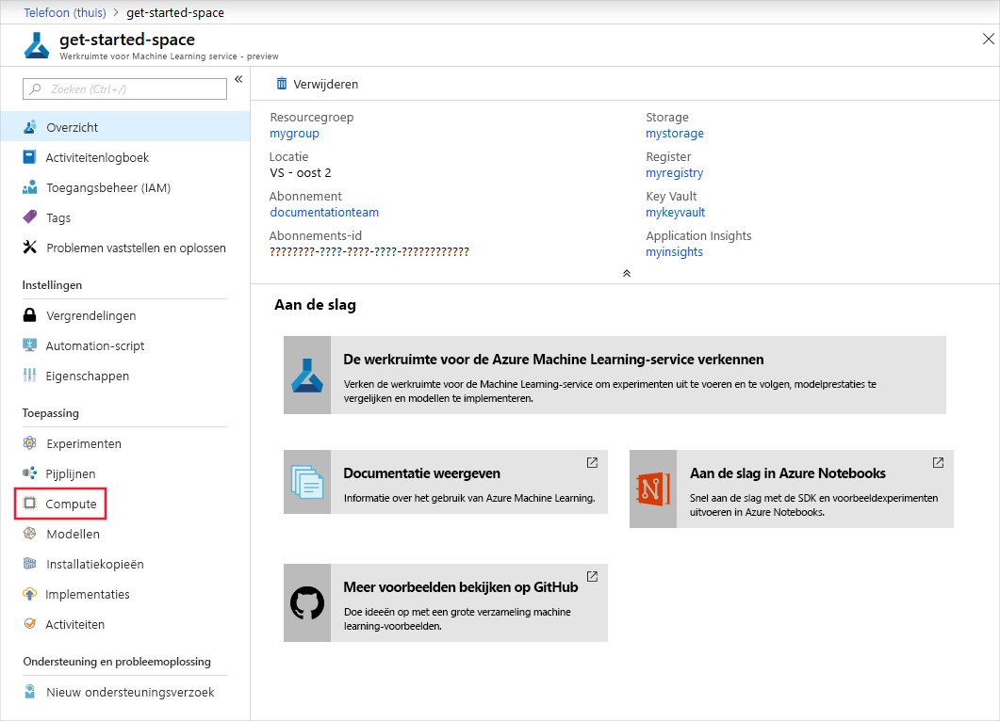
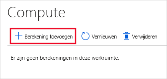
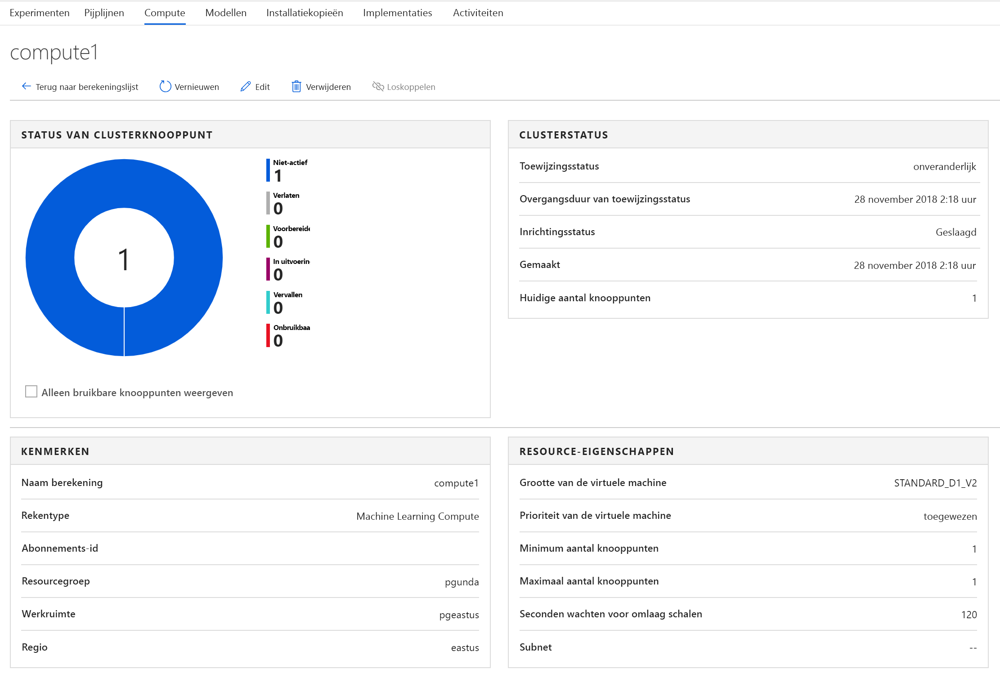

# <a name="set-up-and-use-compute-targets-for-model-training"></a>Reken doelen voor model training instellen en gebruiken 
[!INCLUDE [applies-to-skus](../../includes/aml-applies-to-basic-enterprise-sku.md)]

Met Azure Machine Learning kunt u uw model trainen op diverse resources of omgevingen, die gezamenlijk worden aangeduid als [__Compute-doelen__](concept-azure-machine-learning-architecture.md#compute-targets). Een compute-doel kan een lokale machine of een Cloud resource zijn, zoals een Azure Machine Learning compute, Azure HDInsight of een externe virtuele machine.  U kunt ook reken doelen voor model implementatie maken, zoals wordt beschreven in [' waar en hoe u uw modellen implementeert '](how-to-deploy-and-where.md).

U kunt een compute-doel maken en beheren met behulp van de Azure Machine Learning SDK, Azure Machine Learning Studio, Azure CLI of Azure Machine Learning VS code extension. Als u reken doelen hebt die zijn gemaakt via een andere service (bijvoorbeeld een HDInsight-cluster), kunt u deze gebruiken door deze te koppelen aan uw Azure Machine Learning-werk ruimte.
 
In dit artikel leert u hoe u verschillende reken doelen kunt gebruiken voor model training.  De stappen voor alle Compute-doelen volgen dezelfde werk stroom:
1. __Maak__ een reken doel als u er nog geen hebt.
2. __Koppel__ het Compute-doel aan uw werk ruimte.
3. __Configureer__ het reken doel zodanig dat het de python-omgeving en pakket afhankelijkheden bevat die nodig zijn voor uw script.


>[!NOTE]
> De code in dit artikel is getest met Azure Machine Learning SDK-versie 1.0.74.

## <a name="compute-targets-for-training"></a>Reken doelen voor training

Azure Machine Learning heeft verschillende ondersteuning voor verschillende Compute-doelen. Een typische model ontwikkelingscyclus begint met dev/experimenten op een kleine hoeveelheid gegevens. In deze fase, wordt u aangeraden een lokale omgeving. Bijvoorbeeld, de lokale computer of een cloud-gebaseerde VM. Als u uw training voor grotere gegevenssets opschalen of gedistribueerde training doen, wordt u aangeraden een één of meerdere node cluster maken dat automatisch wordt geschaald telkens wanneer die u een uitvoering verzenden met Azure Machine Learning-Computing. U kunt ook uw eigen compute-resource koppelen, hoewel ondersteuning voor verschillende scenario's als variëren kunnen hieronder uitgelegd:

[!INCLUDE [aml-compute-target-train](../../includes/aml-compute-target-train.md)]


> [!NOTE]
> Azure Machine Learning Compute kan worden gemaakt als een permanente resource of dynamisch worden gemaakt wanneer u een uitvoering aanvraagt. Bij het maken van de uitvoering wordt het reken doel verwijderd nadat de training is voltooid, zodat u de reken doelen die op deze manier zijn gemaakt, niet opnieuw kunt gebruiken.

## <a name="whats-a-run-configuration"></a>Wat is een uitvoerings configuratie?

Bij het trainen is het gebruikelijk om te beginnen op de lokale computer en dat trainings script later uit te voeren op een ander reken doel. Met Azure Machine Learning kunt u het script uitvoeren op verschillende reken doelen zonder dat u het script hoeft te wijzigen.

Alles wat u hoeft te doen, is het definiëren van de omgeving voor elk reken doel in een **uitvoerings configuratie**.  Wanneer u uw trainings experiment wilt uitvoeren op een ander Compute-doel, geeft u de uitvoerings configuratie op voor die reken kracht. Zie [omgevingen maken en beheren voor training en implementatie](how-to-use-environments.md)voor meer informatie over het opgeven van een omgeving en het binden ervan voor het uitvoeren van een configuratie.

Meer informatie over het [verzenden van experimenten](#submit) aan het einde van dit artikel.

## <a name="whats-an-estimator"></a>Wat is een estimator?

Om model training te vergemakkelijken met behulp van populaire frameworks, biedt de Azure Machine Learning python SDK een alternatieve abstractie op hoger niveau, de Estimator-klasse.  Met deze klasse kunt u eenvoudig uitvoerings configuraties bouwen. U kunt een algemene [Estimator](https://docs.microsoft.com/python/api/azureml-train-core/azureml.train.estimator?view=azure-ml-py) maken en gebruiken om trainings scripts te verzenden die gebruikmaken van een door u gekozen trainings raamwerk (zoals scikit-leren). We raden u aan om een Estimator for training te gebruiken omdat deze automatisch Inge sloten objecten, zoals een omgeving of RunConfiguration-objecten, voor u bouwt. Als u meer controle wilt hebben over de manier waarop deze objecten worden gemaakt en u wilt opgeven welke pakketten u wilt installeren voor uw experiment, voert u de [volgende stappen uit](#amlcompute) om uw trainings experimenten te verzenden met behulp van een RunConfiguration-object op een Azure machine learning compute.

Voor PyTorch-, tensor flow-en Chainer-taken biedt Azure Machine Learning ook de geraamde [PyTorch](https://docs.microsoft.com/python/api/azureml-train-core/azureml.train.dnn.pytorch?view=azure-ml-py), [tensor flow](https://docs.microsoft.com/python/api/azureml-train-core/azureml.train.dnn.tensorflow?view=azure-ml-py)en [Chainer](https://docs.microsoft.com/python/api/azureml-train-core/azureml.train.dnn.chainer?view=azure-ml-py) -schattingen om het gebruik van deze frameworks te vereenvoudigen.

Meer informatie vindt u [in Train ml-modellen met schattingen](how-to-train-ml-models.md).

## <a name="whats-an-ml-pipeline"></a>Wat is een ML-pijp lijn?

Met ML-pijp lijnen kunt u uw werk stroom optimaliseren met eenvoud, snelheid, portabiliteit en hergebruik. Wanneer u pijp lijnen met Azure Machine Learning bouwt, kunt u zich richten op uw expertise, machine learning in plaats van de infra structuur en Automation.

ML-pijp lijnen worden uit meerdere **stappen**gemaakt. Dit zijn afzonderlijke reken kundige eenheden in de pijp lijn. Elke stap kan onafhankelijk worden uitgevoerd en geïsoleerde reken bronnen gebruiken. Op deze manier kunnen meerdere gegevens wetenschappers tegelijkertijd op dezelfde pijp lijn werken zonder dat er meer belasting bronnen hoeft te worden gebruikt, en kunt u voor elke stap eenvoudig verschillende reken typen of-grootten gebruiken.

> [!TIP]
> ML-pijp lijnen kunnen gebruikmaken van configuratie of schattingen wanneer trainings modellen worden uitgevoerd.

Hoewel ML-pijp lijnen modellen kunnen trainen, kunnen ze ook gegevens voorbereiden voordat ze na de training worden getraind en geïmplementeerd. Een van de primaire gebruiks cases voor pijp lijnen is batch scores. Zie voor meer informatie [pijp lijnen: optimaliseer machine learning werk stromen](concept-ml-pipelines.md).

## <a name="set-up-in-python"></a>Ingesteld in python

Gebruik de volgende secties om deze reken doelen te configureren:

* [Lokale computer](#local)
* [Azure Machine Learning compute](#amlcompute)
* [Externe virtuele machines](#vm)
* [Azure HDInsight](#hdinsight)


### <a id="local"></a>Lokale computer

1. **Maken en koppelen**: u hoeft geen Compute-doel te maken of koppelen om uw lokale computer te gebruiken als de trainings omgeving.  

1. **Configureren**: wanneer u uw lokale computer als reken doel gebruikt, wordt de trainings code uitgevoerd in uw [ontwikkel omgeving](how-to-configure-environment.md).  Als deze omgeving al de Python-pakketten bevat die u nodig hebt, gebruikt u de door de gebruiker beheerde omgeving.

 [!code-python[](~/aml-sdk-samples/ignore/doc-qa/how-to-set-up-training-targets/local.py?name=run_local)]

Nu u de reken kracht hebt gekoppeld en de uitvoering hebt geconfigureerd, is de volgende stap [het verzenden van de trainings uitvoering](#submit).

### <a id="amlcompute"></a>Azure Machine Learning compute

Azure Machine Learning Compute is een infra structuur voor beheerde berekeningen waarmee de gebruiker eenvoudig een reken proces met één of meerdere knoop punten kan maken. De berekening wordt binnen uw werkruimte regio gemaakt als een resource die kan worden gedeeld met andere gebruikers in uw werk ruimte. De berekening wordt automatisch omhoog geschaald wanneer een taak wordt verzonden en kan in een Azure-Virtual Network worden geplaatst. De berekening wordt uitgevoerd in een omgeving met containers en verpakt uw model afhankelijkheden in een [docker-container](https://www.docker.com/why-docker).

U kunt Azure Machine Learning-Computing gebruiken voor het distribueren van het trainingsproces in een cluster van de CPU of GPU-computerknooppunten in de cloud. Zie [grootten geoptimaliseerd voor virtuele machines](https://docs.microsoft.com/azure/virtual-machines/linux/sizes-gpu)voor meer informatie over de VM-grootten die GPU bevatten.

Azure Machine Learning Compute heeft standaard limieten, zoals het aantal kernen dat kan worden toegewezen. Zie voor meer informatie [beheer en aanvragen van quota's voor Azure-resources](https://docs.microsoft.com/azure/machine-learning/how-to-manage-quotas).


U kunt op aanvraag een Azure Machine Learning Compute-omgeving maken wanneer u een uitvoering plant of als een permanente resource.

#### <a name="run-based-creation"></a>Uitvoeren op basis van het maken

Tijdens runtime kunt u Azure Machine Learning Compute als een reken doel maken. De berekening wordt automatisch gemaakt voor de uitvoering. De berekening wordt automatisch verwijderd zodra de uitvoering is voltooid. 

> [!IMPORTANT]
> Het maken van Azure Machine Learning Compute is momenteel beschikbaar als preview-versie. Gebruik niet maken op basis van de uitvoering als u gebruikmaakt van automatische afstemming-afstemming of geautomatiseerde machine learning. Als u afstemming-tuning of geautomatiseerde machine learning wilt gebruiken, maakt u in plaats daarvan een [persistent reken](#persistent) doel.

1.  **Maken, koppelen en configureren**: het maken van een uitvoering voert alle benodigde stappen uit om het reken doel te maken, te koppelen en te configureren met de uitvoerings configuratie.  

  [!code-python[](~/aml-sdk-samples/ignore/doc-qa/how-to-set-up-training-targets/amlcompute.py?name=run_temp_compute)]


Nu u de reken kracht hebt gekoppeld en de uitvoering hebt geconfigureerd, is de volgende stap [het verzenden van de trainings uitvoering](#submit).

#### <a id="persistent"></a>Permanente compute

Een permanente Azure Machine Learning Compute kan opnieuw worden gebruikt voor verschillende taken. De compute kan worden gedeeld met andere gebruikers in de werk ruimte en tussen taken worden bewaard.

1. **Maken en bijvoegen**: als u een permanente Azure machine learning Compute-resource in python wilt maken, geeft u de **vm_size** en **max_nodes** eigenschappen op. Azure Machine Learning gebruikt vervolgens slimme standaard instellingen voor de andere eigenschappen. De berekening wordt automatisch geschaald naar nul knoop punten wanneer deze niet wordt gebruikt.   Er zijn specifieke Vm's gemaakt om uw taken naar behoefte uit te voeren.
    
    * **vm_size**: de VM-familie van de knoop punten die door Azure machine learning Compute zijn gemaakt.
    * **max_nodes**: het maximum aantal knoop punten waarmee automatisch kan worden geschaald wanneer u een taak op Azure machine learning Compute uitvoert.
    
   [!code-python[](~/aml-sdk-samples/ignore/doc-qa/how-to-set-up-training-targets/amlcompute2.py?name=cpu_cluster)]

   U kunt ook verschillende geavanceerde eigenschappen configureren wanneer u Azure Machine Learning Compute maakt. Met de eigenschappen kunt u een permanent cluster met een vaste grootte of binnen een bestaand Azure-Virtual Network in uw abonnement maken.  Zie de [klasse AmlCompute](https://docs.microsoft.com/python/api/azureml-core/azureml.core.compute.amlcompute.amlcompute?view=azure-ml-py
    ) voor meer informatie.
    
   U kunt ook een permanente Azure Machine Learning Compute-bron maken en koppelen in [Azure machine learning Studio](#portal-create).

1. **Configureren**: een uitvoerings configuratie maken voor het permanente Compute-doel.

   [!code-python[](~/aml-sdk-samples/ignore/doc-qa/how-to-set-up-training-targets/amlcompute2.py?name=run_amlcompute)]

Nu u de reken kracht hebt gekoppeld en de uitvoering hebt geconfigureerd, is de volgende stap [het verzenden van de trainings uitvoering](#submit).


### <a id="vm"></a>Externe virtuele machines

Azure Machine Learning ondersteunt ook uw eigen compute-resource halen en deze te koppelen aan uw werkruimte. Een van deze bron typen is een wille keurige externe virtuele machine, zolang deze toegankelijk is vanaf Azure Machine Learning. De resource kan een Azure-VM, een externe server in uw organisatie of on-premises zijn. Met name op basis van het IP-adres en de referenties (gebruikers naam en wacht woord of SSH-sleutel) kunt u elke toegankelijke virtuele machine gebruiken voor externe uitvoeringen.

U kunt een systeem gebouwd conda-omgeving, een al bestaande Python-omgeving of een Docker-container. Als u wilt uitvoeren op een docker-container, moet er een docker-engine op de VM worden uitgevoerd. Deze functionaliteit is vooral nuttig als u wilt dat een meer flexibele, cloud-gebaseerde dev/experimentele omgeving dan uw lokale computer.

Gebruik Azure Data Science Virtual Machine (DSVM) als de Azure-VM van de keuze voor dit scenario. Deze VM is een vooraf geconfigureerde data Science-en AI-ontwikkel omgeving in Azure. De virtuele machine biedt een geruime keuze aan hulpprogram ma's en frameworks voor een volledige levenscyclus machine learning ontwikkeling. Zie [Configure a Development Environment](https://docs.microsoft.com/azure/machine-learning/how-to-configure-environment#dsvm)(Engelstalig) voor meer informatie over het gebruik van de DSVM met Azure machine learning.

1. **Maken**: Maak een DSVM voordat u het gebruikt om het model te trainen. Zie [de data Science virtual machine inrichten voor Linux (Ubuntu)](https://docs.microsoft.com/azure/machine-learning/data-science-virtual-machine/dsvm-ubuntu-intro)als u deze resource wilt maken.

    > [!WARNING]
    > Azure Machine Learning ondersteunt alleen virtuele machines waarop Ubuntu wordt uitgevoerd. Wanneer u een virtuele machine maakt of een bestaande virtuele machine kiest, moet u een virtuele machine selecteren die gebruikmaakt van Ubuntu.

1. **Bijvoegen**: als u een bestaande virtuele machine als een reken doel wilt koppelen, moet u de Fully QUALIFIED domain name (FQDN), de gebruikers naam en het wacht woord voor de virtuele machine opgeven. Vervang in het voor beeld \<FQDN-> met de open bare FQDN van de virtuele machine of het open bare IP-adres. Vervang \<gebruikers naam > en \<wacht woord > door de SSH-gebruikers naam en het wacht woord voor de virtuele machine.

   ```python
   from azureml.core.compute import RemoteCompute, ComputeTarget

   # Create the compute config 
   compute_target_name = "attach-dsvm"
   attach_config = RemoteCompute.attach_configuration(address = "<fqdn>",
                                                    ssh_port=22,
                                                    username='<username>',
                                                    password="<password>")

   # If you authenticate with SSH keys instead, use this code:
   #                                                  ssh_port=22,
   #                                                  username='<username>',
   #                                                  password=None,
   #                                                  private_key_file="<path-to-file>",
   #                                                  private_key_passphrase="<passphrase>")

   # Attach the compute
   compute = ComputeTarget.attach(ws, compute_target_name, attach_config)

   compute.wait_for_completion(show_output=True)
   ```

   U kunt de DSVM ook aan uw werk ruimte koppelen [met behulp van Azure machine learning Studio](#portal-reuse).

1. **Configureren**: een uitvoerings configuratie voor het DSVM Compute-doel maken. Docker en Conda worden gebruikt om de trainings omgeving op de DSVM te maken en te configureren.

   [!code-python[](~/aml-sdk-samples/ignore/doc-qa/how-to-set-up-training-targets/dsvm.py?name=run_dsvm)]


Nu u de reken kracht hebt gekoppeld en de uitvoering hebt geconfigureerd, is de volgende stap [het verzenden van de trainings uitvoering](#submit).

### <a id="hdinsight"></a>Azure HDInsight 

Azure HDInsight is een populair platform voor Big data-analyses. Het platform biedt Apache Spark, dat kan worden gebruikt voor het trainen van uw model.

1. **Maken**: Maak het HDInsight-cluster voordat u het gebruikt om het model te trainen. Zie [een Spark-cluster maken in hdinsight](https://docs.microsoft.com/azure/hdinsight/spark/apache-spark-jupyter-spark-sql)voor informatie over het maken van een Spark in hdinsight-cluster. 

    Wanneer u het cluster maakt, moet u een SSH-gebruikers naam en-wacht woord opgeven. Noteer deze waarden, omdat u ze nodig hebt om HDInsight als reken doel te gebruiken.
    
    Nadat het cluster is gemaakt, maakt u een verbinding met de hostnaam \<cluster naam >-ssh.azurehdinsight.net, waarbij \<clustername > de naam is die u hebt ingevoerd voor het cluster. 

1. **Bijvoegen**: als u een HDInsight-cluster als een reken doel wilt koppelen, moet u de hostnaam, de gebruikers naam en het wacht woord voor het HDInsight-cluster opgeven. Het volgende voorbeeld wordt de SDK te koppelen van een cluster aan uw werkruimte. Vervang in het voor beeld \<clustername > door de naam van uw cluster. Vervang \<gebruikers naam > en \<wacht woord > door de SSH-gebruikers naam en het wacht woord voor het cluster.

   ```python
   from azureml.core.compute import ComputeTarget, HDInsightCompute
   from azureml.exceptions import ComputeTargetException

   try:
    # if you want to connect using SSH key instead of username/password you can provide parameters private_key_file and private_key_passphrase
    attach_config = HDInsightCompute.attach_configuration(address='<clustername>-ssh.azurehdinsight.net', 
                                                          ssh_port=22, 
                                                          username='<ssh-username>', 
                                                          password='<ssh-pwd>')
    hdi_compute = ComputeTarget.attach(workspace=ws, 
                                       name='myhdi', 
                                       attach_configuration=attach_config)

   except ComputeTargetException as e:
    print("Caught = {}".format(e.message))

   hdi_compute.wait_for_completion(show_output=True)
   ```

   U kunt het HDInsight-cluster ook koppelen aan uw werk ruimte [met behulp van Azure machine learning Studio](#portal-reuse).

1. **Configureren**: een uitvoerings configuratie voor het HDI Compute-doel maken. 

   [!code-python[](~/aml-sdk-samples/ignore/doc-qa/how-to-set-up-training-targets/hdi.py?name=run_hdi)]


Nu u de reken kracht hebt gekoppeld en de uitvoering hebt geconfigureerd, is de volgende stap [het verzenden van de trainings uitvoering](#submit).


### <a id="azbatch"></a>Azure Batch 

Azure Batch wordt gebruikt voor het efficiënt uitvoeren van grootschalige parallelle en HPC-toepassingen (High Performance Computing) in de Cloud. AzureBatchStep kan worden gebruikt in een Azure Machine Learning-pijp lijn om taken naar een Azure Batch groep machines te verzenden.

Als u Azure Batch als een reken doel wilt koppelen, moet u de Azure Machine Learning SDK gebruiken en de volgende informatie opgeven:

-   **Azure batch Compute name**: een beschrijvende naam die moet worden gebruikt voor de compute in de werk ruimte
-   **Azure batch account naam**: de naam van het Azure batch account
-   **Resource groep**: de resource groep die het Azure batch-account bevat.

De volgende code laat zien hoe u Azure Batch als een reken doel koppelt:

```python
from azureml.core.compute import ComputeTarget, BatchCompute
from azureml.exceptions import ComputeTargetException

# Name to associate with new compute in workspace
batch_compute_name = 'mybatchcompute'

# Batch account details needed to attach as compute to workspace
batch_account_name = "<batch_account_name>"  # Name of the Batch account
# Name of the resource group which contains this account
batch_resource_group = "<batch_resource_group>"

try:
    # check if the compute is already attached
    batch_compute = BatchCompute(ws, batch_compute_name)
except ComputeTargetException:
    print('Attaching Batch compute...')
    provisioning_config = BatchCompute.attach_configuration(
        resource_group=batch_resource_group, account_name=batch_account_name)
    batch_compute = ComputeTarget.attach(
        ws, batch_compute_name, provisioning_config)
    batch_compute.wait_for_completion()
    print("Provisioning state:{}".format(batch_compute.provisioning_state))
    print("Provisioning errors:{}".format(batch_compute.provisioning_errors))

print("Using Batch compute:{}".format(batch_compute.cluster_resource_id))
```

## <a name="set-up-in-azure-machine-learning-studio"></a>Instellen in Azure Machine Learning Studio

U kunt toegang krijgen tot de reken doelen die zijn gekoppeld aan uw werk ruimte in de Azure Machine Learning Studio.  U kunt de Studio gebruiken voor het volgende:

* [Reken doelen weer geven](#portal-view) die zijn gekoppeld aan uw werk ruimte
* [Een compute-doel](#portal-create) in uw werk ruimte maken
* [Een reken doel toevoegen](#portal-reuse) dat buiten de werk ruimte is gemaakt


Nadat een doel is gemaakt en aan uw werk ruimte is gekoppeld, gebruikt u dit in uw uitvoerings configuratie met een `ComputeTarget`-object: 

```python
from azureml.core.compute import ComputeTarget
myvm = ComputeTarget(workspace=ws, name='my-vm-name')
```

### <a id="portal-view"></a>Reken doelen weer geven


Als u de reken doelen voor uw werk ruimte wilt zien, gebruikt u de volgende stappen:

1. Navigeer naar [Azure machine learning Studio](https://ml.azure.com).
 
1. Selecteer __berekenen__onder __toepassingen__.

    [tabblad Compute ](./media/how-to-set-up-training-targets/azure-machine-learning-service-workspace-expanded.png)

### <a id="portal-create"></a>Een reken doel maken

Volg de vorige stappen om de lijst met Compute-doelen weer te geven. Gebruik vervolgens de volgende stappen om een compute-doel te maken: 

1. Selecteer het plus teken (+) om een reken doel toe te voegen.

     

1. Voer een naam in voor het berekenings doel. 

1. Selecteer **machine learning Compute** als het type Compute dat moet worden gebruikt voor de __training__. 

    >[!NOTE]
    >Azure Machine Learning Compute is de enige beheerde-reken resource die u in Azure Machine Learning Studio kunt maken.  Alle andere reken bronnen kunnen worden bijgevoegd nadat ze zijn gemaakt.

1. Vul het formulier in. Geef waarden op voor de vereiste eigenschappen, met name voor de **VM-familie**, en het **maximum aantal knoop punten** dat moet worden gebruikt om de berekening uit te voeren.  

1. Selecteer __Maken__.


1. Bekijk de status van de maak bewerking door het doel van de berekening te selecteren in de lijst:

    

1. Vervolgens ziet u de details van het berekenings doel: 

     

### <a id="portal-reuse"></a>Reken doelen koppelen

Als u Compute-doelen wilt gebruiken die buiten de Azure Machine Learning-werk ruimte zijn gemaakt, moet u ze koppelen. Als u een reken doel koppelt, wordt het beschikbaar voor uw werk ruimte.

Volg de stappen die eerder zijn beschreven om de lijst met Compute-doelen weer te geven. Gebruik vervolgens de volgende stappen om een reken doel te koppelen: 

1. Selecteer het plus teken (+) om een reken doel toe te voegen. 
1. Voer een naam in voor het berekenings doel. 
1. Selecteer het type berekening dat moet worden gekoppeld voor de __training__:

    > [!IMPORTANT]
    > Niet alle reken typen kunnen worden bijgevoegd vanuit Azure Machine Learning Studio. De berekenings typen die momenteel aan de training kunnen worden gekoppeld, zijn:
    >
    > * Een externe VM
    > * Azure Databricks (voor gebruik in machine learning pijp lijnen)
    > * Azure Data Lake Analytics (voor gebruik in machine learning pijp lijnen)
    > * Azure HDInsight

1. Vul het formulier in en geef waarden op voor de vereiste eigenschappen.

    > [!NOTE]
    > Micro soft raadt u aan om SSH-sleutels te gebruiken, die veiliger zijn dan wacht woorden. Wacht woorden zijn gevoelig voor beveiligings aanvallen. SSH-sleutels zijn afhankelijk van cryptografische hand tekeningen. Raadpleeg de volgende documenten voor informatie over het maken van SSH-sleutels voor gebruik met Azure Virtual Machines:
    >
    > * [SSH-sleutels maken en gebruiken in Linux of macOS](https://docs.microsoft.com/azure/virtual-machines/linux/mac-create-ssh-keys)
    > * [SSH-sleutels maken en gebruiken in Windows](https://docs.microsoft.com/azure/virtual-machines/linux/ssh-from-windows)

1. Selecteer __koppelen__. 
1. Bekijk de status van de koppelings bewerking door het berekenings doel te selecteren in de lijst.

## <a name="set-up-with-cli"></a>Instellen met CLI

U kunt toegang krijgen tot de reken doelen die aan uw werk ruimte zijn gekoppeld met de [cli-extensie](reference-azure-machine-learning-cli.md) voor Azure machine learning.  U kunt de CLI gebruiken voor het volgende:

* Een beheerd reken doel maken
* Een beheerd reken doel bijwerken
* Een onbeheerd reken doel koppelen

Zie [resource management](reference-azure-machine-learning-cli.md#resource-management)voor meer informatie.

## <a name="set-up-with-vs-code"></a>Met VS code instellen

U kunt de berekenings doelen die aan uw werk ruimte zijn gekoppeld, openen, maken en beheren met de [VS code-extensie](tutorial-train-deploy-image-classification-model-vscode.md#configure-compute-targets) voor Azure machine learning.

## <a id="submit"></a>Een trainings uitvoering verzenden met Azure Machine Learning SDK

Nadat u een uitvoerings configuratie hebt gemaakt, kunt u deze gebruiken om uw experiment uit te voeren.  Het code patroon voor het verzenden van een trainings uitvoering is hetzelfde voor alle typen reken doelen:

1. Een experiment maken om uit te voeren
1. De uitvoering verzenden.
1. Wacht totdat de uitvoering om te voltooien.

> [!IMPORTANT]
> Wanneer u de trainings uitvoering verzendt, wordt een moment opname gemaakt van de map die uw trainings scripts bevat en verzonden naar het doel van de berekening. Het wordt ook opgeslagen als onderdeel van het experiment in uw werk ruimte. Als u bestanden wijzigt en de uitvoering opnieuw verzendt, worden alleen de gewijzigde bestanden geüpload.
>
> Als u wilt voor komen dat bestanden in de moment opname worden opgenomen, maakt u een [. gitignore](https://git-scm.com/docs/gitignore) -of `.amlignore`-bestand in de map en voegt u de bestanden hieraan toe. Het `.amlignore`-bestand gebruikt dezelfde syntaxis en patronen als het [. gitignore](https://git-scm.com/docs/gitignore) -bestand. Als beide bestanden bestaan, heeft het `.amlignore`-bestand prioriteit.
> 
> Zie [moment opnamen](concept-azure-machine-learning-architecture.md#snapshots)voor meer informatie.

### <a name="create-an-experiment"></a>Een experiment maken

Maak eerst een experiment in uw werk ruimte.

[!code-python[](~/aml-sdk-samples/ignore/doc-qa/how-to-set-up-training-targets/local.py?name=experiment)]

### <a name="submit-the-experiment"></a>Het experiment verzenden

Verzend het experiment met een `ScriptRunConfig`-object.  Dit object bevat:

* **source_directory**: de bron directory die uw trainings script bevat
* **script**: het trainings script identificeren
* **run_config**: de configuratie van de uitvoering, die op zijn beurt bepaalt waar de training plaatsvindt.

Als u bijvoorbeeld [de lokale doel](#local) configuratie wilt gebruiken:

[!code-python[](~/aml-sdk-samples/ignore/doc-qa/how-to-set-up-training-targets/local.py?name=local_submit)]

Hetzelfde experiment wisselen om uit te voeren in een ander reken doel door gebruik te maken van een andere uitvoerings configuratie, zoals het [amlcompute-doel](#amlcompute):

[!code-python[](~/aml-sdk-samples/ignore/doc-qa/how-to-set-up-training-targets/amlcompute2.py?name=amlcompute_submit)]

> [!TIP]
> In dit voor beeld wordt standaard slechts één knoop punt gebruikt van het berekenings doel voor de training. Als u meer dan één knoop punt wilt gebruiken, stelt u de `node_count` van de uitvoerings configuratie in op het gewenste aantal knoop punten. Met de volgende code wordt bijvoorbeeld het aantal knoop punten ingesteld dat wordt gebruikt voor de training naar vier:
>
> ```python
> src.run_config.node_count = 4
> ```

U kunt ook het volgende doen:

* Verzend het experiment met een `Estimator`-object, zoals wordt weer gegeven in de [trein ml-modellen met schattingen](how-to-train-ml-models.md).
* Verzend een HyperDrive-uitvoering voor [afstemming-afstemming](how-to-tune-hyperparameters.md).
* Een experiment verzenden via de [VS code-extensie](tutorial-train-deploy-image-classification-model-vscode.md#train-the-model).

Zie de documentatie voor [ScriptRunConfig](https://docs.microsoft.com/python/api/azureml-core/azureml.core.scriptrunconfig?view=azure-ml-py) en [RunConfiguration](https://docs.microsoft.com/python/api/azureml-core/azureml.core.runconfiguration?view=azure-ml-py) voor meer informatie.

## <a name="create-run-configuration-and-submit-run-using-azure-machine-learning-cli"></a>Voer een configuratie uit en voer run uit met Azure Machine Learning CLI

U kunt [Azure cli](https://docs.microsoft.com/cli/azure/install-azure-cli?view=azure-cli-latest) en [machine learning cli-extensie](reference-azure-machine-learning-cli.md) gebruiken voor het maken van uitvoerings configuraties en het verzenden van uitvoeringen op verschillende reken doelen. In de volgende voor beelden wordt ervan uitgegaan dat u een bestaande Azure Machine Learning-werkruimte hebt en u bent aangemeld bij Azure met behulp van `az login` CLI-opdracht. 

### <a name="create-run-configuration"></a>Configuratie voor uitvoeren maken

De eenvoudigste manier om een uitvoerings configuratie te maken is door de map te navigeren die uw machine learning python-scripts bevat en de CLI-opdracht te gebruiken

```azurecli
az ml folder attach
```

Met deze opdracht maakt u een submap `.azureml` die sjabloon configuratie bestanden bevat voor verschillende Compute-doelen. U kunt deze bestanden kopiëren en bewerken om uw configuratie aan te passen, bijvoorbeeld om Python-pakketten toe te voegen of docker-instellingen te wijzigen.  

### <a name="structure-of-run-configuration-file"></a>Structuur van het configuratie bestand voor de uitvoering

Het configuratie bestand voor de uitvoering is YAML opgemaakt, met de volgende secties
 * Het script dat moet worden uitgevoerd en de bijbehorende argumenten
 * De naam van de compute-doel, ' local ' of de naam van een compute in de werk ruimte.
 * Para meters voor het uitvoeren van de uitvoering: Framework, Communicator voor gedistribueerde uitvoeringen, maximum duur en aantal reken knooppunten.
 * Omgevings sectie. Zie [omgevingen maken en beheren voor training en implementatie](how-to-use-environments.md) voor meer informatie over de velden in deze sectie.
   * Om Python-pakketten op te geven die moeten worden geïnstalleerd voor de run, maakt u [Conda-omgevings bestand](https://docs.conda.io/projects/conda/en/latest/user-guide/tasks/manage-environments.html#create-env-file-manually)en stelt u het veld __condaDependenciesFile__ in.
 * Details van de uitvoerings geschiedenis om de map voor het logboek bestand op te geven en om de uitvoer verzameling en moment opnamen van de uitvoerings geschiedenis in of uit te scha kelen.
 * Configuratie details die specifiek zijn voor het geselecteerde Framework.
 * Details van gegevens referentie en gegevens opslag.
 * Configuratie gegevens die specifiek zijn voor Machine Learning Compute voor het maken van een nieuw cluster.

Zie het JSON-voorbeeld [bestand](https://github.com/microsoft/MLOps/blob/b4bdcf8c369d188e83f40be8b748b49821f71cf2/infra-as-code/runconfigschema.json) voor een volledig runconfig-schema.

### <a name="create-an-experiment"></a>Een experiment maken

Maak eerst een experiment voor uw uitvoeringen

```azurecli
az ml experiment create -n <experiment>
```

### <a name="script-run"></a>Script uitvoeren

Een script uitvoering verzenden, een opdracht uitvoeren

```azurecli
az ml run submit-script -e <experiment> -c <runconfig> my_train.py
```

### <a name="hyperdrive-run"></a>HyperDrive uitvoeren

U kunt HyperDrive gebruiken met Azure CLI om het afstemmen van de para meters uit te voeren. Maak eerst een HyperDrive-configuratie bestand in de volgende indeling. Zie [Hyper parameters afstemmen voor uw model](how-to-tune-hyperparameters.md) artikel voor meer informatie over afstemming-tuning-para meters.

```yml
# hdconfig.yml
sampling: 
    type: random # Supported options: Random, Grid, Bayesian
    parameter_space: # specify a name|expression|values tuple for each parameter.
    - name: --penalty # The name of a script parameter to generate values for.
      expression: choice # supported options: choice, randint, uniform, quniform, loguniform, qloguniform, normal, qnormal, lognormal, qlognormal
      values: [0.5, 1, 1.5] # The list of values, the number of values is dependent on the expression specified.
policy: 
    type: BanditPolicy # Supported options: BanditPolicy, MedianStoppingPolicy, TruncationSelectionPolicy, NoTerminationPolicy
    evaluation_interval: 1 # Policy properties are policy specific. See the above link for policy specific parameter details.
    slack_factor: 0.2
primary_metric_name: Accuracy # The metric used when evaluating the policy
primary_metric_goal: Maximize # Maximize|Minimize
max_total_runs: 8 # The maximum number of runs to generate
max_concurrent_runs: 2 # The number of runs that can run concurrently.
max_duration_minutes: 100 # The maximum length of time to run the experiment before cancelling.
```

Voeg dit bestand toe naast de configuratie bestanden voor uitvoeren. Dien vervolgens een HyperDrive-uitvoering in met:
```azurecli
az ml run submit-hyperdrive -e <experiment> -c <runconfig> --hyperdrive-configuration-name <hdconfig> my_train.py
```

Let op de sectie *argumenten* in runconfig en de *parameter ruimte* in HyperDrive config. Ze bevatten de opdracht regel argumenten die moeten worden door gegeven aan het trainings script. De waarde in runconfig blijft hetzelfde voor elke iteratie, terwijl het bereik in HyperDrive config wordt herhaald. Geef in beide bestanden niet hetzelfde argument op.

Zie [de referentie documentatie](reference-azure-machine-learning-cli.md)voor meer informatie over deze ```az ml``` cli-opdrachten en een volledige set argumenten.

<a id="gitintegration"></a>

## <a name="git-tracking-and-integration"></a>Git-tracking en-integratie

Wanneer u begint met het uitvoeren van een training waarbij de bronmap een lokale Git-opslag plaats is, wordt informatie over de opslag plaats opgeslagen in de uitvoerings geschiedenis. Zie [Git-integratie voor Azure machine learning](concept-train-model-git-integration.md)voor meer informatie.

## <a name="notebook-examples"></a>Voor beelden van notebooks

Bekijk deze notebooks voor voor beelden van training met verschillende Compute-doelen:
* [procedures voor het gebruik van azureml/training](https://github.com/Azure/MachineLearningNotebooks/blob/master/how-to-use-azureml/training)
* [zelf studies/img-Classification-part1-training. ipynb](https://github.com/Azure/MachineLearningNotebooks/blob/master/tutorials/img-classification-part1-training.ipynb)

[!INCLUDE [aml-clone-in-azure-notebook](../../includes/aml-clone-for-examples.md)]

## <a name="next-steps"></a>Volgende stappen

* [Zelf studie: een model trainen](tutorial-train-models-with-aml.md) maakt gebruik van een beheerd Compute-doel om een model te trainen.
* Meer informatie over hoe u [Hyper parameters efficiënt kunt afstemmen](how-to-tune-hyperparameters.md) om betere modellen te bouwen.
* Wanneer u een getraind model hebt, leert u [hoe en waar u modellen kunt implementeren](how-to-deploy-and-where.md).
* Bekijk de [RunConfiguration class](https://docs.microsoft.com/python/api/azureml-core/azureml.core.runconfig.runconfiguration?view=azure-ml-py) SDK-referentie.
* [Azure Machine Learning gebruiken met virtuele netwerken van Azure](how-to-enable-virtual-network.md)
