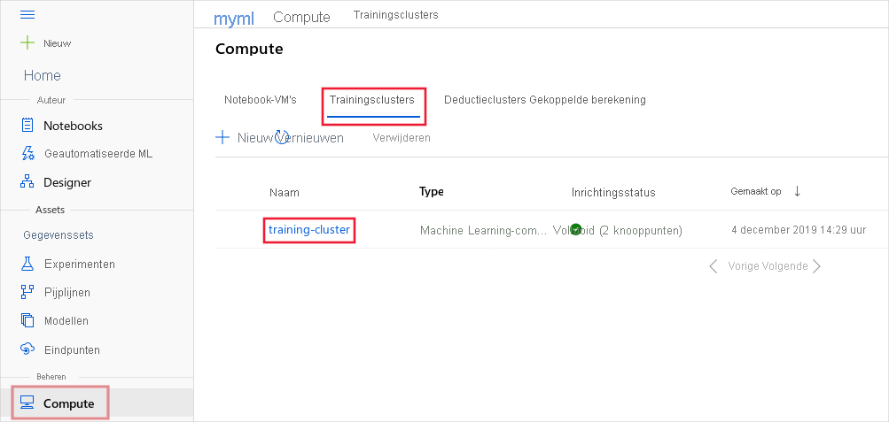

# <a name="monitor-azure-ml-experiment-runs-and-metrics"></a>Uitvoeringen en metrische gegevens van Azure ML-experimenten bewaken
[!INCLUDE [applies-to-skus](../../includes/aml-applies-to-basic-enterprise-sku.md)]

Verbeter het proces voor het maken van het model door de metrische gegevens voor experimenten en bewakings uitvoeringen bij te houden. In dit artikel leert u hoe u logboek registratie code kunt toevoegen aan uw trainings script, een experiment moet verzenden, de uitvoering ervan kunt controleren en de resultaten kunt controleren in Azure Machine Learning.

> [!NOTE]
> Azure Machine Learning kunnen ook gegevens van andere bronnen tijdens de training registreren, zoals geautomatiseerde machine learning uitvoeringen, of de docker-container die de trainings taak uitvoert. Deze logboeken worden niet gedocumenteerd. Als u problemen ondervindt en contact opneemt met micro soft ondersteuning, kunnen ze deze logboeken gebruiken tijdens het oplossen van problemen.

> [!TIP]
> De informatie in dit document is voornamelijk bedoeld voor gegevens wetenschappers en ontwikkel aars die het model trainings proces willen bewaken. Als u een beheerder bent die geïnteresseerd is in het bewaken van het resource gebruik en gebeurtenissen van Azure machine learning, zoals quota's, voltooide trainings uitvoeringen of voltooide model implementaties, raadpleegt u [bewaking Azure machine learning](monitor-azure-machine-learning.md).

## <a name="available-metrics-to-track"></a>Beschik bare metrische gegevens om bij te houden

De volgende metrische gegevens kunnen worden toegevoegd aan een run tijdens het trainen van een experiment. Zie de [referentie documentatie](https://docs.microsoft.com/python/api/azureml-core/azureml.core.run(class)?view=azure-ml-py)voor het uitvoeren van klassen voor een gedetailleerde lijst met wat er kan worden gevolgd bij een uitvoering.

|Type| Python-functie | Opmerkingen|
|----|:----|:----|
|Scalaire waarden |Functieassembly<br>`run.log(name, value, description='')`<br><br>Voorbeeld:<br>run. log ("nauw keurig", 0,95) |Registreer een numerieke of teken reeks waarde voor de uitvoering met de opgegeven naam. Als u een metriek registreert voor een run, wordt de metrische waarde opgeslagen in het rapport uitvoeren in het experiment.  U kunt dezelfde metrische gegevens meerdere keren in een uitvoering registreren. het resultaat wordt gezien als een vector van die metriek.|
|Lijsten|Functieassembly<br>`run.log_list(name, value, description='')`<br><br>Voorbeeld:<br>run. log_list ("keurigheden", [0,6, 0,7, 0,87]) | Een lijst met waarden vastleggen voor de uitvoering met de opgegeven naam.|
|Rij|Functieassembly<br>`run.log_row(name, description=None, **kwargs)`<br>Voorbeeld:<br>run. log_row ("Y over X", X = 1, Y = 0,4) | Met *log_row* maakt u een metriek met meerdere kolommen zoals beschreven in kwargs. Elke benoemde para meter genereert een kolom met de opgegeven waarde.  *log_row* kan eenmaal worden aangeroepen om een wille keurige tupel of meerdere keren in een lus te registreren om een volledige tabel te genereren.|
|Tabel|Functieassembly<br>`run.log_table(name, value, description='')`<br><br>Voorbeeld:<br>run. log_table ("Y over X", {"X": [1, 2, 3], "Y": [0,6, 0,7, 0,89]}) | Een Dictionary-object in een logboek vastleggen voor de uitvoering met de opgegeven naam. |
|Installatiekopieën|Functieassembly<br>`run.log_image(name, path=None, plot=None)`<br><br>Voorbeeld:<br>`run.log_image("ROC", plot=plt)` | Een installatie kopie vastleggen in het rapport uitvoeren. Gebruik log_image om een te registreren. PNG-afbeeldings bestand of een matplotlib-grafiek naar de uitvoering.  Deze installatie kopieën worden weer gegeven en vergeleken in de run-record.|
|Een uitvoering labelen|Functieassembly<br>`run.tag(key, value=None)`<br><br>Voorbeeld:<br>run. tag ("geselecteerd", "ja") | Label de run met een teken reeks sleutel en een optionele teken reeks waarde.|
|Bestand of map uploaden|Functieassembly<br>`run.upload_file(name, path_or_stream)`<br> <br> Voorbeeld:<br>run. upload_file (' best_model. PKL ', './model.PKL ') | Upload een bestand naar het run-record. Voert automatisch een capture-bestand uit in de opgegeven uitvoermap, die standaard wordt ingesteld op './outputs ' voor de meeste typen uitvoering.  Gebruik upload_file alleen als er extra bestanden moeten worden geüpload of als er geen uitvoermap is opgegeven. We raden `outputs` aan de naam toe te voegen, zodat deze wordt geüpload naar de uitvoer Directory. U kunt alle bestanden weer geven die zijn gekoppeld aan deze run-record door te noemen`run.get_file_names()`|

> [!NOTE]
> Metrische gegevens voor scalaire waarden, lijsten, rijen en tabellen kunnen type: float, integer of string hebben.

## <a name="choose-a-logging-option"></a>Kies een optie voor logboek registratie

Als u uw experiment wilt bijhouden of controleren, moet u code toevoegen om logboek registratie te starten wanneer u de uitvoering verzendt. Hier volgen enkele manieren om het indienen van de uitvoering te activeren:
* __Run. start_logging__ : Hiermee kunt u logboek registratie functies toevoegen aan uw trainings script en een interactieve logboek registratie sessie starten in het opgegeven experiment. **start_logging** maakt een interactieve uitvoering voor gebruik in scenario's zoals notebooks. Alle metrische gegevens die tijdens de sessie zijn geregistreerd, worden toegevoegd aan de run-record in het experiment.
* __ScriptRunConfig__ : Voeg logboek registratie functies toe aan uw trainings script en laad de volledige map met de uitvoering.  **ScriptRunConfig** is een klasse voor het instellen van configuraties voor script uitvoeringen. Met deze optie kunt u een bewakings code toevoegen om op de hoogte te worden gesteld, of om een visuele widget te laten bewaken.
* __Ontwerper logboek registratie__ : Hiermee kunt u logboek registratie functies toevoegen aan een ontwerp pijplijn met slepen &-neerzetten met behulp van de script module voor het __uitvoeren van python__ . Voeg python-code toe aan log Designer experimenten. 

## <a name="set-up-the-workspace"></a>De werk ruimte instellen
Voordat u logboek registratie toevoegt en een experiment verzendt, moet u de werk ruimte instellen.

1. Laad de werk ruimte. Zie [werkruimte configuratie bestand](how-to-configure-environment.md#workspace)voor meer informatie over het instellen van de configuratie van de werk ruimte.

[! notebook-python [] (~/MachineLearningNotebooks/how-to-use-azureml/training/train-within-notebook/train-within-notebook.ipynb? name = load_ws)]


## <a name="option-1-use-start_logging"></a>Optie 1: start_logging gebruiken

**start_logging** maakt een interactieve uitvoering voor gebruik in scenario's zoals notebooks. Alle metrische gegevens die tijdens de sessie zijn geregistreerd, worden toegevoegd aan de run-record in het experiment.

In het volgende voor beeld wordt een eenvoudig gesklearne Ploois model lokaal in een lokale Jupyter-notebook getraind. Zie [Compute-doelen voor model training instellen met Azure machine learning](https://docs.microsoft.com/azure/machine-learning/how-to-set-up-training-targets)voor meer informatie over het verzenden van experimenten voor verschillende omgevingen.

### <a name="load-the-data"></a>De gegevens laden

In dit voor beeld wordt de diabetes-gegevensset gebruikt, een bekende kleine gegevensset die wordt geleverd met scikit-learn. In deze cel wordt de gegevensset geladen en gesplitst in wille keurige trainings-en test sets.

[! notebook-python [] (~/MachineLearningNotebooks/how-to-use-azureml/training/train-within-notebook/train-within-notebook.ipynb? name = load_data)]

### <a name="add-tracking"></a>Tracking toevoegen
Voeg experiment tracking toe met behulp van de Azure Machine Learning SDK en upload een persistent model in de record experiment run. Met de volgende code worden tags, logboeken en uploads van een model bestand naar de uitvoering van het experiment toegevoegd.

[! notebook-python [] (~/MachineLearningNotebooks/how-to-use-azureml/training/train-within-notebook/train-within-notebook.ipynb? name = create_experiment)]

Het script eindigt op ```run.complete()``` , wat aangeeft dat de uitvoering is voltooid.  Deze functie wordt doorgaans gebruikt in scenario's met interactieve laptops.

## <a name="option-2-use-scriptrunconfig"></a>Optie 2: gebruik ScriptRunConfig

[**ScriptRunConfig**](https://docs.microsoft.com/python/api/azureml-core/azureml.core.scriptrunconfig?view=azure-ml-py) is een klasse voor het instellen van configuraties voor script uitvoeringen. Met deze optie kunt u een bewakings code toevoegen om op de hoogte te worden gesteld, of om een visuele widget te laten bewaken.

In dit voor beeld wordt het sklearn-model van de bovenstaande basis uitgebreid. Het biedt een eenvoudige parameter opruiming voor het opruimen van de alfa waarden van het model voor het vastleggen van metrische gegevens en getrainde modellen in uitvoeringen onder het experiment. Het voor beeld wordt lokaal uitgevoerd op een door de gebruiker beheerde omgeving. 

1. Een trainings script maken `train.py` .

   [! code-python [] (~/MachineLearningNotebooks/how-to-use-azureml/training/train-on-local/train.py)]

2. De `train.py` script verwijzingen `mylib.py` waarmee u de lijst met alfa waarden kunt ophalen voor gebruik in het ploois model.

   [! code-python [] (~/MachineLearningNotebooks/how-to-use-azureml/training/train-on-local/mylib.py)] 

3. Configureer een door de gebruiker beheerde lokale omgeving.

   [! notebook-python [] (~/MachineLearningNotebooks/how-to-use-azureml/training/train-on-local/train-on-local.ipynb? name = user_managed_env)]


4. Verzend het ```train.py``` script om uit te voeren in de door de gebruiker beheerde omgeving. Deze hele script-map wordt verzonden voor training, inclusief het ```mylib.py``` bestand.

   [! notebook-python [] (~/MachineLearningNotebooks/how-to-use-azureml/training/train-on-local/train-on-local.ipynb? name = src)] [! notebook-python [] (~/MachineLearningNotebooks/how-to-use-azureml/training/train-on-local/train-on-local.ipynb? name = run)]

## <a name="option-3-log-designer-experiments"></a>Optie 3: experimenten voor log Designer

Gebruik de __script module python uitvoeren__ om logboek registratie logica toe te voegen aan uw ontwerp experimenten. U kunt elke wille keurige waarde in een logboek vastleggen met behulp van deze werk stroom, maar dit is vooral handig voor het vastleggen van metrische gegevens uit de module __Evaluate model__ om de model prestaties in verschillende uitvoeringen te volgen

1. Verbind een script module voor het __uitvoeren van python__ met de uitvoer van de module __Evaluate model__ .

    

1. Plak de volgende code in de script code-editor voor __python uitvoeren__ om de gemiddelde absolute fout voor uw getrainde model te registreren:

    ```python
    # dataframe1 contains the values from Evaluate Model
    def azureml_main(dataframe1 = None, dataframe2 = None):
        print(f'Input pandas.DataFrame #1: {dataframe1}')

        from azureml.core import Run

        run = Run.get_context()

        # Log the mean absolute error to the current run to see the metric in the module detail pane.
        run.log(name='Mean_Absolute_Error', value=dataframe1['Mean_Absolute_Error'])

        # Log the mean absolute error to the parent run to see the metric in the run details page.
        run.parent.log(name='Mean_Absolute_Error', value=dataframe1['Mean_Absolute_Error'])
    
        return dataframe1,
    ```

## <a name="manage-a-run"></a>Een uitvoering beheren

In het [Start-, controle-en annulerings artikel over training worden](how-to-manage-runs.md) specifieke Azure machine learning werk stromen gemarkeerd voor het beheren van uw experimenten.

## <a name="view-run-details"></a>Details van uitvoering weer geven

### <a name="view-activequeued-runs-from-the-browser"></a>Actieve/in wachtrij geplaatste uitvoeringen weer geven vanuit de browser

Reken doelen voor het trainen van modellen zijn een gedeelde bron. Ze kunnen op een bepaald moment meerdere uitvoeringen in de wachtrij plaatsen of actief zijn. Voer de volgende stappen uit om de uitvoeringen voor een specifiek Compute-doel in uw browser weer te geven:

1. Selecteer in de [Azure machine learning Studio](https://ml.azure.com/)uw werk ruimte en selecteer vervolgens __Compute__ in de linkerkant van de pagina.

1. Selecteer __trainings clusters__ om een lijst weer te geven met reken doelen die worden gebruikt voor de training. Selecteer vervolgens het cluster.

    

1. Selecteer __uitvoeren__. De lijst met uitvoeringen die gebruikmaken van dit cluster wordt weer gegeven. Als u Details voor een specifieke uitvoering wilt weer geven, gebruikt u de koppeling in de kolom __uitvoeren__ . Als u Details voor het experiment wilt weer geven, gebruikt u de koppeling in de kolom __experiment__ .

    
    
    > [!TIP]
    > Een run kan onderliggende uitvoeringen bevatten, waardoor één trainings taak kan leiden tot meerdere vermeldingen.

Zodra een uitvoering is voltooid, wordt deze niet meer weer gegeven op deze pagina. Als u informatie over voltooide uitvoeringen wilt bekijken, gaat u naar de sectie __experimenten__ van Studio en selecteert u het experiment en voert u uit. Zie de sectie [metrische gegevens over query's uitvoeren](#queryrunmetrics) voor meer informatie.

### <a name="monitor-run-with-jupyter-notebook-widget"></a>Bewaking uitvoeren met Jupyter notebook-widget
Wanneer u de methode **ScriptRunConfig** gebruikt om uitvoeringen te verzenden, kunt u de voortgang van de uitvoering met een [Jupyter-widget](https://docs.microsoft.com/python/api/azureml-widgets/azureml.widgets?view=azure-ml-py)bekijken. Net als het indienen van de run, is de widget asynchroon en biedt deze elke 10-15 seconden live updates totdat de taak is voltooid.

1. Bekijk de widget Jupyter tijdens het wachten tot de uitvoering is voltooid.

   ```python
   from azureml.widgets import RunDetails
   RunDetails(run).show()
   ```

   

   U kunt ook een koppeling naar dezelfde weer gave in uw werk ruimte ophalen.

   ```python
   print(run.get_portal_url())
   ```

2. **[Voor automatische machine learning uitvoeringen]** Om toegang te krijgen tot de grafieken van een vorige uitvoering. Vervang door `<<experiment_name>>` de juiste naam van het experiment:

   ``` 
   from azureml.widgets import RunDetails
   from azureml.core.run import Run

   experiment = Experiment (workspace, <<experiment_name>>)
   run_id = 'autoML_my_runID' #replace with run_ID
   run = Run(experiment, run_id)
   RunDetails(run).show()
   ```

   


Als u meer details van een pijp lijn wilt weer geven, klikt u op de pijp lijn die u in de tabel wilt verkennen. de grafieken worden weer gegeven in een pop-up van de Azure Machine Learning Studio.

### <a name="get-log-results-upon-completion"></a>Resultaten van logboeken weergeven bij voltooiing

Model training en-bewaking vindt plaats op de achtergrond, zodat u andere taken kunt uitvoeren terwijl u wacht. U kunt ook wachten tot het model training heeft voltooid voordat u meer code uitvoert. Wanneer u **ScriptRunConfig**gebruikt, kunt u gebruiken ```run.wait_for_completion(show_output = True)``` om weer te geven wanneer de model training is voltooid. De ```show_output``` vlag geeft u uitgebreide uitvoer. 

<a id="queryrunmetrics"></a>

### <a name="query-run-metrics"></a>Metrische gegevens van query uitvoeren

U kunt de metrische gegevens van een getraind model weer geven met behulp van ```run.get_metrics()``` . U kunt nu alle metrische gegevens ophalen die zijn vastgelegd in bovenstaand voor beeld om het beste model te bepalen.

<a name="view-the-experiment-in-the-web-portal"></a>
## <a name="view-the-experiment-in-your-workspace-in-azure-machine-learning-studio"></a>Het experiment in uw werk ruimte in [Azure machine learning Studio](https://ml.azure.com) weer geven

Wanneer een experiment is uitgevoerd, kunt u bladeren naar de record voor het uitvoeren van opgenomen experimenten. U kunt de geschiedenis openen vanuit de [Azure machine learning Studio](https://ml.azure.com).

Ga naar het tabblad experimenten en selecteer uw experiment. U wordt naar het dash board voor experimenteren geleid, waar u bijgehouden metrische gegevens en grafieken kunt zien die voor elke uitvoering worden vastgelegd. In dit geval hebben we de MSE en de alpha-waarden geregistreerd.

  

U kunt inzoomen op een specifieke uitvoering om de uitvoer of logboeken weer te geven of de moment opname te downloaden van het experiment dat u hebt verzonden, zodat u de map experiment met anderen kunt delen.

### <a name="viewing-charts-in-run-details"></a>Grafieken weer geven in details van uitvoering

Er zijn verschillende manieren om de logboek registratie-Api's te gebruiken voor het vastleggen van verschillende soorten metrische gegevens tijdens een uitvoering en om ze weer te geven als grafieken in Azure Machine Learning Studio.

|Geregistreerde waarde|Voorbeeldcode| Weer geven in de portal|
|----|----|----|
|Een matrix met numerieke waarden vastleggen in een logboek| `run.log_list(name='Fibonacci', value=[0, 1, 1, 2, 3, 5, 8, 13, 21, 34, 55, 89])`|lijn diagram met één variabele|
|Een enkele numerieke waarde met dezelfde metrische naam in het logboek vastleggen, herhaaldelijk gebruikt (bijvoorbeeld van binnen een for-lus)| `for i in tqdm(range(-10, 10)):    run.log(name='Sigmoid', value=1 / (1 + np.exp(-i))) angle = i / 2.0`| Lijn diagram met één variabele|
|Een rij met 2 numerieke kolommen herhaaldelijk vastleggen|`run.log_row(name='Cosine Wave', angle=angle, cos=np.cos(angle))   sines['angle'].append(angle)      sines['sine'].append(np.sin(angle))`|Lijn diagram met twee variabelen|
|Logboek tabel met 2 numerieke kolommen|`run.log_table(name='Sine Wave', value=sines)`|Lijn diagram met twee variabelen|


## <a name="example-notebooks"></a>Voorbeeld notitieblokken
In de volgende notitie blokken worden concepten in dit artikel gedemonstreerd:
* [instructies-to-use-azureml/training/training-binnen-notebook](https://github.com/Azure/MachineLearningNotebooks/blob/master/how-to-use-azureml/training/train-within-notebook)
* [instructies-to-use-azureml/training/trein-on-Local](https://github.com/Azure/MachineLearningNotebooks/blob/master/how-to-use-azureml/training/train-on-local)
* [instructies voor het gebruik van azureml/track-and-monitor-experimenten/logging-API](https://github.com/Azure/MachineLearningNotebooks/blob/master/how-to-use-azureml/track-and-monitor-experiments/logging-api)

[!INCLUDE [aml-clone-in-azure-notebook](../../includes/aml-clone-for-examples.md)]

## <a name="next-steps"></a>Volgende stappen

Doe het volgende om te leren hoe u de Azure Machine Learning-SDK voor Python kunt gebruiken:

* Bekijk een voor beeld van hoe u het beste model registreert en implementeert in de zelf studie, [een classificatie model voor installatie kopieën traint met Azure machine learning](tutorial-train-models-with-aml.md).

* Meer informatie over het [trainen van PyTorch-modellen met Azure machine learning](how-to-train-pytorch.md).
