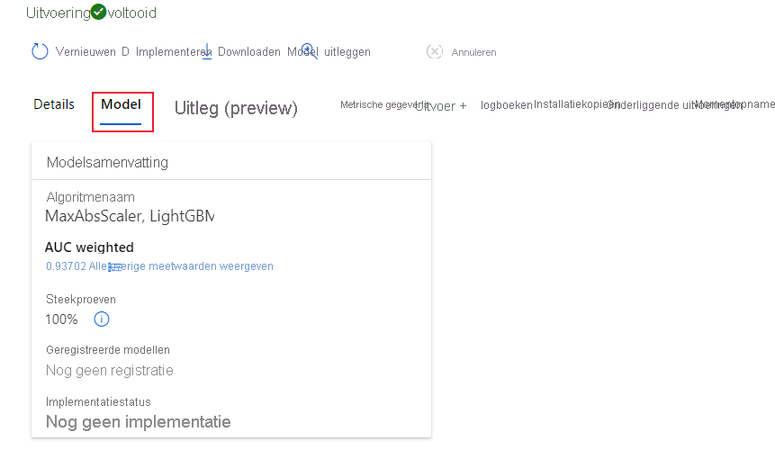

# <a name="create-review-and-deploy-automated-machine-learning-models-with-azure-machine-learning"></a>Geautomatiseerde machine learning-modellen maken, controleren en implementeren met Azure Machine Learning
[!INCLUDE [applies-to-skus](../../includes/aml-applies-to-enterprise-sku.md)]

In dit artikel leert u hoe u geautomatiseerde machine learning-modellen maken, verkennen en implementeren zonder één regel code in de studio-interface van Azure Machine Learning. Geautomatiseerde machine learning is een proces waarbij het beste machine learning-algoritme voor uw specifieke gegevens voor u wordt geselecteerd. Dit proces stelt u in staat om snel machine learning-modellen te genereren. [Meer informatie over geautomatiseerde machine learning](concept-automated-ml.md).
 
Probeer bijvoorbeeld de [zelfstudie voor het maken van een classificatiemodel met de geautomatiseerde ML-interface van Azure Machine Learning.](tutorial-first-experiment-automated-ml.md) 

Voor een op Python-code gebaseerde ervaring [configureert u uw geautomatiseerde machine learning-experimenten](how-to-configure-auto-train.md) met de Azure Machine Learning SDK.

## <a name="prerequisites"></a>Vereisten

* Een Azure-abonnement. Als u geen Azure-abonnement hebt, maakt u een gratis account voordat u begint. Probeer vandaag nog de [gratis of betaalde versie van Azure Machine Learning.](https://aka.ms/AMLFree)

* Een Azure Machine Learning-werkruimte met een type **Enterprise-editie**. Zie [Een Azure Machine Learning-werkruimte maken](how-to-manage-workspace.md).  Zie Upgraden naar [Enterprise-editie als](how-to-manage-workspace.md#upgrade)u een bestaande werkruimte wilt upgraden naar Enterprise-editie.

## <a name="get-started"></a>Aan de slag

1. Meld u aan bij https://ml.azure.comAzure Machine Learning op . 

1. Selecteer uw abonnement en werkruimte. 

1. Navigeer naar het linkerdeelvenster. Selecteer **Geautomatiseerde ML** onder de sectie **Auteur.**

[](media/how-to-use-automated-ml-for-ml-models/nav-pane-expanded.png)

 Als dit de eerste keer is dat u experimenten doet, ziet u een lege lijst en koppelingen naar documentatie. 

Anders ziet u een lijst met uw recente geautomatiseerde machine learning-experimenten, inclusief experimenten die zijn gemaakt met de SDK. 

## <a name="create-and-run-experiment"></a>Experiment maken en uitvoeren

1. Selecteer **+ Nieuwe geautomatiseerde ML-run** en vul het formulier in.

1. Selecteer een gegevensset uit uw opslagcontainer of maak een nieuwe gegevensset. Gegevenssets kunnen worden gemaakt op lokale bestanden, weburls, datastores of Azure open datasets. 

    >[!Important]
    > Vereisten voor opleidingsgegevens:
    >* De gegevens moeten in tabelvorm zijn.
    >* De waarde die u wilt voorspellen (doelkolom) moet aanwezig zijn in de gegevens.

    1. Als u een nieuwe gegevensset wilt maken vanuit een bestand op uw lokale computer, selecteert u **Bladeren** en selecteert u het bestand. 

    1. Geef uw gegevensset een unieke naam en geef een optionele beschrijving. 

    1. Selecteer **Volgende** om het **gegevensarchief en het formulier voor bestandsselectie te openen**. Op dit formulier selecteert u waar u uw gegevensset wilt uploaden; de standaardopslagcontainer die automatisch met uw werkruimte wordt gemaakt of kies een opslagcontainer die u voor het experiment wilt gebruiken. 

    1. Controleer het **formulier Instellingen en voorbeeld** op nauwkeurigheid. Het formulier wordt intelligent ingevuld op basis van het bestandstype. 

        Veld| Beschrijving
        ----|----
        Bestandsindeling| Hiermee definieert u de indeling en het type gegevens dat in een bestand is opgeslagen.
        Scheidingsteken| Een of meer tekens voor het opgeven van de grens tussen afzonderlijke, onafhankelijke regio's in platte tekst of andere gegevensstromen.
        Encoding| Hiermee wordt aangegeven welke schematabel moet worden gebruikt om uw gegevensset te lezen.
        Kolomkoppen| Geeft aan hoe de eventuele kopteksten van de gegevensset worden behandeld.
        Rijen overslaan | Geeft aan hoeveel, indien van toepassing, rijen worden overgeslagen in de gegevensset.
    
        Selecteer **Volgende**.

    1. Het **schemaformulier** wordt op intelligente wijze ingevuld op basis van de selecties in het **formulier Instellingen en voorbeeld.** Configureer hier het gegevenstype voor elke kolom, controleer de kolomnamen en selecteer welke kolommen **niet moeten worden opgenomen** voor uw experiment. 
            
        Selecteer **Volgende.**

    1. Het formulier **Details bevestigen** is een overzicht van de informatie die eerder is ingevuld in de **basisgegevens** en **instellingen en voorbeeldformulieren.** U hebt ook de mogelijkheid om een gegevensprofiel voor uw gegevensset te maken met behulp van een profileringingeschakelde compute. Meer informatie over [gegevensprofilering](#profile).

        Selecteer **Volgende**.
1. Selecteer uw nieuw gemaakte gegevensset zodra deze wordt weergegeven. U ook een voorbeeld van de gegevensset- en voorbeeldstatistieken bekijken. 

1. Voer op **het runformulier configureren** een unieke experimentnaam in.

1. Selecteer een doelkolom; dit is de kolom waarop u voorspellingen wilt doen.

1. Selecteer een rekenkracht voor de taak voor gegevensprofilering en -training. Een lijst met uw bestaande gegevensberekent is beschikbaar in de vervolgkeuzelijst. Als u een nieuwe rekenkracht wilt maken, volgt u de instructies in stap 7.

1. Selecteer **Een nieuwe compute maken** om uw rekencontext voor dit experiment te configureren.

    Veld|Beschrijving
    ---|---
    Rekennaam| Voer een unieke naam in die uw rekencontext identificeert.
    Grootte van de virtuele machine| Selecteer de grootte van de virtuele machine voor uw computerberekening.
    Min / Max-knooppunten (in geavanceerde instellingen)| Als u gegevens wilt profileren, moet u 1 of meer knooppunten opgeven. Voer het maximum aantal knooppunten in voor uw berekening. De standaardinstelling is 6 knooppunten voor een AML Compute.
    
    Selecteer **Maken**. Het maken van een nieuwe rekenkracht kan enkele minuten duren.

    >[!NOTE]
    > Uw rekennaam geeft aan of de compute die u selecteert/maakt profilering is *ingeschakeld.* (Zie de sectie [gegevensprofilering](#profile) voor meer details).

    Selecteer **Volgende**.

1. Selecteer in het **taaktype en het instellingenformulier** het taaktype: classificatie, regressie of prognoses. Zie [hoe u taaktypen definieert](how-to-define-task-type.md) voor meer informatie.

    1. Voor classificatie u ook deep learning inschakelen die wordt gebruikt voor tekstprestaties.

    1. Voor prognoses:
        1. Tijdkolom selecteren: deze kolom bevat de tijdsgegevens die moeten worden gebruikt.

        1. Prognosehorizon selecteren: Geef aan hoeveel tijdeenheden (minuten/uren/dagen/weken/maanden/jaren) het model in staat zal zijn om de toekomst te voorspellen. Hoe verder het model nodig is om te voorspellen in de toekomst, hoe minder nauwkeurig het zal worden. [Meer informatie over de prognose- en prognosehorizon](how-to-auto-train-forecast.md).

1. (Optioneel) Configuratie-instellingen voor toevoegingweer: extra instellingen die u gebruiken om de trainingstaak beter te beheren. Anders worden standaardinstellingen toegepast op basis van experimentselectie en gegevens. 

    Aanvullende configuraties|Beschrijving
    ------|------
    Primaire statistiek| Hoofdstatistiek die wordt gebruikt voor het scoren van uw model. [Meer informatie over modelstatistieken](how-to-configure-auto-train.md#explore-model-metrics).
    Automatische featurisatie| Selecteer om de voorbewerking in of uit te schakelen die wordt uitgevoerd door geautomatiseerde machine learning. Voorverwerking omvat automatische gegevensreiniging, voorbereiding en transformatie om synthetische functies te genereren. Wordt niet ondersteund voor het taaktype tijdreeksen voor het voorspellen van de tijdreeksen. [Meer informatie over voorbewerking](#featurization). 
    Leg het beste model uit | Selecteren om de uitleg van het aanbevolen beste model in- of uit te schakelen om de uitleg te geven
    Geblokkeerd algoritme| Selecteer algoritmen die u wilt uitsluiten van de trainingstaak.
    Exitcriterium| Wanneer aan een van deze criteria is voldaan, wordt de trainingstaak gestopt. <br> *Opleidingstaaktijd (uren)*: Hoe lang duurt het om de trainingstaak te laten lopen. <br> *Metrische scoredrempel:* Minimale metrische score voor alle pijplijnen. Dit zorgt ervoor dat als u een gedefinieerde doelstatistiek hebt die u wilt bereiken, u niet meer tijd besteedt aan de trainingstaak dan nodig is.
    Validatie| Selecteer een van de opties voor crossvalidatie die u wilt gebruiken in de trainingstaak. [Meer informatie over crossvalidatie](how-to-configure-auto-train.md).
    Gelijktijdigheid| *Maximale gelijktijdige iteraties*: Maximaal aantal pijplijnen (iteraties) om te testen in de trainingstaak. De taak wordt niet meer uitgevoerd dan het opgegeven aantal iteraties.

1. (Optioneel) Featurization-instellingen weergeven: als u ervoor kiest **om automatische prestatie-inschatting** in te schakelen in het formulier **Extra configuratie-instellingen,** geeft u in dit formulier op welke kolommen u deze prestatieverbeteringen wilt uitvoeren en selecteert u welke statistische waarde u moet gebruiken voor ontbrekende waarde-toerekening.

<a name="profile"></a>

## <a name="data-profiling--summary-stats"></a>Gegevensprofilering & overzichtsstatistieken

U een groot aantal overzichtsstatistieken in uw gegevensset krijgen om te controleren of uw gegevensset klaar is voor ML. Voor niet-numerieke kolommen bevatten ze alleen basisstatistieken zoals min, max en fouttelling. Voor numerieke kolommen u ook hun statistische momenten en geschatte quantiles bekijken. Concreet omvat ons dataprofiel:

>[!NOTE]
> Lege vermeldingen worden weergegeven voor functies met irrelevante typen.

Statistiek|Beschrijving
------|------
Functie| Naam van de kolom die wordt samengevat.
Profiel| In-line visualisatie op basis van het type afgeleid. Tekenreeksen, booleaanse en datums hebben bijvoorbeeld waardetellingen, terwijl decimalen (numerieke waarden) bij benadering histogrammen hebben. Hierdoor krijgt u snel inzicht in de verdeling van de gegevens.
Typeverdeling| Aantal inlijnwaarden van typen in een kolom. Nulls zijn hun eigen type, dus deze visualisatie is handig voor het detecteren van oneven of ontbrekende waarden.
Type|Afgeleid type van de kolom. Mogelijke waarden zijn: tekenreeksen, booleaans, datums en decimalen.
Min.| Minimumwaarde van de kolom. Er worden lege vermeldingen weergegeven voor functies waarvan het type geen inherente volgorde heeft (bijvoorbeeld booleaans).
Max.| Maximale waarde van de kolom. 
Count| Totaal aantal ontbrekende en niet-ontbrekende vermeldingen in de kolom.
Niet-ontbrekend aantal| Aantal vermeldingen in de kolom die niet ontbreken. Lege tekenreeksen en fouten worden behandeld als waarden, zodat ze niet bijdragen aan de "niet ontbrekende telling."
Quantiles (Quantiles)| Geschatte waarden bij elke quantile om een gevoel van de verdeling van de gegevens te bieden.
Gemiddelde| Rekenkundig gemiddelde of gemiddelde van de kolom.
Standaardafwijking| Meten van de hoeveelheid dispersie of variatie van de gegevens van deze kolom.
Variantie| Meten hoe ver de gegevens van deze kolom zijn verspreid, is van de gemiddelde waarde. 
Asymmetrie| Meten hoe verschillend de gegevens van deze kolom zijn van een normale verdeling.
Kurtosis| Meten hoe zwaar de gegevens van deze kolom worden gevolgd, vergeleken met een normale verdeling.


<a name="featurization"></a>

## <a name="advanced-featurization-options"></a>Geavanceerde featurisatie-opties

Geautomatiseerde machine learning biedt voorbewerking en gegevensvangrails automatisch, om u te helpen potentiële problemen met uw gegevens te identificeren en te beheren. 

### <a name="preprocessing"></a>Preprocessing

|Voorbewerkingsstappen&nbsp;| Beschrijving |
| ------------- | ------------- |
|Hoge kardinaliteit of geen variantiefuncties laten vallen|Laat deze vallen uit trainings- en validatiesets, inclusief functies met alle ontbrekende waarden, dezelfde waarde in alle rijen of met extreem hoge kardinaliteit (bijvoorbeeld hashes,-iD's of GUIDs).|
|Ontbrekende waarden aanklagen|Voor numerieke kenmerken, aanteschrijven met het gemiddelde van de waarden in de kolom.<br/><br/>Voor categorische functies, impute met de meest voorkomende waarde.|
|Extra functies genereren|Voor DateTime-functies: jaar, maand, dag, dag van de week, dag van het jaar, kwartaal, week van het jaar, uur, minuut, seconde.<br/><br/>Voor tekstfuncties: Term frequentie op basis van unigrammen, bi-grams en tri-character-grams.|
|Transformeren en coderen |Numerieke functies met weinig unieke waarden worden omgezet in categorische functies.<br/><br/>One-hot codering wordt uitgevoerd voor lage kardinaliteit categorisch; voor hoge kardinaliteit, one-hot-hash codering.|
|Ingesloten voor Word|Text featurizer die vectoren van teksttokens omzet in zinsvectoren met behulp van een vooraf opgeleid model. De insluitingsvector van elk woord in een document wordt samengevoegd om een vector voor documentfunctie te produceren.|
|Doelcoderingen|Voor categorische functies brengt u elke categorie met een gemiddelde doelwaarde in kaart voor regressieproblemen en aan de klassewaarschijnlijkheid voor elke klasse voor classificatieproblemen. Frequentiegebaseerde weging en k-fold cross validatie wordt toegepast om de montage van de mapping en ruis veroorzaakt door schaarse gegevenscategorieën te verminderen.|
|Codering van tekstdoel|Voor tekstinvoer wordt een gestapeld lineair model met zak van woorden gebruikt om de waarschijnlijkheid van elke klasse te genereren.|
|Gewicht van bewijs (WoE)|Berekent WoE als een maat voor de correlatie van categorische kolommen met de doelkolom. Het wordt berekend als het logboek van de verhouding van in-klasse versus out-of-class waarschijnlijkheden. Met deze stap wordt één numerieke functiekolom per klasse uitgevoerd en wordt de noodzaak verwijderd om ontbrekende waarden en uitschieters expliciet toe te wijzen.|
|Clusterafstand|Traint een k-means clustering model op alle numerieke kolommen.  Uitgangen k nieuwe functies, een nieuwe numerieke functie per cluster, met de afstand van elk monster tot de centroid van elk cluster.|

### <a name="data-guardrails"></a>Gegevensvangrails

Gegevensvangrails worden toegepast wanneer automatische prestatie-in-om-uurs validatie is ingeschakeld of validatie is ingesteld op automatisch. Gegevensvangrails helpen u potentiële problemen met uw gegevens te identificeren (bijvoorbeeld ontbrekende waarden, onbalans in de klasse) en helpen corrigerende maatregelen te nemen voor betere resultaten. Er zijn veel best practices die beschikbaar zijn en kunnen worden toegepast om betrouwbare resultaten te bereiken. Gebruikers kunnen gegevensvangrails in de studio bekijken op het tabblad **Gegevensvangrails** van een geautomatiseerde ML-run of door in te stellen ```show_output=True``` bij het indienen van een experiment met de Python SDK. In de volgende tabel worden de gegevensvangrails beschreven die momenteel worden ondersteund en de bijbehorende statussen die gebruikers kunnen tegenkomen bij het indienen van hun experiment.

Vangrail|Status|Voorwaarde&nbsp;&nbsp;voor trigger
---|---|---
Toerekening ontbrekende functiewaarden |**Doorgegeven** <br><br><br> **Gereed**| Er zijn geen ontbrekende functiewaarden gedetecteerd in uw trainingsgegevens. Meer informatie over [ontbrekende waardetoerekening.](https://docs.microsoft.com/azure/machine-learning/how-to-use-automated-ml-for-ml-models#advanced-featurization-options) <br><br> Ontbrekende functiewaarden zijn gedetecteerd in uw trainingsgegevens en toegerekend.
Hoge kardinaliteit feature handling |**Doorgegeven** <br><br><br> **Gereed**| Uw ingangen werden geanalyseerd, en geen hoge kardinaliteit functies werden gedetecteerd. Meer informatie over detectie van functies met [hoge kardinaliteit.](https://docs.microsoft.com/azure/machine-learning/how-to-use-automated-ml-for-ml-models#advanced-featurization-options) <br><br> Hoge kardinaliteit functies werden gedetecteerd in uw ingangen en werden behandeld.
Verwerking van gesplitste validatie |**Gereed**| *De validatieconfiguratie is ingesteld op 'automatisch' en de trainingsgegevens bevatten **minder** dan 20.000 rijen.* <br> Elke iteratie van het getrainde model werd gevalideerd door middel van cross-validatie. Meer informatie over [validatiegegevens.](https://docs.microsoft.com/azure/machine-learning/how-to-configure-auto-train#train-and-validation-data) <br><br> *De validatieconfiguratie is ingesteld op 'automatisch' en de trainingsgegevens bevatten **meer** dan 20.000 rijen.* <br> De invoergegevens zijn opgesplitst in een trainingsgegevensset en een validatiegegevensset voor validatie van het model.
Detectie van klassebalancering |**Doorgegeven** <br><br><br><br> **Gewaarschuwd** | Uw ingangen zijn geanalyseerd en alle klassen zijn in evenwicht in uw trainingsgegevens. Een gegevensset wordt als evenwichtig beschouwd als elke klasse een goede weergave heeft in de gegevensset, gemeten naar aantal en verhouding van de monsters. <br><br><br> Onevenwichtige klassen werden gedetecteerd in uw ingangen. Om modelbias op te lossen, u het evenwichtsprobleem oplossen. Meer informatie over [onevenwichtige gegevens.](https://docs.microsoft.com/azure/machine-learning/concept-automated-ml#imbalance)
Detectie van geheugenproblemen |**Doorgegeven** <br><br><br><br> **Gereed** |<br> De geselecteerde waarde {horizon, lag, rolling window} is geanalyseerd en er zijn geen potentiële problemen met het geheugen gedetecteerd. Meer informatie over [tijdreeksprognoseconfiguraties.](https://docs.microsoft.com/azure/machine-learning/how-to-auto-train-forecast#configure-and-run-experiment) <br><br><br>De geselecteerde waarden {horizon, lag, rolling window} zijn geanalyseerd en kunnen ervoor zorgen dat uw experiment zonder geheugen komt te zitten. De configuratie van het vertragings- of rolvenster is uitgeschakeld.
Frequentiedetectie |**Doorgegeven** <br><br><br><br> **Gereed** |<br> De tijdreeksen zijn geanalyseerd en alle gegevenspunten zijn afgestemd op de gedetecteerde frequentie. <br> <br> De tijdreekswerd geanalyseerd en gegevenspunten die niet overeenkomen met de gedetecteerde frequentie werden gedetecteerd. Deze gegevenspunten zijn uit de gegevensset verwijderd. Meer informatie over [gegevensvoorbereiding voor tijdreeksprognoses.](https://docs.microsoft.com/azure/machine-learning/how-to-auto-train-forecast#preparing-data)

#### <a name="data-guardrail-states"></a>Gegevens vangrail staten
Gegevensvangrails worden weergegeven in een van de drie staten: 'Geslaagd', 'Gereed of 'Gewaarschuwd'.

Status| Beschrijving
----|----
Doorgegeven| Er zijn geen gegevensproblemen gedetecteerd en er is geen actie van de gebruiker vereist. 
Gereed| Er zijn wijzigingen toegepast in uw gegevens. We raden gebruikers aan om de corrigerende maatregelen te bekijken die Automated ML heeft genomen om ervoor te zorgen dat de wijzigingen overeenkomen met de verwachte resultaten. 
Gewaarschuwd| Er is een gegevensprobleem gedetecteerd dat niet kon worden verholpen. We raden gebruikers aan om het probleem te herzien en op te lossen. 

Vorige versie van de Automated ML weergegeven een vierde staat: 'Opgelost'. Nieuwere experimenten zullen deze toestand niet weergeven en alle vangrails die de status 'Vast' weergeven, worden nu 'Klaar' weergegeven.   

## <a name="run-experiment-and-view-results"></a>Experiment uitvoeren en resultaten weergeven

Selecteer **Voltooien** om uw experiment uit te voeren. Het voorbereiden van het experiment kan tot 10 minuten duren. Trainingstaken kunnen nog 2-3 minuten meer kosten voordat het uitvoeren van elke pijplijn is voltooid.

### <a name="view-experiment-details"></a>Experimentgegevens bekijken

Het scherm **Detail uitvoeren** wordt geopend naar het tabblad **Details.** In dit scherm ziet u een overzicht van de experimentrun, inclusief een statusbalk bovenaan naast het run-nummer. 

Het tabblad **Modellen** bevat een lijst met de gemaakte modellen, op volgorde van de metrische score. Standaardstaat het model dat het hoogst scoort op basis van het gekozen metrische gegeven bovenaan de lijst. Terwijl de trainingstaak meer modellen uitprobeert, worden deze toegevoegd aan de lijst. Gebruik dit om een snelle vergelijking te krijgen van de metrische gegevens voor de tot dusver geproduceerde modellen.

[](media/how-to-use-automated-ml-for-ml-models/run-details-expanded.png#lightbox)

### <a name="view-training-run-details"></a>Details van de trainingsrun weergeven

Inzoomen op een van de voltooide modellen om trainingsuitvoeringsgegevens te bekijken, zoals het uitvoeren van statistieken op het tabblad **Modeldetails** of prestatiegrafieken op het tabblad **Visualisaties.** [Meer informatie over grafieken](how-to-understand-automated-ml.md).

[](media/how-to-use-automated-ml-for-ml-models/iteration-details-expanded.png)

## <a name="deploy-your-model"></a>Uw model implementeren

Zodra u het beste model bij de hand hebt, is het tijd om het te implementeren als een webservice om te voorspellen op nieuwe gegevens.

Geautomatiseerde ML helpt u bij het implementeren van het model zonder code te schrijven:

1. Je hebt een paar opties voor implementatie. 

    + Optie 1: Als u het beste model wilt implementeren (op basis van de metrische criteria die u hebt gedefinieerd), selecteert u de knop **Beste model implementeren** op het tabblad **Details.**

    + Optie 2: Als u een specifieke modeliteratie uit dit experiment wilt implementeren, zoomt u in op het model om het tabblad **Modeldetails** te openen en het **model implementeren te**selecteren.

1. Vul het **deelvenster Model implementeren** in.

    Veld| Waarde
    ----|----
    Name| Voer een unieke naam in voor uw implementatie.
    Beschrijving| Voer een beschrijving in om beter te kunnen identificeren waar deze implementatie voor is.
    Rekentype| Selecteer het type eindpunt dat u wilt implementeren: *Azure Kubernetes Service (AKS)* of *Azure Container Instance (ACI).*
    Rekennaam| *Geldt alleen voor AKS:* Selecteer de naam van het AKS-cluster dat u wilt implementeren.
    Verificatie inschakelen | Selecteer om tokengebaseerde of op sleutels gebaseerde verificatie toe te staan.
    Aangepaste implementatiemiddelen gebruiken| Schakel deze functie in als u uw eigen scorescript en omgevingsbestand wilt uploaden. [Meer informatie over het scoren van scripts](how-to-deploy-and-where.md#script).

    >[!Important]
    > Bestandsnamen moeten onder 32 tekens staan en moeten beginnen en eindigen met alfanumerieke waarden. Kan streepjes, underscores, stippen en alfanumerieke waarden tussen. Spaties zijn niet toegestaan.

    Het *geavanceerde* menu biedt standaardimplementatiefuncties, zoals [instellingen voor gegevensverzameling](how-to-enable-app-insights.md) en resourcegebruik. Als u deze standaardinstellingen wilt overschrijven, doet u dit in dit menu.

1. Selecteer **Implementeren**. Implementatie kan ongeveer 20 minuten in beslag nemen.

Nu heb je een operationele webservice om voorspellingen te genereren! U de voorspellingen testen door de service op te vragen via de [ingebouwde Azure Machine Learning-ondersteuning](how-to-consume-web-service.md#consume-the-service-from-power-bi)van Power BI.

## <a name="next-steps"></a>Volgende stappen

* [Meer informatie over het gebruik van een webservice](https://docs.microsoft.com/azure/machine-learning/how-to-consume-web-service).
* [Begrijp geautomatiseerde machine learning-resultaten](how-to-understand-automated-ml.md).
* [Meer informatie over geautomatiseerde machine learning](concept-automated-ml.md) en Azure Machine Learning.
