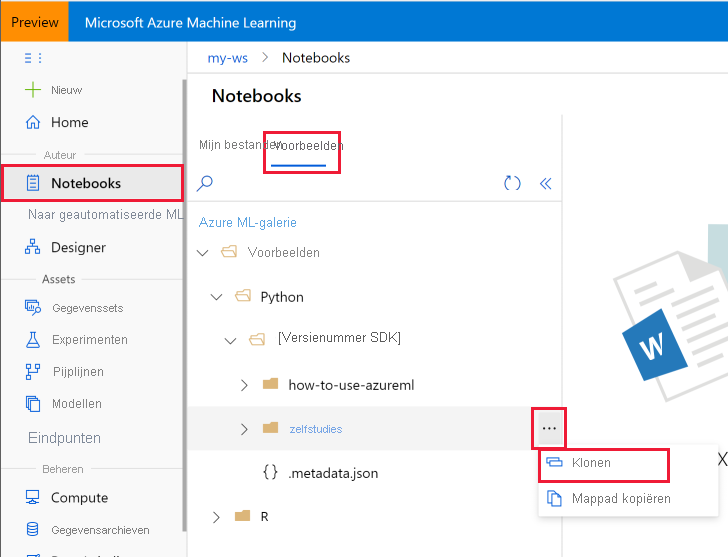

# Zelf studie: aan de slag met het maken van uw eerste ML-experiment met de python-SDK
[!INCLUDE [applies-to-skus](../../includes/aml-applies-to-basic-enterprise-sku.md)]

In deze zelf studie voltooit u de end-to-end-stappen om aan de slag te gaan met de Azure Machine Learning python SDK die wordt uitgevoerd in Jupyter-notebooks. Deze zelf studie maakt **deel uit van een tweedelige zelf studie reeks**, en omvat het instellen en configureren van python-omgevingen, en het maken van een werk ruimte voor het beheren van uw experimenten en machine learning modellen. [**Deel twee**](tutorial-1st-experiment-sdk-train.md) bouwt hier mee om meerdere machine learning modellen te trainen en het model beheer proces in te stellen met behulp van Azure machine learning Studio en de SDK.

In deze zelfstudie hebt u:

> [!div class="checklist"]
> * Maak een [Azure machine learning-werkruimte](concept-workspace.md) voor gebruik in de volgende zelf studie.
> * Kopieer de notebooks van de zelf studies naar uw map in de werk ruimte.
> * Maak een Cloud Compute-instantie met Azure Machine Learning python SDK geïnstalleerd en vooraf geconfigureerd.

Als u nog geen Azure-abonnement hebt, maakt u een gratis account voordat u begint. Probeer vandaag nog de [gratis of betaalde versie van Azure machine learning](https://aka.ms/AMLFree) .

## Een werkruimte maken

Een Azure Machine Learning-werk ruimte is een Foundation-resource in de cloud die u gebruikt om machine learning modellen te experimenteren, te trainen en te implementeren. Uw Azure-abonnement en resource groep worden gebonden aan een eenvoudig verbruikte object in de service. 

U maakt een werk ruimte via de Azure Portal, een webconsole voor het beheren van uw Azure-resources. 

[!INCLUDE [aml-create-portal](../../includes/aml-create-in-portal.md)]

>[!IMPORTANT] 
> Noteer uw **werk ruimte** en **abonnement**. U hebt deze nodig om ervoor te zorgen dat u op de juiste plaats uw experiment kunt maken. 

## Notitie blok uitvoeren in uw werk ruimte

In deze zelf studie wordt de Cloud notebook server in uw werk ruimte gebruikt voor een installatie zonder een vooraf geconfigureerde ervaring. Gebruik [uw eigen omgeving](how-to-configure-environment.md#local) als u de controle wilt over uw omgeving, pakketten en afhankelijkheden.

Volg samen met deze video of gebruik de gedetailleerde stappen hieronder om de zelf studie vanuit uw werk ruimte te klonen en uit te voeren. 

> [!VIDEO https://www.microsoft.com/en-us/videoplayer/embed/RE4mTUr]

### Een notitieblokmap-map klonen

U voltooit de volgende proef installatie en voert stappen uit in Azure Machine Learning Studio, een geconsolideerde interface met machine learning-hulpprogram ma's voor het uitvoeren van data Science-scenario's voor data Wetenschappen van alle vaardigheids niveaus.

1. Meld u aan bij [Azure machine learning Studio](https://ml.azure.com/).

1. Selecteer uw abonnement en de werk ruimte die u hebt gemaakt.

1. Selecteer **notebooks** aan de linkerkant.

1. Open de map met voor **beelden** .

1. Open de map **python** .

1. Open de map met een versie nummer.  Dit nummer vertegenwoordigt de huidige release voor de python-SDK.

1. Selecteer **'... '** aan de rechter kant van de map **zelf studies** en selecteer vervolgens **klonen**.

    

1. Er wordt een lijst met mappen weer gegeven met alle gebruikers die toegang hebben tot de werk ruimte.  Selecteer de map waarin u de map met **zelf studies** wilt klonen.

### de gekloonde notebook <a name="open">openen

1. Open de map onder **gebruikers bestanden** en open vervolgens de map gekloonde **zelf studies** .

    

    > [!IMPORTANT]
    > U kunt notitie blokken weer geven in de map **samples** , maar u kunt geen notitie blok van daar uitvoeren.  Als u een notitie blok wilt uitvoeren, moet u ervoor zorgen dat u de gekloonde versie van het notitie blok opent in de sectie **gebruikers bestanden** .
    
1. Selecteer de **zelf studie-1ste experiment-SDK-Train. ipynb-** bestand in uw **zelf studies/map Create-First-ml-experimenten** .

1. Selecteer op de bovenste balk een reken instantie die u wilt gebruiken om het notitie blok uit te voeren. Deze Vm's zijn vooraf geconfigureerd met [Alles wat u nodig hebt om Azure machine learning uit te voeren](concept-compute-instance.md#contents). U kunt een virtuele machine selecteren die wordt gemaakt door een gebruiker van uw werk ruimte. 

1. Als er geen Vm's worden gevonden, selecteert u **+ toevoegen** om de VM van het reken proces te maken. 

    1. Wanneer u een virtuele machine maakt, moet u een naam opgeven.  De naam moet tussen 2 en 16 tekens lang zijn. Geldige tekens zijn letters, cijfers en het-teken, en moeten ook uniek zijn binnen uw Azure-abonnement.

    1.  Selecteer de grootte van de virtuele machine in de beschik bare opties.

    1. Selecteer vervolgens **Maken**. Het kan ongeveer 5 minuten duren om uw virtuele machine in te stellen.

1. Zodra de virtuele machine beschikbaar is, wordt deze weer gegeven op de bovenste werk balk.  U kunt het notitie blok nu uitvoeren met de optie **alle uitvoeren** op de werk balk of door **SHIFT + ENTER** te gebruiken in de code cellen van het notitie blok.

Als u aangepaste widgets hebt of liever Jupyter/Jjupyterlab gebruikt, selecteert u de vervolg keuzelijst **Jupyter** helemaal rechts en selecteert u **Jupyter** of **jjupyterlab**. Het nieuwe browser venster wordt geopend.

## Volgende stappen

In deze zelf studie hebt u de volgende taken uitgevoerd:

* Er is een Azure Machine Learning-werk ruimte gemaakt.
* Een Cloud notebook server in uw werk ruimte gemaakt en geconfigureerd.

In **deel twee** van de zelf studie voert u de code in `tutorial-1st-experiment-sdk-train.ipynb` om een machine learning model te trainen. 

> [!div class="nextstepaction"]
> [Zelf studie: uw eerste model trainen](tutorial-1st-experiment-sdk-train.md)

> [!IMPORTANT]
> Als u niet van plan bent om deel 2 van deze zelf studie of andere zelf studies te plannen, moet u [de VM van de Cloud notebook server stoppen](tutorial-1st-experiment-sdk-train.md#clean-up-resources) wanneer u deze niet gebruikt om de kosten te verlagen.

