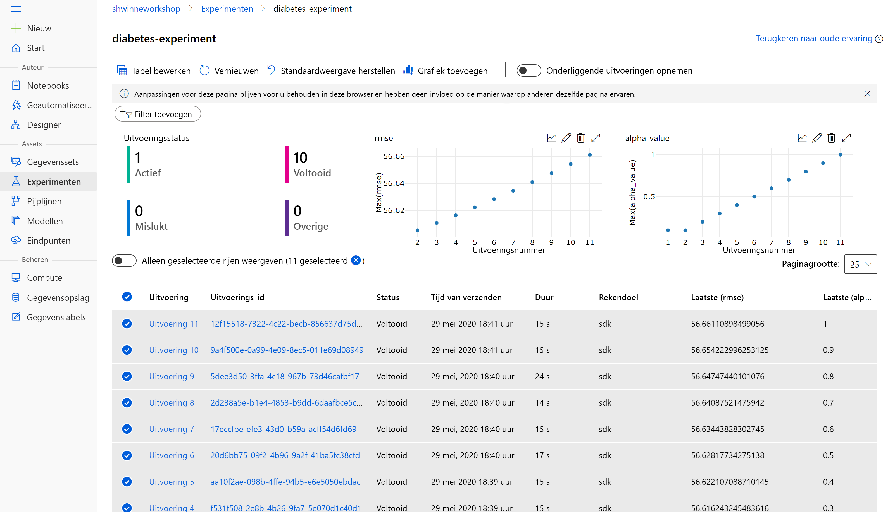
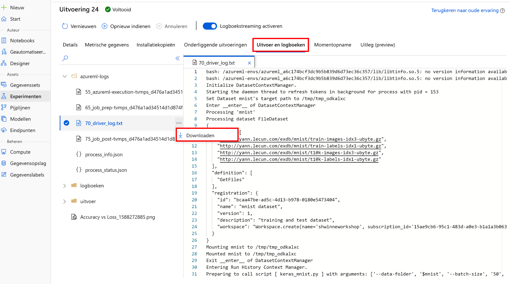

# <a name="tutorial-train-your-first-ml-model"></a>Zelf studie: uw eerste ML model trainen

[!INCLUDE [applies-to-skus](../../includes/aml-applies-to-basic-enterprise-sku.md)]

Deze zelfstudie is **deel twee van een tweedelige reeks**. In de vorige zelf studie hebt u [een werk ruimte gemaakt en een ontwikkel omgeving gekozen](tutorial-1st-experiment-sdk-setup.md). In deze zelf studie leert u de Foundational ontwerp patronen in Azure Machine Learning en traint u een eenvoudig scikit model op basis van de diabetes-gegevensset. Na het volt ooien van deze zelf studie beschikt u over de praktische kennis van de SDK voor het uitbreiden van meer complexe experimenten en werk stromen.

In deze zelfstudie leert u het volgende:

> [!div class="checklist"]
> * Uw werk ruimte verbinden en een experiment maken
> * Gegevens laden en scikit trainen-informatie over modellen
> * Trainings resultaten weer geven in de portal
> * Het beste model ophalen

## <a name="prerequisites"></a>Vereisten

De enige vereiste is om deel één van deze zelf studie, [installatie omgeving en werk ruimte](tutorial-1st-experiment-sdk-setup.md)uit te voeren.

In dit gedeelte van de zelf studie voert u de code uit in de voor beelden van Jupyter *-notebook-zelf studies/Create-First-ml-experiment/tutorial-1st-experiment-SDK-Train. ipynb* , die aan het einde van deel 1 wordt geopend. In dit artikel wordt uitgelegd hoe dezelfde code in het notitie blok zich bevindt.

## <a name="open-the-notebook"></a>Open het notitie blok

1. Meld u aan bij [Azure machine learning Studio](https://ml.azure.com/).

1. Open de **zelf studie-1ste experiment-SDK-Train. ipynb** in uw map, zoals weer gegeven in [deel één](tutorial-1st-experiment-sdk-setup.md#open).


> [!Warning]
> Maak **geen** *Nieuw* notitie blok in de Jupyter-interface. De notebook *zelf studies/Create-First-ml-experiment/tutorial-1st-experiment-SDK-Train. ipynb* is inclusief **alle code en gegevens die nodig zijn** voor deze zelf studie.

## <a name="connect-workspace-and-create-experiment"></a>Verbinding maken met werk ruimte en experiment maken

> [!Important]
> De rest van dit artikel bevat dezelfde inhoud als u ziet in het notitie blok.  
>
> Schakel nu over naar het Jupyter-notebook als u wilt lezen tijdens het uitvoeren van de code. 
> Als u één code-cel in een notitie blok wilt uitvoeren, klikt u op de cel code en drukt u op **SHIFT + ENTER**. U kunt ook het hele notitie blok uitvoeren door **alles uitvoeren** op de bovenste werk balk te kiezen.

Importeer de `Workspace`-klasse en laad uw abonnements gegevens vanuit het bestand `config.json` met behulp van de functie `from_config().` deze zoekt standaard naar het JSON-bestand in de huidige map, maar u kunt ook een pad-para meter opgeven om naar het bestand te verwijzen met `from_config(path="your/file/path")`. In een Cloud notebook server bevindt het bestand zich automatisch in de hoofdmap.

Als met de volgende code wordt gevraagd om extra verificatie, plakt u de koppeling eenvoudigweg in een browser en voert u het verificatie token in.

```python
from azureml.core import Workspace
ws = Workspace.from_config()
```

Maak nu een experiment in uw werk ruimte. Een experiment is een andere Foundational Cloud resource die een verzameling experimenten vertegenwoordigt (afzonderlijke model uitvoeringen). In deze zelf studie gebruikt u het experiment om uitvoeringen te maken en uw model training te volgen in de Azure Machine Learning Studio. Para meters bevatten uw werkruimte referentie en een teken reeks naam voor het experiment.


```python
from azureml.core import Experiment
experiment = Experiment(workspace=ws, name="diabetes-experiment")
```

## <a name="load-data-and-prepare-for-training"></a>Gegevens laden en trainingen voorbereiden

Voor deze zelf studie gebruikt u de gegevensset diabetes, die functies als Age, gender en BMI gebruikt om de voortgang van diabetes ziekten te voors pellen. Laad de gegevens uit de klasse [Azure open data sets](https://azure.microsoft.com/services/open-datasets/) en splits deze in trainings-en test sets met `train_test_split()`. Met deze functie worden de gegevens gescheiden, zodat het model ongebruikte gegevens heeft om de volgende training te testen.


```python
from azureml.opendatasets import Diabetes
from sklearn.model_selection import train_test_split

x_df = Diabetes.get_tabular_dataset().to_pandas_dataframe().dropna()
y_df = x_df.pop("Y")

X_train, X_test, y_train, y_test = train_test_split(x_df, y_df, test_size=0.2, random_state=66)
```

## <a name="train-a-model"></a>Een model trainen

Training voor een eenvoudig scikit model kan eenvoudig lokaal worden gedaan voor kleinschalige trainingen, maar bij het ontwikkelen van veel iteraties met tien tallen verschillende functie permutaties en afstemming-instellingen is het eenvoudig om te zien welke modellen u hebt getraind en hoe u ze zijn getraind. In het volgende ontwerp patroon ziet u hoe u de SDK kunt gebruiken om uw training eenvoudig bij te houden in de Cloud.

Bouw een script dat in een lus geplooide modellen via verschillende afstemming alpha-waarden.


```python
from sklearn.linear_model import Ridge
from sklearn.metrics import mean_squared_error
from sklearn.externals import joblib
import math

alphas = [0.1, 0.2, 0.3, 0.4, 0.5, 0.6, 0.7, 0.8, 0.9, 1.0]

for alpha in alphas:
    run = experiment.start_logging()
    run.log("alpha_value", alpha)

    model = Ridge(alpha=alpha)
    model.fit(X=X_train, y=y_train)
    y_pred = model.predict(X=X_test)
    rmse = math.sqrt(mean_squared_error(y_true=y_test, y_pred=y_pred))
    run.log("rmse", rmse)

    model_name = "model_alpha_" + str(alpha) + ".pkl"
    filename = "outputs/" + model_name

    joblib.dump(value=model, filename=filename)
    run.upload_file(name=model_name, path_or_stream=filename)
    run.complete()
```

Met de bovenstaande code worden de volgende handelingen uitgevoerd:

1. Voor elke alpha afstemming-waarde in de matrix `alphas` wordt een nieuwe uitvoering binnen het experiment gemaakt. De waarde alpha wordt vastgelegd om onderscheid te maken tussen elke uitvoering.
1. Bij elke uitvoering wordt een Ploois model geïnstantieerd, getraind en gebruikt voor het uitvoeren van voor spellingen. Het basis-gemiddelde-kwadraat-fout wordt berekend voor de werkelijke versus voorspelde waarden en vervolgens geregistreerd bij de uitvoering. Op dit moment bevat de uitvoering meta gegevens die zijn gekoppeld aan de alpha-waarde en de rmse nauw keurigheid.
1. Vervolgens wordt het model voor elke uitvoering geserialiseerd en geüpload naar de uitvoering. Hierdoor kunt u het model bestand downloaden uit de uitvoering in de portal.
1. Aan het einde van elke iteratie wordt de uitvoering voltooid door het aanroepen van `run.complete()`.

Nadat de training is voltooid, roept u de `experiment`-variabele aan om een koppeling naar het experiment in de portal op te halen.

```python
experiment
```

<table style="width:100%"><tr><th>Naam</th><th>Werkruimte</th><th>Rapport pagina</th><th>Pagina docs</th></tr><tr><td>diabetes-experiment</td><td>uw-werkruimte naam</td><td>Koppeling naar Azure Portal</td><td>Koppeling naar documentatie</td></tr></table>

## <a name="view-training-results-in-portal"></a>Trainings resultaten weer geven in Portal

Als u de **koppeling naar Azure Portal** volgt, gaat u naar de hoofd pagina van het experiment. Hier ziet u alle afzonderlijke uitvoeringen in het experiment. Eventuele aangepaste waarden (`alpha_value` en `rmse`, in dit geval) zijn velden voor elke uitvoering, en worden ook beschikbaar voor de grafieken en tegels boven aan de pagina experimenteren. Als u een vastgelegde metriek wilt toevoegen aan een grafiek of tegel, houdt u de muis aanwijzer over, klikt u op de knop bewerken en zoekt u de metrische gegevens van de aangepaste Logboeken.

Wanneer trainings modellen worden geschaald op honderden en duizenden afzonderlijke uitvoeringen, kunt u op deze pagina eenvoudig elk model zien dat u hebt getraind, in het bijzonder hoe ze zijn getraind en hoe uw unieke metrische gegevens in de loop van de tijd zijn veranderd.



Als u op een koppeling met een uitvoerings nummer klikt in de kolom `RUN NUMBER`, gaat u naar de pagina voor elke afzonderlijke uitvoering. Op de standaard tabblad **Details** ziet u meer gedetailleerde informatie over elke uitvoering. Ga naar het tabblad **uitvoer** en u ziet het `.pkl` bestand voor het model dat tijdens elke trainings herhaling naar de uitvoering is geüpload. Hier kunt u het model bestand downloaden in plaats van het hand matig opnieuw te hoeven trainen.



## <a name="get-the-best-model"></a>Het beste model ophalen

U kunt niet alleen model bestanden downloaden van het experiment in de portal, maar ook via een programma downloaden. Met de volgende code wordt elke uitvoering in het experiment herhaald en worden de metrische uitvoerings gegevens en de details van de uitvoering (die de run_id bevat) weer gegeven. Hiermee wordt de beste uitvoering bijgehouden, in dit geval de uitvoering met het laagste basis-gemiddelde-kwadraat-fout.

```python
minimum_rmse_runid = None
minimum_rmse = None

for run in experiment.get_runs():
    run_metrics = run.get_metrics()
    run_details = run.get_details()
    # each logged metric becomes a key in this returned dict
    run_rmse = run_metrics["rmse"]
    run_id = run_details["runId"]

    if minimum_rmse is None:
        minimum_rmse = run_rmse
        minimum_rmse_runid = run_id
    else:
        if run_rmse < minimum_rmse:
            minimum_rmse = run_rmse
            minimum_rmse_runid = run_id

print("Best run_id: " + minimum_rmse_runid)
print("Best run_id rmse: " + str(minimum_rmse))
```

    Best run_id: 864f5ce7-6729-405d-b457-83250da99c80
    Best run_id rmse: 57.234760283951765

Gebruik de beste run-ID om de afzonderlijke uitvoering op te halen met behulp van de `Run`-constructor en het experiment-object. Roep vervolgens `get_file_names()` aan om alle bestanden te zien die via deze uitvoering kunnen worden gedownload. In dit geval hebt u slechts één bestand geüpload voor elke run tijdens de training.

```python
from azureml.core import Run
best_run = Run(experiment=experiment, run_id=minimum_rmse_runid)
print(best_run.get_file_names())
```

    ['model_alpha_0.1.pkl']

Roep `download()` aan voor het uitvoerings object, waarbij u de naam van het model bestand opgeeft dat u wilt downloaden. Deze functie wordt standaard gedownload naar de huidige map.

```python
best_run.download_file(name="model_alpha_0.1.pkl")
```

## <a name="clean-up-resources"></a>Resources opschonen

Voltooi deze sectie niet als u van plan bent andere Azure Machine Learning zelf studies uit te voeren.

### <a name="stop-the-compute-instance"></a>Het reken exemplaar stoppen

[!INCLUDE [aml-stop-server](../../includes/aml-stop-server.md)]

### <a name="delete-everything"></a>Alles verwijderen

[!INCLUDE [aml-delete-resource-group](../../includes/aml-delete-resource-group.md)]

U kunt de resourcegroep ook bewaren en slechts één werkruimte verwijderen. Bekijk de eigenschappen van de werkruimte en selecteer **Verwijderen**.

## <a name="next-steps"></a>Volgende stappen

In deze zelf studie hebt u de volgende taken uitvoeren:

> [!div class="checklist"]
> * Uw werk ruimte verbonden en een experiment hebben gemaakt
> * Geladen gegevens en getrainde scikit-leer modellen
> * Bekijk de resultaten van de training in de portal en de opgehaalde modellen

[Uw model implementeren](tutorial-deploy-models-with-aml.md) met Azure Machine Learning.
Meer informatie over het ontwikkelen van [geautomatiseerde machine learning](tutorial-auto-train-models.md) experimenten.
