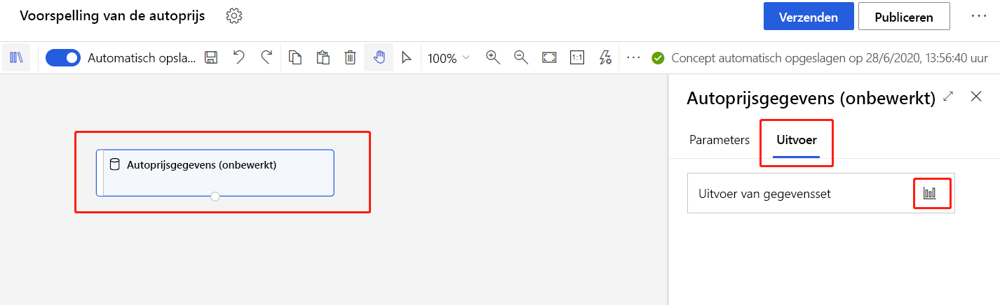
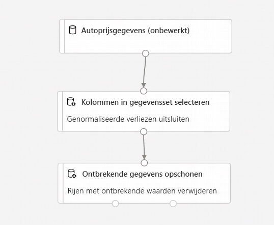
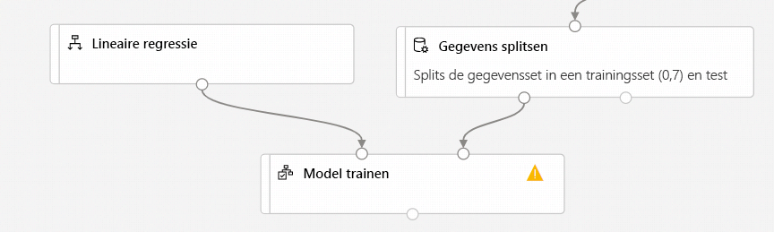
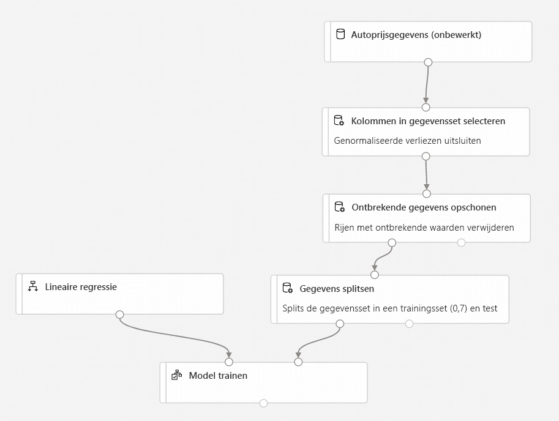
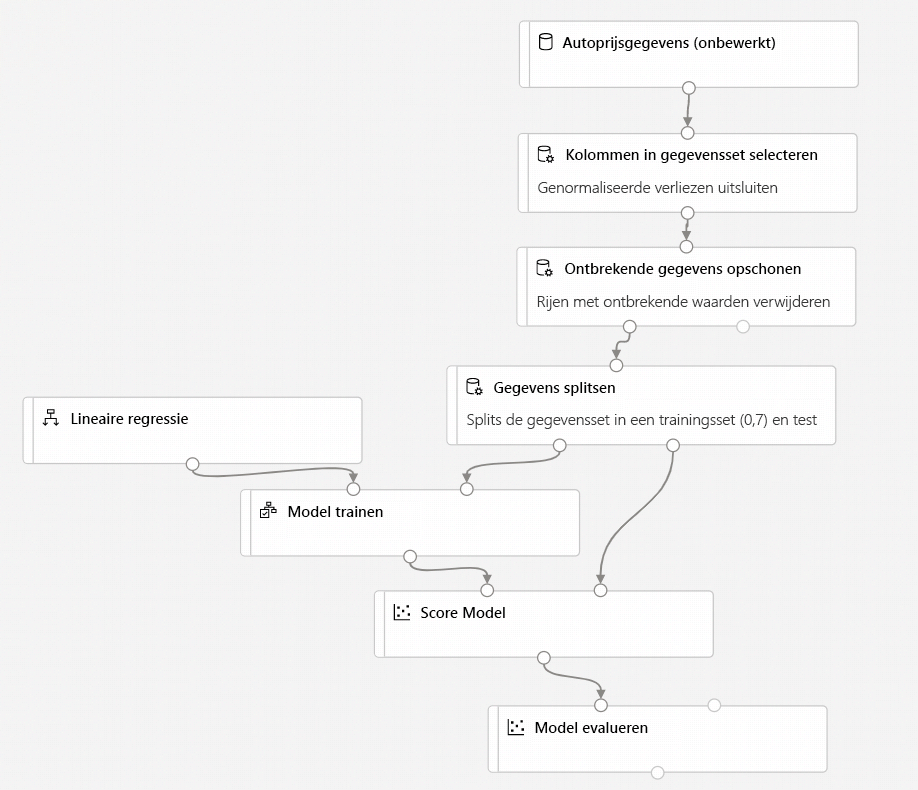
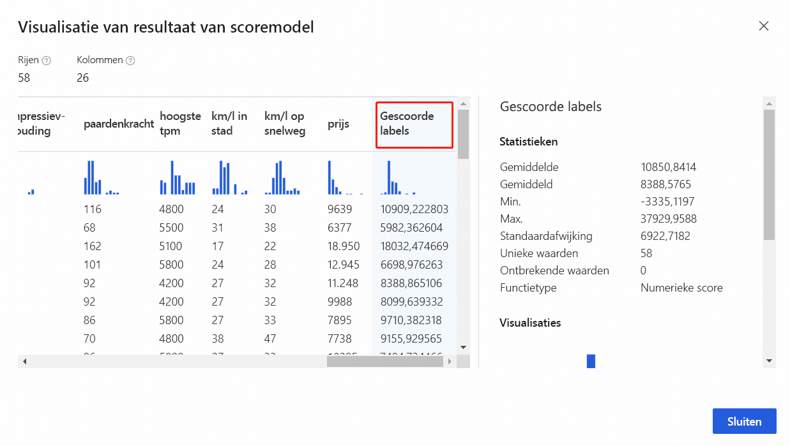

# Zelf studie: prijs van auto Mobile voors pellen met de ontwerp functie (preview)
[!INCLUDE [applies-to-skus](../../includes/aml-applies-to-enterprise-sku.md)]

In deze tweedelige zelf studie leert u hoe u de Azure Machine Learning Designer kunt gebruiken om een machine learning model te trainen en te implementeren waarmee de prijs van elke auto wordt voor speld. De ontwerper is een hulp programma voor slepen en neerzetten waarmee u machine learning modellen kunt maken zonder één regel code.

In deel één van de zelf studie leert u het volgende:

> [!div class="checklist"]
> * Maak een nieuwe pijp lijn.
> * Gegevens importeren.
> * Gegevens voorbereiden.
> * Train een machine learning model.
> * Een machine learning model evalueren.

In [deel twee](tutorial-designer-automobile-price-deploy.md) van de zelf studie implementeert u uw model als een real-time afnemend eind punt om de prijs van een auto te voors pellen op basis van technische specificaties die u verzendt. 

> [!NOTE]
>Een voltooide versie van deze zelf studie is beschikbaar als een voorbeeld pijplijn.
>
>Ga naar de ontwerp functie in uw werk ruimte om de app te vinden. Selecteer in de sectie **nieuwe pijp lijn** voor **Beeld 1 regressie: prijs voorspelling voor auto's (basis)**.

## Een nieuwe pijp lijn maken

Met Azure Machine Learning pijp lijnen worden meerdere machine learning-en gegevens verwerkings stappen in één resource ingedeeld. Met pijp lijnen kunt u complexe machine learning werk stromen in projecten en gebruikers ordenen, beheren en hergebruiken.

Als u een Azure Machine Learning pijp lijn wilt maken, hebt u een Azure Machine Learning-werk ruimte nodig. In deze sectie leert u hoe u deze resources kunt maken.

### Een nieuwe werkruimte maken

Als u de ontwerp functie wilt gebruiken, hebt u eerst een Azure Machine Learning-werk ruimte nodig. De werk ruimte is de resource op het hoogste niveau voor Azure Machine Learning. het biedt een centrale locatie voor het werken met alle artefacten die u in Azure Machine Learning maakt.

Als u een Azure Machine Learning-werk ruimte hebt met een Enter prise-editie, [gaat u naar de volgende sectie](#create-the-pipeline).

[!INCLUDE [aml-create-portal](../../includes/aml-create-in-portal-enterprise.md)]

### Maak de pijplijn

1. Meld u aan bij <a href="https://ml.azure.com?tabs=jre" target="_blank">ml.Azure.com</a>en selecteer de werk ruimte waarmee u wilt werken.

1. Selecteer **ontwerp functie**.

    

1. Selecteer **eenvoudig te gebruiken vooraf gedefinieerde modules**.

1. Selecteer boven aan het canvas de standaard pijplijn naam **pijplijn die is gemaakt**. Wijzig de naam in de voor *Spelling van prijzen voor auto Mobile*. De naam hoeft niet uniek te zijn.

## Het standaard Compute-doel instellen

Een pijp lijn wordt uitgevoerd op een compute-doel, een reken resource die aan uw werk ruimte is gekoppeld. Nadat u een compute-doel hebt gemaakt, kunt u het opnieuw gebruiken voor toekomstige uitvoeringen.

U kunt een **standaard Compute-doel** instellen voor de volledige pijp lijn, zodat elke module standaard hetzelfde reken doel gebruikt. U kunt reken doelen echter per module opgeven.

1. Selecteer naast de naam van de pijp lijn de scherm opname van het **tandwiel pictogram**  het tandwiel pictogram boven aan het canvas om het deel venster **instellingen** te openen.

1. Selecteer in het deel venster **instellingen** rechts van het canvas de optie **reken doel selecteren**.

    Als u al een beschik bare Compute-doel hebt, kunt u dit selecteren om deze pijp lijn uit te voeren.

    > [!NOTE]
    > De ontwerper kan experimenten alleen uitvoeren op Azure Machine Learning Compute-doelen. Andere reken doelen worden niet weer gegeven.

1. Voer een naam in voor de reken resource.

1. Selecteer **Opslaan**.

    > [!NOTE]
    > Het duurt ongeveer vijf minuten om een reken resource te maken. Nadat de resource is gemaakt, kunt u deze opnieuw gebruiken en deze wacht tijd overs laan voor toekomstige uitvoeringen.
    >
    > De reken resource wordt automatisch geschaald naar nul knoop punten wanneer het inactief is om kosten te besparen. Wanneer u het opnieuw gebruikt na een vertraging, kunt u ongeveer vijf minuten wachten terwijl de back-up wordt geschaald.

## Gegevens importeren

Er zijn verschillende voorbeeld gegevens sets die zijn opgenomen in de ontwerp functie waarmee u kunt experimenteren. Gebruik voor deze zelf studie **Auto Mobile price data (RAW)**. 

1. Links van het pijplijn canvas is een palet met gegevens sets en modules. Selecteer **gegevens sets**en bekijk vervolgens de sectie voor **beelden** om de beschik bare voorbeeld gegevens sets weer te geven.

1. Selecteer de prijs gegevens van de gegevensset **Auto Mobile (onbewerkt)** en sleep deze naar het canvas.

   

### De gegevens visualiseren

U kunt de gegevens visualiseren om inzicht te krijgen in de gegevensset die u gaat gebruiken.

1. Selecteer de module **Auto Mobile price data (RAW)** .

1. Selecteer in het deel venster met module details rechts van het canvas de optie **uitvoer en logboek**.

1. Selecteer het pictogram van de grafiek om de gegevens te visualiseren.

    

1. Selecteer de verschillende kolommen in het venster gegevens om informatie over elke kolom weer te geven.

    Elke rij vertegenwoordigt een auto en de variabelen die aan elke auto zijn gekoppeld, worden weer gegeven als kolommen. Deze gegevensset bevat 205 rijen en 26 kolommen.

## Gegevens voorbereiden

Gegevens sets vereisen doorgaans een voor verwerking vóór de analyse. Mogelijk hebt u enkele ontbrekende waarden gezien toen u de gegevensset inspecteert. Deze ontbrekende waarden moeten worden opgeschoond zodat het model de gegevens op de juiste wijze kan analyseren.

### Een kolom verwijderen

Wanneer u een model traint, moet u iets doen over de gegevens die ontbreken. In deze gegevensset ontbreken er veel waarden in de kolom **normaled-verliezen** , dus sluit u die kolom uit het model.

1. Vouw in het module palet links van het canvas de sectie **gegevens transformatie** uit en zoek de module **kolommen in gegevensset selecteren** .

1. Sleep de module **kolommen in gegevensset selecteren** naar het canvas. Verwijder de module onder de module DataSet.

1. Verbind de gegevensset **Auto Mobile price data (RAW)** met de module **select columns in dataset** . Sleep vanuit de uitvoer poort van de gegevensset, de kleine cirkel aan de onderkant van de gegevensset op het canvas, naar de invoer poort van **geselecteerde kolommen in gegevensset**, die de kleine cirkel boven aan de module vormt.

    > [!TIP]
    > U maakt een stroom met gegevens via uw pijp lijn wanneer u de uitvoer poort van een module verbindt met een andere invoer poort.
    >

    

1. Selecteer de module **select columns in dataset** .

1. Selecteer in het detail venster van de module rechts van het canvas de optie **kolom bewerken**.

1. Vouw de vervolg keuzelijst **kolom namen** naast **toevoegen**uit en selecteer **alle kolommen**.

1. Selecteer de **+** om een nieuwe regel toe te voegen.

1. Selecteer in de vervolg keuzelijst de optie **uitsluiten** en **kolom namen**.
    
1. Voer in het tekstvak *genormaliseerde verliezen* in.

1. In de rechter benedenhoek selecteert u **Opslaan** om de kolom kiezer te sluiten.

    

1. Selecteer de module **select columns in dataset** . 

1. Selecteer in het deel venster module details rechts van het canvas het tekstvak voor de **Opmerking** en voer *normaal verlies*in.

    Opmerkingen worden weer gegeven in de grafiek om uw pijp lijn te organiseren.

### Ontbrekende gegevens opschonen

Uw gegevensset heeft nog steeds ontbrekende waarden nadat u de kolom **normaled-verliezen** hebt verwijderd. U kunt de resterende ontbrekende gegevens verwijderen met behulp van de module **clean Missing Data** .

> [!TIP]
> Het schoonmaken van de ontbrekende waarden van invoer gegevens is een vereiste voor het gebruik van de meeste modules in de ontwerp functie.

1. Vouw in het module palet links van het canvas de sectie **gegevens transformatie**uit en zoek de module **clean Missing Data** .

1. Sleep de module **clean Missing Data** naar het pijp lijn-canvas. Verbind deze met de module **select columns in dataset** . 

1. Selecteer de module **clean Missing Data** .

1. Selecteer in het detail venster van de module rechts van het canvas de optie **kolom bewerken**.

1. Vouw in het venster **te reinigen kolommen** de vervolg keuzelijst naast **insluiting**uit. Selecteer **alle kolommen**

1. Selecteer **Opslaan**

1. Selecteer in het detail venster van de module rechts van het canvas de optie **hele rij verwijderen** onder **reinigings modus**.

1. Selecteer in het deel venster module details rechts van het canvas het vak **Opmerking** en voer *ontbrekende rijen verwijderen*in. 

    De pijp lijn moet er nu ongeveer als volgt uitzien:
    
    

## Een machine learning model trainen

Nu u beschikt over de modules voor het verwerken van de gegevens, kunt u de trainings modules instellen.

Omdat u de prijs wilt voors pellen, wat een getal is, kunt u een regressie algoritme gebruiken. Voor dit voor beeld gebruikt u een lineair regressie model.

### De gegevens splitsen

Het splitsen van gegevens is een gemeen schappelijke taak in machine learning. U kunt uw gegevens in twee afzonderlijke gegevens sets splitsen. Met één gegevensset wordt het model getraind en de andere wordt getest hoe goed het model wordt uitgevoerd.

1. Vouw in het module palet de sectie **gegevens transformatie** uit en zoek de module **Split data** .

1. Sleep de module **Split data** naar het pijp lijn-canvas.

1. Verbind de poort links van de module **clean Missing Data** in de module **Split data** .

    > [!IMPORTANT]
    > Zorg ervoor dat de linker uitvoer poorten van **schone ontbrekende gegevens** verbinding maken met **gesplitste gegevens**. De linker poort bevat de gereinigde gegevens. De juiste poort bevat de discarted-gegevens.

1. Selecteer de module **Split data** .

1. Stel in het deel venster module details rechts van het canvas het **gedeelte van de rijen in de eerste uitvoer gegevensset in** op 0,7.

    Met deze optie splitst u 70 procent van de gegevens om het model te trainen en 30 procent voor het testen ervan. De gegevensset van 70 procent is toegankelijk via de linker uitvoer poort. De resterende gegevens zijn beschikbaar via de juiste uitvoer poort.

1. Selecteer in het deel venster module details rechts van het canvas het vak **Opmerking** en voer *de gegevensset in in de trainingsset (0,7) en de testset (0,3)*.

### Het model trainen

Train het model door het een gegevensset te geven die de prijs bevat. Het algoritme bouwt een model dat de relatie tussen de functies en de prijs aangeeft zoals gepresenteerd door de trainings gegevens.

1. Vouw in het palet module de optie **machine learning algoritmen**uit.
    
    Met deze optie worden verschillende categorieën modules weer gegeven die u kunt gebruiken voor het initialiseren van leer algoritmen.

1. Selecteer lineaire regressie**regressie**selecteren en sleep deze naar het pijp lijn papier. **Regression** > 

1. Koppel de uitvoer van de module **Linear Regression** aan de linkerkant van de module **Train model** .

1. Vouw in het deel palet module de sectie **training van module modules**uit en sleep de module **Train model** naar het canvas.

1. Selecteer de module **Train model** en sleep deze naar het pijp lijn papier.

1. Verbind de resultaten van de trainings gegevens (links poort) van de module **gesplitste gegevens** met de juiste invoer van de module **Train model** .
    
    > [!IMPORTANT]
    > Zorg ervoor dat de linker uitvoer poorten van **gesplitste gegevens** verbinding maken met het **Train-model**. De linker poort bevat de set training. De juiste poort bevat de testset.

    

1. Selecteer de module **Train Model**.

1. Selecteer in het detail venster van de module rechts van het canvas de optie **kolom kiezer bewerken** .

1. Vouw in het dialoog venster **Label kolom** de vervolg keuzelijst uit en selecteer **kolom namen**. 

1. Voer in het tekstvak de *prijs* in om de waarde op te geven die uw model gaat voors pellen.

    >[!IMPORTANT]
    > Zorg ervoor dat u de kolom naam precies opgeeft. **Prijs**niet kapitaliseren. 

    Uw pijp lijn moet er als volgt uitzien:

    

### De module score model toevoegen

Nadat u uw model hebt getraind met 70 procent van de gegevens, kunt u het gebruiken om de andere 30 procent te scoren om te zien hoe goed uw model functioneert.

1. Voer het *score model* in het zoekvak in om de module **score model** te vinden. Sleep de module naar het pijp lijn-canvas. 

1. Koppel de uitvoer van de module **Train Model** aan de linkerinvoerpoort van de module **Score Model**. Koppel de testgegevensuitvoer (rechterpoort) van de module **Split Data** aan de rechterinvoerpoort van de module **Score Model**.

### De module Evaluate Model toevoegen

Gebruik de module voor het **evalueren van modellen** om te evalueren hoe goed uw model de test-gegevensset heeft gescoord.

1. Geef *evalueren* op in het zoekvak om de module **Evaluate model** te vinden. Sleep de module naar het pijp lijn-canvas. 

1. Koppel de uitvoer van de module **score model** aan de linker invoer van het **Evaluate-model**. 

    De uiteindelijke pijp lijn moet er ongeveer als volgt uitzien:

    

## De pijp lijn verzenden

Nu de pijp lijn is ingesteld op alle instellingen, kunt u een pijplijn uitvoering verzenden om uw machine learning model te trainen. U kunt op elk moment een geldige pijplijn uitvoering verzenden die kan worden gebruikt om wijzigingen in uw pijp lijn tijdens de ontwikkeling te controleren.

1. Selecteer aan de bovenkant van het canvas de optie **verzenden**.

1. Selecteer in het dialoog venster **pijplijn uitvoering instellen** de optie **nieuwe maken**.

    > [!NOTE]
    > Experimenten groeperen gelijksoortige pijp lijnen worden uitgevoerd. Als u een pijp lijn meerdere keren uitvoert, kunt u hetzelfde experiment selecteren voor opeenvolgende uitvoeringen.

    1. Voer een beschrijvende naam in voor de **nieuwe naam**van het experiment.

    1. Selecteer **Indienen**.
    
    U kunt de uitvoerings status en-gegevens weer geven in de rechter bovenhoek van het canvas.
    
    Als de eerste keer wordt uitgevoerd, kan het tot 20 minuten duren voordat de pijp lijn is voltooid. De standaard instellingen voor de berekening hebben een minimale knooppunt grootte van 0, wat betekent dat de ontwerp functie resources moet toewijzen na inactiviteit. Herhaalde pijplijn uitvoeringen nemen minder tijd in beslag, omdat de reken resources al zijn toegewezen. Daarnaast gebruikt de ontwerp functie in cache geplaatste resultaten voor elke module om de efficiëntie te verbeteren.

### Gescoorde labels weer geven

Nadat de uitvoering is voltooid, kunt u de resultaten van de pijplijn uitvoering bekijken. Bekijk eerst de voor spellingen die zijn gegenereerd door het regressie model.

1. Selecteer de module **score model** om de uitvoer ervan weer te geven.

1. Selecteer in het deel venster module details rechts van het canvas de optie **uitvoer en logboeken** > pictogram  om de resultaten weer te geven.

    Hier vindt u de voorspelde prijzen en de werkelijke prijzen van de test gegevens.

    

### Modellen evalueren

Gebruik het **evalueren model** om te zien hoe goed het getrainde model op de test-gegevensset is uitgevoerd.

1. Selecteer de module **Evaluate model** om de uitvoer ervan weer te geven.

1. Selecteer in het deel venster module details rechts van het canvas de optie **uitvoer en logboeken** > pictogram  om de resultaten weer te geven.

De volgende statistieken worden weer gegeven voor uw model:

* **Gemiddelde absolute fout (Mae)**: het gemiddelde van absolute fouten. Een fout is het verschil tussen de voorspelde waarde en de werkelijke waarde.
* **Root mean error (RMSE)**: de vierkantswortel van het gemiddelde van de gekwadrateerde fouten van voor spellingen die zijn aangebracht in de test-gegevensset.
* **Relative Absolute Error**: het gemiddelde aan absolute fouten ten opzichte van het absolute verschil tussen de werkelijke waarden en het gemiddelde van alle werkelijke waarden.
* **Relative Squared Error**: het gemiddelde aan gekwadrateerde fouten ten opzichte van het gekwadrateerde verschil tussen de werkelijke waarden en het gemiddelde van alle werkelijke waarden.
* **Determinatie coëfficiënt**: ook wel bekend als R-kwadraat, geeft deze statistische waarde aan hoe goed een model past bij de gegevens.

Voor elk van de foutstatistieken geldt: hoe kleiner hoe beter. Een kleinere waarde geeft aan dat de voor spellingen dichter bij de werkelijke waarden liggen. Voor de coëfficiënt van de bepaling is de waarde een (1,0), hoe beter de voor spellingen.

## Resources opschonen

Sla deze sectie over als u wilt door gaan met deel 2 van de zelf studie, het [implementeren van modellen](tutorial-designer-automobile-price-deploy.md).

[!INCLUDE [aml-ui-cleanup](../../includes/aml-ui-cleanup.md)]

## Volgende stappen

In deel twee leert u hoe u uw model implementeert als een real-time-eind punt.

> [!div class="nextstepaction"]
> [Door gaan met de implementatie van modellen](tutorial-designer-automobile-price-deploy.md)
