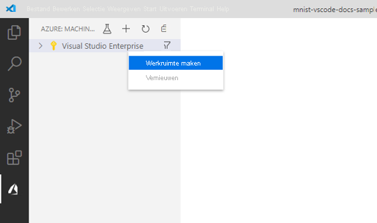
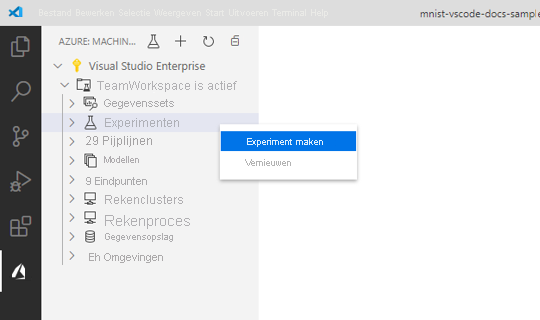
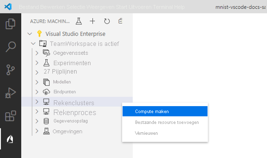
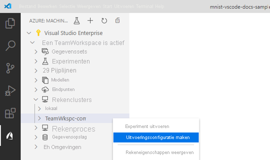
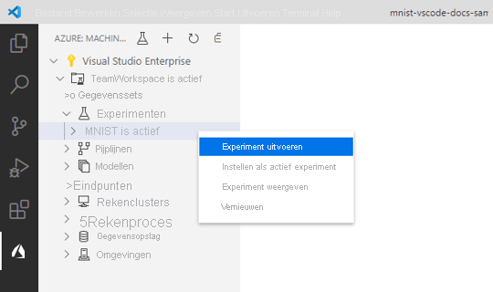
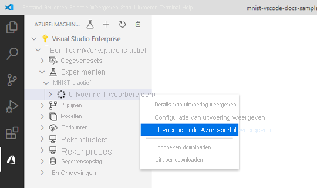
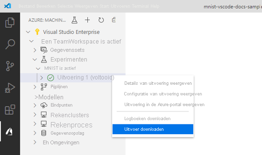
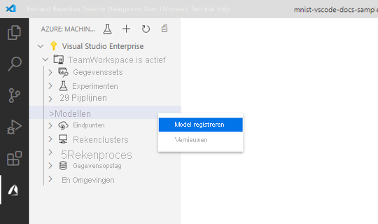

# <a name="train-and-deploy-an-image-classification-tensorflow-model-using-the-azure-machine-learning-visual-studio-code-extension"></a>Een tensor flow model voor de classificatie van een installatie kopie trainen en implementeren met behulp van de Visual Studio code extension van Azure Machine Learning

Meer informatie over hoe u een afbeeldings classificatie model traint en implementeert om handgeschreven getallen te herkennen met tensor flow en de extensie Azure Machine Learning Visual Studio code.

In deze zelfstudie leert u het volgende:

> [!div class="checklist"]
> * De code begrijpen
> * Een werkruimte maken
> * Een experiment maken
> * Computer doelen configureren
> * Een configuratie bestand uitvoeren
> * Een model trainen
> * Een model registreren
> * Een model implementeren

## <a name="prerequisites"></a>Vereisten

- Azure-abonnement. Als u er nog geen hebt, kunt u zich aanmelden om de [gratis of betaalde versie van Azure machine learning](https://aka.ms/AMLFree)te proberen.
- Installeer [Visual Studio code](https://code.visualstudio.com/docs/setup/setup-overview), een licht gewicht, platformoverschrijdende code-editor.
- Visual Studio code-extensie Azure Machine Learning Studio. Voor installatie-instructies raadpleegt u de [zelf studie installatie Azure machine learning Visual Studio code extension](./tutorial-setup-vscode-extension.md)

## <a name="understand-the-code"></a>De code begrijpen

De code voor deze zelf studie maakt gebruik van tensor flow voor het trainen van een afbeeldings classificatie machine learning model dat de handgeschreven cijfers van 0-9 categoriseert. Dit doet u door een Neural-netwerk te maken dat de pixel waarden van 28 PX x 28 PX-afbeelding als invoer gebruikt en voert een lijst van tien waarschijnlijkheden uit, één voor elk van de cijfers die worden geclassificeerd. Hieronder ziet u een voor beeld van de gegevens die eruitzien.  


De code voor deze zelf studie ophalen door de [VS code-Hulpprogram ma's voor AI-opslag](https://github.com/microsoft/vscode-tools-for-ai/archive/master.zip) plaatsen op uw computer te downloaden en uitgepakt.

## <a name="create-a-workspace"></a>Een werkruimte maken

Het eerste wat u moet doen om een toepassing in Azure Machine Learning te bouwen, is door een werk ruimte te maken. Een werk ruimte bevat de resources voor het trainen van modellen en de getrainde modellen zelf. Zie [Wat is een werk ruimte](./concept-workspace.md)? voor meer informatie. 

1. Op de activiteiten balk van Visual Studio, selecteert u het pictogram van **Azure** om de weer gave Azure machine learning te openen.
1. Klik met de rechter muisknop op uw Azure-abonnement en selecteer **werk ruimte maken**. 
    
    > [!div class="mx-imgBorder"]
    > 

1. Er wordt standaard een naam gegenereerd met de datum en tijd van het maken. Wijzig in het vak tekst invoer de naam in ' TeamWorkspace ' en druk op **Enter**.
1. Selecteer **een nieuwe resource groep maken**. 
1. Geef een naam op voor de resource groep "TeamWorkspace-RG" en druk op **Enter**. 
1. Kies een locatie voor uw werk ruimte. Het is raadzaam om een locatie te kiezen die het dichtst bij de locatie ligt die u voor het implementeren van uw model wilt gebruiken. Bijvoorbeeld ' vs West 2 '.
1. Wanneer u wordt gevraagd om het type werk ruimte te selecteren, selecteert u **Basic** om een eenvoudige werk ruimte te maken. Zie [Azure machine learning Overview](./overview-what-is-azure-ml.md#sku)voor meer informatie over verschillende werk ruimte-aanbiedingen.

Op dit punt wordt een aanvraag voor Azure gemaakt om een nieuwe werk ruimte in uw account te maken. Na een paar minuten wordt de nieuwe werk ruimte weer gegeven in het knoop punt van uw abonnement. 

## <a name="create-an-experiment"></a>Een experiment maken

Een of meer experimenten kunnen worden gemaakt in uw werk ruimte om de uitvoering van afzonderlijke model trainingen bij te houden en te analyseren. Uitvoeringen kunnen worden uitgevoerd in de Azure-Cloud of op uw lokale machine.

1. Op de activiteiten balk van Visual Studio, selecteert u het pictogram van **Azure** . De weer gave Azure Machine Learning wordt weer gegeven.
1. Vouw het knoop punt van uw abonnement uit.
1. Vouw het knoop punt **TeamWorkspace** uit. 
1. Klik met de rechter muisknop op het knoop punt **experimenten** .
1. Selecteer **experiment maken** in het context menu.

    > [!div class="mx-imgBorder"]
    > 

1. Noem het experiment "MNIST" en druk op **Enter** om het nieuwe experiment te maken. 

Net als werk ruimten wordt een aanvraag verzonden naar Azure om een experiment te maken met de meegeleverde configuraties. Na een paar minuten wordt het nieuwe experiment weer gegeven in het knoop punt *experimenten* van uw werk ruimte. 

## <a name="configure-compute-targets"></a>Reken doelen configureren

Een compute-doel is de computer bron of-omgeving waar u scripts uitvoert en getrainde modellen implementeert. Zie de [documentatie van Azure machine learning Compute](./concept-compute-target.md)voor meer informatie.

Een reken doel maken:

1. Op de activiteiten balk van Visual Studio, selecteert u het pictogram van **Azure** . De weer gave Azure Machine Learning wordt weer gegeven. 
1. Vouw het knoop punt van uw abonnement uit. 
1. Vouw het knoop punt **TeamWorkspace** uit. 
1. Klik onder het knoop punt werk ruimte met de rechter muisknop op het knoop punt **Compute** en kies **Compute maken**. 

    > [!div class="mx-imgBorder"]
    > 

1. Selecteer **Azure machine learning Compute (AmlCompute)**. Azure Machine Learning Compute is een beheerde-reken infrastructuur waarmee de gebruiker eenvoudig een reken proces met één of meerdere knoop punten kan maken die kan worden gebruikt met andere gebruikers in uw werk ruimte.
1. Kies een VM-grootte. Selecteer **Standard_F2s_v2** in de lijst met opties. De grootte van uw virtuele machine heeft invloed op de hoeveelheid tijd die nodig is om uw modellen te trainen. Zie [grootten voor virtuele Linux-machines in azure](https://docs.microsoft.com/azure/virtual-machines/linux/sizes)voor meer informatie over VM-grootten.
1. Noem de compute "TeamWkspc-com" en druk op **Enter** om uw reken proces te maken.

    Er wordt een bestand in VS code weer gegeven met inhoud die er ongeveer als volgt uitziet:

    ```json
    {
        "location": "westus2",
        "tags": {},
        "properties": {
            "computeType": "AmlCompute",
            "description": "",
            "properties": {
                "vmSize": "Standard_F2s_v2",
                "vmPriority": "dedicated",
                "scaleSettings": {
                    "maxNodeCount": 4,
                    "minNodeCount": 0,
                    "nodeIdleTimeBeforeScaleDown": 120
                },
                "userAccountCredentials": {
                    "adminUserName": "",
                    "adminUserPassword": "",
                    "adminUserSshPublicKey": ""
                },
                "subnetName": "",
                "vnetName": "",
                "vnetResourceGroupName": "",
                "remoteLoginPortPublicAccess": ""
            }
        }
    }
    ```

1. Wanneer u tevreden bent met de configuratie, opent u het opdracht palet door **> opdracht venster weer geven**te selecteren.
1. Voer de volgende opdracht in het opdracht palet in om het uitvoerings configuratie bestand op te slaan.

    ```text
    Azure ML: Save and Continue
    ```

Na een paar minuten wordt het nieuwe Compute-doel weer gegeven in het *reken* knooppunt van uw werk ruimte.

## <a name="create-a-run-configuration"></a>Een uitvoerings configuratie maken

Wanneer u een training verzendt naar een compute-doel, verzendt u ook de configuratie die nodig is om de trainings taak uit te voeren. Bijvoorbeeld het script met de code training en de python-afhankelijkheden die nodig zijn om het uit te voeren.

Een uitvoerings configuratie maken:

1. Op de activiteiten balk van Visual Studio, selecteert u het pictogram van **Azure** . De weer gave Azure Machine Learning wordt weer gegeven. 
1. Vouw het knoop punt van uw abonnement uit. 
1. Vouw het knoop punt **TeamWorkspace > Compute** uit. 
1. Klik onder het knoop punt Compute met de rechter muisknop op het knoop punt **TeamWkspc-com** Compute en kies **Create run Configuration**.

    > [!div class="mx-imgBorder"]
    > 

1. Geef de configuratie van de Voer ' MNIST-RC ' een naam en druk op **Enter** om uw uitvoerings configuratie te maken.
1. Selecteer vervolgens **nieuwe Azure ml-omgeving maken**. Omgevingen definiëren de afhankelijkheden die nodig zijn om uw scripts uit te voeren.
1. Noem uw omgeving "MNIST-env" en druk op **Enter**.
1. Selecteer **Conda afhankelijkheden bestand** in de lijst.
1. Druk op **Enter** om door het Conda-afhankelijkheids bestand te bladeren. In dit geval is het afhankelijkheden bestand het `env.yml` bestand in de `vscode-tools-for-ai/mnist-vscode-docs-sample` map.

    Er wordt een bestand in VS code weer gegeven met inhoud die er ongeveer als volgt uitziet:

    ```json
    {
        "name": "MNIST-env",
        "version": "1",
        "python": {
            "interpreterPath": "python",
            "userManagedDependencies": false,
            "condaDependencies": {
                "name": "vs-code-azure-ml-tutorial",
                "channels": [
                    "defaults"
                ],
                "dependencies": [
                    "python=3.6.2",
                    "tensorflow=1.15.0",
                    "pip",
                    {
                        "pip": [
                            "azureml-defaults"
                        ]
                    }
                ]
            },
            "baseCondaEnvironment": null
        },
        "environmentVariables": {},
        "docker": {
            "baseImage": "mcr.microsoft.com/azureml/base:intelmpi2018.3-ubuntu16.04",
            "baseDockerfile": null,
            "baseImageRegistry": {
                "address": null,
                "username": null,
                "password": null
            },
            "enabled": false,
            "arguments": []
        },
        "spark": {
            "repositories": [],
            "packages": [],
            "precachePackages": true
        },
        "inferencingStackVersion": null
    }
    ```

1. Wanneer u tevreden bent met uw configuratie, slaat u deze op door het opdracht palet te openen en de volgende opdracht in te voeren:

    ```text
    Azure ML: Save and Continue
    ```

1. Druk op **Enter** om door het script bestand te bladeren dat u op de computer wilt uitvoeren. In dit geval is het script voor het trainen van het model `train.py` het bestand in `vscode-tools-for-ai/mnist-vscode-docs-sample` de map.

    Een bestand met `MNIST-rc.runconfig` de naam wordt weer gegeven in VS code met inhoud die er ongeveer als volgt uitziet:

    ```json
    {
        "script": "train.py",
        "framework": "Python",
        "communicator": "None",
        "target": "TeamWkspc-com",
        "environment": {
            "name": "MNIST-env",
            "version": "1",
            "python": {
                "interpreterPath": "python",
                "userManagedDependencies": false,
                "condaDependencies": {
                    "name": "vs-code-azure-ml-tutorial",
                    "channels": [
                        "defaults"
                    ],
                    "dependencies": [
                        "python=3.6.2",
                        "tensorflow=1.15.0",
                        "pip",
                        {
                            "pip": [
                                "azureml-defaults"
                            ]
                        }
                    ]
                },
                "baseCondaEnvironment": null
            },
            "environmentVariables": {},
            "docker": {
                "baseImage": "mcr.microsoft.com/azureml/base:intelmpi2018.3-ubuntu16.04",
                "baseDockerfile": null,
                "baseImageRegistry": {
                    "address": null,
                    "username": null,
                    "password": null
                },
                "enabled": false,
                "arguments": []
            },
            "spark": {
                "repositories": [],
                "packages": [],
                "precachePackages": true
            },
            "inferencingStackVersion": null
        },
        "history": {
            "outputCollection": true,
            "snapshotProject": false,
            "directoriesToWatch": [
                "logs"
            ]
        }
    }
    ```

1. Wanneer u tevreden bent met uw configuratie, slaat u deze op door het opdracht palet te openen en de volgende opdracht in te voeren:

    ```text
    Azure ML: Save and Continue
    ```

De `MNIST-rc` uitvoerings configuratie wordt toegevoegd onder het knoop punt *TeamWkspc-com* en de `MNIST-env` omgevings configuratie wordt toegevoegd onder het knoop punt *omgevingen* .

## <a name="train-the-model"></a>Het model trainen

Tijdens het trainings proces wordt een tensor flow-model gemaakt door de verwerking van de trainings gegevens en-learning patronen die erin zijn Inge sloten voor elk van de desbetreffende cijfers die worden geclassificeerd. 

Een Azure Machine Learning experiment uitvoeren:

1. Op de activiteiten balk van Visual Studio, selecteert u het pictogram van **Azure** . De weer gave Azure Machine Learning wordt weer gegeven. 
1. Vouw het knoop punt van uw abonnement uit. 
1. Vouw het knoop punt **TeamWorkspace > experimenten** uit. 
1. Klik met de rechter muisknop op het **MNIST** -experiment.
1. Selecteer **experiment uitvoeren**.

    > [!div class="mx-imgBorder"]
    > 

1. Selecteer in de lijst met opties voor Compute target het **TeamWkspc-com** Compute target.
1. Selecteer vervolgens de configuratie van **MNIST-RC-** uitvoering.
1. Op dit moment wordt een aanvraag verzonden naar Azure om uw experiment uit te voeren op het geselecteerde Compute-doel in uw werk ruimte. Dit proces duurt enkele minuten. De hoeveelheid tijd voor het uitvoeren van de trainings taak wordt beïnvloed door diverse factoren, zoals het reken type en de gegevens grootte van de training. Als u de voortgang van uw experiment wilt volgen, klikt u met de rechter muisknop op het huidige knoop punt uitvoeren en selecteert u **uitvoeren in azure portal weer geven**.
1. Wanneer het dialoog venster voor het openen van een externe website wordt weer gegeven, selecteert u **openen**.

    > [!div class="mx-imgBorder"]
    > 

Wanneer het model training is voltooid, wordt het status label naast het knoop punt uitvoeren bijgewerkt naar voltooid.

## <a name="register-the-model"></a>Het model registreren

Nu u uw model hebt getraind, kunt u dit registreren in uw werk ruimte. 

Uw model registreren:

1. Op de activiteiten balk van Visual Studio, selecteert u het pictogram van **Azure** . De weer gave Azure Machine Learning wordt weer gegeven.
1. Vouw het knoop punt van uw abonnement uit. 
1. Vouw het knoop punt **TeamWorkspace > experimenten > MNIST** uit.
1. De model uitvoer ophalen die is gegenereerd op basis van de training van het model. Klik met de rechter muisknop op het knoop punt **Run 1** uitvoeren en selecteer **uitvoer downloaden**. 

    > [!div class="mx-imgBorder"]
    > 

1. Kies de directory waarin u de gedownloade uitvoer wilt opslaan. Standaard worden de uitvoer in de map geplaatst die momenteel is geopend in Visual Studio code.
1. Klik met de rechter muisknop op het knoop punt **modellen** en kies **model registreren**.

    > [!div class="mx-imgBorder"]
    > 

1. Geef het model de naam MNIST-tensor flow-model en druk op **Enter**.
1. Een tensor flow-model bestaat uit verschillende bestanden. Selecteer **model map** als de indeling van het model in de lijst met opties. 
1. Selecteer de `azureml_outputs/Run_1/outputs/outputs/model` map.

    Een bestand met uw model configuraties wordt weer gegeven in Visual Studio code met vergelijk bare inhoud als hieronder:

    ```json
    {
        "modelName": "MNIST-TensorFlow-model",
        "tags": {
            "": ""
        },
        "modelPath": "c:\\Dev\\vscode-tools-for-ai\\mnist-vscode-docs-sample\\azureml_outputs\\Run_1\\outputs\\outputs\\model",
        "description": ""
    }
    ```

1. Wanneer u tevreden bent met uw configuratie, slaat u deze op door het opdracht palet te openen en de volgende opdracht in te voeren:

    ```text
    Azure ML: Save and Continue
    ```

Na een paar minuten wordt het model weer gegeven onder het knoop punt *modellen* .

## <a name="deploy-the-model"></a>Het model implementeren

In Visual Studio code kunt u uw model als een webservice implementeren voor het volgende:

+ Azure Container Instances (ACI).
+ Azure Kubernetes service (AKS).

U hoeft geen ACI-container te maken om vooraf te testen, omdat ACI-containers zo nodig worden gemaakt. U moet echter wel AKS-clusters vooraf configureren. Zie [modellen implementeren met Azure machine learning](how-to-deploy-and-where.md) voor meer informatie over implementatie opties.

Een webservice implementeren als een ACI:

1. Op de activiteiten balk van Visual Studio, selecteert u het pictogram van **Azure** . De weer gave Azure Machine Learning wordt weer gegeven.
1. Vouw het knoop punt van uw abonnement uit. 
1. Vouw het knoop punt **TeamWorkspace > modellen** uit. 
1. Klik met de rechter muisknop op het **MNIST-tensor flow-model** en selecteer **service implementeren van geregistreerd model**.

    > [!div class="mx-imgBorder"]
    > 

1. Selecteer **Azure container instances**.
1. Geef uw service de naam mnist-tensor flow-SVC en druk op **Enter**.
1. Kies het script dat moet worden uitgevoerd in de container door op **Enter** te drukken in het invoervak en `score.py` te bladeren naar `mnist-vscode-docs-sample` het bestand in de map.
1. Geef de afhankelijkheden op die nodig zijn om het script uit te voeren door op **Enter** te drukken `env.yml` in het invoervak `mnist-vscode-docs-sample` en te bladeren naar het bestand in de map.

    Een bestand met uw model configuraties wordt weer gegeven in Visual Studio code met vergelijk bare inhoud als hieronder:

    ```json
    {
        "name": "mnist-tensorflow-svc",
        "imageConfig": {
            "runtime": "python",
            "executionScript": "score.py",
            "dockerFile": null,
            "condaFile": "env.yml",
            "dependencies": [],
            "schemaFile": null,
            "enableGpu": false,
            "description": ""
        },
        "deploymentConfig": {
            "cpu_cores": 1,
            "memory_gb": 10,
            "tags": {
                "": ""
            },
            "description": ""
        },
        "deploymentType": "ACI",
        "modelIds": [
            "MNIST-TensorFlow-model:1"
        ]
    }
    ```

1. Wanneer u tevreden bent met uw configuratie, slaat u deze op door het opdracht palet te openen en de volgende opdracht in te voeren:

    ```text
    Azure ML: Save and Continue
    ```

Op dit moment wordt een aanvraag verzonden naar Azure om uw webservice te implementeren. Dit proces duurt enkele minuten. Na de implementatie wordt de nieuwe service weer gegeven onder het knoop punt *eind punten* .

## <a name="next-steps"></a>Volgende stappen

* Zie [zelf studie: modellen trainen met Azure machine learning](tutorial-train-models-with-aml.md)voor een overzicht van het trainen van Azure machine learning buiten Visual Studio code.
* Zie de zelf studie over het gebruik van de [python Hello-wereld](https://code.visualstudio.com/docs/Python/Python-tutorial)voor een overzicht van het lokaal bewerken, uitvoeren en fout opsporing van code.

